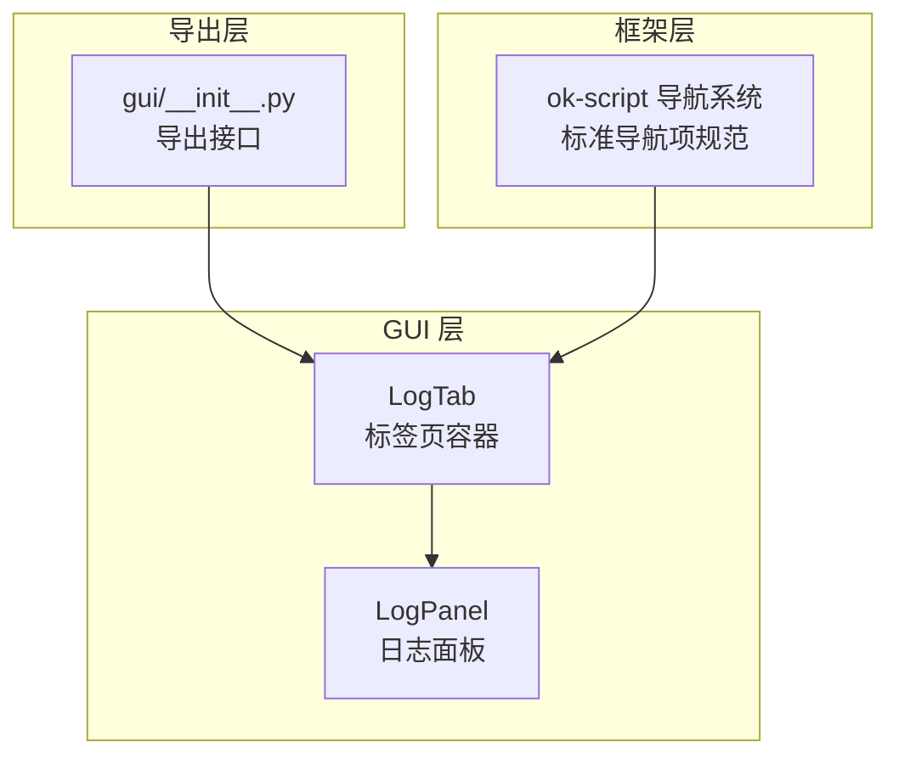
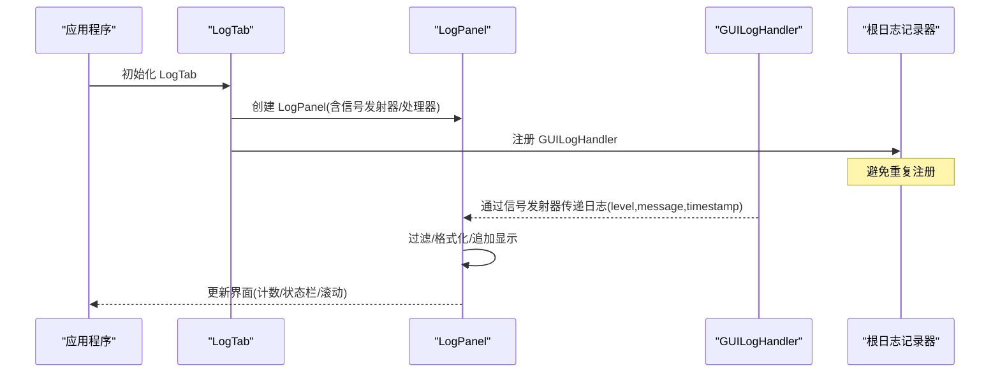
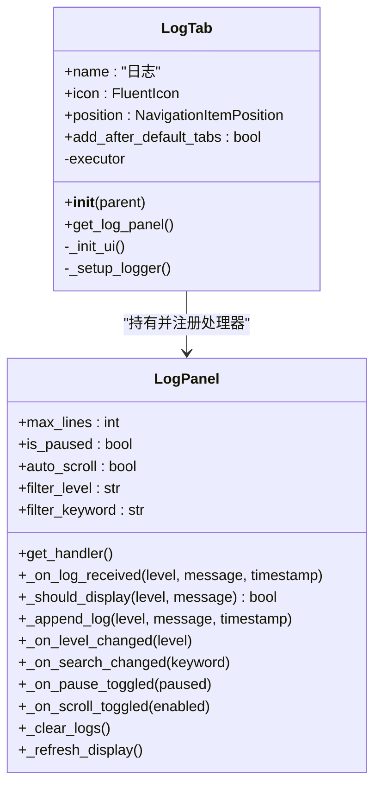
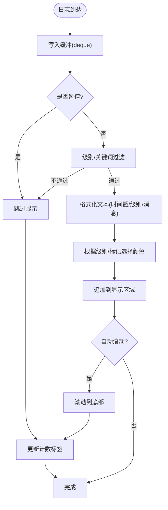
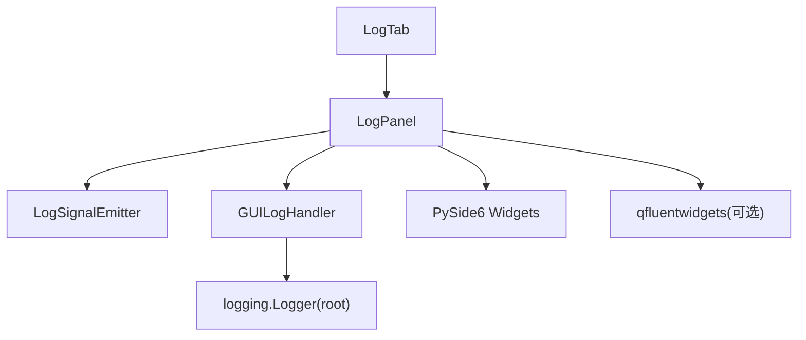

# 日志标签页组件

<cite>
**本文档引用的文件**
- [src/gui/log_tab.py](file://src/gui/log_tab.py)
- [src/gui/log_panel.py](file://src/gui/log_panel.py)
- [src/gui/__init__.py](file://src/gui/__init__.py)
- [src/task/BaseJumpTask.py](file://src/task/BaseJumpTask.py)
- [main.py](file://main.py)
</cite>

## 目录
1. [简介](#简介)
2. [项目结构](#项目结构)
3. [核心组件](#核心组件)
4. [架构总览](#架构总览)
5. [详细组件分析](#详细组件分析)
6. [依赖关系分析](#依赖关系分析)
7. [性能考虑](#性能考虑)
8. [故障排除指南](#故障排除指南)
9. [结论](#结论)
10. [附录](#附录)

## 简介
本文件为 OK-Jump 项目的日志标签页组件提供系统化技术文档，重点围绕 LogTab 类的实现架构与功能特性展开，涵盖标签页管理、多标签页支持、界面组织、创建/切换/销毁机制、与主窗口的集成方式与事件处理流程、自定义配置与样式设置方法，并给出实际使用场景与代码示例路径。

## 项目结构
日志标签页组件位于 GUI 层，采用“标签页 + 面板”的分层设计：
- 标签页层：LogTab 作为导航项，负责承载日志面板并注册全局日志处理器。
- 面板层：LogPanel 提供实时日志展示、过滤、搜索、暂停/恢复、自动滚动、清空等功能。
- 导出层：通过 src/gui/__init__.py 暴露 LogTab、LogPanel 及全局日志处理器设置接口。
- 主窗口集成：OK-Jump 的框架基于 ok-script，LogTab 作为标准导航项被框架识别与渲染。

图表来源
- [src/gui/log_tab.py:15-70](file://src/gui/log_tab.py#L15-L70)
- [src/gui/log_panel.py:58-388](file://src/gui/log_panel.py#L58-L388)
- [src/gui/__init__.py:5-9](file://src/gui/__init__.py#L5-L9)

章节来源
- [src/gui/log_tab.py:15-70](file://src/gui/log_tab.py#L15-L70)
- [src/gui/log_panel.py:58-388](file://src/gui/log_panel.py#L58-L388)
- [src/gui/__init__.py:5-9](file://src/gui/__init__.py#L5-L9)

## 核心组件
- LogTab：继承自 QWidget，实现 ok-script 导航项的标准接口（name、icon、position、add_after_default_tabs），内部持有 LogPanel 并注册根日志记录器的 GUI 处理器。
- LogPanel：继承自 QWidget，内置 LogSignalEmitter/GUILogHandler 实现线程安全日志接收与显示；提供级别过滤、关键词搜索、暂停/恢复、自动滚动、清空、等宽字体显示、状态栏统计等能力；支持全局单例获取与处理器注册。

章节来源
- [src/gui/log_tab.py:15-70](file://src/gui/log_tab.py#L15-L70)
- [src/gui/log_panel.py:29-388](file://src/gui/log_panel.py#L29-L388)

## 架构总览
LogTab 与 LogPanel 的协作遵循“观察者 + 处理器”模式：
- LogPanel 内部维护一个 GUILogHandler，将日志事件通过 Qt 信号发射器传递给 LogPanel 的槽函数。
- LogTab 在初始化时获取 LogPanel 的处理器并将其注册到根日志记录器，从而实现全局日志的实时展示。
- 导航系统通过 ok-script 的标准导航项规范识别 LogTab，使其出现在底部导航栏。

图表来源
- [src/gui/log_tab.py:28-66](file://src/gui/log_tab.py#L28-L66)
- [src/gui/log_panel.py:29-114](file://src/gui/log_panel.py#L29-L114)
- [src/gui/log_panel.py:248-251](file://src/gui/log_panel.py#L248-L251)

## 详细组件分析

### LogTab 类分析
- 标准导航项属性
  - name：标签页名称（用于导航显示）
  - icon：图标（FluentIcon.HISTORY）
  - position：导航位置（NavigationItemPosition.BOTTOM）
  - add_after_default_tabs：是否在默认标签页之后添加
- 生命周期
  - 初始化：设置 objectName、构建 UI、设置日志处理器
  - UI 初始化：创建垂直布局并加入 LogPanel
  - 日志处理器设置：获取 LogPanel 的处理器，避免重复注册，设置根日志记录器最低级别以捕获所有日志
  - 访问器：提供 get_log_panel() 返回面板实例
- 与框架集成
  - 通过 ok-script 导航系统识别标准属性，自动渲染到底部导航栏
  - 作为独立标签页存在，不参与任务执行，仅负责展示

图表来源
- [src/gui/log_tab.py:15-70](file://src/gui/log_tab.py#L15-L70)
- [src/gui/log_panel.py:58-352](file://src/gui/log_panel.py#L58-L352)

章节来源
- [src/gui/log_tab.py:15-70](file://src/gui/log_tab.py#L15-L70)

### LogPanel 类分析
- 数据结构与复杂度
  - 日志缓冲：使用 deque(maxlen=N)，插入/删除均摊 O(1)，内存占用 O(N)
  - 过滤：每次显示刷新时遍历缓冲，复杂度 O(M)，M 为缓冲长度
- 功能特性
  - 实时显示：等宽字体、深色主题背景、按级别/标记着色
  - 过滤与搜索：级别下拉过滤、关键词大小写无关匹配
  - 控制：暂停/恢复、自动滚动开关、清空日志
  - 状态栏：日志条数统计、运行状态提示、FPS 状态占位
- 线程安全
  - 通过 LogSignalEmitter 与 Qt 信号槽机制实现跨线程日志传递
- 样式与主题
  - 内置深色主题样式表
  - 支持 qfluentwidgets 或原生 PySide6 控件回退

图表来源
- [src/gui/log_panel.py:252-313](file://src/gui/log_panel.py#L252-L313)
- [src/gui/log_panel.py:272-284](file://src/gui/log_panel.py#L272-L284)

章节来源
- [src/gui/log_panel.py:29-388](file://src/gui/log_panel.py#L29-L388)

### 标签页创建、切换与销毁机制
- 创建
  - LogTab 初始化时创建 LogPanel 并注册处理器
  - 导航系统通过标准属性自动渲染
- 切换
  - 底部导航栏点击触发标签页切换，LogTab 作为独立页面存在，无额外切换逻辑
- 销毁
  - LogTab 作为长期存在的标签页，通常不销毁；LogPanel 的日志缓冲与控件在窗口关闭时由 Qt 自动回收

章节来源
- [src/gui/log_tab.py:28-46](file://src/gui/log_tab.py#L28-L46)
- [src/gui/log_panel.py:95-114](file://src/gui/log_panel.py#L95-L114)

### 与主窗口的集成方式与事件处理流程
- 导出与导入
  - 通过 src/gui/__init__.py 将 LogTab、LogPanel 及全局处理器设置函数导出，供上层模块使用
- 事件处理
  - 日志事件经 GUILogHandler emit 至 LogSignalEmitter，再由 LogPanel 的槽函数统一处理
  - 用户交互事件（过滤、搜索、暂停、清空、滚动）通过信号槽驱动面板状态更新与界面刷新
- 主窗口任务
  - MainWindowTask 等任务类通过 logging 记录器输出日志，LogTab 通过注册的处理器自动接收并显示

章节来源
- [src/gui/__init__.py:5-9](file://src/gui/__init__.py#L5-L9)
- [src/gui/log_panel.py:29-114](file://src/gui/log_panel.py#L29-L114)
- [src/task/BaseJumpTask.py:14-422](file://src/task/BaseJumpTask.py#L14-L422)

### 自定义配置与样式设置方法
- 配置项
  - 最大日志行数：LogPanel 构造函数的 max_lines 参数
  - 过滤级别：ComboBox 下拉选择 DEBUG/INFO/WARNING/ERROR
  - 关键词过滤：LineEdit 输入关键词，大小写无关匹配
  - 暂停/恢复：ToggleButton 控制显示更新
  - 自动滚动：ToggleButton 控制滚动行为
- 样式设置
  - LogPanel 内置深色主题样式表，适用于暗色界面
  - 等宽字体设置（Consolas/Courier New），保证日志对齐
  - 级别与标记颜色映射，便于快速识别日志类型与关键信息
- 全局处理器注册
  - 通过 get_log_panel()/setup_log_panel_handler() 获取/注册处理器，避免重复注册

章节来源
- [src/gui/log_panel.py:95-114](file://src/gui/log_panel.py#L95-L114)
- [src/gui/log_panel.py:145-204](file://src/gui/log_panel.py#L145-L204)
- [src/gui/log_panel.py:236-247](file://src/gui/log_panel.py#L236-L247)
- [src/gui/log_panel.py:358-388](file://src/gui/log_panel.py#L358-L388)

### 实际使用场景与代码示例
- 场景一：在主窗口中启用日志标签页
  - 导入 LogTab：参考 [src/gui/__init__.py:6](file://src/gui/__init__.py#L6)
  - 在导航系统中注册：LogTab 符合 ok-script 标准属性，自动渲染
- 场景二：为现有任务输出日志并显示
  - 任务类继承 BaseJumpTask，使用 self.logger 输出日志（参见 [src/task/BaseJumpTask.py:14](file://src/task/BaseJumpTask.py#L14)）
  - LogTab 会在初始化时注册处理器，自动捕获并显示日志
- 场景三：自定义日志处理器与全局面板
  - 获取全局面板：参考 [src/gui/log_panel.py:358-363](file://src/gui/log_panel.py#L358-L363)
  - 注册处理器到指定 logger：参考 [src/gui/log_panel.py:366-387](file://src/gui/log_panel.py#L366-L387)

章节来源
- [src/gui/__init__.py:5-9](file://src/gui/__init__.py#L5-L9)
- [src/gui/log_panel.py:358-388](file://src/gui/log_panel.py#L358-L388)
- [src/task/BaseJumpTask.py:14-422](file://src/task/BaseJumpTask.py#L14-L422)

## 依赖关系分析
- 组件耦合
  - LogTab 与 LogPanel 强耦合（组合关系），LogTab 持有 LogPanel 并负责注册处理器
  - LogPanel 与 Qt 信号槽强耦合（LogSignalEmitter/GUILogHandler）
- 外部依赖
  - PySide6：UI 控件与信号槽
  - qfluentwidgets：可选的 Fluent 控件（若缺失则回退至原生控件）
  - logging：标准日志记录器

图表来源
- [src/gui/log_tab.py:12-36](file://src/gui/log_tab.py#L12-L36)
- [src/gui/log_panel.py:29-114](file://src/gui/log_panel.py#L29-L114)

章节来源
- [src/gui/log_tab.py:12-36](file://src/gui/log_tab.py#L12-L36)
- [src/gui/log_panel.py:29-114](file://src/gui/log_panel.py#L29-L114)

## 性能考虑
- 日志缓冲：使用 deque 限制最大行数，避免内存无限增长
- 显示优化：自动滚动仅在开启时触发，减少滚动条频繁更新
- 过滤策略：级别与关键词过滤在刷新时批量应用，复杂度与缓冲长度线性相关
- 字体与渲染：等宽字体与固定块上限有助于提升渲染效率
- 建议
  - 对高频日志场景，建议在业务侧进行采样或聚合，降低 UI 压力
  - 合理设置 max_lines，平衡历史记录与内存占用

## 故障排除指南
- 症状：日志未显示
  - 排查：确认 LogTab 已初始化且已注册处理器；检查根日志记录器级别是否低于 DEBUG
  - 参考：[src/gui/log_tab.py:47-66](file://src/gui/log_tab.py#L47-L66)
- 症状：重复日志
  - 排查：确认避免重复注册逻辑是否生效
  - 参考：[src/gui/log_tab.py:56-61](file://src/gui/log_tab.py#L56-L61)
- 症状：界面控件缺失或样式异常
  - 排查：qfluentwidgets 是否可用；若不可用，将回退至原生控件
  - 参考：[src/gui/log_panel.py:18-27](file://src/gui/log_panel.py#L18-L27)
- 症状：暂停后无法恢复显示
  - 排查：检查 is_paused 状态与刷新逻辑
  - 参考：[src/gui/log_panel.py:324-333](file://src/gui/log_panel.py#L324-L333)

章节来源
- [src/gui/log_tab.py:47-66](file://src/gui/log_tab.py#L47-L66)
- [src/gui/log_tab.py:56-61](file://src/gui/log_tab.py#L56-L61)
- [src/gui/log_panel.py:18-27](file://src/gui/log_panel.py#L18-L27)
- [src/gui/log_panel.py:324-333](file://src/gui/log_panel.py#L324-L333)

## 结论
LogTab 与 LogPanel 构成 OK-Jump 的日志可视化基础设施：前者负责标签页生命周期与处理器注册，后者负责高性能、可配置的日志展示。二者配合 ok-script 导航系统，实现了开箱即用的日志监控体验。通过合理的配置与样式设置，可在不同环境下获得一致的用户体验。

## 附录
- 相关文件路径
  - 标签页实现：[src/gui/log_tab.py](file://src/gui/log_tab.py)
  - 面板实现：[src/gui/log_panel.py](file://src/gui/log_panel.py)
  - 导出接口：[src/gui/__init__.py](file://src/gui/__init__.py)
  - 任务基类（日志输出示例）：[src/task/BaseJumpTask.py](file://src/task/BaseJumpTask.py)
  - 主程序入口（框架启动）：[main.py](file://main.py)