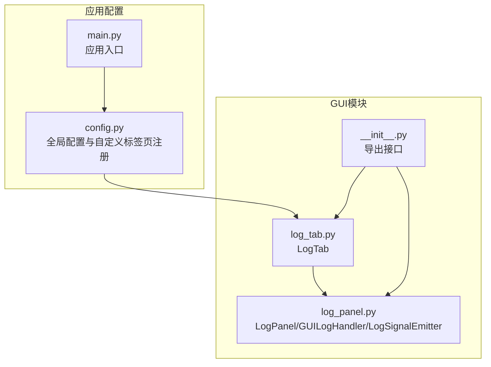
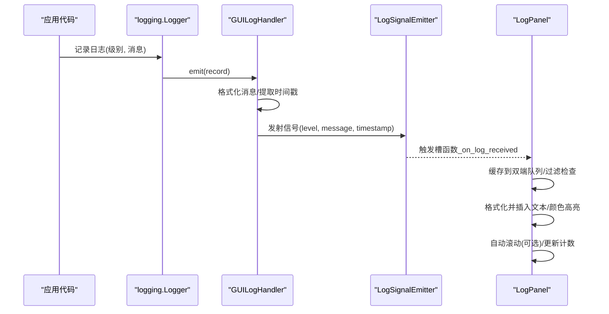
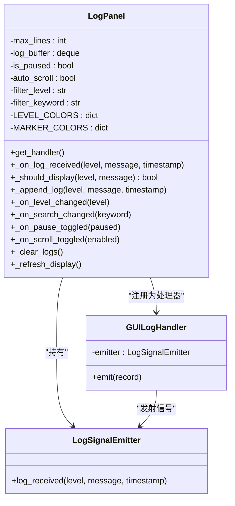
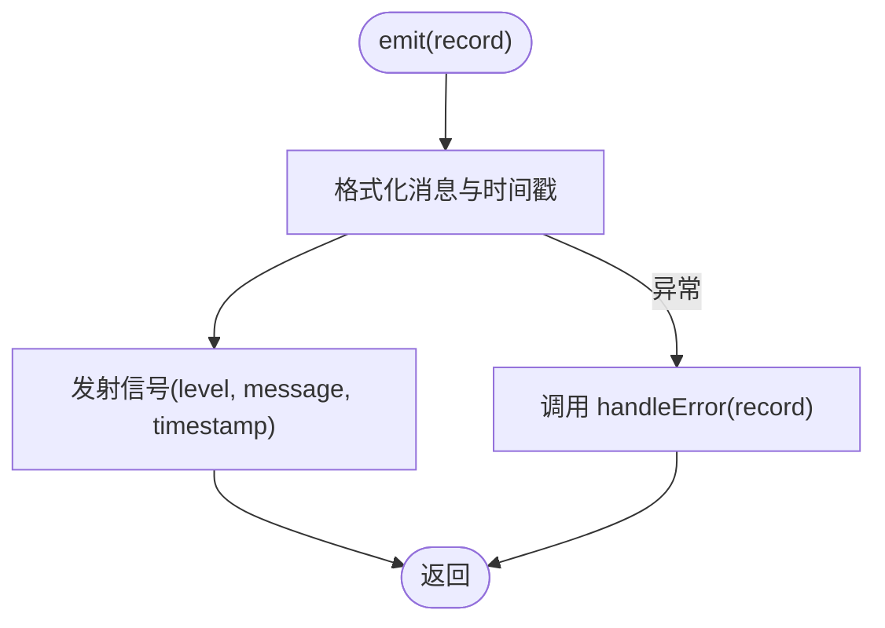
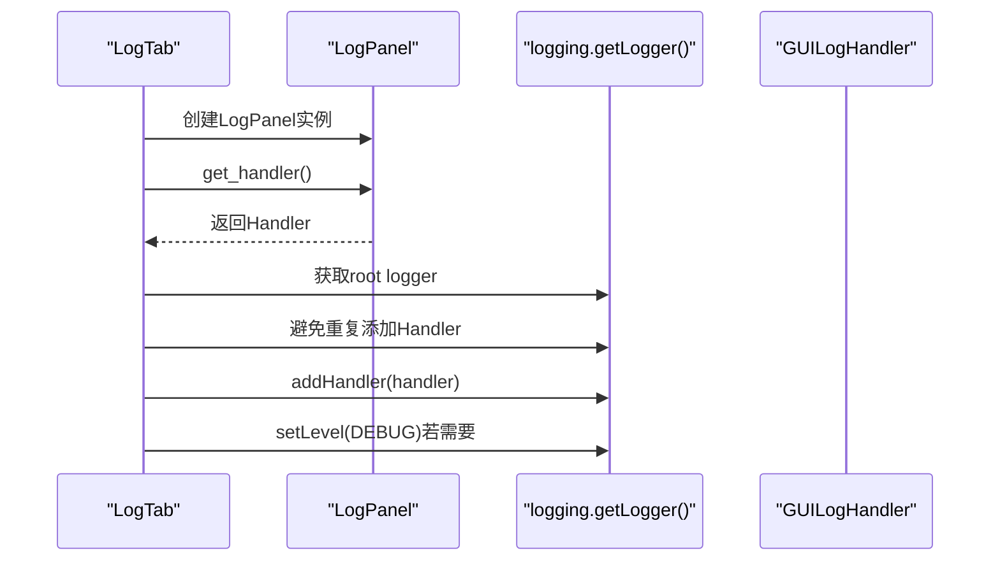
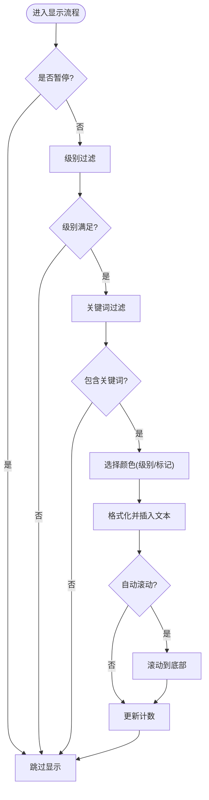
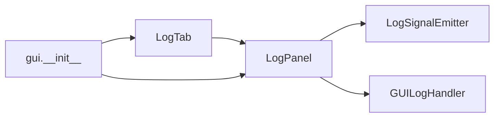

# 日志面板组件

<cite>
**本文引用的文件**
- [src/gui/log_panel.py](file://src/gui/log_panel.py)
- [src/gui/log_tab.py](file://src/gui/log_tab.py)
- [src/gui/__init__.py](file://src/gui/__init__.py)
- [config.py](file://config.py)
- [main.py](file://main.py)
</cite>

## 目录
1. [简介](#简介)
2. [项目结构](#项目结构)
3. [核心组件](#核心组件)
4. [架构总览](#架构总览)
5. [详细组件分析](#详细组件分析)
6. [依赖关系分析](#依赖关系分析)
7. [性能考虑](#性能考虑)
8. [故障排查指南](#故障排查指南)
9. [结论](#结论)
10. [附录](#附录)

## 简介
本文件面向OK-Jump项目的日志面板组件，系统性阐述LogPanel类的设计与实现，包括实时日志显示、级别过滤、关键词搜索、自动滚动、暂停/恢复、清空日志等功能；深入解析GUILogHandler日志处理器的线程安全机制；阐明LogSignalEmitter信号发射器的作用与实现方式；并提供配置选项、样式定制与性能优化建议，以及使用示例与最佳实践。

## 项目结构
日志面板组件位于src/gui目录下，由三个主要文件组成：
- log_panel.py：日志面板核心实现，包含LogPanel、GUILogHandler、LogSignalEmitter及全局便捷函数
- log_tab.py：基于ok-script框架的导航标签页封装，负责将日志面板集成到GUI界面
- __init__.py：导出日志面板相关接口，便于外部模块按需导入

图表来源
- [src/gui/log_panel.py:1-388](file://src/gui/log_panel.py#L1-L388)
- [src/gui/log_tab.py:1-70](file://src/gui/log_tab.py#L1-L70)
- [src/gui/__init__.py:1-8](file://src/gui/__init__.py#L1-L8)
- [config.py:143-145](file://config.py#L143-L145)
- [main.py:99-107](file://main.py#L99-L107)

章节来源
- [src/gui/log_panel.py:1-388](file://src/gui/log_panel.py#L1-L388)
- [src/gui/log_tab.py:1-70](file://src/gui/log_tab.py#L1-L70)
- [src/gui/__init__.py:1-8](file://src/gui/__init__.py#L1-L8)
- [config.py:143-145](file://config.py#L143-L145)
- [main.py:99-107](file://main.py#L99-L107)

## 核心组件
- LogPanel：实时日志监控面板，提供UI控件、过滤逻辑、显示格式化与滚动控制
- GUILogHandler：日志处理器，将logging记录通过信号转发至UI线程
- LogSignalEmitter：信号发射器，承载线程间通信的信号对象
- LogTab：ok-script框架的导航标签页，负责将LogPanel嵌入GUI并注册日志处理器
- 全局便捷函数：get_log_panel、setup_log_panel_handler，简化日志面板的获取与注册

章节来源
- [src/gui/log_panel.py:29-387](file://src/gui/log_panel.py#L29-L387)
- [src/gui/log_tab.py:15-69](file://src/gui/log_tab.py#L15-L69)
- [src/gui/__init__.py:5-6](file://src/gui/__init__.py#L5-L6)

## 架构总览
日志从任意logger产生，经由GUILogHandler格式化并发出信号，LogPanel在UI线程接收信号，进行级别与关键词过滤、颜色高亮、追加显示与自动滚动控制。

图表来源
- [src/gui/log_panel.py:34-56](file://src/gui/log_panel.py#L34-L56)
- [src/gui/log_panel.py:29-31](file://src/gui/log_panel.py#L29-L31)
- [src/gui/log_panel.py:252-271](file://src/gui/log_panel.py#L252-L271)

## 详细组件分析

### LogPanel类设计与实现
- 职责边界
  - UI构建：标题栏、工具栏（级别过滤、关键词搜索）、日志显示区域、状态栏
  - 数据缓存：使用双端队列保存历史日志，限制最大行数
  - 过滤与展示：按级别阈值与关键词过滤，支持特殊标记颜色高亮
  - 用户交互：暂停/恢复、清空日志、自动滚动开关
- 关键字段与策略
  - 级别颜色映射：不同日志级别对应不同颜色
  - 特殊标记颜色：对包含特定emoji标记的消息进行高亮
  - 最大行数：通过QPlainTextEdit的MaximumBlockCount与deque上限双重保障
  - 自动滚动：在追加新日志时滚动到底部
- 线程安全
  - 通过信号槽机制在UI线程中处理日志，避免直接在工作线程操作UI控件
- 性能要点
  - 使用双端队列作为环形缓冲，避免内存无限增长
  - 文本插入采用光标定位+批量插入，减少布局计算
  - 字体设置为等宽字体，提升可读性与渲染效率

图表来源
- [src/gui/log_panel.py:29-31](file://src/gui/log_panel.py#L29-L31)
- [src/gui/log_panel.py:34-47](file://src/gui/log_panel.py#L34-L47)
- [src/gui/log_panel.py:58-351](file://src/gui/log_panel.py#L58-L351)

章节来源
- [src/gui/log_panel.py:58-351](file://src/gui/log_panel.py#L58-L351)

### GUILogHandler日志处理器
- 设计目标
  - 将logging记录转换为UI可消费的信号，确保线程安全
- 关键实现
  - emit方法中格式化消息与时间戳，然后通过LogSignalEmitter发出信号
  - 捕获异常并通过handleError回调，保证日志链路不中断
- 线程安全机制
  - 信号槽天然跨线程安全，避免在工作线程直接访问UI控件
  - 仅在UI线程中执行日志追加与显示逻辑

图表来源
- [src/gui/log_panel.py:49-55](file://src/gui/log_panel.py#L49-L55)

章节来源
- [src/gui/log_panel.py:34-56](file://src/gui/log_panel.py#L34-L56)

### LogSignalEmitter信号发射器
- 作用
  - 作为QObject，定义log_received信号，承载日志级别、消息与时间戳
- 与LogPanel的协作
  - LogPanel在构造时创建emitter并连接其信号到槽函数
  - GUILogHandler在emit中调用emitter.log_received.emit

章节来源
- [src/gui/log_panel.py:29-31](file://src/gui/log_panel.py#L29-L31)
- [src/gui/log_panel.py:105-110](file://src/gui/log_panel.py#L105-L110)

### LogTab标签页与集成
- 职责
  - 将LogPanel嵌入ok-script框架的底部导航
  - 注册日志处理器到root logger，确保全局日志可见
- 关键点
  - 避免重复添加同一类型的处理器
  - 若root logger级别过高，会将其降为DEBUG以捕获所有日志

图表来源
- [src/gui/log_tab.py:38-66](file://src/gui/log_tab.py#L38-L66)
- [src/gui/log_panel.py:248-250](file://src/gui/log_panel.py#L248-L250)

章节来源
- [src/gui/log_tab.py:15-69](file://src/gui/log_tab.py#L15-L69)

### 过滤与搜索逻辑
- 级别过滤
  - 以DEBUG/INFO/WARNING/ERROR顺序比较，仅显示不低于当前阈值的日志
- 关键词过滤
  - 不区分大小写匹配消息内容
- 特殊标记高亮
  - 包含预设emoji标记的消息将使用对应颜色高亮

图表来源
- [src/gui/log_panel.py:272-283](file://src/gui/log_panel.py#L272-L283)
- [src/gui/log_panel.py:285-312](file://src/gui/log_panel.py#L285-L312)
- [src/gui/log_panel.py:269-270](file://src/gui/log_panel.py#L269-L270)

章节来源
- [src/gui/log_panel.py:272-312](file://src/gui/log_panel.py#L272-L312)

## 依赖关系分析
- 内部依赖
  - LogTab依赖LogPanel；LogPanel内部组合LogSignalEmitter与GUILogHandler
  - 全局导出接口由__init__.py统一暴露
- 外部依赖
  - PySide6用于UI与信号槽
  - qfluentwidgets用于增强UI控件（若可用则优先使用）
  - logging标准库用于日志记录

图表来源
- [src/gui/log_tab.py:12-12](file://src/gui/log_tab.py#L12-L12)
- [src/gui/log_panel.py:105-110](file://src/gui/log_panel.py#L105-L110)
- [src/gui/__init__.py:5-6](file://src/gui/__init__.py#L5-L6)

章节来源
- [src/gui/log_tab.py:12-12](file://src/gui/log_tab.py#L12-L12)
- [src/gui/log_panel.py:105-110](file://src/gui/log_panel.py#L105-L110)
- [src/gui/__init__.py:5-6](file://src/gui/__init__.py#L5-L6)

## 性能考虑
- 内存与显示
  - 使用deque作为环形缓冲，配合QPlainTextEdit的MaximumBlockCount上限，避免无限增长
  - 等宽字体提升可读性，同时利于快速渲染
- UI线程压力
  - 所有UI更新通过信号槽在UI线程执行，避免频繁重绘
  - 自动滚动仅在新增日志时触发，可关闭以降低滚动开销
- 过滤成本
  - 级别过滤为常量时间比较；关键词过滤为字符串包含检查，建议合理设置关键词长度
- 可选UI库
  - 若未安装qfluentwidgets，将回退到原生PySide6控件，不影响功能

章节来源
- [src/gui/log_panel.py:95-103](file://src/gui/log_panel.py#L95-L103)
- [src/gui/log_panel.py:208-217](file://src/gui/log_panel.py#L208-L217)
- [src/gui/log_panel.py:309-312](file://src/gui/log_panel.py#L309-L312)

## 故障排查指南
- 日志未显示
  - 确认已调用setup_log_panel_handler或在LogTab中完成处理器注册
  - 检查root logger级别是否高于DEBUG
- 重复日志
  - LogTab与setup_log_panel_handler均会避免重复添加同类型处理器
- UI卡顿
  - 关闭“自动滚动”，或增大max_lines以减少频繁滚动
  - 减少高频日志输出，或提高级别阈值
- 样式异常
  - 若未安装qfluentwidgets，部分控件会回退为原生控件，样式略有差异

章节来源
- [src/gui/log_tab.py:55-65](file://src/gui/log_tab.py#L55-L65)
- [src/gui/log_panel.py:366-387](file://src/gui/log_panel.py#L366-L387)

## 结论
日志面板组件通过清晰的职责划分与信号槽机制，实现了线程安全的日志显示与灵活的过滤能力。LogPanel提供了完备的UI交互与性能优化策略，GUILogHandler与LogSignalEmitter确保了跨线程通信的可靠性。结合LogTab的框架集成，开发者可以轻松地将实时日志监控接入OK-Jump的GUI体系。

## 附录

### 配置选项与参数
- LogPanel构造参数
  - max_lines：最大显示行数，默认1000（可在LogTab中设置为2000）
- 过滤与显示
  - 级别过滤：DEBUG/INFO/WARNING/ERROR（CRITICAL未在UI中直接选择）
  - 关键词搜索：不区分大小写
  - 自动滚动：默认开启
  - 暂停/恢复：默认关闭
- 样式定制
  - 日志显示区域背景色、文字颜色、边框与圆角
  - 等宽字体设置
  - 级别与特殊标记的颜色映射表

章节来源
- [src/gui/log_panel.py:95-103](file://src/gui/log_panel.py#L95-L103)
- [src/gui/log_panel.py:236-246](file://src/gui/log_panel.py#L236-L246)
- [src/gui/log_panel.py:71-93](file://src/gui/log_panel.py#L71-L93)
- [src/gui/log_tab.py:44-44](file://src/gui/log_tab.py#L44-L44)

### 使用示例与最佳实践
- 在ok-script框架中启用日志标签页
  - 在全局配置中注册自定义标签页，即可在底部导航看到“日志”标签
- 全局注册日志处理器
  - 调用全局函数setup_log_panel_handler，将处理器添加到root logger
  - 或在LogTab初始化时自动完成注册
- 在业务代码中记录日志
  - 使用标准logging记录日志，级别与消息将自动出现在面板中
  - 建议在关键流程中加入特殊标记emoji，便于快速定位
- 性能优化建议
  - 高频场景下提高级别阈值或关闭自动滚动
  - 合理设置max_lines，平衡内存占用与历史记录需求
  - 避免在UI线程中执行耗时操作，保持面板响应流畅

章节来源
- [config.py:143-145](file://config.py#L143-L145)
- [src/gui/log_tab.py:47-66](file://src/gui/log_tab.py#L47-L66)
- [src/gui/log_panel.py:366-387](file://src/gui/log_panel.py#L366-L387)