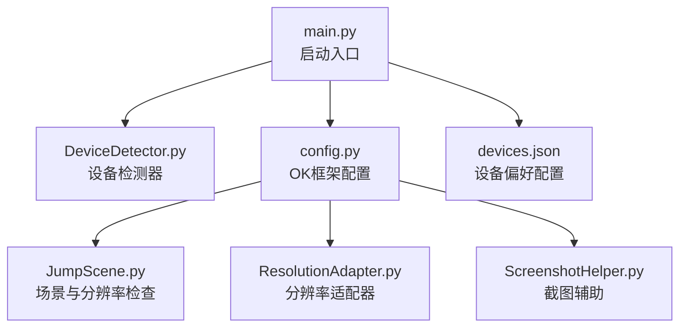
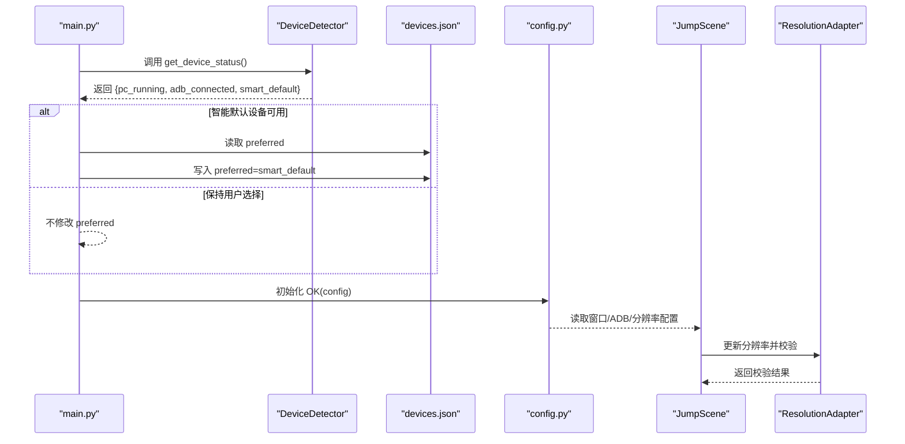
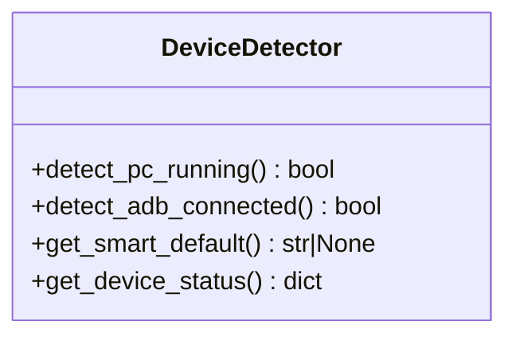
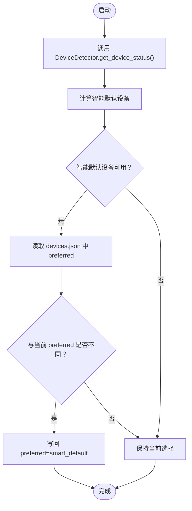
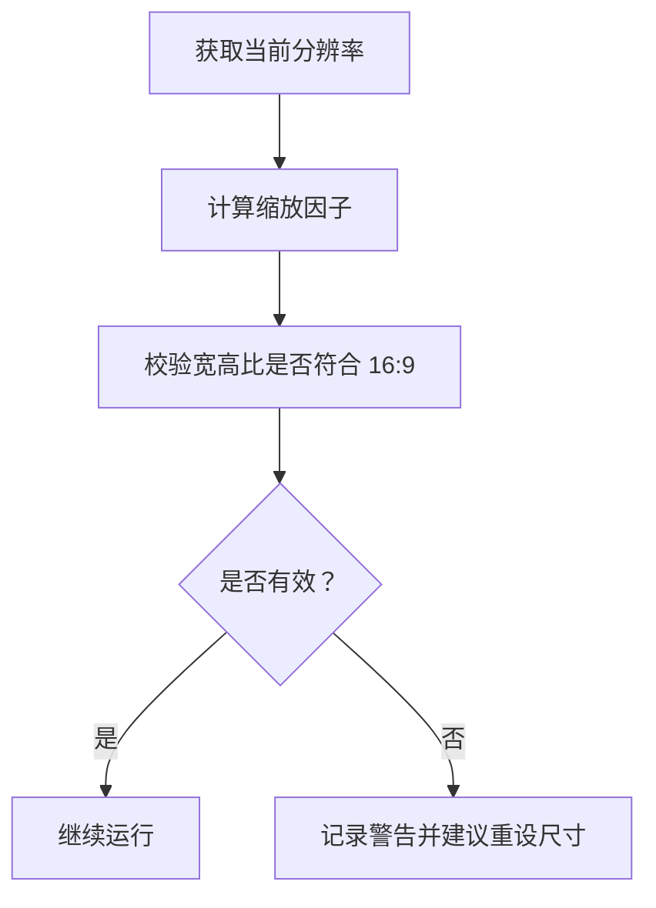
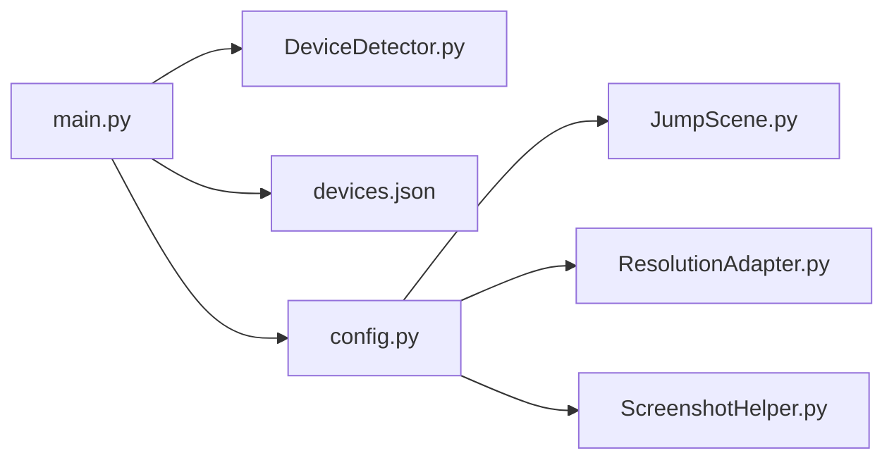

# 多设备支持

<cite>
**本文引用的文件**
- [main.py](file://main.py)
- [DeviceDetector.py](file://src/utils/DeviceDetector.py)
- [devices.json](file://configs/devices.json)
- [config.py](file://config.py)
- [JumpScene.py](file://src/scene/JumpScene.py)
- [ResolutionAdapter.py](file://src/utils/ResolutionAdapter.py)
- [ScreenshotHelper.py](file://src/utils/ScreenshotHelper.py)
</cite>

## 目录
1. [简介](#简介)
2. [项目结构](#项目结构)
3. [核心组件](#核心组件)
4. [架构总览](#架构总览)
5. [详细组件分析](#详细组件分析)
6. [依赖关系分析](#依赖关系分析)
7. [性能考虑](#性能考虑)
8. [故障排除指南](#故障排除指南)
9. [结论](#结论)
10. [附录](#附录)

## 简介
本文件面向“OK-Jump”的多设备支持能力，围绕以下目标展开：
- 解释 PC 版游戏与 Android 模拟器的检测机制
- 详解智能设备选择算法的实现原理与决策逻辑
- 阐述 ADB 通信协议的使用与设备连接状态检测
- 说明设备配置管理与手动切换功能
- 提供设备兼容性检查与故障排除方法
- 给出不同设备环境下的配置建议与优化方案

## 项目结构
OK-Jump 在启动阶段通过主入口进行“智能设备选择”，随后由 OK 框架读取配置并初始化设备捕获与交互层。多设备支持的关键路径如下：
- 主入口负责在 OK 初始化前执行智能选择与补丁注入
- 设备检测器负责判断 PC 游戏窗口与 ADB 设备连接状态
- 配置文件 devices.json 存储首选设备与捕获方式等信息
- OK 配置文件 config.py 定义窗口、ADB、分辨率等全局参数
- 场景与分辨率适配模块负责分辨率与比例校验

图表来源
- [main.py:100-106](file://main.py#L100-L106)
- [DeviceDetector.py:11-148](file://src/utils/DeviceDetector.py#L11-L148)
- [config.py:68-148](file://config.py#L68-L148)
- [devices.json:1-7](file://configs/devices.json#L1-L7)
- [JumpScene.py:197-215](file://src/scene/JumpScene.py#L197-L215)
- [ResolutionAdapter.py:4-162](file://src/utils/ResolutionAdapter.py#L4-L162)
- [ScreenshotHelper.py:7-68](file://src/utils/ScreenshotHelper.py#L7-L68)

章节来源
- [main.py:100-106](file://main.py#L100-L106)
- [config.py:68-148](file://config.py#L68-L148)

## 核心组件
- 智能设备选择器：在应用启动前根据当前环境自动更新首选设备
- 设备检测器：检测 PC 游戏窗口与 ADB 设备连接状态，输出智能默认设备
- 设备配置文件：存储 preferred、pc_full_path、capture 等关键字段
- OK 配置：定义窗口标题、捕获方式、ADB 包名、分辨率策略等
- 分辨率适配器：校验与缩放坐标，推荐合适分辨率
- 截图辅助：保存截图与特征模板，便于调试与标注

章节来源
- [main.py:54-94](file://main.py#L54-L94)
- [DeviceDetector.py:11-148](file://src/utils/DeviceDetector.py#L11-L148)
- [devices.json:1-7](file://configs/devices.json#L1-L7)
- [config.py:68-148](file://config.py#L68-L148)
- [ResolutionAdapter.py:4-162](file://src/utils/ResolutionAdapter.py#L4-L162)
- [ScreenshotHelper.py:7-68](file://src/utils/ScreenshotHelper.py#L7-L68)

## 架构总览
下图展示从启动到设备选择与配置生效的整体流程。

图表来源
- [main.py:54-94](file://main.py#L54-L94)
- [DeviceDetector.py:137-148](file://src/utils/DeviceDetector.py#L137-L148)
- [devices.json:1-7](file://configs/devices.json#L1-L7)
- [config.py:68-148](file://config.py#L68-L148)
- [JumpScene.py:197-215](file://src/scene/JumpScene.py#L197-L215)
- [ResolutionAdapter.py:34-44](file://src/utils/ResolutionAdapter.py#L34-L44)

## 详细组件分析

### 设备检测器（DeviceDetector）
- PC 版游戏检测：通过枚举窗口标题，匹配关键词并排除模拟器与工具自身窗口，最终判定是否存在 PC 游戏窗口
- ADB 设备检测：优先使用 adbutils 包列出设备；若不可用则回退到系统 adb devices 命令解析
- 智能默认设备：仅当“PC 运行”与“ADB 连接”互斥时返回 'pc' 或 'adb'，否则返回 None 以保持用户选择
- 设备状态查询：返回包含三项指标的字典，便于调试与日志输出

图表来源
- [DeviceDetector.py:11-148](file://src/utils/DeviceDetector.py#L11-L148)

章节来源
- [DeviceDetector.py:28-68](file://src/utils/DeviceDetector.py#L28-L68)
- [DeviceDetector.py:70-110](file://src/utils/DeviceDetector.py#L70-L110)
- [DeviceDetector.py:112-134](file://src/utils/DeviceDetector.py#L112-L134)
- [DeviceDetector.py:137-148](file://src/utils/DeviceDetector.py#L137-L148)

### 智能设备选择（main.py）
- 执行时机：必须在 OK(config) 初始化前调用，否则对 devices.json 的修改不会生效
- 功能：读取设备状态，比较 preferred 与智能默认值，必要时写回 devices.json
- 日志：打印 PC 与 ADB 状态及切换结果，便于排查

图表来源
- [main.py:54-94](file://main.py#L54-L94)
- [DeviceDetector.py:137-148](file://src/utils/DeviceDetector.py#L137-L148)
- [devices.json:1-7](file://configs/devices.json#L1-L7)

章节来源
- [main.py:54-94](file://main.py#L54-L94)

### 设备配置管理（devices.json 与 config.py）
- devices.json 关键字段
  - preferred：首选设备，'pc' 或 'adb'
  - pc_full_path：PC 游戏可执行文件完整路径
  - capture：捕获方式（如 'adb'）
  - selected_exe、selected_hwnd：保留字段或历史字段
- config.py 关键配置
  - windows：窗口标题、类名、交互方式、捕获方法、后台模式开关
  - adb：启用 ADB、目标包名
  - supported_resolution：支持的比例、最小尺寸、推荐重设尺寸
  - reference_resolution：参考分辨率
  - screenshots_folder：截图保存目录

章节来源
- [devices.json:1-7](file://configs/devices.json#L1-L7)
- [config.py:68-148](file://config.py#L68-L148)

### ADB 通信与设备连接检测
- 优先使用 adbutils 包列出设备，快速判断 ADB 连接状态
- 若未安装 adbutils，则回退到系统 adb devices 命令，解析输出中的设备行
- 错误处理：捕获导入异常与命令执行异常，保证稳定性

章节来源
- [DeviceDetector.py:80-110](file://src/utils/DeviceDetector.py#L80-L110)

### 分辨率适配与兼容性检查（JumpScene 与 ResolutionAdapter）
- 分辨率适配器根据当前分辨率与参考分辨率计算缩放因子，并校验宽高比
- 场景模块在渲染前检查分辨率有效性，给出不兼容警告并建议重设尺寸
- 支持按配置推荐重设尺寸，兼顾不同硬件条件

图表来源
- [ResolutionAdapter.py:34-44](file://src/utils/ResolutionAdapter.py#L34-L44)
- [JumpScene.py:206-215](file://src/scene/JumpScene.py#L206-L215)

章节来源
- [ResolutionAdapter.py:19-44](file://src/utils/ResolutionAdapter.py#L19-L44)
- [JumpScene.py:197-215](file://src/scene/JumpScene.py#L197-L215)

### 截图与调试辅助（ScreenshotHelper）
- 提供截图保存、特征模板提取、COCO 注解生成等能力
- 便于在不同设备环境下定位识别问题与优化模板

章节来源
- [ScreenshotHelper.py:17-64](file://src/utils/ScreenshotHelper.py#L17-L64)

## 依赖关系分析
- main.py 依赖 DeviceDetector 进行设备状态检测与智能默认设备计算
- OK 配置（config.py）为设备捕获、窗口交互、ADB 与分辨率策略提供依据
- JumpScene 与 ResolutionAdapter 依赖 OK 配置中的分辨率与参考分辨率参数
- devices.json 作为首选设备的持久化配置，受 main.py 的智能选择影响

图表来源
- [main.py:54-94](file://main.py#L54-L94)
- [DeviceDetector.py:11-148](file://src/utils/DeviceDetector.py#L11-L148)
- [devices.json:1-7](file://configs/devices.json#L1-L7)
- [config.py:68-148](file://config.py#L68-L148)
- [JumpScene.py:197-215](file://src/scene/JumpScene.py#L197-L215)
- [ResolutionAdapter.py:4-162](file://src/utils/ResolutionAdapter.py#L4-L162)
- [ScreenshotHelper.py:7-68](file://src/utils/ScreenshotHelper.py#L7-L68)

章节来源
- [main.py:54-94](file://main.py#L54-L94)
- [config.py:68-148](file://config.py#L68-L148)

## 性能考虑
- 启动阶段的设备检测与配置写回仅在首次启动时发生，对整体启动时间影响有限
- ADB 检测采用超时控制与回退机制，避免阻塞
- 分辨率适配与相对坐标换算为轻量计算，通常不影响实时性能
- 建议在后台模式下适当提高触发间隔，降低 CPU/GPU 占用

## 故障排除指南
- 无法检测到 ADB 设备
  - 确认已安装 adbutils 或系统 adb，并在 PATH 中可用
  - 检查模拟器 ADB 是否正常，设备状态是否为 device
  - 查看日志中 ADB 命令输出与异常栈
- PC 窗口未被识别
  - 确认游戏窗口标题与关键词匹配
  - 排除工具自身窗口与模拟器窗口干扰
  - 如需自定义关键词，可在检测器中扩展匹配规则
- 智能默认设备未切换
  - 确保在 OK(config) 初始化前调用智能设备选择
  - 检查 devices.json 权限与写回是否成功
- 分辨率不兼容导致识别异常
  - 使用场景模块提供的分辨率检查与建议
  - 按推荐尺寸重设窗口分辨率
- 后台模式窗口位置错误
  - 启用跳过位置检查的补丁，允许最小化或屏幕外窗口
  - 确认窗口类名与交互方式配置正确

章节来源
- [DeviceDetector.py:80-110](file://src/utils/DeviceDetector.py#L80-L110)
- [main.py:29-51](file://main.py#L29-L51)
- [config.py:94-101](file://config.py#L94-L101)
- [JumpScene.py:206-215](file://src/scene/JumpScene.py#L206-L215)

## 结论
OK-Jump 的多设备支持通过“启动前智能选择 + 配置持久化 + OK 框架集成”的方式，实现了对 PC 与模拟器环境的无缝适配。设备检测器提供了可靠的运行时判断，devices.json 与 config.py 则共同保障了配置的一致性与可维护性。配合分辨率适配与截图辅助工具，用户可以在不同设备环境下获得稳定且高效的自动化体验。

## 附录
- 不同设备环境下的配置建议
  - PC 环境：设置 preferred='pc'，确保窗口标题与类名匹配，启用后台模式与伪最小化
  - 模拟器环境：设置 preferred='adb'，配置 adb 包名与捕获方式，确保 ADB 设备状态为 device
  - 兼容性：优先使用 16:9 比例与推荐分辨率，避免识别漂移
- 优化方案
  - 合理设置触发间隔，降低资源占用
  - 使用截图辅助提取特征模板，提升识别鲁棒性
  - 在不稳定环境中启用后台模式补丁，减少窗口位置带来的干扰