# 子代理驱动开发技能

<cite>
**本文档引用的文件**
- [README.md](file://README.md)
- [main.py](file://main.py)
- [config.py](file://config.py)
- [src/__init__.py](file://src/__init__.py)
- [src/globals.py](file://src/globals.py)
- [src/task/BaseJumpTask.py](file://src/task/BaseJumpTask.py)
- [src/task/mixins.py](file://src/task/mixins.py)
- [src/task/AutoLoginTask.py](file://src/task/AutoLoginTask.py)
- [src/task/TestAllInOneTask.py](file://src/task/TestAllInOneTask.py)
- [src/task/CITestTask.py](file://src/task/CITestTask.py)
- [src/scene/JumpScene.py](file://src/scene/JumpScene.py)
- [src/combat/skill_controller.py](file://src/combat/skill_controller.py)
- [src/combat/state_detector.py](file://src/combat/state_detector.py)
- [src/utils/DeviceDetector.py](file://src/utils/DeviceDetector.py)
</cite>

## 目录
1. [简介](#简介)
2. [项目结构](#项目结构)
3. [核心组件](#核心组件)
4. [架构概览](#架构概览)
5. [详细组件分析](#详细组件分析)
6. [依赖关系分析](#依赖关系分析)
7. [性能考虑](#性能考虑)
8. [故障排除指南](#故障排除指南)
9. [结论](#结论)

## 简介

ok-jump是一个基于OK框架的自动化测试工具，专门用于《漫画群星：大集结》游戏的自动化操作。该项目采用子代理驱动开发模式，通过多个独立的任务代理协同工作，实现了完整的自动化测试和游戏操作功能。

该工具的核心特色包括：
- **子代理驱动架构**：多个独立任务代理协同工作
- **智能设备选择**：自动检测PC版和模拟器连接状态
- **后台模式支持**：支持游戏窗口最小化或被遮挡时的自动化操作
- **CI集成**：完整的持续集成自动化测试流程
- **战斗AI系统**：基于YOLO的智能战斗控制

## 项目结构

项目采用模块化的组织结构，主要分为以下几个核心部分：

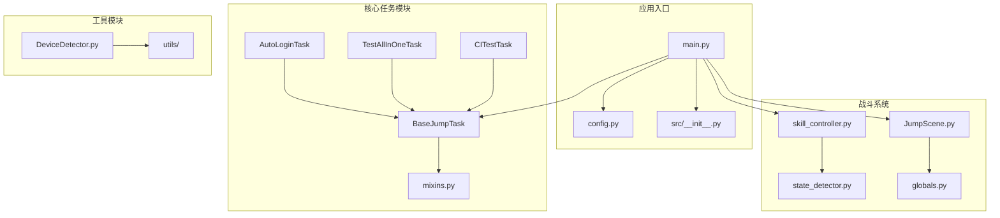

**图表来源**
- [main.py:1-693](file://main.py#L1-L693)
- [config.py:1-146](file://config.py#L1-L146)
- [src/task/BaseJumpTask.py:1-572](file://src/task/BaseJumpTask.py#L1-L572)

**章节来源**
- [README.md:1-8](file://README.md#L1-L8)
- [main.py:1-693](file://main.py#L1-L693)
- [config.py:1-146](file://config.py#L1-L146)

## 核心组件

### 全局资源管理器

全局资源管理器是整个系统的中枢，负责管理登录状态、OCR缓存、YOLO模型等全局资源。

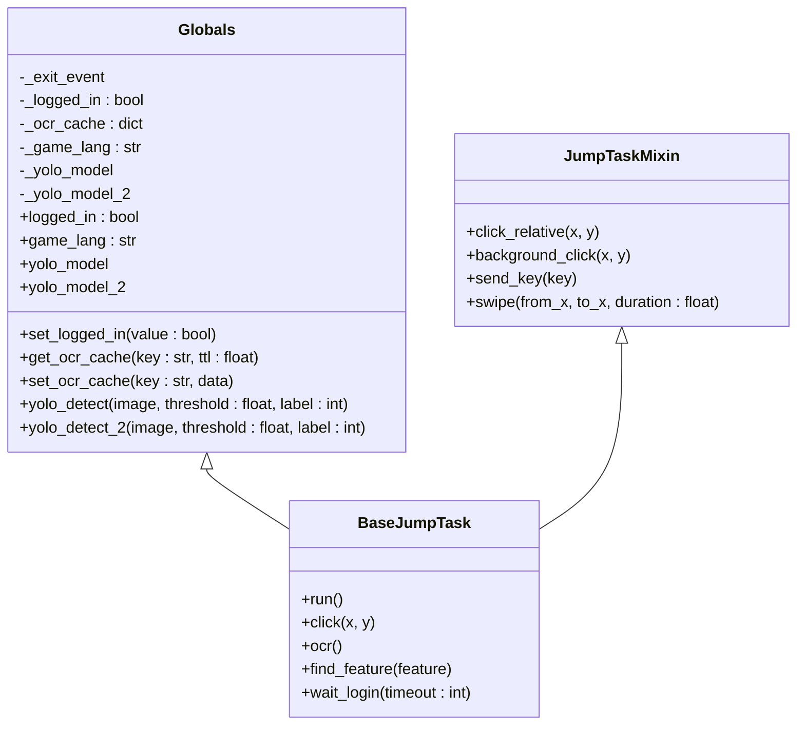

**图表来源**
- [src/globals.py:16-406](file://src/globals.py#L16-L406)
- [src/task/BaseJumpTask.py:26-572](file://src/task/BaseJumpTask.py#L26-L572)
- [src/task/mixins.py:15-784](file://src/task/mixins.py#L15-L784)

### 任务代理系统

系统实现了多种独立的任务代理，每个代理都有特定的功能和职责：

| 任务代理 | 功能描述 | 主要特性 |
|---------|----------|----------|
| AutoLoginTask | 自动登录游戏 | 支持多种登录界面，加载检测，状态容错 |
| TestAllInOneTask | 测试一条龙 | 组合多个子任务，任务间过渡处理 |
| CITestTask | CI自动化测试 | 完整的部署-测试-通知流程 |
| AutoCombatTask | 自动战斗 | 基于YOLO的智能战斗控制 |

**章节来源**
- [src/task/AutoLoginTask.py:21-800](file://src/task/AutoLoginTask.py#L21-L800)
- [src/task/TestAllInOneTask.py:11-223](file://src/task/TestAllInOneTask.py#L11-L223)
- [src/task/CITestTask.py:26-1036](file://src/task/CITestTask.py#L26-L1036)

## 架构概览

系统采用分层架构设计，从底层的设备抽象到顶层的任务编排，形成了清晰的层次结构：

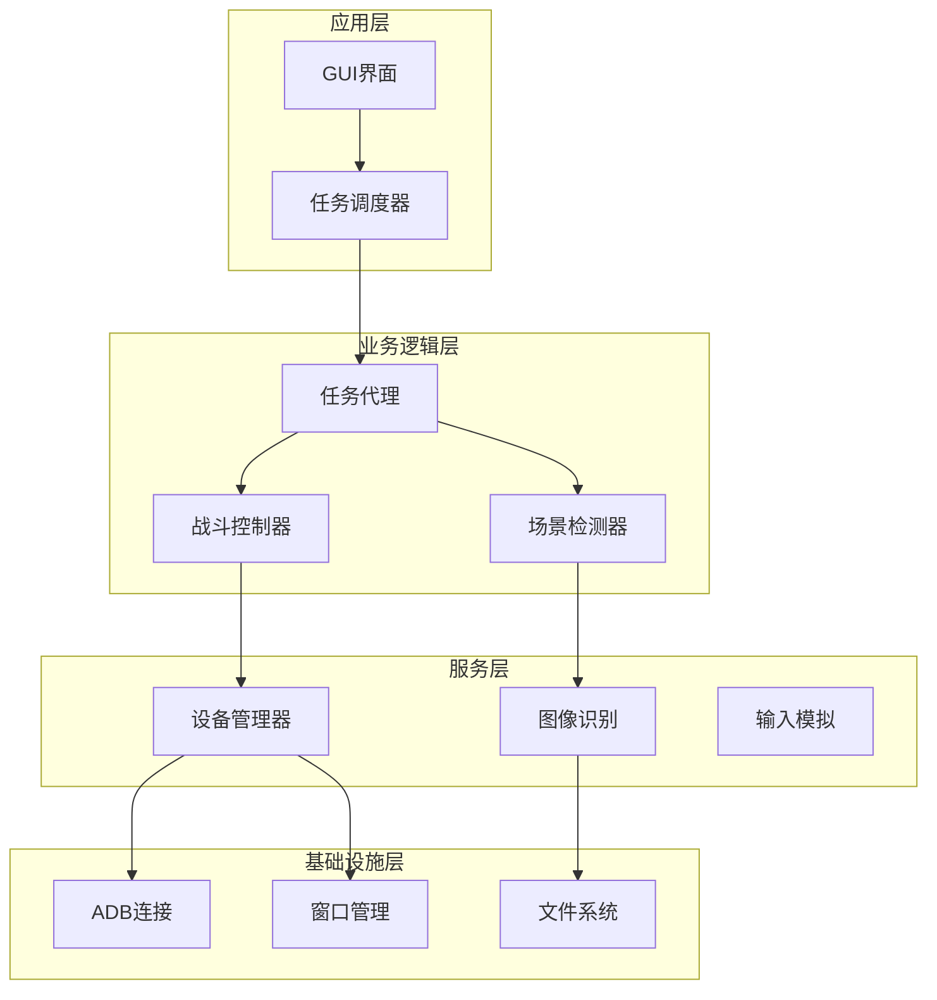

**图表来源**
- [main.py:659-693](file://main.py#L659-L693)
- [src/task/BaseJumpTask.py:26-572](file://src/task/BaseJumpTask.py#L26-L572)

## 详细组件分析

### 自动登录任务

AutoLoginTask是系统中最复杂的任务之一，实现了完整的登录流程自动化：

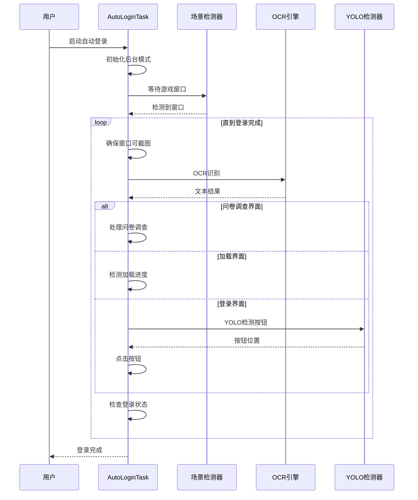

**图表来源**
- [src/task/AutoLoginTask.py:227-752](file://src/task/AutoLoginTask.py#L227-L752)
- [src/scene/JumpScene.py:39-71](file://src/scene/JumpScene.py#L39-L71)

#### 登录流程状态机

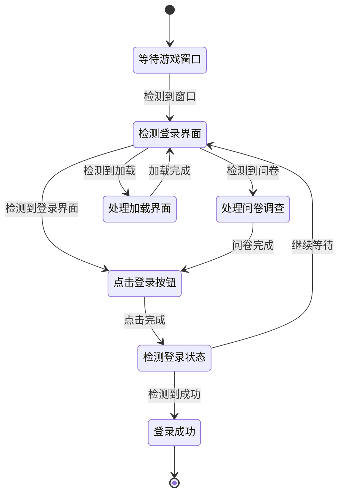

**图表来源**
- [src/task/AutoLoginTask.py:672-752](file://src/task/AutoLoginTask.py#L672-L752)

**章节来源**
- [src/task/AutoLoginTask.py:21-800](file://src/task/AutoLoginTask.py#L21-L800)

### CI自动化测试系统

CITestTask实现了完整的持续集成自动化测试流程：

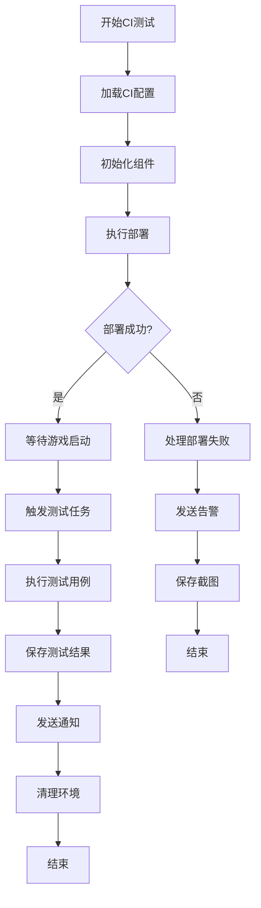

**图表来源**
- [src/task/CITestTask.py:146-273](file://src/task/CITestTask.py#L146-L273)

#### CI任务执行流程

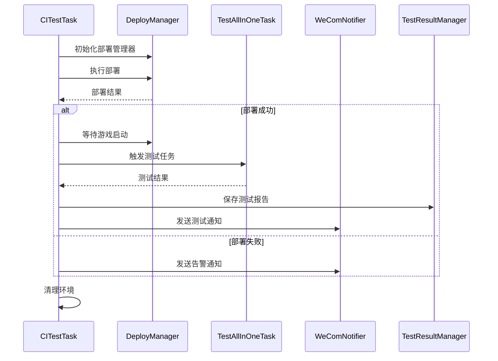

**图表来源**
- [src/task/CITestTask.py:213-273](file://src/task/CITestTask.py#L213-L273)

**章节来源**
- [src/task/CITestTask.py:26-1036](file://src/task/CITestTask.py#L26-L1036)

### 智能设备选择系统

系统实现了智能设备选择功能，能够自动检测PC版和模拟器的连接状态：

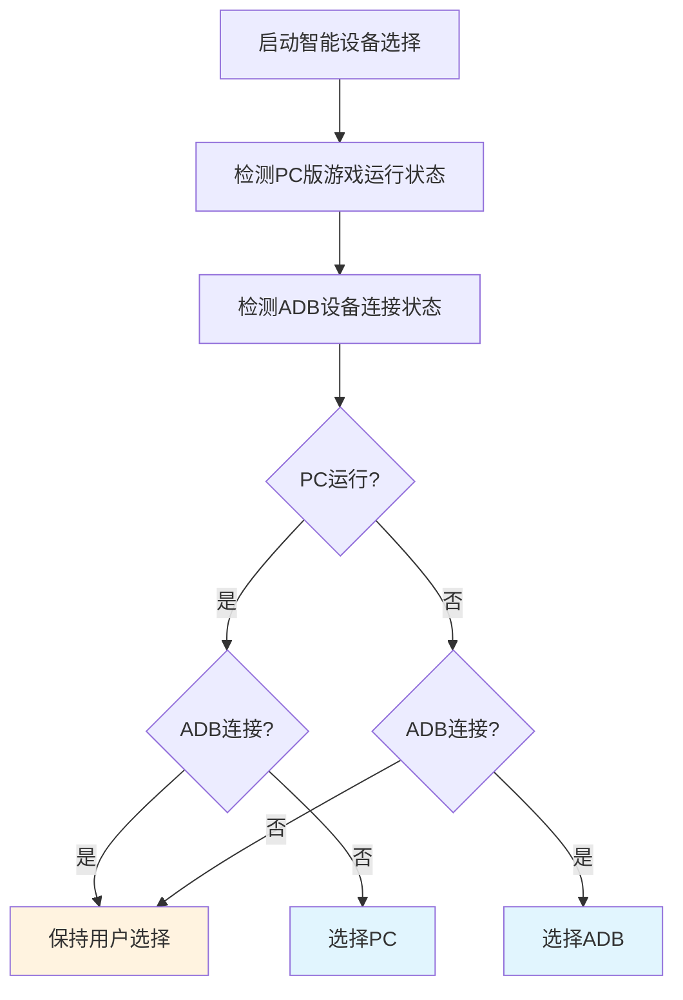

**图表来源**
- [src/utils/DeviceDetector.py:113-134](file://src/utils/DeviceDetector.py#L113-L134)

**章节来源**
- [src/utils/DeviceDetector.py:11-149](file://src/utils/DeviceDetector.py#L11-L149)

### 战斗控制系统

战斗控制系统基于YOLO视觉识别和智能技能控制：

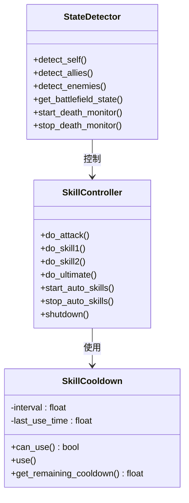

**图表来源**
- [src/combat/state_detector.py:24-589](file://src/combat/state_detector.py#L24-L589)
- [src/combat/skill_controller.py:82-589](file://src/combat/skill_controller.py#L82-L589)

#### 技能释放机制

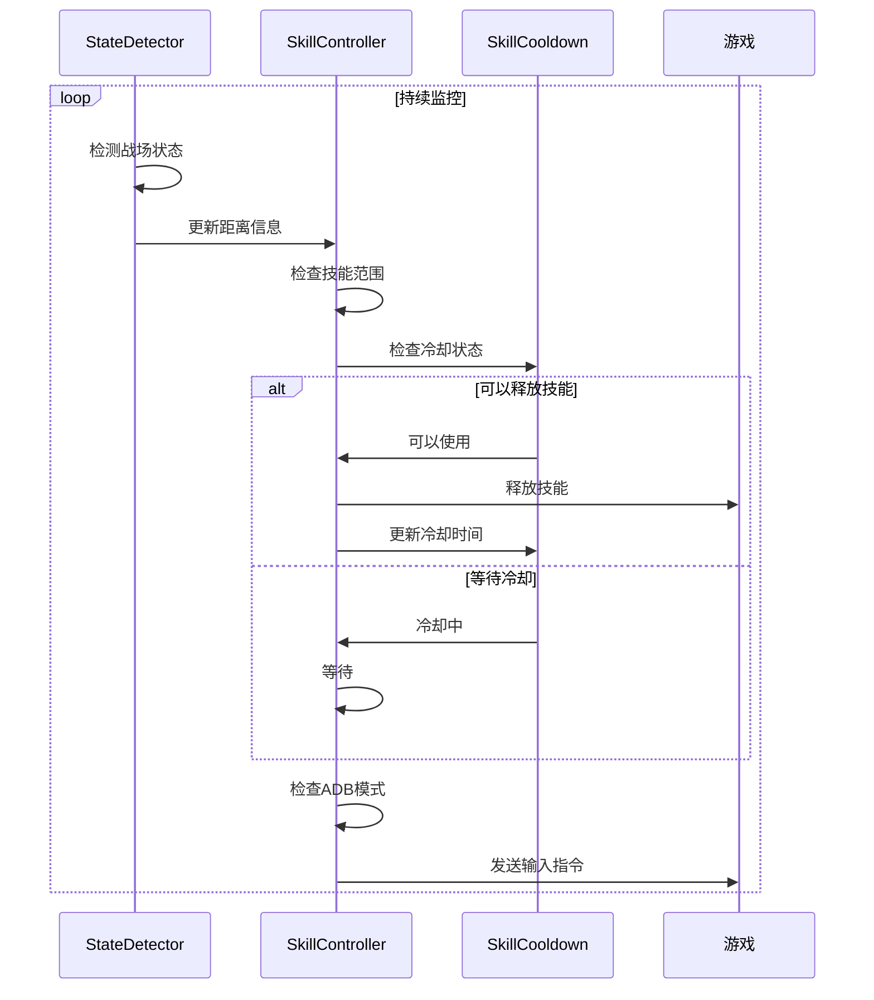

**图表来源**
- [src/combat/skill_controller.py:279-355](file://src/combat/skill_controller.py#L279-L355)

**章节来源**
- [src/combat/state_detector.py:24-589](file://src/combat/state_detector.py#L24-L589)
- [src/combat/skill_controller.py:82-589](file://src/combat/skill_controller.py#L82-L589)

## 依赖关系分析

系统采用了松耦合的设计，各个组件之间的依赖关系清晰明确：

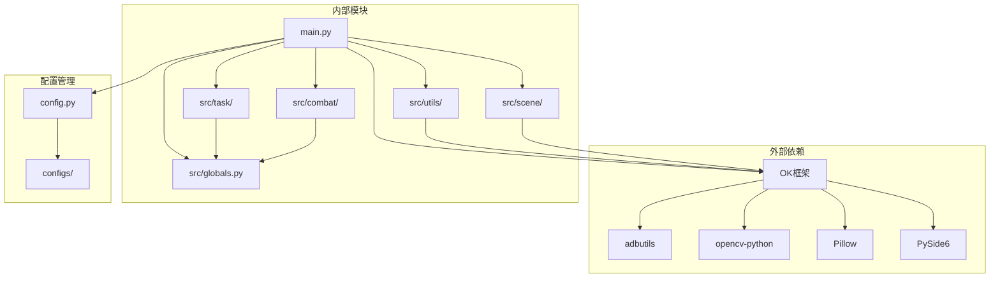

**图表来源**
- [main.py:17-20](file://main.py#L17-L20)
- [config.py:1-146](file://config.py#L1-146)

**章节来源**
- [main.py:1-693](file://main.py#L1-L693)
- [config.py:1-146](file://config.py#L1-L146)

## 性能考虑

系统在设计时充分考虑了性能优化：

### 内存管理
- **YOLO模型懒加载**：只有在需要时才加载模型，减少内存占用
- **OCR缓存机制**：缓存OCR结果，避免重复计算
- **资源池管理**：合理管理全局资源，及时释放不需要的对象

### 线程安全
- **并发控制**：使用锁机制保护共享资源
- **异步处理**：死亡状态检测使用独立线程
- **状态同步**：通过原子操作保证状态一致性

### 性能优化策略
- **延迟初始化**：只在需要时创建昂贵的对象
- **智能重试**：避免不必要的重复操作
- **资源复用**：重用已有的连接和句柄

## 故障排除指南

### 常见问题及解决方案

#### 设备连接问题
**问题**：ADB连接失败或设备离线
**解决方案**：
1. 检查模拟器是否正常启动
2. 验证ADB端口配置
3. 重启ADB服务
4. 检查防火墙设置

#### 登录失败问题
**问题**：自动登录过程中断
**解决方案**：
1. 检查登录界面检测准确性
2. 验证OCR识别配置
3. 调整等待超时时间
4. 检查网络连接状态

#### 战斗控制问题
**问题**：技能释放不准确
**解决方案**：
1. 调整YOLO检测阈值
2. 检查技能冷却配置
3. 验证输入模拟设置
4. 检查游戏窗口状态

**章节来源**
- [src/task/AutoLoginTask.py:542-550](file://src/task/AutoLoginTask.py#L542-L550)
- [src/combat/skill_controller.py:150-171](file://src/combat/skill_controller.py#L150-L171)

## 结论

ok-jump项目展示了现代自动化测试工具的设计理念和技术实现。通过子代理驱动架构，系统实现了高度模块化和可扩展的自动化解决方案。

### 主要优势
- **模块化设计**：清晰的组件分离和职责划分
- **智能适配**：支持PC版和模拟器的无缝切换
- **完整生态**：从本地开发到CI集成的全链路支持
- **高性能**：优化的资源管理和并发处理

### 技术亮点
- **YOLO视觉识别**：基于深度学习的智能检测
- **后台模式支持**：突破传统自动化工具的限制
- **智能设备选择**：自动化的环境适配
- **CI集成**：完整的持续集成解决方案

该系统为类似的游戏自动化需求提供了优秀的参考实现，其设计理念和架构模式值得在其他自动化项目中借鉴和应用。