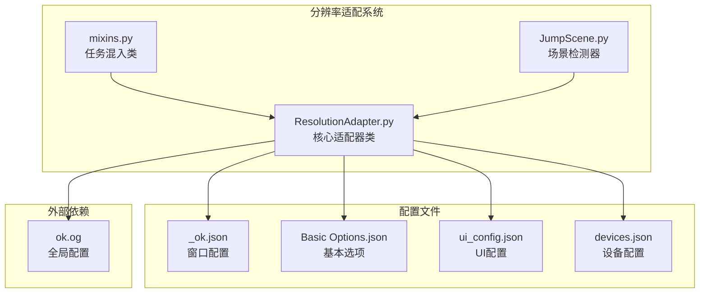
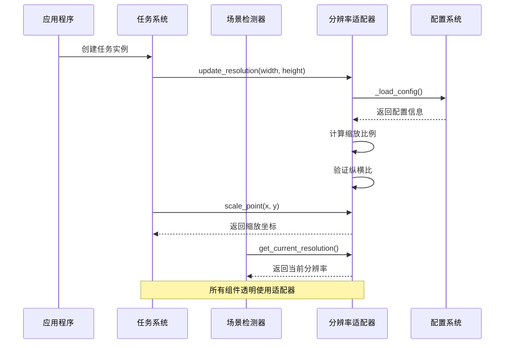
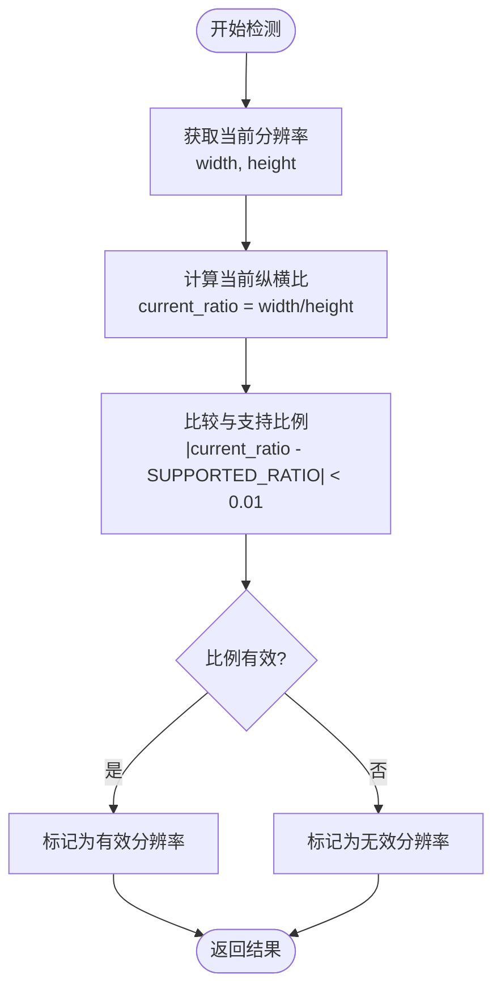
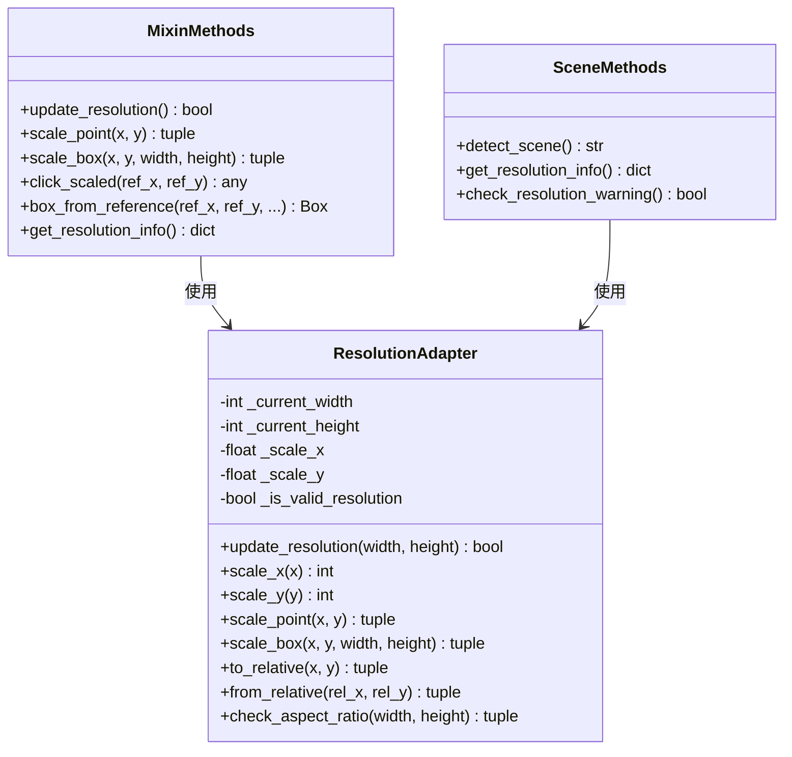
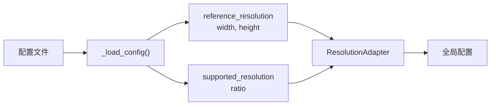
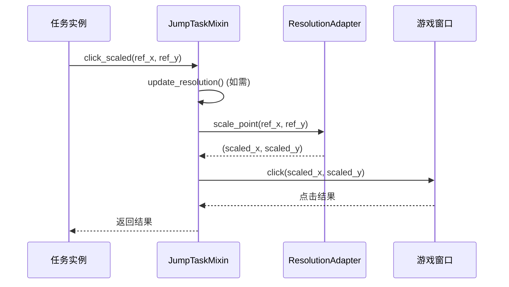
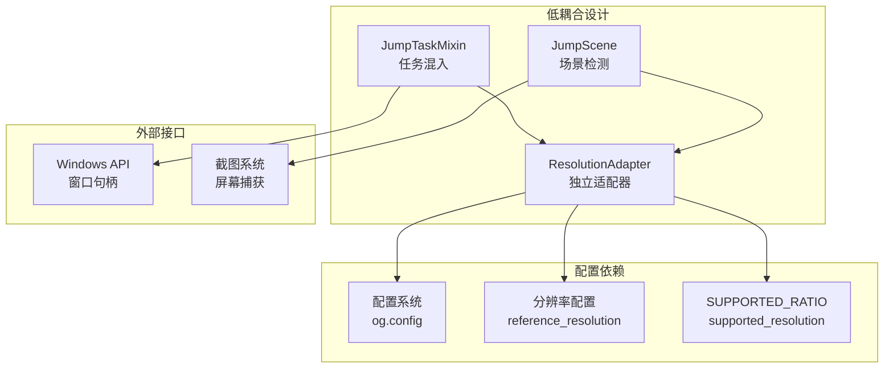

# 分辨率适配系统

<cite>
**本文档引用的文件**
- [ResolutionAdapter.py](file://src/utils/ResolutionAdapter.py)
- [mixins.py](file://src/task/mixins.py)
- [JumpScene.py](file://src/scene/JumpScene.py)
- [_ok.json](file://configs/_ok.json)
- [Basic Options.json](file://configs/Basic Options.json)
- [ui_config.json](file://configs/ui_config.json)
- [devices.json](file://configs/devices.json)
</cite>

## 目录
1. [简介](#简介)
2. [项目结构](#项目结构)
3. [核心组件](#核心组件)
4. [架构概览](#架构概览)
5. [详细组件分析](#详细组件分析)
6. [依赖关系分析](#依赖关系分析)
7. [性能考虑](#性能考虑)
8. [故障排除指南](#故障排除指南)
9. [结论](#结论)
10. [附录](#附录)

## 简介

ok-jump 项目的分辨率适配系统是一个关键的基础设施组件，负责处理不同分辨率和纵横比下的坐标转换、缩放适配和界面元素定位。该系统基于一个轻量级的适配器模式，为整个应用程序提供了统一的分辨率处理机制。

该系统的核心设计理念是：
- **单一职责原则**：专门处理分辨率相关的所有计算
- **配置驱动**：通过外部配置文件支持自定义参考分辨率和纵横比
- **透明适配**：对上层组件完全透明，无需关心底层分辨率差异
- **实时检测**：能够动态检测和响应分辨率变化

## 项目结构

分辨率适配系统主要分布在以下文件中：



**图表来源**
- [ResolutionAdapter.py:1-163](file://src/utils/ResolutionAdapter.py#L1-L163)
- [mixins.py:1-784](file://src/task/mixins.py#L1-L784)
- [JumpScene.py:1-216](file://src/scene/JumpScene.py#L1-L216)

**章节来源**
- [ResolutionAdapter.py:1-163](file://src/utils/ResolutionAdapter.py#L1-L163)
- [mixins.py:1-784](file://src/task/mixins.py#L1-L784)
- [JumpScene.py:1-216](file://src/scene/JumpScene.py#L1-L216)

## 核心组件

### ResolutionAdapter 类

ResolutionAdapter 是整个分辨率适配系统的核心类，实现了完整的分辨率检测、缩放适配和坐标转换功能。

#### 主要特性

1. **配置驱动的参考分辨率**
   - 默认参考分辨率为 1920x1080
   - 支持通过配置文件自定义参考分辨率
   - 支持自定义纵横比要求

2. **实时分辨率检测**
   - 动态检测当前屏幕分辨率
   - 计算纵横比差异
   - 验证分辨率有效性

3. **完整的坐标转换系统**
   - 绝对坐标缩放
   - 相对坐标转换
   - 矩形框缩放
   - 边界处理

#### 关键属性

| 属性名称 | 类型 | 描述 | 默认值 |
|---------|------|------|--------|
| REFERENCE_WIDTH | int | 参考分辨率宽度 | 1920 |
| REFERENCE_HEIGHT | int | 参考分辨率高度 | 1080 |
| SUPPORTED_RATIO | float | 支持的纵横比 | 16/9 |
| width | int | 当前宽度 | 0 |
| height | int | 当前高度 | 0 |
| scale_x_ratio | float | X轴缩放比例 | 1.0 |
| scale_y_ratio | float | Y轴缩放比例 | 1.0 |

**章节来源**
- [ResolutionAdapter.py:4-163](file://src/utils/ResolutionAdapter.py#L4-L163)

## 架构概览



**图表来源**
- [mixins.py:106-123](file://src/task/mixins.py#L106-L123)
- [JumpScene.py:30-37](file://src/scene/JumpScene.py#L30-L37)
- [ResolutionAdapter.py:19-44](file://src/utils/ResolutionAdapter.py#L19-L44)

## 详细组件分析

### 分辨率检测与验证

#### 比例计算算法



**图表来源**
- [ResolutionAdapter.py:34-44](file://src/utils/ResolutionAdapter.py#L34-L44)
- [ResolutionAdapter.py:107-119](file://src/utils/ResolutionAdapter.py#L107-L119)

#### 缩放适配机制

缩放适配系统采用独立的X轴和Y轴缩放策略：



**图表来源**
- [ResolutionAdapter.py:4-163](file://src/utils/ResolutionAdapter.py#L4-L163)
- [mixins.py:150-255](file://src/task/mixins.py#L150-L255)
- [JumpScene.py:39-71](file://src/scene/JumpScene.py#L39-L71)

#### 坐标转换算法

##### 绝对坐标缩放
- X轴缩放：`scaled_x = int(x * scale_x)`
- Y轴缩放：`scaled_y = int(y * scale_y)`

##### 相对坐标转换
- 绝对到相对：`rel_x = x / current_width`
- 相对到绝对：`abs_x = int(rel_x * current_width)`

##### 矩形框缩放
- 左上角：`(scale_x(x), scale_y(y))`
- 尺寸：`(scale_width(width), scale_height(height))`

**章节来源**
- [ResolutionAdapter.py:46-93](file://src/utils/ResolutionAdapter.py#L46-L93)

### 配置系统集成

#### 配置加载机制



**图表来源**
- [ResolutionAdapter.py:19-33](file://src/utils/ResolutionAdapter.py#L19-L33)

#### 支持的配置格式

| 配置项 | 类型 | 描述 | 示例 |
|-------|------|------|------|
| reference_resolution.width | int | 参考分辨率宽度 | 1920 |
| reference_resolution.height | int | 参考分辨率高度 | 1080 |
| supported_resolution.ratio | string | 支持的纵横比 | "16:9" |
| supported_resolution.resize_to | array | 推荐的分辨率列表 | [[1920,1080],[2560,1440]] |

**章节来源**
- [ResolutionAdapter.py:22-32](file://src/utils/ResolutionAdapter.py#L22-L32)

### 实际应用场景

#### 任务系统中的应用

在任务系统中，分辨率适配器通过混入类提供透明的适配服务：



**图表来源**
- [mixins.py:186-203](file://src/task/mixins.py#L186-L203)

#### 场景检测中的应用

场景检测器利用分辨率信息优化识别算法：

```mermaid
flowchart TD
Frame[新帧] --> Detect[detect_scene()]
Detect --> UpdateRes["_update_resolution()"]
UpdateRes --> CheckRes["检查分辨率有效性"]
CheckRes --> Valid{"分辨率有效?"}
Valid --> |是| DetectScene["执行场景检测"]
Valid --> |否| Warn["记录警告并建议调整"]
DetectScene --> Result[返回场景类型]
Warn --> Result
```

**图表来源**
- [JumpScene.py:39-71](file://src/scene/JumpScene.py#L39-L71)
- [JumpScene.py:206-215](file://src/scene/JumpScene.py#L206-L215)

## 依赖关系分析

### 组件耦合度



**图表来源**
- [mixins.py:8](file://src/task/mixins.py#L8)
- [JumpScene.py:5](file://src/scene/JumpScene.py#L5)

### 关键依赖关系

1. **配置依赖**：ResolutionAdapter 依赖 `og.config` 获取配置信息
2. **任务依赖**：JumpTaskMixin 依赖 ResolutionAdapter 进行坐标转换
3. **场景依赖**：JumpScene 依赖 ResolutionAdapter 进行分辨率检测
4. **系统依赖**：各组件依赖操作系统窗口管理和截图功能

**章节来源**
- [mixins.py:7-12](file://src/task/mixins.py#L7-L12)
- [JumpScene.py:3-6](file://src/scene/JumpScene.py#L3-L6)

## 性能考虑

### 内存使用优化

- **单例模式**：ResolutionAdapter 作为全局单例，避免重复创建
- **惰性计算**：只在需要时进行分辨率检测和缩放计算
- **缓存机制**：任务系统缓存分辨率检查结果，避免重复计算

### 计算效率

- **整数运算**：所有缩放计算使用整数运算，减少浮点数开销
- **批量处理**：支持批量坐标转换，提高处理效率
- **快速路径**：当参考分辨率与当前分辨率相同时，跳过缩放计算

### 内存管理

- **及时清理**：分辨率信息随帧更新而更新，避免内存泄漏
- **弱引用**：通过全局变量管理，避免循环引用

## 故障排除指南

### 常见问题及解决方案

#### 分辨率检测失败

**症状**：`update_resolution()` 返回 `False`
**原因**：屏幕宽高为非正值
**解决**：检查窗口句柄获取和屏幕尺寸检测逻辑

#### 坐标偏移问题

**症状**：点击位置与预期不符
**原因**：缩放比例计算错误或坐标转换混淆
**解决**：确认使用正确的缩放方法（`scale_point` vs `from_relative`）

#### 纵横比不匹配

**症状**：场景识别准确率下降
**解决**：检查配置文件中的 `supported_resolution.ratio` 设置

#### 性能问题

**症状**：频繁分辨率检测导致性能下降
**解决**：利用任务系统的缓存机制，避免重复检测

**章节来源**
- [mixins.py:125-148](file://src/task/mixins.py#L125-L148)
- [JumpScene.py:206-215](file://src/scene/JumpScene.py#L206-L215)

## 结论

ok-jump 项目的分辨率适配系统通过精心设计的架构实现了高效的跨分辨率支持。其核心优势包括：

1. **设计优雅**：采用适配器模式，职责分离清晰
2. **配置灵活**：支持自定义参考分辨率和纵横比
3. **使用便捷**：对上层组件完全透明
4. **性能优秀**：优化的计算算法和缓存机制
5. **易于维护**：模块化设计，便于扩展和修改

该系统为 ok-jump 项目提供了坚实的基础设施，确保了在各种分辨率和纵横比下的稳定运行。

## 附录

### 配置示例

#### 基本配置结构

```json
{
  "reference_resolution": {
    "width": 1920,
    "height": 1080
  },
  "supported_resolution": {
    "ratio": "16:9",
    "resize_to": [
      [1920, 1080],
      [2560, 1440]
    ]
  }
}
```

#### 高DPI显示器配置

对于高DPI显示器，建议：
- 设置 `reference_resolution` 为物理像素分辨率
- 调整 `supported_resolution.ratio` 以适应实际显示比例
- 在 UI 配置中启用适当的 DPI 缩放设置

### 最佳实践

1. **统一坐标系统**：始终使用参考分辨率坐标进行编程
2. **及时更新**：在分辨率变化时及时调用 `update_resolution()`
3. **错误处理**：妥善处理分辨率检测失败的情况
4. **性能监控**：定期检查分辨率适配的性能影响
5. **测试覆盖**：为不同分辨率和纵横比编写测试用例