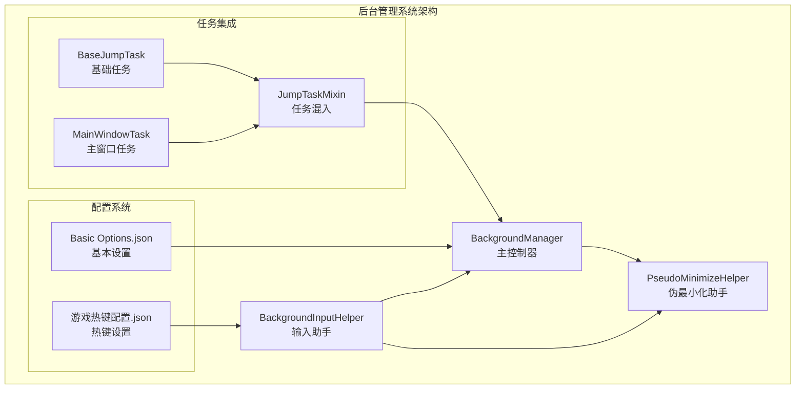
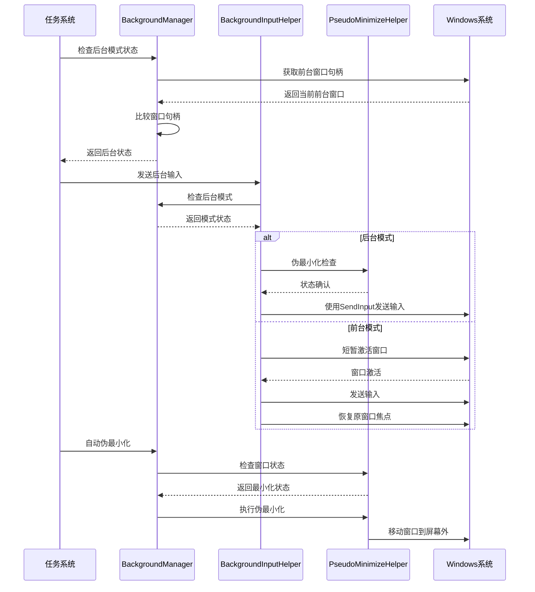
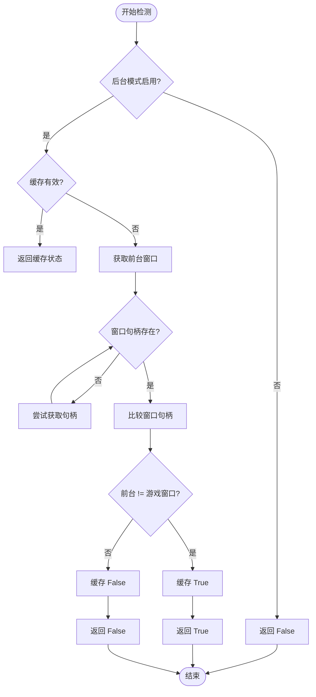
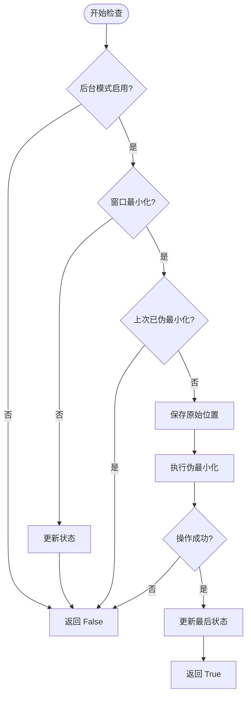
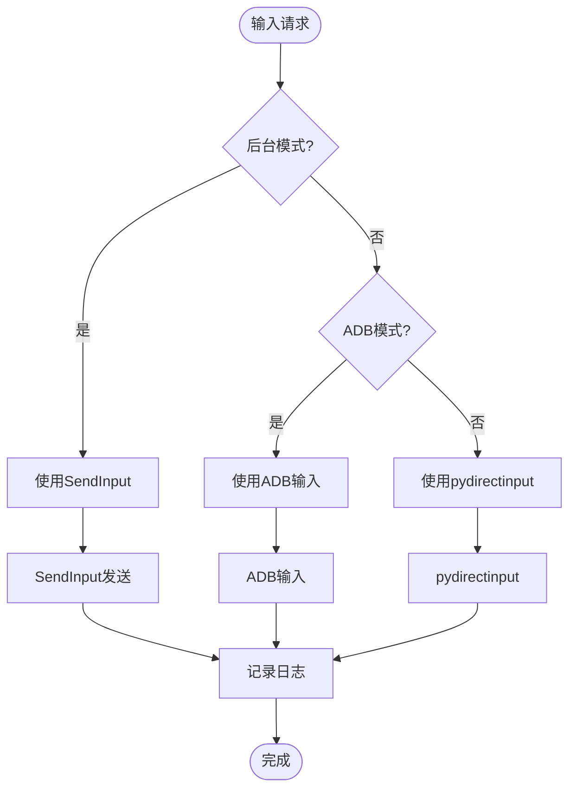
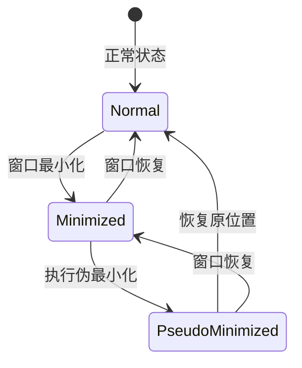
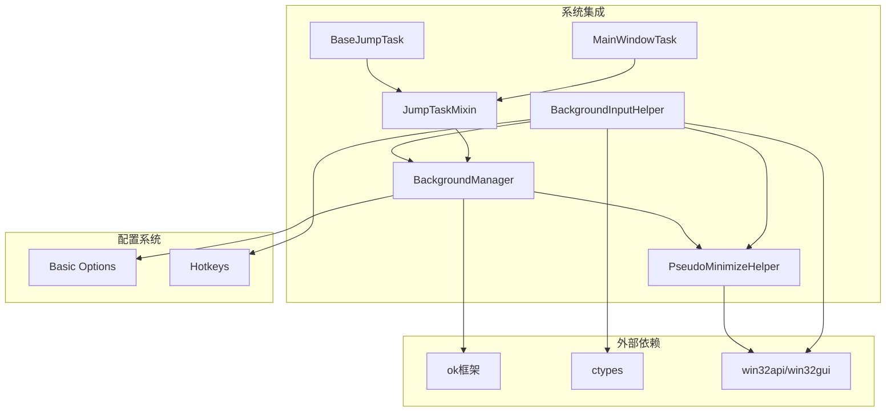

# 后台管理系统

<cite>
**本文档引用的文件**
- [BackgroundManager.py](file://src/utils/BackgroundManager.py)
- [BackgroundInputHelper.py](file://src/utils/BackgroundInputHelper.py)
- [PseudoMinimizeHelper.py](file://src/utils/PseudoMinimizeHelper.py)
- [mixins.py](file://src/task/mixins.py)
- [BaseJumpTask.py](file://src/task/BaseJumpTask.py)
- [MainWindowTask.py](file://src/task/MainWindowTask.py)
- [Basic Options.json](file://configs/Basic Options.json)
- [游戏热键配置.json](file://configs/游戏热键配置.json)
- [main.py](file://main.py)
</cite>

## 目录
1. [简介](#简介)
2. [项目结构](#项目结构)
3. [核心组件](#核心组件)
4. [架构概览](#架构概览)
5. [详细组件分析](#详细组件分析)
6. [依赖关系分析](#依赖关系分析)
7. [性能考虑](#性能考虑)
8. [故障排除指南](#故障排除指南)
9. [结论](#结论)

## 简介

ok-jump 项目的后台管理系统是一个关键的自动化框架组件，专门设计用于处理游戏窗口在后台运行时的各种挑战。该系统解决了Unity游戏在后台模式下的输入处理、窗口状态管理和截图支持等核心问题。

该系统的核心价值在于：
- **后台输入支持**：为Unity游戏提供可靠的后台输入机制
- **窗口状态管理**：智能检测和管理游戏窗口的前台/后台状态
- **伪最小化技术**：通过将窗口移动到屏幕外实现真正的后台运行
- **多模式兼容**：支持前台激活模式和伪最小化模式的自动切换

## 项目结构

后台管理系统位于 `src/utils/` 目录下，包含三个核心组件：

**图表来源**
- [BackgroundManager.py:1-155](file://src/utils/BackgroundManager.py#L1-L155)
- [BackgroundInputHelper.py:1-841](file://src/utils/BackgroundInputHelper.py#L1-L841)
- [PseudoMinimizeHelper.py:1-238](file://src/utils/PseudoMinimizeHelper.py#L1-L238)

**章节来源**
- [BackgroundManager.py:1-155](file://src/utils/BackgroundManager.py#L1-L155)
- [BackgroundInputHelper.py:1-841](file://src/utils/BackgroundInputHelper.py#L1-L841)
- [PseudoMinimizeHelper.py:1-238](file://src/utils/PseudoMinimizeHelper.py#L1-L238)

## 核心组件

### BackgroundManager 主控制器

BackgroundManager 是整个后台管理系统的核心控制器，负责协调各个组件的工作。

**主要功能**：
- 窗口状态检测和缓存
- 后台模式配置管理
- 伪最小化自动控制
- 静音功能集成

**关键特性**：
- **智能缓存机制**：避免频繁的系统调用
- **配置动态更新**：实时响应配置变化
- **状态持久化**：维护窗口状态的连续性

**章节来源**
- [BackgroundManager.py:7-155](file://src/utils/BackgroundManager.py#L7-L155)

### BackgroundInputHelper 输入助手

BackgroundInputHelper 专门为Unity游戏提供后台输入支持，实现了两种核心模式：

**前台模式 (MODE_FOREGROUND)**：
- 短暂激活游戏窗口
- 使用 SendInput 发送输入
- 激活后立即恢复原窗口焦点

**伪最小化模式 (MODE_PSEUDO)**：
- 将窗口移动到屏幕外 (-32000, -32000)
- 保持窗口为"活动窗口"状态
- 使用 SendInput 进行后台输入

**章节来源**
- [BackgroundInputHelper.py:99-117](file://src/utils/BackgroundInputHelper.py#L99-L117)

### PseudoMinimizeHelper 伪最小化助手

PseudoMinimizeHelper 提供了完整的伪最小化功能，包括：

**核心功能**：
- 窗口位置保存和恢复
- 状态检测和验证
- 自动化的伪最小化/恢复过程

**安全机制**：
- 原始位置保护
- 状态一致性检查
- 异常情况下的安全恢复

**章节来源**
- [PseudoMinimizeHelper.py:13-238](file://src/utils/PseudoMinimizeHelper.py#L13-L238)

## 架构概览

后台管理系统采用分层架构设计，各组件职责明确且相互协作：

**图表来源**
- [BackgroundManager.py:46-121](file://src/utils/BackgroundManager.py#L46-L121)
- [BackgroundInputHelper.py:177-207](file://src/utils/BackgroundInputHelper.py#L177-L207)
- [PseudoMinimizeHelper.py:75-102](file://src/utils/PseudoMinimizeHelper.py#L75-L102)

## 详细组件分析

### BackgroundManager 详细分析

BackgroundManager 实现了完整的后台模式管理逻辑：

#### 状态检测机制

**图表来源**
- [BackgroundManager.py:46-75](file://src/utils/BackgroundManager.py#L46-L75)

#### 自动伪最小化流程

**图表来源**
- [BackgroundManager.py:101-121](file://src/utils/BackgroundManager.py#L101-L121)

**章节来源**
- [BackgroundManager.py:7-155](file://src/utils/BackgroundManager.py#L7-L155)

### BackgroundInputHelper 详细分析

BackgroundInputHelper 实现了复杂的输入模式选择逻辑：

#### 模式选择算法

**图表来源**
- [BackgroundInputHelper.py:177-207](file://src/utils/BackgroundInputHelper.py#L177-L207)
- [BackgroundInputHelper.py:310-357](file://src/utils/BackgroundInputHelper.py#L310-L357)

#### 键盘输入处理

BackgroundInputHelper 提供了完整的键盘输入支持：

**单键输入**：
- 支持按键按下和释放
- 自动处理虚拟键码映射
- 支持自定义持续时间

**组合键输入**：
- 同时按住多个键
- 支持斜向移动等复杂操作
- 自动释放所有按键

**章节来源**
- [BackgroundInputHelper.py:310-474](file://src/utils/BackgroundInputHelper.py#L310-L474)

### PseudoMinimizeHelper 详细分析

PseudoMinimizeHelper 提供了完整的窗口状态管理：

#### 状态管理流程

**图表来源**
- [PseudoMinimizeHelper.py:123-193](file://src/utils/PseudoMinimizeHelper.py#L123-L193)

**章节来源**
- [PseudoMinimizeHelper.py:13-238](file://src/utils/PseudoMinimizeHelper.py#L13-L238)

## 依赖关系分析

后台管理系统与其他组件的集成关系：

**图表来源**
- [mixins.py:8-11](file://src/task/mixins.py#L8-L11)
- [BaseJumpTask.py:8](file://src/task/BaseJumpTask.py#L8)
- [MainWindowTask.py:15](file://src/task/MainWindowTask.py#L15)

**章节来源**
- [mixins.py:8-11](file://src/task/mixins.py#L8-L11)
- [BaseJumpTask.py:8](file://src/task/BaseJumpTask.py#L8)
- [MainWindowTask.py:15](file://src/task/MainWindowTask.py#L15)

## 性能考虑

后台管理系统在设计时充分考虑了性能优化：

### 缓存策略
- **前台窗口检测缓存**：默认1秒缓存间隔，减少系统调用频率
- **状态持久化**：维护窗口状态的连续性，避免重复计算
- **配置动态更新**：实时响应配置变化，无需重启应用

### 内存管理
- **懒加载机制**：仅在需要时获取窗口句柄
- **状态重置**：提供完整的状态清理功能
- **异常处理**：优雅处理各种异常情况，避免内存泄漏

### 系统资源优化
- **最小化系统调用**：通过缓存和状态管理减少API调用
- **异步操作支持**：支持非阻塞的后台操作
- **资源清理**：自动清理临时状态和资源

## 故障排除指南

### 常见问题及解决方案

**问题1：后台模式不生效**
- 检查基本设置中的后台模式配置
- 确认游戏窗口句柄正确获取
- 验证前台窗口检测逻辑

**问题2：伪最小化失败**
- 检查窗口权限和管理员权限
- 验证窗口位置坐标的有效性
- 确认系统API调用成功

**问题3：输入无效**
- 检查输入模式选择逻辑
- 验证SendInput调用参数
- 确认Unity游戏的输入处理机制

**章节来源**
- [BackgroundManager.py:146-152](file://src/utils/BackgroundManager.py#L146-L152)
- [PseudoMinimizeHelper.py:230-235](file://src/utils/PseudoMinimizeHelper.py#L230-L235)

### 调试和监控

系统提供了完善的调试功能：

**日志记录**：
- 详细的执行流程日志
- 错误和异常信息记录
- 性能指标监控

**状态查询**：
- 实时状态检查接口
- 配置参数查询
- 系统资源使用情况

## 结论

ok-jump 项目的后台管理系统是一个设计精良、功能完整的自动化框架组件。它成功解决了Unity游戏在后台运行时的核心技术难题，为游戏自动化提供了可靠的技术基础。

**主要优势**：
- **技术先进性**：采用伪最小化等先进技术
- **架构清晰**：组件职责明确，耦合度低
- **性能优秀**：通过多种优化策略提升性能
- **易于扩展**：模块化设计便于功能扩展

**应用场景**：
- 自动化游戏脚本
- 游戏辅助工具
- 批量测试工具
- 游戏分析工具

该系统为ok-jump项目提供了强大的技术支持，是整个自动化框架的重要基石。