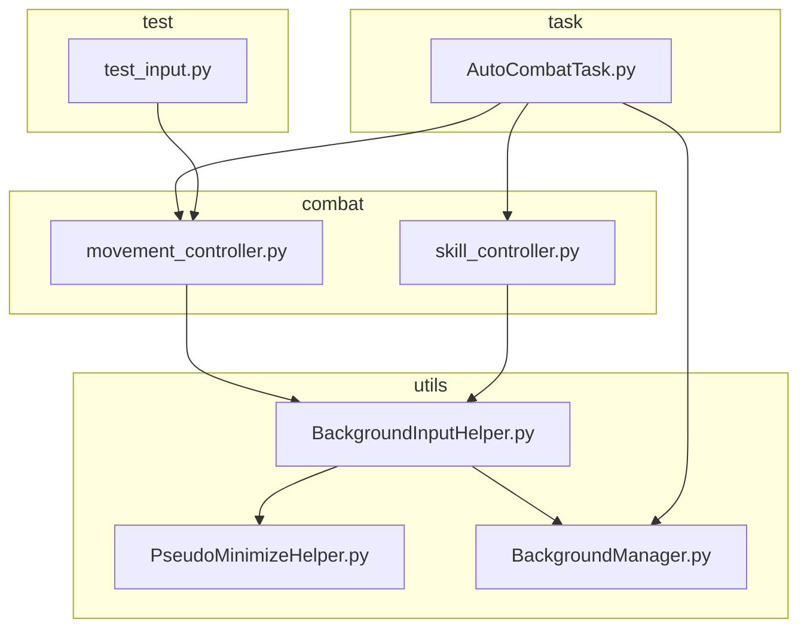
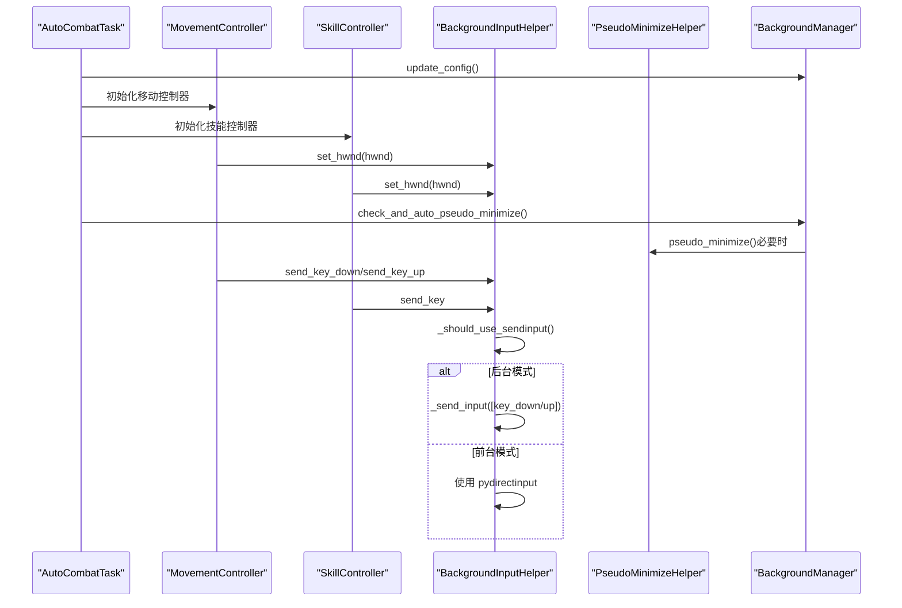
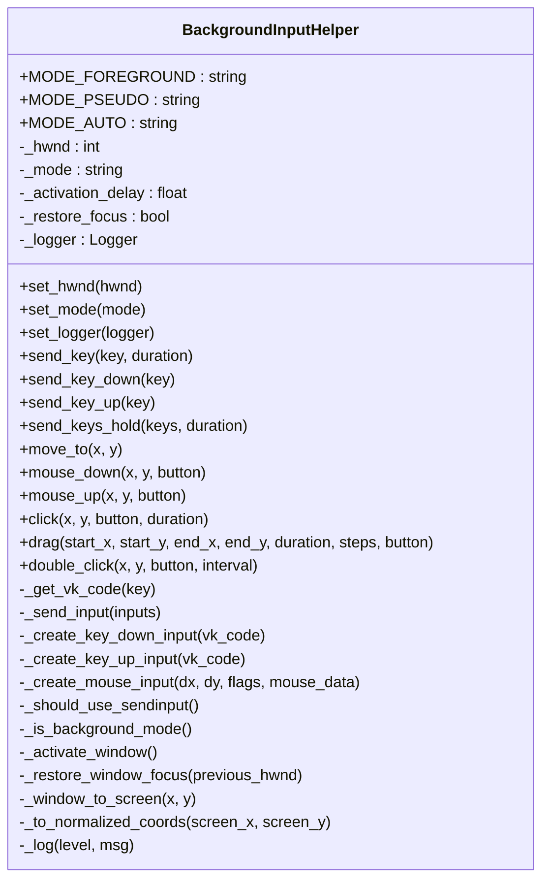
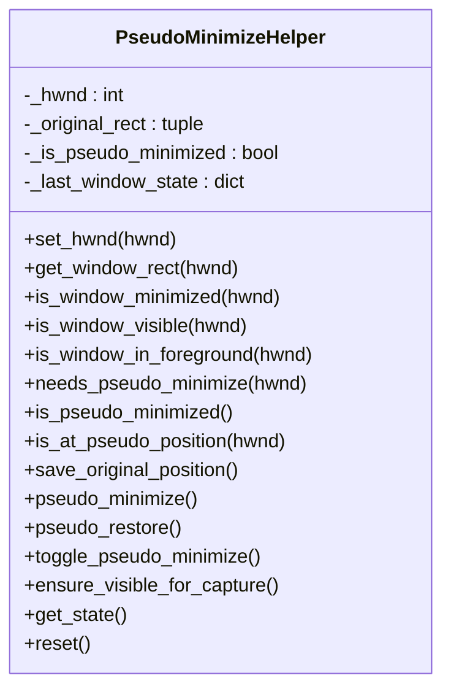
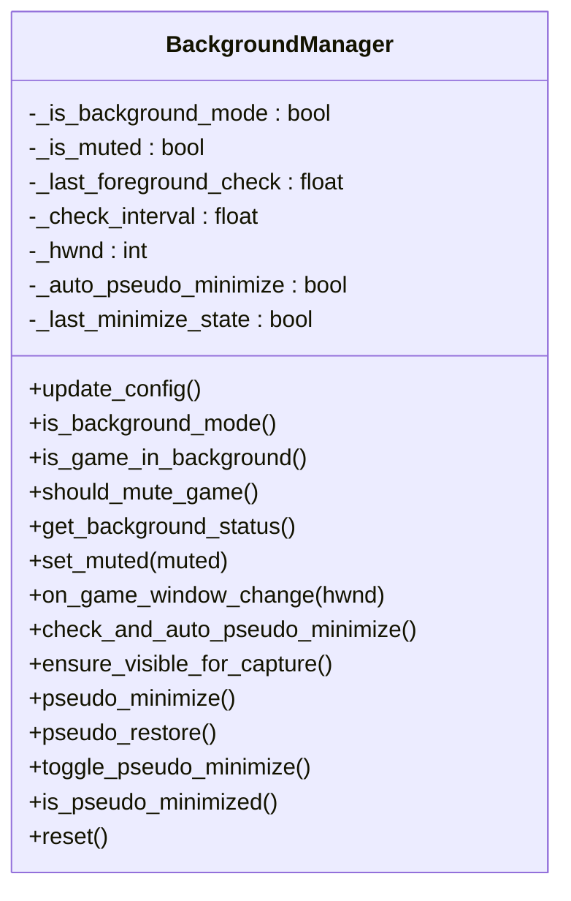
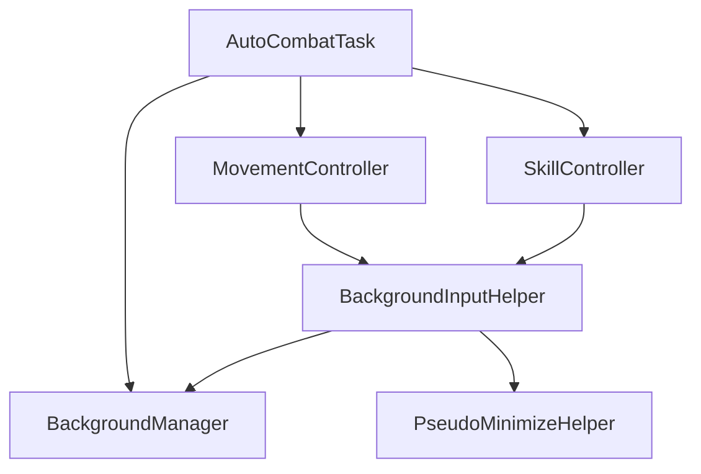

# 后台输入系统

<cite>
**本文档引用的文件**
- [BackgroundInputHelper.py](file://src/utils/BackgroundInputHelper.py)
- [PseudoMinimizeHelper.py](file://src/utils/PseudoMinimizeHelper.py)
- [BackgroundManager.py](file://src/utils/BackgroundManager.py)
- [movement_controller.py](file://src/combat/movement_controller.py)
- [skill_controller.py](file://src/combat/skill_controller.py)
- [AutoCombatTask.py](file://src/task/AutoCombatTask.py)
- [test_input.py](file://test_input.py)
</cite>

## 目录
1. [简介](#简介)
2. [项目结构](#项目结构)
3. [核心组件](#核心组件)
4. [架构总览](#架构总览)
5. [详细组件分析](#详细组件分析)
6. [依赖关系分析](#依赖关系分析)
7. [性能考虑](#性能考虑)
8. [故障排除指南](#故障排除指南)
9. [结论](#结论)
10. [附录](#附录)

## 简介
本文件面向 ok-jump 项目的后台输入系统，重点解析 BackgroundInputHelper 类的实现原理与使用方法，涵盖以下关键主题：
- SendInput 技术与 Windows API 调用
- 虚拟键码映射与输入事件结构体
- 三种输入模式（前台模式、伪最小化模式、自动模式）的工作原理与适用场景
- 窗口激活机制、焦点管理与输入事件处理
- 键盘输入与鼠标输入的具体实现方法（按键发送、鼠标移动、点击、拖拽等）
- 实际使用指南与代码示例路径

本系统专为 Unity 游戏设计，通过 SendInput 实现可靠的后台输入，避免 PostMessage 无法被 Unity 检测的问题。

## 项目结构
后台输入系统主要分布在 utils 与 combat 目录中，核心文件如下：
- utils/BackgroundInputHelper.py：后台输入助手，封装 SendInput、键盘与鼠标操作
- utils/PseudoMinimizeHelper.py：伪最小化工具，支持窗口位置转移与状态恢复
- utils/BackgroundManager.py：后台模式管理器，检测窗口前后台状态并控制伪最小化
- combat/movement_controller.py：移动控制器，使用后台输入发送 WASD 键盘输入
- combat/skill_controller.py：技能控制器，使用后台输入发送技能按键
- task/AutoCombatTask.py：自动战斗任务，集成后台模式与输入控制
- test_input.py：输入测试脚本，验证 pydirectinput 在前台模式下的行为

图表来源
- [BackgroundInputHelper.py:1-841](file://src/utils/BackgroundInputHelper.py#L1-L841)
- [PseudoMinimizeHelper.py:1-238](file://src/utils/PseudoMinimizeHelper.py#L1-L238)
- [BackgroundManager.py:1-155](file://src/utils/BackgroundManager.py#L1-L155)
- [movement_controller.py:1-687](file://src/combat/movement_controller.py#L1-L687)
- [skill_controller.py:1-589](file://src/combat/skill_controller.py#L1-L589)
- [AutoCombatTask.py:1-1366](file://src/task/AutoCombatTask.py#L1-L1366)
- [test_input.py:1-58](file://test_input.py#L1-L58)

章节来源
- [BackgroundInputHelper.py:1-841](file://src/utils/BackgroundInputHelper.py#L1-L841)
- [PseudoMinimizeHelper.py:1-238](file://src/utils/PseudoMinimizeHelper.py#L1-L238)
- [BackgroundManager.py:1-155](file://src/utils/BackgroundManager.py#L1-L155)
- [movement_controller.py:1-687](file://src/combat/movement_controller.py#L1-L687)
- [skill_controller.py:1-589](file://src/combat/skill_controller.py#L1-L589)
- [AutoCombatTask.py:1-1366](file://src/task/AutoCombatTask.py#L1-L1366)
- [test_input.py:1-58](file://test_input.py#L1-L58)

## 核心组件
- BackgroundInputHelper：核心输入助手，负责键盘与鼠标输入的发送，支持三种输入模式与后台模式检测
- PseudoMinimizeHelper：伪最小化工具，将窗口移至屏幕外但仍保持“活动窗口”状态，便于后台 SendInput
- BackgroundManager：后台模式管理器，检测游戏窗口是否在后台并控制伪最小化
- MovementController：移动控制器，使用后台输入发送 WASD 键盘输入
- SkillController：技能控制器，使用后台输入发送技能按键

章节来源
- [BackgroundInputHelper.py:99-117](file://src/utils/BackgroundInputHelper.py#L99-L117)
- [PseudoMinimizeHelper.py:13-26](file://src/utils/PseudoMinimizeHelper.py#L13-L26)
- [BackgroundManager.py:7-17](file://src/utils/BackgroundManager.py#L7-L17)
- [movement_controller.py:24-53](file://src/combat/movement_controller.py#L24-L53)
- [skill_controller.py:82-120](file://src/combat/skill_controller.py#L82-L120)

## 架构总览
后台输入系统采用分层架构：
- 应用层：AutoCombatTask、MovementController、SkillController
- 输入层：BackgroundInputHelper（封装 SendInput 与输入事件）
- 系统层：PseudoMinimizeHelper（窗口伪最小化）、BackgroundManager（后台模式检测）

图表来源
- [AutoCombatTask.py:224-227](file://src/task/AutoCombatTask.py#L224-L227)
- [movement_controller.py:76-86](file://src/combat/movement_controller.py#L76-L86)
- [skill_controller.py:172-182](file://src/combat/skill_controller.py#L172-L182)
- [BackgroundManager.py:101-121](file://src/utils/BackgroundManager.py#L101-L121)
- [BackgroundInputHelper.py:328-356](file://src/utils/BackgroundInputHelper.py#L328-L356)

## 详细组件分析

### BackgroundInputHelper 类分析
BackgroundInputHelper 是后台输入系统的核心，负责：
- 三种输入模式的切换与判断
- SendInput 结构体的构建与发送
- 键盘与鼠标的输入事件处理
- 窗口激活与焦点管理
- 日志记录与错误处理

图表来源
- [BackgroundInputHelper.py:99-117](file://src/utils/BackgroundInputHelper.py#L99-L117)
- [BackgroundInputHelper.py:138-171](file://src/utils/BackgroundInputHelper.py#L138-L171)
- [BackgroundInputHelper.py:143-147](file://src/utils/BackgroundInputHelper.py#L143-L147)
- [BackgroundInputHelper.py:478-533](file://src/utils/BackgroundInputHelper.py#L478-L533)
- [BackgroundInputHelper.py:61-94](file://src/utils/BackgroundInputHelper.py#L61-L94)

#### SendInput 技术与 Windows API
- 使用 ctypes.windll.user32.SendInput 发送输入事件
- 定义 INPUT、KEYBDINPUT、MOUSEINPUT 结构体，支持键盘与鼠标事件
- MapVirtualKeyW 将虚拟键码转换为扫描码，确保输入事件完整

章节来源
- [BackgroundInputHelper.py:61-94](file://src/utils/BackgroundInputHelper.py#L61-L94)
- [BackgroundInputHelper.py:143-147](file://src/utils/BackgroundInputHelper.py#L143-L147)
- [BackgroundInputHelper.py:151-158](file://src/utils/BackgroundInputHelper.py#L151-L158)
- [BackgroundInputHelper.py:163-171](file://src/utils/BackgroundInputHelper.py#L163-L171)

#### 虚拟键码映射
- 提供常用键（字母、数字、功能键、方向键、特殊键）的虚拟键码映射
- 支持大小写不敏感的键名查找

章节来源
- [BackgroundInputHelper.py:44-58](file://src/utils/BackgroundInputHelper.py#L44-L58)
- [BackgroundInputHelper.py:138-141](file://src/utils/BackgroundInputHelper.py#L138-L141)

#### 三种输入模式
- 前台模式（MODE_FOREGROUND）：需要窗口激活，使用 pydirectinput 发送输入
- 伪最小化模式（MODE_PSEUDO）：窗口移至屏幕外但仍为活动窗口，使用 SendInput
- 自动模式（MODE_AUTO）：根据后台模式与伪最小化状态自动选择 SendInput 或前台模式

章节来源
- [BackgroundInputHelper.py:106-109](file://src/utils/BackgroundInputHelper.py#L106-L109)
- [BackgroundInputHelper.py:177-206](file://src/utils/BackgroundInputHelper.py#L177-L206)

#### 窗口激活机制与焦点管理
- _activate_window：使用 AttachThreadInput 绕过前台限制，SetForegroundWindow/SetFocus 激活窗口
- _restore_window_focus：恢复之前前台窗口焦点
- _should_use_sendinput：判断是否应使用 SendInput（后台模式或伪最小化）

章节来源
- [BackgroundInputHelper.py:208-298](file://src/utils/BackgroundInputHelper.py#L208-L298)
- [BackgroundInputHelper.py:300-308](file://src/utils/BackgroundInputHelper.py#L300-L308)
- [BackgroundInputHelper.py:199-206](file://src/utils/BackgroundInputHelper.py#L199-L206)

#### 键盘输入实现
- send_key：发送单个按键（按下并释放），支持持续时间参数
- send_key_down/send_key_up：发送按键按下/释放
- send_keys_hold：同时按住多个键一段时间，用于斜向移动等场景

章节来源
- [BackgroundInputHelper.py:310-356](file://src/utils/BackgroundInputHelper.py#L310-L356)
- [BackgroundInputHelper.py:358-400](file://src/utils/BackgroundInputHelper.py#L358-L400)
- [BackgroundInputHelper.py:402-473](file://src/utils/BackgroundInputHelper.py#L402-L473)

#### 鼠标输入实现
- move_to：将鼠标移动到窗口内坐标（转换为屏幕坐标与归一化坐标）
- mouse_down/mouse_up：在指定位置按下/释放鼠标按钮
- click：点击操作（支持后台模式与前台模式）
- drag：拖拽操作（支持后台模式与前台模式）
- double_click：双击操作

章节来源
- [BackgroundInputHelper.py:534-558](file://src/utils/BackgroundInputHelper.py#L534-L558)
- [BackgroundInputHelper.py:560-628](file://src/utils/BackgroundInputHelper.py#L560-L628)
- [BackgroundInputHelper.py:630-708](file://src/utils/BackgroundInputHelper.py#L630-L708)
- [BackgroundInputHelper.py:710-815](file://src/utils/BackgroundInputHelper.py#L710-L815)
- [BackgroundInputHelper.py:817-836](file://src/utils/BackgroundInputHelper.py#L817-L836)

### PseudoMinimizeHelper 类分析
PseudoMinimizeHelper 负责窗口的伪最小化与状态恢复：
- 将窗口移动到屏幕外（-32000, -32000），但仍保持活动窗口状态
- 保存原始窗口矩形，支持恢复
- 检测窗口最小化、可见性与前台状态

图表来源
- [PseudoMinimizeHelper.py:13-26](file://src/utils/PseudoMinimizeHelper.py#L13-L26)
- [PseudoMinimizeHelper.py:123-163](file://src/utils/PseudoMinimizeHelper.py#L123-L163)
- [PseudoMinimizeHelper.py:165-193](file://src/utils/PseudoMinimizeHelper.py#L165-L193)

章节来源
- [PseudoMinimizeHelper.py:103-104](file://src/utils/PseudoMinimizeHelper.py#L103-L104)
- [PseudoMinimizeHelper.py:123-163](file://src/utils/PseudoMinimizeHelper.py#L123-L163)
- [PseudoMinimizeHelper.py:165-193](file://src/utils/PseudoMinimizeHelper.py#L165-L193)

### BackgroundManager 类分析
BackgroundManager 负责后台模式的检测与控制：
- 检测游戏窗口是否在后台（前台窗口不等于游戏窗口）
- 根据配置自动进行伪最小化
- 提供后台状态查询与静音控制

图表来源
- [BackgroundManager.py:7-17](file://src/utils/BackgroundManager.py#L7-L17)
- [BackgroundManager.py:46-75](file://src/utils/BackgroundManager.py#L46-L75)
- [BackgroundManager.py:101-121](file://src/utils/BackgroundManager.py#L101-L121)

章节来源
- [BackgroundManager.py:46-75](file://src/utils/BackgroundManager.py#L46-L75)
- [BackgroundManager.py:101-121](file://src/utils/BackgroundManager.py#L101-L121)

### MovementController 与 SkillController 分析
- MovementController：基于 WASD 键盘控制，支持后台模式下的 SendInput；提供斜向移动、左右来回移动、向上移动等功能
- SkillController：基于配置的技能按键映射，支持独立冷却机制与后台模式下的 SendInput

章节来源
- [movement_controller.py:33-37](file://src/combat/movement_controller.py#L33-L37)
- [movement_controller.py:306-355](file://src/combat/movement_controller.py#L306-L355)
- [skill_controller.py:112-117](file://src/combat/skill_controller.py#L112-L117)
- [skill_controller.py:202-225](file://src/combat/skill_controller.py#L202-L225)

## 依赖关系分析
- BackgroundInputHelper 依赖 PseudoMinimizeHelper 与 BackgroundManager，用于判断后台模式与伪最小化状态
- MovementController 与 SkillController 依赖 BackgroundInputHelper 进行输入发送
- AutoCombatTask 负责初始化后台模式与伪最小化，并在主循环中调用控制器

图表来源
- [BackgroundInputHelper.py:24](file://src/utils/BackgroundInputHelper.py#L24)
- [movement_controller.py:18](file://src/combat/movement_controller.py#L18)
- [skill_controller.py:23](file://src/combat/skill_controller.py#L23)
- [AutoCombatTask.py:31](file://src/task/AutoCombatTask.py#L31)

章节来源
- [BackgroundInputHelper.py:24](file://src/utils/BackgroundInputHelper.py#L24)
- [movement_controller.py:18](file://src/combat/movement_controller.py#L18)
- [skill_controller.py:23](file://src/combat/skill_controller.py#L23)
- [AutoCombatTask.py:31](file://src/task/AutoCombatTask.py#L31)

## 性能考虑
- SendInput 直接注入底层输入，避免前台切换开销，适合后台模式
- 前台模式使用 pydirectinput，简单易用但会触发窗口激活
- 后台模式下建议使用 send_keys_hold 进行多键组合，减少按键切换次数
- 鼠标拖拽采用分步移动策略，平衡流畅度与稳定性

## 故障排除指南
- 输入无效：确认游戏窗口是否在后台或最小化，必要时启用伪最小化
- 键盘输入失败：检查虚拟键码映射是否正确，或切换到前台模式
- 鼠标点击不生效：确认坐标转换是否正确，窗口是否被遮挡
- 窗口激活失败：检查 AttachThreadInput 权限与异常日志

章节来源
- [BackgroundInputHelper.py:235-237](file://src/utils/BackgroundInputHelper.py#L235-L237)
- [BackgroundInputHelper.py:544-558](file://src/utils/BackgroundInputHelper.py#L544-L558)
- [BackgroundInputHelper.py:647-657](file://src/utils/BackgroundInputHelper.py#L647-L657)

## 结论
ok-jump 的后台输入系统通过 BackgroundInputHelper 将 SendInput 技术与窗口管理相结合，实现了对 Unity 游戏的稳定后台输入。配合 PseudoMinimizeHelper 与 BackgroundManager，系统能够在不同输入模式间自动切换，满足前台与后台场景的需求。MovementController 与 SkillController 则提供了完整的键盘与技能输入能力，适用于自动战斗等自动化场景。

## 附录

### 使用指南与代码示例路径
- 初始化后台输入助手并设置窗口句柄
  - [BackgroundInputHelper.set_hwnd:118-120](file://src/utils/BackgroundInputHelper.py#L118-L120)
  - [movement_controller._init_background_input:76-86](file://src/combat/movement_controller.py#L76-L86)
  - [skill_controller._init_background_input:172-182](file://src/combat/skill_controller.py#L172-L182)

- 发送单个按键
  - [BackgroundInputHelper.send_key:310-356](file://src/utils/BackgroundInputHelper.py#L310-L356)
  - [movement_controller._press_movement_keys:306-355](file://src/combat/movement_controller.py#L306-L355)
  - [skill_controller._send_skill_key:202-225](file://src/combat/skill_controller.py#L202-L225)

- 同时按住多个键
  - [BackgroundInputHelper.send_keys_hold:402-473](file://src/utils/BackgroundInputHelper.py#L402-L473)

- 鼠标操作
  - [BackgroundInputHelper.move_to:534-558](file://src/utils/BackgroundInputHelper.py#L534-L558)
  - [BackgroundInputHelper.click:630-708](file://src/utils/BackgroundInputHelper.py#L630-L708)
  - [BackgroundInputHelper.drag:710-815](file://src/utils/BackgroundInputHelper.py#L710-L815)

- 前台模式测试
  - [test_input.py:1-58](file://test_input.py#L1-L58)