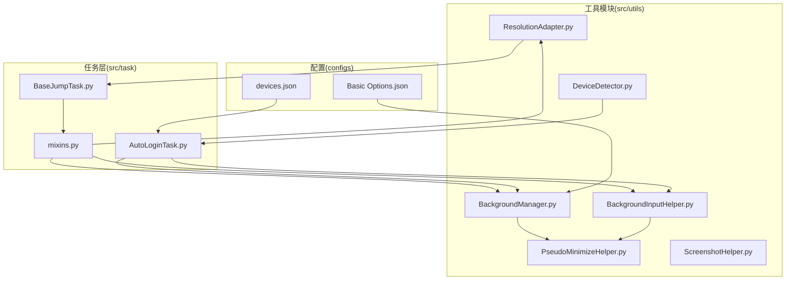
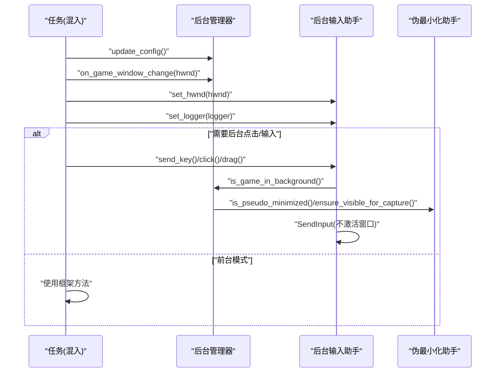
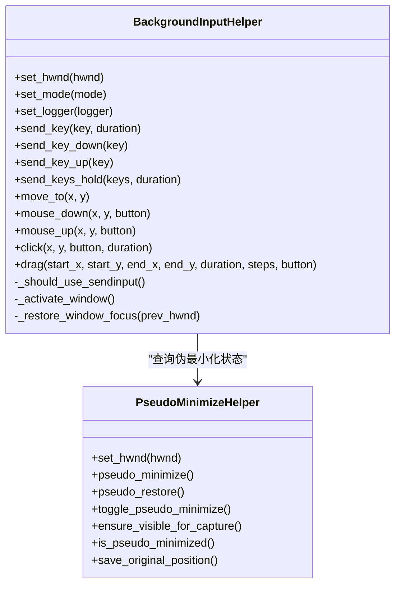
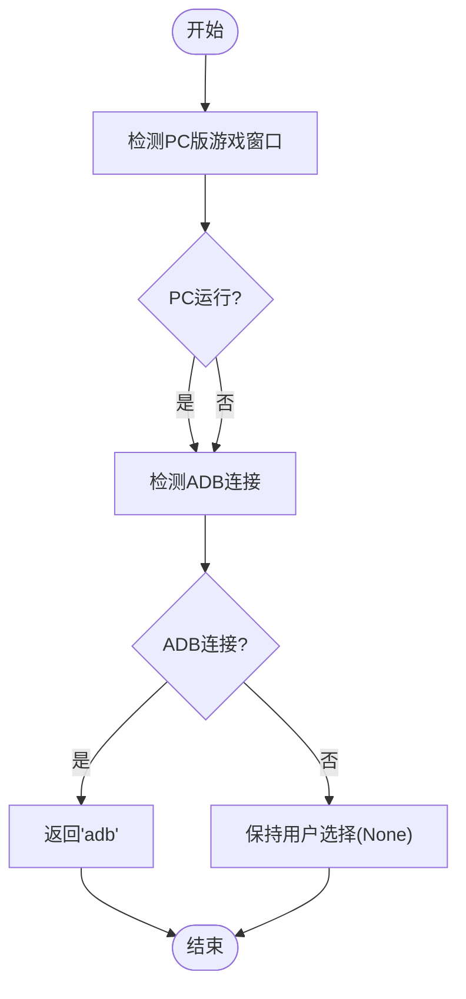
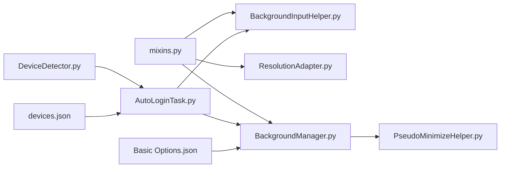

# 工具模块

<cite>
**本文档引用的文件**
- [BackgroundInputHelper.py](file://src/utils/BackgroundInputHelper.py)
- [BackgroundManager.py](file://src/utils/BackgroundManager.py)
- [DeviceDetector.py](file://src/utils/DeviceDetector.py)
- [ScreenshotHelper.py](file://src/utils/ScreenshotHelper.py)
- [ResolutionAdapter.py](file://src/utils/ResolutionAdapter.py)
- [PseudoMinimizeHelper.py](file://src/utils/PseudoMinimizeHelper.py)
- [mixins.py](file://src/task/mixins.py)
- [AutoLoginTask.py](file://src/task/AutoLoginTask.py)
- [BaseJumpTask.py](file://src/task/BaseJumpTask.py)
- [features.py](file://src/constants/features.py)
- [devices.json](file://configs/devices.json)
- [Basic Options.json](file://configs/Basic Options.json)
</cite>

## 目录
1. [简介](#简介)
2. [项目结构](#项目结构)
3. [核心组件](#核心组件)
4. [架构总览](#架构总览)
5. [详细组件分析](#详细组件分析)
6. [依赖关系分析](#依赖关系分析)
7. [性能考量](#性能考量)
8. [故障排查指南](#故障排查指南)
9. [结论](#结论)
10. [附录](#附录)

## 简介
本文件面向 ok-jump 项目的工具模块，系统性梳理并解释以下工具链的功能与实现：
- 后台输入系统：基于 SendInput 的 Unity 游戏后台输入支持，窗口管理与输入模式切换
- 设备检测系统：PC/模拟器识别、ADB 连接管理、智能设备选择
- 截图系统：截图保存、特征模板提取、COCO 格式标注辅助
- 分辨率适配系统：参考分辨率与比例、坐标缩放与相对坐标转换
- 后台管理系统：后台模式开关、伪最小化、静音策略与可见性保障

同时给出使用指南与扩展建议，帮助开发者在不同分辨率、窗口状态与设备环境下稳定运行自动化任务。

## 项目结构
工具模块主要位于 src/utils 下，配合 src/task 中的混入类与任务实现进行集成使用；配置文件位于 configs 目录，用于设备选择与基本行为开关。

**图表来源**
- [BackgroundInputHelper.py](file://src/utils/BackgroundInputHelper.py)
- [BackgroundManager.py](file://src/utils/BackgroundManager.py)
- [PseudoMinimizeHelper.py](file://src/utils/PseudoMinimizeHelper.py)
- [DeviceDetector.py](file://src/utils/DeviceDetector.py)
- [ScreenshotHelper.py](file://src/utils/ScreenshotHelper.py)
- [ResolutionAdapter.py](file://src/utils/ResolutionAdapter.py)
- [mixins.py](file://src/task/mixins.py)
- [AutoLoginTask.py](file://src/task/AutoLoginTask.py)
- [BaseJumpTask.py](file://src/task/BaseJumpTask.py)
- [devices.json](file://configs/devices.json)
- [Basic Options.json](file://configs/Basic Options.json)

**章节来源**
- [BackgroundInputHelper.py](file://src/utils/BackgroundInputHelper.py)
- [BackgroundManager.py](file://src/utils/BackgroundManager.py)
- [PseudoMinimizeHelper.py](file://src/utils/PseudoMinimizeHelper.py)
- [DeviceDetector.py](file://src/utils/DeviceDetector.py)
- [ScreenshotHelper.py](file://src/utils/ScreenshotHelper.py)
- [ResolutionAdapter.py](file://src/utils/ResolutionAdapter.py)
- [mixins.py](file://src/task/mixins.py)
- [AutoLoginTask.py](file://src/task/AutoLoginTask.py)
- [BaseJumpTask.py](file://src/task/BaseJumpTask.py)
- [devices.json](file://configs/devices.json)
- [Basic Options.json](file://configs/Basic Options.json)

## 核心组件
- 后台输入助手：封装 SendInput 与前台输入切换，支持键盘、鼠标、拖拽与坐标转换
- 后台管理器：读取配置、判断后台状态、控制伪最小化与静音
- 伪最小化助手：窗口位置伪移动、状态保存与恢复
- 设备检测器：窗口标题关键词识别 PC/模拟器，ADB 连接状态检测与智能默认设备选择
- 截图助手：截图保存、特征模板提取、COCO 格式辅助
- 分辨率适配器：参考分辨率与比例、坐标缩放、相对坐标转换、推荐重采样尺寸

**章节来源**
- [BackgroundInputHelper.py](file://src/utils/BackgroundInputHelper.py)
- [BackgroundManager.py](file://src/utils/BackgroundManager.py)
- [PseudoMinimizeHelper.py](file://src/utils/PseudoMinimizeHelper.py)
- [DeviceDetector.py](file://src/utils/DeviceDetector.py)
- [ScreenshotHelper.py](file://src/utils/ScreenshotHelper.py)
- [ResolutionAdapter.py](file://src/utils/ResolutionAdapter.py)

## 架构总览
工具模块通过任务混入类与任务实现解耦协作：
- 任务混入类提供统一的后台输入、分辨率适配与后台管理接口
- 自动登录任务负责初始化后台模式与窗口句柄
- 后台管理器与伪最小化助手协同保证后台截图与输入的稳定性
- 设备检测器为任务选择合适的设备来源（PC/ADB）

**图表来源**
- [mixins.py](file://src/task/mixins.py)
- [BackgroundManager.py](file://src/utils/BackgroundManager.py)
- [BackgroundInputHelper.py](file://src/utils/BackgroundInputHelper.py)
- [PseudoMinimizeHelper.py](file://src/utils/PseudoMinimizeHelper.py)
- [AutoLoginTask.py](file://src/task/AutoLoginTask.py)

## 详细组件分析

### 后台输入系统
- 功能要点
  - SendInput 技术：针对 Unity 游戏使用 DirectInput/Raw Input，PostMessage 无效，需使用 SendInput
  - 输入模式：前台模式（需要窗口激活）、伪最小化模式（窗口移至屏幕外仍保持活动）、自动模式（根据后台状态自动选择）
  - 键盘：单键、组合键、持续按住，支持持续时间控制
  - 鼠标：窗口内坐标转屏幕坐标、归一化坐标转换、点击/拖拽、分步移动
  - 窗口管理：前台窗口保存与恢复、AttachThreadInput 技巧规避激活限制
- 关键实现路径
  - SendInput 结构体定义与输入事件发送
  - 虚拟键码映射与扫描码生成
  - 坐标转换：窗口坐标→屏幕坐标→归一化坐标
  - 输入模式判定：后台模式或伪最小化时使用 SendInput
  - 前台模式：使用 pydirectinput 直接发送
- 使用建议
  - 在后台模式下优先使用后台输入助手，避免窗口前置导致的交互中断
  - 长按/拖拽操作建议设置合理的延时，确保底层输入生效

**图表来源**
- [BackgroundInputHelper.py](file://src/utils/BackgroundInputHelper.py)
- [PseudoMinimizeHelper.py](file://src/utils/PseudoMinimizeHelper.py)

**章节来源**
- [BackgroundInputHelper.py](file://src/utils/BackgroundInputHelper.py)
- [PseudoMinimizeHelper.py](file://src/utils/PseudoMinimizeHelper.py)

### 设备检测系统
- 功能要点
  - PC 版检测：通过枚举窗口标题，匹配关键词并排除模拟器与工具窗口
  - ADB 连接检测：优先使用 adbutils，回退到系统 adb 命令
  - 智能默认设备：仅 PC 运行返回 'pc'，仅 ADB 连接返回 'adb'，否则保持用户选择
- 关键实现路径
  - 窗口枚举回调：过滤关键词、匹配游戏标题
  - ADB 设备列表解析：adb devices 输出解析
  - 默认设备选择：基于 PC/ADB 状态的决策
- 使用建议
  - 在任务启动前调用设备状态查询，结合配置文件 preferred 字段决定初始设备
  - 若 ADB 未安装，确保系统 PATH 包含 adb 可执行文件

**图表来源**
- [DeviceDetector.py](file://src/utils/DeviceDetector.py)
- [devices.json](file://configs/devices.json)

**章节来源**
- [DeviceDetector.py](file://src/utils/DeviceDetector.py)
- [devices.json](file://configs/devices.json)

### 截图与图像处理
- 功能要点
  - 截图保存：自动命名、PNG 格式、时间戳命名
  - 特征模板提取：按指定区域裁剪并保存到 features 子目录
  - COCO 格式辅助：生成图像条目与标注条目字典，便于数据集构建
- 关键实现路径
  - 保存截图：文件夹不存在自动创建
  - 提取模板：相对坐标裁剪并保存
  - COCO 辅助：构造标准字段
- 使用建议
  - 在调试与训练阶段配合特征模板提取，提升检测精度
  - 导出标注时注意类别 ID 与 bbox 的一致性

**章节来源**
- [ScreenshotHelper.py](file://src/utils/ScreenshotHelper.py)

### 分辨率适配系统
- 功能要点
  - 参考分辨率与支持比例：支持从配置加载参考宽高与比例
  - 缩放因子：按当前分辨率计算 x/y 缩放因子
  - 坐标缩放：点、宽高、矩形框的缩放与相对坐标转换
  - 比例校验：判断当前比例与支持比例差异
  - 推荐重采样：根据当前分辨率推荐合适的重采样尺寸
- 关键实现路径
  - 配置加载：从全局配置读取 reference_resolution 与 supported_resolution
  - 比例与缩放：更新当前分辨率后计算缩放因子与比例校验
  - 相对坐标：提供 to/from 相对坐标转换
- 使用建议
  - 在多分辨率环境下，优先使用缩放坐标与相对坐标，减少硬编码
  - 结合任务混入类的分辨率检查，确保在后台模式下也能正确缩放

**章节来源**
- [ResolutionAdapter.py](file://src/utils/ResolutionAdapter.py)
- [mixins.py](file://src/task/mixins.py)

### 后台管理系统
- 功能要点
  - 后台模式开关：从配置读取“后台模式”与“最小化时伪最小化”
  - 后台状态判断：前台窗口句柄对比，缓存检查频率
  - 静音策略：后台时静音游戏开关
  - 伪最小化：自动伪最小化、保存原位置、恢复
  - 可见性保障：确保截图时窗口可见
- 关键实现路径
  - 配置读取：优先中文配置名，回退英文配置名
  - 状态缓存：定时检查，避免频繁调用系统 API
  - 窗口句柄同步：与设备管理器同步 hwnd_window
- 使用建议
  - 在任务初始化阶段调用 update_config 与 on_game_window_change
  - 后台模式开启时，配合伪最小化助手保证后台截图与输入稳定

**章节来源**
- [BackgroundManager.py](file://src/utils/BackgroundManager.py)
- [PseudoMinimizeHelper.py](file://src/utils/PseudoMinimizeHelper.py)
- [Basic Options.json](file://configs/Basic Options.json)

## 依赖关系分析
- 任务混入类依赖后台输入助手、分辨率适配器与后台管理器
- 自动登录任务负责初始化后台模式与窗口句柄
- 后台管理器依赖伪最小化助手与设备管理器的窗口句柄
- 设备检测器与配置文件 devices.json 协同决定设备来源

**图表来源**
- [mixins.py](file://src/task/mixins.py)
- [BackgroundManager.py](file://src/utils/BackgroundManager.py)
- [BackgroundInputHelper.py](file://src/utils/BackgroundInputHelper.py)
- [PseudoMinimizeHelper.py](file://src/utils/PseudoMinimizeHelper.py)
- [DeviceDetector.py](file://src/utils/DeviceDetector.py)
- [devices.json](file://configs/devices.json)
- [Basic Options.json](file://configs/Basic Options.json)

**章节来源**
- [mixins.py](file://src/task/mixins.py)
- [BackgroundManager.py](file://src/utils/BackgroundManager.py)
- [BackgroundInputHelper.py](file://src/utils/BackgroundInputHelper.py)
- [PseudoMinimizeHelper.py](file://src/utils/PseudoMinimizeHelper.py)
- [DeviceDetector.py](file://src/utils/DeviceDetector.py)
- [devices.json](file://configs/devices.json)
- [Basic Options.json](file://configs/Basic Options.json)

## 性能考量
- 后台输入
  - SendInput 无需激活窗口，避免前台切换开销；前台模式使用 pydirectinput，适合交互调试
  - 坐标转换与归一化计算为常数级，影响可忽略
- 后台管理
  - 状态检查带缓存，降低频繁调用系统 API 的成本
  - 伪最小化仅在必要时执行，减少窗口操作次数
- 设备检测
  - 窗口枚举与 ADB 命令调用为 IO 密集，建议在任务启动时一次性检测并缓存
- 分辨率适配
  - 缩放与相对坐标转换为 O(1)，可在循环中频繁调用
- 截图
  - 图像写入为 IO 密集，建议批量保存或异步处理

## 故障排查指南
- 后台输入无效
  - 确认后台模式已启用且窗口句柄有效
  - 检查是否处于伪最小化状态，必要时调用伪最小化助手
  - 查看日志输出，定位 SendInput 失败原因
- 窗口激活失败
  - 检查是否跨线程，使用 AttachThreadInput 技巧
  - 确保窗口句柄有效且非最小化
- ADB 未连接
  - 确认 adbutils 已安装或系统 adb 可用
  - 检查 adb devices 输出，确认设备状态为 device
- 分辨率不匹配
  - 更新参考分辨率与支持比例配置
  - 使用相对坐标或缩放坐标替代硬编码像素坐标
- 截图异常
  - 检查截图目录权限与磁盘空间
  - 确认图像数据非空后再保存

**章节来源**
- [BackgroundInputHelper.py](file://src/utils/BackgroundInputHelper.py)
- [BackgroundManager.py](file://src/utils/BackgroundManager.py)
- [PseudoMinimizeHelper.py](file://src/utils/PseudoMinimizeHelper.py)
- [DeviceDetector.py](file://src/utils/DeviceDetector.py)
- [ScreenshotHelper.py](file://src/utils/ScreenshotHelper.py)
- [ResolutionAdapter.py](file://src/utils/ResolutionAdapter.py)

## 结论
工具模块围绕“后台输入稳定性、设备来源智能化、截图与标注规范化、分辨率适配一致性”四大目标构建，通过后台管理器与伪最小化助手保障后台运行，通过设备检测器与配置文件实现智能设备选择，通过分辨率适配器与任务混入类实现跨分辨率兼容，通过截图助手完善数据采集闭环。开发者可在此基础上扩展新设备支持、优化输入延迟与稳定性，并引入 OCR/检测集成以增强自动化能力。

## 附录
- 使用指南
  - 初始化后台模式：在任务启动时调用后台管理器更新配置与设置窗口句柄
  - 后台输入：在后台模式下使用后台输入助手发送按键与鼠标事件
  - 分辨率适配：优先使用相对坐标与缩放坐标，避免硬编码像素
  - 设备选择：结合设备检测器与配置文件 preferred 字段决定初始设备
- 扩展建议
  - 新增设备类型：在设备检测器中增加关键词与 ADB 命令支持
  - 输入模式扩展：支持触摸手势、滚轮等鼠标事件
  - OCR 集成：结合截图助手与特征常量，完善文本识别与交互
  - 性能优化：对高频调用的 API 添加缓存与批处理

**章节来源**
- [mixins.py](file://src/task/mixins.py)
- [AutoLoginTask.py](file://src/task/AutoLoginTask.py)
- [BaseJumpTask.py](file://src/task/BaseJumpTask.py)
- [features.py](file://src/constants/features.py)
- [devices.json](file://configs/devices.json)
- [Basic Options.json](file://configs/Basic Options.json)