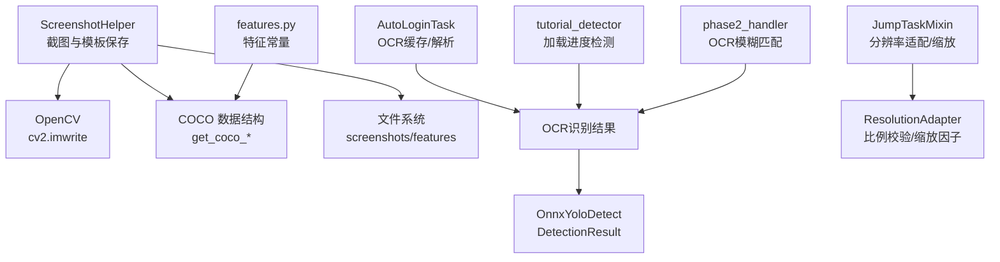
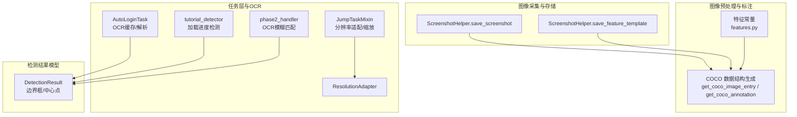
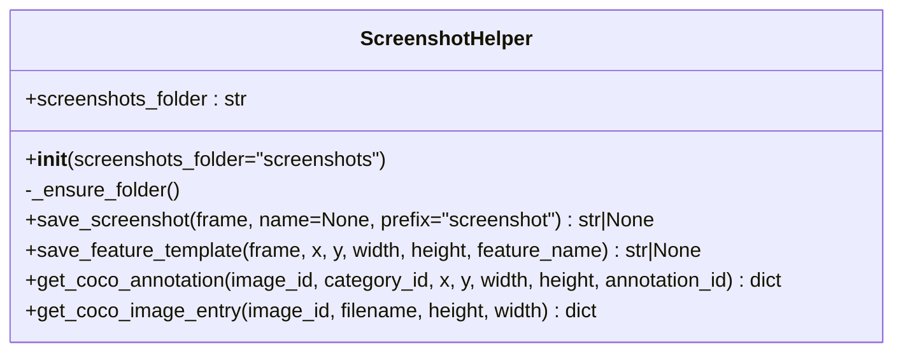
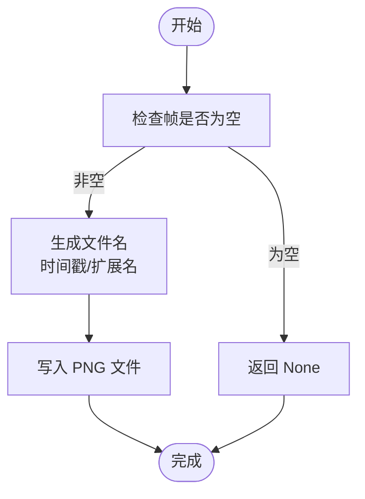
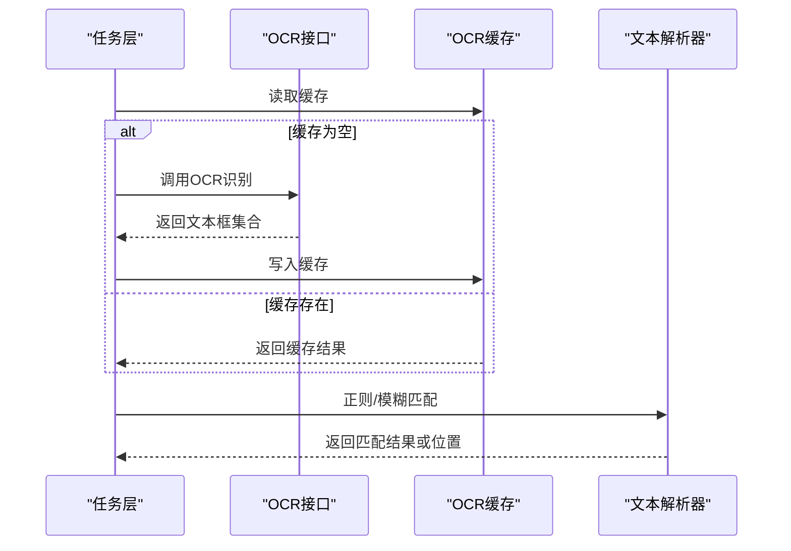
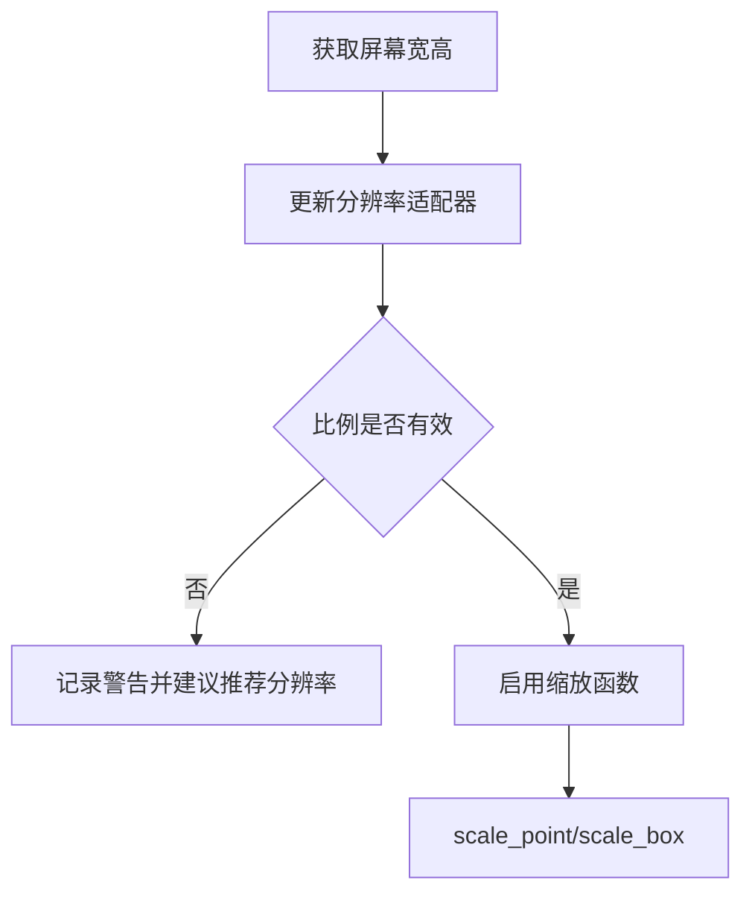
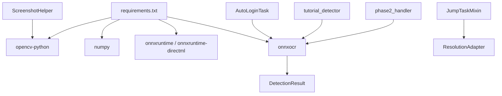

# 截图和图像处理

<cite>
**本文引用的文件**
- [ScreenshotHelper.py](file://src/utils/ScreenshotHelper.py)
- [coco_detection.json](file://assets/coco_detection.json)
- [features.py](file://src/constants/features.py)
- [mixins.py](file://src/task/mixins.py)
- [ResolutionAdapter.py](file://src/utils/ResolutionAdapter.py)
- [AutoLoginTask.py](file://src/task/AutoLoginTask.py)
- [tutorial_detector.py](file://src/tutorial/tutorial_detector.py)
- [phase2_handler.py](file://src/tutorial/phase2_handler.py)
- [requirements.txt](file://requirements.txt)
- [OnnxYoloDetect.py](file://src/OnnxYoloDetect.py)
</cite>

## 目录
1. [简介](#简介)
2. [项目结构](#项目结构)
3. [核心组件](#核心组件)
4. [架构总览](#架构总览)
5. [详细组件分析](#详细组件分析)
6. [依赖分析](#依赖分析)
7. [性能考虑](#性能考虑)
8. [故障排查指南](#故障排查指南)
9. [结论](#结论)
10. [附录](#附录)

## 简介
本文件面向 ok-jump 项目的截图与图像处理子系统，重点围绕 ScreenshotHelper 类展开，系统性阐述其功能、实现原理、与图像预处理的关系、OCR 集成方式、性能优化策略以及实际使用示例与常见问题。文档同时梳理了项目中与图像处理密切相关的模块（如分辨率适配、特征常量、OCR 缓存与解析、YOLO 检测结果模型等），帮助读者在理解整体架构的同时，掌握在不同场景下的最佳实践。

## 项目结构
本节聚焦与截图和图像处理相关的关键文件及其职责：
- ScreenshotHelper：负责截图保存、特征模板裁剪与 COCO 数据结构生成。
- coco_detection.json：包含图像、类别与标注的 JSON 配置，支撑模板匹配与标注导出。
- features.py：集中管理所有特征名称常量，确保与 coco_detection.json 保持一致。
- mixins.py：提供分辨率适配、坐标缩放、OCR 缓存等通用能力，为任务层提供图像处理前置条件。
- ResolutionAdapter：维护参考分辨率与当前分辨率的比例校验与缩放因子。
- AutoLoginTask、tutorial_detector、phase2_handler：展示 OCR 的使用、缓存与解析流程。
- OnnxYoloDetect：提供检测结果数据模型，便于后续处理与可视化。

**图表来源**
- [ScreenshotHelper.py:1-67](file://src/utils/ScreenshotHelper.py#L1-L67)
- [coco_detection.json:1-587](file://assets/coco_detection.json#L1-L587)
- [features.py:1-100](file://src/constants/features.py#L1-L100)
- [mixins.py:106-184](file://src/task/mixins.py#L106-L184)
- [ResolutionAdapter.py:1-43](file://src/utils/ResolutionAdapter.py#L1-L43)
- [AutoLoginTask.py:344-441](file://src/task/AutoLoginTask.py#L344-L441)
- [tutorial_detector.py:376-738](file://src/tutorial/tutorial_detector.py#L376-L738)
- [phase2_handler.py:1441-1476](file://src/tutorial/phase2_handler.py#L1441-L1476)
- [OnnxYoloDetect.py:261-314](file://src/OnnxYoloDetect.py#L261-L314)

**章节来源**
- [ScreenshotHelper.py:1-67](file://src/utils/ScreenshotHelper.py#L1-L67)
- [coco_detection.json:1-587](file://assets/coco_detection.json#L1-L587)
- [features.py:1-100](file://src/constants/features.py#L1-L100)
- [mixins.py:106-184](file://src/task/mixins.py#L106-L184)
- [ResolutionAdapter.py:1-43](file://src/utils/ResolutionAdapter.py#L1-L43)
- [AutoLoginTask.py:344-441](file://src/task/AutoLoginTask.py#L344-L441)
- [tutorial_detector.py:376-738](file://src/tutorial/tutorial_detector.py#L376-L738)
- [phase2_handler.py:1441-1476](file://src/tutorial/phase2_handler.py#L1441-L1476)
- [OnnxYoloDetect.py:261-314](file://src/OnnxYoloDetect.py#L261-L314)

## 核心组件
- ScreenshotHelper：提供截图保存、特征模板裁剪、COCO 图像与标注条目生成等能力，支撑离线调试与训练数据准备。
- 分辨率适配与缩放：通过 ResolutionAdapter 与 JumpTaskMixin 的协作，保证不同分辨率下的坐标与区域一致性。
- OCR 集成：任务层通过框架提供的 OCR 接口获取文本框集合，结合缓存与模糊匹配策略进行定位与交互。
- YOLO 检测结果模型：DetectionResult 提供边界框、中心点、坐标系转换等属性，便于后续处理。

**章节来源**
- [ScreenshotHelper.py:1-67](file://src/utils/ScreenshotHelper.py#L1-L67)
- [ResolutionAdapter.py:1-43](file://src/utils/ResolutionAdapter.py#L1-L43)
- [mixins.py:106-184](file://src/task/mixins.py#L106-L184)
- [OnnxYoloDetect.py:261-314](file://src/OnnxYoloDetect.py#L261-L314)

## 架构总览
下图展示了截图与图像处理在系统中的位置与交互关系：

**图表来源**
- [ScreenshotHelper.py:17-64](file://src/utils/ScreenshotHelper.py#L17-L64)
- [coco_detection.json:1-587](file://assets/coco_detection.json#L1-L587)
- [features.py:1-100](file://src/constants/features.py#L1-L100)
- [mixins.py:106-184](file://src/task/mixins.py#L106-L184)
- [ResolutionAdapter.py:1-43](file://src/utils/ResolutionAdapter.py#L1-L43)
- [AutoLoginTask.py:344-441](file://src/task/AutoLoginTask.py#L344-L441)
- [tutorial_detector.py:376-738](file://src/tutorial/tutorial_detector.py#L376-L738)
- [phase2_handler.py:1441-1476](file://src/tutorial/phase2_handler.py#L1441-L1476)
- [OnnxYoloDetect.py:261-314](file://src/OnnxYoloDetect.py#L261-L314)

## 详细组件分析

### ScreenshotHelper 组件分析
- 功能概述
  - 截图保存：将帧写入 PNG 文件，支持自动生成时间戳命名与扩展名补全。
  - 特征模板裁剪：按指定区域裁剪并保存为独立模板，便于模板匹配与标注。
  - COCO 数据结构生成：提供图像与标注条目的构造方法，便于导出标注数据集。
- 实现要点
  - 目录管理：首次使用自动创建截图目录与 features 子目录。
  - 参数健壮性：对空帧与文件名进行判空与扩展名处理。
  - OpenCV 写入：基于 cv2.imwrite 进行高效图像持久化。
- 使用建议
  - 在关键流程节点调用截图保存，便于问题复现与回归测试。
  - 模板裁剪时注意 ROI 的稳定性与分辨率一致性。

**图表来源**
- [ScreenshotHelper.py:7-64](file://src/utils/ScreenshotHelper.py#L7-L64)

**章节来源**
- [ScreenshotHelper.py:1-67](file://src/utils/ScreenshotHelper.py#L1-L67)

### 图像预处理与标注
- 预处理环节
  - ROI 裁剪：通过 ScreenshotHelper.save_feature_template 从原图中裁剪感兴趣区域，形成模板。
  - 分辨率一致性：通过 JumpTaskMixin.update_resolution 与 ResolutionAdapter.update_resolution 更新当前分辨率，确保模板与标注在不同设备上的一致性。
  - COCO 导出：利用 ScreenshotHelper.get_coco_image_entry 与 get_coco_annotation 生成标准标注条目，配合 coco_detection.json 的类别定义，形成可复用的数据集。
- 复杂度与性能
  - ROI 裁剪与写入为 O(W×H)（像素级），受图像尺寸影响；通过控制裁剪区域大小与频率可降低开销。
  - COCO 条目生成为 O(1) 字典构造，开销极低。

**图表来源**
- [ScreenshotHelper.py:17-30](file://src/utils/ScreenshotHelper.py#L17-L30)

**章节来源**
- [ScreenshotHelper.py:1-67](file://src/utils/ScreenshotHelper.py#L1-L67)
- [mixins.py:106-123](file://src/task/mixins.py#L106-L123)
- [ResolutionAdapter.py:34-43](file://src/utils/ResolutionAdapter.py#L34-L43)
- [coco_detection.json:1-587](file://assets/coco_detection.json#L1-L587)

### OCR 集成与文本解析
- OCR 能力来源
  - 任务层通过框架提供的 OCR 接口获取文本框集合，每个文本框包含名称与边界信息。
- 缓存策略
  - AutoLoginTask 中实现了 OCR 结果缓存与清理逻辑，避免重复识别带来的性能损耗。
- 文本解析与匹配
  - AutoLoginTask 展示了在特定区域（右下角）进行百分比识别的流程，结合正则表达式提取数值。
  - phase2_handler 展示了简繁双语的 OCR 文本检测与模糊匹配策略，支持“完整匹配”“分字匹配”“部分匹配”三种方式。
- 结果模型
  - DetectionResult 提供边界框、中心点等属性，便于后续点击或定位。

**图表来源**
- [AutoLoginTask.py:344-361](file://src/task/AutoLoginTask.py#L344-L361)
- [AutoLoginTask.py:412-437](file://src/task/AutoLoginTask.py#L412-L437)
- [phase2_handler.py:1441-1476](file://src/tutorial/phase2_handler.py#L1441-L1476)
- [OnnxYoloDetect.py:261-314](file://src/OnnxYoloDetect.py#L261-L314)

**章节来源**
- [AutoLoginTask.py:344-441](file://src/task/AutoLoginTask.py#L344-L441)
- [tutorial_detector.py:376-738](file://src/tutorial/tutorial_detector.py#L376-L738)
- [phase2_handler.py:1441-1476](file://src/tutorial/phase2_handler.py#L1441-L1476)
- [OnnxYoloDetect.py:261-314](file://src/OnnxYoloDetect.py#L261-L314)

### 分辨率适配与坐标缩放
- 分辨率适配
  - JumpTaskMixin.update_resolution 从屏幕宽高更新 ResolutionAdapter，随后提供 scale_point 与 scale_box 将参考分辨率坐标映射到当前分辨率。
- 16:9 比例校验
  - ResolutionAdapter 基于配置计算支持的比例，若当前比例偏离阈值，任务层会发出警告并建议推荐分辨率，有助于减少识别误差。
- 应用场景
  - 在模板匹配与 OCR 区域定位时，先进行分辨率更新与比例校验，再进行缩放，可显著提升跨设备稳定性。

**图表来源**
- [mixins.py:106-184](file://src/task/mixins.py#L106-L184)
- [ResolutionAdapter.py:19-43](file://src/utils/ResolutionAdapter.py#L19-L43)

**章节来源**
- [mixins.py:106-184](file://src/task/mixins.py#L106-L184)
- [ResolutionAdapter.py:1-43](file://src/utils/ResolutionAdapter.py#L1-L43)

## 依赖分析
- 外部库依赖
  - opencv-python：图像写入与基础图像处理。
  - numpy：数组与矩阵运算，通常与 cv2 协同使用。
  - onnxruntime/onnxruntime-directml：推理引擎，支撑 ONNX 模型（如 YOLO）。
  - onnxocr：OCR 能力来源，任务层通过框架接口调用。
- 内部模块耦合
  - ScreenshotHelper 与文件系统耦合，与 OpenCV 强耦合，但与业务逻辑弱耦合，便于复用。
  - JumpTaskMixin 与 ResolutionAdapter 强耦合，确保坐标与区域的正确性。
  - OCR 流程与 DetectionResult 解耦，便于替换不同 OCR 引擎或后处理策略。

**图表来源**
- [requirements.txt:1-17](file://requirements.txt#L1-L17)
- [ScreenshotHelper.py:1-6](file://src/utils/ScreenshotHelper.py#L1-L6)
- [mixins.py:1-12](file://src/task/mixins.py#L1-L12)
- [AutoLoginTask.py:1-10](file://src/task/AutoLoginTask.py#L1-L10)
- [tutorial_detector.py:789-822](file://src/tutorial/tutorial_detector.py#L789-L822)
- [phase2_handler.py:1441-1476](file://src/tutorial/phase2_handler.py#L1441-L1476)
- [OnnxYoloDetect.py:261-314](file://src/OnnxYoloDetect.py#L261-L314)

**章节来源**
- [requirements.txt:1-17](file://requirements.txt#L1-L17)

## 性能考虑
- 缓存机制
  - OCR 结果缓存：在 AutoLoginTask 中实现缓存与清理，避免重复识别，显著降低 CPU 与 I/O 开销。
  - 建议：在高频检测场景（如教程结束检测）中，周期性清理缓存以获取最新结果。
- 内存复用
  - ROI 裁剪与模板保存：尽量重用中间数组，避免频繁分配；对大图进行分块处理或限制裁剪区域大小。
- 处理速度提升
  - 降低分辨率：在不影响识别精度的前提下，缩小输入图像尺寸可显著提升速度。
  - 区域限定：仅对关键区域执行 OCR 或模板匹配，减少无效计算。
  - 并行化：在多线程环境下，将图像写入与 OCR 识别分离，避免阻塞主线程。
- 稳定性保障
  - 分辨率适配：始终在每次新帧到达时更新分辨率并进行比例校验，防止坐标漂移导致误检。
  - 日志与诊断：在关键节点输出 OCR 文本与检测结果摘要，便于快速定位问题。

[本节为通用性能指导，无需具体文件分析]

## 故障排查指南
- 截图保存失败
  - 现象：返回 None 或抛出异常。
  - 排查：确认 frame 非空且为有效数组；检查目标目录权限与磁盘空间；确保文件名以 .png 结尾。
  - 参考：[ScreenshotHelper.save_screenshot:17-30](file://src/utils/ScreenshotHelper.py#L17-L30)
- 模板匹配失败
  - 现象：特征模板无法匹配。
  - 排查：确认模板与当前分辨率一致；检查 coco_detection.json 中类别与文件名是否匹配；验证 ROI 区域是否稳定。
  - 参考：[features.py:1-100](file://src/constants/features.py#L1-L100)、[coco_detection.json:1-587](file://assets/coco_detection.json#L1-L587)
- OCR 识别不稳定
  - 现象：OCR 结果为空或不准确。
  - 排查：检查分辨率适配是否生效；确认 OCR 区域是否合理；必要时清理缓存重新识别；关注日志输出的 OCR 文本摘要。
  - 参考：[AutoLoginTask._get_ocr_texts:348-356](file://src/task/AutoLoginTask.py#L348-L356)、[tutorial_detector._detect_loading_percentage:364-441](file://src/tutorial/tutorial_detector.py#L364-L441)
- 坐标偏移
  - 现象：点击位置与期望不符。
  - 排查：确认已调用 update_resolution 并进行比例校验；使用 scale_point/scale_box 进行坐标缩放。
  - 参考：[mixins.py:106-184](file://src/task/mixins.py#L106-L184)、[ResolutionAdapter.py:34-43](file://src/utils/ResolutionAdapter.py#L34-L43)

**章节来源**
- [ScreenshotHelper.py:17-30](file://src/utils/ScreenshotHelper.py#L17-L30)
- [features.py:1-100](file://src/constants/features.py#L1-L100)
- [coco_detection.json:1-587](file://assets/coco_detection.json#L1-L587)
- [AutoLoginTask.py:348-356](file://src/task/AutoLoginTask.py#L348-L356)
- [tutorial_detector.py:364-441](file://src/tutorial/tutorial_detector.py#L364-L441)
- [mixins.py:106-184](file://src/task/mixins.py#L106-L184)
- [ResolutionAdapter.py:34-43](file://src/utils/ResolutionAdapter.py#L34-L43)

## 结论
ScreenshotHelper 为 ok-jump 的截图与模板管理提供了简洁可靠的基础设施，结合 coco_detection.json 与 features.py 形成了可复用的标注与模板体系。在任务层，通过 JumpTaskMixin 的分辨率适配与 OCR 缓存/解析策略，系统实现了跨设备、跨场景的稳定识别与交互。通过合理的缓存、内存复用与区域限定等优化手段，可在保证精度的同时显著提升处理速度与稳定性。

[本节为总结性内容，无需具体文件分析]

## 附录
- 实际使用示例（路径指引）
  - 截图保存：[ScreenshotHelper.save_screenshot:17-30](file://src/utils/ScreenshotHelper.py#L17-L30)
  - 特征模板裁剪：[ScreenshotHelper.save_feature_template:32-44](file://src/utils/ScreenshotHelper.py#L32-L44)
  - COCO 条目生成：[ScreenshotHelper.get_coco_image_entry / get_coco_annotation:47-64](file://src/utils/ScreenshotHelper.py#L47-L64)
  - OCR 百分比检测：[AutoLoginTask._detect_loading_percentage:364-441](file://src/task/AutoLoginTask.py#L364-L441)
  - OCR 模糊匹配（简繁双语）：[phase2_handler 文本检测:1441-1476](file://src/tutorial/phase2_handler.py#L1441-L1476)
  - 分辨率适配与缩放：[mixins.py:106-184](file://src/task/mixins.py#L106-L184)、[ResolutionAdapter.py:34-43](file://src/utils/ResolutionAdapter.py#L34-L43)
  - 检测结果模型：[OnnxYoloDetect.DetectionResult:261-314](file://src/OnnxYoloDetect.py#L261-L314)

[本节为补充材料，无需具体文件分析]