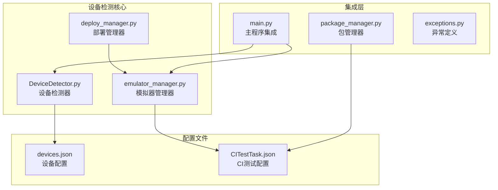
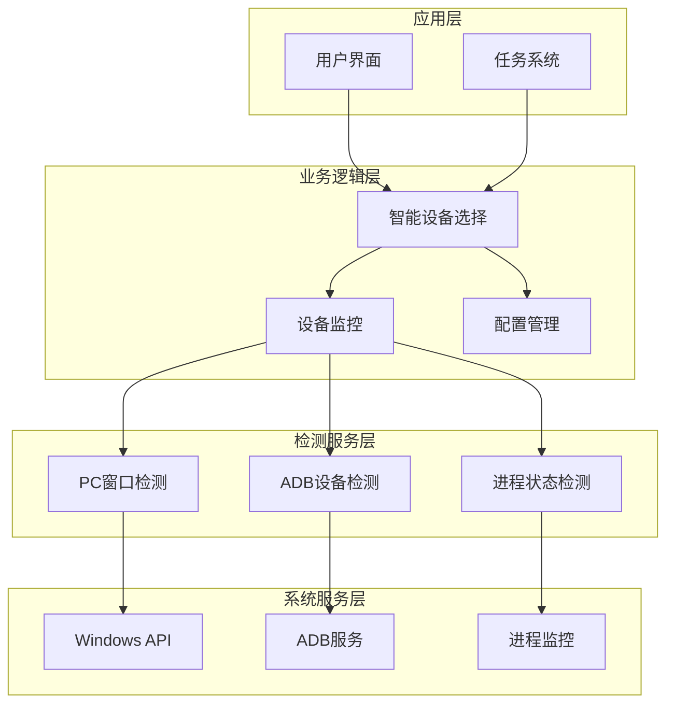
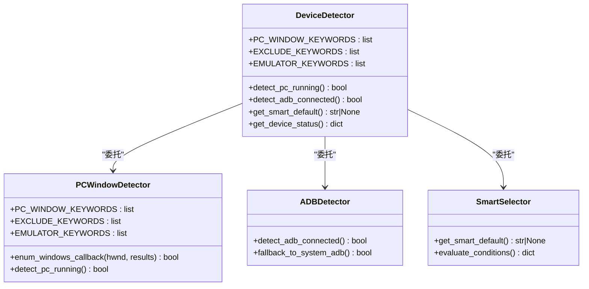
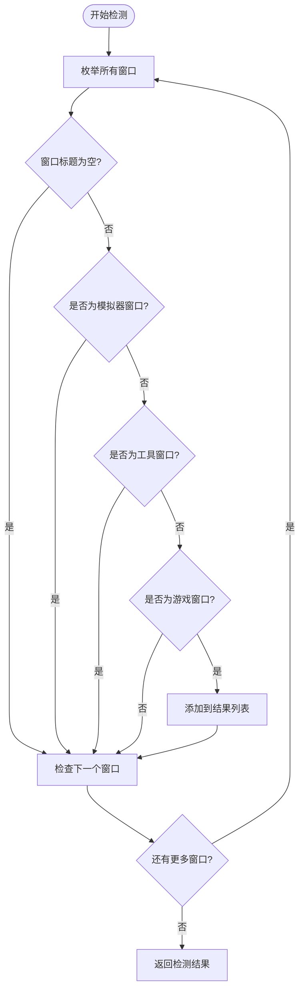
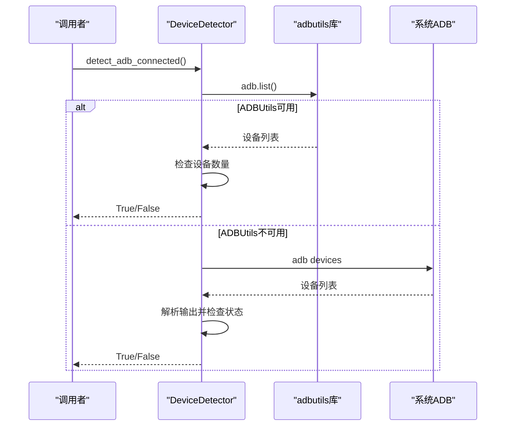
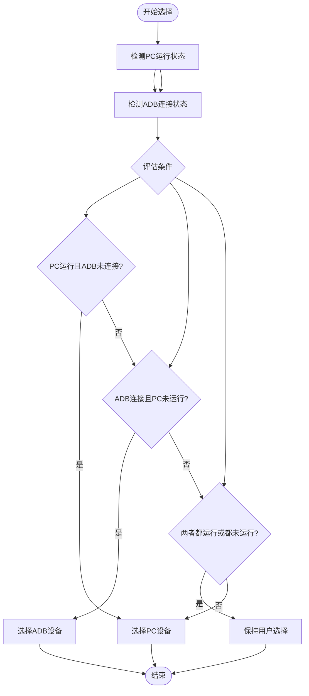
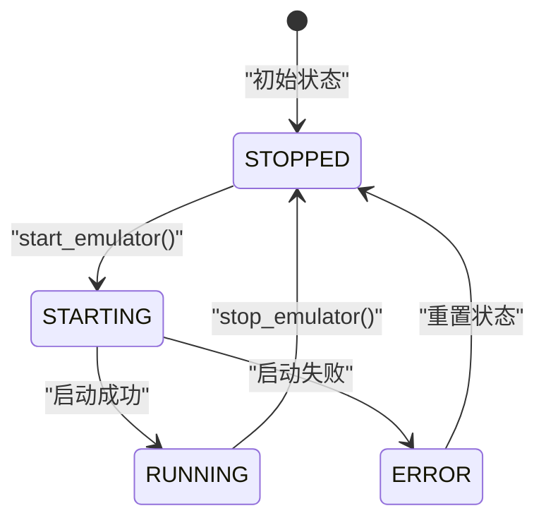
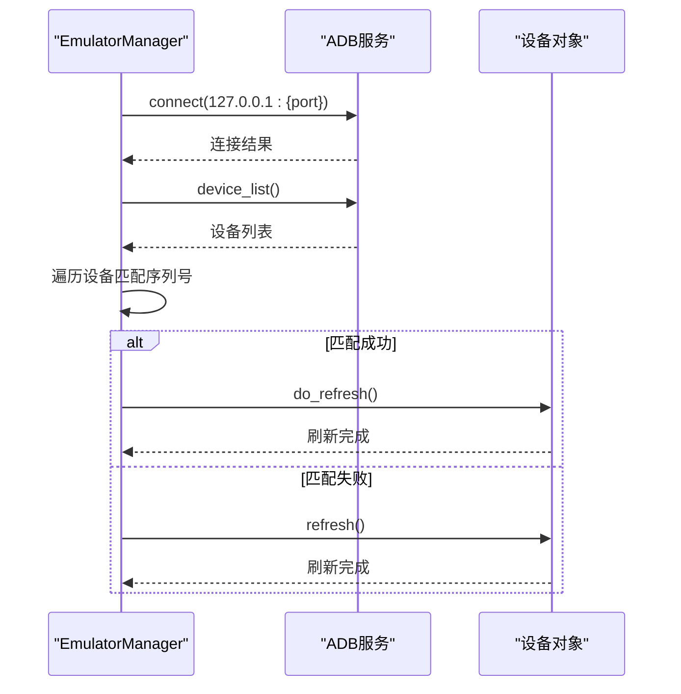
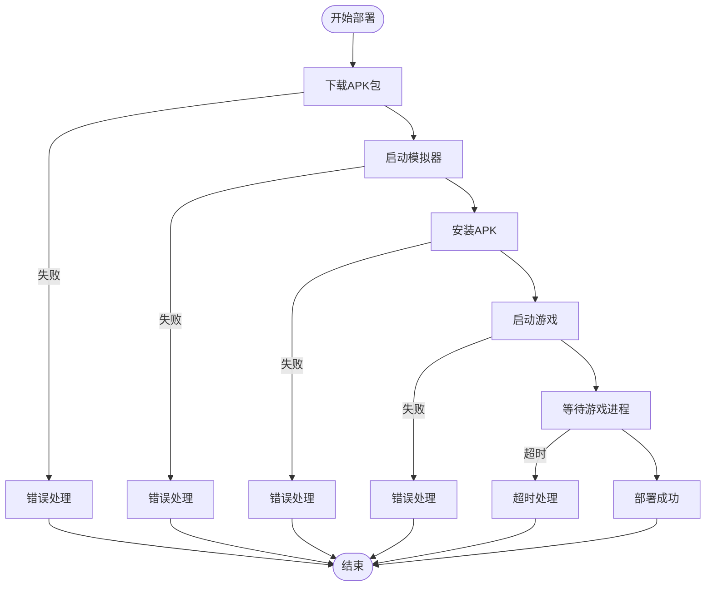
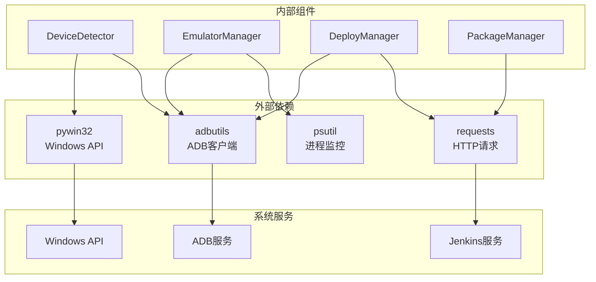

# 设备检测系统

<cite>
**本文档引用的文件**
- [DeviceDetector.py](file://src/utils/DeviceDetector.py)
- [emulator_manager.py](file://src/ci/emulator_manager.py)
- [deploy_manager.py](file://src/ci/deploy_manager.py)
- [package_manager.py](file://src/ci/package_manager.py)
- [exceptions.py](file://src/ci/exceptions.py)
- [devices.json](file://configs/devices.json)
- [CITestTask.json](file://configs/CITestTask.json)
- [main.py](file://main.py)
- [requirements.txt](file://requirements.txt)
</cite>

## 目录
1. [简介](#简介)
2. [项目结构](#项目结构)
3. [核心组件](#核心组件)
4. [架构概览](#架构概览)
5. [详细组件分析](#详细组件分析)
6. [依赖关系分析](#依赖关系分析)
7. [性能考虑](#性能考虑)
8. [故障排除指南](#故障排除指南)
9. [结论](#结论)
10. [附录](#附录)

## 简介

ok-jump 项目的设备检测系统是一个智能化的设备连接状态管理系统，专门用于检测和管理 PC 端游戏和 Android 模拟器的连接状态。该系统通过智能设备选择算法，能够自动识别当前可用的设备类型，并根据用户的偏好和实际连接状态进行最优的设备选择。

系统主要包含以下核心功能：
- PC 端游戏窗口检测和状态监控
- Android Debug Bridge (ADB) 设备连接状态检测
- 智能设备选择算法和优先级排序
- 设备状态监控和故障转移策略
- 配置管理和用户界面集成

## 项目结构

设备检测系统在项目中的组织结构如下：



**图表来源**
- [DeviceDetector.py:1-149](file://src/utils/DeviceDetector.py#L1-L149)
- [emulator_manager.py:1-457](file://src/ci/emulator_manager.py#L1-L457)
- [deploy_manager.py:1-428](file://src/ci/deploy_manager.py#L1-L428)

**章节来源**
- [DeviceDetector.py:1-149](file://src/utils/DeviceDetector.py#L1-L149)
- [main.py:388-429](file://main.py#L388-L429)

## 核心组件

设备检测系统由多个相互协作的组件组成，每个组件都有明确的职责和功能边界。

### 设备检测器 (DeviceDetector)

设备检测器是整个系统的核心组件，负责检测和管理设备连接状态。它提供了三个主要功能：

1. **PC 端游戏检测**：通过 Windows API 枚举所有窗口，查找符合游戏特征的窗口标题
2. **ADB 设备检测**：使用 adbutils 库检测 Android 设备连接状态
3. **智能设备选择**：基于检测结果自动选择最优设备

### 模拟器管理器 (EmulatorManager)

模拟器管理器专注于 Android 模拟器的生命周期管理，包括：
- 模拟器启动和关闭
- APK 安装和卸载
- 游戏启动和进程监控
- 设备状态检测和连接管理

### 部署管理器 (DeployManager)

部署管理器提供完整的 CI/CD 部署流程，整合了包下载、模拟器管理和游戏启动的完整流程。

**章节来源**
- [DeviceDetector.py:11-149](file://src/utils/DeviceDetector.py#L11-L149)
- [emulator_manager.py:39-457](file://src/ci/emulator_manager.py#L39-L457)
- [deploy_manager.py:38-428](file://src/ci/deploy_manager.py#L38-L428)

## 架构概览

设备检测系统的整体架构采用分层设计，从底层的系统检测到上层的应用集成形成了清晰的层次结构。



**图表来源**
- [DeviceDetector.py:28-149](file://src/utils/DeviceDetector.py#L28-L149)
- [emulator_manager.py:232-274](file://src/ci/emulator_manager.py#L232-L274)
- [deploy_manager.py:309-376](file://src/ci/deploy_manager.py#L309-L376)

## 详细组件分析

### 设备检测器类分析

设备检测器采用类方法设计，提供了静态的设备检测功能。其核心设计原则是分离关注点，将不同的检测逻辑封装在独立的方法中。



**图表来源**
- [DeviceDetector.py:11-149](file://src/utils/DeviceDetector.py#L11-L149)

#### PC 窗口检测机制

PC 窗口检测是通过 Windows API 实现的，采用了精确的窗口标题匹配策略：



**图表来源**
- [DeviceDetector.py:29-68](file://src/utils/DeviceDetector.py#L29-L68)

#### ADB 设备检测机制

ADB 设备检测提供了双重回退机制，确保在不同环境下都能正常工作：



**图表来源**
- [DeviceDetector.py:71-110](file://src/utils/DeviceDetector.py#L71-L110)

#### 智能设备选择算法

智能设备选择算法是系统的核心决策逻辑，采用了简洁而有效的条件判断：



**图表来源**
- [DeviceDetector.py:113-134](file://src/utils/DeviceDetector.py#L113-L134)

**章节来源**
- [DeviceDetector.py:11-149](file://src/utils/DeviceDetector.py#L11-L149)

### 模拟器管理器详细分析

模拟器管理器提供了完整的 Android 模拟器生命周期管理功能，是 CI/CD 流程中的关键组件。

#### 模拟器状态管理

模拟器管理器定义了清晰的状态枚举，用于跟踪模拟器的不同运行阶段：



**图表来源**
- [emulator_manager.py:22-28](file://src/ci/emulator_manager.py#L22-L28)

#### ADB 设备连接策略

模拟器管理器采用了灵活的 ADB 连接策略，支持多种连接格式：



**图表来源**
- [emulator_manager.py:159-190](file://src/ci/emulator_manager.py#L159-L190)

**章节来源**
- [emulator_manager.py:39-457](file://src/ci/emulator_manager.py#L39-L457)

### 部署管理器工作流

部署管理器实现了完整的 CI/CD 部署流程，从 Jenkins 下载 APK 到最终的游戏启动：



**图表来源**
- [deploy_manager.py:123-245](file://src/ci/deploy_manager.py#L123-L245)

**章节来源**
- [deploy_manager.py:38-428](file://src/ci/deploy_manager.py#L38-L428)

## 依赖关系分析

设备检测系统的依赖关系相对简单，主要依赖于几个核心库和系统服务。



**图表来源**
- [requirements.txt:1-17](file://requirements.txt#L1-L17)
- [DeviceDetector.py:7-8](file://src/utils/DeviceDetector.py#L7-L8)

**章节来源**
- [requirements.txt:1-17](file://requirements.txt#L1-L17)

## 性能考虑

设备检测系统在设计时充分考虑了性能优化，采用了多种策略来确保高效的设备检测和状态监控。

### 异步检测策略

系统采用了异步检测策略，避免阻塞主线程的执行：

1. **非阻塞窗口枚举**：使用回调函数逐个检查窗口，避免长时间的阻塞
2. **超时控制**：对 ADB 操作设置了合理的超时时间
3. **缓存机制**：设备状态检测结果可以在短时间内重复使用

### 资源管理优化

系统在资源管理方面也采取了多项优化措施：

1. **连接池管理**：ADB 连接采用短连接模式，避免长时间占用
2. **进程监控**：使用轻量级的进程检查方法，减少系统开销
3. **内存优化**：检测结果采用简单的数据结构，减少内存占用

### 错误恢复机制

系统具备完善的错误恢复机制，能够在各种异常情况下保持稳定运行：

1. **多重回退策略**：当主要检测方法失败时，自动切换到备用方案
2. **异常隔离**：每个检测方法都有独立的异常处理，避免相互影响
3. **状态重置**：检测失败时能够自动重置状态，等待下次检测

## 故障排除指南

设备检测系统在实际使用中可能会遇到各种问题，以下是常见问题的诊断和解决方法。

### ADB 连接问题

**问题症状**：
- ADB 设备检测始终返回 False
- 模拟器启动后无法被检测到

**诊断步骤**：
1. 检查 ADB 服务是否正常运行
2. 验证模拟器的 ADB 端口配置
3. 确认防火墙设置允许 ADB 连接

**解决方案**：
```python
# 检查 ADB 服务状态
try:
    from adbutils import adb
    devices = adb.device_list()
    print(f"ADB设备数量: {len(devices)}")
except ImportError:
    print("adbutils库未安装")
except Exception as e:
    print(f"ADB连接失败: {e}")
```

### PC 窗口检测问题

**问题症状**：
- PC 窗口检测总是返回 False
- 模拟器窗口被误判为游戏窗口

**诊断步骤**：
1. 验证游戏窗口标题是否包含预期关键词
2. 检查排除关键词是否过于宽泛
3. 确认 Windows API 权限是否足够

**解决方案**：
```python
# 调试窗口检测
import win32gui

def debug_window_detection():
    def enum_callback(hwnd, results):
        title = win32gui.GetWindowText(hwnd)
        if title:
            print(f"窗口标题: '{title}'")
            return True
    win32gui.EnumWindows(enum_callback, [])
```

### 配置文件问题

**问题症状**：
- 设备选择不符合预期
- 配置更改后不生效

**诊断步骤**：
1. 检查 devices.json 文件格式是否正确
2. 验证 preferred 字段的值是否有效
3. 确认配置文件权限设置

**解决方案**：
```python
# 验证配置文件
import json
from pathlib import Path

config_path = Path('configs/devices.json')
if config_path.exists():
    with open(config_path, 'r', encoding='utf-8') as f:
        config = json.load(f)
        print(f"当前配置: {config}")
        print(f"首选设备: {config.get('preferred', '未设置')}")
else:
    print("配置文件不存在")
```

**章节来源**
- [DeviceDetector.py:67-110](file://src/utils/DeviceDetector.py#L67-L110)
- [main.py:405-428](file://main.py#L405-L428)

## 结论

ok-jump 项目的设备检测系统是一个设计精良、功能完备的设备管理解决方案。系统通过智能的设备选择算法和完善的错误处理机制，为用户提供了可靠的设备检测和管理功能。

### 主要优势

1. **智能决策**：基于当前环境状态自动选择最优设备
2. **容错性强**：提供多重回退策略，确保在各种环境下都能正常工作
3. **易于集成**：提供了清晰的 API 接口，便于与其他系统集成
4. **配置灵活**：支持用户自定义配置，满足不同使用场景的需求

### 技术特点

1. **模块化设计**：各个组件职责明确，便于维护和扩展
2. **性能优化**：采用异步检测和资源管理策略，确保高效运行
3. **错误恢复**：完善的异常处理和状态重置机制
4. **兼容性强**：支持多种模拟器和操作系统环境

### 发展建议

1. **增强监控能力**：可以增加设备状态的实时监控和告警功能
2. **扩展支持**：可以支持更多类型的设备和模拟器
3. **性能优化**：可以进一步优化检测算法，提高检测速度
4. **用户体验**：可以提供更丰富的用户界面和配置选项

## 附录

### 配置文件详解

#### devices.json 配置项

| 配置项 | 类型 | 默认值 | 描述 |
|--------|------|--------|------|
| preferred | string | "pc" | 首选设备类型 ("pc" 或 "adb") |
| pc_full_path | string | "" | PC游戏完整路径 |
| capture | string | "adb" | 截图方式 ("adb" 或 "pc") |
| selected_exe | string | "" | 选中的可执行文件路径 |
| selected_hwnd | integer | 0 | 选中的窗口句柄 |

#### CITestTask.json 配置项

| 配置项 | 类型 | 默认值 | 描述 |
|--------|------|--------|------|
| Jenkins服务器地址 | string | "" | Jenkins服务器地址 |
| Jenkins Job名称 | string | "" | Jenkins Job名称 |
| 模拟器路径 | string | "" | 模拟器可执行文件路径 |
| ADB端口 | integer | 5555 | ADB连接端口号 |
| 模拟器实例索引 | integer | 0 | 模拟器实例编号 |
| 任务触发延迟(秒) | integer | 30 | 任务触发延迟时间 |
| 启用定时执行 | boolean | false | 是否启用定时执行 |
| 定时执行时间(时) | integer | 9 | 定时执行小时 |
| 定时执行时间(分) | integer | 0 | 定时执行分钟 |

### 使用示例

#### 基本设备检测

```python
from src.utils.DeviceDetector import DeviceDetector

# 获取设备状态
status = DeviceDetector.get_device_status()
print(f"PC运行: {status['pc_running']}")
print(f"ADB连接: {status['adb_connected']}")

# 获取智能选择结果
smart_device = DeviceDetector.get_smart_default()
print(f"推荐设备: {smart_device}")
```

#### 集成到主程序

```python
def smart_device_selection():
    from src.utils.DeviceDetector import DeviceDetector
    from pathlib import Path
    import json
    
    # 获取设备状态
    status = DeviceDetector.get_device_status()
    print(f'[智能设备选择] PC运行: {status["pc_running"]}, ADB连接: {status["adb_connected"]}')
    
    # 获取智能选择
    smart_device = DeviceDetector.get_smart_default()
    if smart_device:
        # 更新配置文件
        devices_path = Path('configs/devices.json')
        if devices_path.exists():
            with open(devices_path, 'r', encoding='utf-8') as f:
                devices_config = json.load(f)
            
            current_preferred = devices_config.get('preferred', 'pc')
            if current_preferred != smart_device:
                devices_config['preferred'] = smart_device
                with open(devices_path, 'w', encoding='utf-8') as f:
                    json.dump(devices_config, f, indent=4, ensure_ascii=False)
```

**章节来源**
- [devices.json:1-7](file://configs/devices.json#L1-L7)
- [CITestTask.json:1-29](file://configs/CITestTask.json#L1-L29)
- [main.py:388-429](file://main.py#L388-L429)