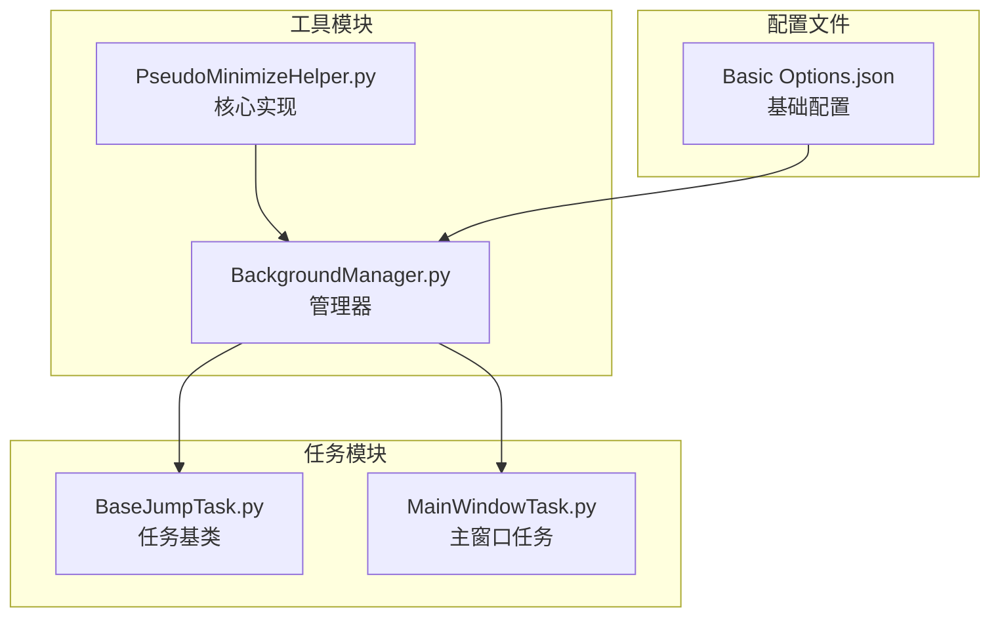
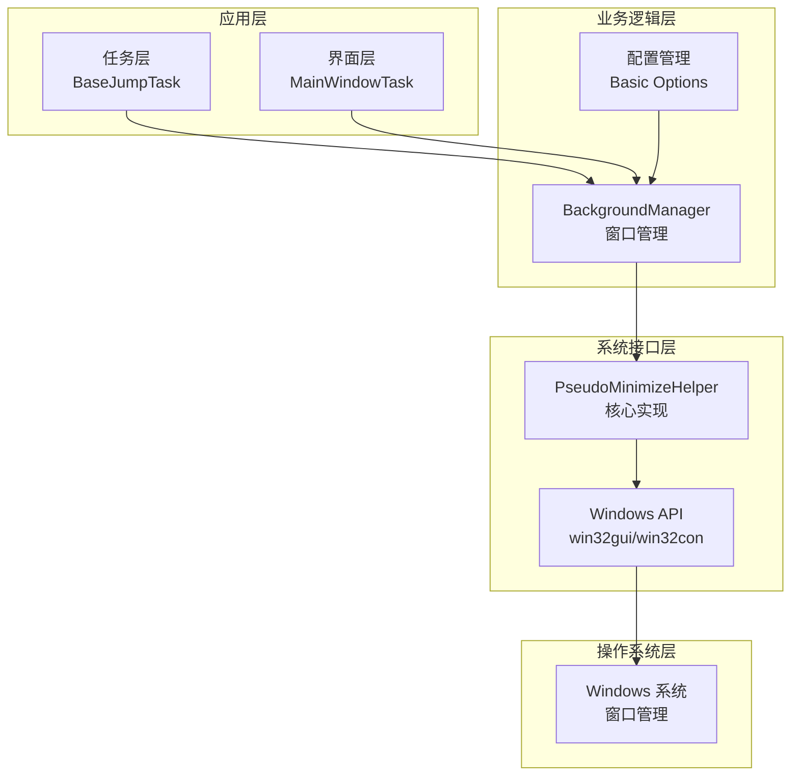
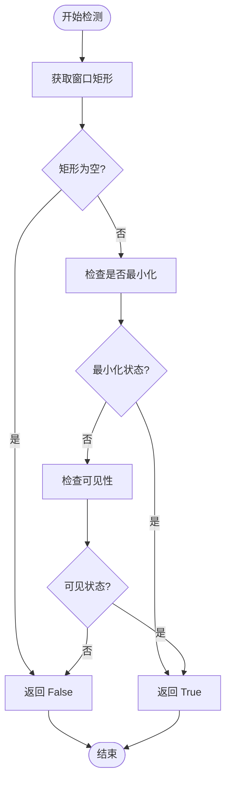
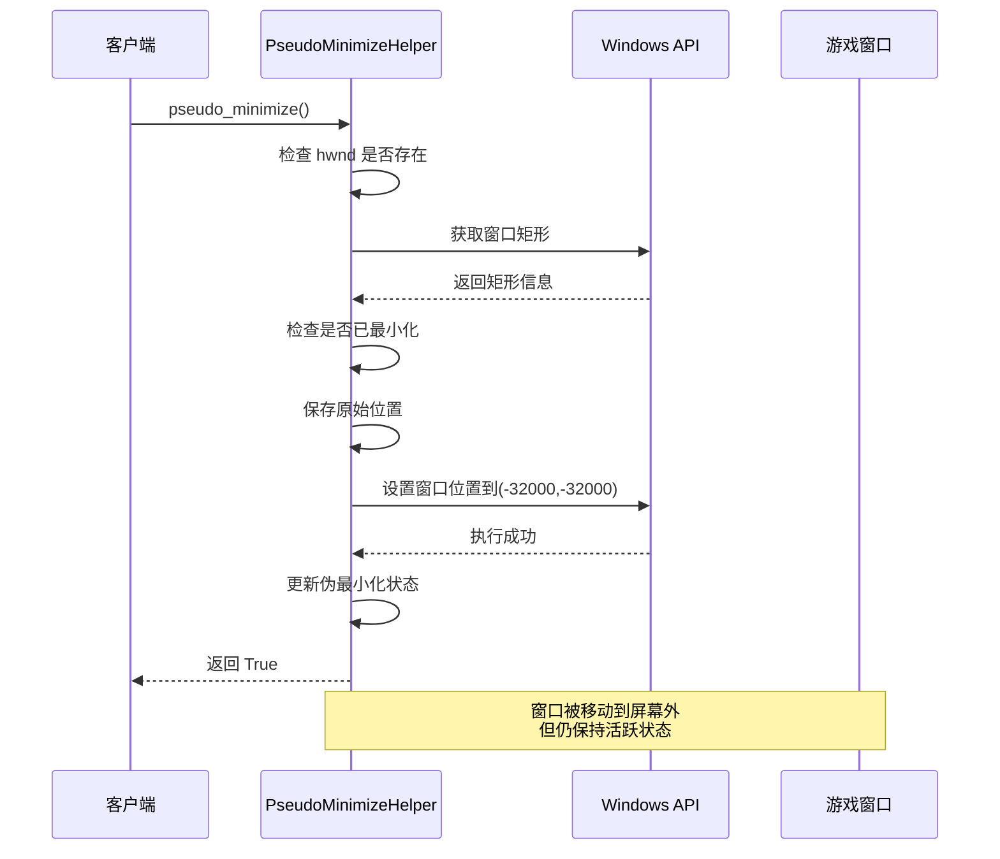
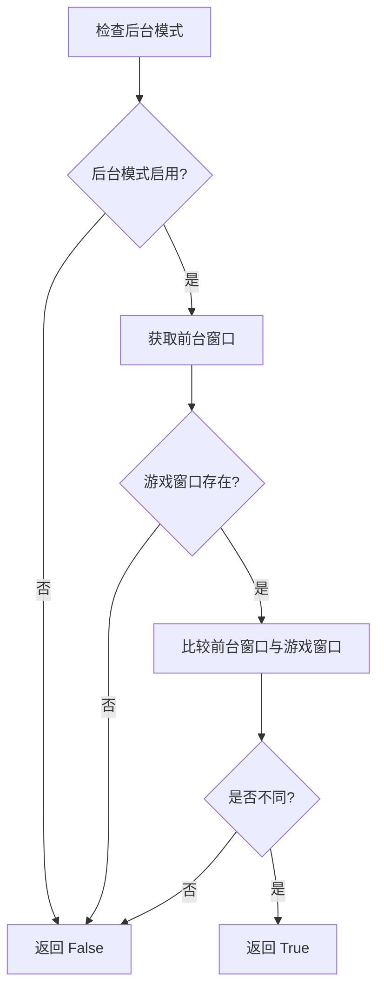
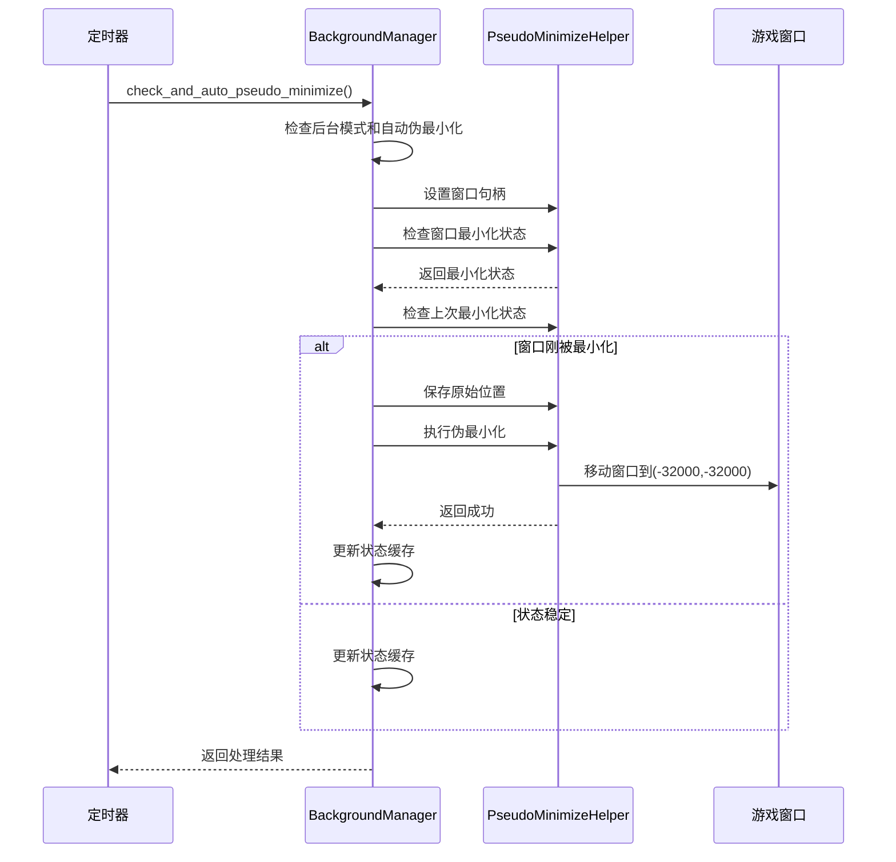
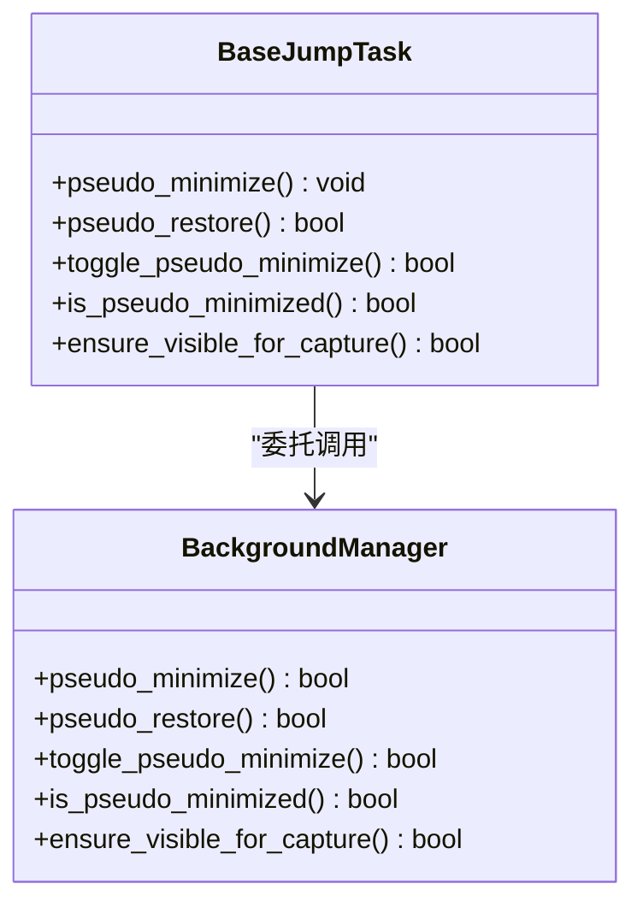
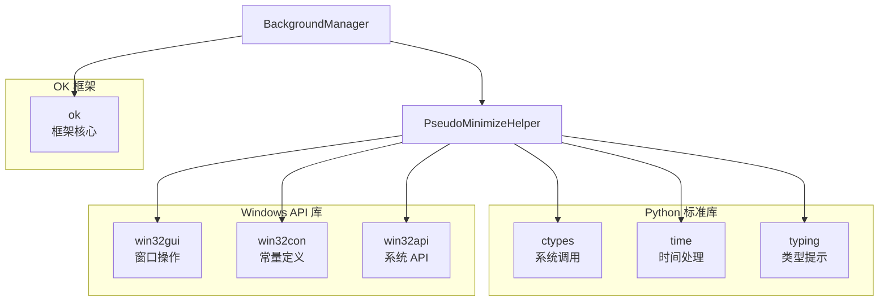
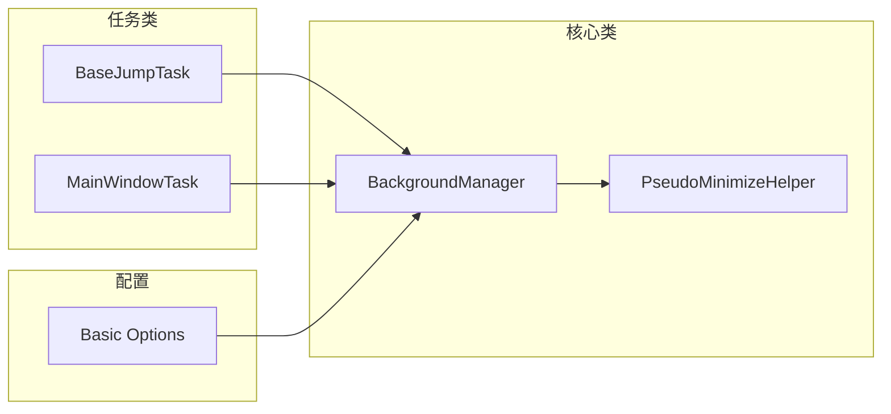

# 伪最小化助手

<cite>
**本文档引用的文件**
- [PseudoMinimizeHelper.py](file://src/utils/PseudoMinimizeHelper.py)
- [BackgroundManager.py](file://src/utils/BackgroundManager.py)
- [BaseJumpTask.py](file://src/task/BaseJumpTask.py)
- [Basic Options.json](file://configs/Basic Options.json)
- [MainWindowTask.py](file://src/task/MainWindowTask.py)
</cite>

## 目录
1. [简介](#简介)
2. [项目结构](#项目结构)
3. [核心组件](#核心组件)
4. [架构概览](#架构概览)
5. [详细组件分析](#详细组件分析)
6. [依赖关系分析](#依赖关系分析)
7. [性能考量](#性能考量)
8. [故障排除指南](#故障排除指南)
9. [结论](#结论)

## 简介

伪最小化助手(PseudoMinimizeHelper)是一个专为游戏自动化设计的窗口管理系统，能够在不真正最小化应用程序的情况下实现窗口的隐藏或资源占用减少。该技术通过将游戏窗口移动到屏幕外的虚拟位置来模拟最小化效果，同时保持窗口的活跃状态，从而避免了传统最小化操作带来的性能开销和状态丢失问题。

在游戏自动化场景中，伪最小化技术特别适用于需要持续监控游戏状态但又不想影响游戏性能的应用程序。它允许开发者在后台模式下运行自动化脚本，同时保持游戏窗口的完整功能状态。

## 项目结构

伪最小化助手主要分布在以下文件中：

**图表来源**
- [PseudoMinimizeHelper.py:1-193](file://src/utils/PseudoMinimizeHelper.py#L1-L193)
- [BackgroundManager.py:1-145](file://src/utils/BackgroundManager.py#L1-L145)
- [BaseJumpTask.py:1-295](file://src/task/BaseJumpTask.py#L1-L295)

**章节来源**
- [PseudoMinimizeHelper.py:1-193](file://src/utils/PseudoMinimizeHelper.py#L1-L193)
- [BackgroundManager.py:1-145](file://src/utils/BackgroundManager.py#L1-L145)

## 核心组件

### PseudoMinimizeHelper 类

PseudoMinimizeHelper 是整个伪最小化系统的核心类，负责直接的窗口操作和状态管理。

**主要功能特性：**
- 窗口句柄管理
- 真实窗口状态检测
- 伪最小化状态跟踪
- 原始位置保存与恢复

**关键属性：**
- `_hwnd`: 游戏窗口句柄
- `_original_rect`: 原始窗口位置矩形
- `_is_pseudo_minimized`: 伪最小化状态标志
- `_last_window_state`: 最后一次窗口状态缓存

**章节来源**
- [PseudoMinimizeHelper.py:13-26](file://src/utils/PseudoMinimizeHelper.py#L13-L26)

### BackgroundManager 类

BackgroundManager 提供了更高层次的窗口管理功能，集成了伪最小化逻辑与游戏状态检测。

**主要职责：**
- 后台模式检测
- 自动伪最小化控制
- 静音功能集成
- 窗口状态监控

**核心方法：**
- `is_game_in_background()`: 检测游戏是否在后台
- `check_and_auto_pseudo_minimize()`: 自动执行伪最小化
- `ensure_visible_for_capture()`: 确保截图时窗口可见

**章节来源**
- [BackgroundManager.py:7-17](file://src/utils/BackgroundManager.py#L7-L17)

## 架构概览

伪最小化助手采用分层架构设计，实现了清晰的关注点分离：

**图表来源**
- [BaseJumpTask.py:10-295](file://src/task/BaseJumpTask.py#L10-L295)
- [BackgroundManager.py:1-145](file://src/utils/BackgroundManager.py#L1-L145)
- [PseudoMinimizeHelper.py:1-193](file://src/utils/PseudoMinimizeHelper.py#L1-L193)

## 详细组件分析

### PseudoMinimizeHelper 实现详解

#### 窗口状态检测机制

伪最小化助手通过多种方式检测窗口的真实状态：

**图表来源**
- [PseudoMinimizeHelper.py:27-56](file://src/utils/PseudoMinimizeHelper.py#L27-L56)

#### 伪最小化执行流程

伪最小化过程包含多个安全检查和状态转换：

**图表来源**
- [PseudoMinimizeHelper.py:78-118](file://src/utils/PseudoMinimizeHelper.py#L78-L118)

**章节来源**
- [PseudoMinimizeHelper.py:78-148](file://src/utils/PseudoMinimizeHelper.py#L78-L148)

### BackgroundManager 集成机制

#### 后台模式检测算法

BackgroundManager 实现了智能的后台检测逻辑：

**图表来源**
- [BackgroundManager.py:36-65](file://src/utils/BackgroundManager.py#L36-L65)

#### 自动伪最小化流程

**图表来源**
- [BackgroundManager.py:91-111](file://src/utils/BackgroundManager.py#L91-L111)

**章节来源**
- [BackgroundManager.py:91-141](file://src/utils/BackgroundManager.py#L91-L141)

### 任务集成接口

#### BaseJumpTask 中的伪最小化接口

BaseJumpTask 提供了简化的伪最小化操作接口：

**图表来源**
- [BaseJumpTask.py:271-294](file://src/task/BaseJumpTask.py#L271-L294)
- [BackgroundManager.py:120-134](file://src/utils/BackgroundManager.py#L120-L134)

**章节来源**
- [BaseJumpTask.py:271-294](file://src/task/BaseJumpTask.py#L271-L294)

## 依赖关系分析

### 外部依赖

伪最小化助手依赖于以下外部库：

**图表来源**
- [PseudoMinimizeHelper.py:1-6](file://src/utils/PseudoMinimizeHelper.py#L1-L6)
- [BackgroundManager.py:1-4](file://src/utils/BackgroundManager.py#L1-L4)

### 内部依赖关系

**图表来源**
- [BaseJumpTask.py:10-295](file://src/task/BaseJumpTask.py#L10-L295)
- [BackgroundManager.py:1-145](file://src/utils/BackgroundManager.py#L1-L145)

**章节来源**
- [PseudoMinimizeHelper.py:1-193](file://src/utils/PseudoMinimizeHelper.py#L1-L193)
- [BackgroundManager.py:1-145](file://src/utils/BackgroundManager.py#L1-L145)

## 性能考量

### 系统资源优化

伪最小化技术相比传统最小化具有以下性能优势：

1. **GPU 资源保持**: 窗口仍接收渲染更新，避免 GPU 上下文丢失
2. **内存占用稳定**: 不会触发系统内存回收机制
3. **输入响应**: 键盘鼠标事件仍可正常传递
4. **网络连接**: 游戏服务器连接保持活跃状态

### 时间复杂度分析

- **状态检测**: O(1) - 通过 Windows API 直接查询
- **伪最小化**: O(1) - 单次窗口位置设置操作
- **状态恢复**: O(1) - 单次窗口位置恢复操作
- **后台检测**: O(1) - 每次检查只进行必要的 API 调用

### 内存使用优化

- 使用弱引用避免循环引用
- 状态缓存仅存储必要信息
- 异常处理中避免额外对象创建

## 故障排除指南

### 常见问题及解决方案

#### 窗口无法移动到伪最小化位置

**可能原因：**
- 窗口被其他程序锁定
- 权限不足
- 窗口处于特殊状态

**解决方法：**
1. 检查窗口句柄有效性
2. 确认程序具有管理员权限
3. 尝试先恢复窗口再执行伪最小化

#### 伪最小化状态检测错误

**可能原因：**
- 窗口状态缓存过期
- 多线程并发访问
- Windows API 调用失败

**解决方法：**
1. 调用 `get_state()` 方法获取最新状态
2. 在主线程中执行窗口操作
3. 检查异常日志输出

#### 自动伪最小化失效

**可能原因：**
- 后台模式配置禁用
- 窗口句柄未正确设置
- 配置文件读取失败

**解决方法：**
1. 检查 `Basic Options.json` 配置
2. 确认 `on_game_window_change()` 被正确调用
3. 验证配置文件格式正确性

**章节来源**
- [PseudoMinimizeHelper.py:116-118](file://src/utils/PseudoMinimizeHelper.py#L116-L118)
- [BackgroundManager.py:91-111](file://src/utils/BackgroundManager.py#L91-L111)

### 调试技巧

1. **状态监控**: 使用 `get_state()` 方法实时查看内部状态
2. **日志输出**: 关注控制台输出的调试信息
3. **异常捕获**: 捕获并记录所有异常情况
4. **超时处理**: 为长时间操作设置合理的超时机制

## 结论

伪最小化助手是一个精心设计的窗口管理系统，它巧妙地利用了 Windows 窗口管理机制，在不真正最小化应用程序的情况下实现了窗口隐藏和资源优化。通过分层架构设计，该系统提供了清晰的接口抽象，使得上层任务可以轻松集成伪最小化功能。

### 主要优势

1. **性能优化**: 保持 GPU 和内存资源的稳定使用
2. **兼容性强**: 支持各种类型的游戏窗口
3. **易于集成**: 提供简洁的 API 接口
4. **可靠性高**: 完善的错误处理和状态管理

### 技术创新点

1. **智能状态检测**: 通过多种方式综合判断窗口状态
2. **渐进式实现**: 从简单到复杂的逐步优化策略
3. **配置驱动**: 支持运行时配置调整
4. **任务解耦**: 与具体业务逻辑完全分离

### 发展建议

1. **扩展支持**: 考虑支持更多窗口管理需求
2. **性能监控**: 添加更详细的性能指标收集
3. **用户界面**: 提供可视化的状态监控界面
4. **文档完善**: 增加更多的使用示例和最佳实践

伪最小化助手为游戏自动化领域提供了一个可靠的基础设施，它不仅解决了技术难题，更为后续的功能扩展奠定了坚实的基础。