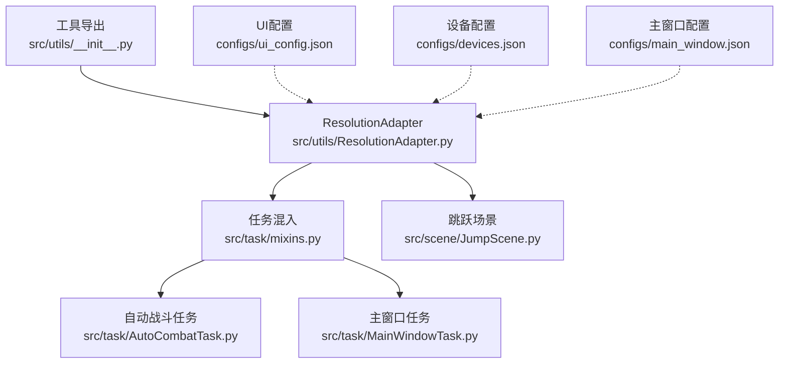
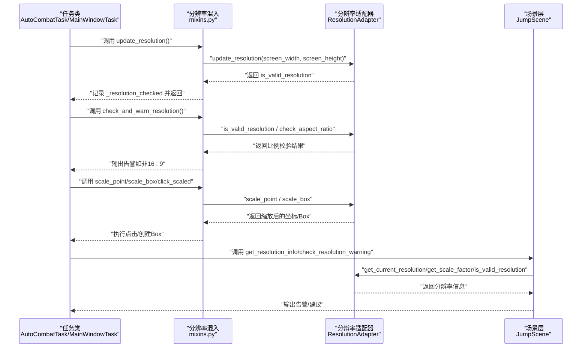
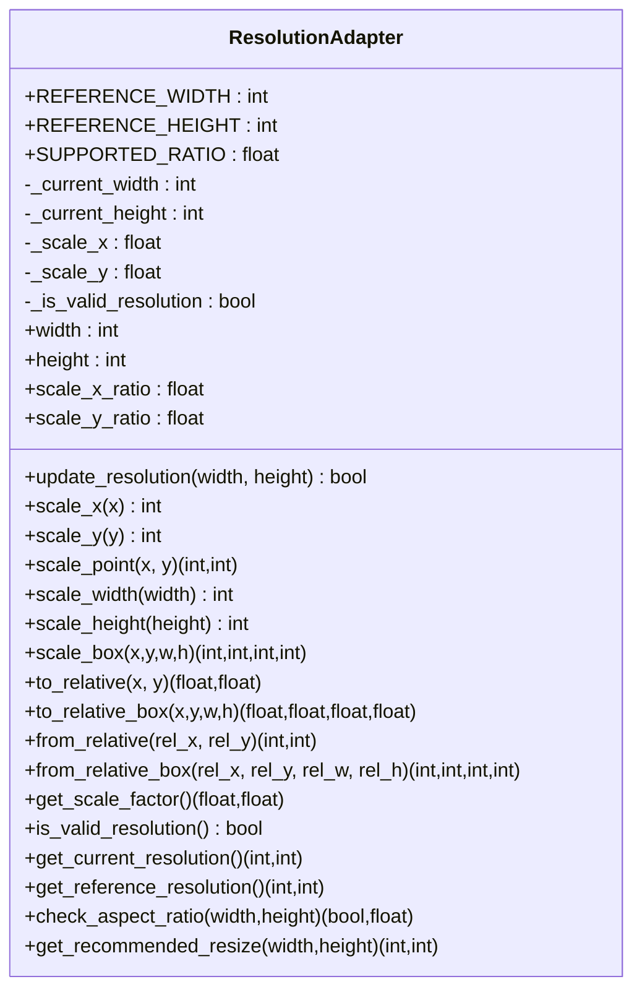
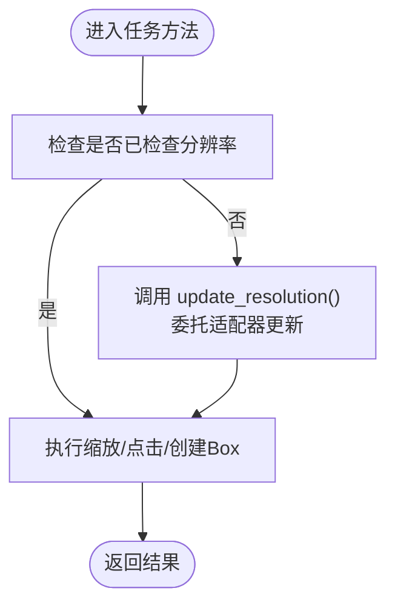
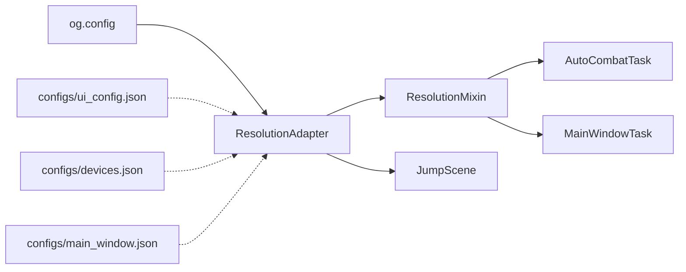

# 分辨率适配器

<cite>
**本文引用的文件**
- [src/utils/ResolutionAdapter.py](file://src/utils/ResolutionAdapter.py)
- [src/task/mixins.py](file://src/task/mixins.py)
- [src/scene/JumpScene.py](file://src/scene/JumpScene.py)
- [src/utils/__init__.py](file://src/utils/__init__.py)
- [src/taks/MainWindowTask.py](file://src/task/MainWindowTask.py)
- [src/taks/AutoCombatTask.py](file://src/task/AutoCombatTask.py)
- [configs/ui_config.json](file://configs/ui_config.json)
- [configs/devices.json](file://configs/devices.json)
- [configs/main_window.json](file://configs/main_window.json)
</cite>

## 目录
1. [简介](#简介)
2. [项目结构](#项目结构)
3. [核心组件](#核心组件)
4. [架构总览](#架构总览)
5. [详细组件分析](#详细组件分析)
6. [依赖分析](#依赖分析)
7. [性能考虑](#性能考虑)
8. [故障排查指南](#故障排查指南)
9. [结论](#结论)
10. [附录](#附录)

## 简介
本文件系统性阐述分辨率适配器（ResolutionAdapter）的设计与实现，覆盖以下主题：
- 屏幕尺寸检测与坐标转换机制
- 缩放因子计算与纵横比校验
- 多显示器与不同分辨率环境下的适配策略
- 高 DPI 显示与不同纵横比的处理
- 配置方法与使用场景
- 性能优化与准确性保障
- 扩展支持新分辨率与复杂显示环境的实践指南

## 项目结构
分辨率适配器位于工具模块中，并通过混入（mixin）在多个任务类中复用；同时在场景层与主窗口任务中进行信息展示与告警。

**图表来源**
- [src/utils/ResolutionAdapter.py:1-163](file://src/utils/ResolutionAdapter.py#L1-L163)
- [src/task/mixins.py:99-250](file://src/task/mixins.py#L99-L250)
- [src/scene/JumpScene.py:197-215](file://src/scene/JumpScene.py#L197-L215)
- [src/utils/__init__.py:1-5](file://src/utils/__init__.py#L1-L5)
- [configs/ui_config.json:1-17](file://configs/ui_config.json#L1-L17)
- [configs/devices.json:1-7](file://configs/devices.json#L1-L7)
- [configs/main_window.json:1-3](file://configs/main_window.json#L1-L3)

**章节来源**
- [src/utils/ResolutionAdapter.py:1-163](file://src/utils/ResolutionAdapter.py#L1-L163)
- [src/task/mixins.py:99-250](file://src/task/mixins.py#L99-L250)
- [src/scene/JumpScene.py:197-215](file://src/scene/JumpScene.py#L197-L215)
- [src/utils/__init__.py:1-5](file://src/utils/__init__.py#L1-L5)
- [configs/ui_config.json:1-17](file://configs/ui_config.json#L1-L17)
- [configs/devices.json:1-7](file://configs/devices.json#L1-L7)
- [configs/main_window.json:1-3](file://configs/main_window.json#L1-L3)

## 核心组件
- 分辨率适配器（ResolutionAdapter）
  - 负责：加载配置、更新当前分辨率、计算缩放因子、纵横比校验、相对坐标转换、推荐分辨率建议
  - 关键属性：参考宽高、支持纵横比、当前宽高、缩放因子、有效性标记
  - 关键方法：update_resolution、scale_*、to_relative/from_relative、check_aspect_ratio、get_recommended_resize
- 任务混入（ResolutionMixin）
  - 负责：在任务中便捷地更新分辨率、进行比例校验与告警、坐标缩放、Box对象创建、分辨率信息查询
- 场景层（JumpScene）
  - 负责：在场景层面展示分辨率信息与告警
- 工具导出（utils.__init__）
  - 负责：对外暴露适配器类与实例

**章节来源**
- [src/utils/ResolutionAdapter.py:4-163](file://src/utils/ResolutionAdapter.py#L4-L163)
- [src/task/mixins.py:101-250](file://src/task/mixins.py#L101-L250)
- [src/scene/JumpScene.py:197-215](file://src/scene/JumpScene.py#L197-L215)
- [src/utils/__init__.py:1-5](file://src/utils/__init__.py#L1-L5)

## 架构总览
分辨率适配器通过配置驱动，结合任务层的统一混入接口，实现跨模块的一致性坐标转换与比例校验。其核心流程如下：

**图表来源**
- [src/task/mixins.py:101-250](file://src/task/mixins.py#L101-L250)
- [src/utils/ResolutionAdapter.py:34-163](file://src/utils/ResolutionAdapter.py#L34-L163)
- [src/scene/JumpScene.py:197-215](file://src/scene/JumpScene.py#L197-L215)

## 详细组件分析

### 分辨率适配器（ResolutionAdapter）
- 设计要点
  - 配置驱动：从全局配置读取参考分辨率与支持纵横比，支持以“宽:高”字符串解析比例
  - 统一缩放：基于参考分辨率计算独立X/Y缩放因子，确保非等比缩放场景的准确性
  - 比例校验：以容差阈值判断当前纵横比是否符合支持比例
  - 相对坐标：提供相对坐标系与绝对坐标的双向转换，便于UI与图像处理
  - 推荐分辨率：优先使用配置中的可选列表，否则按宽度阈值回退到常见分辨率
- 关键算法
  - 缩放因子：scale_x = current_width / reference_width；scale_y = current_height / reference_height
  - 纵横比：ratio = width / height；valid = abs(ratio - supported_ratio) < tolerance
  - 相对坐标：rel = pos / current_size；abs = rel * current_size
- 错误处理
  - 宽高为0或负数时，to_relative系列返回(0,0)，避免除零
  - 比例校验对无效输入返回False与0差值

**图表来源**
- [src/utils/ResolutionAdapter.py:4-163](file://src/utils/ResolutionAdapter.py#L4-L163)

**章节来源**
- [src/utils/ResolutionAdapter.py:19-163](file://src/utils/ResolutionAdapter.py#L19-L163)

### 任务混入（ResolutionMixin）
- 职责
  - 在任务中统一更新分辨率、进行比例校验与告警
  - 提供缩放坐标、点击、Box创建等便捷方法
  - 汇总分辨率信息供日志与界面展示
- 使用模式
  - 首次使用前调用 update_resolution，内部委托给全局适配器
  - 提供 click_scaled、scale_point、scale_box 等方法，自动完成坐标转换
  - 通过 get_resolution_info 返回当前/参考分辨率与缩放因子

**图表来源**
- [src/task/mixins.py:101-250](file://src/task/mixins.py#L101-L250)

**章节来源**
- [src/task/mixins.py:101-250](file://src/task/mixins.py#L101-L250)

### 场景层（JumpScene）
- 职责
  - 在场景层面展示分辨率信息与告警
  - 当比例不合法时，给出推荐分辨率建议
- 交互
  - 通过全局适配器查询当前分辨率、缩放因子与有效性
  - 记录日志并提示用户调整分辨率以提升识别准确率

**章节来源**
- [src/scene/JumpScene.py:197-215](file://src/scene/JumpScene.py#L197-L215)

### 工具导出（utils.__init__）
- 负责将适配器类与实例导出，供其他模块按需导入使用

**章节来源**
- [src/utils/__init__.py:1-5](file://src/utils/__init__.py#L1-L5)

## 依赖分析
- 模块耦合
  - ResolutionAdapter 与全局配置（og.config）耦合，通过配置项决定参考分辨率与支持比例
  - 任务混入依赖 ResolutionAdapter 实例，形成跨任务的统一适配能力
  - 场景层与主窗口任务依赖混入提供的分辨率信息
- 外部依赖
  - UI配置（DpiScale）与设备配置（capture、selected_hwnd）间接影响分辨率感知与截图区域
- 潜在风险
  - 配置缺失或格式错误可能影响参考分辨率与比例解析
  - 多显示器环境下，若未选择正确的屏幕，可能导致比例校验偏差

**图表来源**
- [src/utils/ResolutionAdapter.py:19-33](file://src/utils/ResolutionAdapter.py#L19-L33)
- [src/task/mixins.py:101-250](file://src/task/mixins.py#L101-L250)
- [configs/ui_config.json:1-17](file://configs/ui_config.json#L1-17)
- [configs/devices.json:1-7](file://configs/devices.json#L1-L7)
- [configs/main_window.json:1-3](file://configs/main_window.json#L1-L3)

**章节来源**
- [src/utils/ResolutionAdapter.py:19-33](file://src/utils/ResolutionAdapter.py#L19-L33)
- [src/task/mixins.py:101-250](file://src/task/mixins.py#L101-L250)
- [configs/ui_config.json:1-17](file://configs/ui_config.json#L1-L17)
- [configs/devices.json:1-7](file://configs/devices.json#L1-L7)
- [configs/main_window.json:1-3](file://configs/main_window.json#L1-L3)

## 性能考虑
- 缩放计算开销极低，主要为浮点运算与整型转换，适合高频调用
- 建议
  - 避免在每帧重复调用 update_resolution，可在分辨率变化或任务启动时调用一次
  - 对于频繁的坐标缩放操作，尽量批量处理或缓存中间结果
  - 在多显示器环境中，优先选择主屏或目标游戏窗口所在屏幕，减少比例误差

[本节为通用性能建议，无需具体文件分析]

## 故障排查指南
- 症状：坐标点击/识别位置偏移
  - 可能原因：未更新分辨率或分辨率异常
  - 处理步骤：确认任务已调用 update_resolution；检查日志中的分辨率信息；必要时重启任务以重新检测
- 症状：比例告警频繁出现
  - 可能原因：当前分辨率非16:9或配置比例不匹配
  - 处理步骤：根据告警建议调整为推荐分辨率；检查配置中的 supported_resolution.ratio 是否正确
- 症状：to_relative 返回(0,0)
  - 可能原因：当前分辨率尚未更新或宽高为0
  - 处理步骤：先调用 update_resolution，再进行相对坐标转换

**章节来源**
- [src/task/mixins.py:120-143](file://src/task/mixins.py#L120-L143)
- [src/utils/ResolutionAdapter.py:69-93](file://src/utils/ResolutionAdapter.py#L69-L93)

## 结论
分辨率适配器通过配置驱动与统一接口，实现了跨模块的一致性坐标转换与比例校验。其设计兼顾了准确性与易用性，适用于多显示器与不同分辨率环境。建议在实际部署中：
- 明确参考分辨率与支持比例，并在配置中正确设置
- 在任务启动时统一更新分辨率，避免重复检测
- 遇到比例告警时，优先采用推荐分辨率以提升识别稳定性

[本节为总结性内容，无需具体文件分析]

## 附录

### 配置说明与使用场景
- 配置入口
  - 参考分辨率：reference_resolution.width / height
  - 支持比例：supported_resolution.ratio（格式如“16:9”）
  - 推荐分辨率列表：supported_resolution.resize_to（二维数组）
- 使用场景
  - 自动战斗任务：在任务启动时更新分辨率并进行比例校验
  - 主窗口任务：在初始化阶段输出分辨率信息并给出告警
  - 场景层：在场景切换时检查分辨率并提示用户调整

**章节来源**
- [src/utils/ResolutionAdapter.py:19-33](file://src/utils/ResolutionAdapter.py#L19-L33)
- [src/task/mixins.py:120-143](file://src/task/mixins.py#L120-L143)
- [src/task/MainWindowTask.py:149-166](file://src/task/MainWindowTask.py#L149-L166)
- [src/scene/JumpScene.py:197-215](file://src/scene/JumpScene.py#L197-L215)

### 扩展支持新分辨率与复杂显示环境
- 新增支持比例
  - 在配置中设置 supported_resolution.ratio 为新的“宽:高”
  - 如需更灵活的推荐策略，可在适配器中扩展 get_recommended_resize 的决策逻辑
- 处理高 DPI 显示
  - 若系统 DPI 缩放导致感知分辨率异常，可在任务启动时强制使用物理像素或通过系统 API 获取真实分辨率
  - 建议在 UI 配置中设置 DpiScale 为“Auto”，并结合适配器的相对坐标转换降低 DPI 影响
- 多显示器环境
  - 明确目标显示器（如游戏窗口所在屏幕），在任务初始化时传入该屏幕的宽高
  - 对于动态切换显示器的情况，监听屏幕变化事件并在分辨率变化时重新更新

**章节来源**
- [src/utils/ResolutionAdapter.py:107-143](file://src/utils/ResolutionAdapter.py#L107-L143)
- [configs/ui_config.json:8-12](file://configs/ui_config.json#L8-L12)
- [configs/devices.json:1-7](file://configs/devices.json#L1-L7)