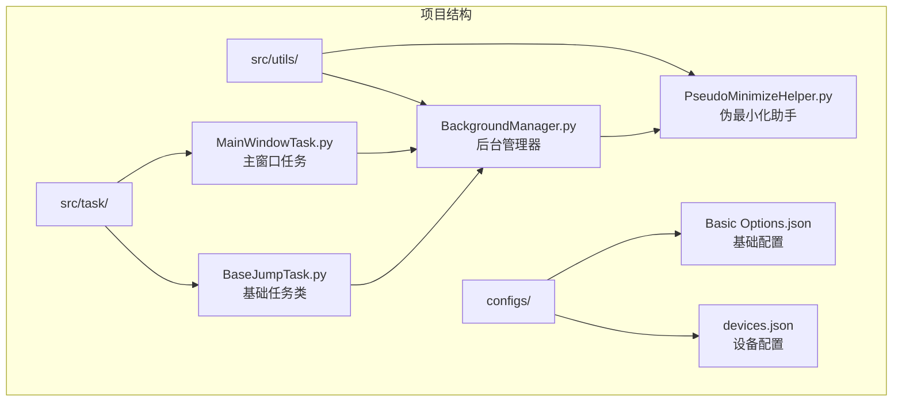
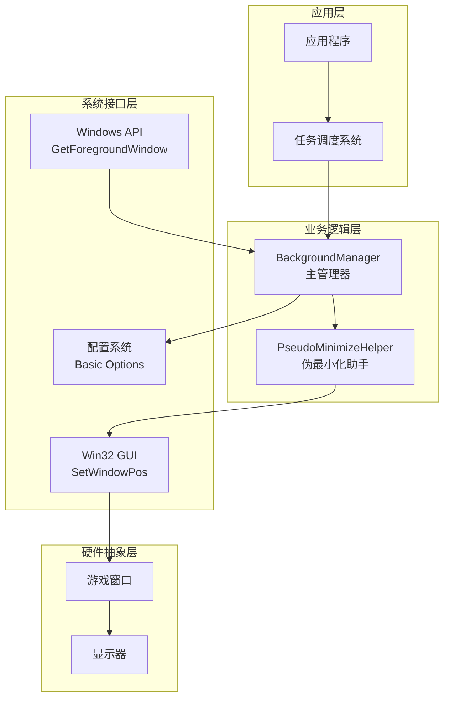
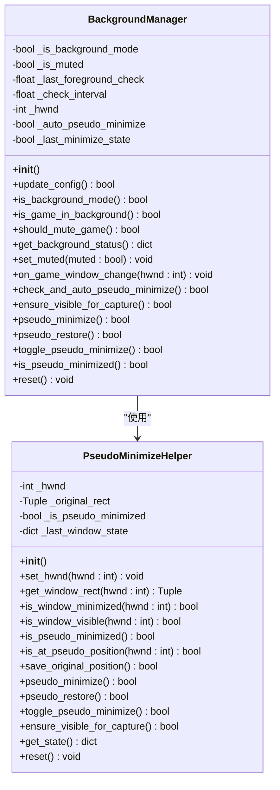
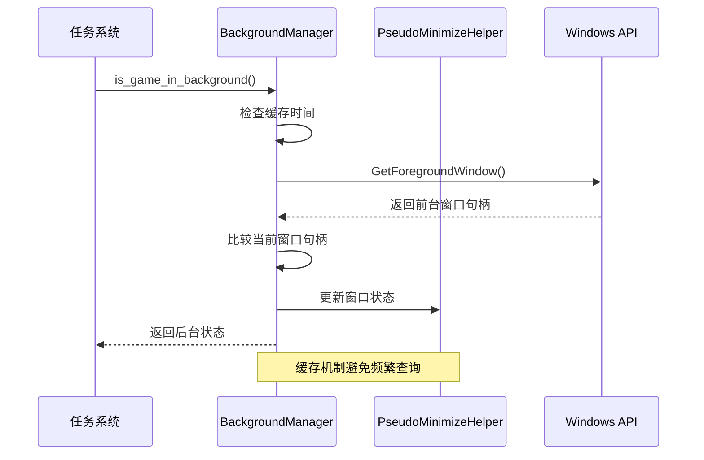
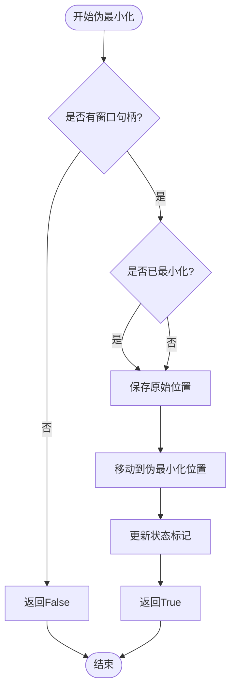
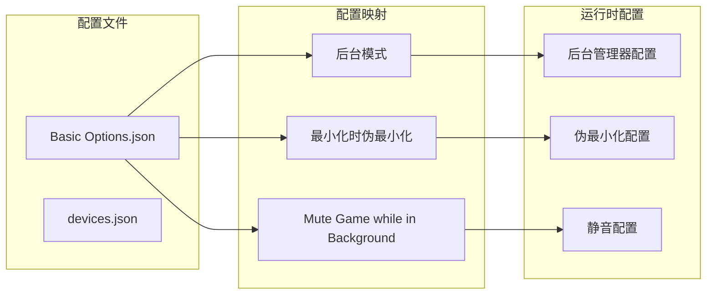
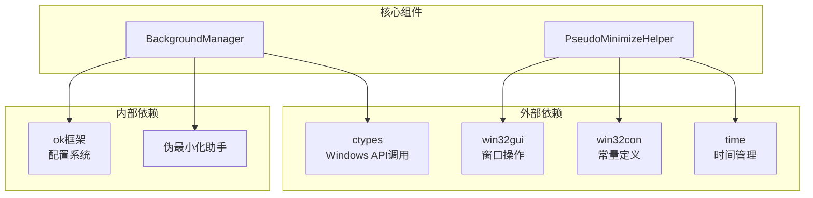

# 后台管理器

<cite>
**本文档引用的文件**
- [BackgroundManager.py](file://src/utils/BackgroundManager.py)
- [PseudoMinimizeHelper.py](file://src/utils/PseudoMinimizeHelper.py)
- [MainWindowTask.py](file://src/task/MainWindowTask.py)
- [BaseJumpTask.py](file://src/task/BaseJumpTask.py)
- [Basic Options.json](file://configs/Basic Options.json)
- [devices.json](file://configs/devices.json)
- [requirements.txt](file://requirements.txt)
</cite>

## 目录
1. [简介](#简介)
2. [项目结构](#项目结构)
3. [核心组件](#核心组件)
4. [架构概览](#架构概览)
5. [详细组件分析](#详细组件分析)
6. [依赖关系分析](#依赖关系分析)
7. [性能考虑](#性能考虑)
8. [故障排除指南](#故障排除指南)
9. [结论](#结论)
10. [附录](#附录)

## 简介

后台管理器(BackgroundManager)是游戏自动化系统中的关键组件，负责处理应用在后台运行时的各种场景，包括窗口状态监控、前台应用检测、后台模式切换等功能。该组件在游戏自动化中发挥着重要作用，能够优雅地处理应用最小化、焦点丢失等场景，确保自动化任务在各种窗口状态下都能稳定运行。

后台管理器的核心特性包括：
- 实时窗口状态监控和前台应用检测
- 伪最小化机制，支持后台截图捕获
- 静音控制，防止后台运行时的声音干扰
- 跨平台兼容性考虑
- 性能优化和资源管理

## 项目结构

后台管理器位于项目的工具模块中，与任务调度系统紧密集成：



**图表来源**
- [BackgroundManager.py:1-145](file://src/utils/BackgroundManager.py#L1-L145)
- [PseudoMinimizeHelper.py:1-193](file://src/utils/PseudoMinimizeHelper.py#L1-L193)
- [MainWindowTask.py:1-215](file://src/task/MainWindowTask.py#L1-L215)
- [BaseJumpTask.py:270-295](file://src/task/BaseJumpTask.py#L270-L295)

**章节来源**
- [BackgroundManager.py:1-145](file://src/utils/BackgroundManager.py#L1-L145)
- [PseudoMinimizeHelper.py:1-193](file://src/utils/PseudoMinimizeHelper.py#L1-L193)
- [MainWindowTask.py:1-215](file://src/task/MainWindowTask.py#L1-L215)

## 核心组件

后台管理器由两个主要组件构成：

### 1. BackgroundManager 主管理器
- 负责整体后台模式的协调和控制
- 处理配置更新和状态管理
- 协调伪最小化操作

### 2. PseudoMinimizeHelper 伪最小化助手
- 提供窗口位置操作的具体实现
- 管理窗口的原始位置信息
- 执行实际的窗口移动操作

这两个组件通过组合模式协作，实现了完整的后台管理功能。

**章节来源**
- [BackgroundManager.py:7-145](file://src/utils/BackgroundManager.py#L7-L145)
- [PseudoMinimizeHelper.py:13-193](file://src/utils/PseudoMinimizeHelper.py#L13-L193)

## 架构概览

后台管理器采用分层架构设计，确保了良好的模块化和可维护性：



**图表来源**
- [BackgroundManager.py:36-66](file://src/utils/BackgroundManager.py#L36-L66)
- [PseudoMinimizeHelper.py:78-118](file://src/utils/PseudoMinimizeHelper.py#L78-L118)
- [MainWindowTask.py:167-193](file://src/task/MainWindowTask.py#L167-L193)

该架构的关键特点：
- **分层清晰**：从应用层到硬件抽象层逐层封装
- **职责分离**：管理器负责协调，助手负责具体实现
- **接口标准化**：通过Windows API提供统一的系统接口
- **配置驱动**：通过配置文件控制行为

## 详细组件分析

### BackgroundManager 类分析

BackgroundManager是后台管理器的核心类，提供了完整的后台模式管理功能：



**图表来源**
- [BackgroundManager.py:7-145](file://src/utils/BackgroundManager.py#L7-L145)
- [PseudoMinimizeHelper.py:13-193](file://src/utils/PseudoMinimizeHelper.py#L13-L193)

#### 核心功能实现

**窗口状态检测流程**：


**伪最小化执行流程**：


**图表来源**
- [BackgroundManager.py:91-111](file://src/utils/BackgroundManager.py#L91-L111)
- [PseudoMinimizeHelper.py:78-118](file://src/utils/PseudoMinimizeHelper.py#L78-L118)

**章节来源**
- [BackgroundManager.py:36-145](file://src/utils/BackgroundManager.py#L36-L145)
- [PseudoMinimizeHelper.py:78-193](file://src/utils/PseudoMinimizeHelper.py#L78-L193)

### PseudoMinimizeHelper 类分析

PseudoMinimizeHelper专门负责窗口位置操作的实现：

#### 关键属性和方法

**状态管理**：
- `_hwnd`: 当前管理的窗口句柄
- `_original_rect`: 窗口原始位置信息
- `_is_pseudo_minimized`: 是否处于伪最小化状态

**位置操作方法**：
- `pseudo_minimize()`: 将窗口移动到伪最小化位置(-32000, -32000)
- `pseudo_restore()`: 恢复窗口到原始位置
- `toggle_pseudo_minimize()`: 切换伪最小化状态

**状态检测方法**：
- `is_window_minimized()`: 检查窗口是否被系统最小化
- `is_at_pseudo_position()`: 检查窗口是否在伪最小化位置
- `ensure_visible_for_capture()`: 确保窗口可用于截图

**章节来源**
- [PseudoMinimizeHelper.py:13-193](file://src/utils/PseudoMinimizeHelper.py#L13-L193)

### 配置系统集成

后台管理器通过配置系统实现灵活的行为控制：



**图表来源**
- [Basic Options.json:1-13](file://configs/Basic Options.json#L1-L13)
- [BackgroundManager.py:18-23](file://src/utils/BackgroundManager.py#L18-L23)

**章节来源**
- [Basic Options.json:1-13](file://configs/Basic Options.json#L1-L13)
- [BackgroundManager.py:18-31](file://src/utils/BackgroundManager.py#L18-L31)

## 依赖关系分析

后台管理器的依赖关系相对简单，主要依赖于系统API和配置系统：



**图表来源**
- [BackgroundManager.py:1-4](file://src/utils/BackgroundManager.py#L1-L4)
- [PseudoMinimizeHelper.py:1-6](file://src/utils/PseudoMinimizeHelper.py#L1-L6)

### 外部依赖分析

**系统API依赖**：
- `ctypes.windll.user32`: 调用Windows用户界面API
- `win32gui`: 提供高级窗口操作功能
- `win32con`: 包含Windows API常量定义

**配置系统依赖**：
- `og.config`: 访问ok框架的配置系统
- 支持动态配置更新

**章节来源**
- [BackgroundManager.py:1-4](file://src/utils/BackgroundManager.py#L1-L4)
- [PseudoMinimizeHelper.py:1-6](file://src/utils/PseudoMinimizeHelper.py#L1-L6)

## 性能考虑

后台管理器在设计时充分考虑了性能优化：

### 缓存机制
- **前台窗口检查缓存**: 通过`_last_foreground_check`和`_check_interval`避免频繁的系统调用
- **状态缓存**: `_cached_is_background`缓存最近的前台状态判断结果

### 时间复杂度分析
- **前台状态检测**: O(1) - 单次系统API调用
- **窗口位置操作**: O(1) - 直接的窗口API调用
- **配置更新**: O(1) - 字典查找操作

### 内存使用优化
- **惰性初始化**: 窗口句柄仅在需要时获取
- **状态重置**: 提供完整的状态清理机制
- **临时对象**: 避免创建不必要的临时对象

### 并发安全考虑
- **线程安全**: 当前实现假设单线程使用
- **异常处理**: 完善的异常捕获和错误处理

## 故障排除指南

### 常见问题及解决方案

**问题1: 窗口检测失败**
- **症状**: `is_game_in_background()`始终返回False
- **原因**: 窗口句柄未正确设置或系统API调用失败
- **解决方案**: 检查`on_game_window_change()`调用和系统权限

**问题2: 伪最小化不生效**
- **症状**: 窗口无法移动到伪最小化位置
- **原因**: 权限不足或窗口被其他程序锁定
- **解决方案**: 以管理员权限运行或检查窗口状态

**问题3: 配置更新不生效**
- **症状**: 修改配置后行为没有变化
- **原因**: 配置缓存或更新时机问题
- **解决方案**: 调用`update_config()`强制刷新

### 调试方法

**状态检查**：
```python
# 获取完整状态信息
status = background_manager.get_background_status()
print(status)

# 检查伪最小化助手状态
pm_status = pseudo_minimize_helper.get_state()
print(pm_status)
```

**日志输出**：
- 后台管理器会在伪最小化时输出调试信息
- 伪最小化助手在操作失败时会打印错误信息

**章节来源**
- [BackgroundManager.py:106](file://src/utils/BackgroundManager.py#L106)
- [PseudoMinimizeHelper.py:117](file://src/utils/PseudoMinimizeHelper.py#L117)

## 结论

后台管理器是一个设计精良的组件，它成功地解决了游戏自动化中的关键挑战。通过巧妙的伪最小化技术和完善的配置系统，它为开发者提供了一个强大而灵活的后台运行解决方案。

### 主要优势
- **可靠性**: 通过多重检查和异常处理确保稳定性
- **灵活性**: 支持动态配置和多种运行模式
- **性能**: 优化的缓存机制减少系统调用开销
- **易用性**: 简洁的API设计便于集成和使用

### 技术亮点
- **智能窗口检测**: 减少不必要的系统调用
- **优雅的伪最小化**: 在不影响用户体验的前提下支持后台运行
- **配置驱动**: 通过配置文件实现行为控制
- **状态管理**: 完整的状态跟踪和恢复机制

## 附录

### 配置选项详解

| 配置项 | 默认值 | 描述 |
|--------|--------|------|
| 后台模式 | True | 启用后台运行模式 |
| 最小化时伪最小化 | True | 窗口最小化时自动伪最小化 |
| 后台时静音游戏 | False | 后台运行时自动静音 |

### 使用示例

**基本使用**：
```python
from src.utils.BackgroundManager import background_manager

# 检查后台状态
if background_manager.is_game_in_background():
    # 处理后台场景
    pass

# 执行伪最小化
background_manager.pseudo_minimize()
```

**配置管理**：
```python
# 更新配置
background_manager.update_config()

# 获取状态
status = background_manager.get_background_status()
```

### 开发者建议

**定制后台检测逻辑**：
1. 继承BackgroundManager类并重写相关方法
2. 实现自定义的窗口检测算法
3. 添加特殊的场景处理逻辑

**性能优化建议**：
1. 合理设置检查间隔时间
2. 在批量操作时合并状态检查
3. 及时清理不再使用的状态信息

**章节来源**
- [Basic Options.json:1-13](file://configs/Basic Options.json#L1-L13)
- [BackgroundManager.py:72-82](file://src/utils/BackgroundManager.py#L72-L82)