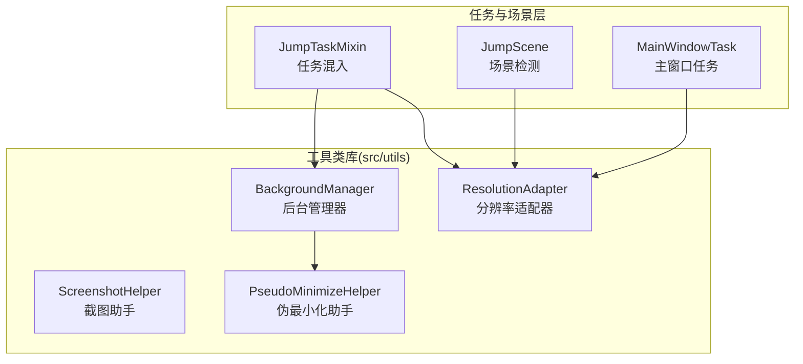
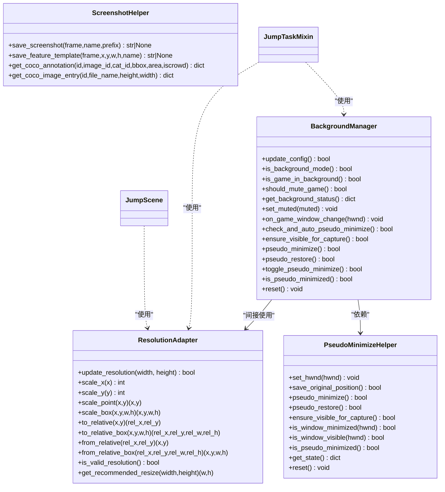
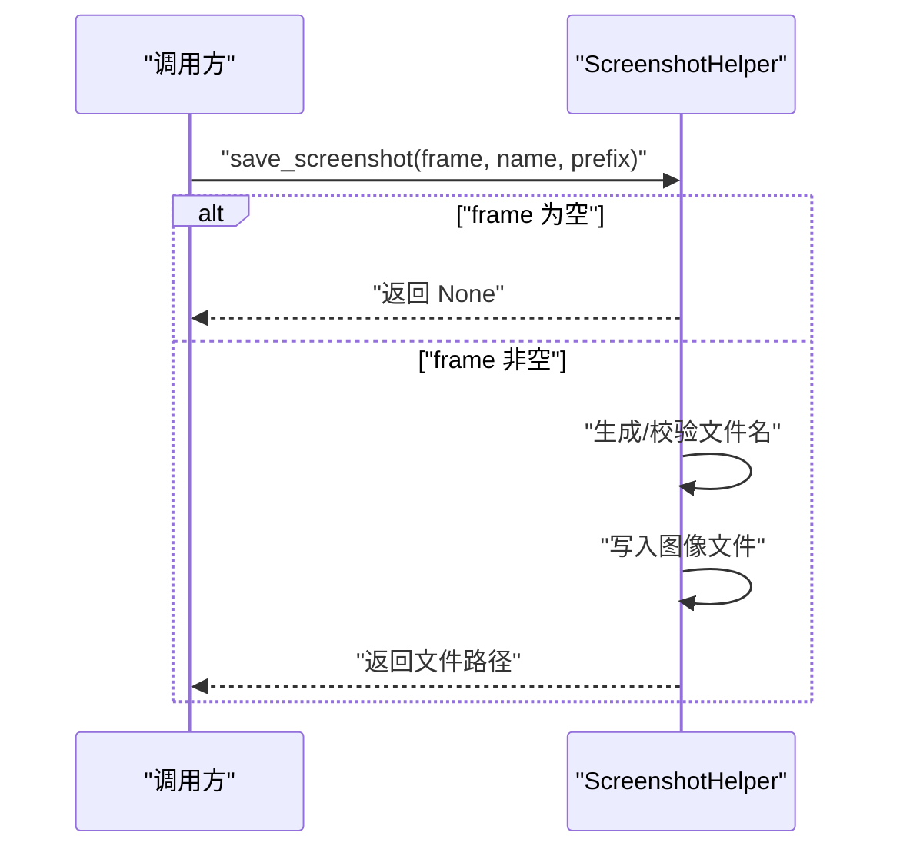
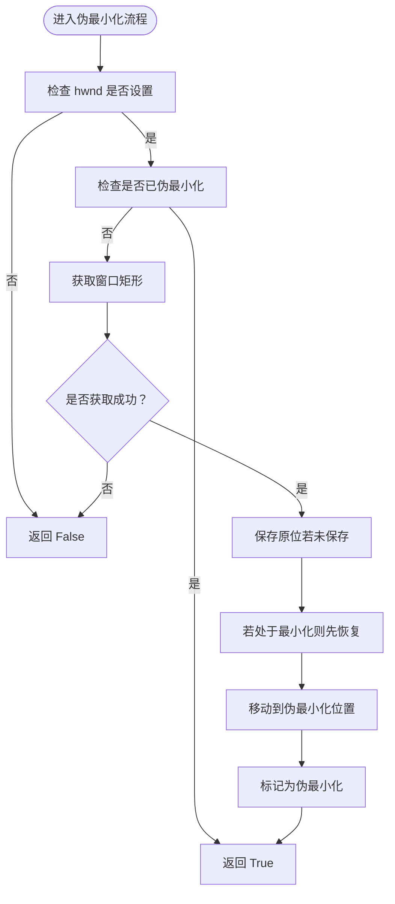
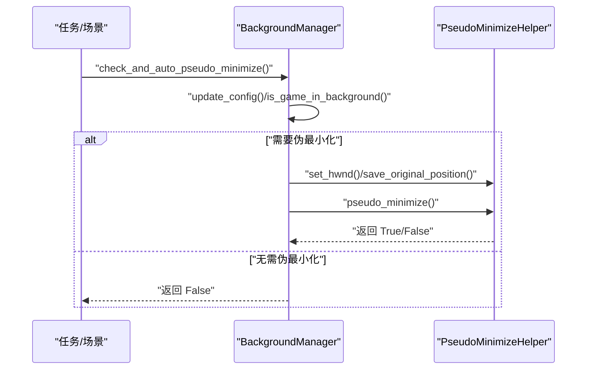
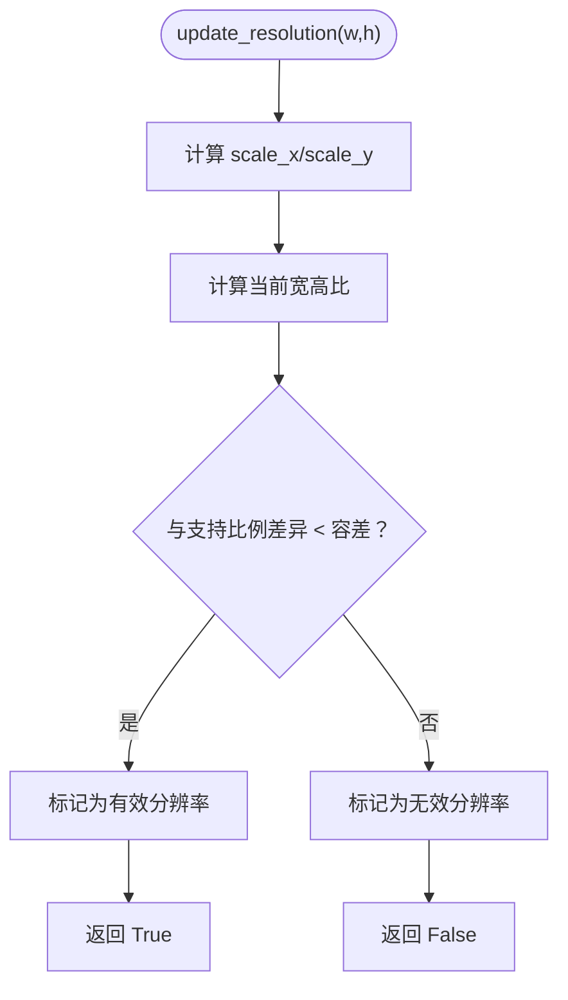
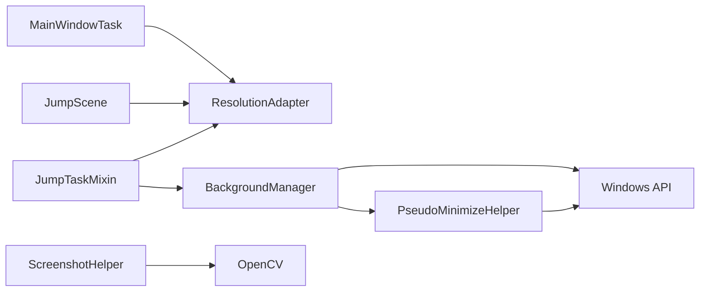

# 工具类库

<cite>
**本文引用的文件**
- [ScreenshotHelper.py](file://src/utils/ScreenshotHelper.py)
- [BackgroundManager.py](file://src/utils/BackgroundManager.py)
- [PseudoMinimizeHelper.py](file://src/utils/PseudoMinimizeHelper.py)
- [ResolutionAdapter.py](file://src/utils/ResolutionAdapter.py)
- [__init__.py](file://src/utils/__init__.py)
- [JumpScene.py](file://src/scene/JumpScene.py)
- [mixins.py](file://src/task/mixins.py)
- [MainWindowTask.py](file://src/task/MainWindowTask.py)
- [requirements.txt](file://requirements.txt)
- [Basic Options.json](file://configs/Basic Options.json)
- [ui_config.json](file://configs/ui_config.json)
- [globals.py](file://src/globals.py)
</cite>

## 目录
1. [简介](#简介)
2. [项目结构](#项目结构)
3. [核心组件](#核心组件)
4. [架构总览](#架构总览)
5. [详细组件分析](#详细组件分析)
6. [依赖关系分析](#依赖关系分析)
7. [性能考虑](#性能考虑)
8. [故障排查指南](#故障排查指南)
9. [结论](#结论)
10. [附录](#附录)

## 简介
本文件面向开发者，系统性梳理工具类库中“截图助手”“后台管理器”“分辨率适配器”“伪最小化助手”的设计与实现，阐明其职责边界、交互关系、使用场景与最佳实践，并提供性能优化与内存管理策略，帮助快速复用与扩展这些工具类。

## 项目结构
工具类库位于 src/utils 目录，提供四个核心工具类及其单例实例，同时在任务层与场景层广泛复用：
- ScreenshotHelper：负责截图保存、特征模板提取与 COCO 格式标注辅助
- PseudoMinimizeHelper：负责窗口伪最小化/还原、可见性保障与状态查询
- BackgroundManager：负责后台模式开关、前台窗口检测、静音策略与伪最小化联动
- ResolutionAdapter：负责分辨率与宽高比适配、坐标/区域缩放、推荐分辨率计算

图表来源
- [__init__.py](file://src/utils/__init__.py)
- [mixins.py](file://src/task/mixins.py)
- [JumpScene.py](file://src/scene/JumpScene.py)
- [MainWindowTask.py](file://src/task/MainWindowTask.py)

章节来源
- [__init__.py](file://src/utils/__init__.py)
- [requirements.txt](file://requirements.txt)

## 核心组件
- 截图助手（ScreenshotHelper）
  - 职责：保存帧图像、生成特征模板、生成 COCO 图像与标注条目
  - 关键能力：自动目录创建、命名规范、模板裁剪与持久化
- 伪最小化助手（PseudoMinimizeHelper）
  - 职责：将目标窗口移动至伪最小化位置、恢复原位、检测最小化/可见性状态
  - 关键能力：原位保存与恢复、最小化状态处理、安全可见性保障
- 后台管理器（BackgroundManager）
  - 职责：根据配置切换后台模式、检测前台窗口、控制静音、驱动伪最小化
  - 关键能力：配置读取、前台窗口缓存、自动伪最小化、状态聚合
- 分辨率适配器（ResolutionAdapter）
  - 职责：基于参考分辨率进行坐标/区域缩放、宽高比校验、推荐分辨率
  - 关键能力：动态更新当前分辨率、相对坐标换算、配置驱动的参考与支持范围

章节来源
- [ScreenshotHelper.py](file://src/utils/ScreenshotHelper.py)
- [PseudoMinimizeHelper.py](file://src/utils/PseudoMinimizeHelper.py)
- [BackgroundManager.py](file://src/utils/BackgroundManager.py)
- [ResolutionAdapter.py](file://src/utils/ResolutionAdapter.py)

## 架构总览
工具类之间以“组合/依赖”关系协作，任务与场景层通过混入与直接导入使用工具类能力；后台管理器与伪最小化助手紧密配合，确保后台捕获与窗口状态一致。

图表来源
- [ResolutionAdapter.py](file://src/utils/ResolutionAdapter.py)
- [PseudoMinimizeHelper.py](file://src/utils/PseudoMinimizeHelper.py)
- [BackgroundManager.py](file://src/utils/BackgroundManager.py)
- [ScreenshotHelper.py](file://src/utils/ScreenshotHelper.py)
- [mixins.py](file://src/task/mixins.py)
- [JumpScene.py](file://src/scene/JumpScene.py)

## 详细组件分析

### 截图助手（ScreenshotHelper）
- 设计原则
  - 单一职责：专注图像保存与特征模板导出
  - 安全前置：对空帧进行保护，避免无效写入
  - 规范命名：默认时间戳命名，自动补全扩展名
  - 数据标注辅助：提供 COCO 条目构造方法，便于数据集构建
- 使用场景
  - 训练/调试阶段保存关键帧
  - 导出特征模板用于模板匹配
  - 生成标注数据（图像条目、标注条目）
- 性能与内存
  - 写盘操作为主，注意磁盘 IO；建议批量异步或限频写入
  - 模板裁剪与写盘为 O(W×H) 操作，避免在高频循环中频繁调用
- 扩展建议
  - 支持多格式输出（如 JPEG、BMP）
  - 增加压缩参数与质量控制
  - 提供批量导出与去重策略

图表来源
- [ScreenshotHelper.py](file://src/utils/ScreenshotHelper.py)

章节来源
- [ScreenshotHelper.py](file://src/utils/ScreenshotHelper.py)

### 伪最小化助手（PseudoMinimizeHelper）
- 设计原则
  - 状态机：维护伪最小化标志与原位缓存，避免重复操作
  - 安全性：最小化状态检测与恢复，防止误操作
  - 可观测性：提供完整状态查询与诊断信息
- 使用场景
  - 后台捕获时将游戏窗口移出可视区域，避免遮挡影响识别
  - 恢复窗口到原始位置，保证交互体验
- 性能与内存
  - 窗口 API 调用开销低，但需避免频繁调用
  - 建议在状态变化时再触发，减少 SetWindowPos 次数
- 扩展建议
  - 支持多显示器/多窗口场景
  - 增加 DPI 适配与高分屏兼容

图表来源
- [PseudoMinimizeHelper.py](file://src/utils/PseudoMinimizeHelper.py)

章节来源
- [PseudoMinimizeHelper.py](file://src/utils/PseudoMinimizeHelper.py)

### 后台管理器（BackgroundManager）
- 设计原则
  - 配置驱动：从全局配置读取后台模式、静音策略与伪最小化开关
  - 缓存优化：前台窗口检测结果短期缓存，降低频繁 API 调用
  - 组合协作：与伪最小化助手解耦，仅在必要时触发
- 使用场景
  - 应用最小化或被遮挡时，自动伪最小化游戏窗口以稳定后台捕获
  - 根据配置决定是否静音
- 性能与内存
  - 检测间隔控制（默认 1 秒），避免高频轮询
  - 状态缓存减少重复计算
- 扩展建议
  - 支持多游戏窗口场景
  - 增加事件回调机制，通知外部状态变化

图表来源
- [BackgroundManager.py](file://src/utils/BackgroundManager.py)
- [PseudoMinimizeHelper.py](file://src/utils/PseudoMinimizeHelper.py)

章节来源
- [BackgroundManager.py](file://src/utils/BackgroundManager.py)

### 分辨率适配器（ResolutionAdapter）
- 设计原则
  - 配置驱动：支持从全局配置读取参考分辨率与支持比例
  - 数学清晰：提供坐标/区域缩放、相对坐标换算
  - 宽高比校验：支持比例容差判断与推荐分辨率
- 使用场景
  - 在不同分辨率/缩放下保持点击、识别区域的一致性
  - 场景检测与特征匹配的坐标转换
- 性能与内存
  - 纯数学运算，开销极低；注意避免在高频循环中重复更新
  - 建议在分辨率变化时集中更新一次
- 扩展建议
  - 支持多参考分辨率与多模板映射
  - 增加缩放策略（最近邻/双线性等）以适配图像变换

图表来源
- [ResolutionAdapter.py](file://src/utils/ResolutionAdapter.py)

章节来源
- [ResolutionAdapter.py](file://src/utils/ResolutionAdapter.py)

## 依赖关系分析
- 工具类内部：无循环依赖，职责清晰
- 任务与场景层依赖：
  - JumpTaskMixin 依赖 ResolutionAdapter 与 BackgroundManager
  - JumpScene 依赖 ResolutionAdapter
  - MainWindowTask 依赖 ResolutionAdapter
- 外部依赖：
  - OpenCV 用于图像写入与处理
  - Windows API（ctypes/win32）用于窗口操作
  - ONNXRuntime 用于推理（与工具类解耦）

图表来源
- [mixins.py](file://src/task/mixins.py)
- [JumpScene.py](file://src/scene/JumpScene.py)
- [MainWindowTask.py](file://src/task/MainWindowTask.py)
- [BackgroundManager.py](file://src/utils/BackgroundManager.py)
- [PseudoMinimizeHelper.py](file://src/utils/PseudoMinimizeHelper.py)
- [ScreenshotHelper.py](file://src/utils/ScreenshotHelper.py)
- [requirements.txt](file://requirements.txt)

章节来源
- [mixins.py](file://src/task/mixins.py)
- [JumpScene.py](file://src/scene/JumpScene.py)
- [MainWindowTask.py](file://src/task/MainWindowTask.py)
- [BackgroundManager.py](file://src/utils/BackgroundManager.py)
- [PseudoMinimizeHelper.py](file://src/utils/PseudoMinimizeHelper.py)
- [ScreenshotHelper.py](file://src/utils/ScreenshotHelper.py)
- [requirements.txt](file://requirements.txt)

## 性能考虑
- I/O 与图像处理
  - 截图写盘为瓶颈，建议：
    - 控制写盘频率（节流/去抖）
    - 批量写入或异步落盘
    - 仅在必要时保存特征模板
- 窗口 API 调用
  - 伪最小化/还原与可见性检测为轻量操作，但仍需避免高频调用
  - 后台管理器已内置检测间隔缓存，建议沿用
- 数学缩放
  - 分辨率适配器纯计算，注意在循环中避免重复更新分辨率
- 模型与资源
  - 全局资源管理器提供 YOLO 模型延迟加载与重置，避免常驻占用
  - 建议在后台模式下按需释放模型资源

章节来源
- [globals.py](file://src/globals.py)
- [BackgroundManager.py](file://src/utils/BackgroundManager.py)
- [PseudoMinimizeHelper.py](file://src/utils/PseudoMinimizeHelper.py)
- [ResolutionAdapter.py](file://src/utils/ResolutionAdapter.py)

## 故障排查指南
- 截图失败或文件为空
  - 检查传入帧是否为 None
  - 确认截图目录权限与磁盘空间
- 伪最小化无效
  - 确保已设置 hwnd
  - 检查窗口是否处于最小化状态，必要时先恢复再伪最小化
  - 查看状态诊断信息（原位、伪最小化标志、可见性）
- 后台模式不生效
  - 检查基础配置项“后台模式”“最小化时伪最小化”“后台时静音游戏”
  - 确认前台窗口检测逻辑是否命中目标 hwnd
- 分辨率不匹配导致识别异常
  - 使用分辨率检查与推荐分辨率提示
  - 在场景/任务中集中更新分辨率，避免重复计算

章节来源
- [PseudoMinimizeHelper.py](file://src/utils/PseudoMinimizeHelper.py)
- [BackgroundManager.py](file://src/utils/BackgroundManager.py)
- [ResolutionAdapter.py](file://src/utils/ResolutionAdapter.py)
- [Basic Options.json](file://configs/Basic Options.json)

## 结论
该工具类库围绕“稳定性、可复用性、可扩展性”设计，通过清晰的职责划分与配置驱动，为自动化任务提供了可靠的截图、窗口管理与分辨率适配能力。遵循本文的性能与扩展建议，可在复杂环境下保持高效与稳定。

## 附录
- 配置参考
  - 基础选项：包含后台模式、静音、自动伪最小化、捕获方式等
  - UI 配置：包含主题色、主题模式、DPI 缩放等
- 最佳实践
  - 在任务入口集中更新分辨率，避免在循环内重复更新
  - 后台模式下谨慎调用窗口 API，优先使用缓存与状态机
  - 截图与特征导出按需触发，避免高频 I/O
  - 使用全局资源管理器统一管理模型与缓存，按需释放

章节来源
- [Basic Options.json](file://configs/Basic Options.json)
- [ui_config.json](file://configs/ui_config.json)
- [mixins.py](file://src/task/mixins.py)
- [JumpScene.py](file://src/scene/JumpScene.py)
- [MainWindowTask.py](file://src/task/MainWindowTask.py)
- [globals.py](file://src/globals.py)