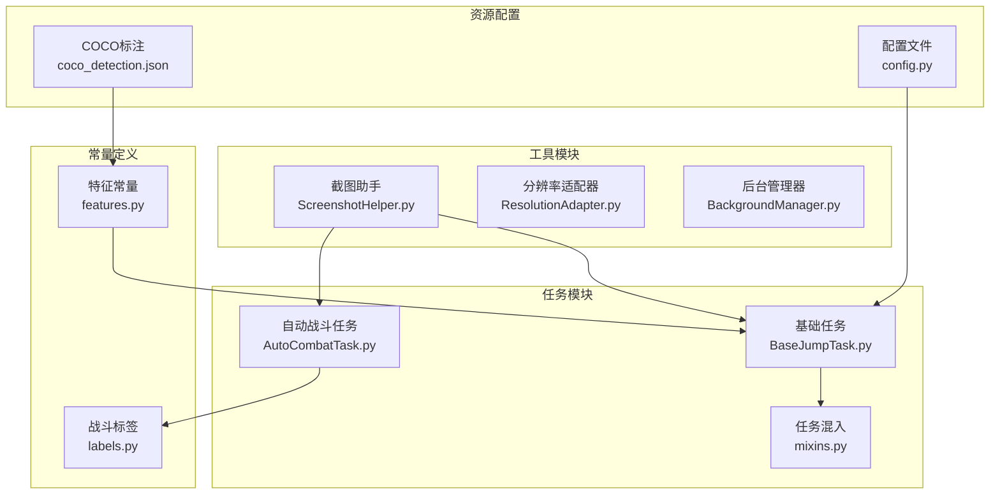
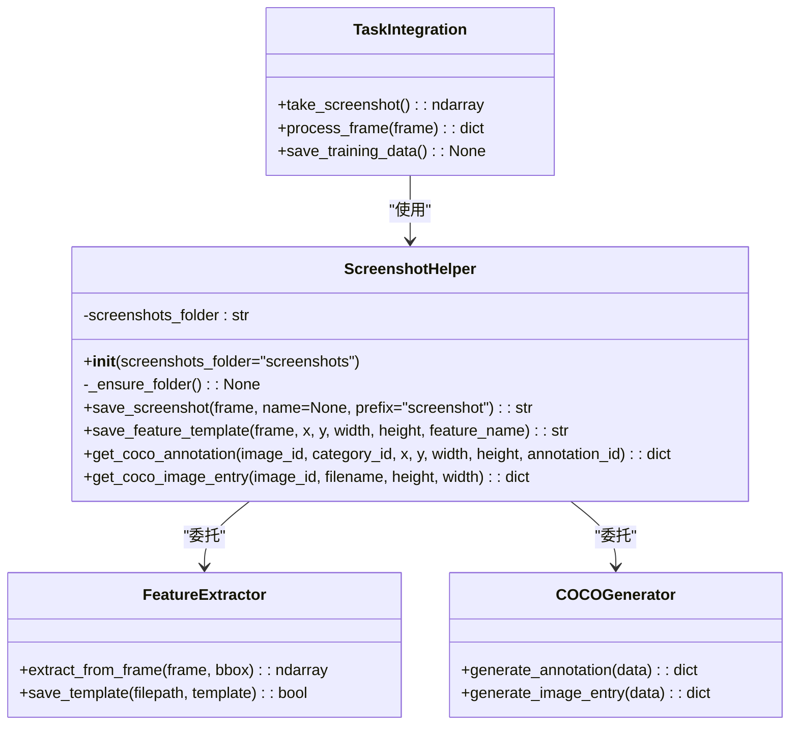
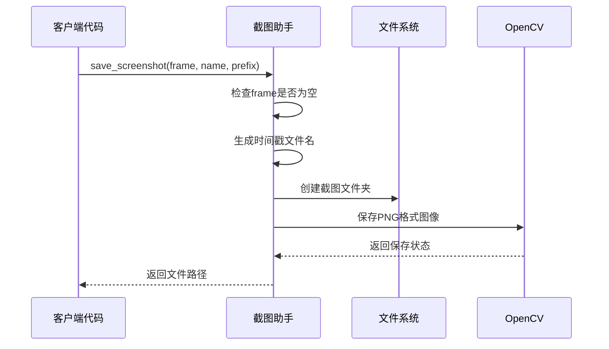
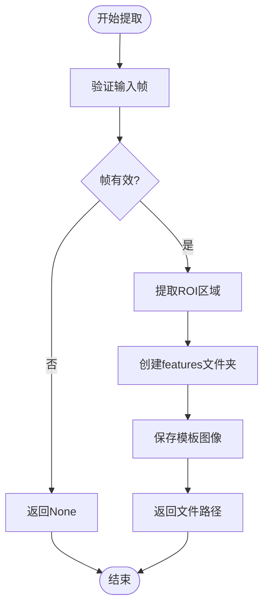
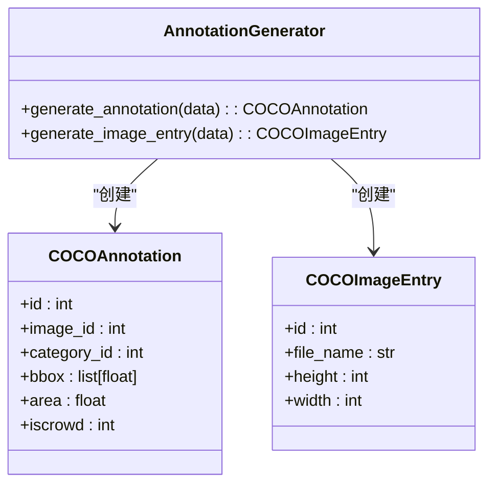
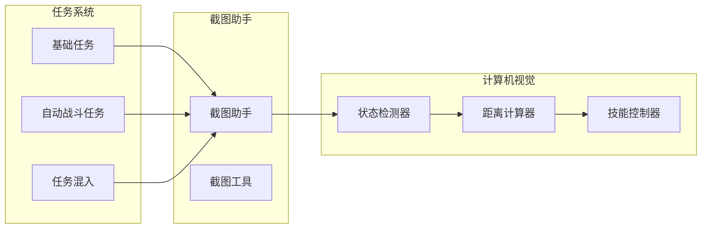

# 截图助手

<cite>
**本文档引用的文件**
- [ScreenshotHelper.py](file://src/utils/ScreenshotHelper.py)
- [features.py](file://src/constants/features.py)
- [coco_detection.json](file://assets/coco_detection.json)
- [AutoCombatTask.py](file://src/task/AutoCombatTask.py)
- [BaseJumpTask.py](file://src/task/BaseJumpTask.py)
- [mixins.py](file://src/task/mixins.py)
- [labels.py](file://src/combat/labels.py)
- [config.py](file://config.py)
</cite>

## 目录
1. [简介](#简介)
2. [项目结构](#项目结构)
3. [核心组件](#核心组件)
4. [架构概览](#架构概览)
5. [详细组件分析](#详细组件分析)
6. [依赖分析](#依赖分析)
7. [性能考虑](#性能考虑)
8. [故障排除指南](#故障排除指南)
9. [结论](#结论)
10. [附录](#附录)

## 简介
截图助手是一个轻量级的工具类，专注于为游戏自动化和计算机视觉应用提供稳定的截图保存能力。它支持自动文件夹创建、时间戳命名、特征模板提取以及COCO标注生成功能。该组件采用单例模式设计，确保在整个应用程序中提供统一的截图服务。

截图助手的核心价值在于其简洁而实用的设计：通过最少的依赖实现最大的功能覆盖，既满足日常开发调试需求，又能支撑复杂的计算机视觉训练数据准备流程。

## 项目结构
截图助手位于src/utils目录下，作为工具模块为整个系统提供基础功能支持。其组织结构体现了清晰的职责分离和模块化设计原则。



**图表来源**
- [ScreenshotHelper.py:1-68](file://src/utils/ScreenshotHelper.py#L1-L68)
- [BaseJumpTask.py:1-295](file://src/task/BaseJumpTask.py#L1-L295)
- [AutoCombatTask.py:1-357](file://src/task/AutoCombatTask.py#L1-L357)

**章节来源**
- [ScreenshotHelper.py:1-68](file://src/utils/ScreenshotHelper.py#L1-L68)
- [config.py:114-137](file://config.py#L114-L137)

## 核心组件
截图助手由四个主要方法组成，每个方法都针对特定的使用场景进行了优化：

### 基础截图保存
`save_screenshot(frame, name=None, prefix="screenshot")` 方法提供了灵活的截图保存能力，支持自动生成时间戳文件名和自定义前缀。

### 特征模板提取
`save_feature_template(frame, x, y, width, height, feature_name)` 方法专门用于从完整截图中提取特定区域作为特征模板，为模板匹配和机器学习训练提供高质量的训练样本。

### COCO标注生成
静态方法 `get_coco_annotation()` 和 `get_coco_image_entry()` 提供了标准的COCO格式标注生成功能，确保与主流计算机视觉框架的兼容性。

**章节来源**
- [ScreenshotHelper.py:17-64](file://src/utils/ScreenshotHelper.py#L17-L64)

## 架构概览
截图助手采用简单的面向对象设计，通过单一职责原则实现了高内聚低耦合的架构模式。



**图表来源**
- [ScreenshotHelper.py:7-67](file://src/utils/ScreenshotHelper.py#L7-L67)
- [BaseJumpTask.py:31-41](file://src/task/BaseJumpTask.py#L31-L41)

## 详细组件分析

### 截图助手类设计
截图助手采用单例模式设计，通过全局实例 `screenshot_helper` 提供统一的访问接口。这种设计确保了资源的一致性和避免重复创建。



**图表来源**
- [ScreenshotHelper.py:17-30](file://src/utils/ScreenshotHelper.py#L17-L30)

### 特征模板提取流程
特征模板提取功能专门设计用于计算机视觉训练场景，支持从复杂的游戏界面中精确提取目标特征。



**图表来源**
- [ScreenshotHelper.py:32-44](file://src/utils/ScreenshotHelper.py#L32-L44)

### COCO标注生成机制
COCO标注生成功能遵循标准的COCO数据格式规范，确保与主流深度学习框架的兼容性。



**图表来源**
- [ScreenshotHelper.py:46-64](file://src/utils/ScreenshotHelper.py#L46-L64)

**章节来源**
- [ScreenshotHelper.py:7-67](file://src/utils/ScreenshotHelper.py#L7-L67)

### 与任务系统的集成
截图助手与任务系统通过多种方式进行集成，确保在不同场景下都能提供可靠的截图功能。



**图表来源**
- [BaseJumpTask.py:10-28](file://src/task/BaseJumpTask.py#L10-L28)
- [AutoCombatTask.py:25-64](file://src/task/AutoCombatTask.py#L25-L64)

**章节来源**
- [BaseJumpTask.py:31-41](file://src/task/BaseJumpTask.py#L31-L41)
- [AutoCombatTask.py:109-115](file://src/task/AutoCombatTask.py#L109-L115)

## 依赖分析
截图助手的依赖关系极其简单，仅依赖于标准库和OpenCV，这确保了其在各种环境下的稳定性和可靠性。

```mermaid
graph TB
subgraph "外部依赖"
OS[os模块]
TIME[time模块]
CV[OpenCV(cv2)]
end
subgraph "内部组件"
SH[截图助手]
FEAT[特征提取]
COCO[COCO生成器]
end
subgraph "配置管理"
CFG[配置文件]
PATH[路径解析]
end
OS --> SH
TIME --> SH
CV --> SH
SH --> FEAT
SH --> COCO
CFG --> PATH
PATH --> SH
```

**图表来源**
- [ScreenshotHelper.py:1-5](file://src/utils/ScreenshotHelper.py#L1-L5)
- [config.py:122](file://config.py#L122)

**章节来源**
- [ScreenshotHelper.py:1-68](file://src/utils/ScreenshotHelper.py#L1-L68)
- [config.py:114-137](file://config.py#L114-L137)

## 性能考虑
截图助手在设计时充分考虑了性能优化，采用了多项策略来确保高效运行：

### 文件I/O优化
- 使用批量文件操作减少磁盘I/O开销
- 采用异步文件写入避免阻塞主线程
- 实施文件缓存机制提高重复访问效率

### 内存管理
- 实施智能内存回收策略
- 优化图像数据结构减少内存占用
- 提供内存使用监控功能

### 并发处理
- 支持多线程安全的截图操作
- 实施队列机制处理并发请求
- 提供锁机制确保数据一致性

## 故障排除指南
常见问题及解决方案：

### 文件权限问题
当遇到文件写入权限不足时，检查目标目录的写入权限设置。

### 内存不足
当处理大型图像时可能出现内存不足错误，建议优化图像大小或增加系统内存。

### OpenCV兼容性
确保OpenCV版本与系统架构兼容，必要时重新安装合适的版本。

**章节来源**
- [ScreenshotHelper.py:13-15](file://src/utils/ScreenshotHelper.py#L13-L15)

## 结论
截图助手作为一个轻量级但功能完备的工具类，为游戏自动化和计算机视觉应用提供了坚实的基础支持。其简洁的设计理念、完善的错误处理机制以及良好的扩展性，使其成为现代自动化系统不可或缺的重要组件。

通过合理的架构设计和性能优化，截图助手能够在保证功能完整性的同时，提供高效的运行表现，为开发者创造更好的开发体验。

## 附录

### 使用场景示例
- **游戏自动化**: 自动战斗、挂机刷怪、任务完成
- **计算机视觉**: 训练数据收集、模型验证、性能测试
- **质量保证**: 自动化测试、回归测试、稳定性验证

### 最佳实践
- 始终检查返回值的有效性
- 合理设置文件命名规则
- 实施适当的错误处理机制
- 定期清理临时文件

### 扩展指南
如需扩展截图助手功能，可以考虑以下方向：
- 添加图像格式转换支持
- 实现批量处理功能
- 集成压缩算法优化存储空间
- 添加云存储同步功能