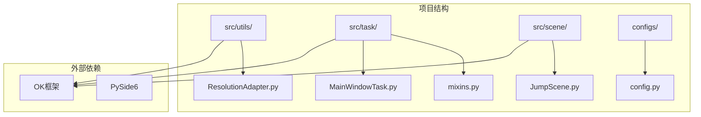
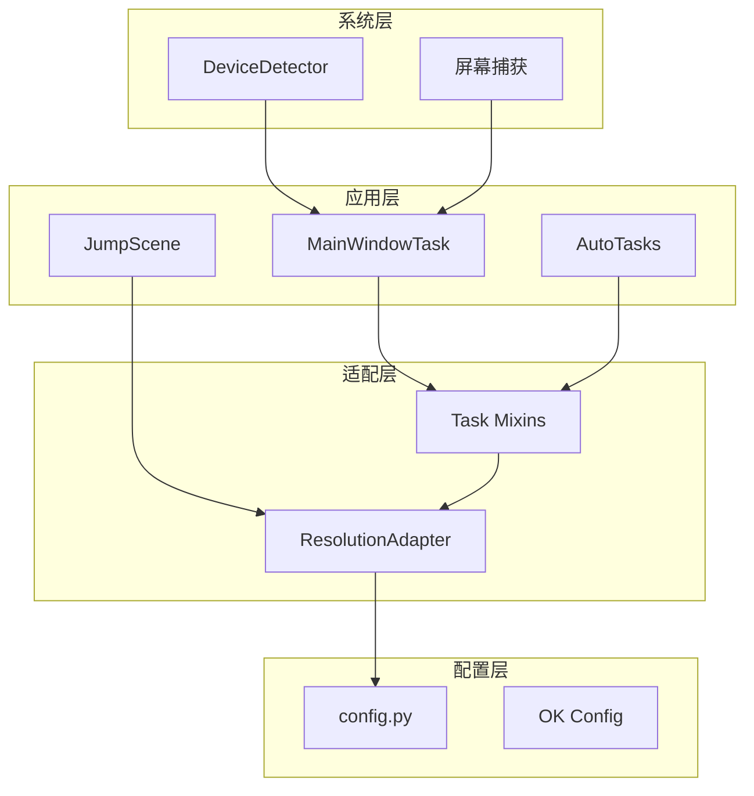
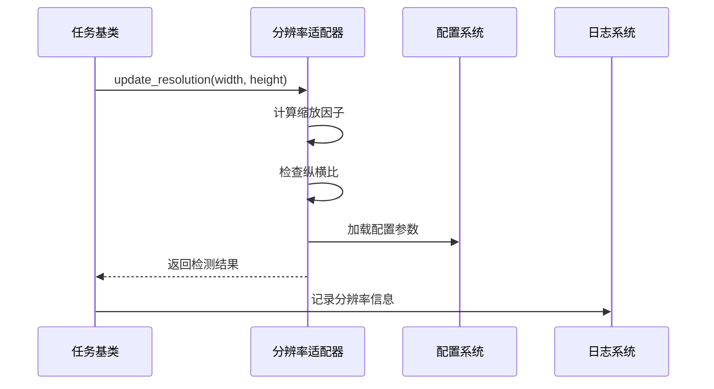
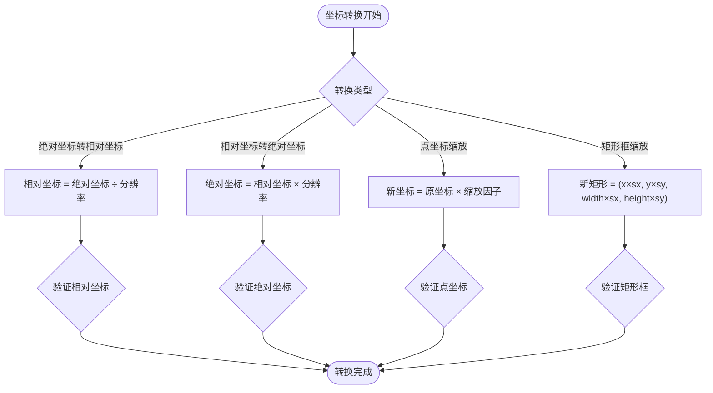
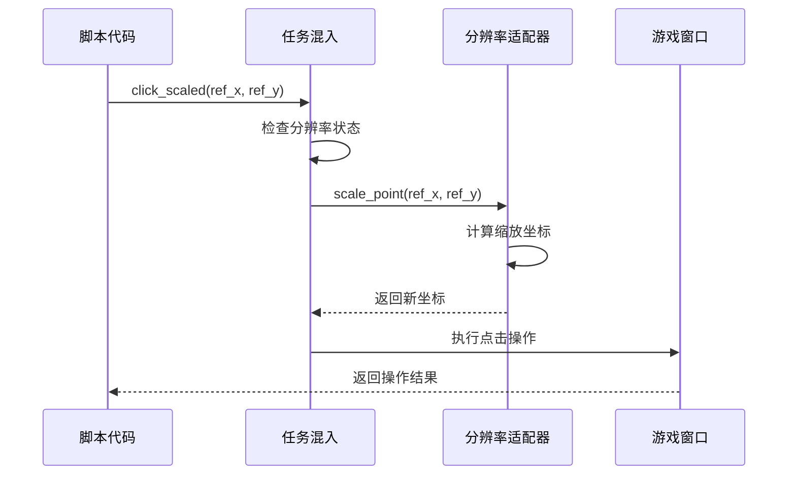
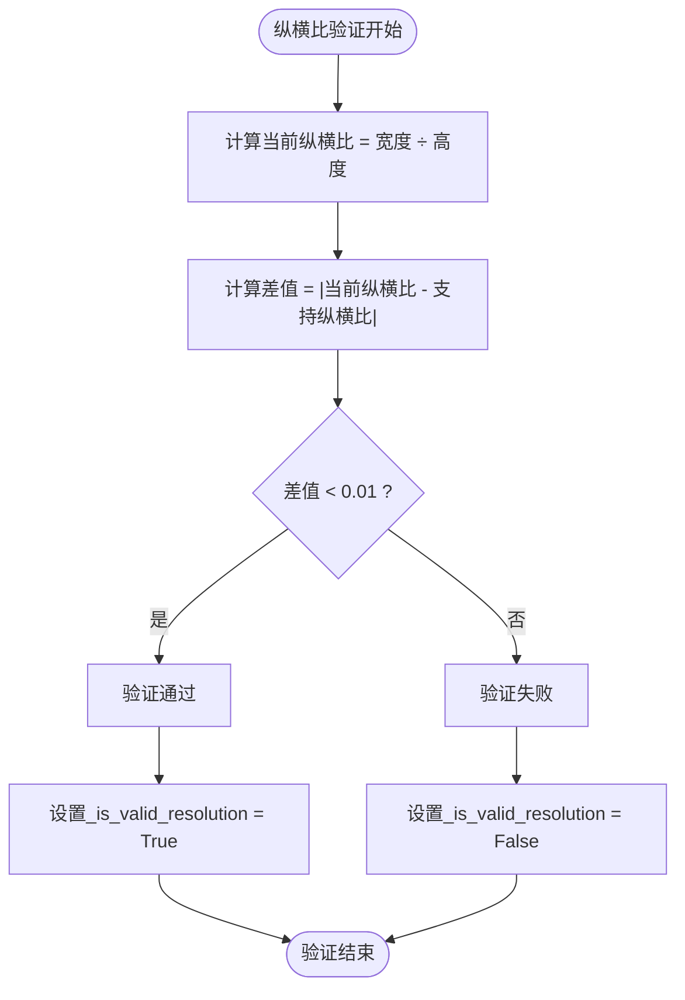
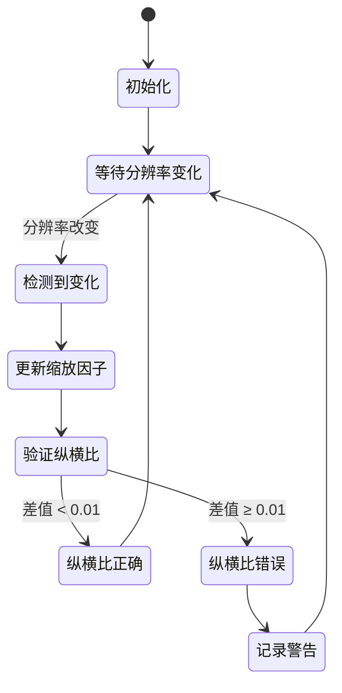
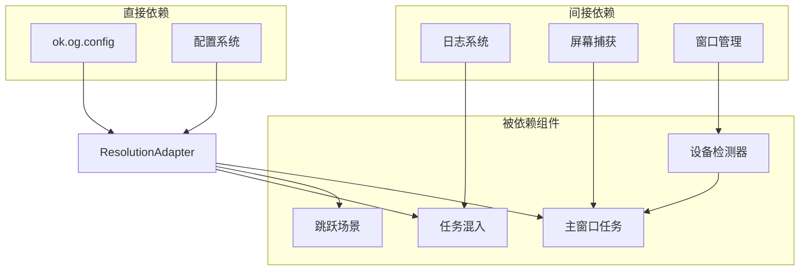

# 分辨率适配器

<cite>
**本文档引用的文件**
- [ResolutionAdapter.py](file://src/utils/ResolutionAdapter.py)
- [mixins.py](file://src/task/mixins.py)
- [JumpScene.py](file://src/scene/JumpScene.py)
- [config.py](file://config.py)
- [main.py](file://main.py)
- [DeviceDetector.py](file://src/utils/DeviceDetector.py)
- [MainWindowTask.py](file://src/task/MainWindowTask.py)
</cite>

## 目录
1. [简介](#简介)
2. [项目结构](#项目结构)
3. [核心组件](#核心组件)
4. [架构概览](#架构概览)
5. [详细组件分析](#详细组件分析)
6. [依赖关系分析](#依赖关系分析)
7. [性能考虑](#性能考虑)
8. [故障排除指南](#故障排除指南)
9. [结论](#结论)

## 简介

分辨率适配器是本项目中一个关键的基础设施组件，专门用于支持多分辨率游戏环境。它解决了在不同分辨率和纵横比下进行屏幕坐标转换、UI元素定位和点击操作的问题。

该组件的核心目标是在保持游戏识别准确性的前提下，适应各种不同的显示器配置和游戏窗口设置。通过统一的坐标转换机制，确保基于参考分辨率（1920x1080）开发的自动化脚本能够在实际运行环境中正常工作。

## 项目结构

项目采用模块化的组织方式，分辨率适配器位于工具模块中，被多个业务模块共享使用：



**图表来源**
- [ResolutionAdapter.py:1-163](file://src/utils/ResolutionAdapter.py#L1-L163)
- [mixins.py:104-182](file://src/task/mixins.py#L104-L182)

**章节来源**
- [ResolutionAdapter.py:1-163](file://src/utils/ResolutionAdapter.py#L1-L163)
- [config.py:108-117](file://config.py#L108-L117)

## 核心组件

### ResolutionAdapter 类

ResolutionAdapter 是一个单例模式的坐标转换器，提供了完整的分辨率适配解决方案：

#### 主要特性
- **双轴缩放**：独立处理X轴和Y轴的缩放因子
- **纵横比检测**：验证当前分辨率是否符合支持的比例要求
- **相对坐标系统**：支持相对坐标与绝对坐标的双向转换
- **配置驱动**：通过配置文件动态调整参考分辨率和纵横比

#### 关键属性
- `REFERENCE_WIDTH/REFERENCE_HEIGHT`：参考分辨率（默认1920x1080）
- `SUPPORTED_RATIO`：支持的纵横比（默认16:9）
- `_current_width/_current_height`：当前检测到的分辨率
- `_scale_x/_scale_y`：X轴和Y轴的缩放因子

**章节来源**
- [ResolutionAdapter.py:4-163](file://src/utils/ResolutionAdapter.py#L4-L163)

## 架构概览

分辨率适配器在整个系统中的位置和交互关系如下：



**图表来源**
- [mixins.py:104-182](file://src/task/mixins.py#L104-L182)
- [JumpScene.py:197-215](file://src/scene/JumpScene.py#L197-L215)
- [config.py:108-117](file://config.py#L108-L117)

## 详细组件分析

### 分辨率检测机制

分辨率检测是通过以下步骤实现的：



**图表来源**
- [mixins.py:104-121](file://src/task/mixins.py#L104-L121)
- [ResolutionAdapter.py:34-44](file://src/utils/ResolutionAdapter.py#L34-L44)

#### 检测流程详解

1. **初始化阶段**：从OK框架的配置系统加载参考分辨率和纵横比设置
2. **更新阶段**：接收新的分辨率参数，计算X轴和Y轴的缩放因子
3. **验证阶段**：比较当前纵横比与支持的纵横比，允许±0.01的误差范围
4. **记录阶段**：将检测结果存储在适配器实例中供后续使用

**章节来源**
- [ResolutionAdapter.py:19-44](file://src/utils/ResolutionAdapter.py#L19-L44)
- [mixins.py:104-121](file://src/task/mixins.py#L104-L121)

### 屏幕坐标转换算法

坐标转换是分辨率适配的核心功能，提供了多种转换方法：

#### 基础缩放算法



**图表来源**
- [ResolutionAdapter.py:69-93](file://src/utils/ResolutionAdapter.py#L69-L93)

#### 转换方法分类

1. **相对坐标系统** (`to_relative`, `from_relative`)
   - 将绝对坐标转换为0-1之间的相对坐标
   - 便于跨分辨率的UI元素定位
   - 支持矩形框的相对坐标转换

2. **缩放坐标系统** (`scale_x`, `scale_y`, `scale_point`)
   - 基于参考分辨率的线性缩放
   - 独立处理X轴和Y轴的缩放
   - 保持UI元素的原始比例关系

3. **边界坐标系统** (`scale_box`)
   - 同时处理位置和尺寸的缩放
   - 确保矩形框在新分辨率下的正确比例

**章节来源**
- [ResolutionAdapter.py:46-93](file://src/utils/ResolutionAdapter.py#L46-L93)

### UI元素定位和点击坐标计算

在多分辨率环境下，UI元素的定位和点击操作需要经过精确的坐标转换：

#### 点击坐标计算流程



**图表来源**
- [mixins.py:184-201](file://src/task/mixins.py#L184-L201)

#### 定位策略

1. **参考坐标系**：所有UI元素的初始位置基于1920x1080分辨率定义
2. **动态缩放**：根据当前实际分辨率计算缩放因子
3. **精度保证**：使用整数转换确保坐标在屏幕边界内
4. **容错处理**：对无效坐标进行边界检查和修正

**章节来源**
- [mixins.py:148-201](file://src/task/mixins.py#L148-L201)

### 缩放因子计算逻辑

缩放因子的计算是整个适配系统的基础：

#### 计算公式

```
缩放因子_x = 当前宽度 ÷ 参考宽度
缩放因子_y = 当前高度 ÷ 参考高度
```

#### 纵横比验证



**图表来源**
- [ResolutionAdapter.py:107-119](file://src/utils/ResolutionAdapter.py#L107-L119)

**章节来源**
- [ResolutionAdapter.py:38-42](file://src/utils/ResolutionAdapter.py#L38-L42)
- [ResolutionAdapter.py:107-119](file://src/utils/ResolutionAdapter.py#L107-L119)

### 动态适配策略

系统提供了多种动态适配策略来应对分辨率变化：

#### 实时检测策略

当检测到分辨率变化时，系统会自动重新计算缩放因子并更新内部状态：



**图表来源**
- [mixins.py:123-146](file://src/task/mixins.py#L123-L146)

#### 建议的解决方案

当检测到不支持的纵横比时，系统会提供推荐的分辨率设置：

| 当前宽度 | 推荐分辨率 |
|---------|-----------|
| ≥ 2560px | 2560x1440 |
| ≥ 1920px | 1920x1080 |
| ≥ 1600px | 1600x900 |
| < 1600px | 1280x720 |

**章节来源**
- [ResolutionAdapter.py:121-143](file://src/utils/ResolutionAdapter.py#L121-L143)

## 依赖关系分析

分辨率适配器与其他组件的依赖关系如下：



**图表来源**
- [ResolutionAdapter.py:19-33](file://src/utils/ResolutionAdapter.py#L19-L33)
- [mixins.py:104-121](file://src/task/mixins.py#L104-L121)

**章节来源**
- [ResolutionAdapter.py:1-163](file://src/utils/ResolutionAdapter.py#L1-L163)
- [config.py:108-117](file://config.py#L108-L117)

## 性能考虑

### 内存使用优化

- **单例模式**：ResolutionAdapter采用单例模式，避免重复创建实例
- **惰性计算**：只在需要时进行坐标转换计算
- **缓存机制**：内部缓存当前分辨率和缩放因子，减少重复计算

### 计算效率

- **简单算法**：使用基础的乘除运算，计算开销极小
- **整数运算**：最终输出使用整数，避免浮点数精度问题
- **批量处理**：支持批量坐标转换，提高处理效率

### 内存泄漏防护

- **无外部资源**：不持有大型对象引用
- **无回调注册**：不需要注册事件回调
- **无定时器**：不使用定时器或后台线程

## 故障排除指南

### 常见问题及解决方案

#### 分辨率检测失败

**症状**：`update_resolution()` 返回 `False`
**原因**：分辨率参数无效或配置加载失败
**解决方案**：
1. 检查传入的宽高参数是否大于0
2. 验证OK框架配置系统的可用性
3. 确认配置文件格式正确

#### 坐标转换异常

**症状**：转换后的坐标超出屏幕边界
**原因**：缩放因子计算错误或坐标值异常
**解决方案**：
1. 检查参考分辨率设置
2. 验证当前分辨率检测
3. 确认坐标值在合理范围内

#### 纵横比警告

**症状**：系统提示纵横比不支持
**原因**：当前纵横比与支持纵横比差异过大
**解决方案**：
1. 调整显示器设置到16:9比例
2. 在配置中修改支持的纵横比
3. 使用推荐的分辨率设置

**章节来源**
- [mixins.py:123-146](file://src/task/mixins.py#L123-L146)
- [JumpScene.py:206-215](file://src/scene/JumpScene.py#L206-L215)

### 测试和验证方法

#### 单元测试

```python
# 测试坐标转换准确性
def test_coordinate_conversion():
    adapter = ResolutionAdapter()
    adapter.update_resolution(1920, 1080)
    
    # 测试100%缩放
    assert adapter.scale_point(100, 100) == (100, 100)
    
    # 测试200%缩放
    adapter.update_resolution(3840, 2160)
    assert adapter.scale_point(100, 100) == (200, 200)
```

#### 集成测试

```python
# 测试完整工作流程
def test_resolution_workflow():
    task = SomeTask()
    task.update_resolution()
    
    # 验证分辨率信息
    info = task.get_resolution_info()
    assert info['is_valid'] == True
    assert info['current'] == (1920, 1080)
```

## 结论

分辨率适配器作为本项目的核心基础设施，成功解决了多分辨率游戏环境下的坐标转换和UI元素定位问题。其设计具有以下优势：

1. **简洁高效**：算法简单明了，计算开销极小
2. **配置灵活**：支持通过配置文件动态调整参数
3. **兼容性强**：能够适应各种纵横比和分辨率组合
4. **易于维护**：代码结构清晰，职责单一明确

通过合理的架构设计和完善的错误处理机制，该组件为整个自动化系统提供了稳定可靠的分辨率适配能力，确保了在不同硬件环境下的兼容性和稳定性。