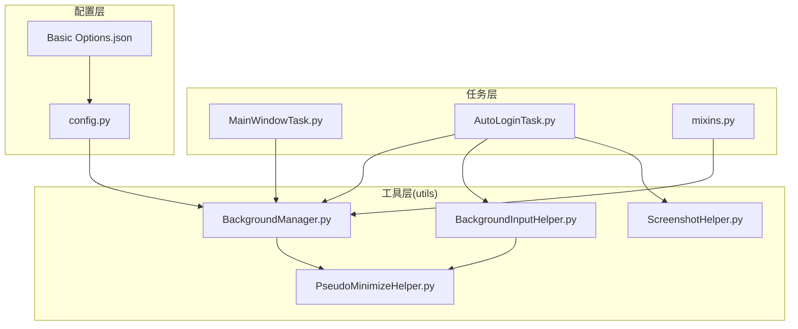
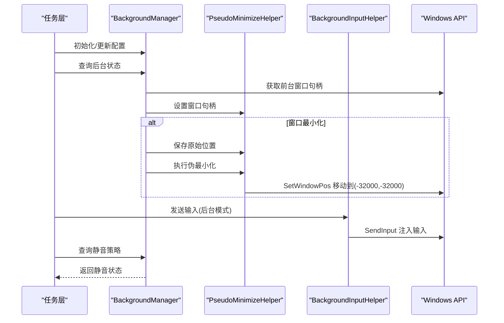
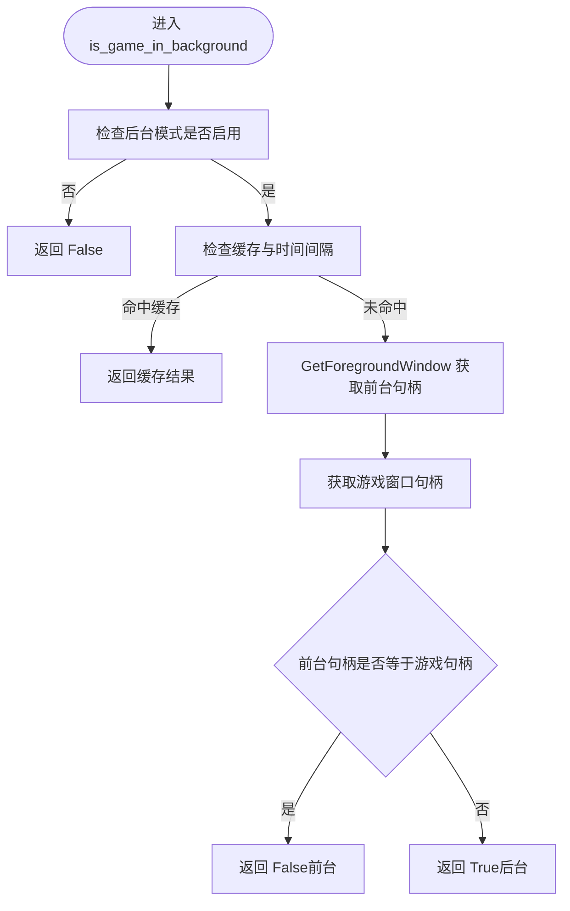
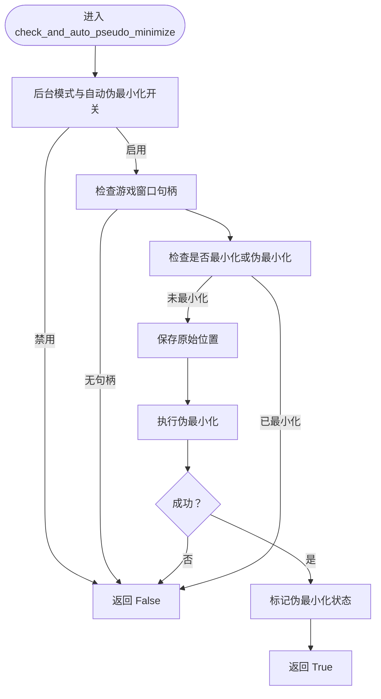
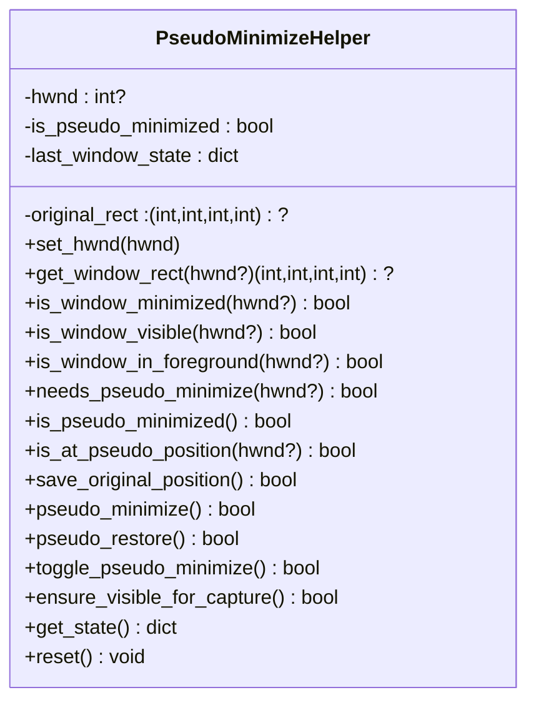
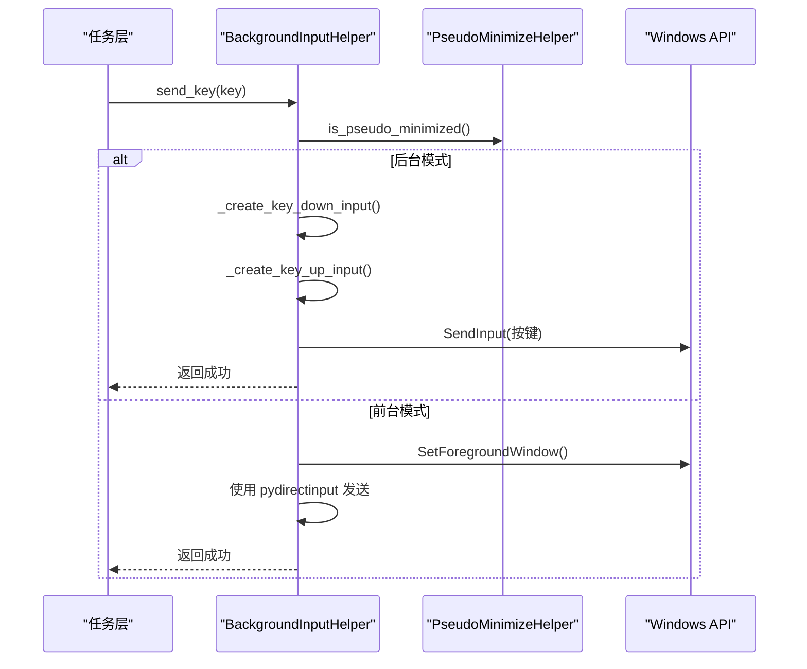
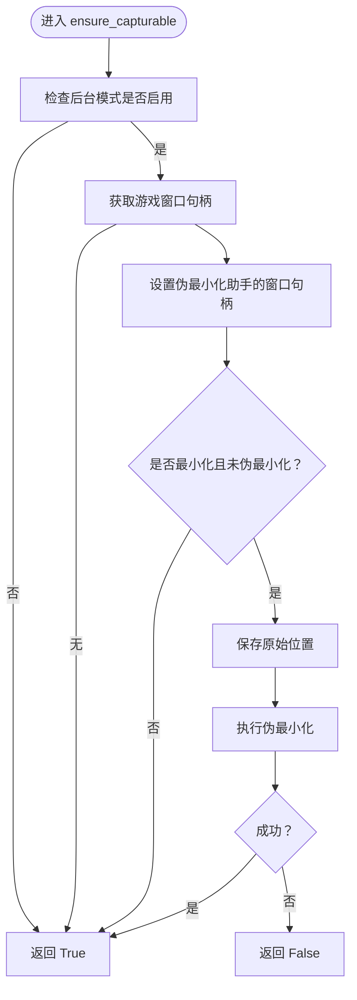
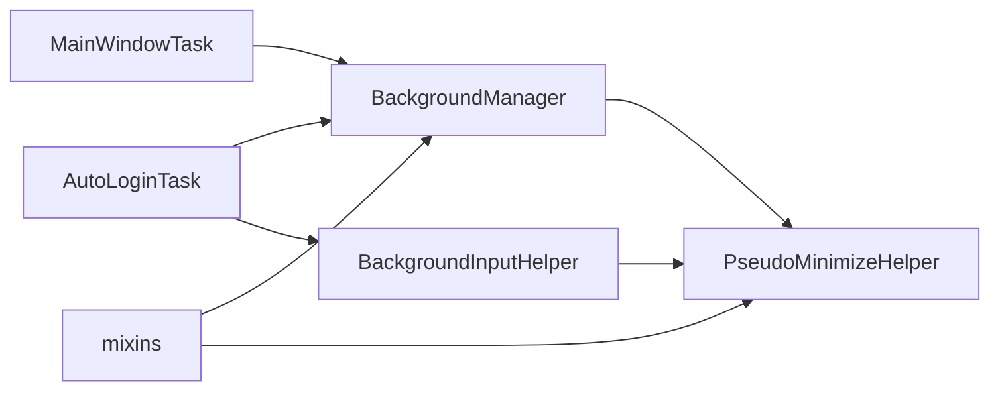

# 后台管理器

<cite>
**本文引用的文件**
- [BackgroundManager.py](file://src/utils/BackgroundManager.py)
- [PseudoMinimizeHelper.py](file://src/utils/PseudoMinimizeHelper.py)
- [BackgroundInputHelper.py](file://src/utils/BackgroundInputHelper.py)
- [ScreenshotHelper.py](file://src/utils/ScreenshotHelper.py)
- [config.py](file://config.py)
- [Basic Options.json](file://configs/Basic Options.json)
- [MainWindowTask.py](file://src/task/MainWindowTask.py)
- [mixins.py](file://src/task/mixins.py)
- [AutoLoginTask.py](file://src/task/AutoLoginTask.py)
</cite>

## 目录
1. [简介](#简介)
2. [项目结构](#项目结构)
3. [核心组件](#核心组件)
4. [架构总览](#架构总览)
5. [详细组件分析](#详细组件分析)
6. [依赖关系分析](#依赖关系分析)
7. [性能考量](#性能考量)
8. [故障排查指南](#故障排查指南)
9. [结论](#结论)
10. [附录](#附录)

## 简介
本文件面向“后台管理器”的综合技术文档，重点围绕 BackgroundManager 类如何实现程序的后台运行能力展开，涵盖以下主题：
- 伪最小化技术的实现原理与 Windows API 调用机制
- 后台截图支持的实现方式（窗口捕获与图像处理）
- 静音功能的实现思路（音频设备管理与系统声音控制）
- PseudoMinimizeHelper 辅助类的功能与其与主管理器的协作关系
- 后台模式下的性能优化建议与兼容性注意事项

## 项目结构
本项目采用分层与模块化组织，后台相关能力主要集中在 utils 子模块中，并通过任务层与配置层协同工作：
- utils 层：后台管理器、伪最小化助手、后台输入助手、截图助手
- task 层：任务逻辑中集成后台模式判断与截图前置处理
- config 层：全局配置与用户界面配置项，驱动后台行为

图表来源
- [BackgroundManager.py:1-155](file://src/utils/BackgroundManager.py#L1-L155)
- [PseudoMinimizeHelper.py:1-238](file://src/utils/PseudoMinimizeHelper.py#L1-L238)
- [BackgroundInputHelper.py:1-841](file://src/utils/BackgroundInputHelper.py#L1-L841)
- [ScreenshotHelper.py:1-68](file://src/utils/ScreenshotHelper.py#L1-L68)
- [config.py:40-149](file://config.py#L40-L149)
- [Basic Options.json:1-13](file://configs/Basic Options.json#L1-L13)
- [MainWindowTask.py:190-215](file://src/task/MainWindowTask.py#L190-L215)
- [mixins.py:266-344](file://src/task/mixins.py#L266-L344)
- [AutoLoginTask.py:150-571](file://src/task/AutoLoginTask.py#L150-L571)

章节来源
- [BackgroundManager.py:1-155](file://src/utils/BackgroundManager.py#L1-L155)
- [config.py:40-149](file://config.py#L40-L149)

## 核心组件
- BackgroundManager：负责后台模式开关、前台窗口检测、静音策略、伪最小化的协调与状态查询
- PseudoMinimizeHelper：负责窗口伪最小化/还原、位置保存与恢复、前台/最小化状态判断
- BackgroundInputHelper：负责在后台模式下使用 SendInput 发送输入，避免窗口切换前台
- ScreenshotHelper：负责截图保存与特征模板导出的基础能力

章节来源
- [BackgroundManager.py:7-155](file://src/utils/BackgroundManager.py#L7-L155)
- [PseudoMinimizeHelper.py:13-238](file://src/utils/PseudoMinimizeHelper.py#L13-L238)
- [BackgroundInputHelper.py:99-841](file://src/utils/BackgroundInputHelper.py#L99-L841)
- [ScreenshotHelper.py:7-68](file://src/utils/ScreenshotHelper.py#L7-L68)

## 架构总览
后台运行的整体流程如下：
- 任务层在初始化与循环中调用后台管理器进行状态判断与前置处理
- 当窗口被最小化或被遮挡时，通过伪最小化将窗口移至屏幕外，保证后台截图可用
- 在后台模式下，输入操作通过 SendInput 直接注入，避免激活窗口导致的前台切换
- 配置层提供后台模式、伪最小化、静音等开关项，驱动具体行为

图表来源
- [BackgroundManager.py:46-151](file://src/utils/BackgroundManager.py#L46-L151)
- [PseudoMinimizeHelper.py:123-193](file://src/utils/PseudoMinimizeHelper.py#L123-L193)
- [BackgroundInputHelper.py:177-206](file://src/utils/BackgroundInputHelper.py#L177-L206)

## 详细组件分析

### BackgroundManager 组件分析
- 职责与关键点
  - 后台模式开关与配置读取：从全局配置中读取“后台模式”“最小化时伪最小化”“后台时静音游戏”等选项
  - 前台窗口检测：通过 Windows API 获取前台窗口句柄并与游戏窗口句柄对比，判断是否在后台
  - 静音策略：根据配置与前台检测结果决定是否需要静音
  - 伪最小化协调：与 PseudoMinimizeHelper 协作，自动保存原始位置并在必要时执行伪最小化
  - 状态查询：提供完整后台状态字典，便于上层任务打印与日志记录

- 关键流程图（前台检测与静音策略）

图表来源
- [BackgroundManager.py:46-80](file://src/utils/BackgroundManager.py#L46-L80)

- 关键流程图（自动伪最小化）

图表来源
- [BackgroundManager.py:101-121](file://src/utils/BackgroundManager.py#L101-L121)
- [PseudoMinimizeHelper.py:123-159](file://src/utils/PseudoMinimizeHelper.py#L123-L159)

章节来源
- [BackgroundManager.py:7-155](file://src/utils/BackgroundManager.py#L7-L155)

### PseudoMinimizeHelper 组件分析
- 职责与关键点
  - 窗口状态判断：最小化、可见性、是否在前台
  - 伪最小化实现：将窗口移动到屏幕外(-32000, -32000)，同时保存原始尺寸与位置
  - 伪最小化还原：恢复窗口到原始位置与尺寸
  - 状态维护：跟踪是否伪最小化、原始矩形、上次窗口状态

- 类关系图

图表来源
- [PseudoMinimizeHelper.py:13-238](file://src/utils/PseudoMinimizeHelper.py#L13-L238)

章节来源
- [PseudoMinimizeHelper.py:13-238](file://src/utils/PseudoMinimizeHelper.py#L13-L238)

### BackgroundInputHelper 组件分析
- 职责与关键点
  - 输入模式：前台模式（激活窗口）、伪最小化模式（不激活窗口）、自动模式
  - SendInput 注入：在后台模式下使用 SendInput 发送键盘/鼠标事件，避免窗口切换
  - 窗口激活技巧：使用 AttachThreadInput 绕过限制，短暂激活窗口后再恢复焦点
  - 坐标转换：将窗口内坐标转换为屏幕绝对坐标，再转换为 SendInput 的归一化坐标

- 序列图（后台按键发送）

图表来源
- [BackgroundInputHelper.py:177-206](file://src/utils/BackgroundInputHelper.py#L177-L206)
- [BackgroundInputHelper.py:310-356](file://src/utils/BackgroundInputHelper.py#L310-L356)

章节来源
- [BackgroundInputHelper.py:99-841](file://src/utils/BackgroundInputHelper.py#L99-L841)

### 截图支持与图像处理
- 截图助手基础能力
  - 截图保存：自动创建目录、生成带时间戳的文件名、保存为 PNG
  - 特征模板导出：从帧中裁剪指定区域并保存为独立模板
  - COCO 格式标注辅助：生成图像条目与标注条目，便于训练与标注

- 与后台模式的协作
  - 任务层在截图前调用 ensure_capturable，确保窗口可截图
  - 当窗口最小化且未伪最小化时，先保存原始位置并执行伪最小化，再进行截图

- 流程图（确保可截图）

图表来源
- [mixins.py:305-342](file://src/task/mixins.py#L305-L342)
- [PseudoMinimizeHelper.py:123-159](file://src/utils/PseudoMinimizeHelper.py#L123-L159)

章节来源
- [ScreenshotHelper.py:7-68](file://src/utils/ScreenshotHelper.py#L7-L68)
- [mixins.py:305-342](file://src/task/mixins.py#L305-L342)

### 静音功能实现
- 配置来源
  - 全局配置 basic_config_option 中包含“后台时静音游戏”开关
  - 用户界面配置 Basic Options.json 中也提供对应选项

- 后台管理器策略
  - should_mute_game：结合配置与前台检测，决定是否应静音
  - set_muted：维护内部静音状态，供上层任务记录与展示

- 任务层应用
  - MainWindowTask 与 AutoLoginTask 在初始化时读取后台状态并输出日志
  - 当 should_mute 为真时，任务层可配合外部静音逻辑（例如通过系统音频设备管理或第三方库）执行静音

章节来源
- [config.py:40-66](file://config.py#L40-L66)
- [Basic Options.json:1-13](file://configs/Basic Options.json#L1-13)
- [BackgroundManager.py:77-95](file://src/utils/BackgroundManager.py#L77-L95)
- [MainWindowTask.py:194-195](file://src/task/MainWindowTask.py#L194-L195)

## 依赖关系分析
- 组件耦合
  - BackgroundManager 依赖 PseudoMinimizeHelper 完成窗口伪最小化与状态判断
  - BackgroundInputHelper 依赖 PseudoMinimizeHelper 判断后台模式
  - 任务层通过 BackgroundManager 与 PseudoMinimizeHelper 协同实现后台截图与输入
- 外部依赖
  - Windows API：GetForegroundWindow、SetWindowPos、ShowWindow、AttachThreadInput、SendInput 等
  - Python 库：win32gui、win32con、win32api、pydirectinput、opencv(cv2)

图表来源
- [BackgroundManager.py:1-155](file://src/utils/BackgroundManager.py#L1-L155)
- [PseudoMinimizeHelper.py:1-238](file://src/utils/PseudoMinimizeHelper.py#L1-L238)
- [BackgroundInputHelper.py:1-841](file://src/utils/BackgroundInputHelper.py#L1-L841)
- [mixins.py:266-344](file://src/task/mixins.py#L266-L344)
- [AutoLoginTask.py:150-571](file://src/task/AutoLoginTask.py#L150-L571)

章节来源
- [BackgroundManager.py:1-155](file://src/utils/BackgroundManager.py#L1-L155)
- [PseudoMinimizeHelper.py:1-238](file://src/utils/PseudoMinimizeHelper.py#L1-L238)
- [BackgroundInputHelper.py:1-841](file://src/utils/BackgroundInputHelper.py#L1-L841)
- [mixins.py:266-344](file://src/task/mixins.py#L266-L344)
- [AutoLoginTask.py:150-571](file://src/task/AutoLoginTask.py#L150-L571)

## 性能考量
- 后台模式下的性能优化建议
  - 增加触发间隔：通过配置项“触发间隔”增大任务触发频率，降低 CPU/GPU 占用
  - 减少截图频率：仅在必要时截图，避免高频全屏捕获
  - 伪最小化仅在最小化时执行：避免不必要的窗口移动与状态切换
  - 使用合适的捕获方法：根据游戏特性选择 WGC/BitBlt 等捕获方式，平衡质量与性能
- 兼容性注意事项
  - Unity 游戏需使用 SendInput 注入输入，避免使用 PostMessage
  - 窗口最小化时需先恢复再伪最小化，防止窗口状态异常
  - 静音策略需与系统音频设备管理配合，确保静音生效且不影响其他应用

[本节为通用指导，不直接分析具体文件]

## 故障排查指南
- 常见问题与定位
  - 无法检测到前台窗口：检查 Windows API 调用权限与句柄有效性
  - 伪最小化失败：确认窗口句柄正确、未处于伪最小化状态、保存原始位置成功
  - 输入无效：确认处于后台模式（伪最小化或后台遮挡），使用 SendInput 而非激活窗口
  - 截图失败：检查 ensure_capturable 是否在最小化时执行伪最小化，确认窗口尺寸与位置恢复
- 日志与状态
  - 任务层会输出后台模式状态与静音设置日志，便于快速定位问题
  - 可通过 get_background_status 获取完整状态字典，辅助诊断

章节来源
- [BackgroundManager.py:82-92](file://src/utils/BackgroundManager.py#L82-L92)
- [MainWindowTask.py:190-215](file://src/task/MainWindowTask.py#L190-L215)
- [mixins.py:305-342](file://src/task/mixins.py#L305-L342)

## 结论
本后台管理器通过“伪最小化 + SendInput + 前台检测 + 配置驱动”的组合，实现了在窗口最小化或被遮挡时仍可稳定运行与截图的能力。PseudoMinimizeHelper 提供了可靠的窗口状态管理与位置保存/恢复，BackgroundManager 则将这些能力整合为可配置的后台模式策略。配合任务层的前置处理与日志输出，整体方案具备良好的稳定性与可维护性。

[本节为总结性内容，不直接分析具体文件]

## 附录
- 配置项说明
  - 后台模式：启用后允许窗口最小化或被遮挡时继续运行
  - 最小化时伪最小化：窗口最小化时自动移到屏幕外，支持后台截图
  - 后台时静音游戏：游戏窗口在后台时自动静音
- 相关文件路径
  - [BackgroundManager.py](file://src/utils/BackgroundManager.py)
  - [PseudoMinimizeHelper.py](file://src/utils/PseudoMinimizeHelper.py)
  - [BackgroundInputHelper.py](file://src/utils/BackgroundInputHelper.py)
  - [ScreenshotHelper.py](file://src/utils/ScreenshotHelper.py)
  - [config.py](file://config.py)
  - [Basic Options.json](file://configs/Basic Options.json)
  - [MainWindowTask.py](file://src/task/MainWindowTask.py)
  - [mixins.py](file://src/task/mixins.py)
  - [AutoLoginTask.py](file://src/task/AutoLoginTask.py)

[本节为补充信息，不直接分析具体文件]