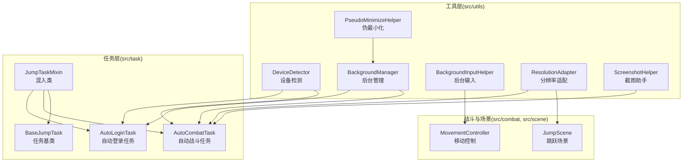
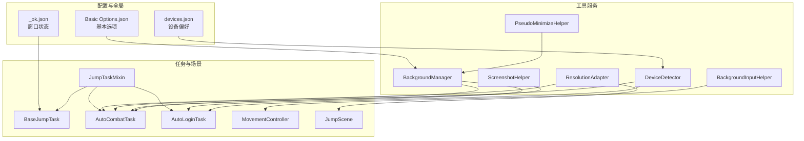
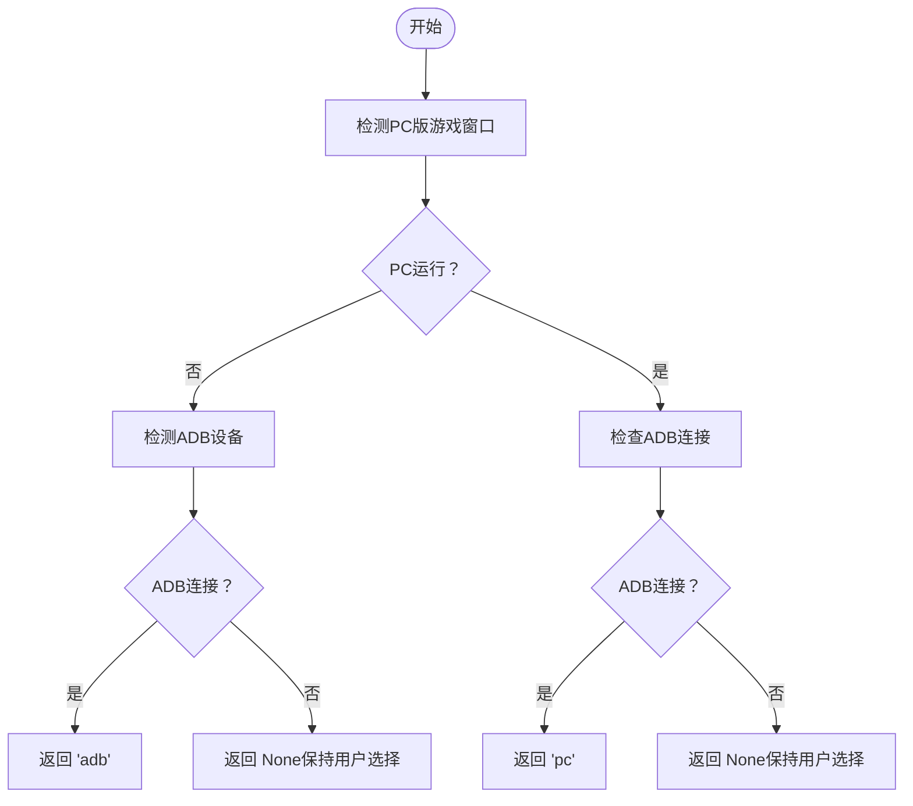
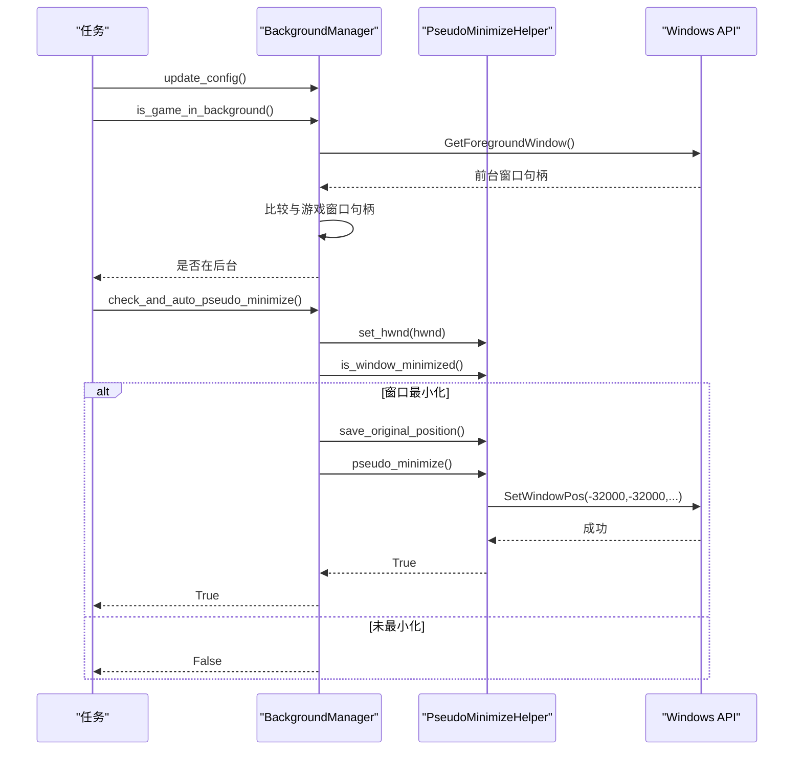
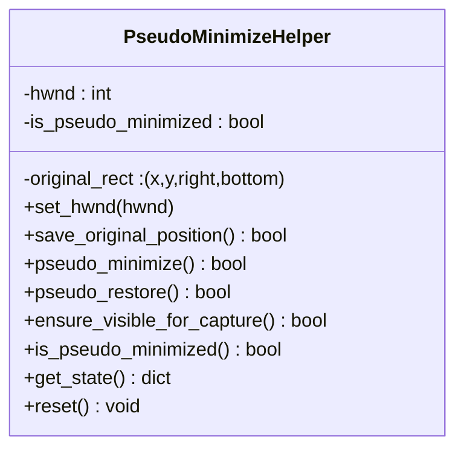
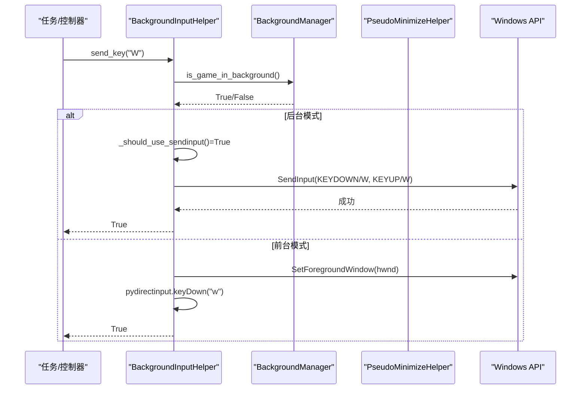
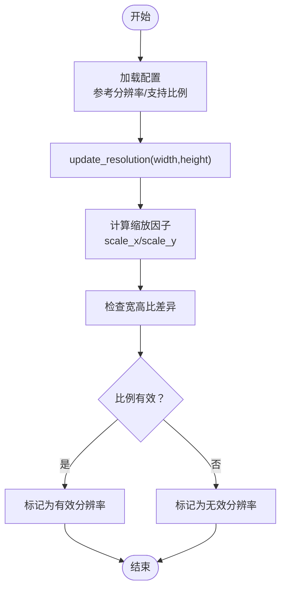
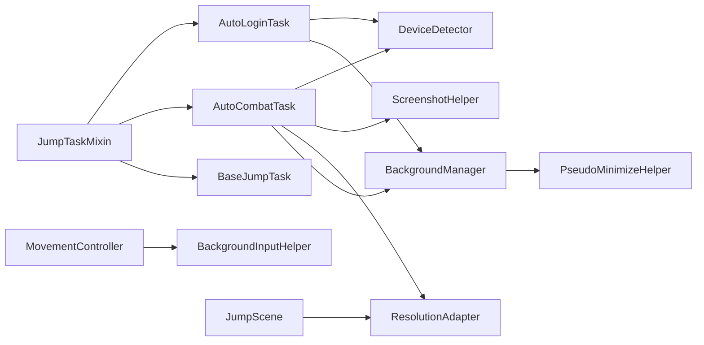

# 工具系统

<cite>
**本文档引用的文件**
- [DeviceDetector.py](file://src/utils/DeviceDetector.py)
- [BackgroundManager.py](file://src/utils/BackgroundManager.py)
- [PseudoMinimizeHelper.py](file://src/utils/PseudoMinimizeHelper.py)
- [BackgroundInputHelper.py](file://src/utils/BackgroundInputHelper.py)
- [ResolutionAdapter.py](file://src/utils/ResolutionAdapter.py)
- [ScreenshotHelper.py](file://src/utils/ScreenshotHelper.py)
- [__init__.py](file://src/utils/__init__.py)
- [AutoCombatTask.py](file://src/task/AutoCombatTask.py)
- [AutoLoginTask.py](file://src/task/AutoLoginTask.py)
- [movement_controller.py](file://src/combat/movement_controller.py)
- [JumpScene.py](file://src/scene/JumpScene.py)
- [BaseJumpTask.py](file://src/task/BaseJumpTask.py)
- [mixins.py](file://src/task/mixins.py)
- [devices.json](file://configs/devices.json)
- [Basic Options.json](file://configs/Basic Options.json)
- [_ok.json](file://configs/_ok.json)
</cite>

## 目录
1. [简介](#简介)
2. [项目结构](#项目结构)
3. [核心组件](#核心组件)
4. [架构总览](#架构总览)
5. [详细组件分析](#详细组件分析)
6. [依赖关系分析](#依赖关系分析)
7. [性能考量](#性能考量)
8. [故障排查指南](#故障排查指南)
9. [结论](#结论)
10. [附录](#附录)

## 简介
本文件系统性梳理OK-Jump工具系统的实现与协作关系，重点覆盖以下方面：
- 设备检测器：支持PC版与Android模拟器的智能切换与默认设备选择
- 后台管理器：伪最小化、后台截图与静音策略
- 分辨率适配器：多分辨率支持与坐标缩放
- 截图助手：本地截图与特征模板保存
- 输入助手：面向Unity游戏的后台输入支持（SendInput）
- 工具类协作与扩展机制：在任务层的集成与配置驱动

## 项目结构
工具系统位于src/utils目录，提供跨任务复用的基础设施能力，并通过任务层（src/task）与战斗场景（src/combat、src/scene）进行集成。

**图表来源**
- [DeviceDetector.py:11-149](file://src/utils/DeviceDetector.py#L11-L149)
- [BackgroundManager.py:7-155](file://src/utils/BackgroundManager.py#L7-L155)
- [PseudoMinimizeHelper.py:13-238](file://src/utils/PseudoMinimizeHelper.py#L13-L238)
- [BackgroundInputHelper.py:99-841](file://src/utils/BackgroundInputHelper.py#L99-L841)
- [ResolutionAdapter.py:4-163](file://src/utils/ResolutionAdapter.py#L4-L163)
- [ScreenshotHelper.py:7-68](file://src/utils/ScreenshotHelper.py#L7-L68)
- [AutoCombatTask.py:32-135](file://src/task/AutoCombatTask.py#L32-L135)
- [AutoLoginTask.py:155-180](file://src/task/AutoLoginTask.py#L155-L180)
- [movement_controller.py:24-200](file://src/combat/movement_controller.py#L24-L200)
- [JumpScene.py:33-208](file://src/scene/JumpScene.py#L33-L208)
- [BaseJumpTask.py:14-41](file://src/task/BaseJumpTask.py#L14-L41)
- [mixins.py:15-44](file://src/task/mixins.py#L15-L44)

**章节来源**
- [__init__.py:1-6](file://src/utils/__init__.py#L1-L6)

## 核心组件
- 设备检测器：基于窗口标题关键词与ADB设备列表，智能判定当前运行环境并给出默认设备选择建议
- 后台管理器：检测前台窗口变化、控制静音策略、驱动伪最小化与可见性保障
- 伪最小化助手：将窗口移至屏幕外但仍保持“活动窗口”状态，支持保存/恢复原始位置
- 后台输入助手：在Unity游戏等场景下，通过SendInput实现后台可靠输入；在前台模式下回退到pydirectinput
- 分辨率适配器：依据参考分辨率与支持宽高比，提供坐标缩放、相对坐标转换与推荐重设尺寸
- 截图助手：统一管理截图存储、特征模板提取与COCO标注条目生成

**章节来源**
- [DeviceDetector.py:11-149](file://src/utils/DeviceDetector.py#L11-L149)
- [BackgroundManager.py:7-155](file://src/utils/BackgroundManager.py#L7-L155)
- [PseudoMinimizeHelper.py:13-238](file://src/utils/PseudoMinimizeHelper.py#L13-L238)
- [BackgroundInputHelper.py:99-841](file://src/utils/BackgroundInputHelper.py#L99-L841)
- [ResolutionAdapter.py:4-163](file://src/utils/ResolutionAdapter.py#L4-L163)
- [ScreenshotHelper.py:7-68](file://src/utils/ScreenshotHelper.py#L7-L68)

## 架构总览
工具系统采用“基础设施服务 + 任务集成”的分层设计。任务层通过混入类共享通用能力，战斗与场景模块在运行期动态调用工具类完成输入、截图与适配。

**图表来源**
- [Basic Options.json:1-13](file://configs/Basic Options.json#L1-L13)
- [devices.json:1-7](file://configs/devices.json#L1-L7)
- [_ok.json:1-7](file://configs/_ok.json#L1-L7)
- [mixins.py:15-44](file://src/task/mixins.py#L15-L44)
- [BaseJumpTask.py:14-41](file://src/task/BaseJumpTask.py#L14-L41)
- [AutoCombatTask.py:32-135](file://src/task/AutoCombatTask.py#L32-L135)
- [AutoLoginTask.py:155-180](file://src/task/AutoLoginTask.py#L155-L180)
- [movement_controller.py:24-200](file://src/combat/movement_controller.py#L24-L200)
- [JumpScene.py:33-208](file://src/scene/JumpScene.py#L33-L208)

## 详细组件分析

### 设备检测器（DeviceDetector）
- 功能要点
  - PC版检测：通过枚举窗口标题，匹配游戏关键词并排除模拟器与工具自身窗口
  - ADB检测：优先使用adbutils包，回退到系统adb命令解析设备列表
  - 智能默认：根据“PC运行/ADB连接”状态返回'pc'、'adb'或None（保持用户选择）
  - 状态查询：返回PC运行、ADB连接与智能默认的聚合状态字典
- 关键行为
  - 窗口枚举回调中过滤模拟器与工具窗口，保留符合游戏关键词的PC窗口
  - ADB设备列表解析时仅统计状态为'device'的设备
  - 默认策略：仅当一方存在另一方不存在时才自动选择，否则交由用户决定

**图表来源**
- [DeviceDetector.py:28-134](file://src/utils/DeviceDetector.py#L28-L134)

**章节来源**
- [DeviceDetector.py:11-149](file://src/utils/DeviceDetector.py#L11-L149)
- [devices.json:1-7](file://configs/devices.json#L1-L7)

### 后台管理器（BackgroundManager）
- 功能要点
  - 配置加载：从OK框架配置中读取“后台模式”“最小化时伪最小化”“后台时静音游戏”等选项
  - 前台检测：通过GetForegroundWindow对比游戏窗口句柄判断是否在后台
  - 静音策略：在后台且配置允许时触发静音
  - 伪最小化：在窗口最小化时保存原始位置并将其移至屏幕外，便于后台截图
  - 可见性保障：确保窗口在需要截图时处于可见状态
- 关键行为
  - 缓存前台窗口检测结果，降低频繁调用开销
  - 与伪最小化助手协同，维护最小化状态与恢复逻辑
  - 对外暴露状态查询接口，便于UI与日志展示

**图表来源**
- [BackgroundManager.py:46-121](file://src/utils/BackgroundManager.py#L46-L121)
- [PseudoMinimizeHelper.py:123-163](file://src/utils/PseudoMinimizeHelper.py#L123-L163)

**章节来源**
- [BackgroundManager.py:7-155](file://src/utils/BackgroundManager.py#L7-L155)
- [Basic Options.json:1-13](file://configs/Basic Options.json#L1-L13)

### 伪最小化助手（PseudoMinimizeHelper）
- 功能要点
  - 伪最小化：将窗口移动到(-32000, -32000)附近，仍保持活动窗口状态
  - 位置保存与恢复：在伪最小化前保存原始矩形，恢复时还原
  - 状态查询：最小化、可见性、前台、是否处于伪位置等
  - 自动可见性保障：若窗口最小化则先执行伪最小化
- 关键行为
  - 伪最小化前后均校验窗口状态，避免重复操作
  - 恢复时优先使用保存的原始矩形，保证位置正确

**图表来源**
- [PseudoMinimizeHelper.py:13-238](file://src/utils/PseudoMinimizeHelper.py#L13-L238)

**章节来源**
- [PseudoMinimizeHelper.py:13-238](file://src/utils/PseudoMinimizeHelper.py#L13-L238)

### 后台输入助手（BackgroundInputHelper）
- 功能要点
  - 模式选择：前台模式（激活窗口）、伪最小化模式（窗口移出屏幕外）、自动模式（根据后台状态选择）
  - Unity兼容：在后台使用SendInput发送按键/鼠标事件，避免DirectInput/RawInput无法识别的问题
  - 前台回退：在前台模式下使用pydirectinput，简化实现
  - 坐标转换：将窗口内坐标转换为屏幕绝对坐标，再转换为SendInput所需的归一化坐标
  - 鼠标拖拽：支持分步移动实现平滑拖拽
- 关键行为
  - 判断是否处于后台（伪最小化或窗口非前台）以决定输入路径
  - 在前台模式下短暂激活窗口，结束后可选择恢复焦点

**图表来源**
- [BackgroundInputHelper.py:177-207](file://src/utils/BackgroundInputHelper.py#L177-L207)
- [BackgroundManager.py:46-75](file://src/utils/BackgroundManager.py#L46-L75)

**章节来源**
- [BackgroundInputHelper.py:99-841](file://src/utils/BackgroundInputHelper.py#L99-L841)
- [movement_controller.py:72-82](file://src/combat/movement_controller.py#L72-L82)

### 分辨率适配器（ResolutionAdapter）
- 功能要点
  - 参考分辨率与支持宽高比：从配置读取参考分辨率与支持比例
  - 坐标缩放：提供x/y轴独立缩放与整体box缩放
  - 相对坐标：在当前分辨率下进行相对坐标与绝对坐标的互转
  - 比例校验：判断当前比例与支持比例的差异是否在容差范围内
  - 推荐重设：根据当前分辨率给出推荐重设尺寸
- 关键行为
  - 初始化时加载配置，后续update_resolution刷新当前分辨率并计算缩放因子
  - is_valid_resolution用于快速判断是否满足支持比例

**图表来源**
- [ResolutionAdapter.py:19-120](file://src/utils/ResolutionAdapter.py#L19-L120)

**章节来源**
- [ResolutionAdapter.py:4-163](file://src/utils/ResolutionAdapter.py#L4-L163)
- [JumpScene.py:33-208](file://src/scene/JumpScene.py#L33-L208)

### 截图助手（ScreenshotHelper）
- 功能要点
  - 统一截图保存：自动创建目录、按时间戳命名、确保.png格式
  - 特征模板提取：从帧中裁剪指定区域并保存到features子目录
  - COCO标注条目：生成图像与标注的标准条目结构，便于数据集构建
- 关键行为
  - 保存截图时自动补全文件扩展名
  - 特征模板保存在独立目录，便于后续训练与识别

**章节来源**
- [ScreenshotHelper.py:7-68](file://src/utils/ScreenshotHelper.py#L7-L68)

## 依赖关系分析
- 模块耦合
  - 任务层通过混入类共享工具能力，降低重复代码
  - 后台管理器依赖伪最小化助手与OK框架配置
  - 后台输入助手依赖后台管理器与伪最小化助手，实现输入路径选择
  - 分辨率适配器被场景与任务广泛使用，提供坐标转换与比例校验
- 外部依赖
  - Windows API（user32、win32gui等）用于窗口与输入操作
  - OpenCV（cv2）用于截图保存
  - adbutils（可选）用于ADB设备检测
  - pydirectinput（前台模式）用于前台输入

**图表来源**
- [mixins.py:15-44](file://src/task/mixins.py#L15-L44)
- [BaseJumpTask.py:14-41](file://src/task/BaseJumpTask.py#L14-L41)
- [AutoCombatTask.py:32-135](file://src/task/AutoCombatTask.py#L32-L135)
- [AutoLoginTask.py:155-180](file://src/task/AutoLoginTask.py#L155-L180)
- [movement_controller.py:24-200](file://src/combat/movement_controller.py#L24-L200)
- [JumpScene.py:33-208](file://src/scene/JumpScene.py#L33-L208)
- [BackgroundManager.py:7-155](file://src/utils/BackgroundManager.py#L7-L155)
- [PseudoMinimizeHelper.py:13-238](file://src/utils/PseudoMinimizeHelper.py#L13-L238)
- [BackgroundInputHelper.py:99-841](file://src/utils/BackgroundInputHelper.py#L99-L841)
- [ResolutionAdapter.py:4-163](file://src/utils/ResolutionAdapter.py#L4-L163)
- [ScreenshotHelper.py:7-68](file://src/utils/ScreenshotHelper.py#L7-L68)
- [DeviceDetector.py:11-149](file://src/utils/DeviceDetector.py#L11-L149)

**章节来源**
- [__init__.py:1-6](file://src/utils/__init__.py#L1-L6)

## 性能考量
- 后台检测缓存：后台管理器对前台窗口检测结果进行缓存，减少频繁调用带来的开销
- 坐标转换优化：分辨率适配器在初始化时加载配置并计算缩放因子，后续仅做乘法与整型转换
- 输入路径选择：后台输入助手根据后台状态选择SendInput或pydirectinput，避免不必要的窗口激活
- 截图写入：统一目录与命名策略，减少IO开销与文件冲突

## 故障排查指南
- 设备检测异常
  - 现象：无法识别PC版或模拟器
  - 排查：确认窗口标题关键词与排除关键词配置；检查ADB是否安装并可访问
  - 参考
    - [DeviceDetector.py:28-110](file://src/utils/DeviceDetector.py#L28-L110)
    - [devices.json:1-7](file://configs/devices.json#L1-L7)
- 后台输入失效
  - 现象：后台无法按键或鼠标操作
  - 排查：确认后台管理器处于后台模式；检查伪最小化是否成功；必要时切换到前台模式
  - 参考
    - [BackgroundManager.py:46-121](file://src/utils/BackgroundManager.py#L46-L121)
    - [BackgroundInputHelper.py:177-207](file://src/utils/BackgroundInputHelper.py#L177-L207)
- 分辨率不匹配
  - 现象：坐标偏移或点击不准确
  - 排查：确认参考分辨率与支持比例配置；检查update_resolution调用；查看比例校验结果
  - 参考
    - [ResolutionAdapter.py:19-120](file://src/utils/ResolutionAdapter.py#L19-L120)
    - [JumpScene.py:33-208](file://src/scene/JumpScene.py#L33-L208)
- 截图保存失败
  - 现象：截图未生成或路径错误
  - 排查：确认截图目录权限；检查文件名扩展名；查看OpenCV写入是否成功
  - 参考
    - [ScreenshotHelper.py:17-30](file://src/utils/ScreenshotHelper.py#L17-L30)

**章节来源**
- [DeviceDetector.py:28-110](file://src/utils/DeviceDetector.py#L28-L110)
- [BackgroundManager.py:46-121](file://src/utils/BackgroundManager.py#L46-L121)
- [BackgroundInputHelper.py:177-207](file://src/utils/BackgroundInputHelper.py#L177-L207)
- [ResolutionAdapter.py:19-120](file://src/utils/ResolutionAdapter.py#L19-L120)
- [JumpScene.py:33-208](file://src/scene/JumpScene.py#L33-L208)
- [ScreenshotHelper.py:17-30](file://src/utils/ScreenshotHelper.py#L17-L30)

## 结论
OK-Jump工具系统通过模块化的基础设施服务，实现了对PC版与Android模拟器的智能设备选择、可靠的后台输入、灵活的分辨率适配以及便捷的截图与特征管理。任务层通过混入类共享这些能力，形成高内聚、低耦合的协作模式。配置驱动的设计使得工具行为可按需调整，具备良好的扩展性与可维护性。

## 附录
- 配置文件说明
  - devices.json：设备偏好与默认捕获方式
  - Basic Options.json：后台模式、静音、自动重设窗口等基本选项
  - _ok.json：窗口位置与大小等状态
- 工具类导出
  - utils/__init__.py统一导出核心工具实例，便于任务层直接导入使用

**章节来源**
- [devices.json:1-7](file://configs/devices.json#L1-L7)
- [Basic Options.json:1-13](file://configs/Basic Options.json#L1-L13)
- [_ok.json:1-7](file://configs/_ok.json#L1-L7)
- [__init__.py:1-6](file://src/utils/__init__.py#L1-L6)