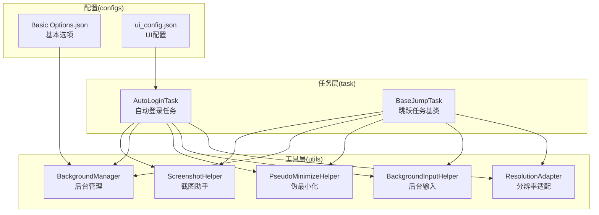
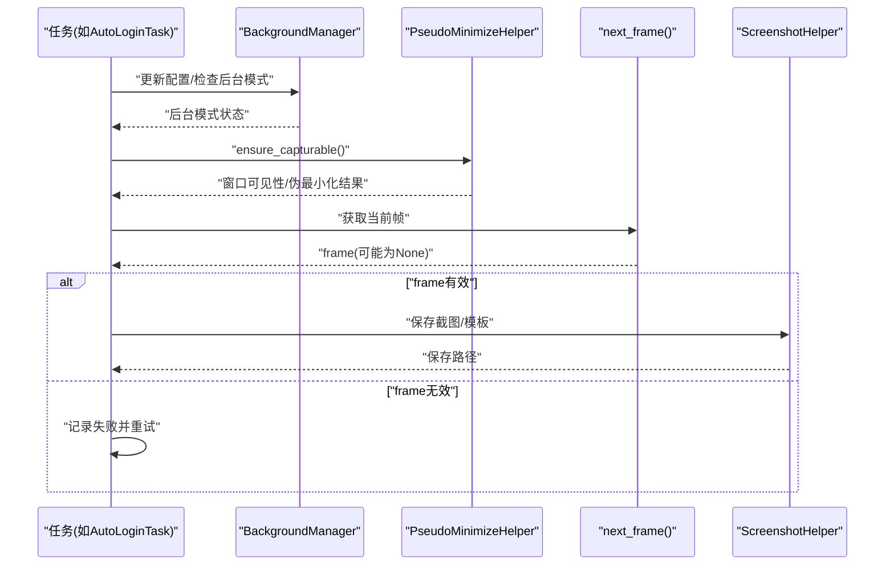
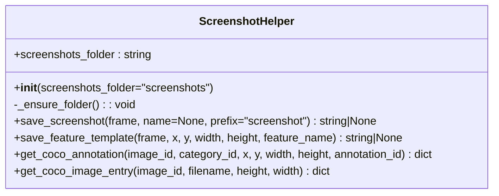
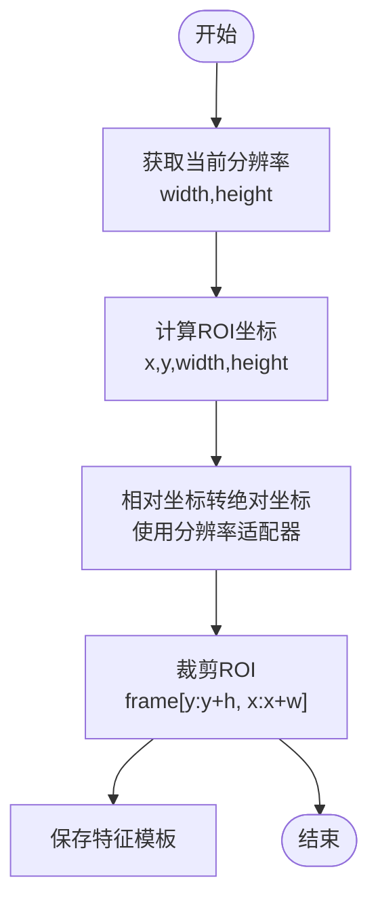
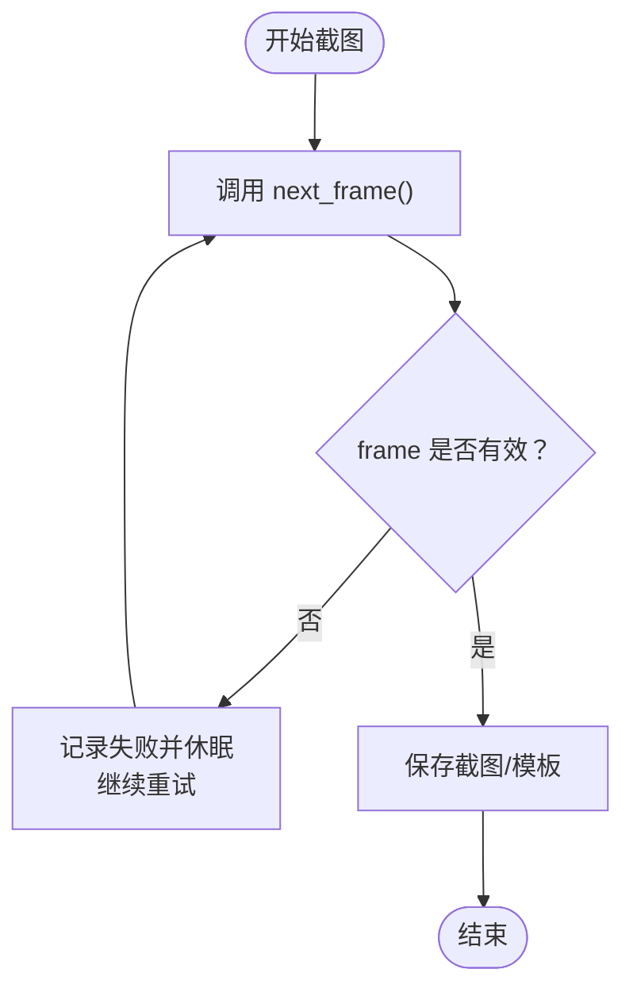
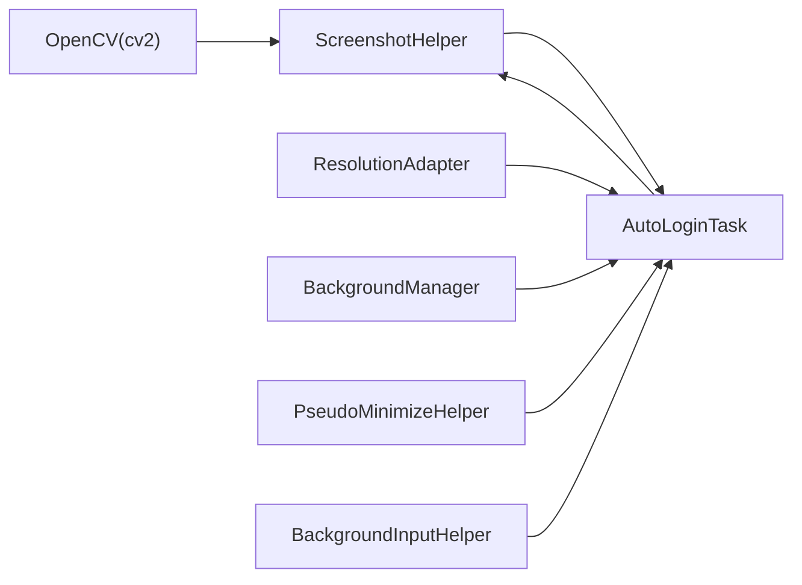

# 截图助手

<cite>
**本文档引用的文件**
- [ScreenshotHelper.py](file://src/utils/ScreenshotHelper.py)
- [AutoLoginTask.py](file://src/task/AutoLoginTask.py)
- [BaseJumpTask.py](file://src/task/BaseJumpTask.py)
- [BackgroundManager.py](file://src/utils/BackgroundManager.py)
- [PseudoMinimizeHelper.py](file://src/utils/PseudoMinimizeHelper.py)
- [BackgroundInputHelper.py](file://src/utils/BackgroundInputHelper.py)
- [ResolutionAdapter.py](file://src/utils/ResolutionAdapter.py)
- [Basic Options.json](file://configs/Basic Options.json)
- [ui_config.json](file://configs/ui_config.json)
- [globals.py](file://src/globals.py)
</cite>

## 目录
1. [简介](#简介)
2. [项目结构](#项目结构)
3. [核心组件](#核心组件)
4. [架构总览](#架构总览)
5. [详细组件分析](#详细组件分析)
6. [依赖关系分析](#依赖关系分析)
7. [性能考虑](#性能考虑)
8. [故障排查指南](#故障排查指南)
9. [结论](#结论)
10. [附录](#附录)

## 简介
本文件围绕截图助手展开，重点解释 ScreenshotHelper 类的截图功能实现，涵盖以下方面：
- OpenCV 图像处理技术的应用：图像写入、ROI（感兴趣区域）裁剪与模板保存
- 截图区域选择机制与 ROI 处理：基于相对坐标与绝对坐标的转换
- 截图缓存策略与内存管理优化：OCR 缓存与错误截图保存
- 不同场景下的截图参数配置与性能调优建议
- 截图失败的错误处理与重试机制

## 项目结构
与截图相关的模块主要分布在 utils 与 task 两个子包中：
- utils：提供通用工具，包括截图助手、后台管理、伪最小化、分辨率适配、输入辅助等
- task：提供业务任务，包含自动登录任务等，这些任务在运行过程中会频繁调用截图与图像处理能力

**图表来源**
- [ScreenshotHelper.py:1-68](file://src/utils/ScreenshotHelper.py#L1-L68)
- [AutoLoginTask.py:546-571](file://src/task/AutoLoginTask.py#L546-L571)
- [BaseJumpTask.py:61-71](file://src/task/BaseJumpTask.py#L61-L71)
- [BackgroundManager.py:1-155](file://src/utils/BackgroundManager.py#L1-L155)
- [PseudoMinimizeHelper.py:52-223](file://src/utils/PseudoMinimizeHelper.py#L52-L223)
- [BackgroundInputHelper.py:1-800](file://src/utils/BackgroundInputHelper.py#L1-L800)
- [ResolutionAdapter.py:42-162](file://src/utils/ResolutionAdapter.py#L42-L162)
- [Basic Options.json:1-13](file://configs/Basic Options.json#L1-L13)
- [ui_config.json:1-17](file://configs/ui_config.json#L1-L17)

**章节来源**
- [ScreenshotHelper.py:1-68](file://src/utils/ScreenshotHelper.py#L1-L68)
- [AutoLoginTask.py:546-571](file://src/task/AutoLoginTask.py#L546-L571)
- [BaseJumpTask.py:61-71](file://src/task/BaseJumpTask.py#L61-L71)
- [BackgroundManager.py:1-155](file://src/utils/BackgroundManager.py#L1-L155)
- [PseudoMinimizeHelper.py:52-223](file://src/utils/PseudoMinimizeHelper.py#L52-L223)
- [BackgroundInputHelper.py:1-800](file://src/utils/BackgroundInputHelper.py#L1-L800)
- [ResolutionAdapter.py:42-162](file://src/utils/ResolutionAdapter.py#L42-L162)
- [Basic Options.json:1-13](file://configs/Basic Options.json#L1-L13)
- [ui_config.json:1-17](file://configs/ui_config.json#L1-L17)

## 核心组件
- ScreenshotHelper：负责截图保存、特征模板保存、以及 COCO 数据集条目生成
- AutoLoginTask：在登录流程中进行截图、加载百分比检测、错误截图保存与重试
- BaseJumpTask：提供基础截图能力与后台点击支持
- BackgroundManager/PseudoMinimizeHelper：保证窗口在后台或最小化状态下仍可截图
- BackgroundInputHelper：在后台模式下使用 SendInput 发送输入事件
- ResolutionAdapter：提供分辨率缩放与相对坐标转换，间接影响 ROI 计算

**章节来源**
- [ScreenshotHelper.py:7-68](file://src/utils/ScreenshotHelper.py#L7-L68)
- [AutoLoginTask.py:324-397](file://src/task/AutoLoginTask.py#L324-L397)
- [BaseJumpTask.py:61-71](file://src/task/BaseJumpTask.py#L61-L71)
- [BackgroundManager.py:18-155](file://src/utils/BackgroundManager.py#L18-L155)
- [PseudoMinimizeHelper.py:52-223](file://src/utils/PseudoMinimizeHelper.py#L52-L223)
- [BackgroundInputHelper.py:199-207](file://src/utils/BackgroundInputHelper.py#L199-L207)
- [ResolutionAdapter.py:42-93](file://src/utils/ResolutionAdapter.py#L42-L93)

## 架构总览
截图流程在不同任务中遵循统一的模式：确保窗口可截图 → 截取当前帧 → 处理/保存 → 缓存/重试。

**图表来源**
- [AutoLoginTask.py:546-571](file://src/task/AutoLoginTask.py#L546-L571)
- [BackgroundManager.py:18-155](file://src/utils/BackgroundManager.py#L18-L155)
- [PseudoMinimizeHelper.py:211-218](file://src/utils/PseudoMinimizeHelper.py#L211-L218)
- [ScreenshotHelper.py:17-30](file://src/utils/ScreenshotHelper.py#L17-L30)

## 详细组件分析

### ScreenshotHelper 类详解
- 功能职责
  - 保存截图：将 numpy 数组写入 PNG 文件，默认命名含时间戳
  - 保存特征模板：从源图像中裁剪 ROI 并保存为模板文件
  - COCO 数据导出辅助：生成图像条目与标注条目字典
- 关键点
  - 输入校验：若输入帧为空，直接返回 None
  - 文件命名：默认以“前缀_时间戳.png”，确保扩展名为 .png
  - 目录管理：自动创建截图目录与 features 子目录
  - OpenCV 写入：使用 cv2.imwrite 执行图像持久化

**图表来源**
- [ScreenshotHelper.py:7-68](file://src/utils/ScreenshotHelper.py#L7-L68)

**章节来源**
- [ScreenshotHelper.py:17-44](file://src/utils/ScreenshotHelper.py#L17-L44)
- [ScreenshotHelper.py:46-64](file://src/utils/ScreenshotHelper.py#L46-L64)

### ROI（感兴趣区域）处理与截图区域选择
- ROI 选择机制
  - 基于相对坐标：通过分辨率适配器将相对坐标转换为绝对像素坐标
  - 绝对坐标裁剪：使用 numpy 切片进行 ROI 提取
- 示例场景
  - 右下角 1/4 区域：用于加载百分比检测
  - 特征模板：从 ROI 中提取特征模板并保存

**图表来源**
- [AutoLoginTask.py:337-368](file://src/task/AutoLoginTask.py#L337-L368)
- [ResolutionAdapter.py:84-93](file://src/utils/ResolutionAdapter.py#L84-L93)

**章节来源**
- [AutoLoginTask.py:337-368](file://src/task/AutoLoginTask.py#L337-L368)
- [ResolutionAdapter.py:84-93](file://src/utils/ResolutionAdapter.py#L84-L93)

### 截图缓存策略与内存管理优化
- OCR 缓存
  - 缓存键：任务内部使用缓存键存储 OCR 结果
  - TTL 控制：默认 1 秒，避免重复 OCR
  - 清理策略：每次新截图后清空 OCR 缓存，确保检测一致性
- 错误截图保存
  - 登录失败时保存错误截图，文件名包含错误类型与序号
  - 便于问题定位与回归测试
- 内存管理
  - 任务结束后重置登录状态，清理 OCR 缓存与错误计数
  - 全局资源管理器提供 YOLO 模型的延迟加载与手动重置，减少常驻内存占用

**章节来源**
- [AutoLoginTask.py:308-321](file://src/task/AutoLoginTask.py#L308-L321)
- [AutoLoginTask.py:570](file://src/task/AutoLoginTask.py#L570)
- [AutoLoginTask.py:1686-1700](file://src/task/AutoLoginTask.py#L1686-L1700)
- [AutoLoginTask.py:1714-1721](file://src/task/AutoLoginTask.py#L1714-L1721)
- [globals.py:204-257](file://src/globals.py#L204-L257)

### OpenCV 图像处理技术应用
- 图像写入
  - 使用 cv2.imwrite 将 numpy 数组写入 PNG 文件
  - 默认保存为 PNG，确保无损压缩
- ROI 裁剪
  - 使用 numpy 数组切片进行区域裁剪
  - 适用于特征模板提取与局部 OCR 检测
- 质量优化建议
  - 保持输入图像为 BGR 格式（OpenCV 默认）
  - 对高分辨率图像可先缩放再处理，降低后续 OCR 与检测成本
  - 对 ROI 区域进行二值化或形态学预处理可提升 OCR 准确率（视具体场景）

**章节来源**
- [ScreenshotHelper.py:29](file://src/utils/ScreenshotHelper.py#L29)
- [AutoLoginTask.py:368](file://src/task/AutoLoginTask.py#L368)

### 截图失败的错误处理与重试机制
- 失败判定
  - frame 为 None 时视为截图失败
- 重试策略
  - 短暂休眠后继续重试，直到超时或成功
- 日志记录
  - 记录截图成功/失败、分辨率信息、后台模式状态
- 错误截图
  - 登录停滞等异常情况保存错误截图，便于分析

**图表来源**
- [AutoLoginTask.py:558-568](file://src/task/AutoLoginTask.py#L558-L568)

**章节来源**
- [AutoLoginTask.py:558-568](file://src/task/AutoLoginTask.py#L558-L568)
- [AutoLoginTask.py:1686-1700](file://src/task/AutoLoginTask.py#L1686-L1700)

## 依赖关系分析
- 截图助手依赖 OpenCV 进行图像写入
- 自动登录任务依赖截图助手进行截图与模板保存，并结合后台管理与伪最小化确保截图可用
- 分辨率适配器提供相对坐标到绝对坐标的转换，支撑 ROI 计算
- 后台输入辅助在后台模式下使用 SendInput 发送输入，与截图流程相互独立但共同保障自动化稳定性

**图表来源**
- [ScreenshotHelper.py:4](file://src/utils/ScreenshotHelper.py#L4)
- [AutoLoginTask.py:546-571](file://src/task/AutoLoginTask.py#L546-L571)
- [ResolutionAdapter.py:42-93](file://src/utils/ResolutionAdapter.py#L42-L93)
- [BackgroundManager.py:18-155](file://src/utils/BackgroundManager.py#L18-L155)
- [PseudoMinimizeHelper.py:52-223](file://src/utils/PseudoMinimizeHelper.py#L52-L223)
- [BackgroundInputHelper.py:199-207](file://src/utils/BackgroundInputHelper.py#L199-L207)

**章节来源**
- [ScreenshotHelper.py:4](file://src/utils/ScreenshotHelper.py#L4)
- [AutoLoginTask.py:546-571](file://src/task/AutoLoginTask.py#L546-L571)
- [ResolutionAdapter.py:42-93](file://src/utils/ResolutionAdapter.py#L42-L93)
- [BackgroundManager.py:18-155](file://src/utils/BackgroundManager.py#L18-L155)
- [PseudoMinimizeHelper.py:52-223](file://src/utils/PseudoMinimizeHelper.py#L52-L223)
- [BackgroundInputHelper.py:199-207](file://src/utils/BackgroundInputHelper.py#L199-L207)

## 性能考虑
- 截图频率与间隔
  - 基本选项中的“触发间隔”可用于调节截图频率，平衡性能与准确性
- 分辨率与缩放
  - 使用分辨率适配器进行缩放，降低后续 OCR 与检测的计算开销
- ROI 优化
  - 仅对关键区域进行 OCR 或模板匹配，减少处理范围
- 缓存策略
  - OCR 结果短期缓存，避免重复识别；新截图后及时清理
- 后台模式
  - 启用后台模式与伪最小化可在窗口最小化或被遮挡时仍可截图

**章节来源**
- [Basic Options.json:7-8](file://configs/Basic Options.json#L7-L8)
- [ResolutionAdapter.py:121-143](file://src/utils/ResolutionAdapter.py#L121-L143)
- [AutoLoginTask.py:570](file://src/task/AutoLoginTask.py#L570)
- [BackgroundManager.py:18-23](file://src/utils/BackgroundManager.py#L18-L23)
- [PseudoMinimizeHelper.py:211-218](file://src/utils/PseudoMinimizeHelper.py#L211-L218)

## 故障排查指南
- 截图失败（frame 为 None）
  - 检查后台模式与伪最小化是否生效
  - 查看窗口状态与分辨率适配是否正确
  - 增加重试间隔，避免过于频繁的截图请求
- ROI 检测不准确
  - 检查分辨率适配器的相对坐标转换是否正确
  - 调整 ROI 区域大小与位置，确保覆盖目标区域
- OCR 结果不稳定
  - 清理 OCR 缓存后重新识别
  - 对 ROI 区域进行预处理（如二值化）提升识别效果
- 错误截图保存
  - 登录停滞或异常时保存错误截图，结合日志定位问题

**章节来源**
- [AutoLoginTask.py:562-568](file://src/task/AutoLoginTask.py#L562-L568)
- [AutoLoginTask.py:308-321](file://src/task/AutoLoginTask.py#L308-L321)
- [AutoLoginTask.py:1686-1700](file://src/task/AutoLoginTask.py#L1686-L1700)
- [BackgroundManager.py:18-23](file://src/utils/BackgroundManager.py#L18-L23)
- [PseudoMinimizeHelper.py:211-218](file://src/utils/PseudoMinimizeHelper.py#L211-L218)

## 结论
ScreenshotHelper 提供了简洁而高效的截图与模板保存能力，配合后台管理与伪最小化机制，能够在复杂窗口状态（最小化、遮挡、后台）下稳定获取图像。通过合理的 ROI 选择、OCR 缓存与错误截图保存策略，系统在不同场景下实现了高鲁棒性的自动化截图与识别流程。建议在实际部署中结合分辨率适配与触发间隔配置，进一步优化性能与稳定性。

## 附录
- 配置项参考
  - 基本选项：触发间隔、后台模式、最小化时伪最小化等
  - UI 配置：主题、语言、DPI 等
- 全局资源管理
  - YOLO 模型延迟加载与重置，避免常驻内存占用

**章节来源**
- [Basic Options.json:7-12](file://configs/Basic Options.json#L7-L12)
- [ui_config.json:8-16](file://configs/ui_config.json#L8-L16)
- [globals.py:204-257](file://src/globals.py#L204-L257)