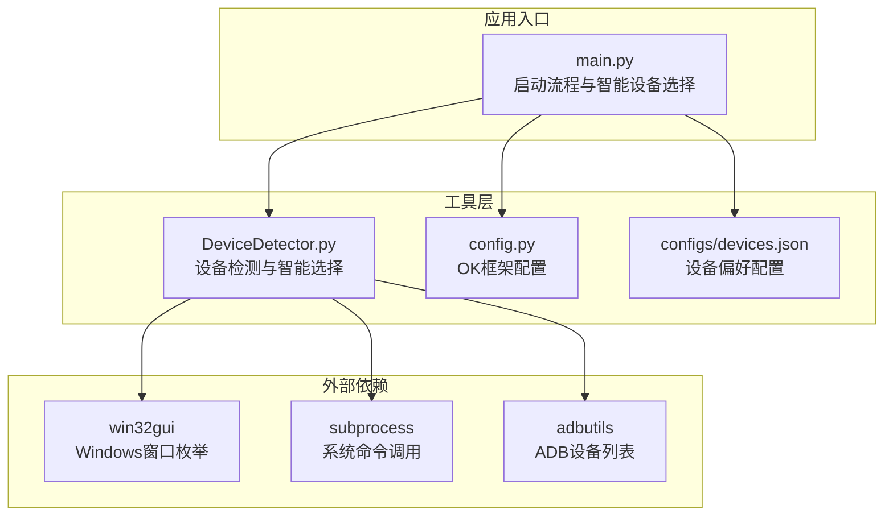
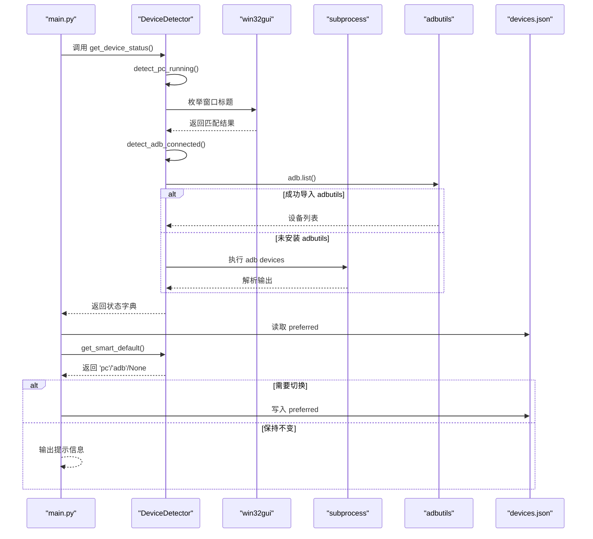
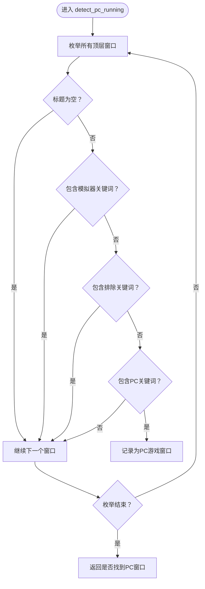
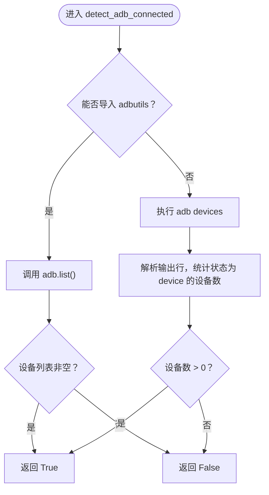
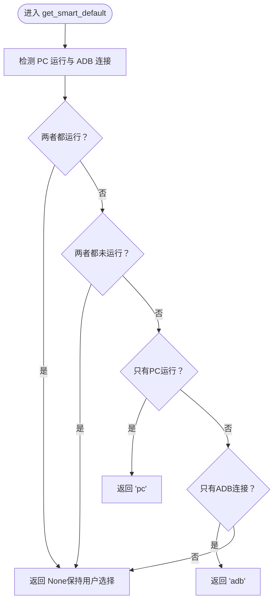
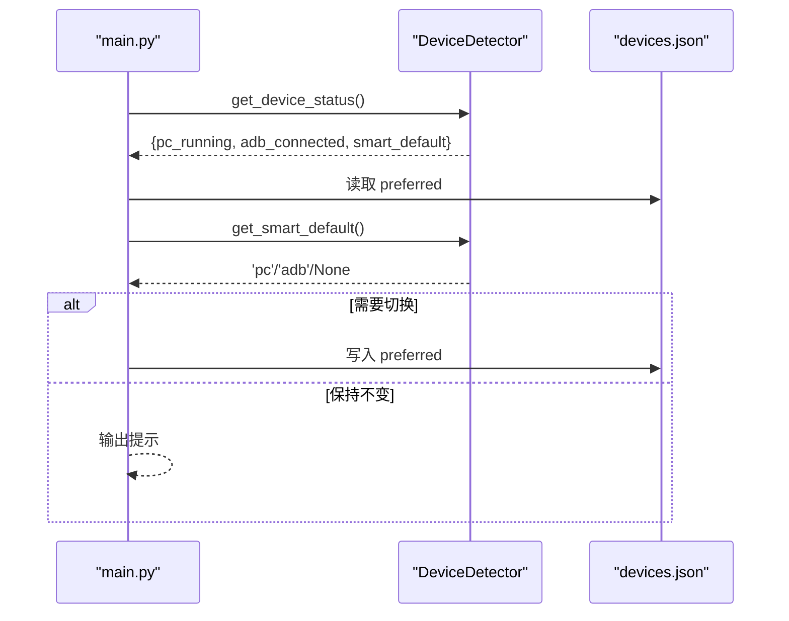
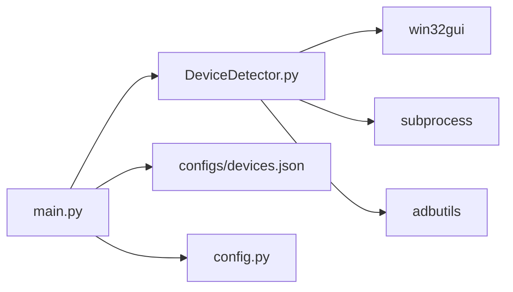

# 设备检测器

<cite>
**本文引用的文件**
- [DeviceDetector.py](file://src/utils/DeviceDetector.py)
- [devices.json](file://configs/devices.json)
- [main.py](file://main.py)
- [requirements.txt](file://requirements.txt)
- [config.py](file://config.py)
</cite>

## 目录
1. [简介](#简介)
2. [项目结构](#项目结构)
3. [核心组件](#核心组件)
4. [架构总览](#架构总览)
5. [详细组件分析](#详细组件分析)
6. [依赖分析](#依赖分析)
7. [性能考虑](#性能考虑)
8. [故障排查指南](#故障排查指南)
9. [结论](#结论)
10. [附录](#附录)

## 简介
本文件面向“设备检测器”的使用与维护，重点解释以下内容：
- 如何检测 PC 版游戏窗口与 Android 模拟器的连接状态
- PC 游戏窗口检测机制：窗口标题关键词匹配算法与排除规则
- ADB 设备连接检测的实现原理：优先使用 adbutils 包，回退到系统命令
- 智能默认设备选择逻辑：基于当前连接状态自动选择最佳设备
- 设备状态获取方法的使用示例与错误处理策略

## 项目结构
设备检测器位于 utils 子模块中，与主程序入口、配置文件协同工作，形成“状态检测—智能选择—配置写入”的闭环。

图表来源
- [DeviceDetector.py:1-149](file://src/utils/DeviceDetector.py#L1-L149)
- [main.py:54-107](file://main.py#L54-L107)
- [config.py:68-149](file://config.py#L68-L149)
- [devices.json:1-7](file://configs/devices.json#L1-L7)

章节来源
- [DeviceDetector.py:1-149](file://src/utils/DeviceDetector.py#L1-L149)
- [main.py:54-107](file://main.py#L54-L107)
- [config.py:68-149](file://config.py#L68-L149)
- [devices.json:1-7](file://configs/devices.json#L1-L7)

## 核心组件
- DeviceDetector 类：提供 PC 游戏窗口检测、ADB 连接检测、智能默认设备选择、设备状态查询等能力
- 主程序入口：在 OK 框架初始化前执行智能设备选择，读取并更新 devices.json 的首选设备
- 配置文件：OK 框架配置与设备偏好配置文件共同决定设备选择与行为

章节来源
- [DeviceDetector.py:11-149](file://src/utils/DeviceDetector.py#L11-L149)
- [main.py:54-107](file://main.py#L54-L107)
- [devices.json:1-7](file://configs/devices.json#L1-L7)

## 架构总览
设备检测器围绕“状态检测—决策—持久化”展开，关键流程如下：
- 检测 PC 游戏窗口是否存在（排除模拟器与工具自身窗口）
- 检测 ADB 设备是否连接（优先使用 adbutils，失败则回退系统命令）
- 基于两个状态进行智能默认设备选择
- 将结果写入 devices.json，供 OK 框架读取

图表来源
- [DeviceDetector.py:28-148](file://src/utils/DeviceDetector.py#L28-L148)
- [main.py:65-95](file://main.py#L65-L95)
- [devices.json:1-7](file://configs/devices.json#L1-L7)

## 详细组件分析

### PC 游戏窗口检测机制
- 关键词匹配
  - PC 窗口关键词：用于精确匹配 PC 版游戏窗口标题
  - 排除关键词：避免将模拟器窗口或工具自身窗口误判为 PC 游戏窗口
- 窗口枚举与过滤
  - 使用 Windows API 枚举所有顶层窗口
  - 跳过空标题、包含模拟器关键词、包含排除关键词的窗口
  - 对剩余窗口检查是否包含 PC 关键词，若命中则认为 PC 游戏正在运行
- 错误处理
  - 枚举过程中的异常将导致检测失败，返回 False，保证健壮性

图表来源
- [DeviceDetector.py:28-68](file://src/utils/DeviceDetector.py#L28-L68)

章节来源
- [DeviceDetector.py:19-68](file://src/utils/DeviceDetector.py#L19-L68)

### ADB 设备连接检测实现
- 优先使用 adbutils 包
  - 导入 adbutils 并调用设备列表接口，若列表非空则判定 ADB 已连接
- 系统命令回退机制
  - 若导入失败，则尝试执行系统 adb 命令获取设备列表
  - 解析输出行，统计状态为 device 的设备数量，大于 0 则判定连接
- 异常与超时
  - 导入异常、命令执行异常均视为未连接
  - 命令执行设置超时，避免阻塞

图表来源
- [DeviceDetector.py:70-110](file://src/utils/DeviceDetector.py#L70-L110)

章节来源
- [DeviceDetector.py:70-110](file://src/utils/DeviceDetector.py#L70-L110)

### 智能默认设备选择逻辑
- 仅 PC 运行：选择 PC
- 仅 ADB 连接：选择 ADB
- 两者都运行或都未运行：保持用户选择（返回 None）

图表来源
- [DeviceDetector.py:112-134](file://src/utils/DeviceDetector.py#L112-L134)

章节来源
- [DeviceDetector.py:112-134](file://src/utils/DeviceDetector.py#L112-L134)

### 设备状态获取与使用示例
- get_device_status：一次性返回 PC 运行、ADB 连接与智能默认设备
- 在主程序入口中，先打印状态，再根据智能默认设备更新 devices.json 的 preferred 字段

图表来源
- [DeviceDetector.py:136-148](file://src/utils/DeviceDetector.py#L136-L148)
- [main.py:65-95](file://main.py#L65-L95)
- [devices.json:1-7](file://configs/devices.json#L1-7)

章节来源
- [DeviceDetector.py:136-148](file://src/utils/DeviceDetector.py#L136-L148)
- [main.py:65-95](file://main.py#L65-L95)
- [devices.json:1-7](file://configs/devices.json#L1-L7)

## 依赖分析
- 外部库
  - win32gui：用于枚举 Windows 窗口并获取窗口标题
  - subprocess：用于执行系统命令（adb devices）
  - adbutils：用于直接获取 ADB 设备列表
- 内部配置
  - devices.json：存储首选设备（preferred）、捕获方式（capture）等
  - config.py：OK 框架配置，包含窗口标题、ADB 启用开关等

图表来源
- [DeviceDetector.py:7-8](file://src/utils/DeviceDetector.py#L7-L8)
- [requirements.txt:6-7](file://requirements.txt#L6-L7)
- [main.py:65-95](file://main.py#L65-L95)
- [devices.json:1-7](file://configs/devices.json#L1-L7)
- [config.py:94-106](file://config.py#L94-L106)

章节来源
- [requirements.txt:1-14](file://requirements.txt#L1-L14)
- [config.py:94-106](file://config.py#L94-L106)

## 性能考虑
- 窗口枚举成本较低，但应避免在高频循环中重复调用
- ADB 检测优先使用 adbutils，减少子进程开销；仅在导入失败时才执行系统命令
- get_device_status 会重复调用底层检测方法，建议按需调用或缓存结果

## 故障排查指南
- 无法导入 adbutils
  - 现象：ADB 连接检测回退到系统命令
  - 处理：确认已安装 adbutils；若仍失败，检查系统 adb 是否可用且在 PATH 中
- 系统命令执行失败
  - 现象：返回 False
  - 处理：检查 adb devices 输出格式；确认 ADB 服务正常；避免长时间阻塞
- 窗口检测误判
  - 现象：将模拟器或工具窗口误判为 PC 游戏窗口
  - 处理：调整排除关键词或 PC 关键词；确保游戏窗口标题唯一
- 配置写入失败
  - 现象：智能设备选择未生效
  - 处理：检查 devices.json 文件权限；确认主程序在 OK 初始化前执行智能选择

章节来源
- [DeviceDetector.py:70-110](file://src/utils/DeviceDetector.py#L70-L110)
- [DeviceDetector.py:28-68](file://src/utils/DeviceDetector.py#L28-L68)
- [main.py:74-95](file://main.py#L74-L95)

## 结论
设备检测器通过“窗口标题关键词匹配 + ADB 设备列表”的双通道检测，结合智能默认设备选择逻辑，实现了对 PC 游戏与 Android 模拟器的可靠区分，并将结果持久化至配置文件，为上层任务提供稳定的设备选择基础。其设计兼顾了易用性与健壮性，适合在多场景下部署与扩展。

## 附录
- 使用建议
  - 在 OK 框架初始化前调用智能设备选择，确保 devices.json 的首选设备已更新
  - 如需调试，可直接调用 get_device_status 查看当前状态
  - 如需强制选择某设备，可在 devices.json 中手动修改 preferred 字段