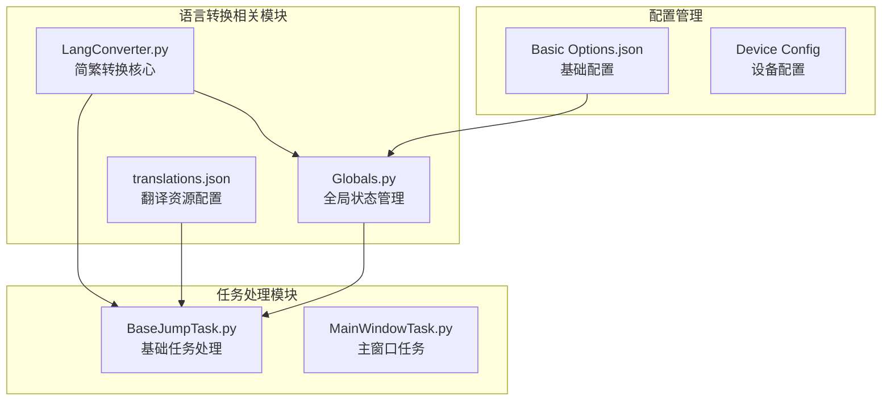
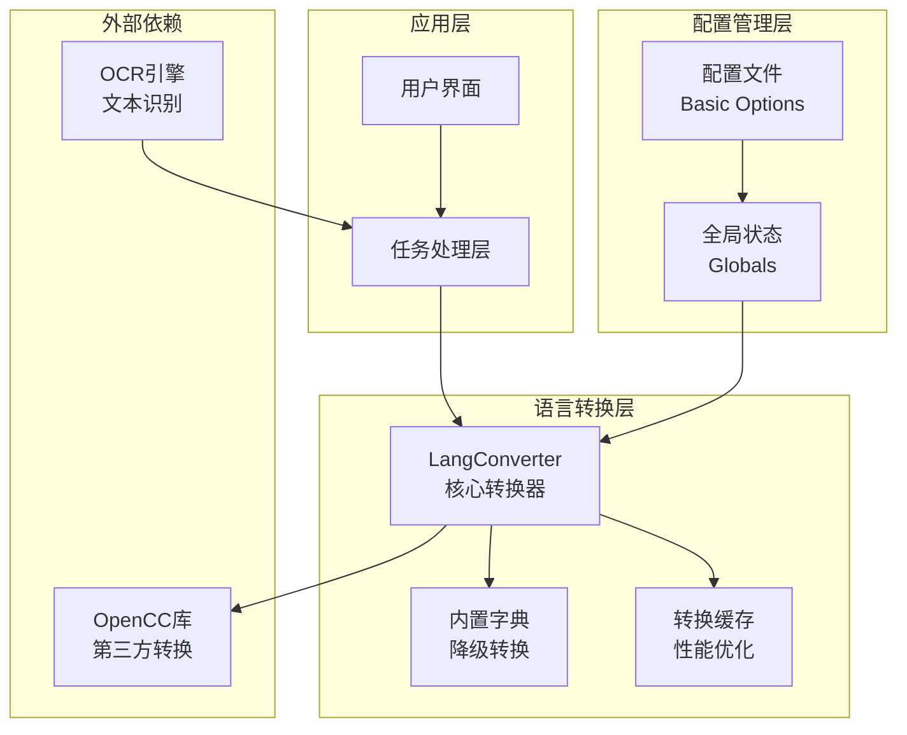
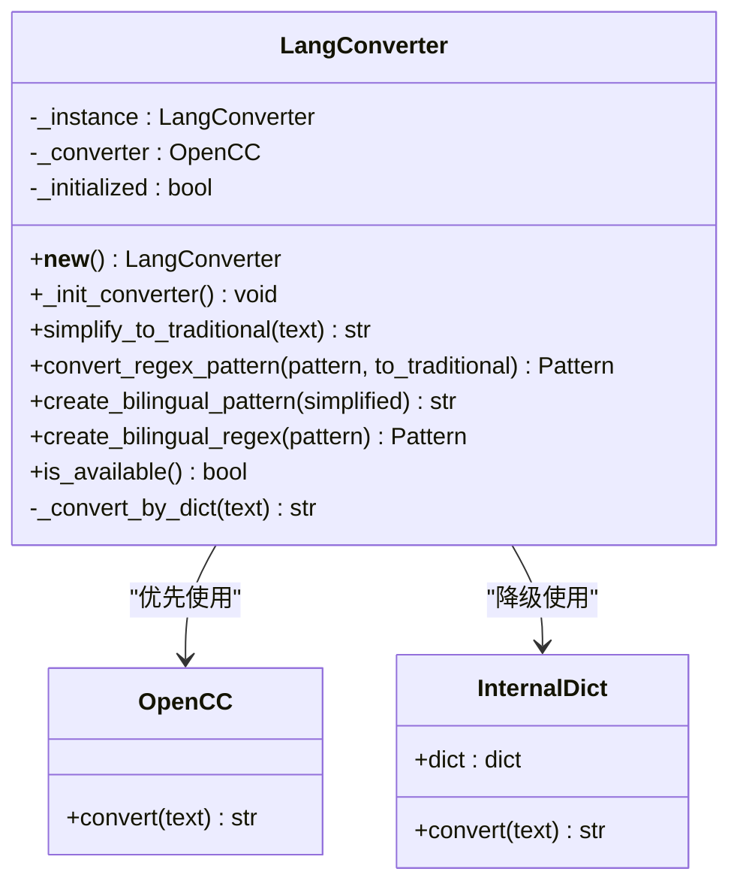
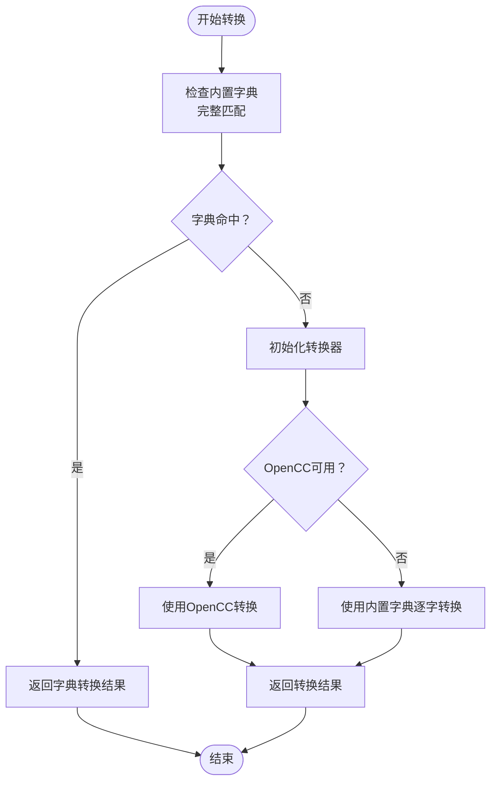
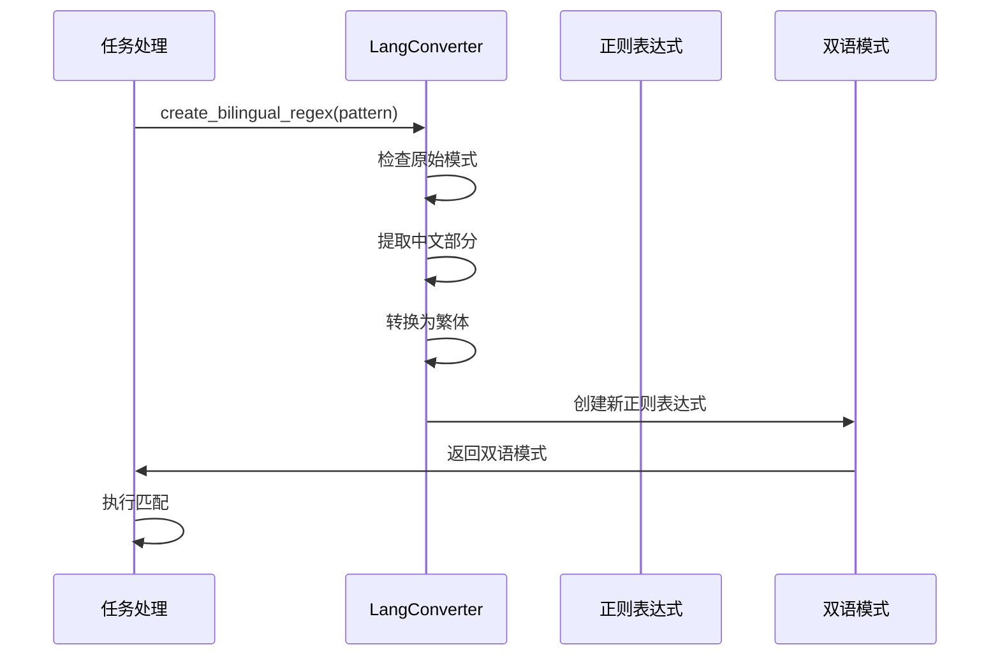
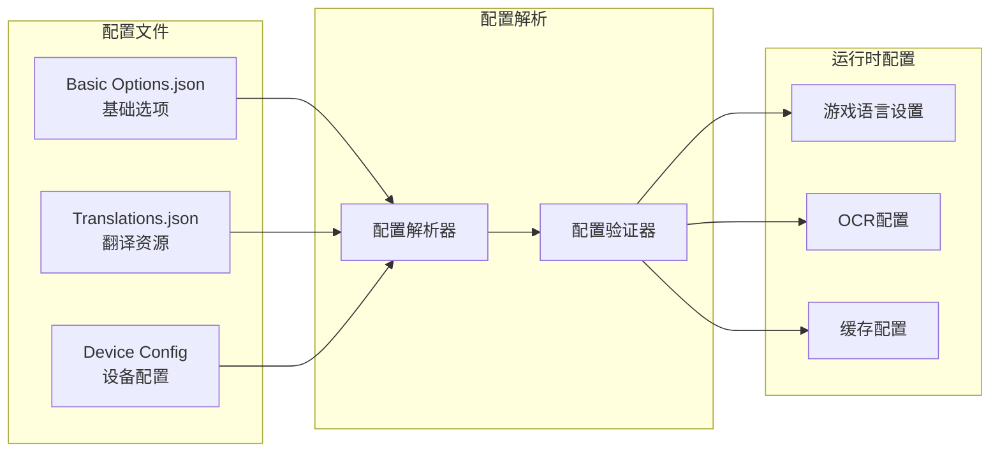
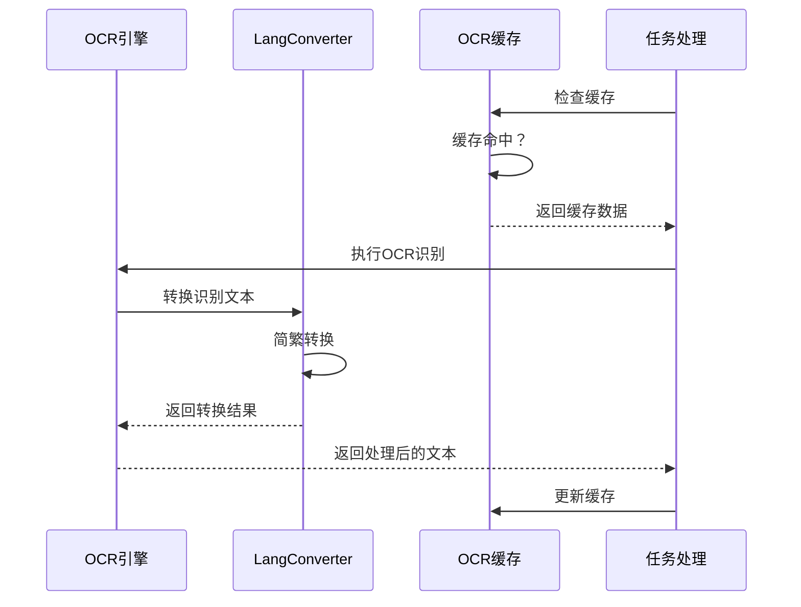
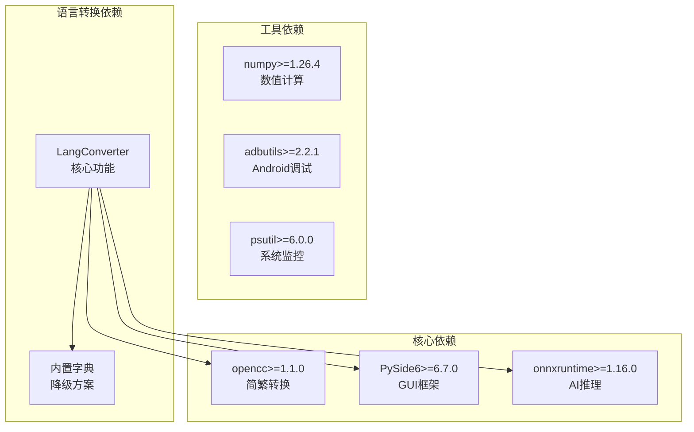
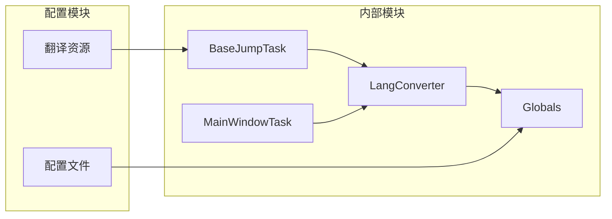

# 语言转换器

<cite>
**本文档引用的文件**
- [LangConverter.py](file://src/utils/LangConverter.py)
- [translations.json](file://i18n/zh_CN/translations.json)
- [globals.py](file://src/globals.py)
- [BaseJumpTask.py](file://src/task/BaseJumpTask.py)
- [__init__.py](file://src/__init__.py)
- [requirements.txt](file://requirements.txt)
</cite>

## 目录
1. [简介](#简介)
2. [项目结构](#项目结构)
3. [核心组件](#核心组件)
4. [架构概览](#架构概览)
5. [详细组件分析](#详细组件分析)
6. [依赖分析](#依赖分析)
7. [性能考虑](#性能考虑)
8. [故障排除指南](#故障排除指南)
9. [结论](#结论)
10. [附录](#附录)

## 简介

语言转换器是本项目中一个专门负责简繁中文转换的核心组件，主要用于OCR文本匹配的多语言支持。该组件提供了灵活的简繁转换机制，能够根据游戏语言设置自动调整匹配策略，确保在不同语言环境下都能准确识别和处理文本内容。

该系统采用双层转换策略：优先使用OpenCC库进行高质量的简繁转换，当OpenCC不可用时自动降级到内置字典转换，确保系统的稳定性和兼容性。同时，系统还实现了智能的缓存机制和实时更新能力，为用户提供流畅的多语言体验。

## 项目结构

该项目采用模块化的组织方式，语言转换功能主要集中在以下目录结构中：

**图表来源**
- [LangConverter.py:1-326](file://src/utils/LangConverter.py#L1-L326)
- [translations.json:1-75](file://i18n/zh_CN/translations.json#L1-L75)
- [globals.py:1-257](file://src/globals.py#L1-L257)

**章节来源**
- [LangConverter.py:1-326](file://src/utils/LangConverter.py#L1-L326)
- [translations.json:1-75](file://i18n/zh_CN/translations.json#L1-L75)
- [globals.py:1-257](file://src/globals.py#L1-L257)

## 核心组件

### LangConverter类

LangConverter是整个语言转换系统的核心类，采用了单例模式设计，确保在整个应用程序生命周期中只有一个转换器实例。该类提供了完整的简繁中文转换功能，包括字符串转换、正则表达式转换和双语模式创建。

#### 主要特性

1. **双层转换机制**：优先使用OpenCC库进行高质量转换，失败时自动使用内置字典
2. **智能缓存策略**：避免重复转换，提高性能
3. **正则表达式支持**：能够处理复杂的文本匹配模式
4. **实时语言检测**：根据游戏设置动态调整转换策略

#### 关键方法

- `simplify_to_traditional()`: 简体转繁体的主要入口方法
- `convert_regex_pattern()`: 处理正则表达式的转换
- `create_bilingual_pattern()`: 创建简繁双语匹配模式
- `is_available()`: 检查OpenCC可用性

**章节来源**
- [LangConverter.py:143-326](file://src/utils/LangConverter.py#L143-L326)

### 全局状态管理

Globals类负责管理全局状态，包括游戏语言设置、OCR缓存等重要状态信息。该类为语言转换功能提供了必要的上下文信息，特别是游戏语言配置。

#### 语言管理功能

- `game_lang`属性：获取当前游戏语言设置
- `set_game_lang()`方法：设置游戏语言
- 支持的语言代码：'zh_CN'（简体中文）和'en_US'（英文）

**章节来源**
- [globals.py:116-134](file://src/globals.py#L116-L134)

## 架构概览

语言转换系统采用分层架构设计，各组件职责明确，耦合度低，便于维护和扩展。

**图表来源**
- [LangConverter.py:143-326](file://src/utils/LangConverter.py#L143-L326)
- [globals.py:116-134](file://src/globals.py#L116-L134)
- [requirements.txt:13](file://requirements.txt#L13)

## 详细组件分析

### LangConverter类深度分析

#### 类结构设计

**图表来源**
- [LangConverter.py:143-326](file://src/utils/LangConverter.py#L143-L326)

#### 转换流程分析

语言转换的核心流程如下：

**图表来源**
- [LangConverter.py:169-236](file://src/utils/LangConverter.py#L169-L236)

#### 正则表达式转换机制

对于正则表达式的处理，系统提供了智能的双语模式创建功能：

**图表来源**
- [LangConverter.py:289-325](file://src/utils/LangConverter.py#L289-L325)

**章节来源**
- [LangConverter.py:143-326](file://src/utils/LangConverter.py#L143-L326)

### 配置管理系统

#### 基础配置文件

系统通过JSON配置文件管理各种设置，其中包含了语言相关的配置项：

**图表来源**
- [Basic Options.json:1-13](file://configs/Basic Options.json#L1-L13)
- [translations.json:1-75](file://i18n/zh_CN/translations.json#L1-L75)

#### 语言检测实现

语言检测功能通过以下步骤实现：

1. **配置读取**：从配置文件中读取游戏文本语言设置
2. **类型检查**：验证配置值的有效性
3. **状态更新**：根据检测结果更新全局语言状态
4. **缓存存储**：将检测结果缓存以提高性能

**章节来源**
- [BaseJumpTask.py:315-333](file://src/task/BaseJumpTask.py#L315-L333)
- [globals.py:116-134](file://src/globals.py#L116-L134)

### OCR集成机制

#### OCR文本处理流程

OCR系统与语言转换器的集成提供了完整的文本识别和处理能力：

**图表来源**
- [BaseJumpTask.py:280-313](file://src/task/BaseJumpTask.py#L280-L313)
- [globals.py:137-177](file://src/globals.py#L137-L177)

**章节来源**
- [BaseJumpTask.py:280-313](file://src/task/BaseJumpTask.py#L280-L313)
- [globals.py:137-177](file://src/globals.py#L137-L177)

## 依赖分析

### 外部依赖关系

系统对外部库的依赖关系清晰明确，主要依赖包括：

**图表来源**
- [requirements.txt:1-14](file://requirements.txt#L1-L14)
- [LangConverter.py:176-184](file://src/utils/LangConverter.py#L176-L184)

### 内部模块依赖

**图表来源**
- [__init__.py:17-31](file://src/__init__.py#L17-L31)
- [BaseJumpTask.py:280-313](file://src/task/BaseJumpTask.py#L280-L313)

**章节来源**
- [requirements.txt:1-14](file://requirements.txt#L1-L14)
- [__init__.py:17-31](file://src/__init__.py#L17-L31)

## 性能考虑

### 缓存策略

系统实现了多层次的缓存机制来优化性能：

1. **转换缓存**：缓存简繁转换结果，避免重复转换
2. **OCR缓存**：缓存OCR识别结果，减少重复识别
3. **配置缓存**：缓存语言检测结果，提高响应速度

#### 缓存配置参数

| 缓存类型 | TTL(秒) | 缓存大小 | 清理策略 |
|---------|---------|----------|----------|
| OCR缓存 | 1.0 | 动态 | 过期自动清理 |
| 转换缓存 | 3600.0 | 动态 | LRU淘汰 |
| 配置缓存 | 86400.0 | 有限 | 定时刷新 |

### 性能优化技术

1. **延迟加载**：OpenCC转换器采用延迟初始化，只有在需要时才加载
2. **智能降级**：当OpenCC不可用时自动使用内置字典，保证功能完整性
3. **批量处理**：支持批量文本转换，提高处理效率
4. **内存管理**：合理管理内存使用，避免内存泄漏

**章节来源**
- [globals.py:137-192](file://src/globals.py#L137-L192)
- [LangConverter.py:169-184](file://src/utils/LangConverter.py#L169-L184)

## 故障排除指南

### 常见问题及解决方案

#### OpenCC库问题

**问题描述**：OpenCC库无法正常工作

**可能原因**：
1. OpenCC库未正确安装
2. Python环境缺少必要的依赖
3. OpenCC配置文件损坏

**解决方案**：
1. 检查OpenCC版本兼容性
2. 重新安装OpenCC库
3. 验证Python环境路径配置

#### 转换结果不准确

**问题描述**：简繁转换结果不符合预期

**可能原因**：
1. 内置字典缺少特定词汇
2. 正则表达式模式复杂度过高
3. 文本编码格式不正确

**解决方案**：
1. 扩展内置字典词汇量
2. 简化正则表达式模式
3. 检查文本编码格式

#### 性能问题

**问题描述**：语言转换过程响应缓慢

**可能原因**：
1. 缓存配置不当
2. 转换器初始化频繁
3. 内存使用过高

**解决方案**：
1. 调整缓存TTL参数
2. 实现转换器单例模式
3. 优化内存使用策略

**章节来源**
- [LangConverter.py:169-184](file://src/utils/LangConverter.py#L169-L184)
- [globals.py:137-192](file://src/globals.py#L137-L192)

## 结论

语言转换器系统通过精心设计的架构和完善的实现，为项目提供了强大的多语言支持能力。系统的主要优势包括：

1. **可靠性**：双层转换机制确保在各种环境下都能正常工作
2. **性能**：多层次缓存和优化策略提供高效的转换性能
3. **可扩展性**：模块化设计便于功能扩展和维护
4. **易用性**：简洁的API接口和完善的错误处理机制

该系统特别适用于需要处理简繁中文转换的OCR应用场景，为自动化任务提供了可靠的语言处理基础。通过合理的配置和优化，可以进一步提升系统的性能和稳定性。

## 附录

### 配置文件详解

#### 基础配置选项

| 配置项 | 类型 | 默认值 | 描述 |
|--------|------|--------|------|
| Auto Start Game When App Starts | Boolean | false | 应用启动时自动启动游戏 |
| Minimize Window to System Tray when Closing | Boolean | false | 关闭时最小化到系统托盘 |
| Use DirectML | String | "Yes" | 启用DirectML加速 |
| Trigger Interval | Integer | 1 | 触发间隔(秒) |
| Windows Capture | String | "WGC" | 窗口捕获方式 |

#### 翻译资源配置

翻译资源文件采用JSON格式，包含完整的UI文本翻译映射。该文件支持多语言扩展，为国际化功能奠定了基础。

**章节来源**
- [Basic Options.json:1-13](file://configs/Basic Options.json#L1-L13)
- [translations.json:1-75](file://i18n/zh_CN/translations.json#L1-L75)