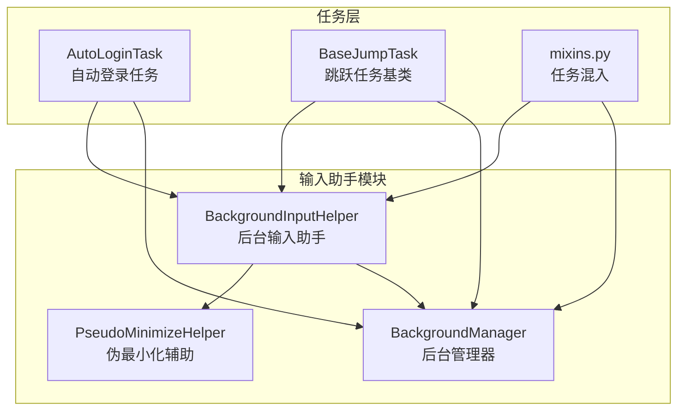
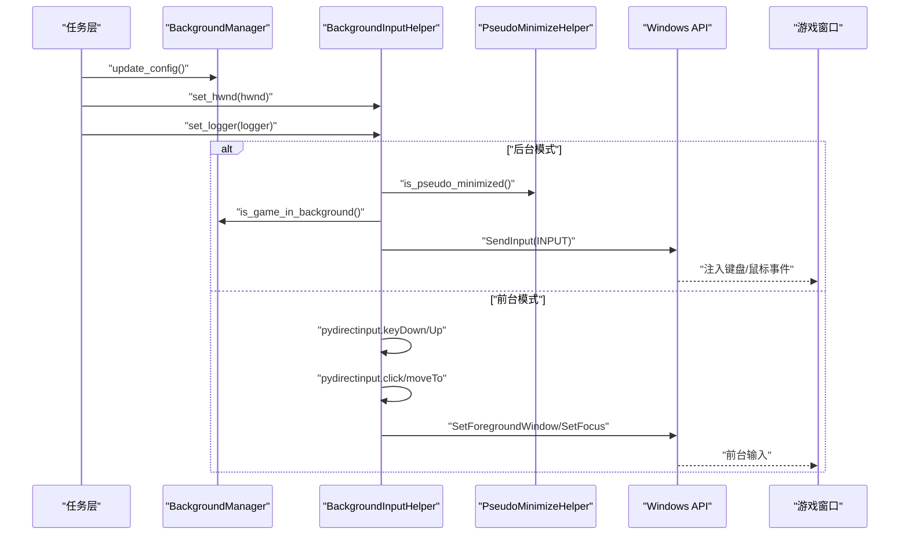
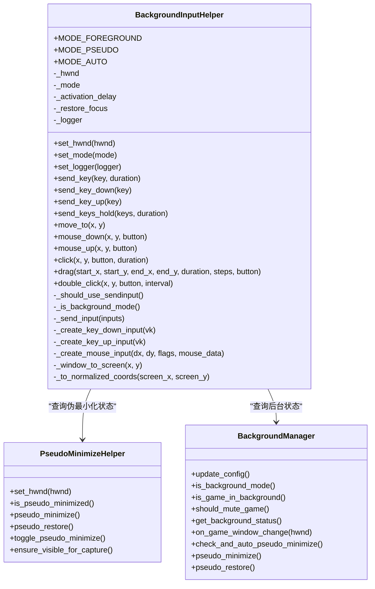
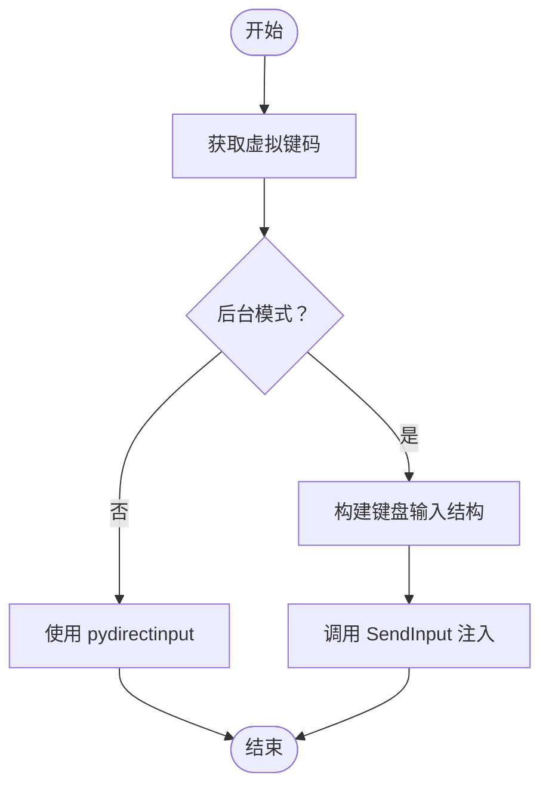
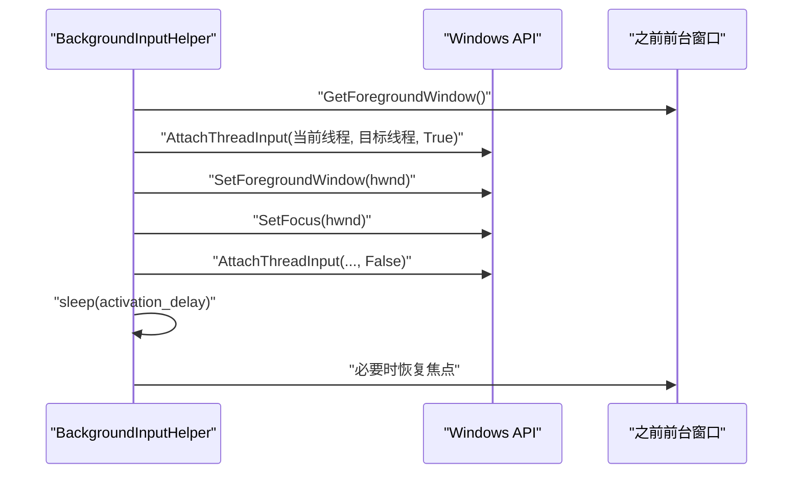
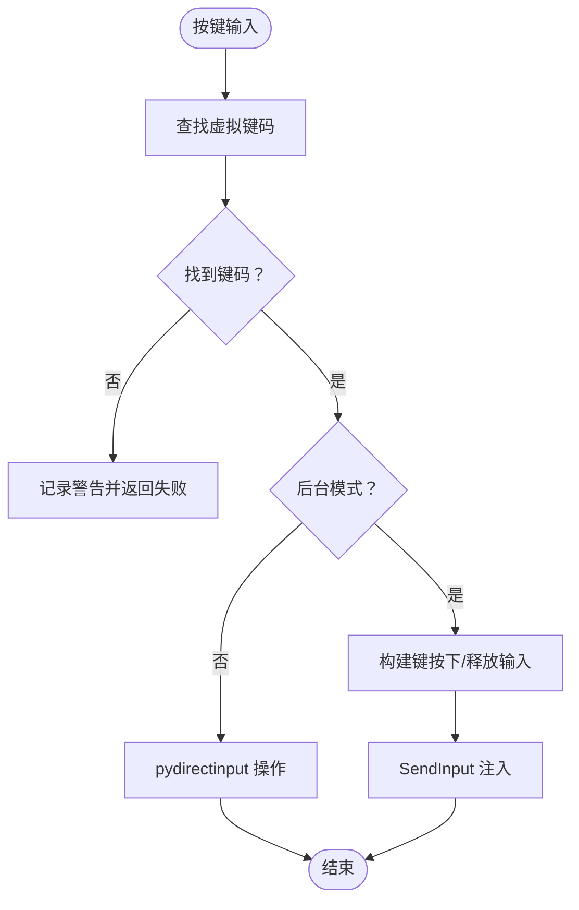
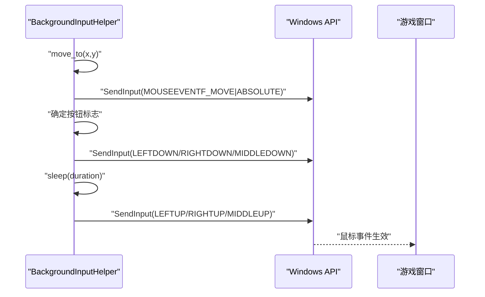
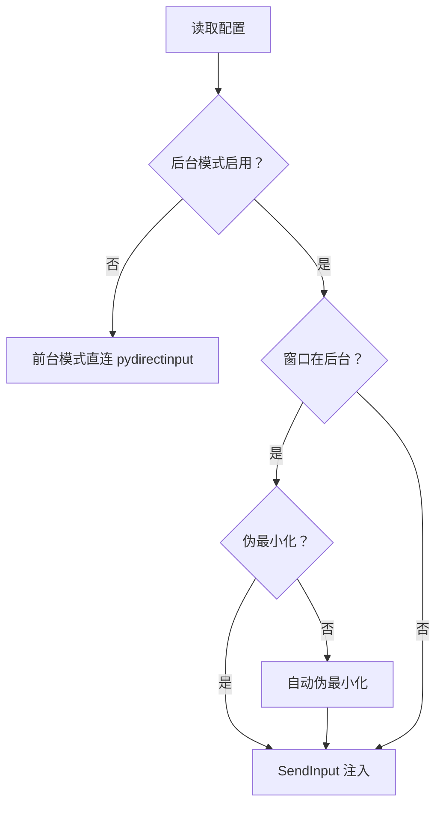
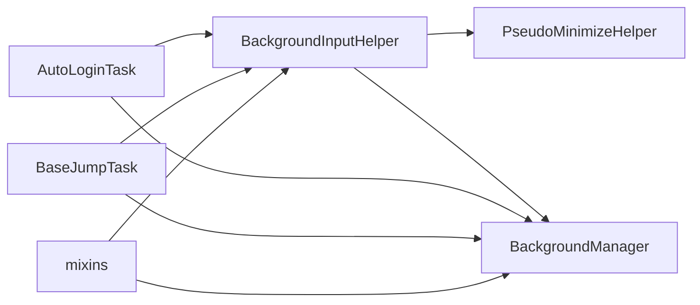

# 输入助手

<cite>
**本文档引用的文件**
- [BackgroundInputHelper.py](file://src/utils/BackgroundInputHelper.py)
- [BackgroundManager.py](file://src/utils/BackgroundManager.py)
- [PseudoMinimizeHelper.py](file://src/utils/PseudoMinimizeHelper.py)
- [AutoLoginTask.py](file://src/task/AutoLoginTask.py)
- [BaseJumpTask.py](file://src/task/BaseJumpTask.py)
- [mixins.py](file://src/task/mixins.py)
- [test_input.py](file://test_input.py)
</cite>

## 目录
1. [简介](#简介)
2. [项目结构](#项目结构)
3. [核心组件](#核心组件)
4. [架构总览](#架构总览)
5. [详细组件分析](#详细组件分析)
6. [依赖关系分析](#依赖关系分析)
7. [性能考虑](#性能考虑)
8. [故障排除指南](#故障排除指南)
9. [结论](#结论)

## 简介
本文件面向“输入助手”的实现与使用，重点解析 BackgroundInputHelper 类如何在后台模式下可靠地模拟键盘与鼠标输入，涵盖以下关键点：
- Windows API 的输入模拟技术，特别是 SendInput 函数的使用
- 前台窗口激活与输入焦点管理机制
- 键盘按键映射与组合键处理
- 鼠标点击、拖拽等复杂输入操作的实现方法
- 输入延迟控制与准确性优化策略
- 与后台管理模式的协同工作机制

该实现针对 Unity 游戏的 DirectInput/Raw Input 输入路径，明确指出 PostMessage 无法被检测，必须使用 SendInput 才能在后台模式下稳定工作。

## 项目结构
输入助手位于 src/utils 目录中，配合后台管理与伪最小化辅助工具，形成完整的后台输入解决方案。任务层通过全局实例 background_input 与 background_manager 进行集成。

图表来源
- [BackgroundInputHelper.py:1-841](file://src/utils/BackgroundInputHelper.py#L1-L841)
- [BackgroundManager.py:1-155](file://src/utils/BackgroundManager.py#L1-L155)
- [PseudoMinimizeHelper.py:1-238](file://src/utils/PseudoMinimizeHelper.py#L1-L238)
- [AutoLoginTask.py:150-180](file://src/task/AutoLoginTask.py#L150-L180)
- [BaseJumpTask.py:1-41](file://src/task/BaseJumpTask.py#L1-L41)
- [mixins.py:1-44](file://src/task/mixins.py#L1-L44)

章节来源
- [BackgroundInputHelper.py:1-841](file://src/utils/BackgroundInputHelper.py#L1-L841)
- [BackgroundManager.py:1-155](file://src/utils/BackgroundManager.py#L1-L155)
- [PseudoMinimizeHelper.py:1-238](file://src/utils/PseudoMinimizeHelper.py#L1-L238)
- [AutoLoginTask.py:150-180](file://src/task/AutoLoginTask.py#L150-L180)
- [BaseJumpTask.py:1-41](file://src/task/BaseJumpTask.py#L1-L41)
- [mixins.py:1-44](file://src/task/mixins.py#L1-L44)

## 核心组件
- BackgroundInputHelper：核心输入控制器，封装键盘与鼠标输入的后台模拟逻辑，支持 SendInput 与前台模式两种路径。
- BackgroundManager：后台模式开关与状态管理，检测游戏窗口是否在后台，决定是否启用伪最小化与静音策略。
- PseudoMinimizeHelper：负责将游戏窗口移至屏幕外（伪最小化），使其仍可作为活动窗口接收 SendInput。
- 任务层集成：AutoLoginTask、BaseJumpTask、mixins 中通过全局实例 background_input 与 background_manager 实现输入与后台模式的协同。

章节来源
- [BackgroundInputHelper.py:99-117](file://src/utils/BackgroundInputHelper.py#L99-L117)
- [BackgroundManager.py:7-17](file://src/utils/BackgroundManager.py#L7-L17)
- [PseudoMinimizeHelper.py:13-26](file://src/utils/PseudoMinimizeHelper.py#L13-L26)
- [AutoLoginTask.py:155-180](file://src/task/AutoLoginTask.py#L155-L180)

## 架构总览
输入助手的整体工作流如下：
- 任务初始化时设置窗口句柄并更新后台配置
- 判断当前是否处于后台模式（伪最小化或窗口在后台）
- 若为后台模式，使用 SendInput 直接注入输入事件，避免激活窗口
- 若非后台模式，使用 pydirectinput 在前台发送输入
- 鼠标输入通过坐标转换与归一化，确保在不同分辨率下准确命中

图表来源
- [BackgroundInputHelper.py:177-206](file://src/utils/BackgroundInputHelper.py#L177-L206)
- [BackgroundManager.py:46-75](file://src/utils/BackgroundManager.py#L46-L75)
- [PseudoMinimizeHelper.py:103-104](file://src/utils/PseudoMinimizeHelper.py#L103-L104)

章节来源
- [BackgroundInputHelper.py:177-206](file://src/utils/BackgroundInputHelper.py#L177-L206)
- [BackgroundManager.py:46-75](file://src/utils/BackgroundManager.py#L46-L75)
- [PseudoMinimizeHelper.py:103-104](file://src/utils/PseudoMinimizeHelper.py#L103-L104)

## 详细组件分析

### BackgroundInputHelper 类
- 角色定位：统一的后台输入控制器，屏蔽底层差异，向上提供一致的键盘/鼠标 API。
- 关键特性：
  - 模式选择：前台模式、伪最小化模式、自动模式
  - SendInput 注入：键盘/鼠标事件结构体封装，直接调用 Windows API
  - 前台模式：使用 pydirectinput，适合需要窗口激活的场景
  - 坐标系统：窗口内坐标到屏幕绝对坐标的转换，再到 SendInput 归一化坐标
  - 组合键支持：多键同时按下/释放，用于移动控制等
  - 鼠标拖拽：分步移动，提升识别稳定性
  - 日志记录：统一的日志接口，便于调试

图表来源
- [BackgroundInputHelper.py:99-117](file://src/utils/BackgroundInputHelper.py#L99-L117)
- [BackgroundInputHelper.py:138-171](file://src/utils/BackgroundInputHelper.py#L138-L171)
- [BackgroundInputHelper.py:478-510](file://src/utils/BackgroundInputHelper.py#L478-L510)
- [PseudoMinimizeHelper.py:13-26](file://src/utils/PseudoMinimizeHelper.py#L13-L26)
- [BackgroundManager.py:7-17](file://src/utils/BackgroundManager.py#L7-L17)

章节来源
- [BackgroundInputHelper.py:99-117](file://src/utils/BackgroundInputHelper.py#L99-L117)
- [BackgroundInputHelper.py:138-171](file://src/utils/BackgroundInputHelper.py#L138-L171)
- [BackgroundInputHelper.py:478-510](file://src/utils/BackgroundInputHelper.py#L478-L510)

#### SendInput 与 Windows API 输入模拟
- 键盘结构体：封装 wVk、wScan、dwFlags、time、dwExtraInfo，通过 user32.SendInput 注入
- 鼠标结构体：封装 dx、dy、mouseData、dwFlags、time、dwExtraInfo，支持绝对坐标与相对移动
- 坐标转换：窗口内坐标 → 屏幕坐标 → SendInput 归一化坐标（0-65535）
- 事件顺序：移动到目标位置 → 按下 → 等待 → 释放（点击/拖拽）

图表来源
- [BackgroundInputHelper.py:143-147](file://src/utils/BackgroundInputHelper.py#L143-L147)
- [BackgroundInputHelper.py:310-356](file://src/utils/BackgroundInputHelper.py#L310-L356)

章节来源
- [BackgroundInputHelper.py:143-147](file://src/utils/BackgroundInputHelper.py#L143-L147)
- [BackgroundInputHelper.py:310-356](file://src/utils/BackgroundInputHelper.py#L310-L356)

#### 前台窗口激活与输入焦点管理
- 短暂激活：通过 AttachThreadInput 绕过限制，SetForegroundWindow/SetFocus 激活目标窗口
- 焦点恢复：记录并恢复之前的前台窗口，避免影响用户操作
- 激活延迟：等待窗口激活完成，减少输入丢失

图表来源
- [BackgroundInputHelper.py:208-298](file://src/utils/BackgroundInputHelper.py#L208-L298)

章节来源
- [BackgroundInputHelper.py:208-298](file://src/utils/BackgroundInputHelper.py#L208-L298)

#### 键盘按键映射与组合键处理
- 映射表：字母、数字、功能键、方向键、常用控制键
- 单键：按下并释放，支持自定义持续时间
- 组合键：同时按下多个键，用于斜向移动等
- 容错：未知按键记录警告，跳过无效按键

图表来源
- [BackgroundInputHelper.py:44-58](file://src/utils/BackgroundInputHelper.py#L44-L58)
- [BackgroundInputHelper.py:310-473](file://src/utils/BackgroundInputHelper.py#L310-L473)

章节来源
- [BackgroundInputHelper.py:44-58](file://src/utils/BackgroundInputHelper.py#L44-L58)
- [BackgroundInputHelper.py:310-473](file://src/utils/BackgroundInputHelper.py#L310-L473)

#### 鼠标点击、拖拽与双击
- 点击：移动到目标 → 按下 → 等待 → 释放；支持左/右/中键
- 拖拽：移动到起点 → 按下 → 分步移动到终点 → 释放；可调节步数与时长
- 双击：两次点击，中间有间隔
- 坐标系统：窗口内坐标 → 屏幕坐标 → 归一化坐标

图表来源
- [BackgroundInputHelper.py:630-708](file://src/utils/BackgroundInputHelper.py#L630-L708)
- [BackgroundInputHelper.py:710-815](file://src/utils/BackgroundInputHelper.py#L710-L815)

章节来源
- [BackgroundInputHelper.py:630-708](file://src/utils/BackgroundInputHelper.py#L630-L708)
- [BackgroundInputHelper.py:710-815](file://src/utils/BackgroundInputHelper.py#L710-L815)

### 与后台管理模式的协同
- 后台模式开关：来自配置项，决定是否启用后台输入策略
- 状态检测：判断游戏窗口是否在后台（被遮挡或非前台）
- 伪最小化：将窗口移至屏幕外，仍保持活动窗口状态，支持 SendInput
- 自动伪最小化：当窗口最小化时自动执行伪最小化，便于后台截图与输入
- 静音策略：后台时可选择静音游戏音频

图表来源
- [BackgroundManager.py:18-23](file://src/utils/BackgroundManager.py#L18-L23)
- [BackgroundManager.py:46-75](file://src/utils/BackgroundManager.py#L46-L75)
- [PseudoMinimizeHelper.py:123-163](file://src/utils/PseudoMinimizeHelper.py#L123-L163)

章节来源
- [BackgroundManager.py:18-23](file://src/utils/BackgroundManager.py#L18-L23)
- [BackgroundManager.py:46-75](file://src/utils/BackgroundManager.py#L46-L75)
- [PseudoMinimizeHelper.py:123-163](file://src/utils/PseudoMinimizeHelper.py#L123-L163)

## 依赖关系分析
- 模块耦合：
  - BackgroundInputHelper 依赖 PseudoMinimizeHelper 与 BackgroundManager
  - 任务层通过全局实例 background_input 与 background_manager 使用输入与后台能力
- 外部依赖：
  - Windows API：user32.dll、win32gui、win32con、win32api
  - 第三方库：pydirectinput（前台模式）、ctypes（底层结构体与调用）

图表来源
- [BackgroundInputHelper.py:24-25](file://src/utils/BackgroundInputHelper.py#L24-L25)
- [AutoLoginTask.py:167-171](file://src/task/AutoLoginTask.py#L167-L171)
- [BaseJumpTask.py:9-10](file://src/task/BaseJumpTask.py#L9-L10)
- [mixins.py:10-11](file://src/task/mixins.py#L10-L11)

章节来源
- [BackgroundInputHelper.py:24-25](file://src/utils/BackgroundInputHelper.py#L24-L25)
- [AutoLoginTask.py:167-171](file://src/task/AutoLoginTask.py#L167-L171)
- [BaseJumpTask.py:9-10](file://src/task/BaseJumpTask.py#L9-L10)
- [mixins.py:10-11](file://src/task/mixins.py#L10-L11)

## 性能考虑
- 输入延迟控制：
  - 激活延迟：0.05 秒，确保窗口激活完成
  - 按键持续时间：可配置，避免过短导致误判
  - 鼠标点击等待：0.01 秒，保证移动到位
  - 拖拽步数：10 步，平衡精度与性能
- 准确性优化：
  - SendInput 使用绝对坐标与归一化值，适配不同分辨率
  - 伪最小化避免窗口切换带来的焦点丢失
  - 组合键同时注入，减少时序误差
- 资源管理：
  - 仅在需要时导入 pydirectinput，降低模块加载开销
  - 异常捕获与资源清理，防止输入卡死

## 故障排除指南
- 现象：前台模式下输入无效
  - 排查：确认游戏是否使用 DirectInput/Raw Input；确认窗口是否真正获得焦点
  - 解决：切换到后台模式，使用 SendInput
- 现象：后台模式下按键无响应
  - 排查：检查后台模式开关与伪最小化状态
  - 解决：启用后台模式并确保窗口处于伪最小化或在后台
- 现象：鼠标点击位置偏移
  - 排查：确认坐标转换链路（窗口 → 屏幕 → 归一化）
  - 解决：检查窗口句柄与分辨率适配
- 现象：拖拽过程中鼠标未释放
  - 排查：异常分支会尝试释放鼠标
  - 解决：查看日志错误信息，确认坐标与按钮参数

章节来源
- [BackgroundInputHelper.py:354-356](file://src/utils/BackgroundInputHelper.py#L354-L356)
- [BackgroundInputHelper.py:804-815](file://src/utils/BackgroundInputHelper.py#L804-L815)
- [test_input.py:54-57](file://test_input.py#L54-L57)

## 结论
BackgroundInputHelper 通过 SendInput 与后台管理模式的结合，为 Unity 游戏提供了稳定的后台输入能力。其设计兼顾了准确性与性能，支持键盘与鼠标的复杂操作，并与伪最小化与后台管理紧密协作，满足自动化任务对输入的高要求。建议在实际使用中根据游戏类型与分辨率进行参数微调，并结合日志进行问题定位。