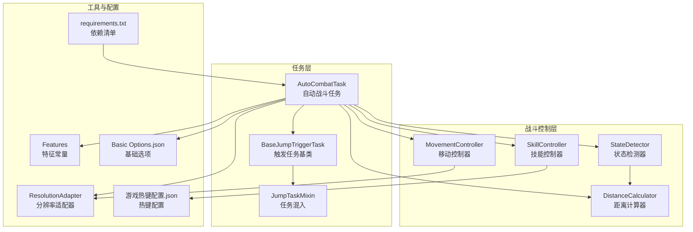
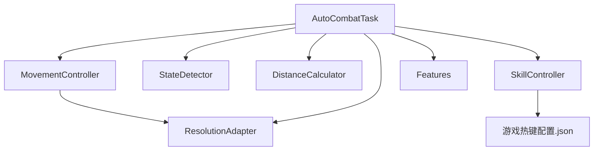
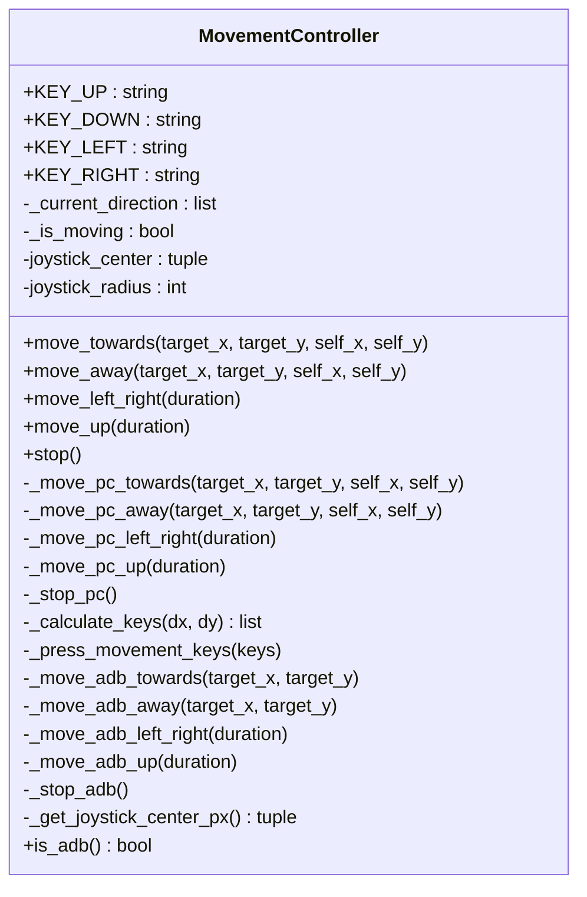
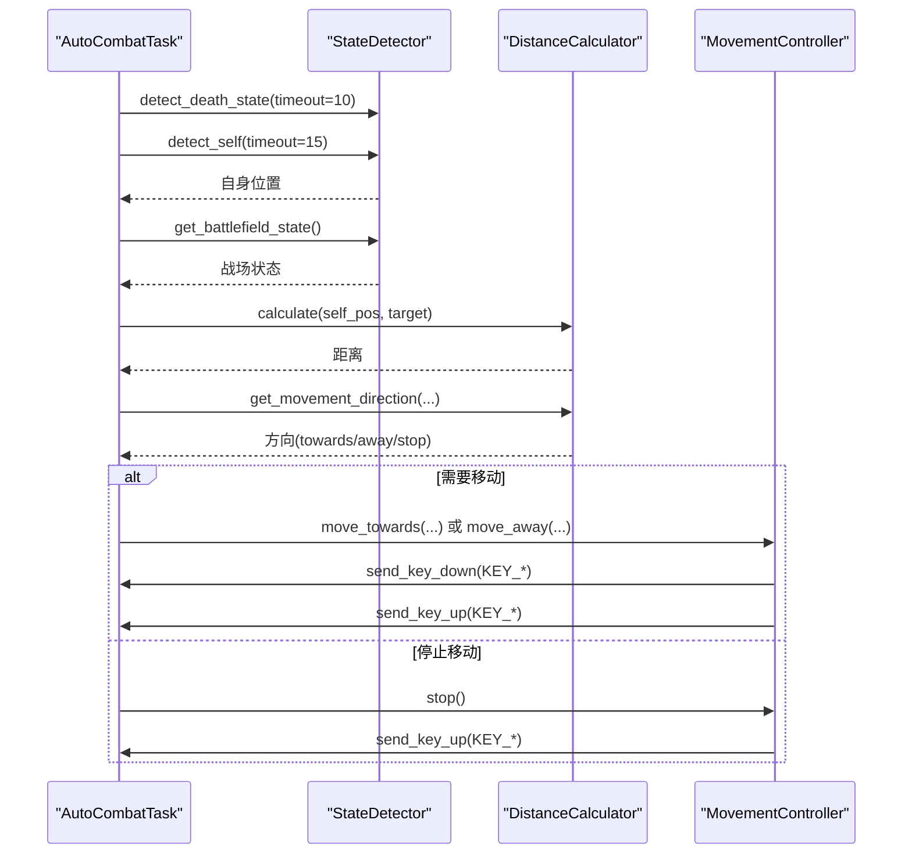
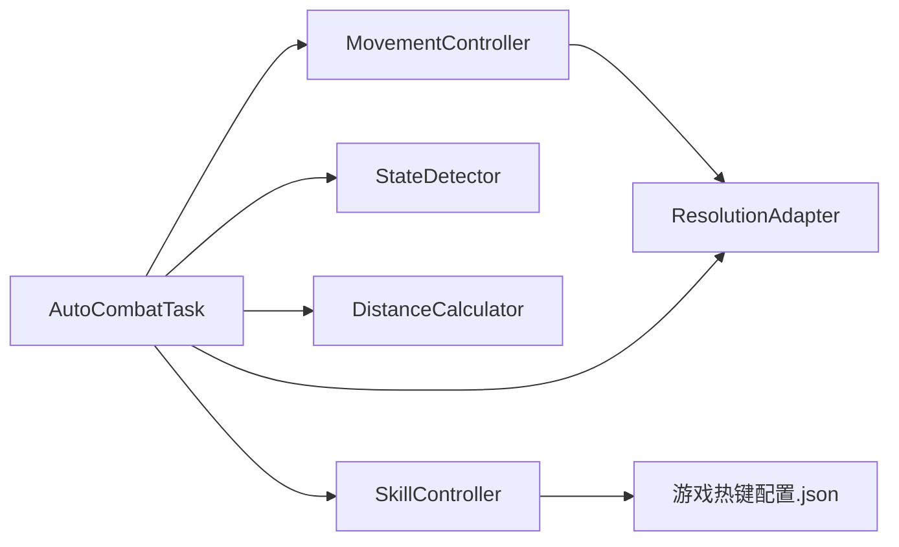

# PC端输入控制

<cite>
**本文引用的文件**
- [movement_controller.py](file://src/combat/movement_controller.py)
- [AutoCombatTask.py](file://src/task/AutoCombatTask.py)
- [state_detector.py](file://src/combat/state_detector.py)
- [distance_calculator.py](file://src/combat/distance_calculator.py)
- [skill_controller.py](file://src/combat/skill_controller.py)
- [BaseJumpTriggerTask.py](file://src/task/BaseJumpTriggerTask.py)
- [mixins.py](file://src/task/mixins.py)
- [ResolutionAdapter.py](file://src/utils/ResolutionAdapter.py)
- [features.py](file://src/constants/features.py)
- [Basic Options.json](file://configs/Basic Options.json)
- [游戏热键配置.json](file://configs/游戏热键配置.json)
- [requirements.txt](file://requirements.txt)
</cite>

## 目录
1. [简介](#简介)
2. [项目结构](#项目结构)
3. [核心组件](#核心组件)
4. [架构总览](#架构总览)
5. [详细组件分析](#详细组件分析)
6. [依赖关系分析](#依赖关系分析)
7. [性能考虑](#性能考虑)
8. [故障排查指南](#故障排查指南)
9. [结论](#结论)
10. [附录](#附录)

## 简介
本文件面向PC端输入控制系统，聚焦WASD键盘控制机制的实现原理与使用方法，涵盖方向键映射、八方向移动算法、按键状态管理、send_key_down/send_key_up调用链路、移动状态跟踪与方向缓存机制。同时提供配置参数说明（按键映射、移动速度、响应延迟）、实际使用示例路径、常见问题与性能优化建议。

## 项目结构
围绕“自动战斗”主线任务，PC端输入控制由移动控制器驱动，结合状态检测与距离计算模块协同工作，形成“检测—决策—控制”的闭环。

**图表来源**
- [AutoCombatTask.py:1-357](file://src/task/AutoCombatTask.py#L1-L357)
- [movement_controller.py:1-311](file://src/combat/movement_controller.py#L1-L311)
- [state_detector.py:1-274](file://src/combat/state_detector.py#L1-L274)
- [distance_calculator.py:1-139](file://src/combat/distance_calculator.py#L1-L139)
- [skill_controller.py:1-181](file://src/combat/skill_controller.py#L1-L181)
- [BaseJumpTriggerTask.py:1-30](file://src/task/BaseJumpTriggerTask.py#L1-L30)
- [mixins.py:1-301](file://src/task/mixins.py#L1-L301)
- [ResolutionAdapter.py:1-163](file://src/utils/ResolutionAdapter.py#L1-L163)
- [features.py:1-86](file://src/constants/features.py#L1-L86)
- [Basic Options.json:1-13](file://configs/Basic Options.json#L1-L13)
- [游戏热键配置.json:1-6](file://configs/游戏热键配置.json#L1-L6)
- [requirements.txt:1-13](file://requirements.txt#L1-L13)

**章节来源**
- [AutoCombatTask.py:1-357](file://src/task/AutoCombatTask.py#L1-L357)
- [movement_controller.py:1-311](file://src/combat/movement_controller.py#L1-L311)

## 核心组件
- 移动控制器（MovementController）
  - 支持PC端WASD键盘与手机端虚拟摇杆
  - 提供向目标移动、远离目标、左右来回移动、向上移动、停止等动作
  - 内置八方向按键计算与按键状态管理
- 自动战斗任务（AutoCombatTask）
  - 负责初始化控制器、主循环、状态判断与调用移动控制
- 状态检测器（StateDetector）
  - 基于YOLO模型检测自身、友方、敌方与死亡状态
- 距离计算器（DistanceCalculator）
  - 计算单位间距离、判断最佳攻击距离区间、给出移动方向建议
- 技能控制器（SkillController）
  - PC端按键释放技能；支持从配置读取热键映射

**章节来源**
- [movement_controller.py:11-311](file://src/combat/movement_controller.py#L11-L311)
- [AutoCombatTask.py:25-357](file://src/task/AutoCombatTask.py#L25-L357)
- [state_detector.py:23-274](file://src/combat/state_detector.py#L23-L274)
- [distance_calculator.py:10-139](file://src/combat/distance_calculator.py#L10-L139)
- [skill_controller.py:12-181](file://src/combat/skill_controller.py#L12-L181)

## 架构总览
PC端输入控制以“任务-控制器-工具”分层组织，任务负责业务编排，控制器负责具体输入行为，工具提供分辨率适配与配置读取能力。

**图表来源**
- [AutoCombatTask.py:109-115](file://src/task/AutoCombatTask.py#L109-L115)
- [movement_controller.py:26-40](file://src/combat/movement_controller.py#L26-L40)
- [skill_controller.py:140-151](file://src/combat/skill_controller.py#L140-L151)
- [ResolutionAdapter.py:34-44](file://src/utils/ResolutionAdapter.py#L34-L44)
- [features.py:9-86](file://src/constants/features.py#L9-L86)

## 详细组件分析

### 移动控制器（MovementController）
- WASD键位映射
  - 上：W，下：S，左：A，右：D
- 八方向移动算法
  - 以屏幕中心为参考，计算目标相对于自身的dx/dy
  - 使用角度计算（atan2）划分四个象限，再细分为八个方向区间，确定按下哪个键
  - 当dx/dy绝对值均小于阈值时判定为静止
- 按键状态管理
  - 当前方向缓存：_current_direction
  - 是否正在移动：_is_moving
  - 切换方向前先释放当前按键，避免按键冲突
- PC端按键调用
  - send_key_down/send_key_up由任务对象提供的接口调用
  - 停止移动时释放所有方向键
- 手机端（ADB）预留
  - 虚拟摇杆中心与半径配置
  - swipe接口用于滑动控制

**图表来源**
- [movement_controller.py:11-311](file://src/combat/movement_controller.py#L11-L311)

**章节来源**
- [movement_controller.py:20-223](file://src/combat/movement_controller.py#L20-L223)
- [movement_controller.py:170-204](file://src/combat/movement_controller.py#L170-L204)
- [movement_controller.py:107-160](file://src/combat/movement_controller.py#L107-L160)

### 自动战斗任务（AutoCombatTask）
- 初始化控制器：状态检测器、移动控制器、技能控制器、距离计算器
- 主循环：死亡状态检测、自身检测、战场状态判断、距离维护与技能释放
- 调用移动控制器执行移动：左右来回移动、向上移动、根据距离靠近/远离/停止

**图表来源**
- [AutoCombatTask.py:147-346](file://src/task/AutoCombatTask.py#L147-L346)
- [state_detector.py:51-123](file://src/combat/state_detector.py#L51-L123)
- [distance_calculator.py:35-104](file://src/combat/distance_calculator.py#L35-L104)
- [movement_controller.py:45-104](file://src/combat/movement_controller.py#L45-L104)

**章节来源**
- [AutoCombatTask.py:109-115](file://src/task/AutoCombatTask.py#L109-L115)
- [AutoCombatTask.py:200-346](file://src/task/AutoCombatTask.py#L200-L346)

### 状态检测器（StateDetector）
- 基于YOLO模型检测自身、友方、敌方、死亡状态
- 提供单次检测与循环检测接口，支持超时控制

**章节来源**
- [state_detector.py:51-214](file://src/combat/state_detector.py#L51-L214)

### 距离计算器（DistanceCalculator）
- 计算两点间距离、判断是否处于最佳攻击距离区间
- 提供移动方向建议（靠近/远离/停止）

**章节来源**
- [distance_calculator.py:35-104](file://src/combat/distance_calculator.py#L35-L104)

### 技能控制器（SkillController）
- PC端按键释放技能，支持从配置读取热键映射
- 自动技能模式下按配置间隔触发

**章节来源**
- [skill_controller.py:140-151](file://src/combat/skill_controller.py#L140-L151)
- [skill_controller.py:65-102](file://src/combat/skill_controller.py#L65-L102)

## 依赖关系分析
- MovementController依赖任务对象提供的输入接口（send_key_down/send_key_up），并通过任务对象获取屏幕帧以确定屏幕中心
- AutoCombatTask负责编排各控制器，调用移动控制器执行动作
- 技能控制器从配置文件读取热键映射
- 分辨率适配器为坐标缩放提供支持

**图表来源**
- [AutoCombatTask.py:109-115](file://src/task/AutoCombatTask.py#L109-L115)
- [movement_controller.py:26-40](file://src/combat/movement_controller.py#L26-L40)
- [skill_controller.py:140-151](file://src/combat/skill_controller.py#L140-L151)
- [ResolutionAdapter.py:34-44](file://src/utils/ResolutionAdapter.py#L34-L44)

**章节来源**
- [requirements.txt:1-13](file://requirements.txt#L1-L13)

## 性能考虑
- 角度计算与按键状态切换开销低，主要瓶颈在YOLO检测与任务循环频率
- 建议：
  - 降低主循环sleep间隔至合理范围，避免频繁按键抖动
  - 在移动状态稳定时减少重复按键下发
  - 使用距离计算器的区间判断避免频繁微调
  - 确保分辨率适配正确，避免检测区域缩放带来的额外计算

[本节为通用性能建议，无需特定文件引用]

## 故障排查指南
- 无法移动
  - 检查任务对象是否提供send_key_down/send_key_up接口
  - 确认PC端键盘布局与按键映射一致
- 移动方向不正确
  - 检查屏幕中心计算是否基于有效帧
  - 确认dx/dy符号与屏幕坐标系一致
- 按键冲突或卡键
  - 确保切换方向前调用停止移动释放所有按键
  - 检查是否重复下发同一按键
- 检测异常
  - 确认YOLO模型加载与标签映射正确
  - 检查分辨率适配与特征匹配

**章节来源**
- [movement_controller.py:161-169](file://src/combat/movement_controller.py#L161-L169)
- [movement_controller.py:213-222](file://src/combat/movement_controller.py#L213-L222)
- [state_detector.py:75-84](file://src/combat/state_detector.py#L75-L84)

## 结论
PC端输入控制系统以MovementController为核心，通过八方向角度计算与按键状态管理实现稳定的WASD移动控制；AutoCombatTask负责业务编排，结合状态检测与距离计算实现智能移动策略。配合配置化的热键映射与分辨率适配，系统具备良好的可扩展性与稳定性。

[本节为总结性内容，无需特定文件引用]

## 附录

### WASD键盘控制机制详解
- 方向键映射
  - 上：W，下：S，左：A，右：D
- 八方向移动算法
  - 以屏幕中心为参考，计算dx/dy并转换为角度，按角度区间映射到对应键
  - 阈值判断：当dx/dy绝对值均小于阈值时保持静止
- 按键状态管理
  - 当前方向缓存与“是否移动”标志，切换方向前释放旧按键
- send_key_down/send_key_up调用
  - 通过任务对象接口下发按键事件，停止移动时释放所有方向键

**章节来源**
- [movement_controller.py:20-204](file://src/combat/movement_controller.py#L20-L204)
- [movement_controller.py:206-222](file://src/combat/movement_controller.py#L206-L222)

### 移动控制核心算法
- 角度计算：使用atan2(dy, dx)得到弧度，再转为角度
- 方向判断：按角度区间映射到四个方向键
- 按键组合逻辑：仅在方向变化时释放旧键并按下新键，避免冲突

**章节来源**
- [movement_controller.py:170-204](file://src/combat/movement_controller.py#L170-L204)

### 移动状态跟踪与方向缓存
- _current_direction：当前按键集合
- _is_moving：是否处于移动状态
- 切换方向时先停止，再按下新键，最后更新状态

**章节来源**
- [movement_controller.py:34-35](file://src/combat/movement_controller.py#L34-L35)
- [movement_controller.py:213-222](file://src/combat/movement_controller.py#L213-L222)

### 配置参数说明
- 游戏热键配置（游戏热键配置.json）
  - 普通攻击：J
  - 技能1：K
  - 技能2：U
  - 大招：L
- 基础选项（Basic Options.json）
  - 触发间隔：Trigger Interval
  - 启动/停止：Start/Stop
  - Windows捕获：Windows Graphics Capture
- 分辨率与坐标缩放
  - 参考分辨率与支持比例由ResolutionAdapter管理
  - 任务混入提供坐标缩放与检测区域适配

**章节来源**
- [游戏热键配置.json:1-6](file://configs/游戏热键配置.json#L1-L6)
- [Basic Options.json:1-13](file://configs/Basic Options.json#L1-L13)
- [ResolutionAdapter.py:34-44](file://src/utils/ResolutionAdapter.py#L34-L44)
- [mixins.py:101-179](file://src/task/mixins.py#L101-L179)

### 实际使用示例（代码片段路径）
- 初始化控制器并在主循环中调用移动控制
  - [AutoCombatTask.py:109-115](file://src/task/AutoCombatTask.py#L109-L115)
  - [AutoCombatTask.py:322-346](file://src/task/AutoCombatTask.py#L322-L346)
- 八方向移动与停止
  - [movement_controller.py:107-160](file://src/combat/movement_controller.py#L107-L160)
  - [movement_controller.py:170-204](file://src/combat/movement_controller.py#L170-L204)
- 距离与方向建议
  - [distance_calculator.py:35-104](file://src/combat/distance_calculator.py#L35-L104)
- 技能按键映射与释放
  - [skill_controller.py:140-151](file://src/combat/skill_controller.py#L140-L151)
  - [skill_controller.py:104-138](file://src/combat/skill_controller.py#L104-L138)

### 常见问题与解决方案
- 移动无效
  - 确认任务对象提供send_key_down/send_key_up
  - 检查PC端键盘布局与按键映射
- 方向错误
  - 确认dx/dy与屏幕坐标系一致
  - 检查屏幕中心计算是否基于有效帧
- 按键卡住
  - 确保切换方向前调用stop释放所有按键
- 检测不准
  - 校验YOLO模型与标签映射
  - 检查分辨率适配与特征匹配

**章节来源**
- [movement_controller.py:161-169](file://src/combat/movement_controller.py#L161-L169)
- [state_detector.py:75-84](file://src/combat/state_detector.py#L75-L84)

### 性能优化建议
- 降低主循环sleep间隔，避免频繁按键抖动
- 在移动状态稳定时减少重复按键下发
- 使用距离计算器区间判断避免频繁微调
- 确保分辨率适配正确，减少检测区域缩放开销

[本节为通用性能建议，无需特定文件引用]