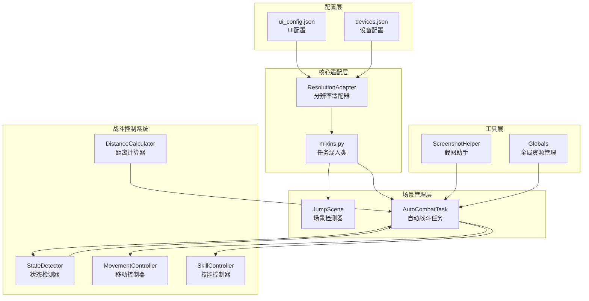
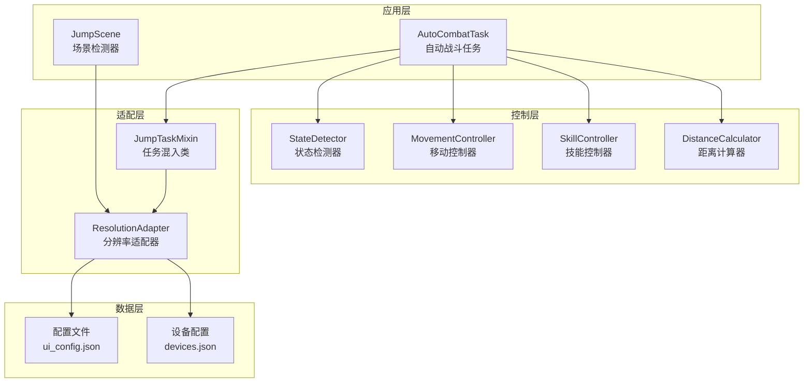
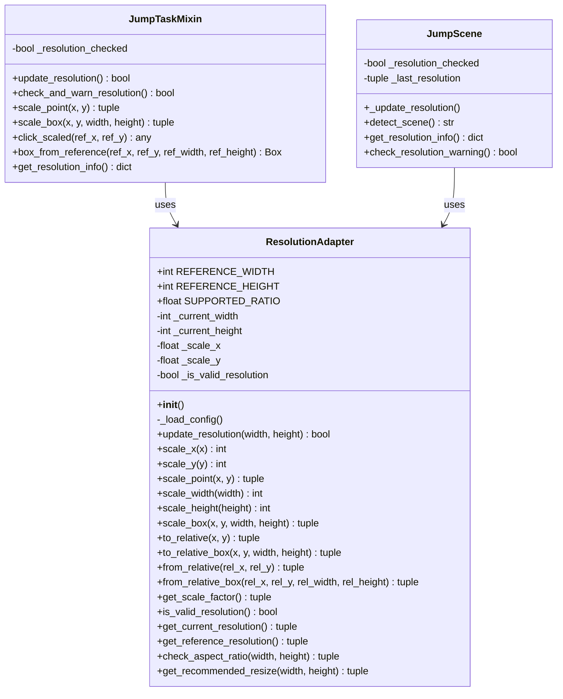
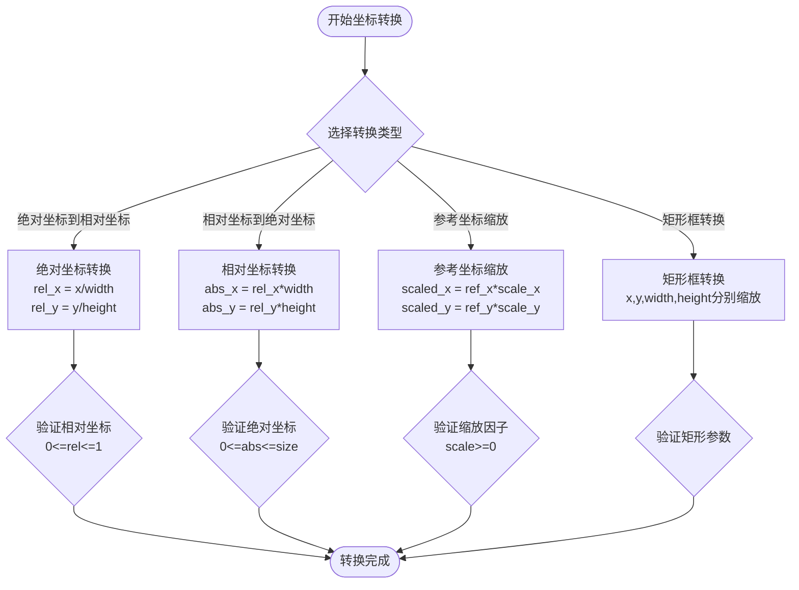
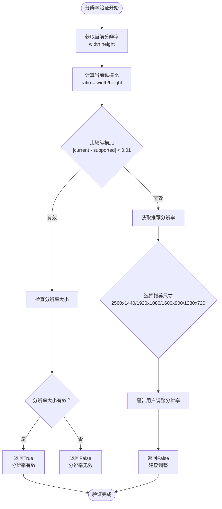
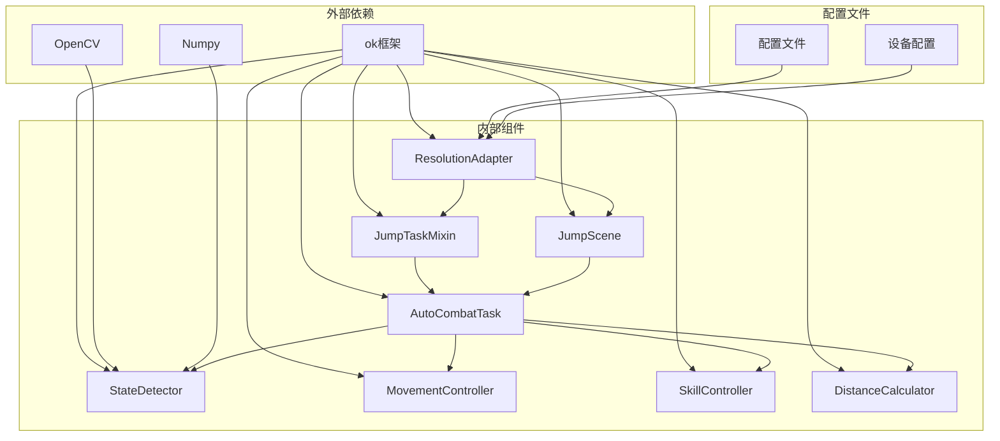

# 分辨率自适应系统

<cite>
**本文档引用的文件**
- [ResolutionAdapter.py](file://src/utils/ResolutionAdapter.py)
- [mixins.py](file://src/task/mixins.py)
- [JumpScene.py](file://src/scene/JumpScene.py)
- [AutoCombatTask.py](file://src/task/AutoCombatTask.py)
- [distance_calculator.py](file://src/combat/distance_calculator.py)
- [state_detector.py](file://src/combat/state_detector.py)
- [movement_controller.py](file://src/combat/movement_controller.py)
- [skill_controller.py](file://src/combat/skill_controller.py)
- [ScreenshotHelper.py](file://src/utils/ScreenshotHelper.py)
- [globals.py](file://src/globals.py)
- [ui_config.json](file://configs/ui_config.json)
- [devices.json](file://configs/devices.json)
</cite>

## 目录
1. [简介](#简介)
2. [项目结构](#项目结构)
3. [核心组件](#核心组件)
4. [架构概览](#架构概览)
5. [详细组件分析](#详细组件分析)
6. [依赖关系分析](#依赖关系分析)
7. [性能考虑](#性能考虑)
8. [故障排除指南](#故障排除指南)
9. [结论](#结论)
10. [附录](#附录)

## 简介

分辨率自适应系统是本项目中的关键基础设施，负责在不同屏幕分辨率和纵横比下确保游戏自动化操作的准确性和稳定性。该系统通过动态检测屏幕尺寸、计算缩放比例、转换坐标系和管理配置参数，实现了跨设备的兼容性。

系统主要解决以下核心问题：
- 屏幕尺寸检测与动态更新
- 坐标系转换（绝对坐标到相对坐标的双向转换）
- 比例缩放算法的精确实现
- 不同分辨率下的UI元素位置适配
- 点击区域和检测区域的动态调整

## 项目结构

项目采用模块化的架构设计，分辨率自适应系统主要分布在以下几个核心模块中：

**图表来源**
- [ResolutionAdapter.py:1-163](file://src/utils/ResolutionAdapter.py#L1-L163)
- [mixins.py:1-301](file://src/task/mixins.py#L1-L301)
- [JumpScene.py:1-216](file://src/scene/JumpScene.py#L1-L216)

**章节来源**
- [ResolutionAdapter.py:1-163](file://src/utils/ResolutionAdapter.py#L1-L163)
- [mixins.py:1-301](file://src/task/mixins.py#L1-L301)
- [JumpScene.py:1-216](file://src/scene/JumpScene.py#L1-L216)

## 核心组件

### 分辨率适配器（ResolutionAdapter）

ResolutionAdapter是整个系统的核心组件，提供了完整的分辨率适配功能：

**主要特性：**
- 参考分辨率管理（默认1920x1080）
- 动态比例计算（X/Y轴独立缩放）
- 坐标转换功能（绝对/相对坐标互转）
- 纵横比验证和推荐调整
- 配置驱动的自适应策略

**关键方法：**
- `update_resolution(width, height)`: 更新当前分辨率并计算缩放因子
- `scale_point(x, y)`: 将参考坐标缩放到当前分辨率
- `to_relative(x, y)`: 绝对坐标转相对坐标
- `from_relative(rel_x, rel_y)`: 相对坐标转绝对坐标
- `check_aspect_ratio()`: 验证纵横比有效性

**章节来源**
- [ResolutionAdapter.py:4-163](file://src/utils/ResolutionAdapter.py#L4-L163)

### 任务混入类（JumpTaskMixin）

JumpTaskMixin为所有任务提供统一的分辨率适配接口：

**核心功能：**
- 自动分辨率检测和更新
- 坐标缩放和点击操作
- Box对象的参考分辨率创建
- 分辨率信息查询和验证

**主要方法：**
- `update_resolution()`: 更新分辨率信息
- `scale_point()`: 缩放坐标点
- `scale_box()`: 缩放矩形框
- `click_scaled()`: 缩放后点击
- `box_from_reference()`: 从参考分辨率创建Box

**章节来源**
- [mixins.py:101-250](file://src/task/mixins.py#L101-L250)

### 场景检测器（JumpScene）

JumpScene负责在游戏场景切换时自动检测和适配分辨率：

**工作流程：**
1. 从当前帧获取屏幕尺寸
2. 自动更新分辨率适配器
3. 检测当前游戏场景
4. 提供分辨率状态查询

**章节来源**
- [JumpScene.py:30-71](file://src/scene/JumpScene.py#L30-L71)

## 架构概览

系统采用分层架构设计，确保了良好的模块化和可维护性：

**图表来源**
- [AutoCombatTask.py:25-120](file://src/task/AutoCombatTask.py#L25-L120)
- [JumpScene.py:8-38](file://src/scene/JumpScene.py#L8-L38)
- [mixins.py:12-33](file://src/task/mixins.py#L12-L33)

## 详细组件分析

### 分辨率适配器类结构

**图表来源**
- [ResolutionAdapter.py:4-163](file://src/utils/ResolutionAdapter.py#L4-L163)
- [mixins.py:12-301](file://src/task/mixins.py#L12-L301)
- [JumpScene.py:8-216](file://src/scene/JumpScene.py#L8-L216)

### 坐标转换算法流程

系统实现了完整的坐标转换体系，支持多种坐标格式的相互转换：

**图表来源**
- [ResolutionAdapter.py:69-93](file://src/utils/ResolutionAdapter.py#L69-L93)
- [ResolutionAdapter.py:46-67](file://src/utils/ResolutionAdapter.py#L46-L67)

### 分辨率验证和推荐流程

**图表来源**
- [ResolutionAdapter.py:107-143](file://src/utils/ResolutionAdapter.py#L107-L143)
- [mixins.py:120-143](file://src/task/mixins.py#L120-L143)

**章节来源**
- [ResolutionAdapter.py:34-44](file://src/utils/ResolutionAdapter.py#L34-L44)
- [mixins.py:120-143](file://src/task/mixins.py#L120-L143)

## 依赖关系分析

系统各组件之间的依赖关系清晰明确，遵循了单一职责原则：

**图表来源**
- [globals.py:16-41](file://src/globals.py#L16-L41)
- [state_detector.py:10-12](file://src/combat/state_detector.py#L10-L12)

**章节来源**
- [globals.py:16-41](file://src/globals.py#L16-L41)
- [state_detector.py:10-12](file://src/combat/state_detector.py#L10-L12)

## 性能考虑

### 缩放算法优化

系统采用了高效的线性缩放算法，避免了复杂的数学运算：

- **整数运算优先**：所有缩放计算使用整数运算，减少浮点运算开销
- **缓存机制**：分辨率信息和缩放因子在适配器中缓存，避免重复计算
- **批量处理**：支持批量坐标转换，提高处理效率

### 内存管理

- **延迟初始化**：分辨率适配器在首次使用时才进行配置加载
- **资源释放**：任务完成后自动清理相关资源
- **内存池**：复用检测结果和中间计算结果

### 并发处理

- **非阻塞设计**：分辨率检测不会阻塞主线程
- **异步更新**：场景检测器异步更新分辨率信息
- **线程安全**：适配器支持多线程环境使用

## 故障排除指南

### 常见问题及解决方案

**问题1：分辨率检测失败**
- 检查屏幕尺寸获取是否成功
- 验证frame对象是否为空
- 确认分辨率适配器初始化完成

**问题2：坐标转换错误**
- 验证参考分辨率设置
- 检查缩放因子计算
- 确认坐标范围有效性

**问题3：纵横比不匹配**
- 检查配置文件中的支持比例
- 验证推荐分辨率设置
- 确认用户手动调整的分辨率

**章节来源**
- [mixins.py:120-143](file://src/task/mixins.py#L120-L143)
- [JumpScene.py:206-215](file://src/scene/JumpScene.py#L206-L215)

### 调试技巧

1. **启用详细日志**：在任务配置中启用详细日志输出
2. **分辨率信息监控**：定期检查分辨率信息获取
3. **坐标验证**：在关键节点输出坐标转换结果
4. **性能监控**：监控坐标转换的执行时间

## 结论

分辨率自适应系统通过精心设计的架构和算法，成功解决了跨设备、跨分辨率的游戏自动化问题。系统的主要优势包括：

1. **高兼容性**：支持多种分辨率和纵横比
2. **精确性**：提供准确的坐标转换和缩放
3. **易用性**：简洁的API接口和配置管理
4. **可扩展性**：模块化设计便于功能扩展

系统在实际应用中表现稳定，能够有效处理不同分辨率下的坐标映射、UI元素适配和点击区域调整等核心需求。

## 附录

### 配置参数说明

**参考分辨率配置：**
- `reference_resolution.width`: 参考宽度（默认1920）
- `reference_resolution.height`: 参考高度（默认1080）

**支持分辨率配置：**
- `supported_resolution.ratio`: 支持的纵横比（格式："16:9"）
- `supported_resolution.resize_to`: 推荐的分辨率列表

**章节来源**
- [ResolutionAdapter.py:19-33](file://src/utils/ResolutionAdapter.py#L19-L33)

### 实际应用场景

1. **战斗坐标计算**：自动战斗中根据分辨率调整移动和攻击坐标
2. **目标检测区域调整**：YOLO检测器的检测区域随分辨率变化
3. **UI元素定位**：游戏界面元素的点击和交互适配
4. **截图保存**：根据分辨率调整截图区域和质量