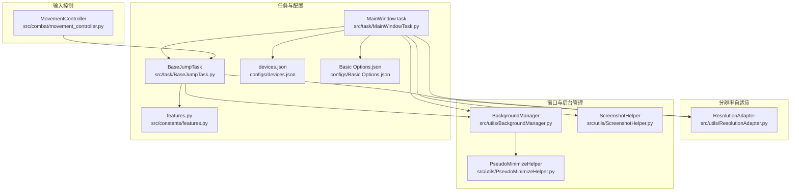
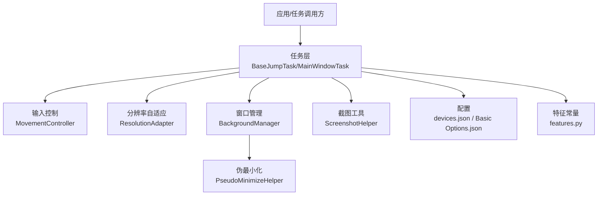
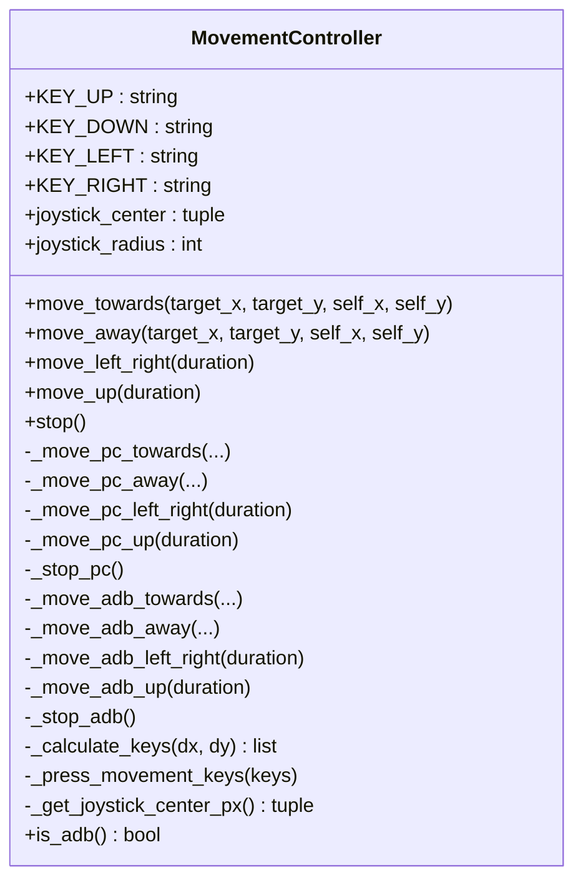
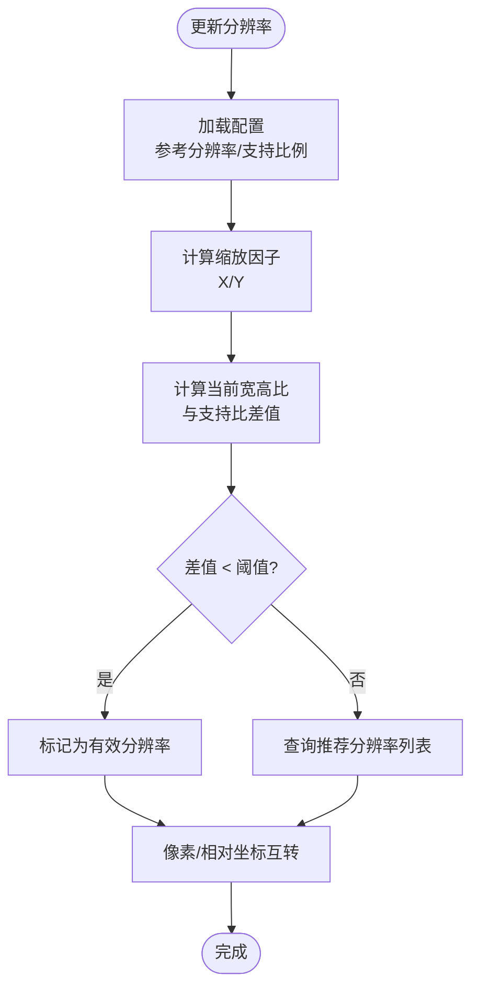
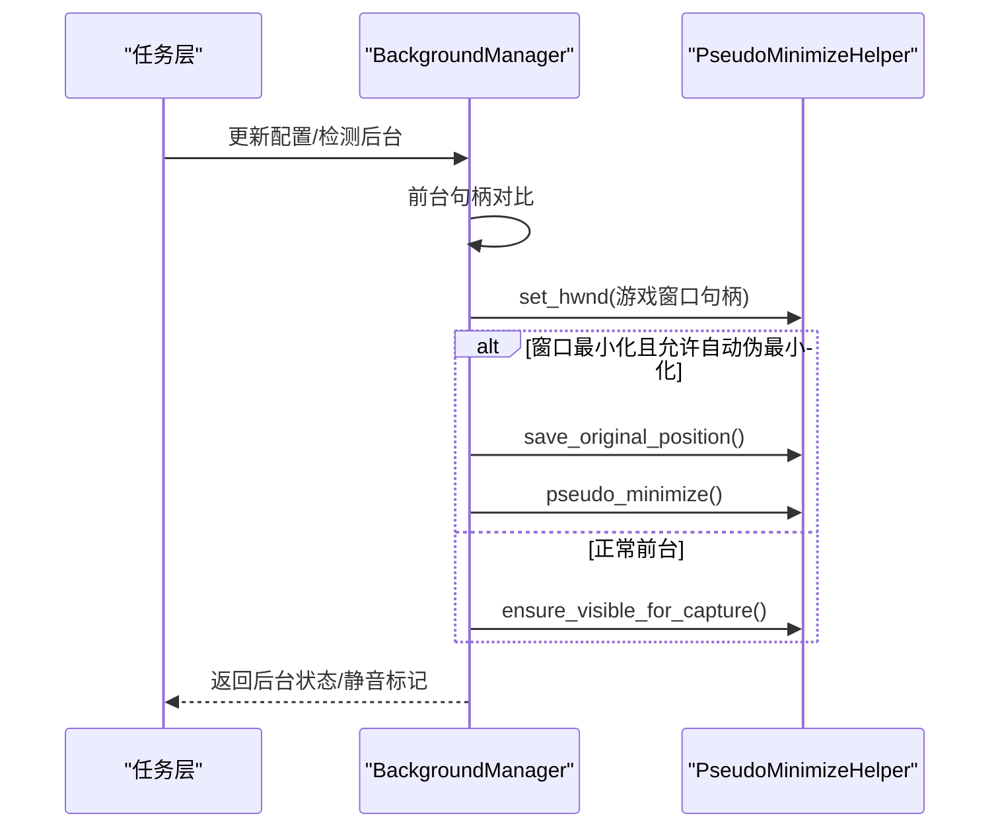
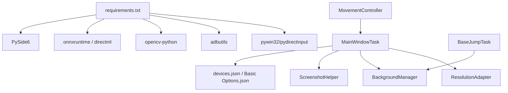

# 平台适配层

<cite>
**本文引用的文件**
- [src/utils/ResolutionAdapter.py](file://src/utils/ResolutionAdapter.py)
- [src/combat/movement_controller.py](file://src/combat/movement_controller.py)
- [src/task/MainWindowTask.py](file://src/task/MainWindowTask.py)
- [src/task/BaseJumpTask.py](file://src/task/BaseJumpTask.py)
- [src/utils/BackgroundManager.py](file://src/utils/BackgroundManager.py)
- [src/utils/PseudoMinimizeHelper.py](file://src/utils/PseudoMinimizeHelper.py)
- [src/utils/ScreenshotHelper.py](file://src/utils/ScreenshotHelper.py)
- [configs/devices.json](file://configs/devices.json)
- [configs/main_window.json](file://configs/main_window.json)
- [configs/Basic Options.json](file://configs/Basic Options.json)
- [src/constants/features.py](file://src/constants/features.py)
- [requirements.txt](file://requirements.txt)
</cite>

## 目录
1. [简介](#简介)
2. [项目结构](#项目结构)
3. [核心组件](#核心组件)
4. [架构总览](#架构总览)
5. [详细组件分析](#详细组件分析)
6. [依赖分析](#依赖分析)
7. [性能考虑](#性能考虑)
8. [故障排查指南](#故障排查指南)
9. [结论](#结论)
10. [附录](#附录)

## 简介
本文件面向“平台适配层”的技术文档，聚焦于以下能力：
- 输入控制：PC 端 WASD 键盘控制与移动端 ADB 设备虚拟摇杆控制
- 分辨率自适应：基于参考分辨率与宽高比的缩放与校验
- 窗口管理与后台模式：前台检测、静音策略、伪最小化与可见性保障
- 多显示器支持：通过窗口句柄与系统 API 实现跨屏定位与操作
- 平台优化与兼容：DirectML 推理、Windows 捕获方式、ADB 连接等
- 最佳实践与扩展：如何新增平台支持与优化现有适配

## 项目结构
平台适配层由“输入控制”“分辨率自适应”“窗口与后台管理”三大子系统构成，并通过任务层与工具层协同工作。

图表来源
- [src/combat/movement_controller.py:11-311](file://src/combat/movement_controller.py#L11-L311)
- [src/utils/ResolutionAdapter.py:4-163](file://src/utils/ResolutionAdapter.py#L4-L163)
- [src/utils/BackgroundManager.py:7-145](file://src/utils/BackgroundManager.py#L7-L145)
- [src/utils/PseudoMinimizeHelper.py:13-193](file://src/utils/PseudoMinimizeHelper.py#L13-L193)
- [src/utils/ScreenshotHelper.py:7-68](file://src/utils/ScreenshotHelper.py#L7-L68)
- [src/task/MainWindowTask.py:5-215](file://src/task/MainWindowTask.py#L5-L215)
- [src/task/BaseJumpTask.py:10-295](file://src/task/BaseJumpTask.py#L10-L295)
- [configs/devices.json:1-7](file://configs/devices.json#L1-L7)
- [configs/Basic Options.json:1-13](file://configs/Basic Options.json#L1-L13)
- [src/constants/features.py:9-86](file://src/constants/features.py#L9-L86)

章节来源
- [src/combat/movement_controller.py:11-311](file://src/combat/movement_controller.py#L11-L311)
- [src/utils/ResolutionAdapter.py:4-163](file://src/utils/ResolutionAdapter.py#L4-L163)
- [src/utils/BackgroundManager.py:7-145](file://src/utils/BackgroundManager.py#L7-L145)
- [src/utils/PseudoMinimizeHelper.py:13-193](file://src/utils/PseudoMinimizeHelper.py#L13-L193)
- [src/utils/ScreenshotHelper.py:7-68](file://src/utils/ScreenshotHelper.py#L7-L68)
- [src/task/MainWindowTask.py:5-215](file://src/task/MainWindowTask.py#L5-L215)
- [src/task/BaseJumpTask.py:10-295](file://src/task/BaseJumpTask.py#L10-L295)
- [configs/devices.json:1-7](file://configs/devices.json#L1-L7)
- [configs/Basic Options.json:1-13](file://configs/Basic Options.json#L1-L13)
- [src/constants/features.py:9-86](file://src/constants/features.py#L9-L86)

## 核心组件
- 输入控制（MovementController）
  - PC 端：根据目标与自身相对位置计算八方向键位，调用任务层按键 API 实现 WASD 控制
  - 移动端：以虚拟摇杆为中心点与半径，计算单位向量并映射为滑动距离，调用任务层 swipe API
  - 自动停止：在方向变化时先释放旧键，再按下新键，避免方向冲突
- 分辨率自适应（ResolutionAdapter）
  - 参考分辨率与支持宽高比可从配置加载；提供像素与相对坐标的双向转换、推荐重设分辨率
  - 提供当前与参考分辨率、缩放因子、比例校验与有效标记
- 窗口与后台管理（BackgroundManager + PseudoMinimizeHelper）
  - 前台检测：通过系统 API 获取前台窗口句柄并与游戏窗口句柄对比
  - 静音策略：后台时可自动静音
  - 伪最小化：将窗口移动至屏幕外坐标，保存原始尺寸与位置，支持恢复
  - 可见性保障：最小化或后台时自动触发伪最小化，保证后台截图可用
- 截图与模板导出（ScreenshotHelper）
  - 保存截图、导出特征模板、生成 COCO 注解条目
- 任务与配置（MainWindowTask、BaseJumpTask、配置文件）
  - MainWindowTask：窗口检测、截图测试、分辨率检查、后台模式信息输出
  - BaseJumpTask：登录等待、场景检测、伪最小化接口、等待条件等通用能力
  - 配置：devices.json（首选平台、捕获方式、窗口句柄）、Basic Options.json（后台模式、静音、捕获方式等）

章节来源
- [src/combat/movement_controller.py:11-311](file://src/combat/movement_controller.py#L11-L311)
- [src/utils/ResolutionAdapter.py:4-163](file://src/utils/ResolutionAdapter.py#L4-L163)
- [src/utils/BackgroundManager.py:7-145](file://src/utils/BackgroundManager.py#L7-L145)
- [src/utils/PseudoMinimizeHelper.py:13-193](file://src/utils/PseudoMinimizeHelper.py#L13-L193)
- [src/utils/ScreenshotHelper.py:7-68](file://src/utils/ScreenshotHelper.py#L7-L68)
- [src/task/MainWindowTask.py:5-215](file://src/task/MainWindowTask.py#L5-L215)
- [src/task/BaseJumpTask.py:10-295](file://src/task/BaseJumpTask.py#L10-L295)
- [configs/devices.json:1-7](file://configs/devices.json#L1-L7)
- [configs/Basic Options.json:1-13](file://configs/Basic Options.json#L1-L13)

## 架构总览
平台适配层围绕“任务层”组织，输入控制与分辨率自适应直接依赖任务层提供的帧、窗口句柄与输入 API；窗口管理通过系统 API 与伪最小化实现跨屏与后台稳定运行。

图表来源
- [src/task/BaseJumpTask.py:10-295](file://src/task/BaseJumpTask.py#L10-L295)
- [src/task/MainWindowTask.py:5-215](file://src/task/MainWindowTask.py#L5-L215)
- [src/combat/movement_controller.py:11-311](file://src/combat/movement_controller.py#L11-L311)
- [src/utils/ResolutionAdapter.py:4-163](file://src/utils/ResolutionAdapter.py#L4-L163)
- [src/utils/BackgroundManager.py:7-145](file://src/utils/BackgroundManager.py#L7-L145)
- [src/utils/PseudoMinimizeHelper.py:13-193](file://src/utils/PseudoMinimizeHelper.py#L13-L193)
- [src/utils/ScreenshotHelper.py:7-68](file://src/utils/ScreenshotHelper.py#L7-L68)
- [configs/devices.json:1-7](file://configs/devices.json#L1-L7)
- [configs/Basic Options.json:1-13](file://configs/Basic Options.json#L1-L13)
- [src/constants/features.py:9-86](file://src/constants/features.py#L9-L86)

## 详细组件分析

### 输入控制：WASD 键盘与 ADB 虚拟摇杆
- PC 端 WASD 控制
  - 依据目标与自身相对位置计算方向角，映射为上下左右键集合，按键按下持续期间保持移动
  - 方向变化时先释放旧键，再按新键，避免冲突
- 移动端 ADB 虚拟摇杆
  - 以屏幕左下角相对位置为摇杆中心，半径固定；根据目标方向计算单位向量并缩放为像素位移
  - 通过 swipe 接口执行短时滑动，实现“持续移动”效果
- ADB 检测
  - 通过任务层 is_adb 方法判断当前平台类型，动态分派不同输入路径

图表来源
- [src/combat/movement_controller.py:11-311](file://src/combat/movement_controller.py#L11-L311)

章节来源
- [src/combat/movement_controller.py:11-311](file://src/combat/movement_controller.py#L11-L311)

### 分辨率自适应：参考分辨率与宽高比
- 参考分辨率与支持比例
  - 可从配置读取参考分辨率与支持宽高比；默认 1920x1080 与 16:9
- 缩放与转换
  - 提供 X/Y 缩放因子、像素坐标与相对坐标的双向转换、矩形框缩放
- 比例校验与建议重设
  - 计算当前宽高比与支持比差异，超过阈值则判定无效；提供推荐分辨率列表
- 任务层集成
  - MainWindowTask 在窗口检测后调用分辨率检查，输出当前/参考分辨率与缩放比，并给出建议

图表来源
- [src/utils/ResolutionAdapter.py:19-143](file://src/utils/ResolutionAdapter.py#L19-L143)
- [src/task/MainWindowTask.py:149-166](file://src/task/MainWindowTask.py#L149-L166)

章节来源
- [src/utils/ResolutionAdapter.py:4-163](file://src/utils/ResolutionAdapter.py#L4-L163)
- [src/task/MainWindowTask.py:149-166](file://src/task/MainWindowTask.py#L149-L166)

### 窗口管理与后台模式：前台检测、静音与伪最小化
- 前台检测
  - 通过系统 API 获取前台窗口句柄并与游戏窗口句柄比较，缓存检测结果
- 静音策略
  - 若启用后台时静音，则在后台状态下标记静音
- 伪最小化
  - 将窗口移动到屏幕外坐标，保存原始尺寸与位置；支持恢复与切换
  - 当窗口最小化且开启自动伪最小化时，自动保存原位置并执行伪最小化
- 可见性保障
  - 确保后台截图可用，必要时触发伪最小化

图表来源
- [src/utils/BackgroundManager.py:33-118](file://src/utils/BackgroundManager.py#L33-L118)
- [src/utils/PseudoMinimizeHelper.py:78-173](file://src/utils/PseudoMinimizeHelper.py#L78-L173)

章节来源
- [src/utils/BackgroundManager.py:7-145](file://src/utils/BackgroundManager.py#L7-L145)
- [src/utils/PseudoMinimizeHelper.py:13-193](file://src/utils/PseudoMinimizeHelper.py#L13-L193)
- [src/task/MainWindowTask.py:167-196](file://src/task/MainWindowTask.py#L167-L196)

### 截图与模板导出
- 截图保存：按时间戳命名，自动创建目录
- 特征模板导出：从帧中裁剪指定区域并保存到 features 子目录
- COCO 注解：生成单张图片与标注条目的字典结构，便于数据集构建

章节来源
- [src/utils/ScreenshotHelper.py:7-68](file://src/utils/ScreenshotHelper.py#L7-L68)

## 依赖分析
- 外部依赖
  - Windows 捕获与输入：pywin32、pydirectinput
  - ADB：adbutils
  - 图像与推理：opencv-python、onnxruntime、onnxruntime-directml
  - GUI：PySide6
- 内部依赖
  - 任务层依赖分辨率自适应与窗口管理；输入控制依赖任务层的帧与输入 API
  - 配置文件驱动行为：devices.json 决定捕获方式与平台偏好；Basic Options.json 决定后台模式、静音与捕获方式

图表来源
- [requirements.txt:1-13](file://requirements.txt#L1-L13)
- [src/task/MainWindowTask.py:5-215](file://src/task/MainWindowTask.py#L5-L215)
- [src/utils/ResolutionAdapter.py:4-163](file://src/utils/ResolutionAdapter.py#L4-L163)
- [src/utils/BackgroundManager.py:7-145](file://src/utils/BackgroundManager.py#L7-L145)
- [src/combat/movement_controller.py:11-311](file://src/combat/movement_controller.py#L11-L311)
- [src/utils/ScreenshotHelper.py:7-68](file://src/utils/ScreenshotHelper.py#L7-L68)
- [configs/devices.json:1-7](file://configs/devices.json#L1-L7)
- [configs/Basic Options.json:1-13](file://configs/Basic Options.json#L1-L13)

章节来源
- [requirements.txt:1-13](file://requirements.txt#L1-L13)
- [src/task/MainWindowTask.py:5-215](file://src/task/MainWindowTask.py#L5-L215)
- [configs/devices.json:1-7](file://configs/devices.json#L1-L7)
- [configs/Basic Options.json:1-13](file://configs/Basic Options.json#L1-L13)

## 性能考虑
- 输入控制
  - PC 端按键释放与按下顺序避免冲突，减少误触；移动端滑动采用短时滑动，降低长按带来的累积误差
- 分辨率自适应
  - 缩放与比例校验为纯数学运算，开销极低；建议在分辨率变更时统一更新缩放因子
- 窗口管理
  - 前台检测带缓存，避免频繁系统调用；伪最小化仅在必要时执行，减少窗口状态切换
- 截图与推理
  - DirectML 推理可提升 ONNX 性能；后台截图时优先使用伪最小化，避免窗口状态抖动

## 故障排查指南
- 无法检测到游戏窗口
  - 检查 devices.json 中捕获方式与窗口句柄；确认窗口标题关键词与模拟器包名匹配
- 分辨率比例不正确
  - 查看 MainWindowTask 输出的当前/参考分辨率与缩放比；根据建议分辨率调整
- 后台截图失败或黑屏
  - 确认后台模式与伪最小化开关；检查是否最小化且允许自动伪最小化
- ADB 移动端滑动无效
  - 确认 is_adb 返回为真；检查摇杆中心与半径配置；验证 swipe API 可用
- OCR/特征识别不稳定
  - 检查 Basic Options 中捕获方式与 DirectML 设置；核对 features.py 中特征名称与配置一致

章节来源
- [src/task/MainWindowTask.py:121-196](file://src/task/MainWindowTask.py#L121-L196)
- [configs/devices.json:1-7](file://configs/devices.json#L1-L7)
- [configs/Basic Options.json:1-13](file://configs/Basic Options.json#L1-L13)
- [src/constants/features.py:9-86](file://src/constants/features.py#L9-L86)

## 结论
平台适配层通过“输入控制—分辨率自适应—窗口管理”三轴协同，实现了 PC 端 WASD 与移动端 ADB 虚拟摇杆的统一抽象，配合后台模式与伪最小化，确保跨平台、跨显示器的稳定运行。结合配置驱动与任务层封装，具备良好的可扩展性与可维护性。

## 附录

### 平台特定优化与兼容性处理
- Windows 捕获
  - 通过 Basic Options.json 中的捕获方式配置，支持不同捕获后端
- DirectML 推理
  - 在 Basic Options.json 中启用 DirectML，提升 ONNX 推理性能
- ADB 连接
  - 通过 devices.json 指定捕获方式与平台偏好，确保移动端输入与截图路径正确

章节来源
- [configs/Basic Options.json:1-13](file://configs/Basic Options.json#L1-L13)
- [configs/devices.json:1-7](file://configs/devices.json#L1-L7)
- [requirements.txt:1-13](file://requirements.txt#L1-L13)

### 跨平台开发最佳实践
- 抽象输入接口
  - 以 is_adb 判定平台，分别实现键盘与虚拟摇杆逻辑，避免平台耦合
- 配置驱动行为
  - 将分辨率、捕获方式、后台策略等放入 JSON 配置，便于快速切换与调试
- 状态缓存与幂等
  - 前台检测与伪最小化状态应缓存并幂等执行，减少系统调用与状态抖动
- 日志与可观测性
  - MainWindowTask 输出分辨率与后台状态，便于问题定位

章节来源
- [src/combat/movement_controller.py:41-43](file://src/combat/movement_controller.py#L41-L43)
- [src/task/MainWindowTask.py:149-196](file://src/task/MainWindowTask.py#L149-L196)

### 扩展新平台支持与优化建议
- 新增平台步骤
  - 在任务层添加 is_new_platform 方法并返回布尔值
  - 在输入控制中新增分支，实现新平台的输入映射（如手柄、触控板）
  - 在分辨率自适应中补充该平台的参考分辨率与比例
  - 在窗口管理中评估是否需要新的后台策略（如新平台的最小化语义）
- 优化建议
  - 将平台差异收敛到适配层，业务逻辑保持纯净
  - 为新平台提供默认配置项并在配置文件中预留键位
  - 引入单元测试覆盖关键流程（输入映射、分辨率转换、后台状态切换）

章节来源
- [src/combat/movement_controller.py:41-43](file://src/combat/movement_controller.py#L41-L43)
- [src/utils/ResolutionAdapter.py:19-42](file://src/utils/ResolutionAdapter.py#L19-L42)
- [src/utils/BackgroundManager.py:18-23](file://src/utils/BackgroundManager.py#L18-L23)