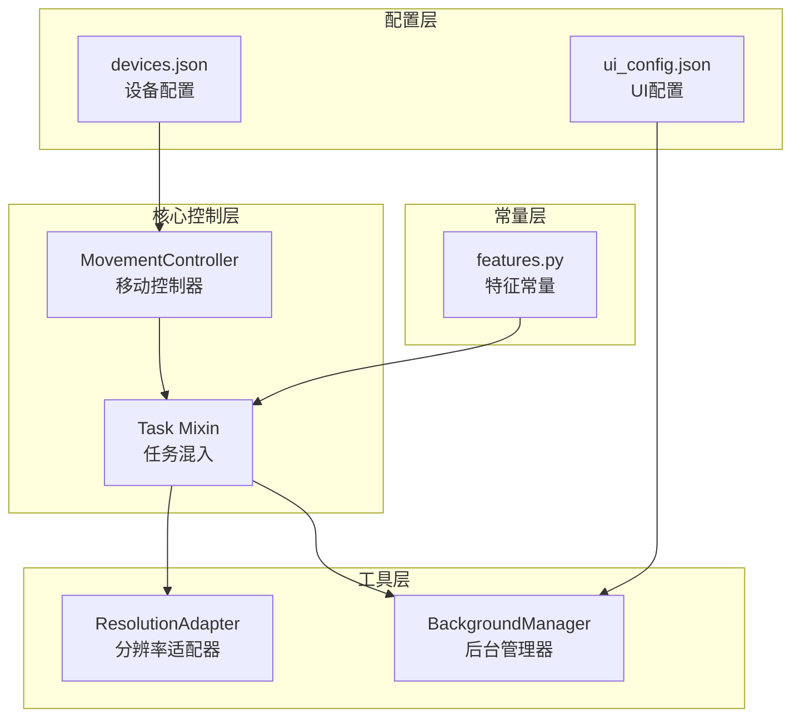
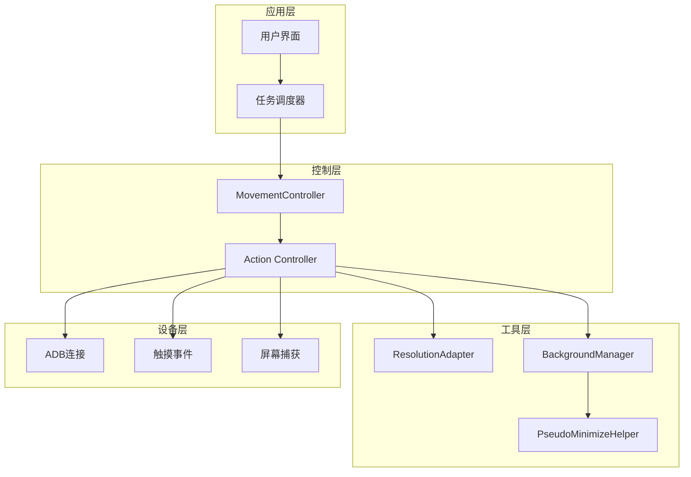
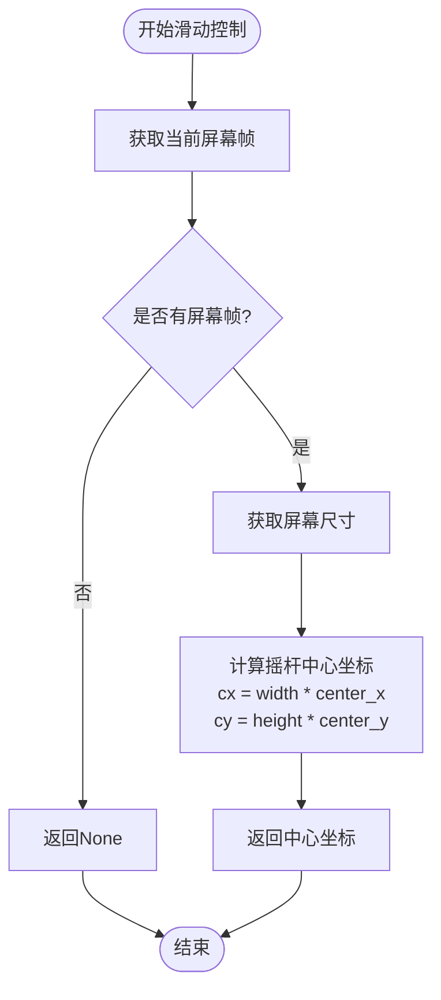
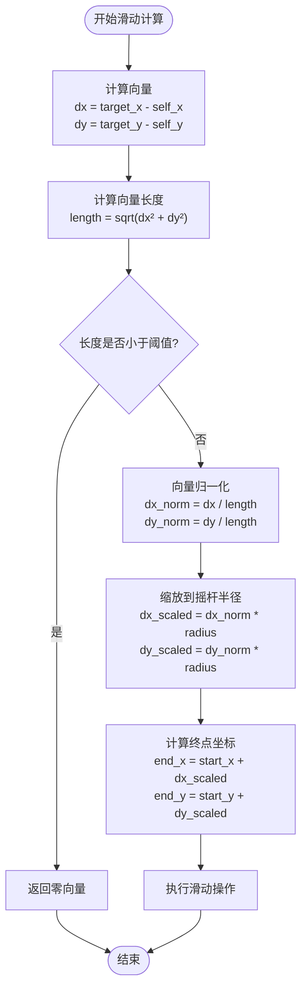
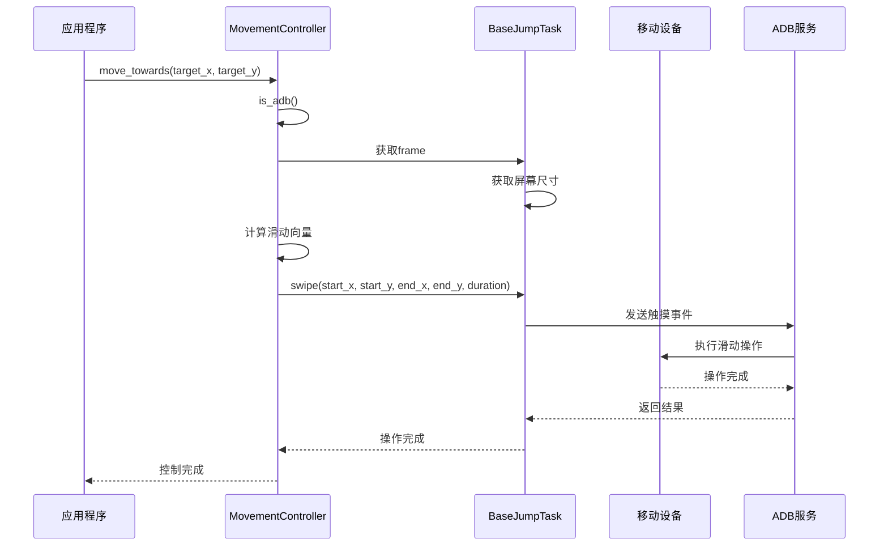
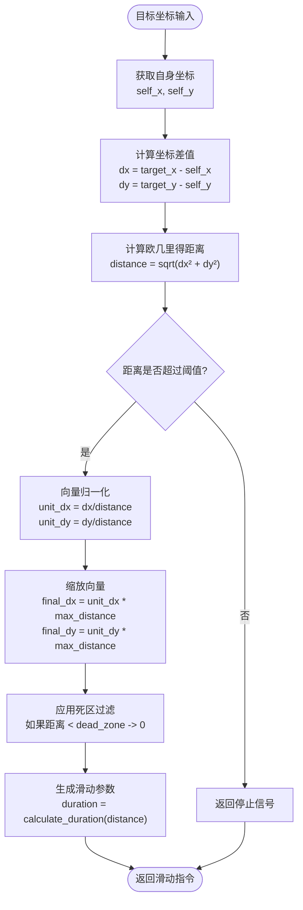
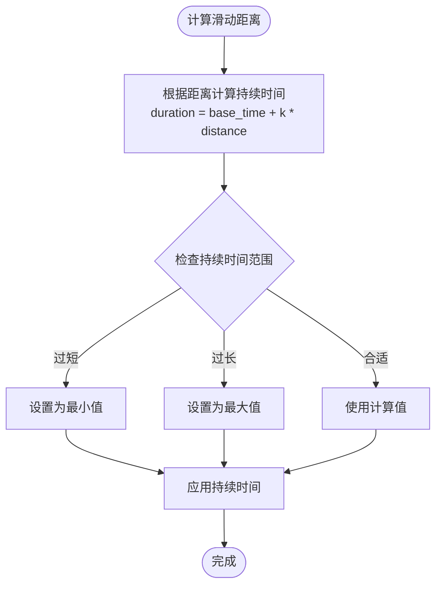
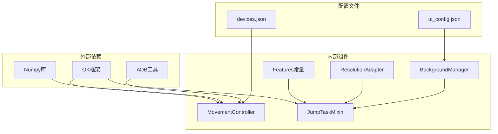

# 移动端输入控制

<cite>
**本文档引用的文件**
- [movement_controller.py](file://src/combat/movement_controller.py)
- [BaseJumpTask.py](file://src/task/BaseJumpTask.py)
- [mixins.py](file://src/task/mixins.py)
- [ResolutionAdapter.py](file://src/utils/ResolutionAdapter.py)
- [BackgroundManager.py](file://src/utils/BackgroundManager.py)
- [features.py](file://src/constants/features.py)
- [devices.json](file://configs/devices.json)
- [ui_config.json](file://configs/ui_config.json)
</cite>

## 目录
1. [简介](#简介)
2. [项目结构](#项目结构)
3. [核心组件](#核心组件)
4. [架构概览](#架构概览)
5. [详细组件分析](#详细组件分析)
6. [依赖关系分析](#依赖关系分析)
7. [性能考虑](#性能考虑)
8. [故障排除指南](#故障排除指南)
9. [结论](#结论)

## 简介

移动端输入控制系统是一个专为移动设备设计的游戏自动化框架，主要针对移动端游戏中的角色控制需求。该系统提供了两种控制模式：PC端的WASD键盘控制和移动端的虚拟摇杆滑动控制。

系统的核心功能包括：
- **虚拟摇杆滑动控制**：实现移动端角色的精确移动控制
- **ADB模式支持**：通过ADB连接实现真机控制
- **分辨率自适应**：支持不同分辨率屏幕的坐标转换
- **后台模式兼容**：支持游戏窗口最小化或被遮挡时的正常运行

## 项目结构

该项目采用模块化的架构设计，主要分为以下几个核心模块：

**图表来源**
- [movement_controller.py:1-311](file://src/combat/movement_controller.py#L1-L311)
- [mixins.py:1-301](file://src/task/mixins.py#L1-L301)
- [ResolutionAdapter.py:1-163](file://src/utils/ResolutionAdapter.py#L1-L163)

**章节来源**
- [movement_controller.py:1-311](file://src/combat/movement_controller.py#L1-L311)
- [mixins.py:1-301](file://src/task/mixins.py#L1-L301)

## 核心组件

### 移动控制器 (MovementController)

移动控制器是整个系统的核心组件，负责处理不同平台的输入控制逻辑。它支持两种控制模式：

#### PC端控制模式
- **WASD键盘映射**：将方向向量转换为对应的键盘按键
- **八方向移动**：支持上、下、左、右以及四个对角线方向
- **实时按键管理**：动态处理按键的按下和释放

#### 移动端控制模式
- **虚拟摇杆系统**：基于屏幕坐标系的滑动控制
- **归一化处理**：将任意方向向量转换为固定半径的滑动
- **ADB模式集成**：通过ADB连接实现真机控制

**章节来源**
- [movement_controller.py:11-311](file://src/combat/movement_controller.py#L11-L311)

### 任务混入 (JumpTaskMixin)

任务混入类提供了所有任务共享的通用功能，消除了代码重复：

#### 分辨率适配功能
- **坐标缩放**：将参考分辨率下的坐标转换为当前分辨率
- **比例检查**：验证当前分辨率是否符合支持的比例要求
- **推荐分辨率**：根据当前屏幕尺寸推荐合适的分辨率

#### 后台模式支持
- **窗口状态检测**：监控游戏窗口是否在后台运行
- **自动伪最小化**：当游戏窗口被最小化时自动处理
- **静音控制**：在后台模式下自动静音游戏音频

**章节来源**
- [mixins.py:12-301](file://src/task/mixins.py#L12-L301)

## 架构概览

系统采用分层架构设计，各层职责明确，耦合度低：

**图表来源**
- [movement_controller.py:26-43](file://src/combat/movement_controller.py#L26-L43)
- [mixins.py:101-198](file://src/task/mixins.py#L101-L198)
- [BackgroundManager.py:18-134](file://src/utils/BackgroundManager.py#L18-L134)

## 详细组件分析

### 虚拟摇杆滑动控制算法

虚拟摇杆滑动控制是移动端输入系统的核心算法，实现了从目标坐标到滑动向量的精确转换。

#### 摇杆中心定位算法

摇杆中心位置采用相对坐标系统，支持不同分辨率屏幕的自适应：

**图表来源**
- [movement_controller.py:226-235](file://src/combat/movement_controller.py#L226-L235)

#### 半径计算与归一化处理

滑动半径的计算采用了向量归一化算法，确保滑动强度的一致性：

**图表来源**
- [movement_controller.py:248-261](file://src/combat/movement_controller.py#L248-L261)

#### 滑动轨迹生成机制

滑动轨迹的生成遵循以下原则：
- **起点固定**：始终从摇杆中心开始滑动
- **方向精确**：严格按照目标方向生成轨迹
- **距离可控**：通过半径大小控制滑动距离
- **时间优化**：滑动持续时间固定为0.1秒

**章节来源**
- [movement_controller.py:237-284](file://src/combat/movement_controller.py#L237-L284)

### ADB模式移动控制机制

ADB模式通过USB连接实现真机控制，提供了更真实的交互体验：

#### 屏幕坐标转换流程

ADB模式下的坐标转换需要考虑多个层面的坐标系统：

**图表来源**
- [movement_controller.py:45-56](file://src/combat/movement_controller.py#L45-L56)
- [movement_controller.py:261](file://src/combat/movement_controller.py#L261)

#### 滑动距离计算算法

ADB模式下的滑动距离计算采用了标准化的数学公式：

| 参数 | 说明 | 计算公式 |
|------|------|----------|
| dx | X轴方向偏移 | `dx = target_x - self_x` |
| dy | Y轴方向偏移 | `dy = target_y - self_y` |
| length | 向量长度 | `length = sqrt(dx² + dy²)` |
| normalized_dx | 归一化X分量 | `normalized_dx = dx / length` |
| normalized_dy | 归一化Y分量 | `normalized_dy = dy / length` |
| scaled_dx | 缩放后X分量 | `scaled_dx = normalized_dx * radius` |
| scaled_dy | 缩放后Y分量 | `scaled_dy = normalized_dy * radius` |

#### 触摸事件模拟实现

ADB模式通过以下步骤实现触摸事件的模拟：

1. **事件序列构建**：创建完整的触摸事件序列
2. **坐标转换**：将逻辑坐标转换为设备屏幕坐标
3. **事件发送**：通过ADB服务发送触摸事件
4. **状态同步**：确保事件执行的时序正确

**章节来源**
- [movement_controller.py:237-310](file://src/combat/movement_controller.py#L237-L310)

### 移动端控制核心算法

移动端控制算法的核心在于如何将抽象的目标坐标转换为具体的滑动操作。

#### 目标坐标到滑动向量的转换

**图表来源**
- [movement_controller.py:248-261](file://src/combat/movement_controller.py#L248-L261)

#### 归一化处理策略

归一化处理确保了滑动强度的一致性：

1. **向量计算**：`vector = (dx, dy)`
2. **长度计算**：`length = ||vector|| = sqrt(dx² + dy²)`
3. **归一化**：`unit_vector = vector / length`
4. **缩放应用**：`scaled_vector = unit_vector * radius`

#### 滑动持续时间控制

滑动持续时间的控制采用了动态调节策略：

**章节来源**
- [movement_controller.py:256-261](file://src/combat/movement_controller.py#L256-L261)

### 配置参数说明

系统提供了丰富的配置参数来支持不同的使用场景：

#### 虚拟摇杆配置参数

| 参数名称 | 默认值 | 单位 | 说明 | 作用域 |
|----------|--------|------|------|--------|
| joystick_center[0] | 0.15 | 相对坐标 | 摇杆中心X坐标相对位置 | 移动端控制 |
| joystick_center[1] | 0.7 | 相对坐标 | 摇杆中心Y坐标相对位置 | 移动端控制 |
| joystick_radius | 50 | 像素 | 摇杆半径大小 | 移动端控制 |
| dead_zone | 10 | 像素 | 死区阈值，避免微小移动 | 移动端控制 |
| max_move_distance | 100 | 像素 | 最大移动距离 | 移动端控制 |

#### 设备配置参数

| 参数名称 | 默认值 | 说明 | 文件 |
|----------|--------|------|------|
| preferred | pc | 首选设备类型 | devices.json |
| capture | windows | 屏幕捕获方式 | devices.json |
| pc_full_path | 空路径 | PC游戏路径 | devices.json |

#### UI配置参数

| 参数名称 | 默认值 | 说明 | 文件 |
|----------|--------|------|------|
| DpiScale | Auto | DPI缩放设置 | ui_config.json |
| ThemeMode | Dark | 主题模式 | ui_config.json |
| ThemeColor | #ff009faa | 主题颜色 | ui_config.json |

**章节来源**
- [movement_controller.py:37-39](file://src/combat/movement_controller.py#L37-L39)
- [devices.json:1-7](file://configs/devices.json#L1-L7)
- [ui_config.json:1-17](file://configs/ui_config.json#L1-L17)

## 依赖关系分析

系统采用松耦合的设计，各组件之间的依赖关系清晰明确：

**图表来源**
- [movement_controller.py:7-8](file://src/combat/movement_controller.py#L7-L8)
- [mixins.py:7-9](file://src/task/mixins.py#L7-L9)
- [BackgroundManager.py:3](file://src/utils/BackgroundManager.py#L3)

### 组件耦合度分析

系统在设计时充分考虑了组件间的解耦：

- **MovementController**：只依赖于任务接口，不直接依赖具体实现
- **JumpTaskMixin**：提供通用功能，不包含业务逻辑
- **ResolutionAdapter**：独立的工具类，无业务依赖
- **BackgroundManager**：管理后台模式，不影响核心控制逻辑

**章节来源**
- [movement_controller.py:33-43](file://src/combat/movement_controller.py#L33-L43)
- [mixins.py:29-33](file://src/task/mixins.py#L29-L33)

## 性能考虑

系统在性能优化方面采用了多种策略：

### 内存管理优化

1. **延迟加载**：分辨率适配器只有在需要时才更新
2. **缓存机制**：后台模式状态和窗口信息进行缓存
3. **资源释放**：及时释放不再使用的资源

### 计算效率优化

1. **向量化计算**：使用Numpy进行高效的数值计算
2. **算法简化**：采用简化的数学公式减少计算复杂度
3. **条件优化**：通过早期退出减少不必要的计算

### 网络通信优化

1. **批量操作**：将多个触摸事件合并执行
2. **异步处理**：非阻塞的事件处理机制
3. **连接复用**：复用ADB连接避免频繁建立连接

## 故障排除指南

### 常见问题及解决方案

#### ADB连接问题

**问题描述**：无法通过ADB连接移动设备
**可能原因**：
- USB调试未开启
- ADB驱动未安装
- 设备授权未确认

**解决步骤**：
1. 检查设备的USB调试设置
2. 确认ADB驱动正确安装
3. 在设备上确认USB调试授权

#### 坐标转换错误

**问题描述**：滑动位置与预期不符
**可能原因**：
- 分辨率适配器未正确初始化
- 屏幕旋转导致坐标偏差
- 摇杆中心位置配置错误

**解决步骤**：
1. 调用`update_resolution()`更新分辨率信息
2. 检查屏幕旋转状态
3. 调整摇杆中心配置参数

#### 滑动响应迟缓

**问题描述**：滑动操作响应慢或不稳定
**可能原因**：
- 滑动持续时间过长
- 设备性能不足
- 系统负载过高

**解决步骤**：
1. 减少滑动持续时间
2. 关闭不必要的后台应用
3. 降低系统负载

**章节来源**
- [mixins.py:120-143](file://src/task/mixins.py#L120-L143)
- [BackgroundManager.py:36-65](file://src/utils/BackgroundManager.py#L36-L65)

## 结论

移动端输入控制系统通过精心设计的架构和算法，成功实现了跨平台的移动控制功能。系统的主要优势包括：

### 技术优势

1. **算法先进性**：采用向量归一化和坐标转换算法，确保控制精度
2. **架构合理性**：分层设计降低了组件间的耦合度
3. **扩展性强**：模块化设计便于功能扩展和维护

### 实际应用价值

1. **多平台支持**：同时支持PC端和移动端的控制需求
2. **配置灵活**：丰富的配置参数适应不同使用场景
3. **性能稳定**：优化的算法和数据结构保证了系统的稳定性

### 未来发展方向

1. **AI智能控制**：集成机器学习算法实现更智能的移动控制
2. **手势识别**：支持更复杂的触摸手势识别
3. **云端同步**：实现配置和状态的云端同步功能

该系统为移动端游戏自动化提供了一个坚实的技术基础，具有良好的扩展性和实用性。