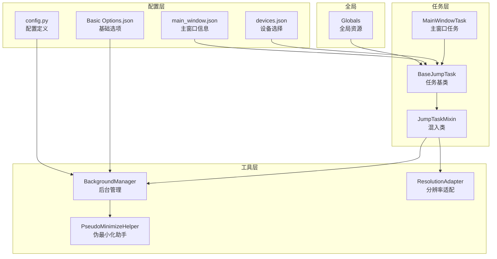
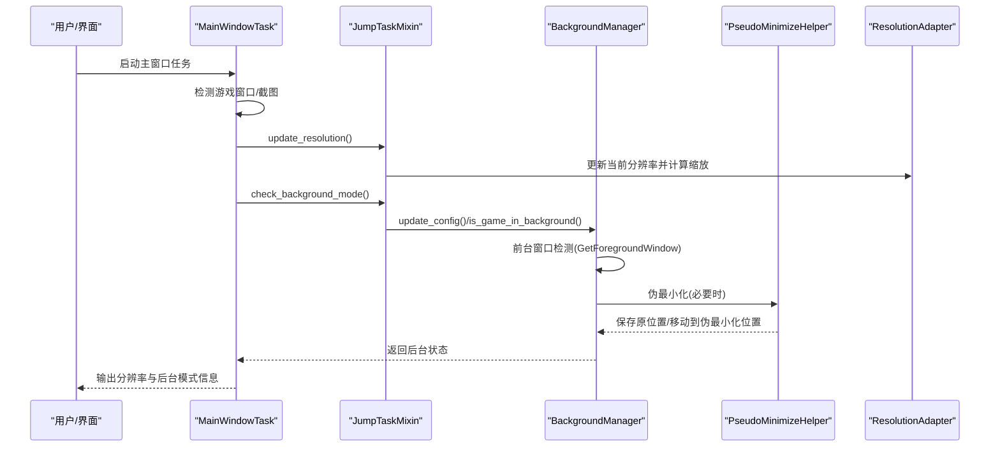
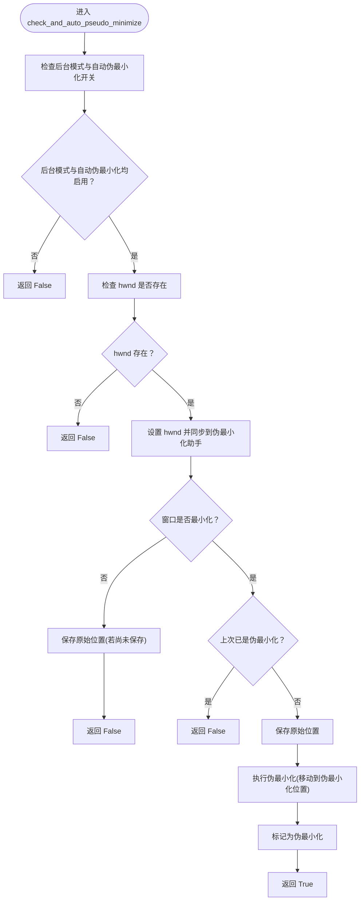
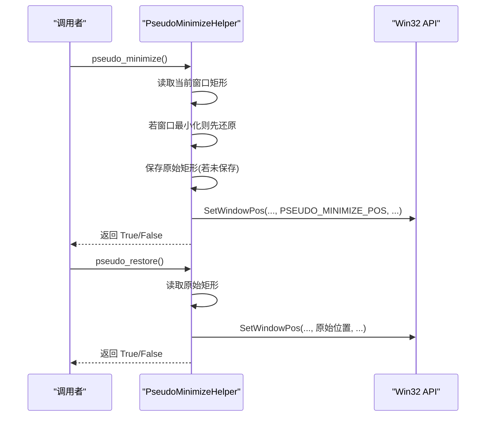
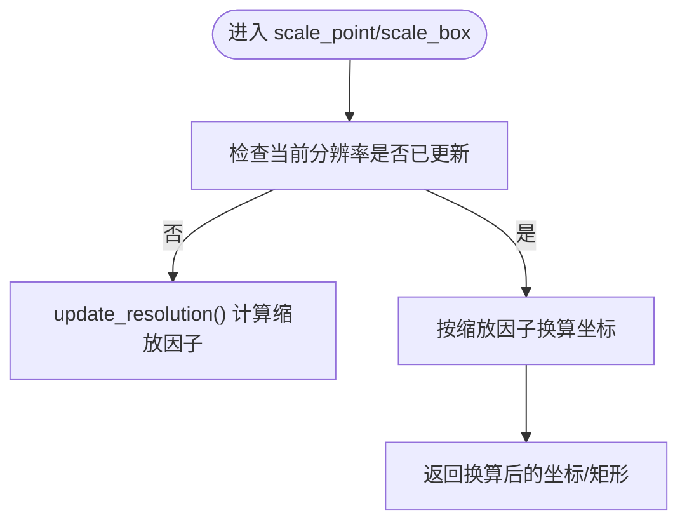
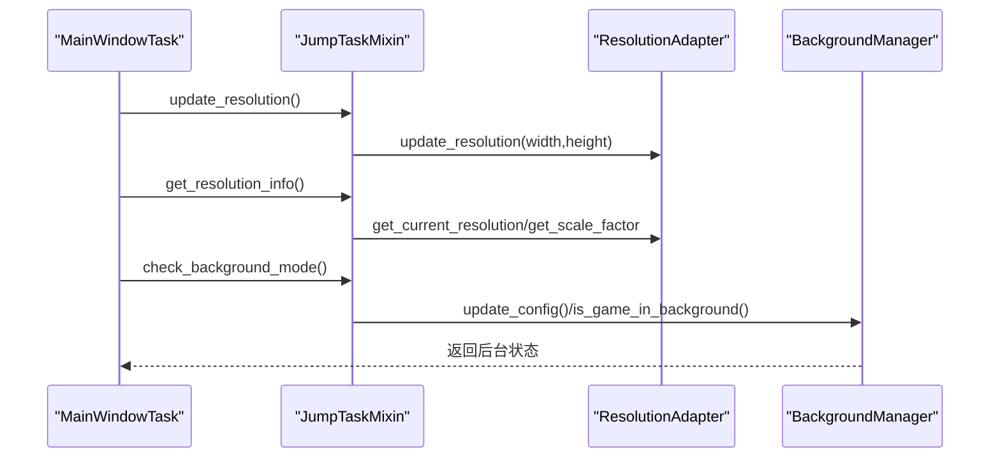
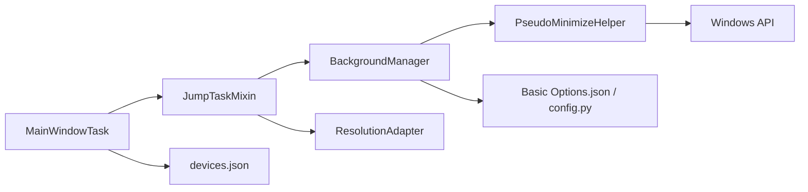

# 窗口管理机制

<cite>
**本文引用的文件**
- [src/globals.py](file://src/globals.py)
- [src/utils/BackgroundManager.py](file://src/utils/BackgroundManager.py)
- [src/utils/PseudoMinimizeHelper.py](file://src/utils/PseudoMinimizeHelper.py)
- [src/utils/ResolutionAdapter.py](file://src/utils/ResolutionAdapter.py)
- [src/task/mixins.py](file://src/task/mixins.py)
- [src/task/BaseJumpTask.py](file://src/task/BaseJumpTask.py)
- [src/task/MainWindowTask.py](file://src/task/MainWindowTask.py)
- [configs/Basic Options.json](file://configs/Basic Options.json)
- [configs/devices.json](file://configs/devices.json)
- [configs/main_window.json](file://configs/main_window.json)
- [config.py](file://config.py)
</cite>

## 目录
1. [简介](#简介)
2. [项目结构](#项目结构)
3. [核心组件](#核心组件)
4. [架构总览](#架构总览)
5. [详细组件分析](#详细组件分析)
6. [依赖分析](#依赖分析)
7. [性能考虑](#性能考虑)
8. [故障排查指南](#故障排查指南)
9. [结论](#结论)
10. [附录](#附录)

## 简介
本文件围绕 Ok-Jump 项目中的“窗口管理机制”展开，重点覆盖以下方面：
- 多显示器支持与窗口定位：基于 Windows API 的前台窗口检测、窗口句柄管理与坐标系转换。
- 窗口状态监控：前台窗口检测、激活状态跟踪、焦点管理与静音策略。
- 窗口尺寸变化处理：分辨率自适应、伪最小化、窗口可见性保障与后台截图支持。
- 配置项：后台模式、伪最小化、静音、自动调整窗口大小等。
- 实际应用场景：后台运行、多任务切换、窗口边界检测与坐标适配。
- 代码示例路径：通过“章节来源”标注具体实现位置，便于查阅。

## 项目结构
与窗口管理直接相关的模块主要分布在以下路径：
- utils：后台模式与窗口伪最小化的实现
- task：任务层对分辨率与后台模式的集成
- configs：配置文件，定义基础选项与设备选择
- 全局资源：提供全局状态与资源访问入口

图表来源
- [src/task/BaseJumpTask.py:1-295](file://src/task/BaseJumpTask.py#L1-L295)
- [src/task/MainWindowTask.py:1-215](file://src/task/MainWindowTask.py#L1-L215)
- [src/task/mixins.py:1-301](file://src/task/mixins.py#L1-L301)
- [src/utils/BackgroundManager.py:1-145](file://src/utils/BackgroundManager.py#L1-L145)
- [src/utils/PseudoMinimizeHelper.py:1-193](file://src/utils/PseudoMinimizeHelper.py#L1-L193)
- [src/utils/ResolutionAdapter.py:1-163](file://src/utils/ResolutionAdapter.py#L1-L163)
- [configs/Basic Options.json:1-13](file://configs/Basic Options.json#L1-L13)
- [configs/devices.json:1-7](file://configs/devices.json#L1-L7)
- [configs/main_window.json:1-3](file://configs/main_window.json#L1-L3)
- [config.py:40-63](file://config.py#L40-L63)

章节来源
- [src/task/BaseJumpTask.py:1-295](file://src/task/BaseJumpTask.py#L1-L295)
- [src/task/MainWindowTask.py:1-215](file://src/task/MainWindowTask.py#L1-L215)
- [src/task/mixins.py:1-301](file://src/task/mixins.py#L1-L301)
- [src/utils/BackgroundManager.py:1-145](file://src/utils/BackgroundManager.py#L1-L145)
- [src/utils/PseudoMinimizeHelper.py:1-193](file://src/utils/PseudoMinimizeHelper.py#L1-L193)
- [src/utils/ResolutionAdapter.py:1-163](file://src/utils/ResolutionAdapter.py#L1-L163)
- [configs/Basic Options.json:1-13](file://configs/Basic Options.json#L1-L13)
- [configs/devices.json:1-7](file://configs/devices.json#L1-L7)
- [configs/main_window.json:1-3](file://configs/main_window.json#L1-L3)
- [config.py:40-63](file://config.py#L40-L63)

## 核心组件
- 后台管理器 BackgroundManager：负责后台模式开关、前台窗口检测、静音策略与伪最小化自动流程。
- 伪最小化助手 PseudoMinimizeHelper：负责窗口位置保存与恢复、伪最小化位移、可见性保障。
- 分辨率适配器 ResolutionAdapter：负责当前分辨率与参考分辨率的比对、缩放因子计算与坐标换算。
- 任务混入 JumpTaskMixin：为任务类提供分辨率与后台模式的统一接入点。
- 任务基类 BaseJumpTask：对外暴露伪最小化与可见性保障等窗口操作接口。
- 主窗口任务 MainWindowTask：用于演示窗口检测、截图、分辨率检查与后台模式状态展示。
- 配置系统：Basic Options.json、devices.json、main_window.json 与 config.py 定义后台模式、伪最小化、静音、自动调整窗口大小等行为。

章节来源
- [src/utils/BackgroundManager.py:1-145](file://src/utils/BackgroundManager.py#L1-L145)
- [src/utils/PseudoMinimizeHelper.py:1-193](file://src/utils/PseudoMinimizeHelper.py#L1-L193)
- [src/utils/ResolutionAdapter.py:1-163](file://src/utils/ResolutionAdapter.py#L1-L163)
- [src/task/mixins.py:1-301](file://src/task/mixins.py#L1-L301)
- [src/task/BaseJumpTask.py:1-295](file://src/task/BaseJumpTask.py#L1-L295)
- [src/task/MainWindowTask.py:1-215](file://src/task/MainWindowTask.py#L1-L215)
- [configs/Basic Options.json:1-13](file://configs/Basic Options.json#L1-L13)
- [configs/devices.json:1-7](file://configs/devices.json#L1-L7)
- [configs/main_window.json:1-3](file://configs/main_window.json#L1-L3)
- [config.py:40-63](file://config.py#L40-L63)

## 架构总览
窗口管理机制围绕“配置—检测—适配—执行”的闭环工作流展开：
- 配置层：读取基础选项与设备信息，决定后台模式、伪最小化与静音策略。
- 检测层：通过 Windows API 获取前台窗口句柄，判断游戏窗口是否在后台。
- 适配层：根据当前屏幕分辨率与参考分辨率计算缩放因子，进行坐标换算。
- 执行层：在后台模式下执行伪最小化，保障后台截图；在前台模式下维持窗口可见性。

图表来源
- [src/task/MainWindowTask.py:121-196](file://src/task/MainWindowTask.py#L121-L196)
- [src/task/mixins.py:101-118](file://src/task/mixins.py#L101-L118)
- [src/utils/BackgroundManager.py:36-65](file://src/utils/BackgroundManager.py#L36-L65)
- [src/utils/PseudoMinimizeHelper.py:78-118](file://src/utils/PseudoMinimizeHelper.py#L78-L118)
- [src/utils/ResolutionAdapter.py:34-44](file://src/utils/ResolutionAdapter.py#L34-L44)

## 详细组件分析

### 后台管理器 BackgroundManager
职责与能力：
- 后台模式开关与配置读取
- 前台窗口检测（基于 GetForegroundWindow）
- 静音策略（后台时静音）
- 伪最小化自动流程（最小化时保存原位置并移动到伪最小化位置）
- 可见性保障（确保后台截图可用）

关键流程（伪最小化自动流程）：

图表来源
- [src/utils/BackgroundManager.py:91-111](file://src/utils/BackgroundManager.py#L91-L111)
- [src/utils/PseudoMinimizeHelper.py:68-76](file://src/utils/PseudoMinimizeHelper.py#L68-L76)
- [src/utils/PseudoMinimizeHelper.py:78-118](file://src/utils/PseudoMinimizeHelper.py#L78-L118)

章节来源
- [src/utils/BackgroundManager.py:1-145](file://src/utils/BackgroundManager.py#L1-L145)
- [src/utils/PseudoMinimizeHelper.py:1-193](file://src/utils/PseudoMinimizeHelper.py#L1-L193)

### 伪最小化助手 PseudoMinimizeHelper
职责与能力：
- 窗口矩形查询与可见性判断
- 最小化状态检测与还原
- 原始位置保存与恢复
- 伪最小化位移（移动到(-32000, -32000)附近）
- 状态查询与重置

伪最小化与恢复序列：

图表来源
- [src/utils/PseudoMinimizeHelper.py:78-118](file://src/utils/PseudoMinimizeHelper.py#L78-L118)
- [src/utils/PseudoMinimizeHelper.py:120-148](file://src/utils/PseudoMinimizeHelper.py#L120-L148)

章节来源
- [src/utils/PseudoMinimizeHelper.py:1-193](file://src/utils/PseudoMinimizeHelper.py#L1-L193)

### 分辨率适配器 ResolutionAdapter
职责与能力：
- 更新当前分辨率并计算缩放因子
- 比例校验（默认 16:9）
- 坐标缩放与相对坐标换算
- 推荐分辨率建议

坐标换算流程：

图表来源
- [src/utils/ResolutionAdapter.py:34-44](file://src/utils/ResolutionAdapter.py#L34-L44)
- [src/utils/ResolutionAdapter.py:52-67](file://src/utils/ResolutionAdapter.py#L52-L67)
- [src/utils/ResolutionAdapter.py:69-93](file://src/utils/ResolutionAdapter.py#L69-L93)

章节来源
- [src/utils/ResolutionAdapter.py:1-163](file://src/utils/ResolutionAdapter.py#L1-L163)
- [src/task/mixins.py:101-118](file://src/task/mixins.py#L101-L118)

### 任务混入 JumpTaskMixin 与任务基类 BaseJumpTask
职责与能力：
- 为任务类提供分辨率与后台模式的统一接入点
- 提供坐标缩放、Box 创建、分辨率信息查询等便捷方法
- 对外暴露伪最小化与可见性保障接口

典型调用链（主窗口任务）：

图表来源
- [src/task/MainWindowTask.py:149-196](file://src/task/MainWindowTask.py#L149-L196)
- [src/task/mixins.py:101-118](file://src/task/mixins.py#L101-L118)
- [src/task/mixins.py:252-300](file://src/task/mixins.py#L252-L300)

章节来源
- [src/task/mixins.py:1-301](file://src/task/mixins.py#L1-L301)
- [src/task/BaseJumpTask.py:1-295](file://src/task/BaseJumpTask.py#L1-L295)
- [src/task/MainWindowTask.py:1-215](file://src/task/MainWindowTask.py#L1-L215)

### 配置系统
- Basic Options.json：定义后台模式、伪最小化、静音、自动调整窗口大小、触发间隔等。
- devices.json：设备选择与窗口句柄存储。
- main_window.json：主窗口版本信息。
- config.py：配置项的 UI 定义与描述。

章节来源
- [configs/Basic Options.json:1-13](file://configs/Basic Options.json#L1-L13)
- [configs/devices.json:1-7](file://configs/devices.json#L1-L7)
- [configs/main_window.json:1-3](file://configs/main_window.json#L1-L3)
- [config.py:40-63](file://config.py#L40-L63)

## 依赖分析
- 组件耦合关系
  - MainWindowTask 依赖 JumpTaskMixin 提供的分辨率与后台模式能力。
  - JumpTaskMixin 依赖 BackgroundManager 与 ResolutionAdapter。
  - BackgroundManager 依赖 PseudoMinimizeHelper 与配置系统。
  - PseudoMinimizeHelper 依赖 Windows API（win32gui/win32con）。
- 关键外部依赖
  - Windows API：GetForegroundWindow、GetWindowRect、SetWindowPos、ShowWindow、IsWindowVisible、GetWindowPlacement。
  - 配置系统：og.config 与本地 JSON 文件。

图表来源
- [src/task/MainWindowTask.py:1-215](file://src/task/MainWindowTask.py#L1-L215)
- [src/task/mixins.py:1-301](file://src/task/mixins.py#L1-L301)
- [src/utils/BackgroundManager.py:1-145](file://src/utils/BackgroundManager.py#L1-L145)
- [src/utils/PseudoMinimizeHelper.py:1-193](file://src/utils/PseudoMinimizeHelper.py#L1-L193)
- [configs/Basic Options.json:1-13](file://configs/Basic Options.json#L1-L13)
- [configs/devices.json:1-7](file://configs/devices.json#L1-L7)

章节来源
- [src/task/MainWindowTask.py:1-215](file://src/task/MainWindowTask.py#L1-L215)
- [src/task/mixins.py:1-301](file://src/task/mixins.py#L1-L301)
- [src/utils/BackgroundManager.py:1-145](file://src/utils/BackgroundManager.py#L1-L145)
- [src/utils/PseudoMinimizeHelper.py:1-193](file://src/utils/PseudoMinimizeHelper.py#L1-L193)
- [configs/Basic Options.json:1-13](file://configs/Basic Options.json#L1-L13)
- [configs/devices.json:1-7](file://configs/devices.json#L1-L7)

## 性能考虑
- 前台窗口检测频率控制：BackgroundManager 内部使用时间戳与间隔控制，避免频繁调用 Windows API。
- 缓存最近检测结果：在短时间内复用前台窗口检测结果，减少开销。
- 伪最小化仅在必要时执行：当窗口从非最小化变为最小化时才触发保存与移动，避免无谓操作。
- 分辨率更新按需触发：仅在屏幕尺寸变化或显式调用时更新，避免重复计算。

章节来源
- [src/utils/BackgroundManager.py:18-31](file://src/utils/BackgroundManager.py#L18-L31)
- [src/utils/BackgroundManager.py:40-65](file://src/utils/BackgroundManager.py#L40-L65)

## 故障排查指南
- 无法检测到前台窗口
  - 检查设备配置与窗口句柄是否正确设置。
  - 确认 Basic Options 中的后台模式是否启用。
  - 参考路径：[src/utils/BackgroundManager.py:36-65](file://src/utils/BackgroundManager.py#L36-L65)
- 伪最小化失败
  - 检查 hwnd 是否已设置，窗口是否处于最小化状态，必要时先还原再移动。
  - 参考路径：[src/utils/PseudoMinimizeHelper.py:78-118](file://src/utils/PseudoMinimizeHelper.py#L78-L118)
- 分辨率不匹配导致识别异常
  - 使用分辨率适配器检查当前比例，按建议调整分辨率。
  - 参考路径：[src/utils/ResolutionAdapter.py:107-143](file://src/utils/ResolutionAdapter.py#L107-L143)
- 后台截图不可用
  - 确认后台模式与伪最小化已启用，并确保窗口在后台时仍可截图。
  - 参考路径：[src/utils/BackgroundManager.py:113-118](file://src/utils/BackgroundManager.py#L113-L118)

章节来源
- [src/utils/BackgroundManager.py:36-65](file://src/utils/BackgroundManager.py#L36-L65)
- [src/utils/PseudoMinimizeHelper.py:78-118](file://src/utils/PseudoMinimizeHelper.py#L78-L118)
- [src/utils/ResolutionAdapter.py:107-143](file://src/utils/ResolutionAdapter.py#L107-L143)

## 结论
本项目通过“配置—检测—适配—执行”的窗口管理闭环，实现了：
- 基于 Windows API 的前台窗口检测与焦点管理
- 后台模式下的伪最小化与静音策略
- 面向多显示器与多分辨率的坐标适配
- 可靠的可见性保障与截图支持

这些能力为自动化任务在不同窗口状态与显示环境下稳定运行提供了坚实基础。

## 附录
- 实际应用场景示例（以路径代替代码片段）
  - 后台运行时的窗口状态处理
    - 触发路径：[src/utils/BackgroundManager.py:91-111](file://src/utils/BackgroundManager.py#L91-L111)
  - 多任务切换时的坐标适配
    - 触发路径：[src/task/mixins.py:145-179](file://src/task/mixins.py#L145-L179)
  - 窗口边界检测与坐标换算
    - 触发路径：[src/utils/ResolutionAdapter.py:69-93](file://src/utils/ResolutionAdapter.py#L69-L93)
- 配置项说明（节选）
  - 后台模式、最小化时伪最小化、后台时静音游戏、自动调整游戏窗口大小、触发间隔、启动/停止快捷键
  - 参考路径：[configs/Basic Options.json:1-13](file://configs/Basic Options.json#L1-L13)，[config.py:40-63](file://config.py#L40-L63)