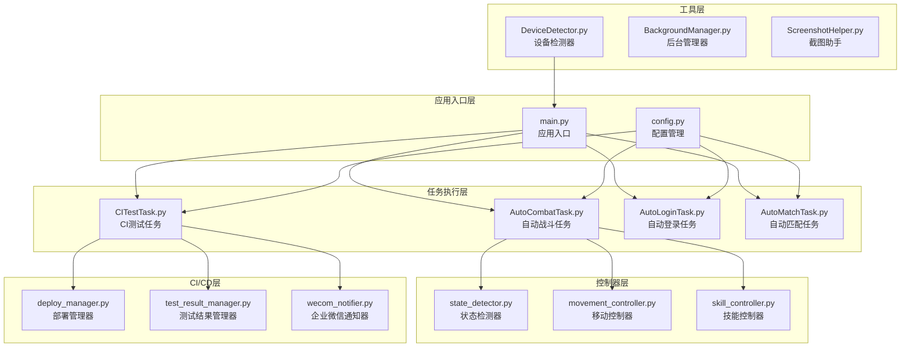
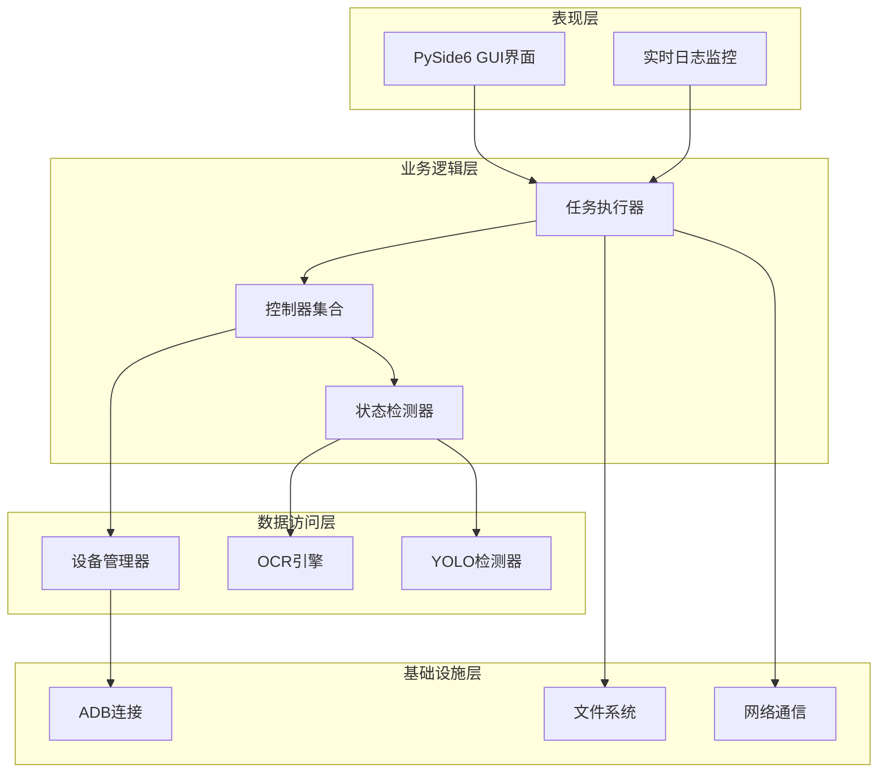
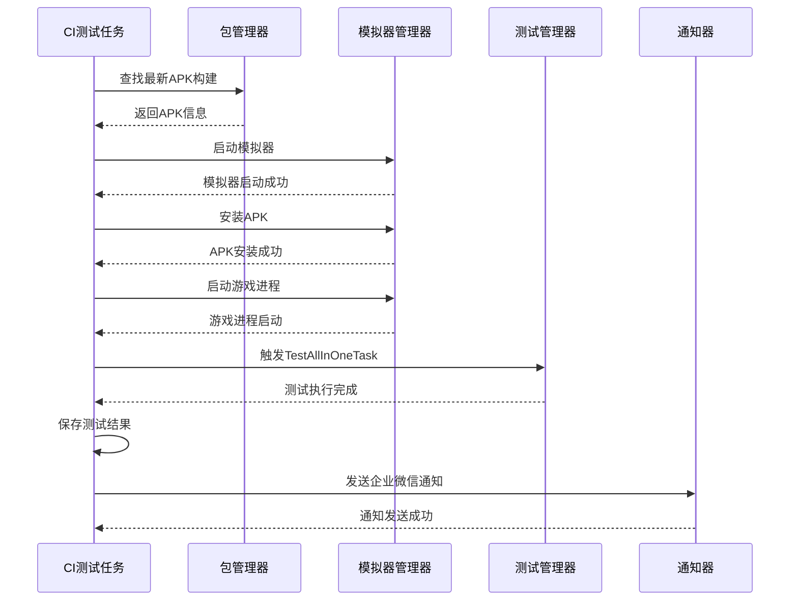
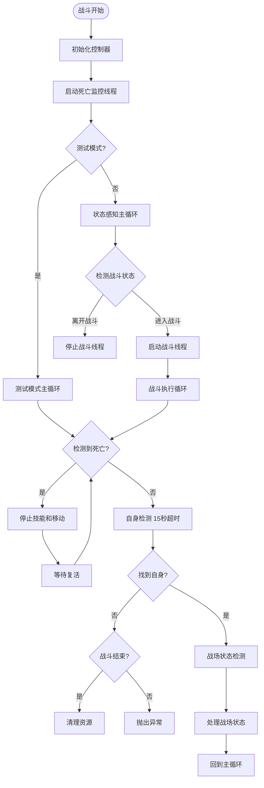
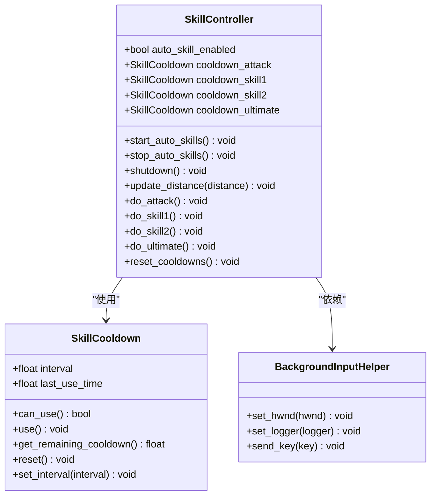
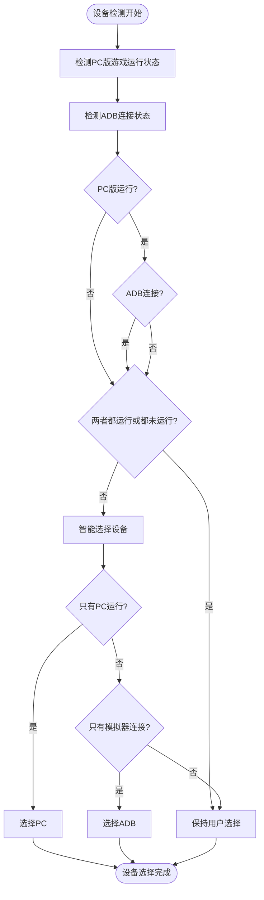
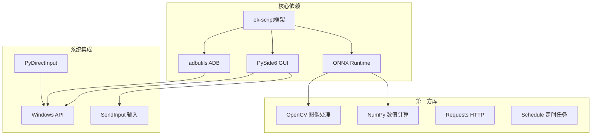

# 开发工作流技能

<cite>
**本文档引用的文件**
- [main.py](file://main.py)
- [config.py](file://config.py)
- [src/globals.py](file://src/globals.py)
- [requirements.txt](file://requirements.txt)
- [src/task/CITestTask.py](file://src/task/CITestTask.py)
- [src/task/AutoCombatTask.py](file://src/task/AutoCombatTask.py)
- [src/combat/skill_controller.py](file://src/combat/skill_controller.py)
- [src/combat/state_detector.py](file://src/combat/state_detector.py)
- [src/combat/movement_controller.py](file://src/combat/movement_controller.py)
- [src/utils/DeviceDetector.py](file://src/utils/DeviceDetector.py)
- [configs/CITestTask.json](file://configs/CITestTask.json)
- [.github/workflows/release.yml](file://.github/workflows/release.yml)
- [docs/自动战斗系统流程图.md](file://docs/自动战斗系统流程图.md)
</cite>

## 目录
1. [项目概述](#项目概述)
2. [项目结构](#项目结构)
3. [核心组件](#核心组件)
4. [架构总览](#架构总览)
5. [详细组件分析](#详细组件分析)
6. [依赖关系分析](#依赖关系分析)
7. [性能考虑](#性能考虑)
8. [故障排除指南](#故障排除指南)
9. [结论](#结论)
10. [附录](#附录)

## 项目概述
本项目是一个基于 ok-script 框架的自动化测试与游戏辅助工具，主要面向《漫画群星：大集结》游戏的自动化战斗、登录、匹配等任务。项目采用模块化设计，结合 CI/CD 流水线实现自动化测试与发布，并提供了丰富的配置选项与后台运行能力。

## 项目结构
项目采用典型的分层架构，包含以下主要层次：
- 应用入口层：负责应用初始化、补丁注入、定时任务调度等
- 配置管理层：集中管理全局配置与任务配置
- 任务执行层：包含各类自动化任务（登录、战斗、匹配、CI测试等）
- 控制器层：战斗状态检测、移动控制、技能释放等核心控制逻辑
- 工具层：设备检测、后台管理、截图处理等辅助功能
- CI/CD 层：部署管理、测试结果管理、通知等

**图表来源**
- [main.py:1-693](file://main.py#L1-L693)
- [config.py:1-146](file://config.py#L1-L146)

**章节来源**
- [main.py:1-693](file://main.py#L1-L693)
- [config.py:1-146](file://config.py#L1-L146)

## 核心组件
项目的核心组件包括：

### 应用入口与初始化
- **main.py**：应用的主要入口文件，负责：
  - 环境变量修复与路径设置
  - 日志处理器补丁（防止 I/O 错误）
  - ADB 连接错误处理补丁
  - OCR 负坐标错误日志抑制
  - 任务按钮对齐补丁
  - 智能设备选择与配置更新
  - 定时任务调度器初始化
  - GUI 启动与资源清理

### 全局配置管理
- **config.py**：集中管理应用配置，包括：
  - 基本设置（后台模式、触发间隔等）
  - 游戏热键配置
  - OCR 参数配置
  - 模板匹配配置
  - 窗口参数配置
  - ADB 配置
  - 支持分辨率配置
  - 一次性任务与触发任务列表
  - 自定义标签页配置

### 全局资源管理器
- **src/globals.py**：提供全局资源统一访问接口，包括：
  - 登录状态管理
  - OCR 缓存管理
  - YOLO 模型管理
  - CI 测试状态管理
  - 全局重置功能

**章节来源**
- [main.py:22-679](file://main.py#L22-L679)
- [config.py:23-145](file://config.py#L23-L145)
- [src/globals.py:16-406](file://src/globals.py#L16-L406)

## 架构总览
项目采用分层架构设计，各层职责明确，耦合度低，便于维护和扩展。

**图表来源**
- [main.py:673-693](file://main.py#L673-L693)
- [config.py:68-145](file://config.py#L68-L145)

## 详细组件分析

### CI自动化测试系统
CI测试系统是项目的核心功能之一，实现了完整的自动化测试流水线。

**图表来源**
- [src/task/CITestTask.py:146-273](file://src/task/CITestTask.py#L146-L273)
- [src/ci/deploy_manager.py:123-200](file://src/ci/deploy_manager.py#L123-L200)

#### CI测试任务核心功能
- **包管理**：从 Jenkins 下载最新 APK，支持版本比较和增量下载
- **模拟器管理**：启动雷电模拟器，安装 APK，管理 ADB 连接
- **测试执行**：等待游戏进程启动后触发测试任务
- **结果收集**：统计测试结果，生成测试报告
- **通知机制**：通过企业微信发送测试结果和截图
- **异常处理**：支持连续失败中断和自动重试

**章节来源**
- [src/task/CITestTask.py:26-273](file://src/task/CITestTask.py#L26-L273)
- [configs/CITestTask.json:1-29](file://configs/CITestTask.json#L1-L29)

### 自动战斗系统
自动战斗系统实现了智能的战斗逻辑，支持多种战斗场景和状态检测。

**图表来源**
- [src/task/AutoCombatTask.py:199-516](file://src/task/AutoCombatTask.py#L199-L516)
- [src/combat/state_detector.py:83-195](file://src/combat/state_detector.py#L83-L195)

#### 战斗系统核心特性
- **并行死亡检测**：独立线程持续监控死亡状态，响应速度快
- **状态感知机制**：通过 YOLO 自身检测动态启停战斗
- **智能状态处理**：根据战场状态（无单位、仅友方、仅敌方、混合）采取不同策略
- **距离控制逻辑**：根据距离自动调整移动和技能释放
- **卡住/抖动检测**：智能检测角色卡住并执行摆脱操作

**章节来源**
- [src/task/AutoCombatTask.py:35-141](file://src/task/AutoCombatTask.py#L35-L141)
- [src/combat/state_detector.py:24-62](file://src/combat/state_detector.py#L24-L62)

### 技能控制系统
技能控制系统实现了智能的技能释放机制，支持独立冷却和后台运行。

**图表来源**
- [src/combat/skill_controller.py:29-80](file://src/combat/skill_controller.py#L29-L80)
- [src/combat/skill_controller.py:82-149](file://src/combat/skill_controller.py#L82-L149)

#### 技能控制核心功能
- **独立冷却机制**：每个技能拥有独立的冷却计时器
- **后台输入支持**：使用 SendInput 支持 Unity 游戏后台操作
- **配置驱动**：严格遵循 GUI 设置的技能开关和间隔
- **智能按键映射**：从全局配置读取按键映射
- **异常处理**：技能释放失败时静默处理，避免影响整体流程

**章节来源**
- [src/combat/skill_controller.py:82-589](file://src/combat/skill_controller.py#L82-L589)

### 设备检测与智能选择
系统提供了智能的设备选择功能，能够自动检测 PC 版和模拟器的连接状态。

**图表来源**
- [src/utils/DeviceDetector.py:11-149](file://src/utils/DeviceDetector.py#L11-L149)

**章节来源**
- [src/utils/DeviceDetector.py:11-149](file://src/utils/DeviceDetector.py#L11-L149)

## 依赖关系分析

**图表来源**
- [requirements.txt:1-17](file://requirements.txt#L1-L17)

**章节来源**
- [requirements.txt:1-17](file://requirements.txt#L1-L17)

## 性能考虑
项目在多个方面进行了性能优化：

### 检测频率优化
- 死亡状态检测频率从 10Hz 提升至 20Hz
- 战斗状态检测间隔优化至 50ms
- YOLO 检测使用并行线程，避免阻塞主线程

### 内存管理
- YOLO 模型采用延迟加载机制
- OCR 缓存支持 TTL（生存时间）控制
- 全局资源提供重置功能，避免内存泄漏

### 后台运行优化
- 支持伪后台模式，窗口最小化时继续运行
- 使用 SendInput 替代前台输入，减少窗口激活开销
- 智能设备选择避免不必要的窗口操作

## 故障排除指南

### 常见问题及解决方案

#### ADB 连接问题
- **症状**：模拟器连接失败或设备离线
- **原因**：ADB 服务异常或端口冲突
- **解决**：重启 ADB 服务，检查端口配置

#### YOLO 模型加载失败
- **症状**：战斗功能异常或报错
- **原因**：模型文件缺失或损坏
- **解决**：重新下载模型文件，检查文件完整性

#### 技能释放异常
- **症状**：技能按键无效或响应延迟
- **原因**：后台输入权限不足
- **解决**：以管理员权限运行，检查输入助手初始化

#### 日志过多影响性能
- **症状**：日志文件过大，影响系统性能
- **解决**：调整日志级别，启用日志过滤器

**章节来源**
- [main.py:22-366](file://main.py#L22-L366)

## 结论
本项目展示了现代自动化测试工具的完整架构设计，通过模块化、配置驱动和智能检测等技术手段，实现了稳定可靠的自动化功能。项目具有良好的扩展性和维护性，为后续功能开发奠定了坚实基础。

## 附录

### 配置文件说明
- **CITestTask.json**：CI 测试任务配置，包括 Jenkins 地址、模拟器路径、超时设置等
- **devices.json**：设备配置文件，支持 PC 和 ADB 模式的切换
- **AutoCombatTask.json**：自动战斗任务配置，包括技能开关、按键映射等

### 开发规范
- 使用 Python 3.8+ 和 PySide6 框架
- 遵循 PEP 8 代码规范
- 模块化设计，单一职责原则
- 充分的日志记录和错误处理
- 配置驱动的 UI 设计

### 发布流程
项目采用 GitHub Actions 实现自动化发布，支持多配置文件打包和版本管理。

**章节来源**
- [.github/workflows/release.yml:1-65](file://.github/workflows/release.yml#L1-L65)
- [docs/自动战斗系统流程图.md:1-297](file://docs/自动战斗系统流程图.md#L1-L297)