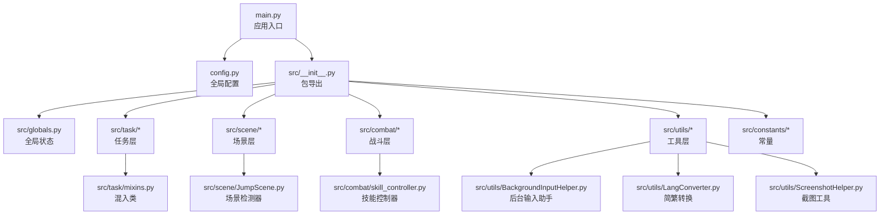
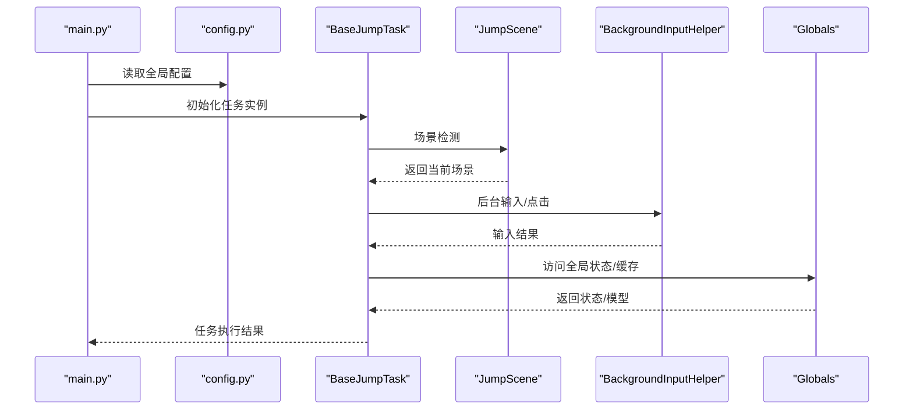
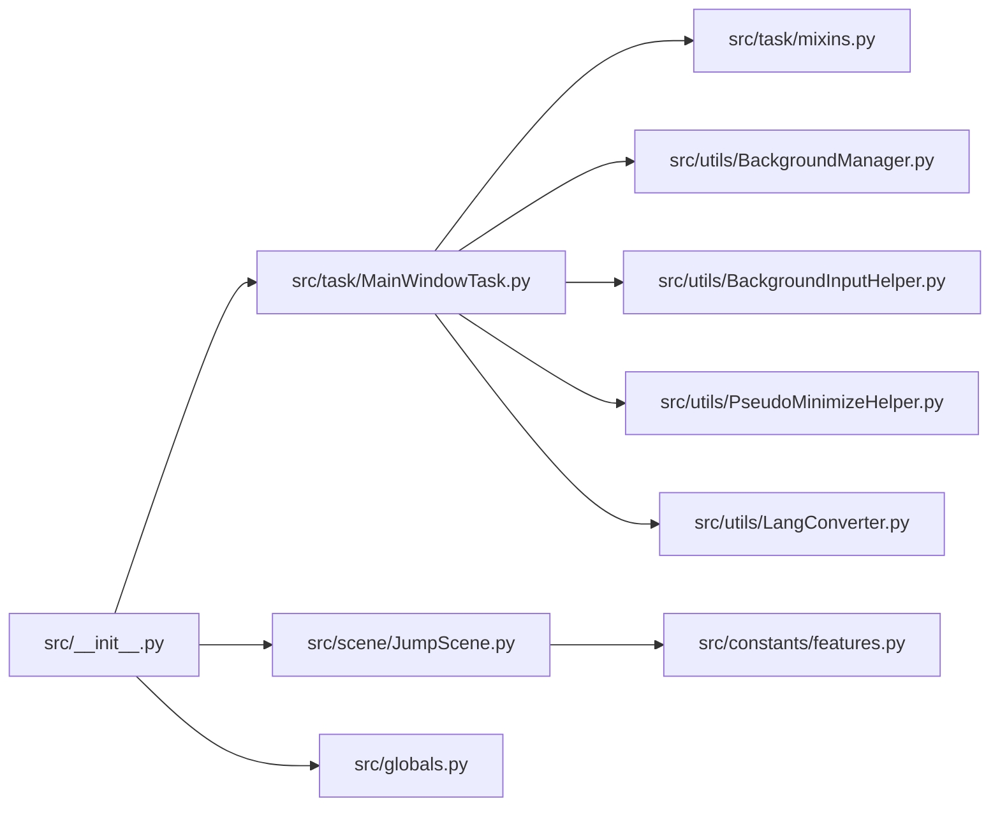
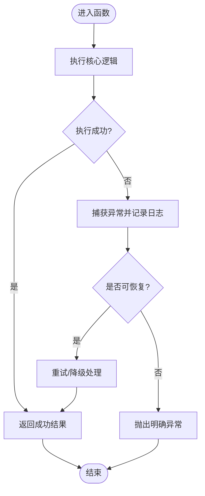
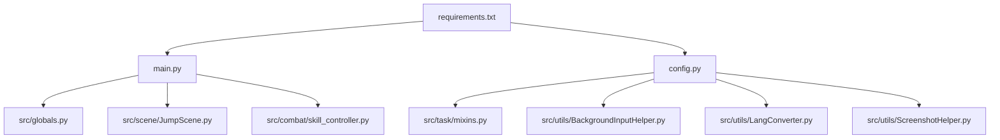

# 代码规范与约定

<cite>
**本文档引用的文件**
- [main.py](file://main.py)
- [config.py](file://config.py)
- [src/__init__.py](file://src/__init__.py)
- [src/globals.py](file://src/globals.py)
- [src/task/BaseJumpTask.py](file://src/task/BaseJumpTask.py)
- [src/constants/features.py](file://src/constants/features.py)
- [src/utils/ScreenshotHelper.py](file://src/utils/ScreenshotHelper.py)
- [src/combat/skill_controller.py](file://src/combat/skill_controller.py)
- [src/scene/JumpScene.py](file://src/scene/JumpScene.py)
- [src/utils/LangConverter.py](file://src/utils/LangConverter.py)
- [src/utils/BackgroundInputHelper.py](file://src/utils/BackgroundInputHelper.py)
- [src/task/mixins.py](file://src/task/mixins.py)
- [requirements.txt](file://requirements.txt)
- [test_input.py](file://test_input.py)
</cite>

## 目录
1. [引言](#引言)
2. [项目结构](#项目结构)
3. [核心组件](#核心组件)
4. [架构总览](#架构总览)
5. [详细组件分析](#详细组件分析)
6. [依赖分析](#依赖分析)
7. [性能考虑](#性能考虑)
8. [故障排查指南](#故障排查指南)
9. [结论](#结论)
10. [附录](#附录)

## 引言
本文件面向OK-Jump项目的开发者与维护者，系统性梳理并明确项目的代码规范与约定，涵盖以下方面：
- Python编码规范与PEP8遵循情况
- 项目特定命名约定（类名、函数名、变量名）
- 模块组织结构与导入规范
- 注释与文档字符串标准格式
- 代码格式化工具使用方法
- 错误处理与异常抛出最佳实践

本规范既基于PEP8通用原则，也结合本项目实际的模块化设计、跨平台输入处理与GUI集成特性制定。

## 项目结构
OK-Jump采用“功能域+层次化”的组织方式：
- 根目录包含入口脚本、配置与依赖声明
- src目录下按功能域划分：task（任务）、scene（场景）、combat（战斗）、utils（工具）、constants（常量）、gui（界面）
- 配置集中于config.py，全局状态由src/globals.py统一管理
- 资源与模板位于assets、configs等目录

**图表来源**
- [main.py:1-107](file://main.py#L1-L107)
- [config.py:1-149](file://config.py#L1-L149)
- [src/__init__.py:1-32](file://src/__init__.py#L1-L32)
- [src/globals.py:1-257](file://src/globals.py#L1-L257)
- [src/task/mixins.py:1-774](file://src/task/mixins.py#L1-L774)
- [src/combat/skill_controller.py:1-347](file://src/combat/skill_controller.py#L1-L347)
- [src/scene/JumpScene.py:1-216](file://src/scene/JumpScene.py#L1-L216)
- [src/utils/BackgroundInputHelper.py:1-841](file://src/utils/BackgroundInputHelper.py#L1-L841)
- [src/utils/LangConverter.py:1-326](file://src/utils/LangConverter.py#L1-L326)
- [src/utils/ScreenshotHelper.py:1-68](file://src/utils/ScreenshotHelper.py#L1-L68)

**章节来源**
- [main.py:1-107](file://main.py#L1-L107)
- [config.py:1-149](file://config.py#L1-L149)
- [src/__init__.py:1-32](file://src/__init__.py#L1-L32)

## 核心组件
- 全局状态管理器：src/globals.py提供单例式的全局资源管理，包括登录状态、OCR缓存、YOLO模型等
- 任务基类与混入：BaseJumpTask与JumpTaskMixin提供统一的后台模式、分辨率适配、输入适配等能力
- 场景检测器：JumpScene负责根据特征识别当前游戏场景
- 技能控制器：SkillController根据配置与热键映射控制技能释放
- 工具集：BackgroundInputHelper、LangConverter、ScreenshotHelper等支撑跨平台与多语言需求

**章节来源**
- [src/globals.py:16-257](file://src/globals.py#L16-L257)
- [src/task/BaseJumpTask.py:14-422](file://src/task/BaseJumpTask.py#L14-L422)
- [src/task/mixins.py:15-774](file://src/task/mixins.py#L15-L774)
- [src/scene/JumpScene.py:8-216](file://src/scene/JumpScene.py#L8-L216)
- [src/combat/skill_controller.py:24-347](file://src/combat/skill_controller.py#L24-L347)
- [src/utils/BackgroundInputHelper.py:99-841](file://src/utils/BackgroundInputHelper.py#L99-L841)
- [src/utils/LangConverter.py:143-326](file://src/utils/LangConverter.py#L143-L326)
- [src/utils/ScreenshotHelper.py:7-68](file://src/utils/ScreenshotHelper.py#L7-L68)

## 架构总览
OK-Jump围绕“配置驱动 + 任务编排 + 场景识别 + 输入适配”的架构展开。入口脚本负责设备选择与框架初始化，随后由任务层驱动场景检测与交互。

**图表来源**
- [main.py:99-107](file://main.py#L99-L107)
- [config.py:68-148](file://config.py#L68-L148)
- [src/task/BaseJumpTask.py:14-422](file://src/task/BaseJumpTask.py#L14-L422)
- [src/scene/JumpScene.py:39-71](file://src/scene/JumpScene.py#L39-L71)
- [src/utils/BackgroundInputHelper.py:310-356](file://src/utils/BackgroundInputHelper.py#L310-L356)
- [src/globals.py:16-257](file://src/globals.py#L16-L257)

## 详细组件分析

### 命名约定
- 类名：采用PascalCase（如Globals、SkillController、JumpScene、BackgroundInputHelper）
- 函数/方法：采用snake_case（如take_screenshot、click、detect_scene、send_key）
- 常量：采用UPPER_CASE（如FEATURE常量、配置项键名）
- 模块/包：采用snake_case（如src/combat、src/utils）
- 导出符号：通过__all__显式声明（见src/__init__.py）

上述命名风格在以下文件中得到一致体现：
- 类命名：src/globals.py、src/combat/skill_controller.py、src/scene/JumpScene.py、src/utils/BackgroundInputHelper.py
- 函数命名：src/task/BaseJumpTask.py、src/utils/ScreenshotHelper.py、src/utils/LangConverter.py
- 常量命名：src/constants/features.py
- 包/模块命名：src/task/mixins.py、src/utils/BackgroundInputHelper.py

**章节来源**
- [src/globals.py:16-257](file://src/globals.py#L16-L257)
- [src/combat/skill_controller.py:24-347](file://src/combat/skill_controller.py#L24-L347)
- [src/scene/JumpScene.py:8-216](file://src/scene/JumpScene.py#L8-L216)
- [src/utils/BackgroundInputHelper.py:99-841](file://src/utils/BackgroundInputHelper.py#L99-L841)
- [src/constants/features.py:9-86](file://src/constants/features.py#L9-L86)
- [src/__init__.py:11-11](file://src/__init__.py#L11-L11)

### 模块组织与导入规范
- 包导出：src/__init__.py集中导出对外API，并通过__all__声明
- 相对导入：在src内部使用相对导入（如from .task import ...）
- 第三方依赖：requirements.txt统一声明，避免在代码中硬编码版本
- 配置驱动：config.py集中管理全局配置与路径，其他模块通过导入config访问

**图表来源**
- [src/__init__.py:7-11](file://src/__init__.py#L7-L11)
- [src/task/mixins.py:7-12](file://src/task/mixins.py#L7-L12)
- [src/constants/features.py:1-86](file://src/constants/features.py#L1-L86)

**章节来源**
- [src/__init__.py:1-32](file://src/__init__.py#L1-L32)
- [requirements.txt:1-14](file://requirements.txt#L1-L14)
- [config.py:1-149](file://config.py#L1-149)

### 注释与文档字符串标准
- 类文档字符串：模块顶部或类定义处提供简洁描述，说明职责与使用方式
- 方法文档字符串：包含参数说明、返回值说明、异常说明与注意事项
- 行内注释：仅在必要处解释复杂逻辑或边界条件
- 常量与配置：通过注释说明用途与默认值

示例覆盖范围：
- 类文档字符串：src/globals.py、src/combat/skill_controller.py、src/scene/JumpScene.py、src/utils/BackgroundInputHelper.py
- 方法文档字符串：src/task/BaseJumpTask.py、src/task/mixins.py、src/utils/ScreenshotHelper.py、src/utils/LangConverter.py

**章节来源**
- [src/globals.py:1-50](file://src/globals.py#L1-L50)
- [src/combat/skill_controller.py:24-60](file://src/combat/skill_controller.py#L24-L60)
- [src/scene/JumpScene.py:8-20](file://src/scene/JumpScene.py#L8-L20)
- [src/utils/BackgroundInputHelper.py:1-14](file://src/utils/BackgroundInputHelper.py#L1-L14)
- [src/task/BaseJumpTask.py:14-30](file://src/task/BaseJumpTask.py#L14-L30)
- [src/task/mixins.py:15-28](file://src/task/mixins.py#L15-L28)
- [src/utils/ScreenshotHelper.py:7-16](file://src/utils/ScreenshotHelper.py#L7-L16)
- [src/utils/LangConverter.py:1-8](file://src/utils/LangConverter.py#L1-L8)

### 代码格式化工具使用
- 推荐使用Black与flake8配合，确保PEP8风格一致性
- Black用于自动格式化，flake8用于静态检查
- 在CI中加入格式化检查与lint规则，保证提交质量
- 本仓库未包含具体配置文件，建议在项目根目录新增black与flake8配置文件

[本节为通用指导，不直接分析具体文件，故无“章节来源”]

### 错误处理与异常抛出最佳实践
- 明确异常类型：区分业务异常与系统异常，避免吞掉关键错误
- 统一日志：使用Logger记录错误上下文，便于定位问题
- 优雅降级：在YOLO模型加载失败时返回空结果而非崩溃
- 超时与重试：等待条件超时应抛出明确异常，便于上层处理
- GUI与后台模式：在后台输入失败时记录详细日志并返回False，避免阻塞主线程

**图表来源**
- [src/globals.py:247-252](file://src/globals.py#L247-L252)
- [src/task/BaseJumpTask.py:362-364](file://src/task/BaseJumpTask.py#L362-L364)
- [src/utils/BackgroundInputHelper.py:354-356](file://src/utils/BackgroundInputHelper.py#L354-L356)

**章节来源**
- [src/globals.py:247-252](file://src/globals.py#L247-L252)
- [src/task/BaseJumpTask.py:334-364](file://src/task/BaseJumpTask.py#L334-L364)
- [src/utils/BackgroundInputHelper.py:310-400](file://src/utils/BackgroundInputHelper.py#L310-L400)

### PEP8遵循情况
- 命名：类名PascalCase、函数snake_case、常量UPPER_CASE，符合PEP8
- 导入：标准库在第三方库之前，同一分组内字母序排列
- 行宽：一般不超过100字符，长表达式分行书写
- 空行：函数间空两行，类内方法间空一行，模块级空两行
- 字符串：文档字符串使用三引号；模块级docstring置于文件顶部
- 注释：行内注释与代码之间留空格，独立注释块前空一行

本项目整体遵循PEP8风格，个别长行与复杂嵌套处可进一步拆分以提升可读性。

**章节来源**
- [src/globals.py:1-20](file://src/globals.py#L1-L20)
- [src/combat/skill_controller.py:1-20](file://src/combat/skill_controller.py#L1-L20)
- [src/scene/JumpScene.py:1-20](file://src/scene/JumpScene.py#L1-L20)
- [src/utils/BackgroundInputHelper.py:1-20](file://src/utils/BackgroundInputHelper.py#L1-L20)

### 项目特定命名约定
- 类名：PascalCase，如Globals、SkillController、JumpScene、BackgroundInputHelper
- 函数/方法：snake_case，如take_screenshot、click、detect_scene、send_key
- 常量：UPPER_CASE，如FEATURE常量、配置键名
- 模块/包：snake_case，如src/combat、src/utils
- 导出符号：通过__all__显式声明，避免意外导入

**章节来源**
- [src/globals.py:16-257](file://src/globals.py#L16-L257)
- [src/combat/skill_controller.py:24-347](file://src/combat/skill_controller.py#L24-L347)
- [src/scene/JumpScene.py:8-216](file://src/scene/JumpScene.py#L8-L216)
- [src/utils/BackgroundInputHelper.py:99-841](file://src/utils/BackgroundInputHelper.py#L99-L841)
- [src/constants/features.py:9-86](file://src/constants/features.py#L9-L86)
- [src/__init__.py:11-11](file://src/__init__.py#L11-L11)

### 模块组织与导入规范
- 包导出：src/__init__.py集中导出对外API，并通过__all__声明
- 相对导入：在src内部使用相对导入（如from .task import ...）
- 第三方依赖：requirements.txt统一声明，避免在代码中硬编码版本
- 配置驱动：config.py集中管理全局配置与路径，其他模块通过导入config访问

**章节来源**
- [src/__init__.py:1-32](file://src/__init__.py#L1-L32)
- [requirements.txt:1-14](file://requirements.txt#L1-L14)
- [config.py:1-149](file://config.py#L1-L149)

### 注释与文档字符串标准
- 类文档字符串：模块顶部或类定义处提供简洁描述，说明职责与使用方式
- 方法文档字符串：包含参数说明、返回值说明、异常说明与注意事项
- 行内注释：仅在必要处解释复杂逻辑或边界条件
- 常量与配置：通过注释说明用途与默认值

**章节来源**
- [src/globals.py:1-50](file://src/globals.py#L1-L50)
- [src/combat/skill_controller.py:1-60](file://src/combat/skill_controller.py#L1-L60)
- [src/scene/JumpScene.py:1-20](file://src/scene/JumpScene.py#L1-L20)
- [src/utils/BackgroundInputHelper.py:1-14](file://src/utils/BackgroundInputHelper.py#L1-L14)
- [src/task/BaseJumpTask.py:1-30](file://src/task/BaseJumpTask.py#L1-L30)
- [src/task/mixins.py:1-28](file://src/task/mixins.py#L1-L28)
- [src/utils/ScreenshotHelper.py:1-16](file://src/utils/ScreenshotHelper.py#L1-L16)
- [src/utils/LangConverter.py:1-8](file://src/utils/LangConverter.py#L1-L8)

### 代码格式化工具使用
- 推荐使用Black与flake8配合，确保PEP8风格一致性
- Black用于自动格式化，flake8用于静态检查
- 在CI中加入格式化检查与lint规则，保证提交质量
- 本仓库未包含具体配置文件，建议在项目根目录新增black与flake8配置文件

[本节为通用指导，不直接分析具体文件，故无“章节来源”]

### 错误处理与异常抛出最佳实践
- 明确异常类型：区分业务异常与系统异常，避免吞掉关键错误
- 统一日志：使用Logger记录错误上下文，便于定位问题
- 优雅降级：在YOLO模型加载失败时返回空结果而非崩溃
- 超时与重试：等待条件超时应抛出明确异常，便于上层处理
- GUI与后台模式：在后台输入失败时记录详细日志并返回False，避免阻塞主线程

**章节来源**
- [src/globals.py:247-252](file://src/globals.py#L247-L252)
- [src/task/BaseJumpTask.py:334-364](file://src/task/BaseJumpTask.py#L334-L364)
- [src/utils/BackgroundInputHelper.py:310-400](file://src/utils/BackgroundInputHelper.py#L310-L400)

## 依赖分析
- 外部依赖：通过requirements.txt统一声明，包括ok-script、PySide6、OpenCV、ONNXRuntime等
- 内部依赖：src内部模块通过相对导入相互引用，避免循环依赖
- 配置依赖：config.py集中管理全局配置，其他模块通过导入config访问

**图表来源**
- [requirements.txt:1-14](file://requirements.txt#L1-L14)
- [main.py:1-10](file://main.py#L1-L10)
- [config.py:1-149](file://config.py#L1-L149)

**章节来源**
- [requirements.txt:1-14](file://requirements.txt#L1-L14)
- [config.py:1-149](file://config.py#L1-L149)

## 性能考虑
- 后台输入：使用SendInput避免窗口激活带来的性能损耗
- 缓存策略：OCR缓存与YOLO模型延迟加载，减少启动开销
- 分辨率适配：统一缩放策略，避免重复计算
- I/O优化：截图保存与特征模板导出按需创建目录，减少磁盘IO

[本节为通用指导，不直接分析具体文件，故无“章节来源”]

## 故障排查指南
- 后台输入失败：检查窗口句柄获取与伪最小化状态，查看日志输出
- YOLO模型加载失败：确认权重文件路径与权限，查看异常堆栈
- 场景识别异常：检查特征名称与模板匹配阈值，确认分辨率适配
- 输入法与ADB模式：区分ADB与Windows输入路径，确保按键映射正确

**章节来源**
- [src/utils/BackgroundInputHelper.py:310-400](file://src/utils/BackgroundInputHelper.py#L310-L400)
- [src/globals.py:204-228](file://src/globals.py#L204-L228)
- [src/scene/JumpScene.py:39-71](file://src/scene/JumpScene.py#L39-L71)
- [src/task/mixins.py:414-423](file://src/task/mixins.py#L414-L423)

## 结论
OK-Jump在PEP8基础上，结合项目实际形成了清晰的命名规范、模块组织与错误处理策略。通过配置驱动与工具层抽象，实现了跨平台、多语言与后台模式的稳定运行。建议在后续迭代中：
- 引入格式化与静态检查CI流程
- 对长函数与复杂分支进行重构
- 补充单元测试与集成测试

[本节为总结性内容，不直接分析具体文件，故无“章节来源”]

## 附录
- 测试输入辅助：test_input.py可用于验证pydirectinput在目标游戏中的可用性
- 依赖清单：requirements.txt列出了项目所需第三方库

**章节来源**
- [test_input.py:1-58](file://test_input.py#L1-L58)
- [requirements.txt:1-14](file://requirements.txt#L1-L14)