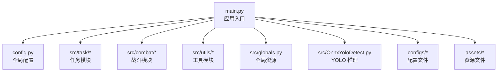
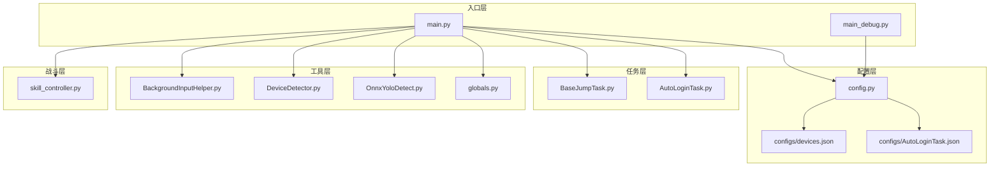
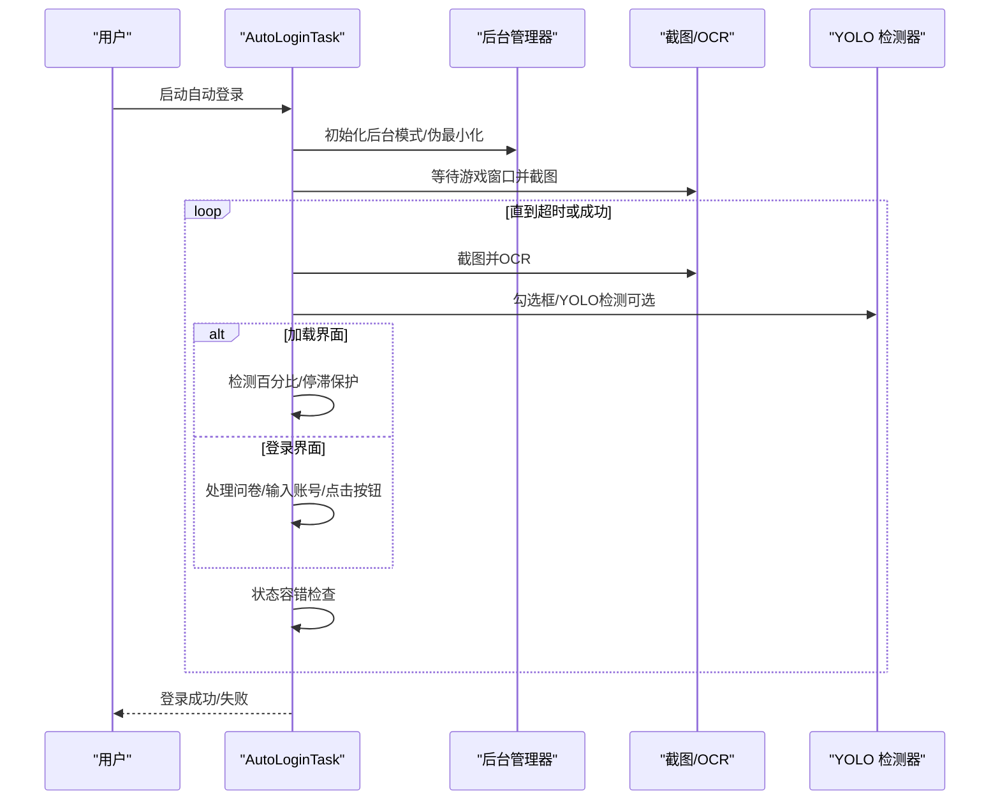
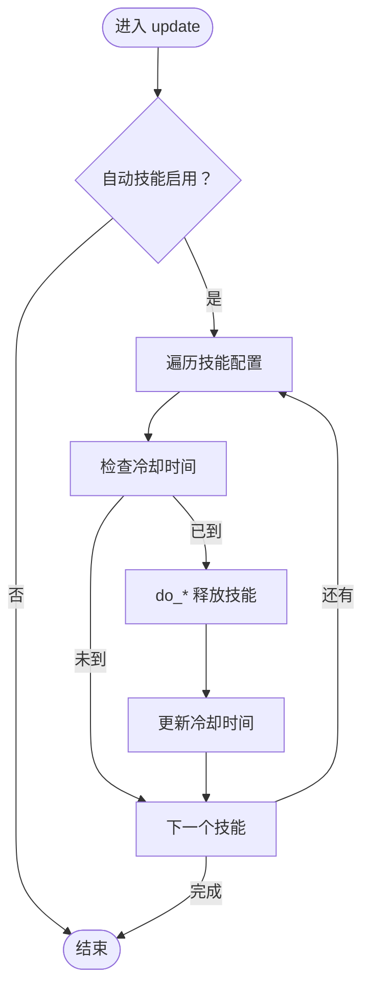
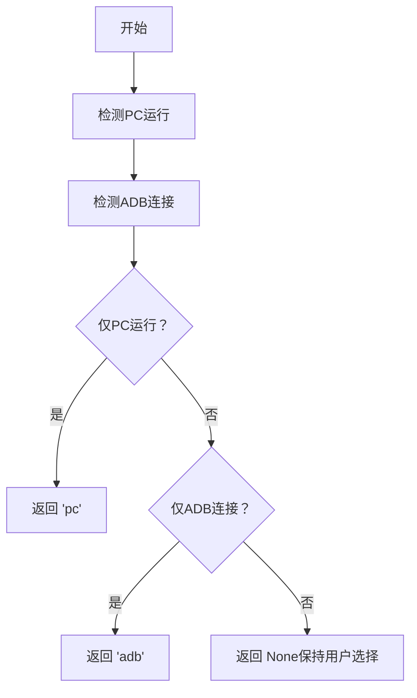
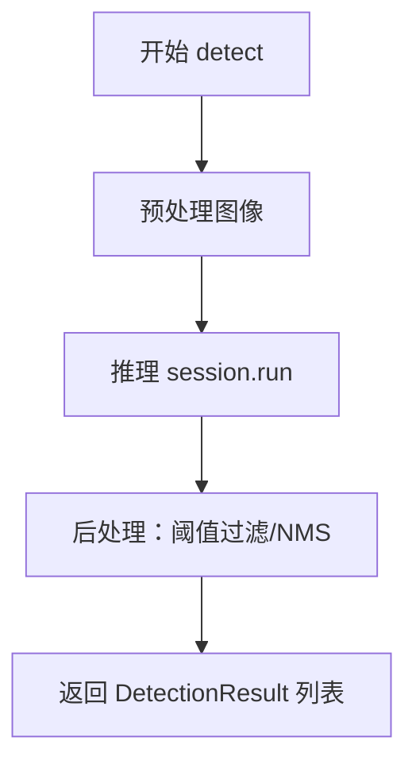
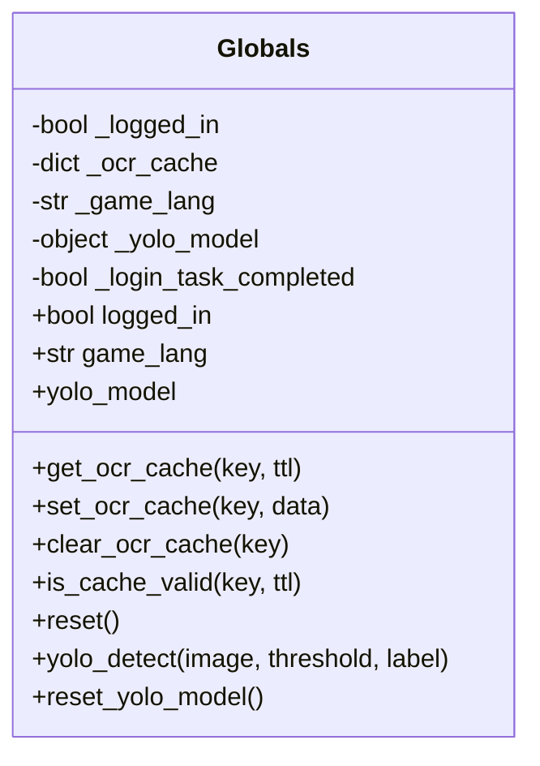
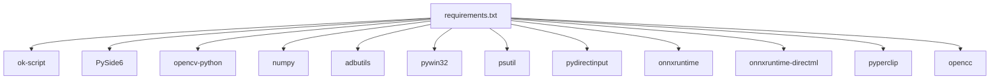

# 开发指南

<cite>
**本文档引用的文件**
- [main.py](file://main.py)
- [config.py](file://config.py)
- [requirements.txt](file://requirements.txt)
- [src/globals.py](file://src/globals.py)
- [src/task/AutoLoginTask.py](file://src/task/AutoLoginTask.py)
- [src/combat/skill_controller.py](file://src/combat/skill_controller.py)
- [src/utils/DeviceDetector.py](file://src/utils/DeviceDetector.py)
- [src/OnnxYoloDetect.py](file://src/OnnxYoloDetect.py)
- [src/task/BaseJumpTask.py](file://src/task/BaseJumpTask.py)
- [src/utils/BackgroundInputHelper.py](file://src/utils/BackgroundInputHelper.py)
- [configs/devices.json](file://configs/devices.json)
- [configs/AutoLoginTask.json](file://configs/AutoLoginTask.json)
- [main_debug.py](file://main_debug.py)
</cite>

## 目录
1. [简介](#简介)
2. [项目结构](#项目结构)
3. [核心组件](#核心组件)
4. [架构概览](#架构概览)
5. [详细组件分析](#详细组件分析)
6. [依赖分析](#依赖分析)
7. [性能考虑](#性能考虑)
8. [调试指南](#调试指南)
9. [故障排查](#故障排查)
10. [结论](#结论)
11. [附录](#附录)

## 简介
本开发指南面向希望参与 OK-Jump 项目开发的工程师，涵盖开发环境搭建、代码规范与命名约定、项目结构说明、贡献与代码审查流程、扩展开发方法与最佳实践、调试技巧与工具使用建议、性能优化与安全注意事项，以及常见问题的解决方案与经验分享。OK-Jump 是基于 OK 框架构建的自动化工具，主要面向游戏《漫画群星：大集结》的自动登录、自动战斗与相关辅助功能。

## 项目结构
项目采用模块化组织，核心目录与职责如下：
- src：核心业务代码
  - task：任务模块（自动登录、自动战斗、日常任务等）
  - combat：战斗相关逻辑（技能控制、状态检测等）
  - utils：通用工具（设备检测、后台输入、截图、分辨率适配等）
  - scene：场景管理（如 JumpScene）
  - OnnxYoloDetect.py：ONNX 推理封装
  - globals.py：全局资源管理器（登录状态、OCR 缓存、YOLO 模型等）
- configs：配置文件（设备、任务、UI 等）
- assets：资源文件（图片、ONNX 模型、检测 JSON）
- tests：测试用例
- docs：文档与流程图
- 根目录：入口脚本、依赖清单、调试脚本

图表来源
- [main.py:1-107](file://main.py#L1-L107)
- [config.py:1-149](file://config.py#L1-L149)

章节来源
- [main.py:1-107](file://main.py#L1-L107)
- [config.py:1-149](file://config.py#L1-L149)

## 核心组件
- 应用入口与初始化
  - main.py：负责智能设备选择、StartController 补丁、日志导出增强、OK 框架初始化与启动。
  - main_debug.py：调试模式入口（禁用 GUI，开启 debug）。
- 配置系统
  - config.py：集中定义窗口、ADB、OCR、模板匹配、全局配置项、任务注册、窗口尺寸与日志路径等。
- 全局资源管理
  - src/globals.py：提供全局状态（登录、语言）、OCR 缓存、YOLO 模型延迟加载与检测接口。
- 任务体系
  - src/task/BaseJumpTask.py：任务基类，提供截图、点击、场景检测、登录等待、伪最小化等通用能力。
  - src/task/AutoLoginTask.py：自动登录任务，包含加载界面检测、问卷调查处理、账号输入、状态容错等。
- 战斗与输入
  - src/combat/skill_controller.py：技能控制器，支持键盘与点击两种模式，后台模式下使用 SendInput。
  - src/utils/BackgroundInputHelper.py：后台输入助手，封装 SendInput、窗口激活、坐标转换等。
- 检测与识别
  - src/OnnxYoloDetect.py：YOLOv11 ONNX 推理封装，支持预处理、NMS 后处理与 DetectionResult。
  - src/utils/DeviceDetector.py：设备检测器，自动判断 PC 游戏与模拟器 ADB 连接状态并智能选择默认设备。
- 配置文件
  - configs/devices.json：设备偏好、ADB 捕获、PC 可执行路径等。
  - configs/AutoLoginTask.json：自动登录任务的配置项（超时、重试、加载检测等）。

章节来源
- [main.py:1-107](file://main.py#L1-L107)
- [main_debug.py:1-16](file://main_debug.py#L1-L16)
- [config.py:68-148](file://config.py#L68-L148)
- [src/globals.py:16-257](file://src/globals.py#L16-L257)
- [src/task/BaseJumpTask.py:14-422](file://src/task/BaseJumpTask.py#L14-L422)
- [src/task/AutoLoginTask.py:21-800](file://src/task/AutoLoginTask.py#L21-L800)
- [src/combat/skill_controller.py:24-347](file://src/combat/skill_controller.py#L24-L347)
- [src/utils/BackgroundInputHelper.py:99-841](file://src/utils/BackgroundInputHelper.py#L99-L841)
- [src/OnnxYoloDetect.py:17-315](file://src/OnnxYoloDetect.py#L17-L315)
- [src/utils/DeviceDetector.py:11-149](file://src/utils/DeviceDetector.py#L11-L149)
- [configs/devices.json:1-7](file://configs/devices.json#L1-L7)
- [configs/AutoLoginTask.json:1-15](file://configs/AutoLoginTask.json#L1-L15)

## 架构概览
OK-Jump 采用“配置驱动 + 任务模块 + 工具层”的分层架构：
- 配置层：集中管理窗口、ADB、OCR、模板匹配、任务注册等。
- 任务层：以 BaseJumpTask 为基础，派生具体任务（登录、战斗、日常等）。
- 工具层：设备检测、后台输入、截图、分辨率适配、YOLO 推理等。
- 入口层：main.py 初始化配置、设备选择、补丁注入与 OK 框架启动。

图表来源
- [main.py:1-107](file://main.py#L1-L107)
- [main_debug.py:1-16](file://main_debug.py#L1-L16)
- [config.py:68-148](file://config.py#L68-L148)
- [configs/devices.json:1-7](file://configs/devices.json#L1-L7)
- [configs/AutoLoginTask.json:1-15](file://configs/AutoLoginTask.json#L1-L15)
- [src/task/BaseJumpTask.py:14-422](file://src/task/BaseJumpTask.py#L14-L422)
- [src/task/AutoLoginTask.py:21-800](file://src/task/AutoLoginTask.py#L21-L800)
- [src/utils/BackgroundInputHelper.py:99-841](file://src/utils/BackgroundInputHelper.py#L99-L841)
- [src/utils/DeviceDetector.py:11-149](file://src/utils/DeviceDetector.py#L11-L149)
- [src/OnnxYoloDetect.py:17-315](file://src/OnnxYoloDetect.py#L17-L315)
- [src/globals.py:16-257](file://src/globals.py#L16-L257)
- [src/combat/skill_controller.py:24-347](file://src/combat/skill_controller.py#L24-L347)

## 详细组件分析

### 自动登录任务（AutoLoginTask）
- 功能要点
  - 启动/等待游戏窗口、登录流程处理、问卷调查、账号输入、加载界面检测与停滞保护、状态容错。
  - 支持后台模式下的窗口伪最小化与截图保证。
- 关键流程
  - 初始化后台模式与窗口句柄，确保截图可用。
  - 循环检测界面状态（加载、登录界面0/1/2、未知），执行对应处理。
  - 加载界面采用百分比检测与停滞超时保护；登录成功后可设置全局登录完成状态。
- 异常与容错
  - 账号输入异常捕获并上报；登录超时、最大尝试次数、加载停滞均作为失败原因记录。
  - 状态容错：在判定失败后的一段宽限时间内再次检测是否已成功。

图表来源
- [src/task/AutoLoginTask.py:205-681](file://src/task/AutoLoginTask.py#L205-L681)
- [src/task/BaseJumpTask.py:61-130](file://src/task/BaseJumpTask.py#L61-L130)
- [src/utils/BackgroundInputHelper.py:310-474](file://src/utils/BackgroundInputHelper.py#L310-L474)
- [src/OnnxYoloDetect.py:234-258](file://src/OnnxYoloDetect.py#L234-L258)

章节来源
- [src/task/AutoLoginTask.py:21-800](file://src/task/AutoLoginTask.py#L21-L800)
- [src/task/BaseJumpTask.py:14-422](file://src/task/BaseJumpTask.py#L14-L422)
- [src/utils/BackgroundInputHelper.py:99-841](file://src/utils/BackgroundInputHelper.py#L99-L841)
- [src/OnnxYoloDetect.py:17-315](file://src/OnnxYoloDetect.py#L17-L315)

### 技能控制器（SkillController）
- 功能要点
  - 根据任务配置与全局热键配置，智能选择键盘按键或移动端点击释放技能。
  - 后台模式下通过后台输入助手使用 SendInput，避免窗口前置。
  - 冷却时间与技能开关严格遵循 GUI 设置。
- 关键流程
  - 初始化后台输入助手并获取窗口句柄。
  - update 中按配置间隔检查技能开关与冷却，调用 do_* 方法释放技能。
  - do_* 方法根据设备类型选择键盘或点击。

图表来源
- [src/combat/skill_controller.py:211-250](file://src/combat/skill_controller.py#L211-L250)
- [src/combat/skill_controller.py:251-282](file://src/combat/skill_controller.py#L251-L282)
- [src/utils/BackgroundInputHelper.py:310-356](file://src/utils/BackgroundInputHelper.py#L310-L356)

章节来源
- [src/combat/skill_controller.py:24-347](file://src/combat/skill_controller.py#L24-L347)
- [src/utils/BackgroundInputHelper.py:99-841](file://src/utils/BackgroundInputHelper.py#L99-L841)

### 设备检测器（DeviceDetector）
- 功能要点
  - 检测 PC 游戏窗口是否存在、ADB 设备是否连接。
  - 提供智能默认设备选择：仅 PC 运行选 PC，仅 ADB 连接选 ADB，否则保持用户选择。
- 关键流程
  - 枚举窗口标题，排除模拟器与工具自身窗口，匹配游戏关键词。
  - 使用 adbutils 或系统 adb 命令检测设备列表。
  - 根据状态返回 'pc'、'adb' 或 None。

图表来源
- [src/utils/DeviceDetector.py:113-134](file://src/utils/DeviceDetector.py#L113-L134)
- [src/utils/DeviceDetector.py:29-68](file://src/utils/DeviceDetector.py#L29-L68)
- [src/utils/DeviceDetector.py:71-110](file://src/utils/DeviceDetector.py#L71-L110)

章节来源
- [src/utils/DeviceDetector.py:11-149](file://src/utils/DeviceDetector.py#L11-L149)

### YOLO 检测器（OnnxYoloDetect）
- 功能要点
  - ONNX 推理封装，支持 CPU/GPU Provider 选择、预处理、NMS 后处理、DetectionResult 结果类。
  - 适用于战场单位识别与勾选框识别等场景。
- 关键流程
  - 初始化 Session，尝试 CUDAExecutionProvider。
  - preprocess：等比缩放 + 填充 + 归一化 + NCHW。
  - postprocess：提取最高置信度类别、过滤阈值、坐标还原、NMS。
  - detect：完整推理流程。

图表来源
- [src/OnnxYoloDetect.py:68-108](file://src/OnnxYoloDetect.py#L68-L108)
- [src/OnnxYoloDetect.py:110-186](file://src/OnnxYoloDetect.py#L110-L186)
- [src/OnnxYoloDetect.py:234-258](file://src/OnnxYoloDetect.py#L234-L258)

章节来源
- [src/OnnxYoloDetect.py:17-315](file://src/OnnxYoloDetect.py#L17-L315)

### 全局资源管理器（Globals）
- 功能要点
  - 登录状态、游戏语言、OCR 缓存（带 TTL）、YOLO 模型延迟加载与检测接口。
  - 提供 reset/reset_yolo_model 等重置能力。
- 关键流程
  - yolo_model 属性延迟加载，按需创建 OnnxYoloDetect 实例。
  - yolo_detect 包装调用并处理异常返回空列表。

图表来源
- [src/globals.py:16-257](file://src/globals.py#L16-L257)

章节来源
- [src/globals.py:16-257](file://src/globals.py#L16-L257)

## 依赖分析
- Python 依赖
  - ok-script、PySide6、opencv-python、numpy、adbutils、pywin32、psutil、pydirectinput、onnxruntime、onnxruntime-directml、pyperclip、opencc 等。
- 运行时依赖
  - Windows 平台（SendInput、Win32 API、pydirectinput）。
  - ADB 设备（adbutils 或系统 adb）。
  - ONNXRuntime（CPU/GPU Provider）。

图表来源
- [requirements.txt:1-14](file://requirements.txt#L1-L14)

章节来源
- [requirements.txt:1-14](file://requirements.txt#L1-L14)

## 性能考虑
- 截图与 OCR
  - 合理设置触发间隔，避免频繁截图与 OCR 导致 CPU/GPU 占用过高。
  - 使用 OCR 缓存（Globals 中的缓存机制）减少重复识别。
- YOLO 推理
  - 优先使用 GPU Provider（CUDAExecutionProvider），若不可用回退 CPU。
  - 控制输入尺寸与置信度阈值，平衡精度与性能。
- 后台模式
  - 使用伪最小化与 SendInput，避免窗口激活带来的额外开销。
  - 合理设置加载界面检测频率，避免过度 OCR。
- ADB 模式
  - 通过 adbutils 直连设备，减少命令行调用开销。
- 日志与磁盘
  - 控制日志级别与文件大小，避免频繁写盘影响性能。

## 调试指南
- 调试入口
  - main_debug.py：启用 debug 模式，禁用 GUI，便于快速启动与定位问题。
- 常用调试技巧
  - 截图与错误截图保存：登录任务在异常时保存错误截图，便于定位界面差异。
  - OCR 缓存：利用 Globals 的 OCR 缓存接口，避免重复 OCR。
  - 后台输入日志：BackgroundInputHelper 记录前台/后台模式下的输入行为。
  - 设备状态：DeviceDetector 提供 PC 与 ADB 连接状态，便于判断设备选择是否正确。
- 日志导出
  - main.py 中的 export_logs 将 logs 目录打包并打开下载目录，便于收集问题日志。

章节来源
- [main_debug.py:1-16](file://main_debug.py#L1-L16)
- [src/task/AutoLoginTask.py:577-581](file://src/task/AutoLoginTask.py#L577-L581)
- [src/globals.py:137-177](file://src/globals.py#L137-L177)
- [src/utils/BackgroundInputHelper.py:131-137](file://src/utils/BackgroundInputHelper.py#L131-L137)
- [src/utils/DeviceDetector.py:137-148](file://src/utils/DeviceDetector.py#L137-L148)
- [main.py:11-26](file://main.py#L11-L26)

## 故障排查
- 无法检测到游戏窗口
  - 检查 config.py 中窗口标题、类名与交互方式配置。
  - 确认是否启用后台模式与伪最小化。
- 登录失败或卡在加载界面
  - 检查 AutoLoginTask 的加载检测与停滞超时配置。
  - 查看错误截图与日志，确认百分比识别是否正常。
- 技能释放无效
  - 确认热键配置与技能开关状态。
  - 后台模式下检查后台输入助手日志与窗口句柄。
- YOLO 模型加载失败
  - 确认 fight.onnx 文件存在与路径正确。
  - 检查 ONNXRuntime 安装与 Provider 可用性。
- 设备选择异常
  - 使用 DeviceDetector 的状态查询，确认 PC 与 ADB 连接状态。
  - 检查 configs/devices.json 的 preferred 与 capture 配置。

章节来源
- [config.py:94-101](file://config.py#L94-L101)
- [src/task/AutoLoginTask.py:403-456](file://src/task/AutoLoginTask.py#L403-L456)
- [src/combat/skill_controller.py:114-138](file://src/combat/skill_controller.py#L114-L138)
- [src/globals.py:212-228](file://src/globals.py#L212-L228)
- [src/utils/DeviceDetector.py:137-148](file://src/utils/DeviceDetector.py#L137-L148)
- [configs/devices.json:1-7](file://configs/devices.json#L1-L7)

## 结论
OK-Jump 通过清晰的分层架构与配置驱动的设计，实现了对游戏自动化的可靠支持。开发者在扩展新功能时，应遵循现有命名与模块划分，充分利用工具层能力（设备检测、后台输入、YOLO 推理、全局资源管理），并在性能与稳定性之间取得平衡。遇到问题时，结合调试入口、日志导出与错误截图进行定位，可显著提升问题解决效率。

## 附录
- 开发环境搭建
  - 安装 Python 与依赖：pip install -r requirements.txt
  - 准备游戏/模拟器运行环境，确保 ADB 可用（如需）
  - 配置游戏窗口标题、类名、交互方式与分辨率
- 代码规范与命名约定
  - 模块命名：小写 + 下划线，如 src/task/AutoLoginTask.py
  - 类命名：驼峰，如 SkillController、OnnxYoloDetect
  - 方法命名：小写 + 下划线，如 _detect_loading_percentage
  - 常量命名：全大写 + 下划线，如 DEFAULT_KEYS
  - 文件编码：UTF-8
- 贡献指南与代码审查
  - 提交前运行本地测试与静态检查
  - 编写必要的单元测试与集成测试
  - 提交信息遵循“类型: 描述”格式
  - 代码审查关注：可维护性、性能、安全性、兼容性
- 扩展开发方法与最佳实践
  - 新增任务：继承 BaseJumpTask，复用截图、点击、场景检测能力
  - 新增检测：封装为独立模块（如 OnnxYoloDetect），提供统一接口
  - 后台支持：优先使用 BackgroundInputHelper 与伪最小化策略
  - 配置管理：通过 config.py 与 configs/*.json 统一管理
- 安全考虑
  - 避免在日志中输出敏感信息（账号、路径等）
  - 严格控制文件读写权限，确保资源文件只读
  - ADB 通信注意设备合法性与网络环境
- 常见问题与经验
  - 加载界面百分比识别不稳定：提高阈值或增加 ROI 区域
  - 后台输入失效：检查窗口句柄与伪最小化状态
  - YOLO 推理慢：启用 GPU Provider 或降低输入尺寸