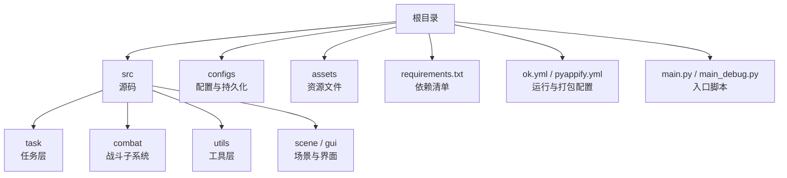
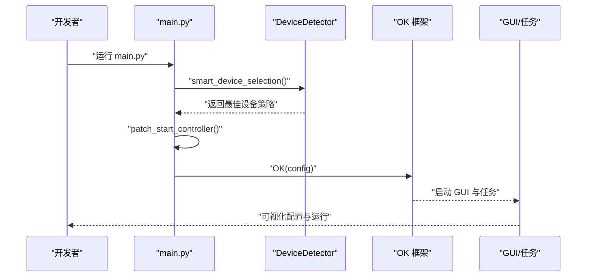
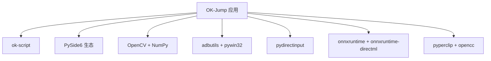

# 开发环境搭建

<cite>
**本文引用的文件**
- [requirements.txt](file://requirements.txt)
- [ok.yml](file://ok.yml)
- [pyappify.yml](file://pyappify.yml)
- [main.py](file://main.py)
- [main_debug.py](file://main_debug.py)
- [config.py](file://config.py)
- [src/utils/DeviceDetector.py](file://src/utils/DeviceDetector.py)
- [src/globals.py](file://src/globals.py)
- [configs/devices.json](file://configs/devices.json)
- [configs/_ok.json](file://configs/_ok.json)
- [configs/main_window.json](file://configs/main_window.json)
- [test_input.py](file://test_input.py)
- [README.md](file://README.md)
- [docs/自动战斗系统流程图.md](file://docs/自动战斗系统流程图.md)
</cite>

## 目录
1. [简介](#简介)
2. [项目结构](#项目结构)
3. [核心组件](#核心组件)
4. [架构总览](#架构总览)
5. [详细组件分析](#详细组件分析)
6. [依赖分析](#依赖分析)
7. [性能考虑](#性能考虑)
8. [故障排查指南](#故障排查指南)
9. [结论](#结论)
10. [附录](#附录)

## 简介
本文件面向首次参与 OK-Jump 项目的开发者，提供从零搭建开发环境的完整指南。内容覆盖：
- Python 版本要求与虚拟环境创建
- 依赖包安装与配置
- OK-Script 框架的安装与配置
- 开发工具与 IDE 推荐及配置要点
- 环境变量与路径配置
- 常见问题排查与验证步骤

## 项目结构
OK-Jump 是基于 OK-Script 框架的自动化工具，采用分层组织：
- 根目录包含入口脚本、配置文件、依赖清单与打包配置
- src 子目录按功能域划分（task、combat、utils、scene、gui 等）
- configs 存放运行期配置与持久化数据
- assets 存放资源文件（如 ONNX 模型、模板 JSON）

章节来源
- [main.py:1-107](file://main.py#L1-L107)
- [config.py:1-149](file://config.py#L1-L149)

## 核心组件
- OK-Script 框架：作为应用的核心运行时与 GUI 基座，负责任务调度、窗口交互、ADB 设备接入、OCR/模板匹配等能力。
- 配置系统：集中于 config.py，定义窗口属性、ADB 参数、OCR/模板匹配参数、任务注册表、窗口尺寸与日志路径等。
- 设备检测：DeviceDetector 提供 PC 游戏窗口与 ADB 设备的自动检测，配合智能设备选择逻辑。
- 全局资源：src/globals.py 提供全局状态与资源（如 YOLO 模型、OCR 缓存、登录状态）的统一管理。

章节来源
- [config.py:68-148](file://config.py#L68-L148)
- [src/utils/DeviceDetector.py:11-149](file://src/utils/DeviceDetector.py#L11-L149)
- [src/globals.py:16-257](file://src/globals.py#L16-L257)

## 架构总览
OK-Jump 的启动流程围绕 main.py 展开：先执行智能设备选择与控制器补丁，再初始化 OK 框架并启动 GUI/任务。

图表来源
- [main.py:99-107](file://main.py#L99-L107)
- [src/utils/DeviceDetector.py:112-134](file://src/utils/DeviceDetector.py#L112-L134)

章节来源
- [main.py:29-51](file://main.py#L29-L51)
- [main.py:99-107](file://main.py#L99-L107)

## 详细组件分析

### Python 版本与虚拟环境
- Python 版本要求
  - 项目配置文件明确要求 Python 3.12。
  - README 中曾标注 Python 3.10/3.11，但以 ok.yml 为准。
- 虚拟环境建议
  - 使用 venv 创建隔离环境，避免系统级包冲突。
  - 激活后安装依赖，确保后续开发与打包一致性。

章节来源
- [ok.yml:1-2](file://ok.yml#L1-L2)
- [README.md:29-33](file://README.md#L29-L33)

### 依赖包安装与配置
- 依赖来源
  - requirements.txt 统一声明所有运行期依赖，包括 OK-Script、PySide6 生态、OpenCV、NumPy、ADB 工具、DirectInput、ONNXRuntime、剪贴板与繁简转换等。
- 安装步骤
  - 在已激活的虚拟环境中执行依赖安装命令。
  - 若网络受限，可参考 pyappify.yml 中的镜像源参数进行加速。
- 关键依赖说明
  - ok-script：OK-Script 框架，提供窗口交互、ADB、OCR、任务调度等能力。
  - PySide6-Essentials/Fluent-Widgets：GUI 基础与 Fluent 风格控件。
  - opencv-python/numpy：图像处理与矩阵运算。
  - adbutils/pywin32：ADB 设备检测与 Windows 窗口交互。
  - pydirectinput：DirectInput 方式向游戏注入输入（适用于 Unity 游戏）。
  - onnxruntime/onnxruntime-directml：ONNX 推理与 DirectML 加速。
  - pyperclip/opencc：剪贴板与繁简转换。

章节来源
- [requirements.txt:1-14](file://requirements.txt#L1-L14)
- [pyappify.yml:12](file://pyappify.yml#L12)

### OK-Script 框架安装与配置
- 安装
  - 通过 requirements.txt 安装 ok-script>=1.0.0。
- 配置
  - config.py 定义 OCR 引擎、模板匹配参数、窗口交互方式、ADB 参数、分辨率适配、窗口尺寸与日志路径等。
  - devices.json 指定首选设备（PC 或 ADB）、捕获方式与可执行路径。
  - _ok.json 与 main_window.json 保存窗口位置、大小与版本信息等持久化数据。
- 启动
  - main.py 在启动前执行智能设备选择与控制器补丁，随后初始化 OK(config) 并启动。

章节来源
- [config.py:68-148](file://config.py#L68-L148)
- [configs/devices.json:1-7](file://configs/devices.json#L1-L7)
- [configs/_ok.json:1-7](file://configs/_ok.json#L1-L7)
- [configs/main_window.json:1-3](file://configs/main_window.json#L1-L3)
- [main.py:99-107](file://main.py#L99-L107)

### 开发工具与 IDE 配置建议
- 推荐工具
  - Python 3.12 环境、VS Code/PyCharm、Git 客户端、ADB 工具链。
- IDE 配置要点
  - 将虚拟环境的 Python 解释器设为项目解释器。
  - 配置运行/调试配置文件，指向 main.py 或 main_debug.py。
  - main_debug.py 适合无 GUI 调试场景，便于快速验证逻辑。
- 路径与别名
  - 保持项目根目录结构不变，避免硬编码绝对路径；通过相对路径与配置文件管理资源路径。

章节来源
- [main_debug.py:6-16](file://main_debug.py#L6-L16)
- [config.py:6-20](file://config.py#L6-L20)

### 环境变量与路径配置
- Python 版本与解释器
  - 使用 Python 3.12，并确保 PATH 中的解释器与虚拟环境一致。
- 资源路径
  - 通过 config.py 的路径辅助函数与 assets 目录约定，确保模型与模板文件可被正确加载。
- ADB 与输入法
  - 确保 ADB 可用且设备在线；DirectInput 需要管理员权限。
- 日志与截图
  - 日志与截图目录在 config.py 中定义，确保写入权限。

章节来源
- [config.py:6-20](file://config.py#L6-L20)
- [config.py:126-130](file://config.py#L126-L130)

### 常见环境问题与验证步骤
- 输入法与输入注入
  - 使用 test_input.py 验证 pydirectinput 能否向游戏发送按键。需以管理员身份运行并在倒计时后切换到游戏窗口。
- 设备选择与 ADB
  - main.py 启动前会根据 DeviceDetector 的检测结果自动选择最佳设备。若出现设备不匹配，检查 devices.json 的 preferred 与 capture 字段。
- GUI 与后台模式
  - 若窗口最小化或移出屏幕导致无法启动，可通过 config.py 的 skip_pos_check 与补丁逻辑允许后台模式运行。
- OCR 与模板匹配
  - 确认 OCR 引擎参数与模板匹配阈值合理；必要时调整 config.py 中对应参数。
- ONNX 模型加载
  - YOLO 模型路径由 src/globals.py 动态拼接，确保 assets/Fight/fight.onnx 存在。

章节来源
- [test_input.py:1-58](file://test_input.py#L1-L58)
- [main.py:54-95](file://main.py#L54-L95)
- [src/utils/DeviceDetector.py:112-134](file://src/utils/DeviceDetector.py#L112-L134)
- [config.py:94-101](file://config.py#L94-L101)
- [src/globals.py:212-228](file://src/globals.py#L212-L228)

## 依赖分析
OK-Jump 的依赖关系围绕 OK-Script 框架展开，同时集成图像识别、OCR、ADB 与输入注入等能力。

图表来源
- [requirements.txt:1-14](file://requirements.txt#L1-L14)

章节来源
- [requirements.txt:1-14](file://requirements.txt#L1-L14)

## 性能考虑
- 后台模式与伪最小化
  - 通过 config.py 的窗口交互方式与 skip_pos_check，可在窗口最小化或被遮挡时继续运行。
- 死亡检测与主循环
  - 自动战斗系统采用并行死亡检测线程与较短主循环延迟，提升响应速度。
- 分辨率与缩放
  - 支持多分辨率适配与目标分辨率列表，减少因分辨率差异导致的识别误差。

章节来源
- [config.py:94-101](file://config.py#L94-L101)
- [docs/自动战斗系统流程图.md:156-178](file://docs/自动战斗系统流程图.md#L156-L178)

## 故障排查指南
- 无法启动 GUI 或提示窗口位置错误
  - 检查 config.py 的 skip_pos_check 与补丁逻辑；确认 devices.json 的 preferred/capture 设置。
- ADB 设备未被识别
  - 使用 adb devices 验证设备在线；检查 adbutils 安装与系统 adb 可用性。
- 输入注入无效
  - 使用 test_input.py 进行测试；确保以管理员身份运行并正确切换到游戏窗口。
- OCR/模板匹配不准确
  - 调整 config.py 中的阈值与引擎参数；确认资源文件路径与权限。
- YOLO 模型加载失败
  - 确认 assets/Fight/fight.onnx 存在；检查 src/globals.py 的路径拼接逻辑。

章节来源
- [main.py:29-51](file://main.py#L29-L51)
- [configs/devices.json:1-7](file://configs/devices.json#L1-L7)
- [test_input.py:1-58](file://test_input.py#L1-L58)
- [config.py:81-92](file://config.py#L81-L92)
- [src/globals.py:212-228](file://src/globals.py#L212-L228)

## 结论
按照本指南完成 Python 3.12 虚拟环境搭建、依赖安装与 OK-Script 配置后，即可顺利启动 OK-Jump 并进行二次开发。建议在开发过程中结合 test_input.py 与 config.py 的参数调优，逐步完善设备选择、输入注入与识别精度，确保在不同分辨率与运行环境下稳定运行。

## 附录
- 快速验证清单
  - Python 3.12 环境已创建并激活
  - requirements.txt 依赖安装完成
  - ADB 设备在线（如需）
  - main.py 可正常启动 GUI
  - test_input.py 能向游戏发送按键
  - YOLO 模型文件存在且可加载