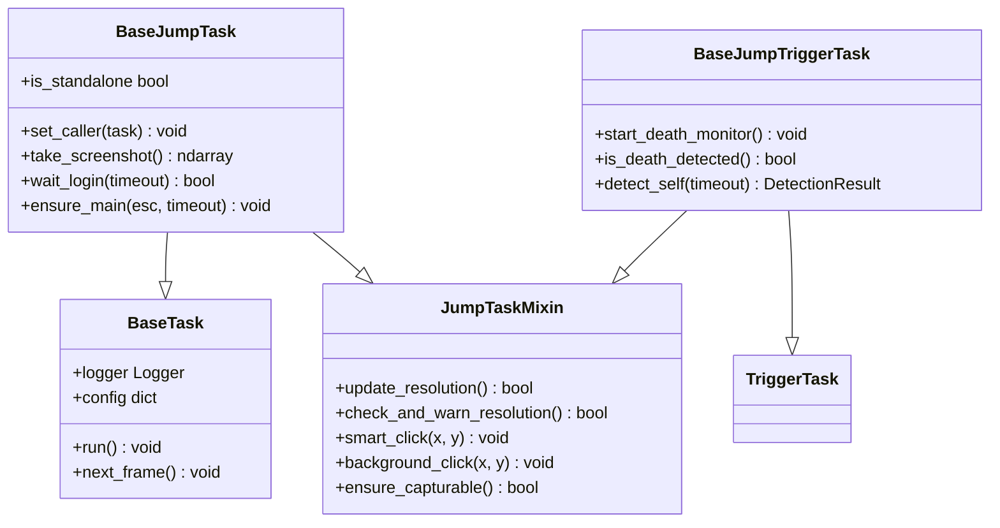
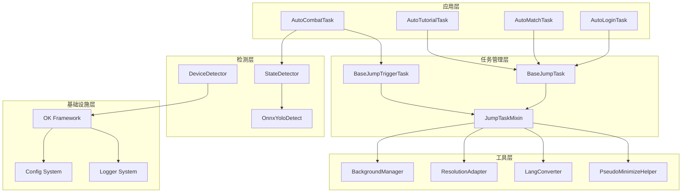
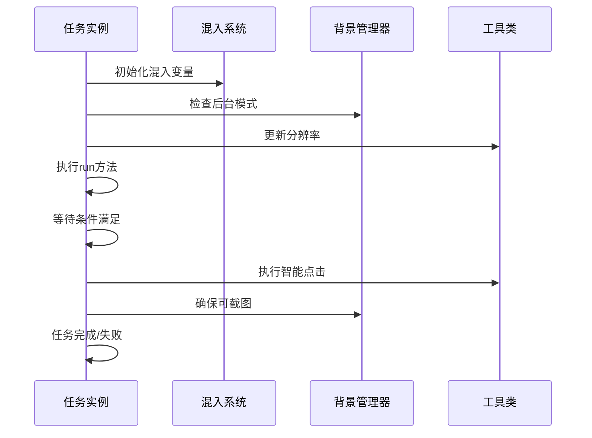
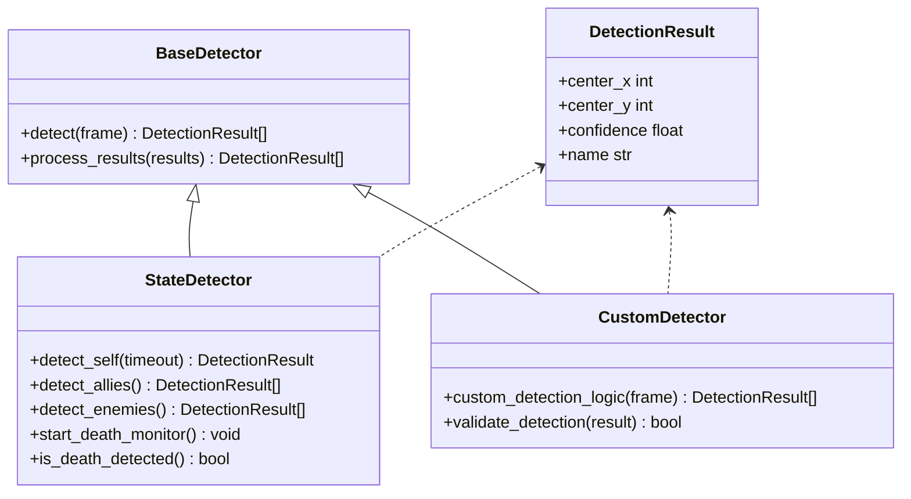
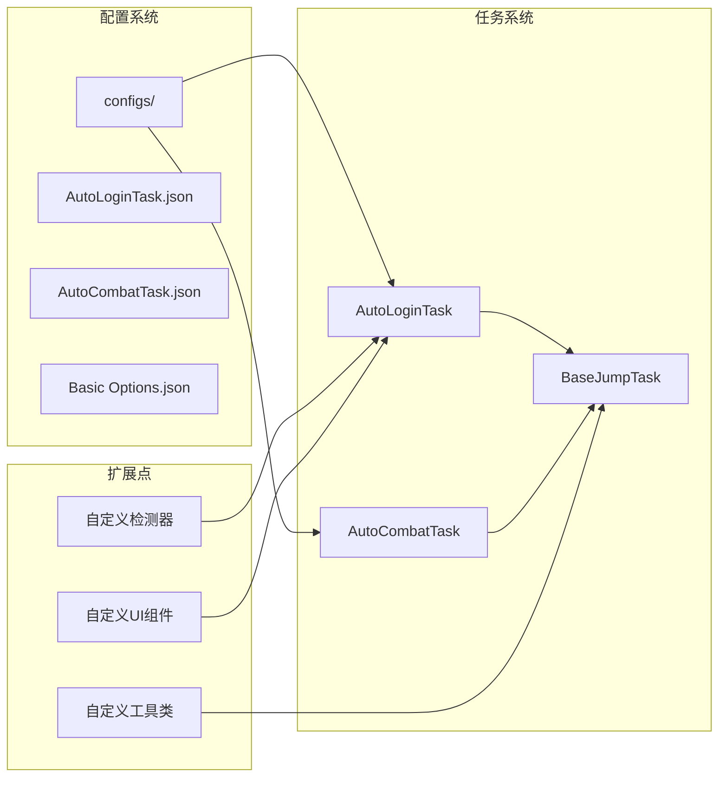
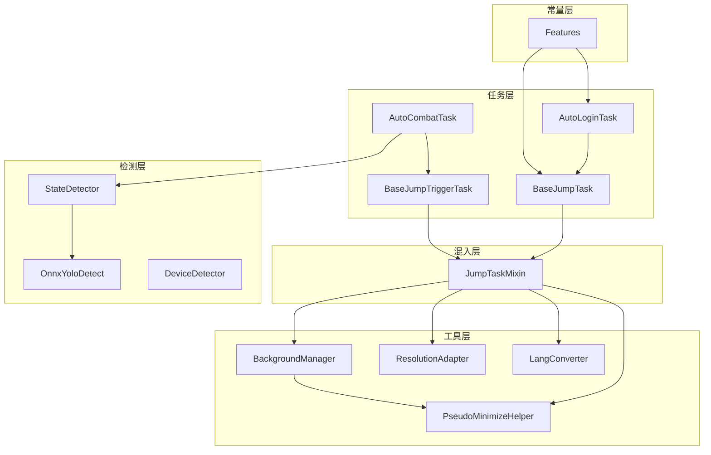
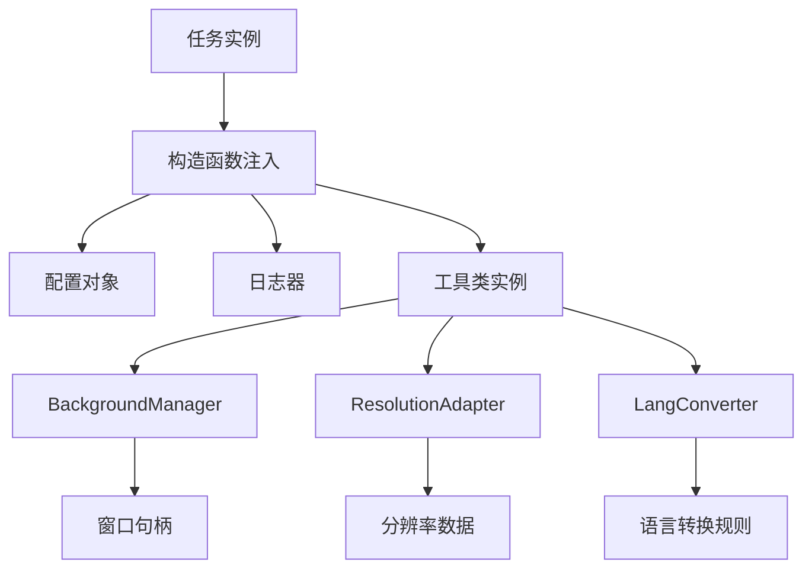
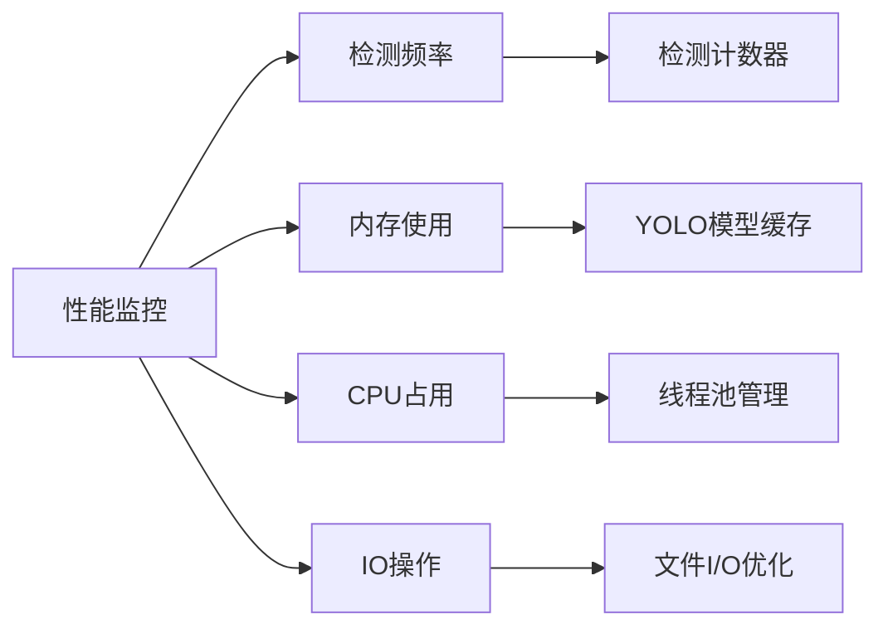

# 扩展开发指南

<cite>
**本文档引用的文件**
- [BaseJumpTask.py](file://src/task/BaseJumpTask.py)
- [mixins.py](file://src/task/mixins.py)
- [BaseJumpTriggerTask.py](file://src/task/BaseJumpTriggerTask.py)
- [AutoLoginTask.py](file://src/task/AutoLoginTask.py)
- [AutoCombatTask.py](file://src/task/AutoCombatTask.py)
- [features.py](file://src/constants/features.py)
- [state_detector.py](file://src/combat/state_detector.py)
- [BackgroundManager.py](file://src/utils/BackgroundManager.py)
- [ResolutionAdapter.py](file://src/utils/ResolutionAdapter.py)
- [LangConverter.py](file://src/utils/LangConverter.py)
- [__init__.py](file://src/utils/__init__.py)
- [coco_detection.json](file://assets/coco_detection.json)
- [AutoLoginTask.json](file://configs/AutoLoginTask.json)
- [AutoCombatTask.json](file://configs/AutoCombatTask.json)
- [main.py](file://main.py)
- [globals.py](file://src/globals.py)
</cite>

## 目录
1. [简介](#简介)
2. [项目结构](#项目结构)
3. [核心组件](#核心组件)
4. [架构概览](#架构概览)
5. [详细组件分析](#详细组件分析)
6. [依赖分析](#依赖分析)
7. [性能考虑](#性能考虑)
8. [故障排除指南](#故障排除指南)
9. [结论](#结论)
10. [附录](#附录)

## 简介

OK-Jump是一个基于Python的自动化游戏脚本框架，专为《漫画群星》设计。该框架提供了完整的任务管理系统、智能检测器、后台模式支持和丰富的扩展能力。

本指南旨在帮助开发者理解和扩展OK-Jump框架，涵盖以下核心主题：
- 如何添加新的任务类型（继承BaseJumpTask）
- 混入(mixins)系统的使用和最佳实践
- 工具类和实用程序功能的扩展
- 自定义检测器的开发指南
- 插件系统的使用和扩展点识别
- 完整的扩展示例和代码模板

## 项目结构

OK-Jump采用模块化的项目结构，主要分为以下几个核心模块：

```mermaid
graph TB
subgraph "核心框架"
A[task/] -- 任务基类
B[utils/] -- 工具类
C[constants/] -- 常量定义
D[combat/] -- 战斗系统
end
subgraph "配置文件"
E[configs/] -- 任务配置
F[assets/] -- 资源文件
end
subgraph "应用入口"
G[main.py] -- 主程序入口
H[globals.py] -- 全局状态管理
end
A --> B
B --> C
C --> D
D --> E
E --> F
F --> G
```

**图表来源**
- [main.py:1-107](file://main.py#L1-L107)
- [globals.py:1-257](file://src/globals.py#L1-L257)

**章节来源**
- [main.py:1-107](file://main.py#L1-L107)
- [globals.py:1-257](file://src/globals.py#L1-L257)

## 核心组件

### 任务系统架构

OK-Jump的任务系统基于继承体系构建，提供了灵活的任务扩展机制：



**图表来源**
- [BaseJumpTask.py:14-422](file://src/task/BaseJumpTask.py#L14-L422)
- [mixins.py:15-774](file://src/task/mixins.py#L15-L774)
- [BaseJumpTriggerTask.py:13-30](file://src/task/BaseJumpTriggerTask.py#L13-L30)

### 混入系统详解

混入系统是OK-Jump的核心设计模式，通过`JumpTaskMixin`类提供跨任务的通用功能：

**混入类的关键特性：**
- **无重复代码**：避免BaseJumpTask和BaseJumpTriggerTask之间的代码重复
- **功能模块化**：将通用功能分解为独立的方法组
- **易于扩展**：新的功能可以通过简单的混入添加

**混入类的主要功能模块：**

1. **初始化管理** (`_init_mixin_vars`)
2. **游戏语言检测** (`game_lang`)
3. **场景状态检测** (`in_game`, `in_lobby`)
4. **日志封装** (`log_info`, `log_error`)
5. **分辨率适配** (`update_resolution`, `scale_point`)
6. **后台模式支持** (`ensure_capturable`, `smart_click`)
7. **输入处理** (`send_key`, `swipe`, `input_text`)

**章节来源**
- [mixins.py:15-774](file://src/task/mixins.py#L15-L774)
- [BaseJumpTask.py:14-422](file://src/task/BaseJumpTask.py#L14-L422)

## 架构概览

OK-Jump采用分层架构设计，各层职责明确，耦合度低：



**图表来源**
- [AutoLoginTask.py:21-800](file://src/task/AutoLoginTask.py#L21-L800)
- [AutoCombatTask.py:32-693](file://src/task/AutoCombatTask.py#L32-L693)
- [BackgroundManager.py:7-155](file://src/utils/BackgroundManager.py#L7-L155)
- [state_detector.py:24-446](file://src/combat/state_detector.py#L24-L446)

## 详细组件分析

### 任务基类扩展指南

#### 继承BaseJumpTask的步骤

要创建一个新的任务类型，需要遵循以下步骤：

**步骤1：创建任务类**
```python
from src.task.BaseJumpTask import BaseJumpTask

class MyCustomTask(BaseJumpTask):
    def __init__(self, *args, **kwargs):
        super().__init__(*args, **kwargs)
        self.name = "MyCustomTask"
        self.description = "自定义任务描述"
```

**步骤2：定义默认配置**
```python
self.default_config = {
    '启用': True,
    '自定义参数1': 100,
    '自定义参数2': '默认值',
    '布尔开关': False
}
```

**步骤3：实现run方法**
```python
def run(self):
    """主要执行逻辑"""
    self.logger.info("开始执行自定义任务")
    
    # 你的任务逻辑
    try:
        # 执行任务步骤
        self.execute_step_1()
        self.execute_step_2()
        return True
    except Exception as e:
        self.logger.error(f"任务执行失败: {e}")
        return False
```

**步骤4：添加状态管理**
```python
def execute_step_1(self):
    """第一步执行逻辑"""
    if not self.ensure_main():
        raise Exception("无法回到主界面")
    
    # 执行具体操作
    self.click_relative(0.5, 0.5)
```

#### 任务生命周期管理



**图表来源**
- [BaseJumpTask.py:26-422](file://src/task/BaseJumpTask.py#L26-L422)
- [mixins.py:32-774](file://src/task/mixins.py#L32-L774)

**章节来源**
- [BaseJumpTask.py:26-422](file://src/task/BaseJumpTask.py#L26-L422)

### 混入系统使用指南

#### 混入类的最佳实践

**1. 功能分离原则**
将相关的功能组织在逻辑分组中：

```python
# 分辨率适配功能组
def update_resolution(self):
    # 更新分辨率逻辑

def scale_point(self, x, y):
    # 坐标缩放逻辑

# 后台模式功能组
def ensure_capturable(self):
    # 确保截图功能

def smart_click(self, x, y):
    # 智能点击逻辑
```

**2. 状态管理**
合理管理内部状态，避免全局污染：

```python
def _init_mixin_vars(self):
    self._resolution_checked = False
    self._background_mode_logged = False
```

**3. 错误处理**
为每个功能提供适当的错误处理：

```python
def update_resolution(self):
    try:
        # 分辨率更新逻辑
        return True
    except Exception as e:
        self.log_error(f"分辨率更新失败: {e}")
        return False
```

#### 混入系统的扩展点

**1. 新增通用功能**
```python
class ExtendedJumpTaskMixin(JumpTaskMixin):
    def new_generic_function(self):
        """新增通用功能"""
        pass
```

**2. 功能组合**
```python
class CustomTask(BaseJumpTask, ExtendedJumpTaskMixin):
    """组合多个混入功能"""
    pass
```

**章节来源**
- [mixins.py:15-774](file://src/task/mixins.py#L15-L774)

### 工具类扩展指南

#### 背景管理器扩展

**背景管理器的核心功能：**
- 后台模式检测
- 窗口状态管理
- 自动伪最小化
- 音频静音控制

**扩展背景管理器：**
```python
class EnhancedBackgroundManager(BackgroundManager):
    def __init__(self):
        super().__init__()
        self.custom_settings = {}
    
    def custom_window_check(self):
        """自定义窗口检查逻辑"""
        # 实现自定义逻辑
        pass
    
    def get_custom_status(self):
        """获取自定义状态信息"""
        return {
            **self.get_background_status(),
            'custom_setting': self.custom_settings
        }
```

#### 分辨率适配器扩展

**分辨率适配器支持：**
- 参考分辨率配置
- 比例检查
- 坐标转换
- 相对坐标计算

**扩展分辨率适配器：**
```python
class CustomResolutionAdapter(ResolutionAdapter):
    def __init__(self):
        super().__init__()
        self.custom_ratio = 16/9
    
    def custom_scale_logic(self, x, y):
        """自定义缩放逻辑"""
        # 实现自定义缩放算法
        pass
```

#### 语言转换器扩展

**语言转换器功能：**
- 简繁中文转换
- 正则表达式支持
- 字典映射
- OpenCC集成

**扩展语言转换器：**
```python
class AdvancedLangConverter(LangConverter):
    @staticmethod
    def advanced_text_processing(text):
        """高级文本处理"""
        # 实现复杂的文本转换逻辑
        pass
    
    @staticmethod
    def create_advanced_regex(pattern):
        """创建高级正则表达式"""
        # 实现复杂的正则表达式转换
        pass
```

**章节来源**
- [BackgroundManager.py:7-155](file://src/utils/BackgroundManager.py#L7-L155)
- [ResolutionAdapter.py:4-163](file://src/utils/ResolutionAdapter.py#L4-L163)
- [LangConverter.py:143-326](file://src/utils/LangConverter.py#L143-L326)

### 自定义检测器开发指南

#### 检测器架构设计



**图表来源**
- [state_detector.py:24-446](file://src/combat/state_detector.py#L24-L446)

#### 检测器开发步骤

**步骤1：继承基础检测器**
```python
from src.combat.state_detector import StateDetector

class CustomDetector(StateDetector):
    def __init__(self, task):
        super().__init__(task)
        self.custom_param = 0.5
```

**步骤2：实现自定义检测逻辑**
```python
def custom_detection_logic(self, frame):
    """自定义检测逻辑"""
    # 使用YOLO或其他检测算法
    results = self.yolo_detect(frame, threshold=self.custom_param)
    
    # 后处理检测结果
    validated_results = self.validate_detection(results)
    
    return validated_results
```

**步骤3：结果验证和过滤**
```python
def validate_detection(self, results):
    """验证检测结果"""
    validated = []
    for result in results:
        if self.is_valid_result(result):
            validated.append(result)
    
    return validated
```

**步骤4：集成到任务系统**
```python
def run(self):
    """将自定义检测器集成到任务中"""
    detector = CustomDetector(self)
    
    while not self.should_exit():
        self.next_frame()
        results = detector.custom_detection_logic(self.frame)
        
        if results:
            # 处理检测到的结果
            self.handle_detection_results(results)
        
        time.sleep(0.03)  # 30ms检测间隔
```

#### 检测器性能优化

**1. 并行处理**
```python
def start_parallel_detection(self):
    """启动并行检测线程"""
    self.detection_thread = threading.Thread(target=self.detection_loop)
    self.detection_thread.daemon = True
    self.detection_thread.start()
```

**2. 结果缓存**
```python
def cache_detection_results(self, results):
    """缓存检测结果"""
    self.result_cache = results
    self.cache_timestamp = time.time()
```

**3. 频率控制**
```python
def control_detection_frequency(self, base_freq=20):
    """控制检测频率"""
    detection_interval = 1.0 / base_freq
    time.sleep(detection_interval)
```

**章节来源**
- [state_detector.py:24-446](file://src/combat/state_detector.py#L24-L446)

### 插件系统使用指南

#### 插件架构设计

OK-Jump的插件系统基于配置驱动的设计模式：



**图表来源**
- [AutoLoginTask.json:1-15](file://configs/AutoLoginTask.json#L1-L15)
- [AutoCombatTask.json:1-13](file://configs/AutoCombatTask.json#L1-L13)

#### 插件扩展点识别

**1. 任务配置扩展点**
```json
{
    "自定义任务": {
        "启用": true,
        "自定义参数": "值",
        "高级设置": {
            "子参数1": 100,
            "子参数2": "字符串"
        }
    }
}
```

**2. 工具类扩展点**
```python
# 在utils/__init__.py中注册新工具类
from src.utils.CustomTool import CustomTool, custom_tool

__all__ = ['CustomTool', 'custom_tool', 'BackgroundManager', 'background_manager']
```

**3. 检测器扩展点**
```python
# 在coco_detection.json中添加新类别
{
    "categories": [
        {
            "id": 200,
            "name": "custom_object",
            "supercategory": "game_objects"
        }
    ]
}
```

#### 插件开发最佳实践

**1. 配置驱动**
```python
def load_plugin_config(self):
    """加载插件配置"""
    plugin_config = self.config.get('自定义任务', {})
    self.enabled = plugin_config.get('启用', False)
    self.custom_param = plugin_config.get('自定义参数', 0)
```

**2. 错误隔离**
```python
def safe_execute_plugin(self):
    """安全执行插件，避免影响主任务"""
    try:
        return self.plugin_function()
    except Exception as e:
        self.logger.error(f"插件执行失败: {e}")
        return False
```

**3. 资源管理**
```python
def cleanup_plugin_resources(self):
    """清理插件资源"""
    if hasattr(self, 'plugin_resource'):
        self.plugin_resource.close()
```

**章节来源**
- [AutoLoginTask.json:1-15](file://configs/AutoLoginTask.json#L1-L15)
- [AutoCombatTask.json:1-13](file://configs/AutoCombatTask.json#L1-L13)
- [__init__.py:1-6](file://src/utils/__init__.py#L1-L6)

## 依赖分析

### 组件依赖关系



**图表来源**
- [BaseJumpTask.py:14-422](file://src/task/BaseJumpTask.py#L14-L422)
- [mixins.py:15-774](file://src/task/mixins.py#L15-L774)
- [AutoLoginTask.py:21-800](file://src/task/AutoLoginTask.py#L21-L800)
- [AutoCombatTask.py:32-693](file://src/task/AutoCombatTask.py#L32-L693)
- [features.py:9-86](file://src/constants/features.py#L9-L86)

### 依赖注入模式

OK-Jump广泛使用依赖注入模式来提高代码的可测试性和可扩展性：



**图表来源**
- [BaseJumpTask.py:26-422](file://src/task/BaseJumpTask.py#L26-L422)
- [mixins.py:32-774](file://src/task/mixins.py#L32-L774)

**章节来源**
- [BaseJumpTask.py:14-422](file://src/task/BaseJumpTask.py#L14-L422)
- [mixins.py:15-774](file://src/task/mixins.py#L15-L774)

## 性能考虑

### 性能优化策略

**1. 检测频率优化**
- 战斗检测：30ms间隔（0.03秒）
- 登录检测：500ms间隔（0.5秒）
- 通用检测：100ms间隔（0.1秒）

**2. 内存管理**
- YOLO模型延迟加载
- OCR结果缓存（1秒TTL）
- 任务状态重置机制

**3. 后台模式优化**
- 窗口状态检测缓存
- 后台输入优化
- 自动伪最小化

### 性能监控



**章节来源**
- [state_detector.py:50-182](file://src/combat/state_detector.py#L50-L182)
- [globals.py:135-192](file://src/globals.py#L135-L192)

## 故障排除指南

### 常见问题及解决方案

**1. 后台模式问题**
- **症状**：游戏窗口最小化后无法截图
- **解决方案**：启用自动伪最小化功能

**2. 分辨率适配问题**
- **症状**：点击位置不准确
- **解决方案**：检查分辨率配置和缩放因子

**3. OCR识别问题**
- **症状**：文本识别失败
- **解决方案**：检查语言设置和简繁转换

**4. YOLO检测问题**
- **症状**：目标检测不准确
- **解决方案**：调整置信度阈值和模型权重

### 调试技巧

**1. 日志级别控制**
```python
# 设置详细日志
self.config.set('详细日志', True)
```

**2. 状态检查**
```python
# 检查后台模式状态
status = self.get_background_status()
print(status)
```

**3. 资源监控**
```python
# 监控内存使用
import psutil
process = psutil.Process()
print(f"内存使用: {process.memory_info().rss / 1024 / 1024:.2f} MB")
```

**章节来源**
- [AutoLoginTask.py:512-681](file://src/task/AutoLoginTask.py#L512-L681)
- [BaseJumpTask.py:334-364](file://src/task/BaseJumpTask.py#L334-L364)

## 结论

OK-Jump框架提供了完整的扩展开发环境，具有以下优势：

**架构优势：**
- 清晰的分层架构
- 灵活的混入系统
- 配置驱动的设计
- 完善的工具类支持

**扩展能力：**
- 易于添加新的任务类型
- 支持自定义检测器
- 可扩展的工具类系统
- 灵活的插件架构

**最佳实践：**
- 遵循混入系统的设计原则
- 合理使用配置驱动
- 注重性能优化
- 完善错误处理机制

通过本指南，开发者可以快速理解和扩展OK-Jump框架，创建符合需求的自动化任务和工具。

## 附录

### 扩展开发模板

**1. 基础任务模板**
```python
from src.task.BaseJumpTask import BaseJumpTask

class TemplateTask(BaseJumpTask):
    """任务模板"""
    
    def __init__(self, *args, **kwargs):
        super().__init__(*args, **kwargs)
        self.name = "TemplateTask"
        self.description = "模板任务描述"
        
        self.default_config = {
            '启用': True,
            '模板参数': '默认值'
        }
    
    def run(self):
        """主要执行逻辑"""
        self.logger.info("模板任务执行")
        return True
```

**2. 自定义检测器模板**
```python
from src.combat.state_detector import StateDetector

class TemplateDetector(StateDetector):
    """检测器模板"""
    
    def __init__(self, task):
        super().__init__(task)
        self.template_param = 0.5
    
    def template_detection_logic(self, frame):
        """模板检测逻辑"""
        results = self.yolo_detect(frame, threshold=self.template_param)
        return self.validate_detection(results)
```

**3. 工具类模板**
```python
class TemplateUtility:
    """工具类模板"""
    
    @staticmethod
    def utility_function(param):
        """工具函数"""
        return param * 2
    
    @classmethod
    def class_method_example(cls):
        """类方法示例"""
        return cls()
```

### 配置文件模板

**1. 任务配置模板**
```json
{
    "模板任务": {
        "启用": true,
        "模板参数": "值",
        "高级设置": {
            "子参数1": 100,
            "子参数2": "字符串"
        }
    }
}
```

**2. 特征配置模板**
```json
{
    "categories": [
        {
            "id": 150,
            "name": "template_object",
            "supercategory": "game_objects"
        }
    ]
}
```

### 集成测试模板

**1. 单元测试模板**
```python
import unittest
from src.task.TemplateTask import TemplateTask

class TestTemplateTask(unittest.TestCase):
    def setUp(self):
        self.task = TemplateTask()
    
    def test_task_initialization(self):
        """测试任务初始化"""
        self.assertTrue(self.task.name == "TemplateTask")
    
    def test_task_execution(self):
        """测试任务执行"""
        result = self.task.run()
        self.assertTrue(result)
```

**2. 集成测试模板**
```python
import unittest
from src.task.AutoLoginTask import AutoLoginTask

class TestAutoLoginIntegration(unittest.TestCase):
    def setUp(self):
        self.login_task = AutoLoginTask()
    
    def test_login_flow_integration(self):
        """测试登录流程集成"""
        # 模拟测试环境
        with patch('src.utils.BackgroundManager') as mock_bg:
            mock_bg.return_value.update_config.return_value = True
            result = self.login_task.run()
            self.assertTrue(result)
```