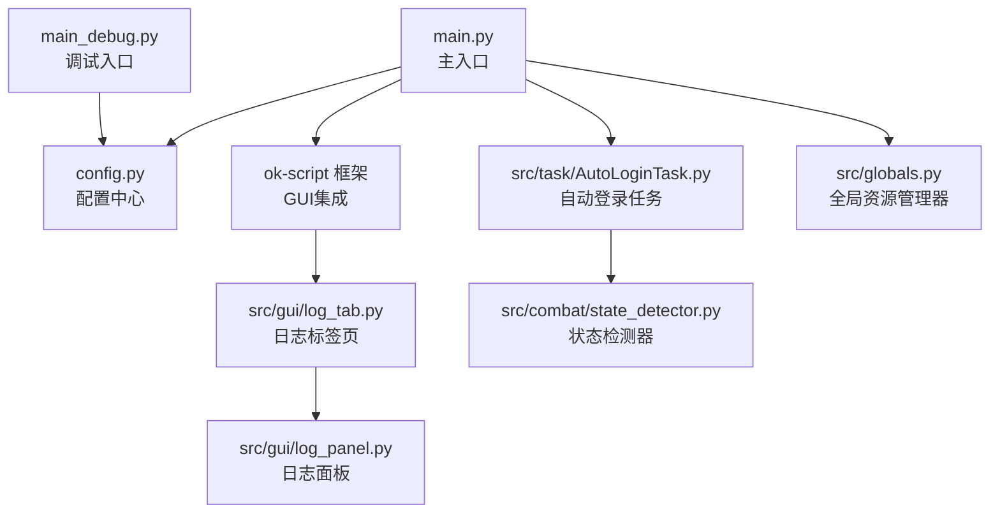
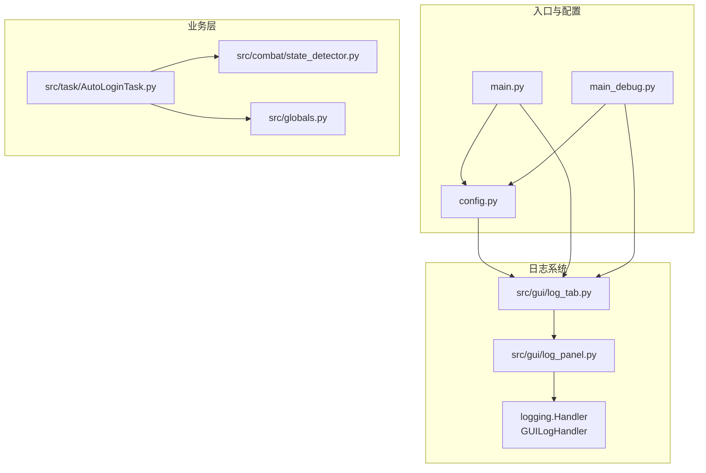
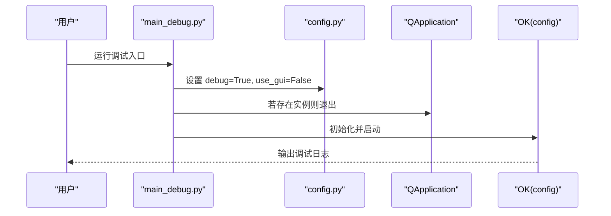
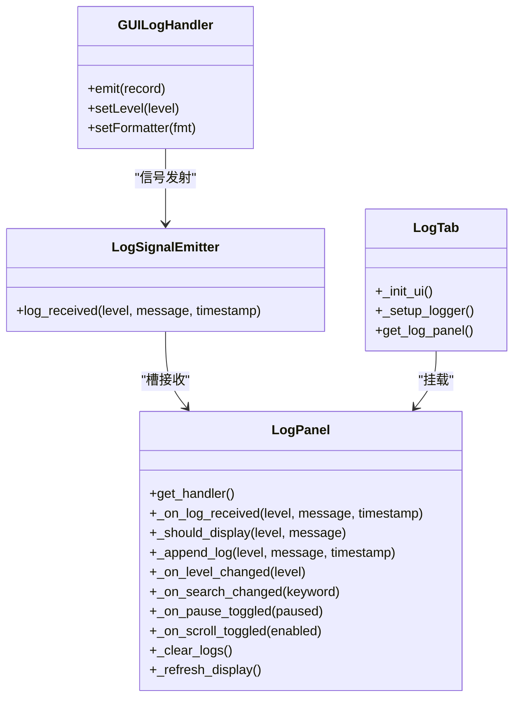
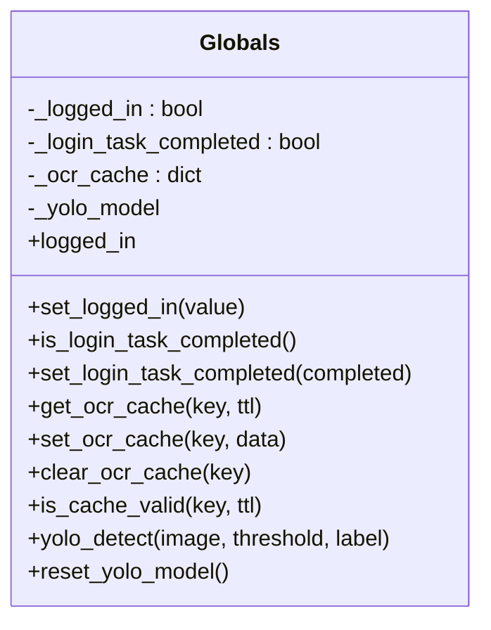
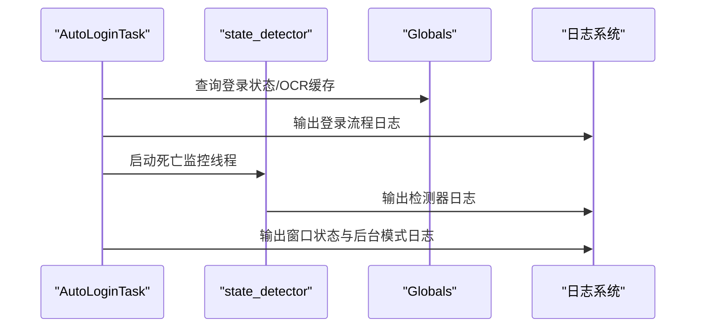
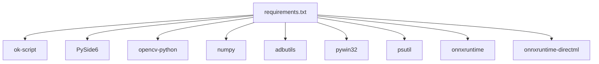
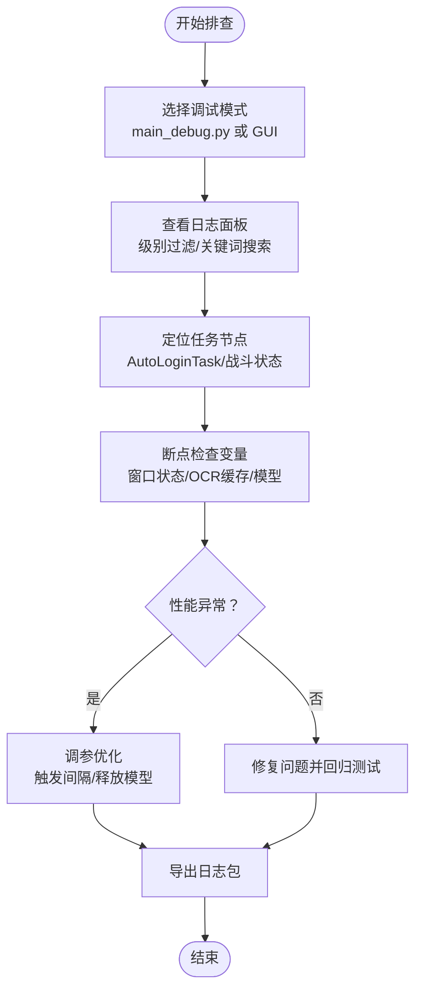

# 调试工具与技巧

<cite>
**本文引用的文件**
- [main_debug.py](file://main_debug.py)
- [main.py](file://main.py)
- [config.py](file://config.py)
- [src/gui/log_panel.py](file://src/gui/log_panel.py)
- [src/gui/log_tab.py](file://src/gui/log_tab.py)
- [src/globals.py](file://src/globals.py)
- [src/task/AutoLoginTask.py](file://src/task/AutoLoginTask.py)
- [src/combat/state_detector.py](file://src/combat/state_detector.py)
- [requirements.txt](file://requirements.txt)
</cite>

## 目录
1. [简介](#简介)
2. [项目结构](#项目结构)
3. [核心组件](#核心组件)
4. [架构总览](#架构总览)
5. [详细组件分析](#详细组件分析)
6. [依赖分析](#依赖分析)
7. [性能考虑](#性能考虑)
8. [故障排查指南](#故障排查指南)
9. [结论](#结论)
10. [附录](#附录)

## 简介
本文件面向OK-Jump自动化工具的调试与优化，重点围绕以下目标展开：
- 详解main_debug.py的使用方法与调试模式配置
- 解释日志系统与日志级别设置
- 说明GUI调试面板的功能与使用方法
- 提供断点调试与变量检查的技巧
- 包含性能分析与内存使用的监控方法
- 说明常见调试场景与问题定位方法
- 提供调试工具链的配置与使用建议

## 项目结构
OK-Jump采用模块化组织，核心入口与调试入口分离，GUI日志面板通过框架集成，全局资源管理器提供统一的资源与状态访问。关键文件分布如下：
- 入口与调试：main.py、main_debug.py
- 配置中心：config.py
- GUI日志：src/gui/log_panel.py、src/gui/log_tab.py
- 全局资源：src/globals.py
- 任务与战斗：src/task/AutoLoginTask.py、src/combat/state_detector.py
- 依赖：requirements.txt

图表来源
- [main.py:100-107](file://main.py#L100-L107)
- [main_debug.py:6-16](file://main_debug.py#L6-L16)
- [config.py:68-148](file://config.py#L68-L148)
- [src/gui/log_tab.py:15-69](file://src/gui/log_tab.py#L15-L69)
- [src/gui/log_panel.py:58-387](file://src/gui/log_panel.py#L58-L387)
- [src/task/AutoLoginTask.py:21-200](file://src/task/AutoLoginTask.py#L21-L200)
- [src/combat/state_detector.py:51-143](file://src/combat/state_detector.py#L51-L143)
- [src/globals.py:16-257](file://src/globals.py#L16-L257)

章节来源
- [main.py:100-107](file://main.py#L100-L107)
- [main_debug.py:6-16](file://main_debug.py#L6-L16)
- [config.py:68-148](file://config.py#L68-L148)

## 核心组件
- 调试入口与模式切换
  - main_debug.py通过设置config中的debug与use_gui标志，强制进入纯命令行调试模式，禁用GUI，便于快速定位问题。
- 日志系统与GUI面板
  - 通过GUILogHandler与LogPanel实现线程安全的日志捕获与实时展示；LogTab作为框架标签页挂载日志面板。
- 全局资源管理器
  - 提供登录状态、OCR缓存、YOLO模型等全局资源的统一访问与生命周期管理，便于调试时观察状态变化。
- 任务与战斗状态
  - AutoLoginTask与state_detector提供详细的日志输出与状态检测，便于定位登录流程与战斗状态异常。

章节来源
- [main_debug.py:6-16](file://main_debug.py#L6-L16)
- [src/gui/log_panel.py:34-114](file://src/gui/log_panel.py#L34-L114)
- [src/gui/log_tab.py:15-69](file://src/gui/log_tab.py#L15-L69)
- [src/globals.py:16-257](file://src/globals.py#L16-L257)
- [src/task/AutoLoginTask.py:21-200](file://src/task/AutoLoginTask.py#L21-L200)
- [src/combat/state_detector.py:51-143](file://src/combat/state_detector.py#L51-L143)

## 架构总览
调试工具链由“入口模式控制”“日志系统”“GUI面板”“全局资源”“任务与战斗状态”五部分组成，形成从命令行到GUI的完整调试闭环。

图表来源
- [main.py:100-107](file://main.py#L100-L107)
- [main_debug.py:6-16](file://main_debug.py#L6-L16)
- [config.py:68-148](file://config.py#L68-L148)
- [src/gui/log_tab.py:15-69](file://src/gui/log_tab.py#L15-L69)
- [src/gui/log_panel.py:34-114](file://src/gui/log_panel.py#L34-L114)
- [src/task/AutoLoginTask.py:21-200](file://src/task/AutoLoginTask.py#L21-L200)
- [src/combat/state_detector.py:51-143](file://src/combat/state_detector.py#L51-L143)
- [src/globals.py:16-257](file://src/globals.py#L16-L257)

## 详细组件分析

### main_debug.py：调试入口与模式配置
- 功能要点
  - 强制开启debug模式，关闭GUI，便于在命令行中快速启动与复现问题。
  - 若已有QApplication实例，先退出再创建新实例，避免多实例导致的资源冲突。
  - 通过OK(config)初始化框架并启动。
- 使用建议
  - 优先使用main_debug.py进行问题复现与回归测试，确认问题边界后再切换回main.py验证GUI交互。
  - 结合config.py中的debug/use_gui参数，灵活调整日志级别与UI行为。

图表来源
- [main_debug.py:6-16](file://main_debug.py#L6-L16)
- [config.py:68-70](file://config.py#L68-L70)

章节来源
- [main_debug.py:6-16](file://main_debug.py#L6-L16)
- [config.py:68-70](file://config.py#L68-L70)

### 日志系统与GUI面板：实时监控与过滤
- GUILogHandler与LogPanel
  - GUILogHandler继承logging.Handler，负责将日志事件格式化并经信号发射器传递给LogPanel。
  - LogPanel提供实时显示、级别过滤、关键词搜索、暂停/恢复、自动滚动、清空日志等功能。
- LogTab
  - 作为框架标签页，负责将LogPanel挂载到GUI导航，并向root logger注册GUILogHandler。
- 使用技巧
  - 在LogTab中设置级别过滤（如仅显示ERROR以上），结合关键词搜索快速定位异常。
  - 使用暂停功能冻结当前日志，便于复制与截图；自动滚动在高频日志时可临时关闭。
  - 通过setup_log_panel_handler可将任意logger接入GUI面板，便于跨模块统一监控。

图表来源
- [src/gui/log_panel.py:34-114](file://src/gui/log_panel.py#L34-L114)
- [src/gui/log_panel.py:252-352](file://src/gui/log_panel.py#L252-L352)
- [src/gui/log_tab.py:15-69](file://src/gui/log_tab.py#L15-L69)

章节来源
- [src/gui/log_panel.py:34-114](file://src/gui/log_panel.py#L34-L114)
- [src/gui/log_panel.py:252-352](file://src/gui/log_panel.py#L252-L352)
- [src/gui/log_tab.py:15-69](file://src/gui/log_tab.py#L15-L69)

### 全局资源管理器：状态与资源监控
- 登录状态与任务完成状态
  - 提供logged_in、set_logged_in、is_login_task_completed、set_login_task_completed等接口，便于在调试中观察登录流程状态。
- OCR缓存与有效性检查
  - 支持按TTL缓存OCR结果，提供get_ocr_cache、set_ocr_cache、clear_ocr_cache、is_cache_valid等方法，便于定位OCR识别异常。
- YOLO模型管理与内存释放
  - 延迟加载YOLO模型，提供yolo_detect与reset_yolo_model，便于在调试中释放显存或重新加载模型。
- 使用建议
  - 在关键节点打印全局状态，结合日志面板观察状态变化趋势。
  - 发生内存不足或模型加载失败时，调用reset_yolo_model释放资源后重试。

图表来源
- [src/globals.py:16-257](file://src/globals.py#L16-L257)

章节来源
- [src/globals.py:16-257](file://src/globals.py#L16-L257)

### 任务与战斗状态：登录流程与死亡检测
- AutoLoginTask
  - 提供登录界面识别、问卷调查处理、账号输入（可选）、加载界面检测与容错机制等。
  - 支持后台模式初始化与窗口状态记录，便于定位窗口遮挡、最小化等问题。
- state_detector
  - 提供并行死亡检测线程，支持verbose模式输出详细日志，便于定位战斗状态异常。
- 使用建议
  - 在verbose模式下运行，观察检测器日志输出，结合全局状态与日志面板综合判断。
  - 登录流程异常时，优先检查窗口状态与后台模式配置，再逐步缩小到OCR/YOLO识别范围。

图表来源
- [src/task/AutoLoginTask.py:21-200](file://src/task/AutoLoginTask.py#L21-L200)
- [src/combat/state_detector.py:51-143](file://src/combat/state_detector.py#L51-L143)
- [src/globals.py:16-257](file://src/globals.py#L16-L257)

章节来源
- [src/task/AutoLoginTask.py:21-200](file://src/task/AutoLoginTask.py#L21-L200)
- [src/combat/state_detector.py:51-143](file://src/combat/state_detector.py#L51-L143)
- [src/globals.py:16-257](file://src/globals.py#L16-L257)

## 依赖分析
- 主要依赖
  - ok-script：框架核心，提供OK类、Logger、GUI集成等能力。
  - PySide6系列：GUI基础组件与Fluent Widgets。
  - OpenCV、NumPy：图像处理与矩阵运算。
  - adbutils、pywin32：设备与Windows交互。
  - psutil：系统资源监控（可用于性能分析）。
  - ONNX Runtime/DirectML：推理加速。
- 调试相关依赖
  - psutil可用于监控CPU/GPU/内存使用情况，辅助性能分析。
  - PySide6的信号槽机制保证日志线程安全，避免GUI阻塞。

图表来源
- [requirements.txt:1-14](file://requirements.txt#L1-L14)

章节来源
- [requirements.txt:1-14](file://requirements.txt#L1-L14)

## 性能考虑
- 触发间隔与资源占用
  - config中提供“触发间隔”参数，适当增大可降低CPU/GPU使用率，减少发热与卡顿。
- 后台模式与伪最小化
  - 后台模式与伪最小化可使窗口最小化或被遮挡时继续运行，但需确保skip_pos_check与相关窗口状态正确。
- 内存与模型释放
  - 使用Globals.reset_yolo_model在内存紧张时主动释放YOLO模型，避免显存泄漏。
- 系统资源监控
  - 可结合psutil对进程CPU/内存/GPU使用情况进行采样，定位异常峰值。

章节来源
- [config.py:50-65](file://config.py#L50-L65)
- [config.py:94-101](file://config.py#L94-L101)
- [src/globals.py:254-257](file://src/globals.py#L254-L257)
- [requirements.txt:8](file://requirements.txt#L8)

## 故障排查指南
- 常见问题与定位方法
  - GUI无法显示或崩溃：优先使用main_debug.py启动，确认日志中是否有异常堆栈；若存在重复注册日志处理器，检查LogTab._setup_logger逻辑。
  - 登录流程卡住：检查AutoLoginTask的日志输出，关注窗口状态与后台模式；必要时开启verbose模式观察state_detector日志。
  - OCR/YOLO识别失败：检查OCR缓存与模型路径，必要时调用reset_yolo_model后重试。
  - 性能异常：增大触发间隔、关闭不必要的日志级别、释放YOLO模型。
- 断点调试与变量检查技巧
  - 在main_debug.py中设置断点，逐步执行OK启动流程，观察config与全局状态。
  - 在AutoLoginTask的关键步骤（如账号输入、界面识别）设置断点，检查frame、OCR结果与窗口句柄。
  - 使用日志面板的暂停功能冻结当前状态，复制日志以便后续分析。
- 导出日志
  - main.py提供导出日志功能，可将logs目录打包下载，便于问题复现与社区协助。

图表来源
- [main_debug.py:6-16](file://main_debug.py#L6-L16)
- [src/gui/log_panel.py:272-283](file://src/gui/log_panel.py#L272-L283)
- [src/task/AutoLoginTask.py:182-200](file://src/task/AutoLoginTask.py#L182-L200)
- [main.py:11-26](file://main.py#L11-L26)

章节来源
- [main_debug.py:6-16](file://main_debug.py#L6-L16)
- [src/gui/log_panel.py:272-283](file://src/gui/log_panel.py#L272-L283)
- [src/task/AutoLoginTask.py:182-200](file://src/task/AutoLoginTask.py#L182-L200)
- [main.py:11-26](file://main.py#L11-L26)

## 结论
通过main_debug.py的命令行调试模式、GUI日志面板的实时监控、全局资源管理器的状态观测以及任务与战斗状态的详细日志，可以构建一套完整的OK-Jump调试与优化体系。建议在日常开发中：
- 优先使用main_debug.py进行问题复现与回归测试
- 在GUI中使用日志面板进行可视化监控与过滤
- 合理配置触发间隔与后台模式，平衡性能与稳定性
- 在内存紧张时主动释放YOLO模型，避免资源泄漏
- 将日志导出作为问题定位与社区协作的重要依据

## 附录
- 调试入口与模式
  - main_debug.py：命令行调试入口，适合快速定位问题
  - main.py：GUI入口，适合验证交互与整体流程
- 日志级别建议
  - 开发阶段：DEBUG
  - 稳定运行：INFO
  - 异常排查：ERROR/CRITICAL
- 常用配置项
  - 触发间隔、后台模式、伪最小化、日志文件路径等

章节来源
- [main_debug.py:6-16](file://main_debug.py#L6-L16)
- [main.py:100-107](file://main.py#L100-L107)
- [config.py:68-148](file://config.py#L68-L148)