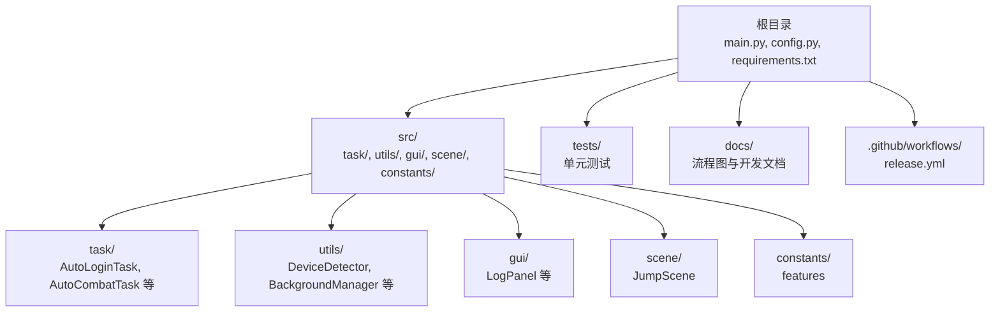
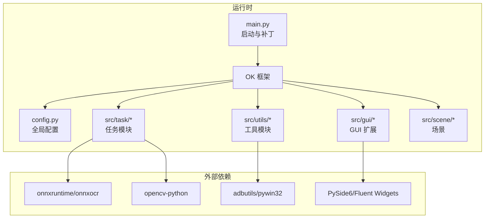
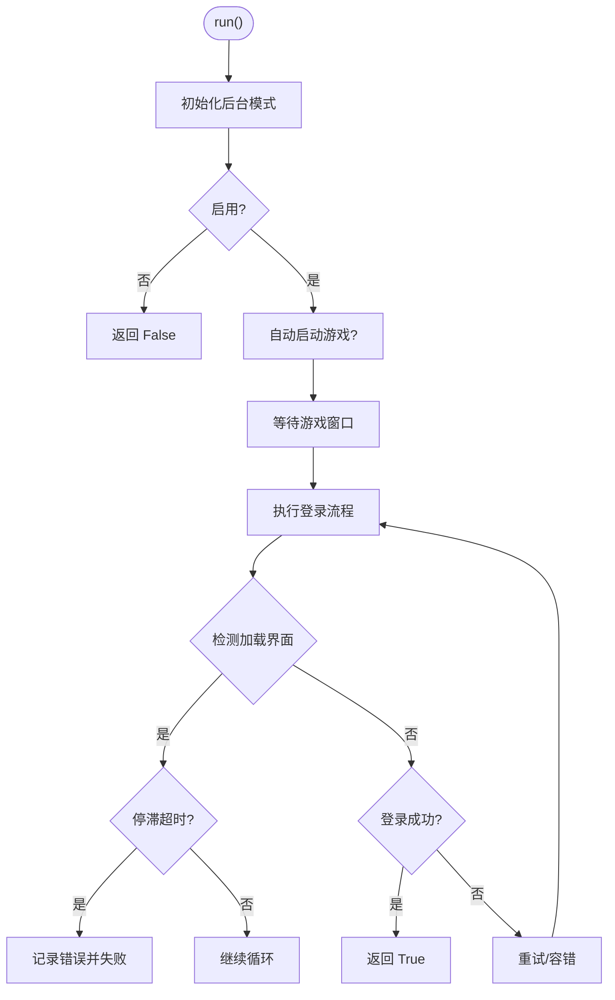
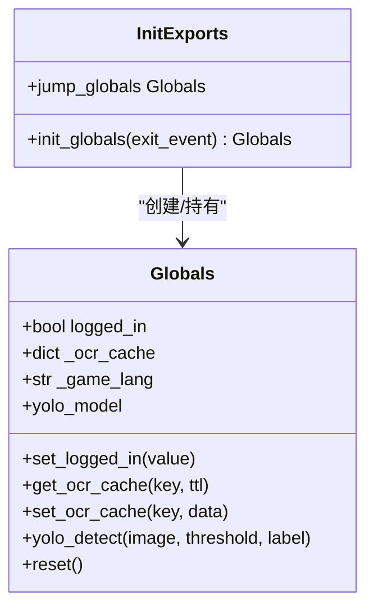
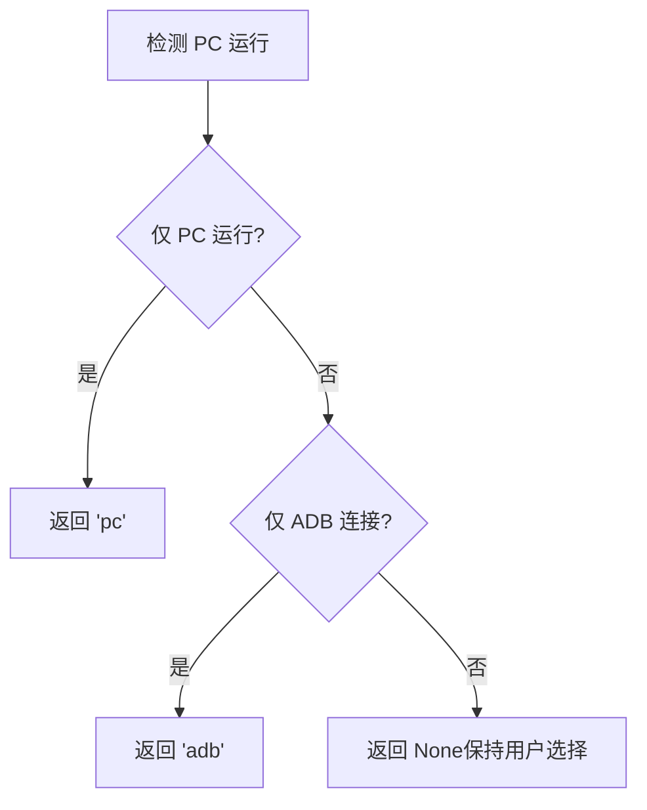
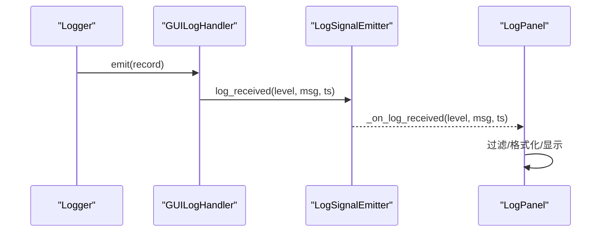
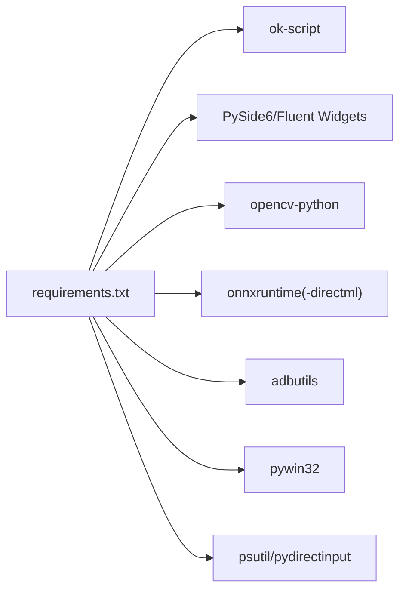

# 贡献指南

<cite>
**本文引用的文件**
- [README.md](file://README.md)
- [main.py](file://main.py)
- [config.py](file://config.py)
- [requirements.txt](file://requirements.txt)
- [.github/workflows/release.yml](file://.github/workflows/release.yml)
- [src/__init__.py](file://src/__init__.py)
- [src/globals.py](file://src/globals.py)
- [src/utils/DeviceDetector.py](file://src/utils/DeviceDetector.py)
- [src/gui/log_panel.py](file://src/gui/log_panel.py)
- [tests/test_autologin_task.py](file://tests/test_autologin_task.py)
- [docs/自动战斗系统流程图.md](file://docs/自动战斗系统流程图.md)
</cite>

## 目录
1. [简介](#简介)
2. [项目结构](#项目结构)
3. [核心组件](#核心组件)
4. [架构总览](#架构总览)
5. [详细组件分析](#详细组件分析)
6. [依赖分析](#依赖分析)
7. [性能考虑](#性能考虑)
8. [故障排查指南](#故障排查指南)
9. [贡献流程与规范](#贡献流程与规范)
10. [结论](#结论)
11. [附录](#附录)

## 简介
本指南面向希望参与 OK-Jump 项目开发与维护的贡献者，覆盖从环境搭建、代码提交与分支管理、Pull Request（PR）创建与评审、代码质量与测试标准、社区行为准则与沟通方式，到文档贡献与问题报告、以及贡献者许可协议与知识产权相关信息。项目基于 ok-script 框架，结合图像识别、OCR 与自动化脚本技术，实现游戏日常任务、自动登录、自动战斗与流程测试的自动化。

## 项目结构
OK-Jump 采用按功能域划分的模块化组织方式，核心入口与配置位于根目录，业务逻辑分布在 src 子包中，测试与文档分别置于 tests 与 docs 目录，GitHub Actions 负责发布流程。

**图表来源**
- [main.py:1-107](file://main.py#L1-L107)
- [config.py:68-148](file://config.py#L68-L148)
- [requirements.txt:1-14](file://requirements.txt#L1-L14)

**章节来源**
- [README.md:1-90](file://README.md#L1-L90)
- [main.py:1-107](file://main.py#L1-L107)
- [config.py:68-148](file://config.py#L68-L148)
- [requirements.txt:1-14](file://requirements.txt#L1-L14)

## 核心组件
- 入口与启动
  - main.py：负责智能设备选择、StartController 补丁、OK 框架初始化与启动。
  - config.py：集中定义全局配置、窗口参数、OCR/模板匹配参数、任务清单与 GUI 扩展。
- 全局资源管理
  - src/globals.py：提供全局状态与资源（登录状态、OCR 缓存、YOLO 模型）统一访问接口。
- 设备检测
  - src/utils/DeviceDetector.py：检测 PC 游戏与模拟器 ADB 连接状态，提供智能默认设备选择。
- 日志与 GUI
  - src/gui/log_panel.py：提供实时日志监控面板，支持过滤、搜索、暂停/自动滚动。
- 测试
  - tests/test_autologin_task.py：覆盖自动登录任务的关键流程与异常路径。

**章节来源**
- [main.py:29-107](file://main.py#L29-L107)
- [config.py:68-148](file://config.py#L68-L148)
- [src/globals.py:16-257](file://src/globals.py#L16-L257)
- [src/utils/DeviceDetector.py:11-149](file://src/utils/DeviceDetector.py#L11-L149)
- [src/gui/log_panel.py:58-388](file://src/gui/log_panel.py#L58-L388)
- [tests/test_autologin_task.py:1-407](file://tests/test_autologin_task.py#L1-L407)

## 架构总览
OK-Jump 的运行时架构围绕 OK 框架展开，通过 config.py 注入全局配置，main.py 在启动前完成设备与窗口策略的预处理，随后由 OK 框架调度任务模块执行。

**图表来源**
- [main.py:99-107](file://main.py#L99-L107)
- [config.py:81-148](file://config.py#L81-L148)
- [requirements.txt:1-14](file://requirements.txt#L1-L14)

**章节来源**
- [main.py:99-107](file://main.py#L99-L107)
- [config.py:81-148](file://config.py#L81-L148)
- [requirements.txt:1-14](file://requirements.txt#L1-L14)

## 详细组件分析

### 自动登录任务（AutoLoginTask）
- 功能要点
  - 支持适龄提示、账户登录、开始游戏、问卷调查、加载界面检测与停滞防护、状态容错。
  - 提供后台模式初始化、窗口状态记录、OCR 缓存与 YOLO 检测器集成。
- 关键流程
  - 启动/等待游戏窗口 → 执行登录流程（含加载检测与容错）→ 成功进入游戏或记录失败。
- 异常与日志
  - 账号输入异常、加载停滞、错误界面均通过日志与错误截图记录。

**图表来源**
- [src/task/AutoLoginTask.py:205-681](file://src/task/AutoLoginTask.py#L205-L681)

**章节来源**
- [src/task/AutoLoginTask.py:21-100](file://src/task/AutoLoginTask.py#L21-L100)
- [src/task/AutoLoginTask.py:205-681](file://src/task/AutoLoginTask.py#L205-L681)

### 全局资源管理器（Globals）
- 职责
  - 统一管理登录状态、OCR 缓存、YOLO 模型与全局重置。
- 使用方式
  - 通过 src/__init__.py 导出并在 OK 初始化后创建实例，供任务模块共享。

**图表来源**
- [src/globals.py:16-257](file://src/globals.py#L16-L257)
- [src/__init__.py:17-32](file://src/__init__.py#L17-L32)

**章节来源**
- [src/globals.py:16-257](file://src/globals.py#L16-L257)
- [src/__init__.py:17-32](file://src/__init__.py#L17-L32)

### 设备检测（DeviceDetector）
- 功能
  - 检测 PC 游戏窗口与模拟器 ADB 连接，提供智能默认设备选择。
- 策略
  - 仅 PC 运行 → 选择 PC；仅 ADB 连接 → 选择 ADB；否则保持用户选择。

**图表来源**
- [src/utils/DeviceDetector.py:113-134](file://src/utils/DeviceDetector.py#L113-L134)

**章节来源**
- [src/utils/DeviceDetector.py:11-149](file://src/utils/DeviceDetector.py#L11-L149)

### 日志面板（LogPanel）
- 功能
  - 实时显示日志、按级别过滤、关键词搜索、暂停/自动滚动、清空日志。
- 集成
  - 作为 GUI 扩展被 OK 框架加载，提供线程安全的日志信号与处理器。

**图表来源**
- [src/gui/log_panel.py:29-114](file://src/gui/log_panel.py#L29-L114)
- [src/gui/log_panel.py:252-313](file://src/gui/log_panel.py#L252-L313)

**章节来源**
- [src/gui/log_panel.py:58-388](file://src/gui/log_panel.py#L58-L388)

### 自动战斗系统流程图（概念性说明）
- 文档提供了自动战斗系统的架构、初始化、主循环、状态处理、距离控制、并行死亡检测、技能释放、伪后台模式与异常处理等流程图，便于理解战斗模块的协作关系与控制流。

**章节来源**
- [docs/自动战斗系统流程图.md:1-297](file://docs/自动战斗系统流程图.md#L1-L297)

## 依赖分析
- 运行时依赖
  - ok-script：框架核心。
  - PySide6/Fluent Widgets：GUI 界面。
  - opencv-python：图像识别与模板匹配。
  - onnxruntime/onnxruntime-directml：OCR 与 YOLO 推理。
  - adbutils/pywin32：设备连接与 Windows 交互。
  - psutil/pydirectinput：系统与输入辅助。
- 开发与测试
  - pytest/unittest.mock：测试框架与模拟。
- 发布流程
  - GitHub Actions：按标签构建并发布制品。

**图表来源**
- [requirements.txt:1-14](file://requirements.txt#L1-L14)

**章节来源**
- [requirements.txt:1-14](file://requirements.txt#L1-L14)
- [.github/workflows/release.yml:14-70](file://.github/workflows/release.yml#L14-L70)

## 性能考虑
- 后台模式与伪最小化
  - 通过后台管理器与伪最小化助手，在窗口最小化或被遮挡时仍可截图与输入，降低 CPU/GPU 占用。
- OCR 缓存与 YOLO 延迟加载
  - OCR 结果缓存与 YOLO 模型延迟加载减少重复开销。
- 加载界面检测与停滞防护
  - 通过右下角百分比检测与停滞超时，避免无效轮询与资源浪费。
- 日志面板的线程安全与自动滚动
  - 避免 UI 卡顿，提升可观测性。

**章节来源**
- [src/globals.py:135-193](file://src/globals.py#L135-L193)
- [src/globals.py:202-257](file://src/globals.py#L202-L257)
- [src/task/AutoLoginTask.py:324-472](file://src/task/AutoLoginTask.py#L324-L472)
- [src/gui/log_panel.py:29-114](file://src/gui/log_panel.py#L29-L114)

## 故障排查指南
- 常见问题定位
  - 登录失败：检查错误日志与错误截图，确认账号输入、勾选框状态、问卷调查处理与加载停滞。
  - 设备选择异常：确认 PC 游戏窗口标题关键词与模拟器关键词匹配，避免误判。
  - 后台模式无效：检查窗口是否最小化/移出屏幕，确认伪最小化补丁生效。
- 日志与导出
  - 使用日志面板进行实时观测，必要时导出日志压缩包以便问题复现。
- 单元测试
  - 通过测试用例验证自动登录流程的关键分支与异常路径。

**章节来源**
- [src/task/AutoLoginTask.py:512-681](file://src/task/AutoLoginTask.py#L512-L681)
- [src/utils/DeviceDetector.py:28-68](file://src/utils/DeviceDetector.py#L28-L68)
- [src/gui/log_panel.py:176-234](file://src/gui/log_panel.py#L176-L234)
- [tests/test_autologin_task.py:1-407](file://tests/test_autologin_task.py#L1-L407)

## 贡献流程与规范

### 代码提交与分支管理
- 分支策略
  - 主分支：用于发布稳定版本，建议通过 PR 合并。
  - 功能分支：基于主分支创建，命名建议使用 feature/、fix/、docs/ 等前缀。
  - 发布标签：遵循语义化版本（如 v1.0.0），CI 将据此构建发布。
- 提交规范
  - 提交信息应清晰描述变更目的与影响范围，遵循“类型: 内容”的格式。
  - 包含必要的测试与文档更新。

**章节来源**
- [.github/workflows/release.yml:3-13](file://.github/workflows/release.yml#L3-L13)

### Pull Request（PR）创建与评审
- PR 要求
  - 关联问题编号（Issue）或需求背景。
  - 提供变更摘要、影响范围与测试结果。
  - 代码需通过静态检查与单元测试。
- 评审流程
  - 维护者将对 PR 进行代码审查，关注可读性、健壮性、性能与一致性。
  - 修改评审意见后重新提交，直至获得批准。

**章节来源**
- [tests/test_autologin_task.py:1-407](file://tests/test_autologin_task.py#L1-L407)

### 代码质量与测试标准
- 覆盖范围
  - 关键流程：自动登录、设备检测、日志面板、全局资源管理。
  - 异常路径：账号输入异常、加载停滞、窗口状态异常。
- 测试实践
  - 使用 unittest.mock 构造场景，断言关键行为与调用序列。
  - 对 OCR 缓存、YOLO 检测与后台模式进行集成测试。

**章节来源**
- [tests/test_autologin_task.py:1-407](file://tests/test_autologin_task.py#L1-L407)
- [src/globals.py:135-193](file://src/globals.py#L135-L193)
- [src/utils/DeviceDetector.py:113-134](file://src/utils/DeviceDetector.py#L113-L134)

### 社区行为准则与沟通方式
- 行为准则
  - 尊重、包容、专业，禁止骚扰与歧视。
  - 在讨论与评审中保持建设性与事实依据。
- 沟通渠道
  - Issues：用于报告问题与功能请求。
  - Discussions：用于设计讨论与方案征集。
  - PR 评论：针对具体代码行进行技术讨论。

**章节来源**
- [README.md:1-90](file://README.md#L1-L90)

### 文档贡献与问题报告
- 文档贡献
  - 新增或改进流程图、架构说明与使用指南，确保与实现保持同步。
  - 提交 PR 时附带更新后的截图与示例。
- 问题报告
  - 提供环境信息、复现步骤、预期与实际结果、日志与错误截图。
  - 使用 Issue 模板（如有）填写必要字段。

**章节来源**
- [docs/自动战斗系统流程图.md:1-297](file://docs/自动战斗系统流程图.md#L1-L297)

### 贡献者许可协议与知识产权
- 许可证
  - 项目采用 MIT License，允许自由使用、复制、修改与再发布，需保留版权与许可声明。
- 贡献声明
  - 贡献者需确认拥有相应权利，并同意以相同许可证发布其修改。
  - 若涉及第三方代码或资源，请确保兼容现有许可证。

**章节来源**
- [README.md:87-90](file://README.md#L87-L90)

## 结论
本指南总结了 OK-Jump 的贡献流程、代码规范、测试与质量保障、社区准则与知识产权注意事项。建议贡献者在提交 PR 前充分阅读相关文档与测试用例，确保变更具备可维护性与稳定性。

## 附录

### 快速开始（开发环境）
- 克隆仓库、创建虚拟环境、安装依赖后运行入口文件启动 GUI。
- 配置项可通过 GUI 或 config.py/配置文件进行调整。

**章节来源**
- [README.md:27-85](file://README.md#L27-L85)
- [main.py:99-107](file://main.py#L99-L107)
- [config.py:68-148](file://config.py#L68-L148)