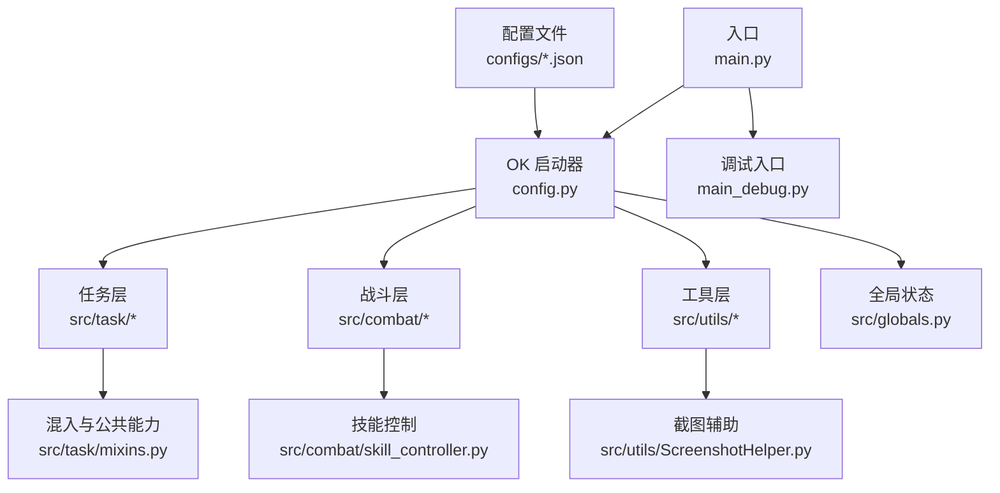
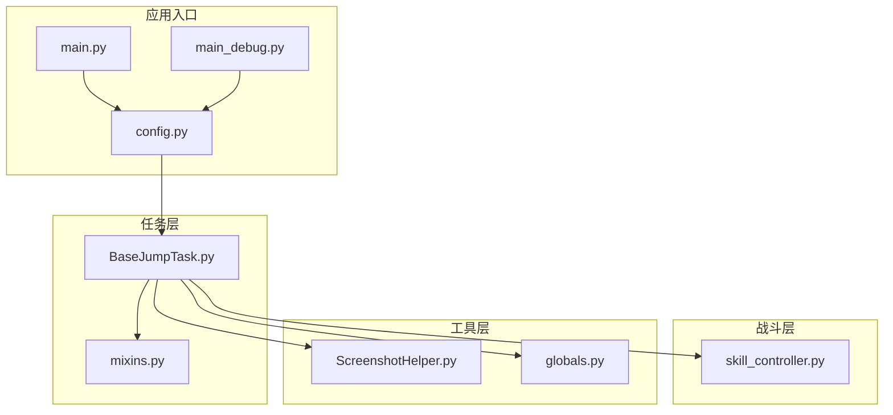
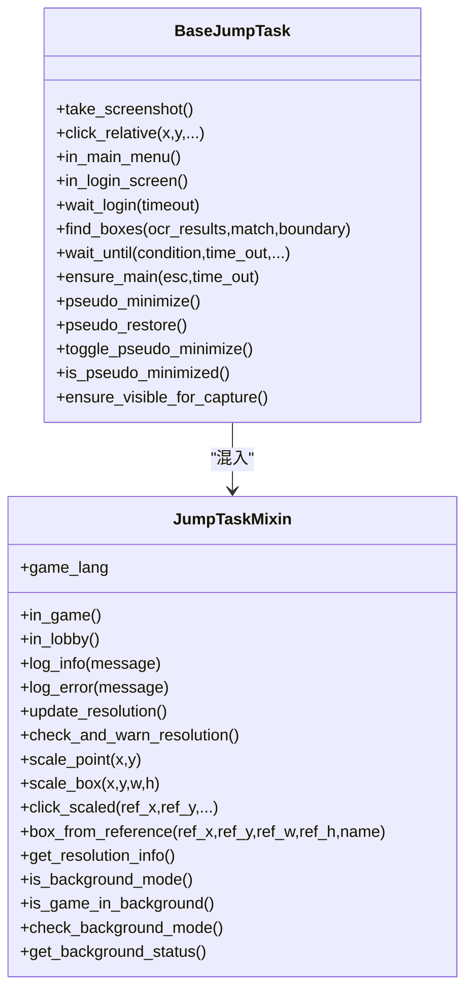
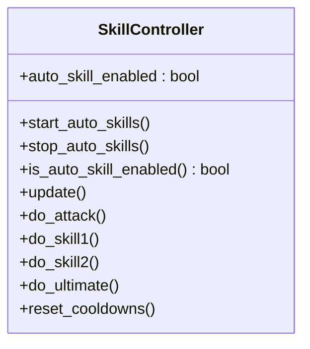
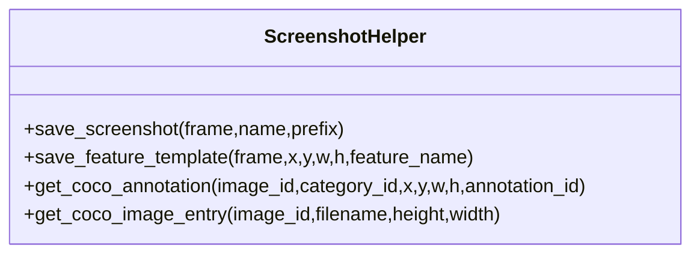
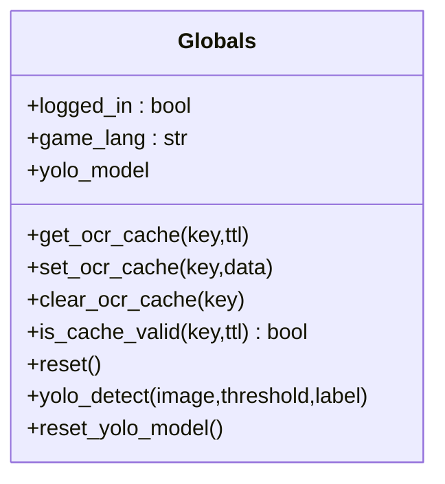
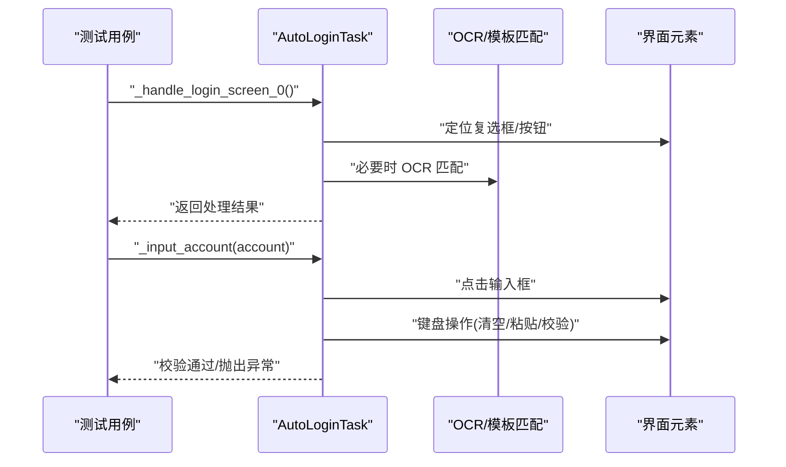
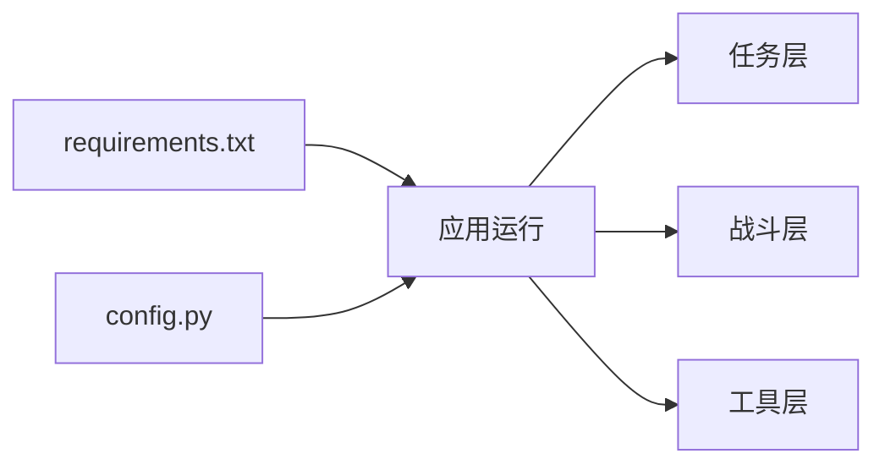

# 开发者指南

<cite>
**本文引用的文件**
- [main.py](file://main.py)
- [main_debug.py](file://main_debug.py)
- [config.py](file://config.py)
- [requirements.txt](file://requirements.txt)
- [src/globals.py](file://src/globals.py)
- [src/task/BaseJumpTask.py](file://src/task/BaseJumpTask.py)
- [src/task/mixins.py](file://src/task/mixins.py)
- [src/combat/skill_controller.py](file://src/combat/skill_controller.py)
- [src/utils/ScreenshotHelper.py](file://src/utils/ScreenshotHelper.py)
- [tests/test_autologin_task.py](file://tests/test_autologin_task.py)
- [configs/AutoLoginTask.json](file://configs/AutoLoginTask.json)
- [configs/Basic Options.json](file://configs/Basic Options.json)
- [configs/ui_config.json](file://configs/ui_config.json)
</cite>

## 目录
1. [简介](#简介)
2. [项目结构](#项目结构)
3. [核心组件](#核心组件)
4. [架构总览](#架构总览)
5. [详细组件分析](#详细组件分析)
6. [依赖分析](#依赖分析)
7. [性能考虑](#性能考虑)
8. [调试与开发工具](#调试与开发工具)
9. [贡献指南与代码审查](#贡献指南与代码审查)
10. [开发环境搭建与 IDE 配置](#开发环境搭建与-ide-配置)
11. [故障排查指南](#故障排查指南)
12. [结论](#结论)
13. [附录](#附录)

## 简介
本指南面向新老开发者，系统性说明本项目的代码规范、开发约定、调试技巧、性能优化策略、贡献流程与环境搭建建议。内容基于仓库现有实现与配置文件进行提炼，帮助你在最短时间内理解并高效参与开发。

## 项目结构
项目采用“功能分层 + 配置驱动”的组织方式：
- 根目录入口与配置：main.py、main_debug.py、config.py、requirements.txt
- 业务任务与场景：src/task、src/scene、src/controller
- 核心能力模块：src/combat（战斗）、src/utils（工具）、src/constants（常量）
- 配置与资源：configs（JSON 配置）、assets（模型与模板）、i18n、icons、screenshots
- 测试：tests（单元测试）

图表来源
- [main.py:1-33](file://main.py#L1-L33)
- [config.py:65-137](file://config.py#L65-L137)
- [src/task/mixins.py:12-301](file://src/task/mixins.py#L12-L301)
- [src/combat/skill_controller.py:12-181](file://src/combat/skill_controller.py#L12-L181)
- [src/utils/ScreenshotHelper.py:7-68](file://src/utils/ScreenshotHelper.py#L7-L68)

章节来源
- [main.py:1-33](file://main.py#L1-L33)
- [config.py:65-137](file://config.py#L65-L137)

## 核心组件
- 入口与启动
  - main.py：集成 GUI 启动卡片，扩展导出日志功能，并以配置启动 OK 引擎。
  - main_debug.py：禁用 GUI、开启调试模式，便于命令行调试。
- 配置中心
  - config.py：集中定义 OCR、模板匹配、窗口交互、ADB、分辨率、窗口尺寸、日志路径、一次性任务与触发任务清单等。
- 全局状态
  - src/globals.py：全局资源管理器，提供登录状态、OCR 缓存、语言、YOLO 模型延迟加载与检测、重置等能力。
- 任务与混入
  - src/task/BaseJumpTask.py：一次性任务基类，提供截图、坐标点击、场景检测、登录等待、伪最小化等能力。
  - src/task/mixins.py：通用混入类，提供语言检测、场景状态检测、分辨率适配、后台模式检查、日志封装等。
- 战斗与输入
  - src/combat/skill_controller.py：技能控制，支持 PC 键盘与手机点击两种模式，具备冷却与自动释放策略。
- 工具与截图
  - src/utils/ScreenshotHelper.py：截图保存、特征模板提取、COCO 注解生成辅助。
- 配置文件
  - configs/*.json：任务开关、触发间隔、窗口捕获方式、UI 主题与语言等。

章节来源
- [main.py:10-33](file://main.py#L10-L33)
- [main_debug.py:6-16](file://main_debug.py#L6-L16)
- [config.py:23-137](file://config.py#L23-L137)
- [src/globals.py:16-227](file://src/globals.py#L16-L227)
- [src/task/BaseJumpTask.py:10-295](file://src/task/BaseJumpTask.py#L10-L295)
- [src/task/mixins.py:12-301](file://src/task/mixins.py#L12-L301)
- [src/combat/skill_controller.py:12-181](file://src/combat/skill_controller.py#L12-L181)
- [src/utils/ScreenshotHelper.py:7-68](file://src/utils/ScreenshotHelper.py#L7-L68)
- [configs/AutoLoginTask.json:1-12](file://configs/AutoLoginTask.json#L1-L12)
- [configs/Basic Options.json:1-13](file://configs/Basic Options.json#L1-L13)
- [configs/ui_config.json:1-17](file://configs/ui_config.json#L1-L17)

## 架构总览
系统围绕 OK 引擎构建，通过配置驱动任务编排，任务层复用混入类实现跨任务的通用能力，战斗层负责输入与技能释放，工具层提供截图与资源管理，全局状态贯穿各模块。

图表来源
- [main.py:10-33](file://main.py#L10-L33)
- [main_debug.py:6-16](file://main_debug.py#L6-L16)
- [config.py:65-137](file://config.py#L65-L137)
- [src/task/BaseJumpTask.py:10-295](file://src/task/BaseJumpTask.py#L10-L295)
- [src/task/mixins.py:12-301](file://src/task/mixins.py#L12-L301)
- [src/combat/skill_controller.py:12-181](file://src/combat/skill_controller.py#L12-L181)
- [src/utils/ScreenshotHelper.py:7-68](file://src/utils/ScreenshotHelper.py#L7-L68)
- [src/globals.py:16-227](file://src/globals.py#L16-L227)

## 详细组件分析

### 任务基类与混入类
- BaseJumpTask
  - 负责截图、相对坐标点击、场景检测（大厅/游戏/登录）、登录等待、ESC 返回主界面、伪最小化与可见性保障。
  - 提供等待条件、OCR 文本框匹配、边界筛选等实用方法。
- JumpTaskMixin
  - 提供语言检测、场景状态检测、分辨率适配（缩放坐标/矩形）、后台模式检查、日志封装、分辨率信息查询等。

图表来源
- [src/task/BaseJumpTask.py:10-295](file://src/task/BaseJumpTask.py#L10-L295)
- [src/task/mixins.py:12-301](file://src/task/mixins.py#L12-L301)

章节来源
- [src/task/BaseJumpTask.py:10-295](file://src/task/BaseJumpTask.py#L10-L295)
- [src/task/mixins.py:12-301](file://src/task/mixins.py#L12-L301)

### 技能控制器
- 功能要点
  - 支持 PC 键盘与手机点击两种模式；按键映射来自配置。
  - 冷却计时与自动释放策略，按配置间隔触发普通攻击、技能1、技能2、大招。
  - 提供冷却重置与开关控制。

图表来源
- [src/combat/skill_controller.py:12-181](file://src/combat/skill_controller.py#L12-L181)

章节来源
- [src/combat/skill_controller.py:12-181](file://src/combat/skill_controller.py#L12-L181)

### 截图与特征工具
- ScreenshotHelper
  - 保存截图、提取特征模板、生成 COCO 注解条目，便于训练与标注。

图表来源
- [src/utils/ScreenshotHelper.py:7-68](file://src/utils/ScreenshotHelper.py#L7-L68)

章节来源
- [src/utils/ScreenshotHelper.py:7-68](file://src/utils/ScreenshotHelper.py#L7-L68)

### 全局状态管理器
- 能力概览
  - 登录状态、游戏语言、OCR 缓存（带 TTL）、YOLO 模型延迟加载与检测、重置与模型释放。

图表来源
- [src/globals.py:16-227](file://src/globals.py#L16-L227)

章节来源
- [src/globals.py:16-227](file://src/globals.py#L16-L227)

### 登录任务测试（示例）
- 测试覆盖
  - 登录界面 0/1/2 的处理、问卷调查流程、OCR 文本框匹配、输入账号与校验、超时与异常分支等。

图表来源
- [tests/test_autologin_task.py:9-407](file://tests/test_autologin_task.py#L9-L407)

章节来源
- [tests/test_autologin_task.py:9-407](file://tests/test_autologin_task.py#L9-L407)

## 依赖分析
- 运行时依赖
  - 通过 requirements.txt 明确列出：ok-script、PySide6、OpenCV、numpy、adbutils、pywin32、psutil、pydirectinput、onnxruntime、onnxruntime-directml、pyperclip 等。
- 配置驱动
  - config.py 定义 OCR、模板匹配、窗口交互、ADB、分辨率、窗口尺寸、日志路径、一次性任务与触发任务清单等，作为运行期行为的唯一权威来源。

图表来源
- [requirements.txt:1-13](file://requirements.txt#L1-L13)
- [config.py:65-137](file://config.py#L65-L137)

章节来源
- [requirements.txt:1-13](file://requirements.txt#L1-13)
- [config.py:65-137](file://config.py#L65-L137)

## 性能考虑
- 触发间隔与资源占用
  - 触发间隔（毫秒）可在配置中调节，适当增大可降低 CPU/GPU 占用，详见配置项说明。
- 分辨率与缩放
  - 通过混入类提供的分辨率适配方法，避免硬编码坐标导致的性能浪费与误判。
- 后台模式与伪最小化
  - 后台模式与伪最小化可减少窗口交互开销，提升后台运行稳定性。
- 模型与缓存
  - YOLO 模型延迟加载与缓存策略有助于降低冷启动成本；OCR 缓存带 TTL，避免重复计算。
- 截图与写盘
  - 截图仅在必要时保存，避免频繁 IO；特征模板提取用于训练，不参与实时流程。

章节来源
- [config.py:49,59,119-122](file://config.py#L49,L59,L119-L122)
- [src/task/mixins.py:101-179](file://src/task/mixins.py#L101-L179)
- [src/globals.py:107-134](file://src/globals.py#L107-L134)
- [src/globals.py:182-198](file://src/globals.py#L182-L198)
- [src/utils/ScreenshotHelper.py:17-30](file://src/utils/ScreenshotHelper.py#L17-L30)

## 调试与开发工具
- 启动方式
  - GUI 启动：main.py
  - 调试启动：main_debug.py（禁用 GUI、开启调试）
- 日志导出
  - GUI 启动卡片扩展了导出日志功能，打包 logs 目录并打开下载位置。
- 调试建议
  - 使用调试入口禁用 GUI，便于命令行观察日志与状态。
  - 在任务层使用日志封装方法输出关键步骤，结合截图辅助定位。
  - 利用分辨率适配与后台模式检查，排除环境差异导致的问题。

章节来源
- [main.py:10-28](file://main.py#L10-L28)
- [main_debug.py:6-16](file://main_debug.py#L6-L16)
- [src/task/mixins.py:81-97](file://src/task/mixins.py#L81-L97)

## 贡献指南与代码审查
- 代码规范与约定
  - 命名规范：模块与类采用帕斯卡命名；方法与变量采用下划线命名；常量全大写。
  - 注释标准：模块顶部提供简要说明；复杂方法提供参数与返回说明；关键流程加注释。
  - 代码格式：遵循 Python 风格指南，保持缩进一致、空行合理、导入顺序清晰。
- 提交流程
  - 新功能/修复需配套单元测试；修改配置文件时同步更新默认值与注释。
  - 提交前确保本地测试通过，必要时补充截图与日志片段。
- 代码审查要点
  - 关注跨平台兼容性（窗口捕获、键盘输入、ADB 模式）。
  - 关注性能影响（触发间隔、截图频率、模型加载与缓存）。
  - 关注可维护性（职责单一、错误处理、日志与异常信息）。

章节来源
- [src/task/BaseJumpTask.py:10-295](file://src/task/BaseJumpTask.py#L10-L295)
- [src/task/mixins.py:12-301](file://src/task/mixins.py#L12-L301)
- [src/combat/skill_controller.py:12-181](file://src/combat/skill_controller.py#L12-L181)
- [src/utils/ScreenshotHelper.py:7-68](file://src/utils/ScreenshotHelper.py#L7-L68)
- [tests/test_autologin_task.py:9-407](file://tests/test_autologin_task.py#L9-L407)

## 开发环境搭建与 IDE 配置
- 环境准备
  - Python 版本与依赖：根据 requirements.txt 安装依赖。
  - 配置文件：确保 configs 目录存在并包含所需 JSON 文件。
- IDE 建议
  - 使用支持 Python 的 IDE（如 VS Code/PyCharm），启用 Pylance/智能感知。
  - 配置工作区为项目根目录，设置解释器为项目虚拟环境。
  - 为 main.py 与 main_debug.py 配置运行/调试参数，便于快速启动。
- 快速验证
  - 运行 main.py 启动 GUI，确认日志与窗口交互正常。
  - 运行 main_debug.py 启动调试模式，观察日志输出。

章节来源
- [requirements.txt:1-13](file://requirements.txt#L1-L13)
- [configs/Basic Options.json:1-13](file://configs/Basic Options.json#L1-L13)
- [configs/ui_config.json:1-17](file://configs/ui_config.json#L1-L17)

## 故障排查指南
- 常见问题定位
  - 登录流程异常：检查登录界面识别（模板/OCR）、账号输入与校验、超时配置。
  - 分辨率不匹配：查看分辨率适配日志，确认比例与推荐尺寸。
  - 后台模式无效：确认后台模式状态与窗口捕获方式配置。
  - 截图失败：检查截图保存目录权限与路径。
- 定位手段
  - 使用测试用例模拟关键路径，断言关键行为。
  - 在任务层使用日志封装方法输出上下文信息。
  - 导出日志压缩包，结合截图与日志分析。

章节来源
- [tests/test_autologin_task.py:9-407](file://tests/test_autologin_task.py#L9-L407)
- [src/task/mixins.py:120-143](file://src/task/mixins.py#L120-L143)
- [src/task/BaseJumpTask.py:81-106](file://src/task/BaseJumpTask.py#L81-L106)
- [src/utils/ScreenshotHelper.py:17-30](file://src/utils/ScreenshotHelper.py#L17-L30)
- [main.py:10-28](file://main.py#L10-L28)

## 结论
本指南总结了项目的架构、核心组件、开发规范、调试与性能优化策略，并提供了贡献流程与环境搭建建议。建议在开发过程中始终以配置为中心、以测试为保障、以日志为依据，持续优化跨平台兼容性与运行效率。

## 附录
- 配置项速览
  - 触发间隔、后台模式、最小化策略、窗口捕获方式、日志路径、一次性/触发任务清单等。
- 资源与工具
  - assets 中包含模型与模板，screenshots 用于截图与特征提取，i18n 与 icons 用于国际化与图标。

章节来源
- [config.py:65-137](file://config.py#L65-L137)
- [configs/AutoLoginTask.json:1-12](file://configs/AutoLoginTask.json#L1-L12)
- [configs/Basic Options.json:1-13](file://configs/Basic Options.json#L1-L13)
- [configs/ui_config.json:1-17](file://configs/ui_config.json#L1-L17)