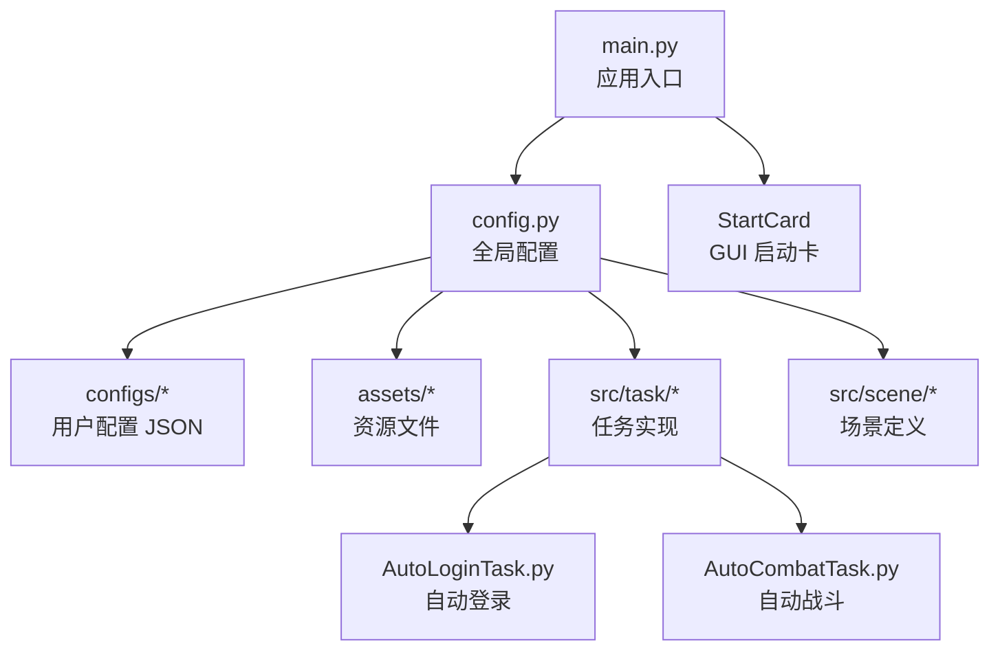
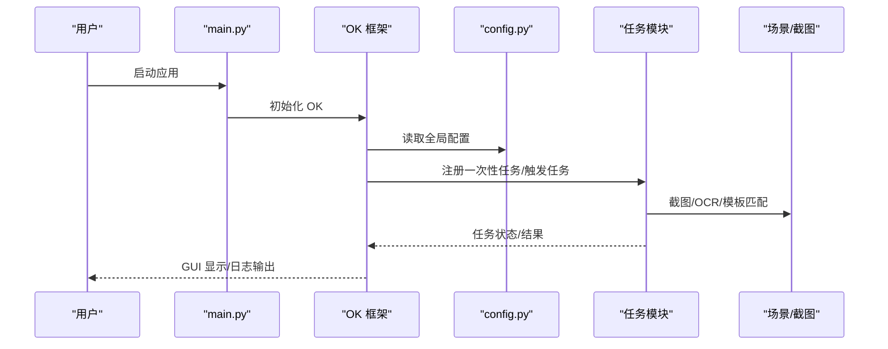
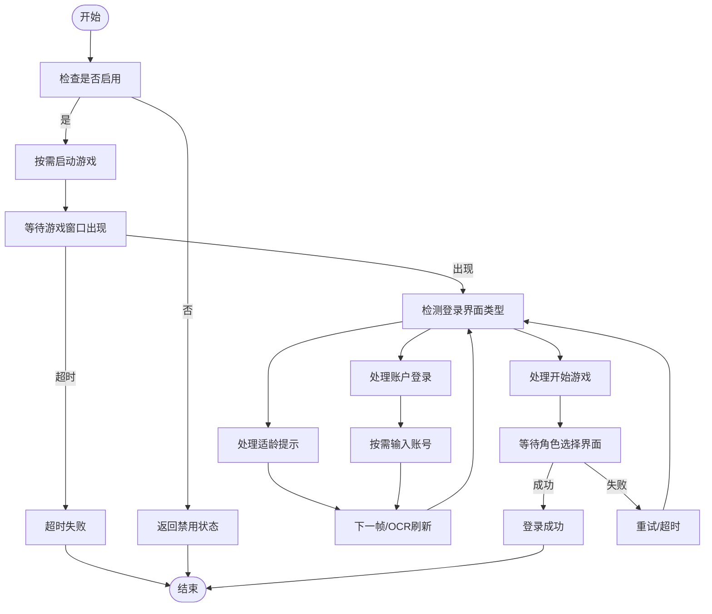
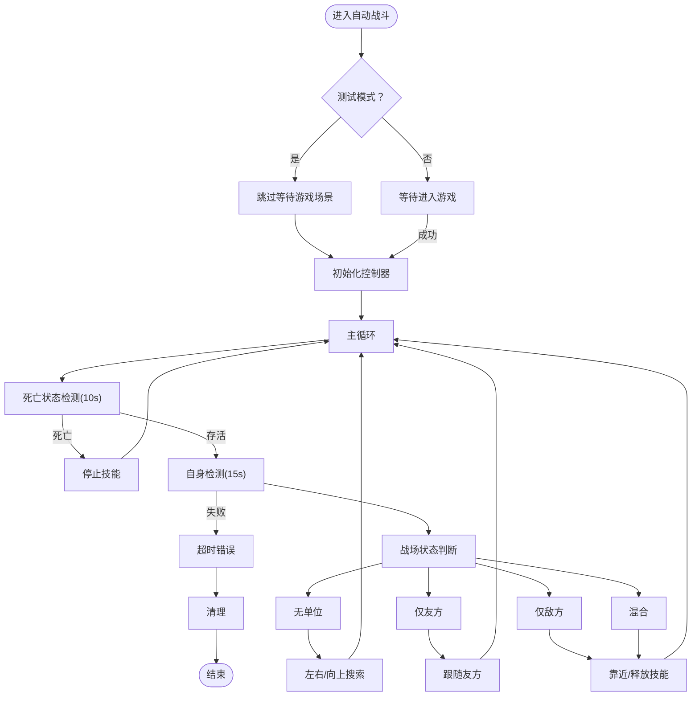
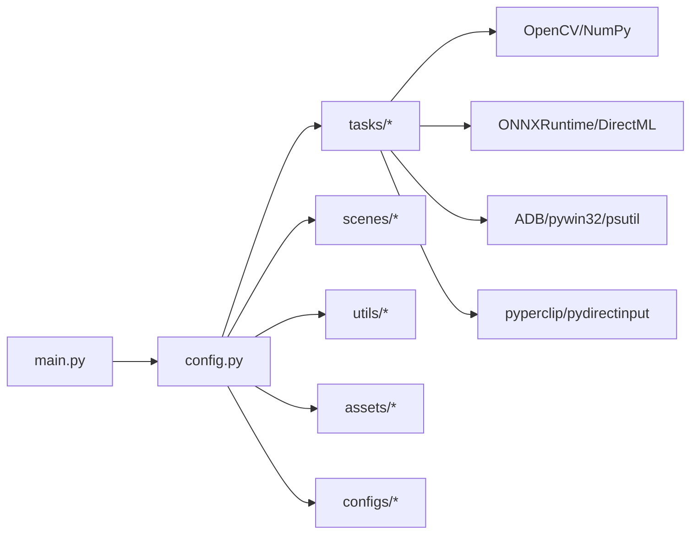

# 快速开始

<cite>
**本文引用的文件**
- [requirements.txt](file://requirements.txt)
- [ok.yml](file://ok.yml)
- [main.py](file://main.py)
- [main_debug.py](file://main_debug.py)
- [config.py](file://config.py)
- [configs/_ok.json](file://configs/_ok.json)
- [configs/devices.json](file://configs/devices.json)
- [configs/Basic Options.json](file://configs/Basic Options.json)
- [configs/游戏热键配置.json](file://configs/游戏热键配置.json)
- [src/task/AutoLoginTask.py](file://src/task/AutoLoginTask.py)
- [src/task/AutoCombatTask.py](file://src/task/AutoCombatTask.py)
</cite>

## 目录
1. [简介](#简介)
2. [项目结构](#项目结构)
3. [核心组件](#核心组件)
4. [架构总览](#架构总览)
5. [详细组件分析](#详细组件分析)
6. [依赖关系分析](#依赖关系分析)
7. [性能注意事项](#性能注意事项)
8. [故障排除指南](#故障排除指南)
9. [结论](#结论)
10. [附录](#附录)

## 简介
本指南面向首次接触 OK-Jump 的用户，帮助你在最短时间内完成 Python 环境准备、依赖安装、项目初始化与第一次自动化任务运行。OK-Jump 是一款基于 Python 的图形界面自动化工具，支持自动登录、自动战斗等任务，并提供多分辨率适配与后台运行能力。

## 项目结构
OK-Jump 采用模块化组织方式，核心入口位于根目录，配置与资源分别位于 configs 与 assets 目录，业务逻辑集中在 src 下的任务与场景模块中。

图表来源
- [main.py:30-33](file://main.py#L30-L33)
- [config.py:65-137](file://config.py#L65-L137)

章节来源
- [main.py:1-33](file://main.py#L1-L33)
- [config.py:1-138](file://config.py#L1-L138)

## 核心组件
- 应用入口与启动
  - 通过入口脚本启动 GUI 并初始化 OK 框架，随后进入任务调度与场景管理。
- 全局配置中心
  - 提供 OCR、模板匹配、窗口交互、ADB、分辨率与窗口尺寸、日志与截图路径、一次性任务与触发任务列表等集中配置。
- 用户配置文件
  - 包含窗口位置、设备选择、基础选项与热键配置等，覆盖 GUI 与命令行两种运行模式。
- 任务模块
  - 自动登录与自动战斗等核心任务，负责具体业务流程与交互。

章节来源
- [main.py:30-33](file://main.py#L30-L33)
- [config.py:65-137](file://config.py#L65-L137)
- [configs/_ok.json:1-7](file://configs/_ok.json#L1-L7)
- [configs/devices.json:1-7](file://configs/devices.json#L1-L7)
- [configs/Basic Options.json:1-13](file://configs/Basic Options.json#L1-L13)
- [configs/游戏热键配置.json:1-6](file://configs/游戏热键配置.json#L1-L6)

## 架构总览
OK-Jump 的运行时由“入口脚本 -> OK 框架 -> GUI/控制台 -> 任务调度 -> 场景识别 -> 交互执行”构成。配置中心贯穿始终，为各模块提供统一参数。

图表来源
- [main.py:30-33](file://main.py#L30-L33)
- [config.py:124-136](file://config.py#L124-L136)

## 详细组件分析

### 安装与环境准备
- Python 版本要求
  - 项目明确要求 Python 3.12。
- 依赖安装
  - 使用 pip 安装 requirements.txt 中列出的所有依赖。
- 权限与管理员
  - 配置文件表明需要以管理员权限运行，以便访问系统级功能（如窗口捕获、输入模拟等）。

章节来源
- [ok.yml:1-12](file://ok.yml#L1-L12)
- [requirements.txt:1-13](file://requirements.txt#L1-L13)

### 项目初始化
- 首次运行建议
  - 确认 Python 3.12 已正确安装并加入 PATH。
  - 在项目根目录执行依赖安装。
  - 运行入口脚本启动 GUI；若需调试模式，可使用 debug 脚本。
- 配置文件说明
  - _ok.json：记录 GUI 窗口初始位置与大小。
  - devices.json：设备选择（PC 或 ADB），以及首选 PC 可执行文件路径。
  - Basic Options.json：基础行为开关（如后台模式、触发间隔、捕获方式等）。
  - 游戏热键配置.json：普通攻击、技能与大招的按键映射。

章节来源
- [configs/_ok.json:1-7](file://configs/_ok.json#L1-L7)
- [configs/devices.json:1-7](file://configs/devices.json#L1-L7)
- [configs/Basic Options.json:1-13](file://configs/Basic Options.json#L1-L13)
- [configs/游戏热键配置.json:1-6](file://configs/游戏热键配置.json#L1-L6)

### 启动应用程序
- 图形界面启动
  - 直接运行入口脚本，OK 框架会加载 GUI 并注册任务。
- 调试模式启动
  - 关闭 GUI，仅输出日志，便于排查问题。

章节来源
- [main.py:30-33](file://main.py#L30-L33)
- [main_debug.py:6-16](file://main_debug.py#L6-L16)

### 基本参数配置
- 全局配置项
  - OCR 参数（ONNX OCR）、模板匹配阈值与特征文件、窗口标题与类名、捕获方法列表、ADB 包名与启用状态、支持分辨率与参考分辨率、窗口尺寸、日志与截图路径、一次性任务与触发任务列表、场景定义。
- 设备与路径
  - devices.json 中的 preferred、pc_full_path、capture 等字段决定捕获来源与游戏路径。
- 基础选项
  - Basic Options.json 控制后台模式、触发间隔、捕获方式、DirectML 使用等。

章节来源
- [config.py:75-137](file://config.py#L75-L137)
- [configs/devices.json:1-7](file://configs/devices.json#L1-L7)
- [configs/Basic Options.json:1-13](file://configs/Basic Options.json#L1-L13)

### 运行第一个自动化任务：自动登录
- 任务职责
  - 自动启动游戏、处理适龄提示、账户登录、问卷调查、角色选择等流程。
- 关键流程
  - 检测登录界面类型（适龄提示、账户登录、开始游戏）。
  - 协议勾选处理（模板与 OCR 双通道）。
  - 可选账号输入（模板定位输入框、剪贴板与键盘输入、OCR 校验）。
  - 等待角色选择界面，判定登录成功。
- 常用配置
  - 是否自动启动游戏、登录等待超时、最大尝试次数、是否输入账号、输入校验超时等。

图表来源
- [src/task/AutoLoginTask.py:96-141](file://src/task/AutoLoginTask.py#L96-L141)
- [src/task/AutoLoginTask.py:196-271](file://src/task/AutoLoginTask.py#L196-L271)
- [src/task/AutoLoginTask.py:481-566](file://src/task/AutoLoginTask.py#L481-L566)
- [src/task/AutoLoginTask.py:626-756](file://src/task/AutoLoginTask.py#L626-L756)

章节来源
- [src/task/AutoLoginTask.py:18-141](file://src/task/AutoLoginTask.py#L18-L141)
- [src/task/AutoLoginTask.py:196-271](file://src/task/AutoLoginTask.py#L196-L271)
- [src/task/AutoLoginTask.py:481-566](file://src/task/AutoLoginTask.py#L481-L566)
- [src/task/AutoLoginTask.py:626-756](file://src/task/AutoLoginTask.py#L626-L756)

### 运行自动战斗任务
- 任务职责
  - 在触发条件下进入战斗场景，进行死亡状态检测、自身定位、战场状态判断与智能移动/技能释放。
- 关键流程
  - 初始化控制器（状态检测、移动、技能、距离计算）。
  - 主循环：死亡检测、自身检测、战场状态判断、距离维持与技能控制。
  - 支持测试模式（跳过场景检测）。
- 常用配置
  - 自动普攻/技能/大招、各类技能间隔、测试模式开关。

图表来源
- [src/task/AutoCombatTask.py:65-107](file://src/task/AutoCombatTask.py#L65-L107)
- [src/task/AutoCombatTask.py:147-198](file://src/task/AutoCombatTask.py#L147-L198)
- [src/task/AutoCombatTask.py:200-320](file://src/task/AutoCombatTask.py#L200-L320)

章节来源
- [src/task/AutoCombatTask.py:25-107](file://src/task/AutoCombatTask.py#L25-L107)
- [src/task/AutoCombatTask.py:147-198](file://src/task/AutoCombatTask.py#L147-L198)
- [src/task/AutoCombatTask.py:200-320](file://src/task/AutoCombatTask.py#L200-L320)

## 依赖关系分析
- 运行时依赖
  - GUI 与控件：PySide6 系列。
  - 计算与图像：OpenCV、NumPy。
  - ADB 与系统：adbutils、pywin32、psutil。
  - 推理与识别：ONNXRuntime、ONNXRuntime-DirectML、OCR。
  - 剪贴板与输入：pyperclip、pydirectinput。
- 配置驱动
  - config.py 作为全局配置中心，集中管理 OCR、模板匹配、窗口交互、ADB、分辨率、窗口尺寸、日志与截图路径、一次性任务与触发任务列表、场景定义。

图表来源
- [requirements.txt:1-13](file://requirements.txt#L1-L13)
- [config.py:75-137](file://config.py#L75-L137)

章节来源
- [requirements.txt:1-13](file://requirements.txt#L1-L13)
- [config.py:75-137](file://config.py#L75-L137)

## 性能注意事项
- 触发间隔
  - 增加触发间隔可显著降低 CPU/GPU 使用率，适合低性能机器或后台运行。
- 捕获与渲染
  - Windows 平台支持多种捕获方式，可根据性能与稳定性选择。
- 分辨率与缩放
  - 项目内置支持的分辨率与参考分辨率，确保识别与点击精度。
- 后台模式
  - 启用后台模式可在窗口最小化或被遮挡时继续运行，但需注意系统策略与权限。

章节来源
- [config.py:49,56-62](file://config.py#L49,L56-L62)
- [config.py:101-117](file://config.py#L101-L117)
- [config.py:88-94](file://config.py#L88-L94)

## 故障排除指南
- Python 版本不匹配
  - 症状：启动时报错或模块导入失败。
  - 解决：确保使用 Python 3.12。
- 依赖安装失败
  - 症状：pip 安装报错或部分包无法编译。
  - 解决：检查网络与代理；必要时使用国内镜像源；确认系统已安装构建工具链。
- 无管理员权限
  - 症状：窗口捕获、输入模拟失败。
  - 解决：以管理员身份运行入口脚本或调试脚本。
- 游戏窗口未识别
  - 症状：任务无法检测到游戏窗口。
  - 解决：确认 devices.json 中的 pc_full_path 指向正确的可执行文件；检查窗口标题与类名配置；尝试更换捕获方式。
- 登录流程卡住
  - 症状：无法进入角色选择界面。
  - 解决：检查 Basic Options.json 中的捕获方式与 DirectML 设置；适当增大登录等待超时；确认热键配置正确。
- 自动战斗无效
  - 症状：未释放技能或移动异常。
  - 解决：启用测试模式进行验证；检查技能间隔配置；确认分辨率与缩放比例一致。

章节来源
- [ok.yml:1-12](file://ok.yml#L1-L12)
- [requirements.txt:1-13](file://requirements.txt#L1-L13)
- [configs/devices.json:1-7](file://configs/devices.json#L1-L7)
- [config.py:88-94](file://config.py#L88-L94)
- [src/task/AutoLoginTask.py:121-130](file://src/task/AutoLoginTask.py#L121-L130)
- [src/task/AutoCombatTask.py:76-98](file://src/task/AutoCombatTask.py#L76-L98)

## 结论
通过本指南，你已完成 Python 环境准备、依赖安装与项目初始化，并掌握了启动应用、配置基础参数与运行首个自动化任务的方法。建议在熟悉基础流程后，逐步调整分辨率、捕获方式与触发间隔，以获得更稳定的自动化体验。

## 附录
- 学习路径建议
  - 初学者：先运行自动登录任务，理解界面与配置；再尝试自动战斗任务。
  - 进阶者：调整分辨率与捕获方式，优化触发间隔；开启后台模式与伪最小化。
  - 高级用户：结合调试脚本与日志导出功能，深入分析识别与交互问题。
- 日志与截图
  - 日志文件与截图目录在全局配置中定义，便于问题定位与复现。

章节来源
- [config.py:119-122](file://config.py#L119-L122)
- [main.py:10-28](file://main.py#L10-L28)