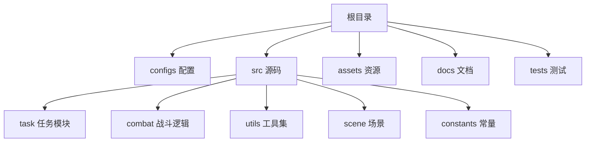
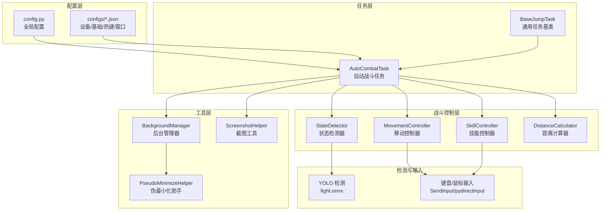
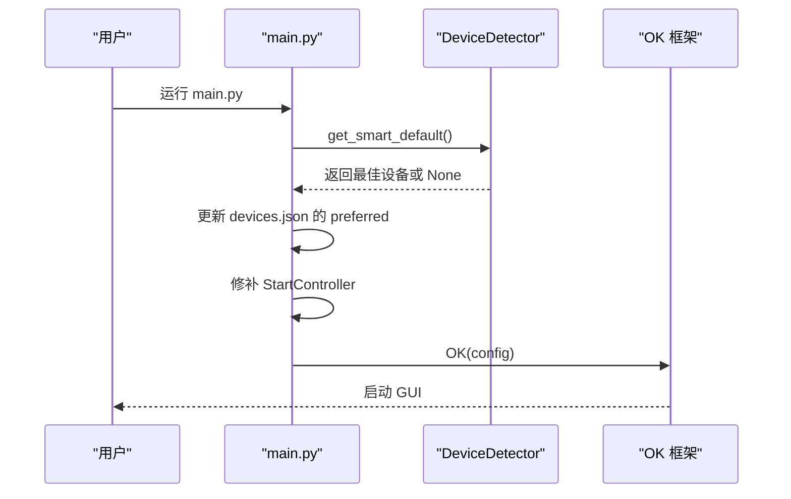
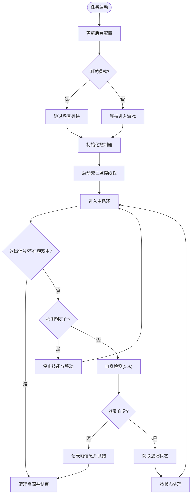
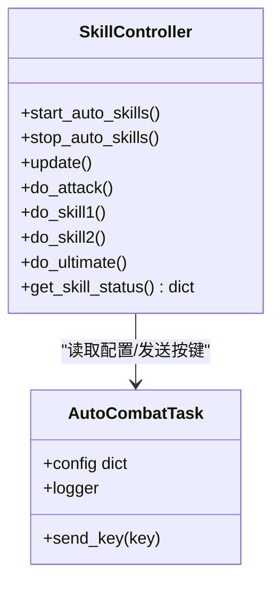
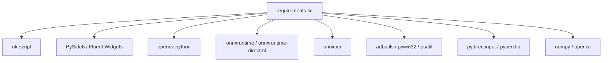

# 快速开始

<cite>
**本文引用的文件**
- [main.py](file://main.py)
- [requirements.txt](file://requirements.txt)
- [README.md](file://README.md)
- [config.py](file://config.py)
- [src/task/BaseJumpTask.py](file://src/task/BaseJumpTask.py)
- [src/task/AutoCombatTask.py](file://src/task/AutoCombatTask.py)
- [src/combat/skill_controller.py](file://src/combat/skill_controller.py)
- [src/utils/DeviceDetector.py](file://src/utils/DeviceDetector.py)
- [src/utils/ScreenshotHelper.py](file://src/utils/ScreenshotHelper.py)
- [configs/Basic Options.json](file://configs/Basic Options.json)
- [configs/devices.json](file://configs/devices.json)
- [configs/AutoCombatTask.json](file://configs/AutoCombatTask.json)
- [configs/游戏热键配置.json](file://configs/游戏热键配置.json)
- [configs/_ok.json](file://configs/_ok.json)
- [configs/ui_config.json](file://configs/ui_config.json)
- [docs/自动战斗系统流程图.md](file://docs/自动战斗系统流程图.md)
</cite>

## 目录
1. [简介](#简介)
2. [项目结构](#项目结构)
3. [核心组件](#核心组件)
4. [架构总览](#架构总览)
5. [详细组件分析](#详细组件分析)
6. [依赖分析](#依赖分析)
7. [性能考虑](#性能考虑)
8. [故障排除指南](#故障排除指南)
9. [结论](#结论)
10. [附录](#附录)

## 简介
本指南面向首次使用 OK-Jump 的用户，帮助你在最短时间内完成环境准备、安装依赖、配置设备与热键，并成功启动程序完成第一次自动战斗。内容涵盖：
- Python 环境准备与虚拟环境创建
- 依赖安装与环境验证
- 基础配置与设备选择
- 启动与首次自动战斗流程
- 常见问题排查与最佳实践

## 项目结构
OK-Jump 基于 ok-script 框架，采用“配置驱动 + 任务模块 + 工具层”的分层组织方式。主要目录与职责如下：
- configs：存放各类 JSON 配置文件（设备、基础选项、自动战斗、热键、窗口等）
- src：核心源码，包含任务、战斗逻辑、工具与实用模块
- assets：资源文件（如检测模板、图片等）
- docs：文档与流程图
- tests：单元测试样例

图表来源
- [main.py:1-107](file://main.py#L1-L107)
- [config.py:68-148](file://config.py#L68-L148)

章节来源
- [main.py:1-107](file://main.py#L1-L107)
- [config.py:68-148](file://config.py#L68-L148)

## 核心组件
- 启动入口与智能设备选择：在启动前自动检测 PC 与模拟器连接状态，智能切换首选设备；并修补启动控制器以支持后台模式下的最小化/离屏窗口。
- 配置系统：通过 config.py 统一管理全局配置（窗口、ADB、分辨率、OCR、任务列表等），并通过 GUI 提供可视化配置。
- 自动战斗任务：AutoCombatTask 负责完整的自动战斗逻辑，包括自身检测、战场状态判断、技能释放与移动控制。
- 技能控制器：SkillController 基于 GUI 配置驱动，支持后台键盘输入与冷却控制。
- 设备检测器：DeviceDetector 通过窗口标题与 ADB 状态判断当前运行环境，辅助智能设备选择。

章节来源
- [main.py:54-95](file://main.py#L54-L95)
- [config.py:68-148](file://config.py#L68-L148)
- [src/task/AutoCombatTask.py:32-83](file://src/task/AutoCombatTask.py#L32-L83)
- [src/combat/skill_controller.py:24-79](file://src/combat/skill_controller.py#L24-L79)
- [src/utils/DeviceDetector.py:11-134](file://src/utils/DeviceDetector.py#L11-L134)

## 架构总览
OK-Jump 的运行时架构围绕“配置驱动 + 任务调度 + 图像/OCR 检测 + 输入控制”展开。下图展示了关键模块间的关系与数据流：

图表来源
- [config.py:68-148](file://config.py#L68-L148)
- [src/task/AutoCombatTask.py:16-29](file://src/task/AutoCombatTask.py#L16-L29)
- [src/combat/skill_controller.py:14-18](file://src/combat/skill_controller.py#L14-L18)
- [src/utils/ScreenshotHelper.py:7-11](file://src/utils/ScreenshotHelper.py#L7-L11)
- [docs/自动战斗系统流程图.md:7-39](file://docs/自动战斗系统流程图.md#L7-L39)

## 详细组件分析

### 启动与智能设备选择
- 启动流程要点：
  - 在 OK 初始化前执行智能设备选择，读取 devices.json 并根据当前 PC 与 ADB 状态自动更新 preferred 字段。
  - 修补 StartController，允许最小化/离屏窗口在后台模式下启动。
  - 初始化 OK 框架并启动 GUI。
- 常见问题：
  - 若 PC 与模拟器同时运行或均未运行，智能选择会保持用户配置不变，需手动确认 devices.json 中的 preferred。

图表来源
- [main.py:54-95](file://main.py#L54-L95)
- [src/utils/DeviceDetector.py:113-134](file://src/utils/DeviceDetector.py#L113-L134)

章节来源
- [main.py:54-95](file://main.py#L54-L95)
- [src/utils/DeviceDetector.py:11-149](file://src/utils/DeviceDetector.py#L11-L149)

### 自动战斗任务流程
- 初始化阶段：
  - 启用后台模式配置，打印当前后台状态。
  - 根据测试模式决定是否跳过场景等待。
  - 初始化控制器（状态检测、移动、技能、距离计算）。
  - 启动死亡监控线程。
- 主循环：
  - 检测退出信号与死亡状态。
  - 自身检测（15 秒超时）与战场状态判断。
  - 根据不同战场状态执行相应策略（搜索单位、跟随友方、攻击敌方、保持距离、释放技能）。
- 技能释放：
  - 基于 AutoCombatTask.json 的开关与间隔，结合游戏热键配置执行按键。
  - 移动中自动停止技能，距离达标后启动技能并持续更新。

图表来源
- [src/task/AutoCombatTask.py:84-134](file://src/task/AutoCombatTask.py#L84-L134)
- [src/task/AutoCombatTask.py:197-271](file://src/task/AutoCombatTask.py#L197-L271)
- [docs/自动战斗系统流程图.md:43-95](file://docs/自动战斗系统流程图.md#L43-L95)

章节来源
- [src/task/AutoCombatTask.py:32-134](file://src/task/AutoCombatTask.py#L32-L134)
- [src/task/AutoCombatTask.py:197-693](file://src/task/AutoCombatTask.py#L197-L693)
- [docs/自动战斗系统流程图.md:41-133](file://docs/自动战斗系统流程图.md#L41-L133)

### 技能控制器与热键配置
- 驱动来源：
  - 技能开关与间隔来自 AutoCombatTask.json。
  - 按键映射来自 游戏热键配置.json。
- 行为特征：
  - 支持后台键盘输入（SendInput），自动适配 ADB/Windows 模式。
  - 按配置周期性检查冷却并释放技能。
  - 提供技能状态查询接口，便于日志与调试。

图表来源
- [src/combat/skill_controller.py:24-347](file://src/combat/skill_controller.py#L24-L347)
- [src/task/AutoCombatTask.py:40-83](file://src/task/AutoCombatTask.py#L40-L83)

章节来源
- [src/combat/skill_controller.py:24-347](file://src/combat/skill_controller.py#L24-L347)
- [configs/AutoCombatTask.json:1-13](file://configs/AutoCombatTask.json#L1-L13)
- [configs/游戏热键配置.json:1-6](file://configs/游戏热键配置.json#L1-L6)

### 设备与分辨率配置
- 设备选择：
  - devices.json 中 preferred 字段决定默认设备（pc 或 adb）。
  - 智能设备选择会在 PC 与 ADB 状态不冲突时自动更新该字段。
- 分辨率与窗口：
  - config.py 中定义支持的宽高比与最小尺寸，并提供参考分辨率与窗口尺寸。
  - configs/_ok.json 存储窗口初始位置与大小，可在 GUI 中调整。

章节来源
- [configs/devices.json:1-7](file://configs/devices.json#L1-L7)
- [config.py:108-124](file://config.py#L108-L124)
- [configs/_ok.json:1-7](file://configs/_ok.json#L1-L7)

## 依赖分析
OK-Jump 的运行依赖主要分为四类：
- 框架与 GUI：ok-script、PySide6、Fluent Widgets
- 图像与 OCR：OpenCV、onnxruntime、onnxruntime-directml、onnxocr
- 系统与输入：adbutils、pywin32、psutil、pydirectinput、pyperclip
- 其他：numpy、opencc

图表来源
- [requirements.txt:1-14](file://requirements.txt#L1-L14)

章节来源
- [requirements.txt:1-14](file://requirements.txt#L1-L14)

## 性能考虑
- 后台模式与伪最小化：启用后台模式后，窗口可最小化或被遮挡，系统通过伪最小化与后台输入支持继续运行，降低对前台工作的干扰。
- 死亡检测优化：采用并行线程持续监控死亡状态，提升响应速度与稳定性。
- 主循环节拍：主循环延迟与死亡检测频率经过优化，兼顾实时性与资源占用。
- 建议：
  - 合理设置触发间隔，避免过高导致 CPU/GPU 占用上升。
  - 在高负载环境下适当提高触发间隔或降低分辨率。

章节来源
- [config.py:94-101](file://config.py#L94-L101)
- [docs/自动战斗系统流程图.md:156-178](file://docs/自动战斗系统流程图.md#L156-L178)

## 故障排除指南
- 无法启动或黑屏
  - 确认已创建并激活虚拟环境，且依赖安装完成。
  - 检查 Windows 捕获方法（WGC/BitBlt）与 DirectML 设置，必要时切换捕获方式或禁用 DirectML。
- 无法检测到设备
  - 若 PC 与模拟器同时运行，智能设备选择会保持用户配置，请检查 devices.json 的 preferred。
  - 确认 ADB 已正确安装并连接模拟器，或确认 PC 游戏窗口标题包含预期关键词。
- 自动战斗无效
  - 检查 AutoCombatTask.json 中技能开关与间隔是否合理。
  - 确认 游戏热键配置.json 中按键映射与实际游戏按键一致。
  - 在详细日志模式下查看技能释放与距离判定日志，定位问题。
- 窗口最小化后无法截图
  - 启用“最小化时伪最小化”并在 GUI 中确认后台模式已开启。
  - 如仍失败，尝试切换捕获方法或调整窗口位置。
- 日志导出
  - 使用 GUI 中的“导出日志”功能，将 logs 文件夹打包为压缩包以便反馈问题。

章节来源
- [main.py:11-26](file://main.py#L11-L26)
- [src/utils/DeviceDetector.py:113-134](file://src/utils/DeviceDetector.py#L113-L134)
- [src/task/AutoCombatTask.py:94-112](file://src/task/AutoCombatTask.py#L94-L112)
- [config.py:94-101](file://config.py#L94-L101)

## 结论
通过本快速开始指南，你已经完成了环境准备、依赖安装、设备与热键配置，并理解了自动战斗的完整流程。建议在首次运行时启用“测试模式”与“详细日志”，以便观察检测与技能释放行为；随后逐步调整技能间隔与移动策略，获得更稳定的战斗表现。

## 附录

### 安装步骤
- 克隆仓库并创建虚拟环境
- 激活虚拟环境
- 安装依赖
- 运行主程序启动 GUI

章节来源
- [README.md:34-66](file://README.md#L34-L66)
- [requirements.txt:1-14](file://requirements.txt#L1-L14)

### 基本使用流程（从启动到完成第一次自动战斗）
- 启动程序
- 在 GUI 中确认设备选择与热键配置
- 在主界面点击“开始/停止”快捷键启动自动战斗
- 观察日志与截图，确认检测与技能释放正常
- 结束后可导出日志进行问题排查

章节来源
- [main.py:99-107](file://main.py#L99-L107)
- [src/task/BaseJumpTask.py:133-151](file://src/task/BaseJumpTask.py#L133-L151)
- [src/task/AutoCombatTask.py:84-134](file://src/task/AutoCombatTask.py#L84-L134)

### 常见初始配置项说明
- 基础选项
  - 后台模式：允许窗口最小化或被遮挡时继续运行
  - 启动/停止快捷键：默认 F9
  - 自动调整游戏窗口大小：可选
- 设备选择
  - preferred：pc 或 adb
  - capture：截图方式（adb/WGC/BitBlt）
- 自动战斗
  - 技能开关：普攻/技能1/技能2/大招
  - 技能间隔：以秒为单位
  - 移动持续时间：以秒为单位
- 热键配置
  - 普通攻击、技能1、技能2、大招对应的按键

章节来源
- [configs/Basic Options.json:1-13](file://configs/Basic Options.json#L1-L13)
- [configs/devices.json:1-7](file://configs/devices.json#L1-L7)
- [configs/AutoCombatTask.json:1-13](file://configs/AutoCombatTask.json#L1-L13)
- [configs/游戏热键配置.json:1-6](file://configs/游戏热键配置.json#L1-L6)
- [config.py:94-101](file://config.py#L94-L101)

### 截图与日志
- 截图保存：使用截图工具将当前帧保存至 screenshots 目录
- 日志导出：通过 GUI 导出 logs 目录为压缩包，便于问题定位

章节来源
- [src/utils/ScreenshotHelper.py:17-30](file://src/utils/ScreenshotHelper.py#L17-L30)
- [main.py:11-26](file://main.py#L11-L26)