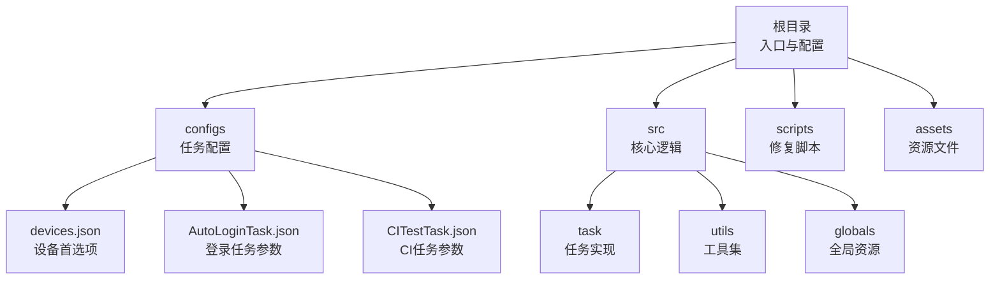
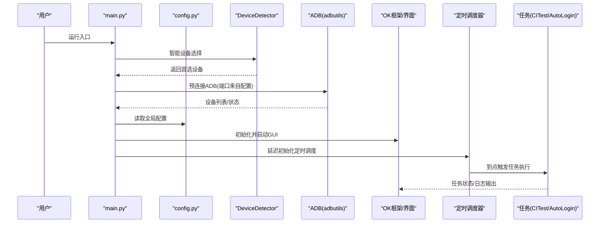
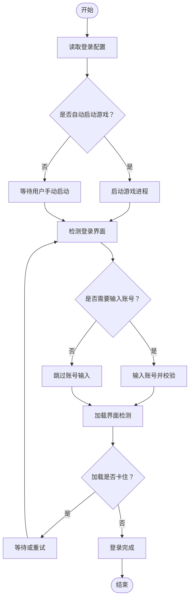
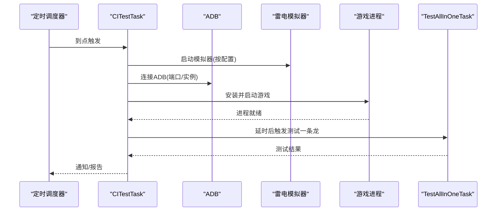
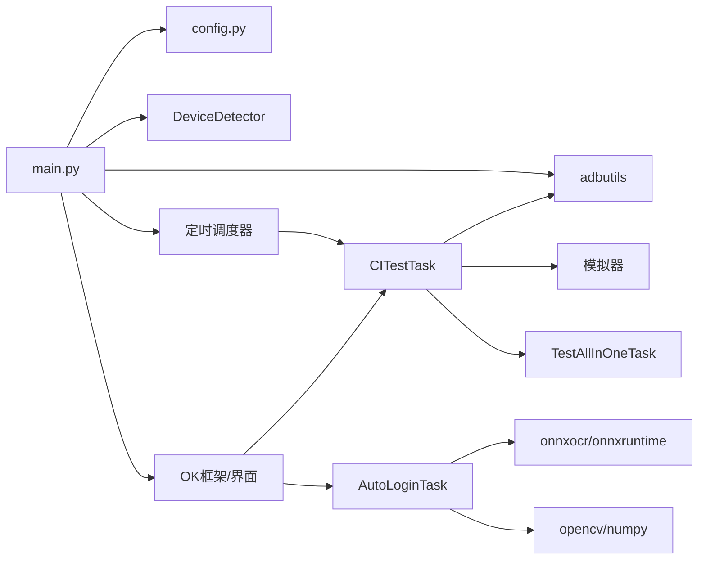

# 快速开始

<cite>
**本文引用的文件**
- [README.md](file://README.md)
- [requirements.txt](file://requirements.txt)
- [main.py](file://main.py)
- [config.py](file://config.py)
- [configs/devices.json](file://configs/devices.json)
- [configs/AutoLoginTask.json](file://configs/AutoLoginTask.json)
- [configs/CITestTask.json](file://configs/CITestTask.json)
- [scripts/fix_ok_script_window.py](file://scripts/fix_ok_script_window.py)
- [src/task/CITestTask.py](file://src/task/CITestTask.py)
- [src/task/AutoLoginTask.py](file://src/task/AutoLoginTask.py)
- [src/utils/DeviceDetector.py](file://src/utils/DeviceDetector.py)
- [src/globals.py](file://src/globals.py)
- [main_debug.py](file://main_debug.py)
</cite>

## 目录
1. [简介](#简介)
2. [项目结构](#项目结构)
3. [核心组件](#核心组件)
4. [架构总览](#架构总览)
5. [详细组件分析](#详细组件分析)
6. [依赖分析](#依赖分析)
7. [性能考虑](#性能考虑)
8. [故障排除指南](#故障排除指南)
9. [结论](#结论)
10. [附录](#附录)

## 简介
本指南面向初学者，帮助你在最短时间内成功运行 ok-jump 项目。内容涵盖环境要求、依赖安装、配置准备、启动步骤、基础使用示例以及常见问题排查。项目基于 ok-script 框架，提供图形界面与自动化任务能力，支持 PC 游戏与 Android 模拟器双设备模式，并内置 OCR、YOLO 检测、ADB 控制等能力。

## 项目结构
项目采用“配置 + 任务 + 工具 + 资源”的组织方式，关键目录与文件如下：
- 根目录：入口脚本、主程序、依赖清单、调试脚本
- configs：各类任务的配置文件（设备、登录、CI 等）
- src：核心业务逻辑（任务、工具、全局资源）
- scripts：辅助修复脚本
- assets：资源文件（图片、ONNX 模型、检测 JSON）

图表来源
- [main.py](file://main.py)
- [config.py](file://config.py)
- [configs/devices.json](file://configs/devices.json)
- [configs/AutoLoginTask.json](file://configs/AutoLoginTask.json)
- [configs/CITestTask.json](file://configs/CITestTask.json)
- [src/task/CITestTask.py](file://src/task/CITestTask.py)
- [src/task/AutoLoginTask.py](file://src/task/AutoLoginTask.py)
- [src/utils/DeviceDetector.py](file://src/utils/DeviceDetector.py)
- [src/globals.py](file://src/globals.py)

章节来源
- [README.md](file://README.md)
- [main.py](file://main.py)
- [config.py](file://config.py)

## 核心组件
- 入口与启动：主程序负责环境补丁、设备选择、ADB 预连接、定时调度初始化与 GUI 启动。
- 配置中心：集中管理 OCR、窗口、ADB、分辨率、窗口尺寸、日志、截图、一次性任务与触发任务等。
- 设备选择：根据 PC 游戏与 ADB 连接状态智能切换首选设备。
- 任务体系：包含自动登录、CI 自动化测试、日常任务、战斗触发等。
- 全局资源：统一管理登录状态、OCR 缓存、YOLO 模型等。

章节来源
- [main.py](file://main.py)
- [config.py](file://config.py)
- [src/utils/DeviceDetector.py](file://src/utils/DeviceDetector.py)
- [src/globals.py](file://src/globals.py)

## 架构总览
下图展示了从启动到任务执行的关键交互路径，包括设备选择、ADB 预连接、定时调度与任务启动。

图表来源
- [main.py](file://main.py)
- [config.py](file://config.py)
- [src/utils/DeviceDetector.py](file://src/utils/DeviceDetector.py)
- [src/task/CITestTask.py](file://src/task/CITestTask.py)
- [src/task/AutoLoginTask.py](file://src/task/AutoLoginTask.py)

## 详细组件分析

### 环境与依赖安装
- Python 版本要求
  - 项目使用较新的依赖版本，建议使用 Python 3.9 ~ 3.11，确保与依赖兼容。
- 操作系统兼容性
  - Windows：项目大量使用 pywin32、pydirectinput、adbutils 等 Windows 生态组件，推荐在 Windows 上运行。
  - Linux/Mac：部分依赖（如 pywin32、pydirectinput、adbutils）可能不支持或行为受限，不建议作为主要运行平台。
- 依赖安装步骤
  - 在项目根目录执行安装命令，安装 requirements.txt 中声明的所有依赖。
  - 若网络较慢，可使用国内镜像源加速安装。
- 依赖清单要点
  - ok-script：自动化框架核心
  - PySide6：GUI 框架
  - opencv-python、numpy：图像处理
  - adbutils：ADB 控制
  - onnxruntime/onnxruntime-directml、onnxocr：OCR 与推理
  - requests、schedule：网络与定时
  - psutil、pywin32、pydirectinput：系统与输入控制
  - pyperclip、opencc：剪贴板与简繁转换

章节来源
- [requirements.txt](file://requirements.txt)

### 配置准备
- 全局配置
  - 通过 config.py 设置 OCR、窗口、ADB、分辨率、窗口尺寸、日志、截图、一次性任务与触发任务等。
  - 关键字段包括：ocr、windows、adb、supported_resolution、window_size、log_file、screenshots_folder、onetime_tasks、trigger_tasks 等。
- 设备配置
  - configs/devices.json 指定首选设备（pc 或 adb）、PC 可执行路径、截图来源（capture）等。
  - 项目会在启动前进行智能设备选择，若仅运行 PC 游戏或仅连接 ADB，则自动切换首选设备。
- 登录任务配置
  - configs/AutoLoginTask.json 提供自动登录相关参数（是否自动启动游戏、等待时间、账号、重试次数、加载检测等）。
- CI 任务配置
  - configs/CITestTask.json 提供 CI 流程所需参数（Jenkins 地址、Job 名称、模拟器路径、APK 下载目录、包名、ADB 端口、实例索引、Webhook、定时执行、超时、账号递增、重试等）。
- 日志与截图
  - 日志文件与截图目录由 config.py 统一管理，便于定位问题与复盘。

章节来源
- [config.py](file://config.py)
- [configs/devices.json](file://configs/devices.json)
- [configs/AutoLoginTask.json](file://configs/AutoLoginTask.json)
- [configs/CITestTask.json](file://configs/CITestTask.json)

### 启动与基本使用
- 启动图形界面
  - 在项目根目录执行入口脚本，程序会自动应用多项补丁（日志、ADB 连接、任务按钮、窗口位置检查等），并启动 GUI。
- 启动命令
  - 建议使用命令行在项目根目录运行入口脚本，确保相对路径资源加载正常。
- 基本操作
  - 在 GUI 中选择任务，点击“开始”即可执行；可在“基本设置”中调整后台模式、触发间隔、快捷键等。
- 调试模式
  - 如需纯控制台调试，可使用 main_debug.py，它会开启 debug 模式并关闭 GUI。

章节来源
- [main.py](file://main.py)
- [main_debug.py](file://main_debug.py)

### 关键流程示例

#### 自动登录流程

图表来源
- [src/task/AutoLoginTask.py](file://src/task/AutoLoginTask.py)
- [configs/AutoLoginTask.json](file://configs/AutoLoginTask.json)

#### CI 自动化测试流程

图表来源
- [src/task/CITestTask.py](file://src/task/CITestTask.py)
- [configs/CITestTask.json](file://configs/CITestTask.json)
- [main.py](file://main.py)

## 依赖分析
- 组件耦合
  - main.py 与 config.py 高度耦合，前者负责初始化与补丁，后者提供全局配置。
  - 任务模块依赖全局资源（src/globals.py）与工具模块（src/utils/*）。
  - 设备检测与 ADB 控制紧密关联，影响任务执行与截图采集。
- 外部依赖
  - ADB 控制依赖 adbutils；OCR 与推理依赖 onnxruntime/onnxocr；GUI 依赖 PySide6；系统交互依赖 pywin32/psutil/pydirectinput。
- 潜在环路
  - 任务与全局资源之间为单向依赖，未见明显环路；定时调度器与任务之间为事件驱动，无直接循环依赖。

图表来源
- [main.py](file://main.py)
- [config.py](file://config.py)
- [src/utils/DeviceDetector.py](file://src/utils/DeviceDetector.py)
- [src/task/CITestTask.py](file://src/task/CITestTask.py)
- [src/task/AutoLoginTask.py](file://src/task/AutoLoginTask.py)

章节来源
- [main.py](file://main.py)
- [config.py](file://config.py)
- [src/utils/DeviceDetector.py](file://src/utils/DeviceDetector.py)
- [src/task/CITestTask.py](file://src/task/CITestTask.py)
- [src/task/AutoLoginTask.py](file://src/task/AutoLoginTask.py)

## 性能考虑
- 触发间隔与资源占用
  - 通过“基本设置”中的触发间隔参数可降低 CPU/GPU 占用，建议在后台模式下适当增大该值。
- 分辨率与缩放
  - supported_resolution 与 window_size 影响截图与检测精度，建议使用推荐分辨率以获得最佳效果。
- OCR 与 YOLO
  - OCR 使用 ONNX 推理，建议启用 OpenVINO 以提升性能；YOLO 模型按需加载，注意内存占用。
- ADB 连接稳定性
  - 预连接 ADB 并在断连时抑制日志噪音，有助于稳定后台运行。

章节来源
- [config.py](file://config.py)
- [src/globals.py](file://src/globals.py)

## 故障排除指南
- ADB 无设备或连接超时
  - 确认模拟器已启动并监听正确端口；检查 adbutils 是否可用；必要时在配置中调整 ADB 端口与实例索引。
- 日志中出现“process no longer exists”或“NoSuchProcess”
  - 可使用 scripts/fix_ok_script_window.py 修复 ok-script 中的异常处理，避免模拟器关闭后的噪音日志。
- 窗口最小化或屏幕外导致任务无法截图
  - 启用“后台模式”与“最小化时伪最小化”，并确保“跳过位置检查”已开启，以支持后台截图。
- OCR 报错“negative box”
  - 该类日志已被抑制，不影响功能；如仍出现，检查 OCR 参数与输入图像质量。
- 无法找到 YOLO 模型
  - 确保 assets/Fight 目录下存在 fight.onnx/fight2.onnx；全局资源会按路径自动加载。
- CI 任务无法启动模拟器
  - 检查 CITestTask.json 中的模拟器路径、ADB 端口与实例索引；确认预启动流程已正确执行。

章节来源
- [scripts/fix_ok_script_window.py](file://scripts/fix_ok_script_window.py)
- [configs/CITestTask.json](file://configs/CITestTask.json)
- [src/globals.py](file://src/globals.py)
- [main.py](file://main.py)

## 结论
通过本快速开始指南，你可以在 Windows 环境下完成依赖安装、配置准备与任务启动，并掌握常见问题的排查方法。建议先从自动登录任务入手，熟悉界面与参数后再尝试 CI 自动化测试等高级功能。

## 附录

### 常用启动与调试命令
- 启动图形界面：在项目根目录运行入口脚本
- 调试模式：使用 main_debug.py 启动纯控制台调试

章节来源
- [main.py](file://main.py)
- [main_debug.py](file://main_debug.py)