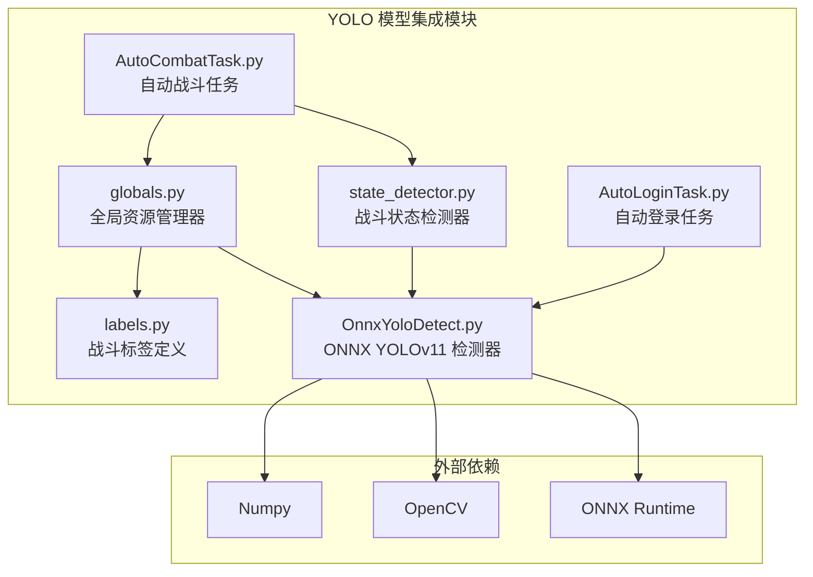
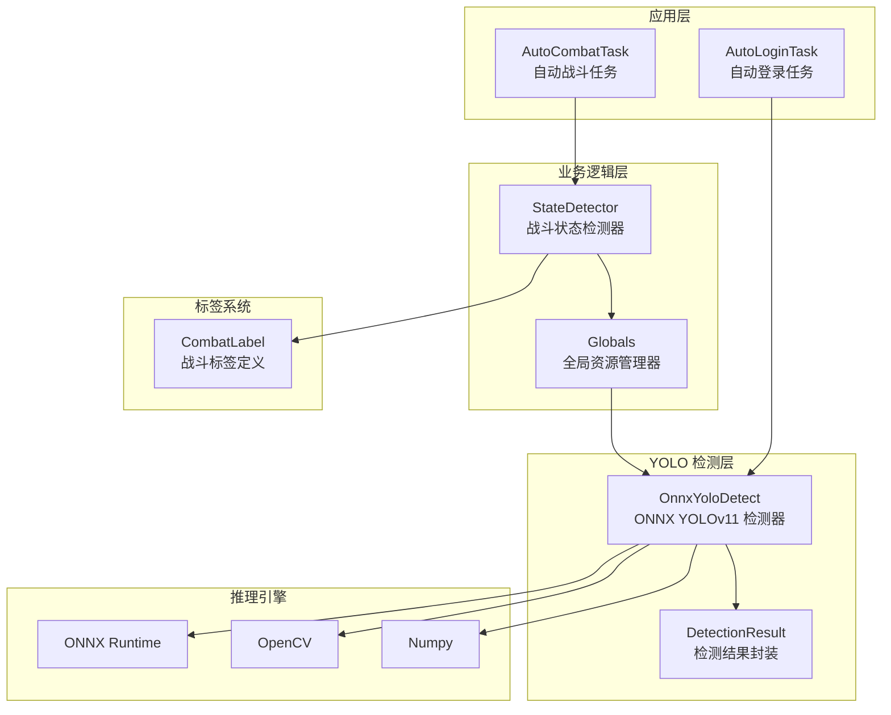
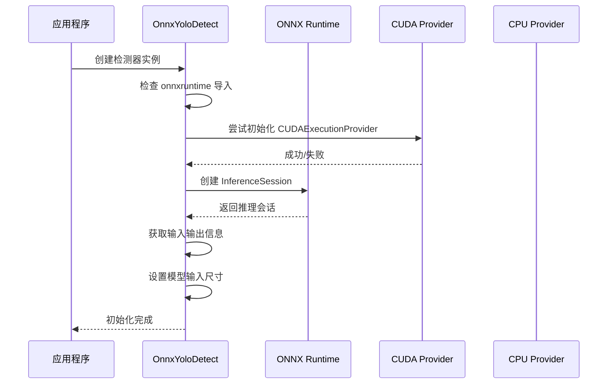
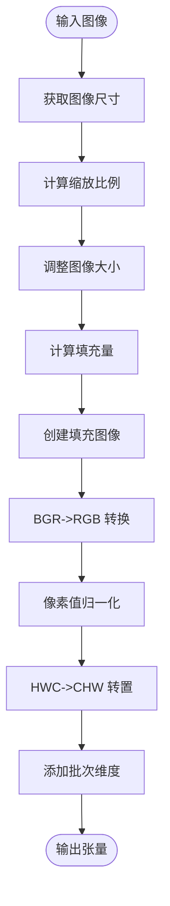
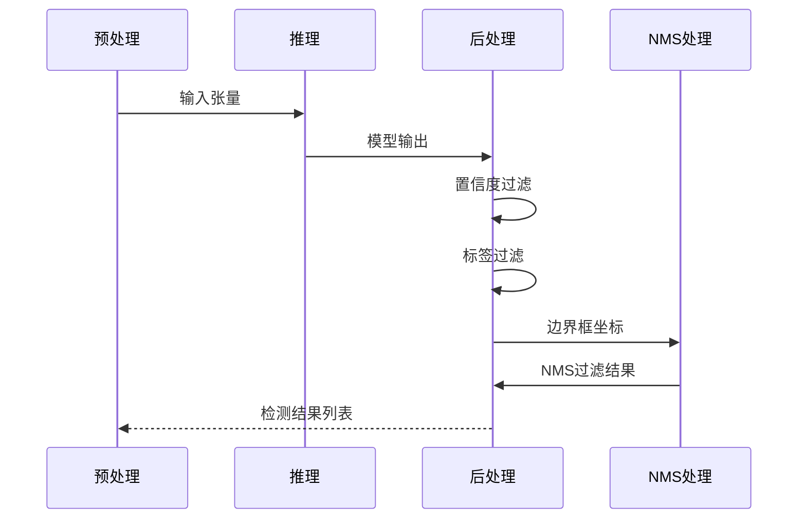
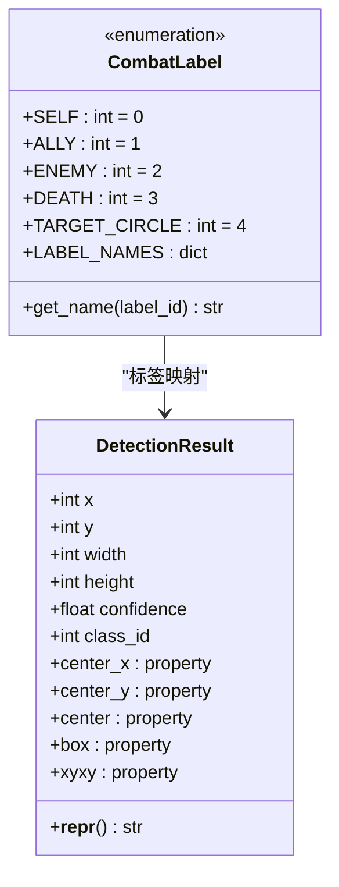
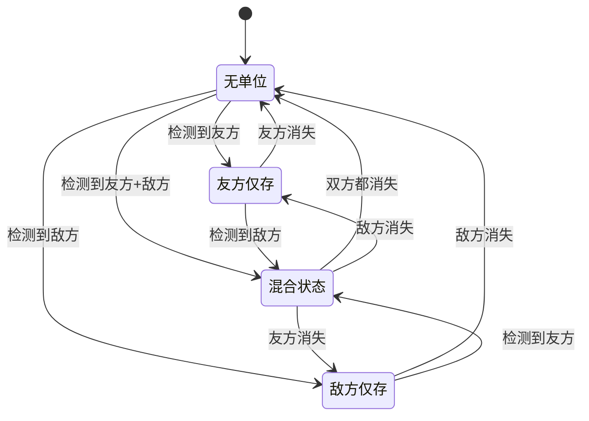
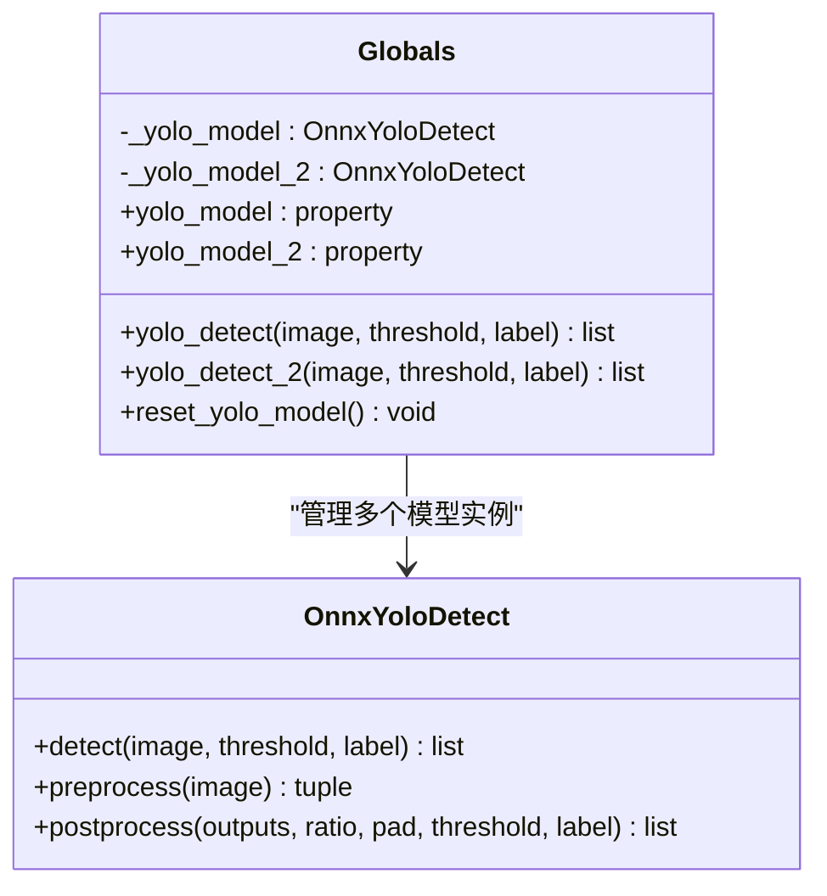
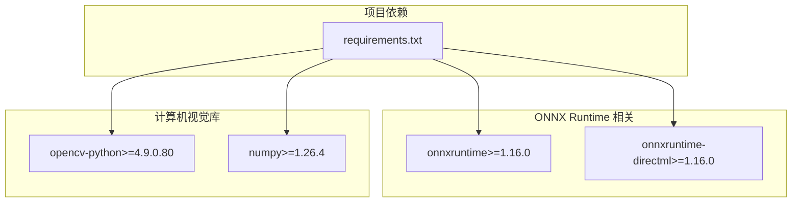
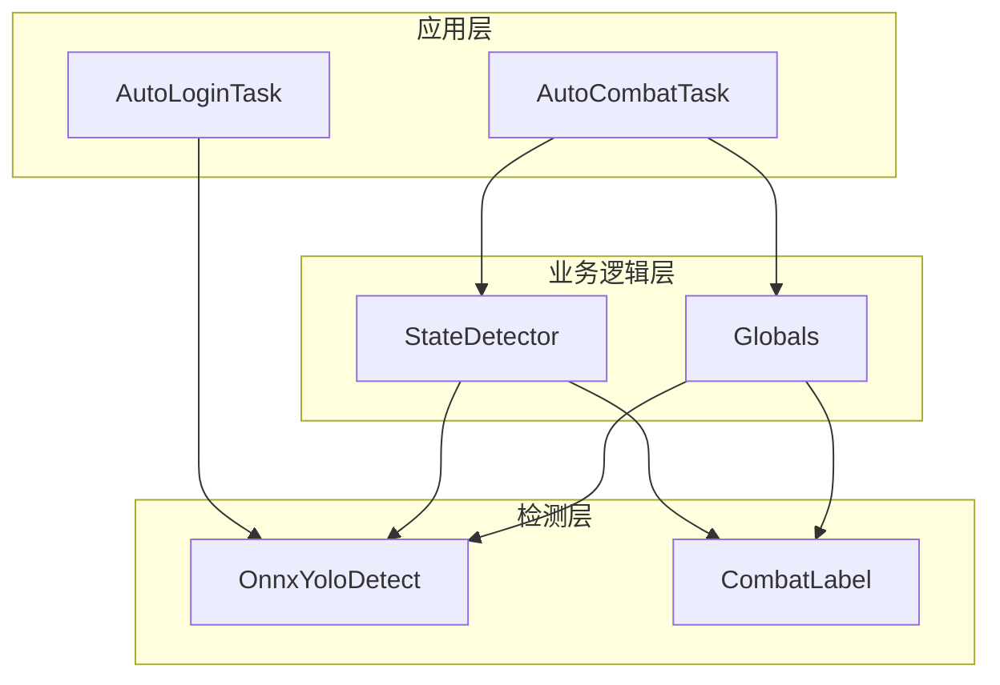

# YOLO模型集成

<cite>
**本文档引用的文件**
- [OnnxYoloDetect.py](file://src/OnnxYoloDetect.py)
- [labels.py](file://src/combat/labels.py)
- [state_detector.py](file://src/combat/state_detector.py)
- [globals.py](file://src/globals.py)
- [AutoCombatTask.py](file://src/task/AutoCombatTask.py)
- [AutoLoginTask.py](file://src/task/AutoLoginTask.py)
- [requirements.txt](file://requirements.txt)
- [AutoCombatTask.json](file://configs/AutoCombatTask.json)
- [coco_detection.json](file://assets/coco_detection.json)
</cite>

## 目录
1. [简介](#简介)
2. [项目结构](#项目结构)
3. [核心组件](#核心组件)
4. [架构概览](#架构概览)
5. [详细组件分析](#详细组件分析)
6. [依赖关系分析](#依赖关系分析)
7. [性能考虑](#性能考虑)
8. [故障排除指南](#故障排除指南)
9. [结论](#结论)
10. [附录](#附录)

## 简介
本文件为 ok-jump 项目中的 YOLO 模型集成模块创建的专业文档。该模块基于 ONNX Runtime 实现了 YOLOv11 目标检测功能，主要用于战场单位识别（自己、友方、敌军、死亡状态、目标圈）和勾选框识别。文档详细介绍了 ONNX 推理引擎的集成方式和配置方法，包括模型加载、初始化、推理优化等关键技术环节；解释了 YOLO 检测标签系统的设计和使用；阐述了模型性能优化策略；描述了检测结果的处理和解析机制；提供了模型配置和调优的详细指南；并包含具体的代码示例和常见问题的诊断与解决方法。

## 项目结构
YOLO 模型集成模块位于项目的 `src` 目录下，主要包含以下关键文件：
- `OnnxYoloDetect.py`: ONNX YOLOv11 检测器实现
- `combat/labels.py`: 战斗检测标签定义
- `combat/state_detector.py`: 战斗状态检测器
- `globals.py`: 全局资源管理器，包含 YOLO 模型管理
- `task/AutoCombatTask.py`: 自动战斗任务，使用 YOLO 进行战斗状态检测
- `task/AutoLoginTask.py`: 自动登录任务，使用 YOLO 进行勾选框检测
- `requirements.txt`: 项目依赖，包含 ONNX Runtime 相关包
- `configs/AutoCombatTask.json`: 自动战斗任务配置
- `assets/coco_detection.json`: COCO 数据集标注文件



**图表来源**
- [OnnxYoloDetect.py:1-315](file://src/OnnxYoloDetect.py#L1-L315)
- [labels.py:1-51](file://src/combat/labels.py#L1-L51)
- [state_detector.py:1-589](file://src/combat/state_detector.py#L1-L589)
- [globals.py:1-406](file://src/globals.py#L1-L406)

**章节来源**
- [OnnxYoloDetect.py:1-315](file://src/OnnxYoloDetect.py#L1-L315)
- [labels.py:1-51](file://src/combat/labels.py#L1-L51)
- [state_detector.py:1-589](file://src/combat/state_detector.py#L1-L589)
- [globals.py:1-406](file://src/globals.py#L1-L406)

## 核心组件
YOLO 模型集成模块由以下几个核心组件构成：

### OnnxYoloDetect 类
这是整个 YOLO 检测系统的核心类，实现了完整的推理管道：
- **模型加载**: 支持 CPU 和 GPU 推理（CUDAExecutionProvider）
- **预处理**: 图像缩放、填充、颜色空间转换、归一化
- **推理**: 使用 ONNX Runtime 执行模型推理
- **后处理**: 置信度过滤、标签过滤、NMS 非极大值抑制
- **结果封装**: DetectionResult 类封装检测结果

### DetectionResult 类
用于存储单个检测结果的信息，提供便捷的属性访问：
- 基本属性：x, y, width, height, confidence, class_id
- 几何属性：center_x, center_y, center, box, xyxy
- 方便的字符串表示

### CombatLabel 枚举
定义了战斗检测的标签映射：
- SELF: 自己 (label=0)
- ALLY: 友方 (label=1)
- ENEMY: 敌军 (label=2)
- DEATH: 死亡状态 (label=3)
- TARGET_CIRCLE: 目标圈 (label=4)
- 提供标签名称映射和获取方法

**章节来源**
- [OnnxYoloDetect.py:17-315](file://src/OnnxYoloDetect.py#L17-L315)
- [labels.py:8-51](file://src/combat/labels.py#L8-L51)

## 架构概览
YOLO 模型集成采用分层架构设计，从底层的推理引擎到高层的应用逻辑形成清晰的层次结构。



**图表来源**
- [AutoCombatTask.py:1-200](file://src/task/AutoCombatTask.py#L1-L200)
- [AutoLoginTask.py:107-134](file://src/task/AutoLoginTask.py#L107-L134)
- [state_detector.py:24-589](file://src/combat/state_detector.py#L24-L589)
- [globals.py:16-406](file://src/globals.py#L16-L406)
- [OnnxYoloDetect.py:17-315](file://src/OnnxYoloDetect.py#L17-L315)

## 详细组件分析

### ONNX 推理引擎集成

#### 模型初始化与配置
OnnxYoloDetect 类的初始化过程体现了完整的推理引擎集成策略：



**图表来源**
- [OnnxYoloDetect.py:33-67](file://src/OnnxYoloDetect.py#L33-L67)

#### 预处理流水线
预处理阶段实现了标准的 YOLO 输入准备流程：



**图表来源**
- [OnnxYoloDetect.py:68-108](file://src/OnnxYoloDetect.py#L68-L108)

#### 推理与后处理
推理过程采用端到端的处理方式，确保结果的准确性和一致性：



**图表来源**
- [OnnxYoloDetect.py:234-258](file://src/OnnxYoloDetect.py#L234-L258)
- [OnnxYoloDetect.py:110-186](file://src/OnnxYoloDetect.py#L110-L186)

**章节来源**
- [OnnxYoloDetect.py:17-315](file://src/OnnxYoloDetect.py#L17-L315)

### YOLO 检测标签系统

#### 标签定义与映射
CombatLabel 类提供了清晰的标签定义和名称映射：



**图表来源**
- [labels.py:8-51](file://src/combat/labels.py#L8-L51)
- [OnnxYoloDetect.py:261-315](file://src/OnnxYoloDetect.py#L261-L315)

#### 标签使用示例
在实际应用中，标签系统通过以下方式使用：

**章节来源**
- [labels.py:1-51](file://src/combat/labels.py#L1-L51)

### 战斗状态检测器

#### 状态检测流程
StateDetector 类实现了复杂的战斗状态检测逻辑：



**图表来源**
- [state_detector.py:16-447](file://src/combat/state_detector.py#L16-L447)

#### 防抖动机制
战斗状态检测采用了防抖动机制，避免状态频繁切换：

**章节来源**
- [state_detector.py:508-589](file://src/combat/state_detector.py#L508-L589)

### 全局资源管理器

#### YOLO 模型管理
Globals 类提供了统一的 YOLO 模型管理接口：



**图表来源**
- [globals.py:16-406](file://src/globals.py#L16-L406)
- [OnnxYoloDetect.py:17-315](file://src/OnnxYoloDetect.py#L17-L315)

**章节来源**
- [globals.py:1-406](file://src/globals.py#L1-L406)

## 依赖关系分析

### 外部依赖
项目对 ONNX Runtime 的依赖关系如下：



**图表来源**
- [requirements.txt:1-17](file://requirements.txt#L1-L17)

### 内部模块依赖
内部模块之间的依赖关系呈现清晰的分层结构：



**图表来源**
- [AutoCombatTask.py:24-32](file://src/task/AutoCombatTask.py#L24-L32)
- [AutoLoginTask.py:107-134](file://src/task/AutoLoginTask.py#L107-L134)
- [state_detector.py:13](file://src/combat/state_detector.py#L13)
- [globals.py:7-21](file://src/globals.py#L7-L21)

**章节来源**
- [requirements.txt:1-17](file://requirements.txt#L1-L17)
- [AutoCombatTask.py:1-200](file://src/task/AutoCombatTask.py#L1-L200)
- [AutoLoginTask.py:107-134](file://src/task/AutoLoginTask.py#L107-L134)

## 性能考虑

### 推理优化策略
YOLO 模型集成采用了多种性能优化策略：

#### 硬件加速配置
- **GPU 推理优先**: 自动尝试使用 CUDAExecutionProvider，失败时回退到 CPU
- **DirectML 支持**: 通过 onnxruntime-directml 提供 DirectML 加速
- **动态提供者选择**: 根据可用硬件自动选择最优推理后端

#### 内存管理优化
- **延迟加载**: YOLO 模型采用延迟加载策略，按需创建实例
- **内存重置**: 提供 reset_yolo_model 方法释放模型占用的内存
- **实例复用**: 全局资源管理器复用模型实例，避免重复创建

#### 推理参数调优
- **置信度阈值**: 默认 0.25，可通过参数调整
- **NMS 阈值**: 默认 0.45，平衡召回率和误检
- **输入尺寸**: 默认 640x640，可根据硬件性能调整

### 批量处理优化
虽然当前实现主要针对单帧检测，但架构设计支持批量处理：
- 预处理函数返回标准化的张量格式
- 推理接口支持批量输入
- 后处理逻辑可扩展到批量结果

**章节来源**
- [OnnxYoloDetect.py:33-67](file://src/OnnxYoloDetect.py#L33-L67)
- [globals.py:264-341](file://src/globals.py#L264-L341)

## 故障排除指南

### 常见问题诊断

#### ONNX Runtime 相关问题
- **导入错误**: 检查 requirements.txt 中的 onnxruntime 版本要求
- **GPU 不可用**: 确认 CUDAExecutionProvider 可用性和驱动版本
- **DirectML 问题**: 验证 onnxruntime-directml 安装正确性

#### 模型加载问题
- **模型文件缺失**: 检查 assets/Fight/ 目录下的 .onnx 文件是否存在
- **路径解析错误**: 使用绝对路径或正确的相对路径
- **内存不足**: 调整置信度阈值或降低输入分辨率

#### 推理性能问题
- **推理速度慢**: 检查硬件加速配置，考虑降低输入分辨率
- **内存泄漏**: 定期调用 reset_yolo_model 重置模型实例
- **精度问题**: 调整置信度阈值和 NMS 阈值

### 调试技巧
- **启用详细日志**: 在 AutoCombatTask.json 中设置 "详细日志": true
- **可视化检测结果**: 使用 DetectionResult 的属性访问边界框信息
- **性能监控**: 监控推理时间和内存使用情况

**章节来源**
- [globals.py:293-335](file://src/globals.py#L293-L335)
- [AutoCombatTask.json:1-14](file://configs/AutoCombatTask.json#L1-L14)

## 结论
ok-jump 项目的 YOLO 模型集成模块展现了良好的工程实践，具有以下特点：

1. **架构清晰**: 采用分层设计，职责分离明确
2. **性能优化**: 支持硬件加速，具备内存管理和延迟加载机制
3. **易于使用**: 提供简洁的 API 接口和完善的错误处理
4. **可扩展性**: 模块化设计支持功能扩展和定制

该模块为自动战斗系统提供了可靠的基础，通过合理的配置和调优可以满足不同硬件环境下的性能需求。

## 附录

### 配置参数说明

#### YOLO 检测配置
- **置信度阈值 (conf_threshold)**: 默认 0.25，影响检测精度
- **NMS 阈值 (iou_threshold)**: 默认 0.45，控制重叠框过滤
- **输入尺寸**: 默认 640x640，可根据硬件调整

#### 自动战斗配置
- **详细日志**: 控制日志输出详细程度
- **技能间隔**: 各技能的释放间隔时间
- **移动持续时间**: 每次移动按键的持续时间

### 使用示例

#### 基本检测使用
```python
# 创建 YOLO 检测器
detector = OnnxYoloDetect("assets/Fight/fight.onnx")

# 执行检测
results = detector.detect(image, threshold=0.5, label=-1)

# 处理检测结果
for result in results:
    print(f"检测到目标: {result.box}, 置信度: {result.confidence}")
```

#### 战斗状态检测
```python
# 使用全局资源管理器
from src import jump_globals

detections = jump_globals.yolo_detect(frame, threshold=0.5, label=CombatLabel.ENEMY)
```

**章节来源**
- [OnnxYoloDetect.py:234-258](file://src/OnnxYoloDetect.py#L234-L258)
- [globals.py:293-315](file://src/globals.py#L293-L315)