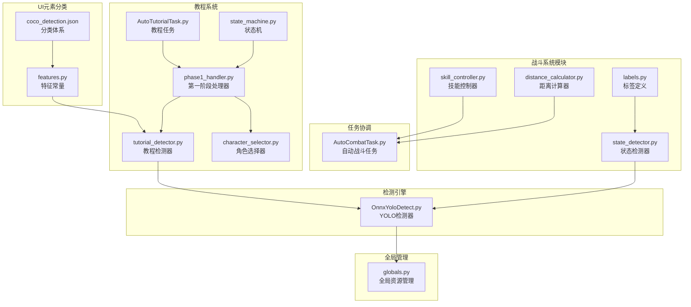
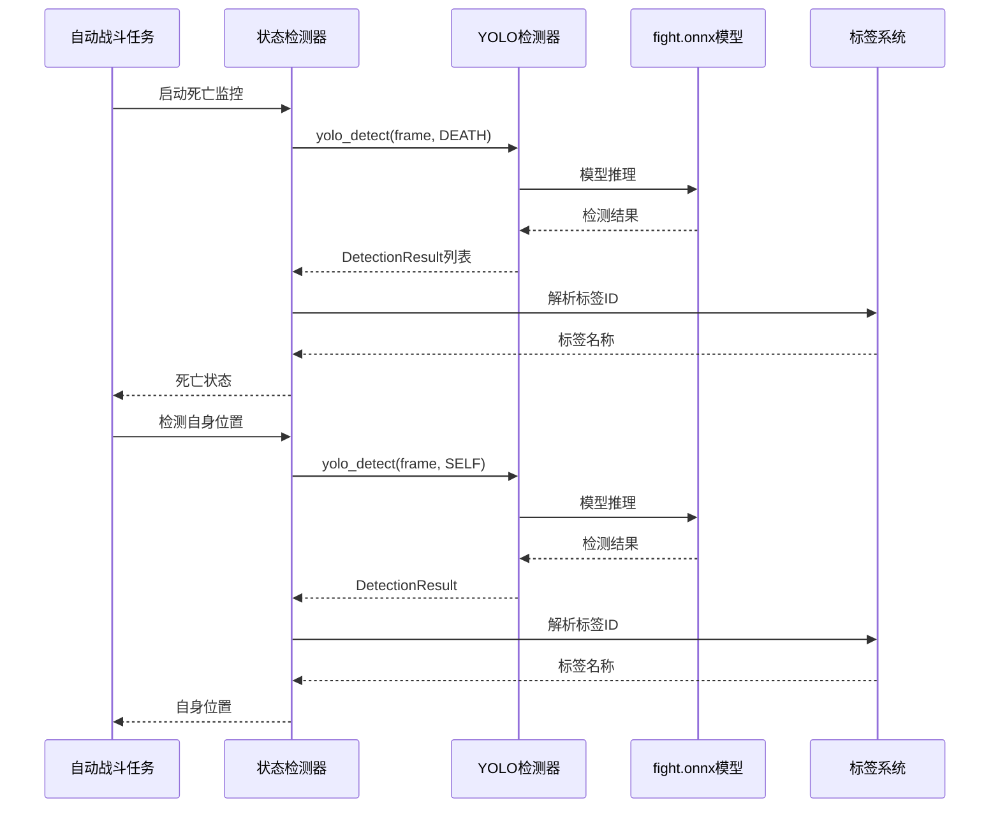
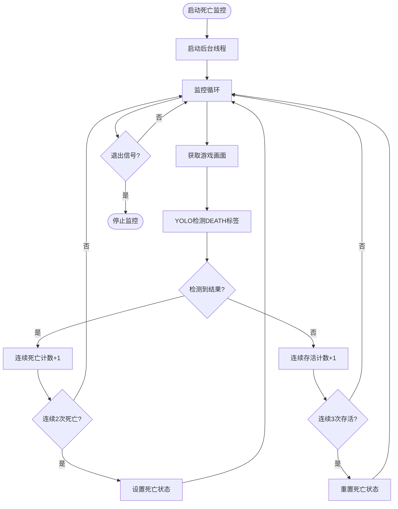
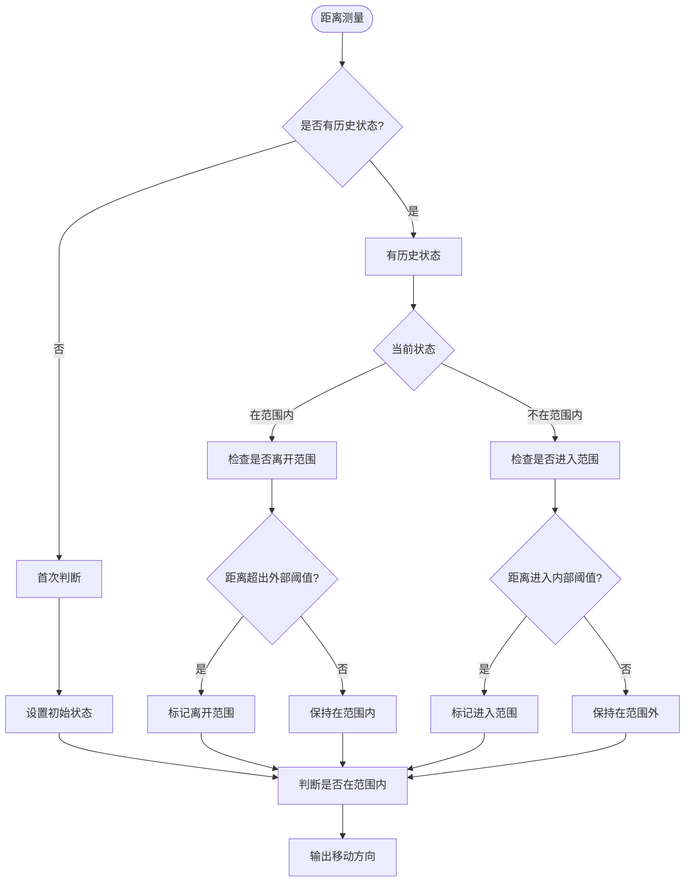
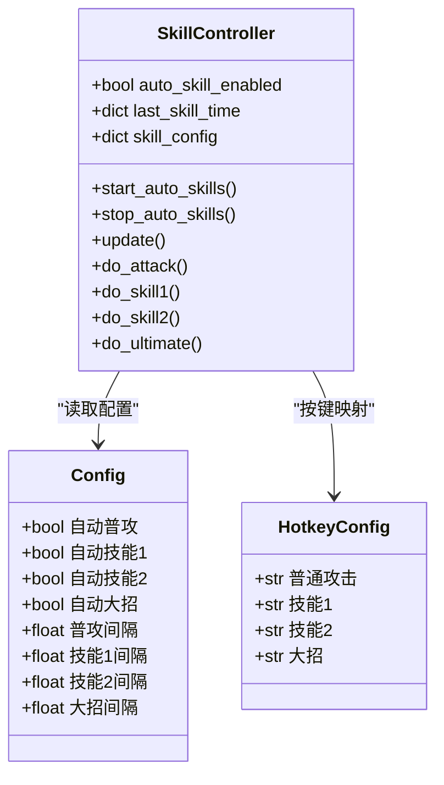
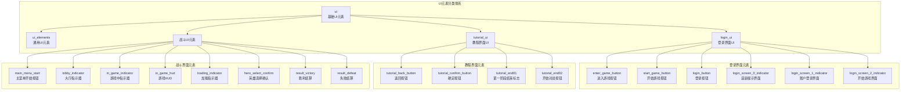
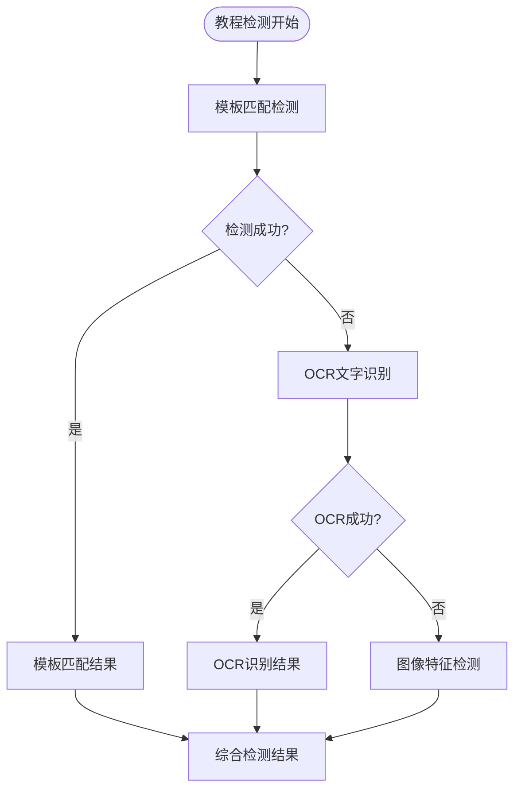
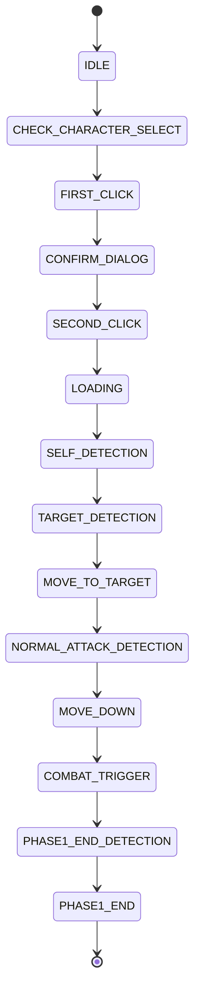
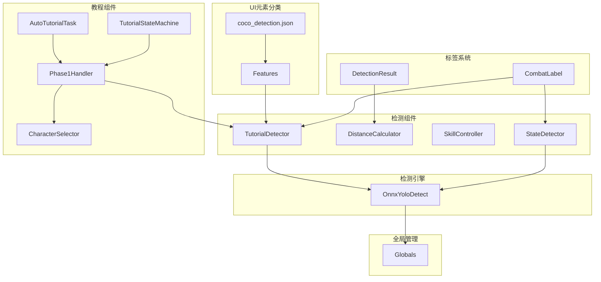

# 战斗标签系统

<cite>
**本文档引用的文件**
- [labels.py](file://src/combat/labels.py)
- [state_detector.py](file://src/combat/state_detector.py)
- [distance_calculator.py](file://src/combat/distance_calculator.py)
- [skill_controller.py](file://src/combat/skill_controller.py)
- [OnnxYoloDetect.py](file://src/OnnxYoloDetect.py)
- [AutoCombatTask.py](file://src/task/AutoCombatTask.py)
- [globals.py](file://src/globals.py)
- [AutoCombatTask.json](file://configs/AutoCombatTask.json)
- [tutorial_detector.py](file://src/tutorial/tutorial_detector.py)
- [state_machine.py](file://src/tutorial/state_machine.py)
- [phase1_handler.py](file://src/tutorial/phase1_handler.py)
- [character_selector.py](file://src/tutorial/character_selector.py)
- [AutoTutorialTask.py](file://src/task/AutoTutorialTask.py)
- [features.py](file://src/constants/features.py)
- [coco_detection.json](file://assets/coco_detection.json)
</cite>

## 更新摘要
**变更内容**
- 扩展了UI元素分类体系，新增教程UI超级类别
- 增强了战斗场景中的UI元素识别能力
- 新增教程检测器和状态机支持
- 完善了多角色选择和自动战斗触发机制

## 目录
1. [简介](#简介)
2. [项目结构](#项目结构)
3. [核心组件](#核心组件)
4. [架构概览](#架构概览)
5. [详细组件分析](#详细组件分析)
6. [UI元素分类体系](#ui元素分类体系)
7. [教程系统集成](#教程系统集成)
8. [依赖关系分析](#依赖关系分析)
9. [性能考虑](#性能考虑)
10. [故障排除指南](#故障排除指南)
11. [结论](#结论)
12. [附录](#附录)

## 简介

战斗标签系统是自动战斗框架的核心组成部分，负责战场单位识别、状态判断和智能决策。该系统基于YOLOv11深度学习模型，通过预定义的标签体系实现对游戏场景中各种元素的精确识别和分类。

**更新** 系统现已扩展为支持完整的UI元素分类体系，包括教程UI超级类别，增强了战斗场景中的UI元素识别能力，并集成了自动新手教程系统。

系统主要包含以下核心功能：
- **标签定义与映射**：定义战斗相关的各类标签及其语义含义
- **YOLO模型集成**：通过ONNX格式的YOLOv11模型进行实时目标检测
- **状态检测与判断**：实时监控战场状态，包括自身位置、友方单位、敌方单位和死亡状态
- **智能决策支持**：为自动战斗提供准确的环境感知能力
- **UI元素识别**：支持登录界面、教程界面等UI元素的分类识别
- **教程自动化**：集成自动新手教程系统，支持多角色选择

## 项目结构

战斗标签系统位于`src/combat/`目录下，采用模块化设计，每个组件职责明确：



**图表来源**
- [labels.py:1-51](file://src/combat/labels.py#L1-L51)
- [tutorial_detector.py:21-694](file://src/tutorial/tutorial_detector.py#L21-L694)
- [state_machine.py:10-210](file://src/tutorial/state_machine.py#L10-L210)
- [phase1_handler.py:21-724](file://src/tutorial/phase1_handler.py#L21-L724)
- [character_selector.py:69-232](file://src/tutorial/character_selector.py#L69-L232)
- [AutoTutorialTask.py:27-248](file://src/task/AutoTutorialTask.py#L27-L248)
- [features.py:9-93](file://src/constants/features.py#L9-L93)
- [coco_detection.json:112-287](file://assets/coco_detection.json#L112-L287)

## 核心组件

### CombatLabel枚举类型

CombatLabel是战斗标签系统的核心数据结构，定义了所有可用的战斗标签及其对应的数值标识：

| 标签名 | 数值ID | 中文含义 | 使用场景 |
|--------|--------|----------|----------|
| SELF | 0 | 自己 | 检测玩家自身位置 |
| ALLY | 1 | 友方 | 检测友方单位 |
| ENEMY | 2 | 敌军 | 检测敌方单位 |
| DEATH | 3 | 死亡状态 | 检测角色死亡状态 |
| TARGET_CIRCLE | 4 | 目标圈 | 检测目标选择指示器 |

每个标签都配有对应的中文名称映射，便于调试和日志输出。

**章节来源**
- [labels.py:8-51](file://src/combat/labels.py#L8-L51)

### YOLO检测器

OnnxYoloDetect类提供了完整的YOLOv11目标检测功能，支持多种检测模式：

- **预处理阶段**：图像缩放、填充、颜色空间转换和归一化
- **推理阶段**：使用ONNX Runtime进行模型推理
- **后处理阶段**：非极大值抑制(NMS)、置信度过滤和坐标还原

检测器支持按标签过滤，可以单独检测特定类型的对象，提高检测效率。

**章节来源**
- [OnnxYoloDetect.py:17-315](file://src/OnnxYoloDetect.py#L17-L315)

## 架构概览

战斗标签系统采用分层架构设计，各层职责清晰分离：



**图表来源**
- [state_detector.py:72-184](file://src/combat/state_detector.py#L72-L184)
- [OnnxYoloDetect.py:234-258](file://src/OnnxYoloDetect.py#L234-L258)
- [labels.py:39-51](file://src/combat/labels.py#L39-L51)

## 详细组件分析

### 状态检测器(StateDetector)

状态检测器是战斗标签系统的核心协调者，负责管理所有检测任务：

#### 死亡状态监控机制

系统实现了高效的死亡状态监控，采用后台线程持续检测：



**图表来源**
- [state_detector.py:118-184](file://src/combat/state_detector.py#L118-L184)

#### 战场状态判断

状态检测器根据检测到的友方和敌方单位数量，判断当前的战场状态：

| 状态类型 | 判断条件 | 处理策略 |
|----------|----------|----------|
| NO_UNITS | 无友方且无敌方 | 等待场景变化 |
| ALLIES_ONLY | 有友方且无线敌方 | 寻找敌方目标 |
| ENEMIES_ONLY | 无线友方且有敌方 | 进攻或撤退 |
| MIXED | 既有友方又有敌方 | 复杂战术决策 |

**章节来源**
- [state_detector.py:16-22](file://src/combat/state_detector.py#L16-L22)
- [state_detector.py:354-386](file://src/combat/state_detector.py#L354-L386)

### 距离计算器(DistanceCalculator)

距离计算器提供了智能的距离判断和移动方向建议：

#### 滞后效应机制

为了避免在最佳距离边界附近频繁切换状态，系统采用了滞后的判断机制：



**图表来源**
- [distance_calculator.py:84-118](file://src/combat/distance_calculator.py#L84-L118)

#### 移动方向决策

基于距离判断，系统提供三种移动方向建议：

- **towards**：需要靠近目标（距离过大）
- **away**：需要远离目标（距离过近）
- **stop**：保持当前位置（距离合适）

**章节来源**
- [distance_calculator.py:120-158](file://src/combat/distance_calculator.py#L120-L158)

### 技能控制器(SkillController)

技能控制器负责根据检测结果和距离计算，智能地释放游戏技能：

#### 配置驱动机制

技能释放完全由配置文件驱动，确保与GUI设置严格一致：



**图表来源**
- [skill_controller.py:24-347](file://src/combat/skill_controller.py#L24-L347)
- [AutoCombatTask.json:1-13](file://configs/AutoCombatTask.json#L1-L13)

**章节来源**
- [skill_controller.py:139-250](file://src/combat/skill_controller.py#L139-L250)
- [AutoCombatTask.json:4-12](file://configs/AutoCombatTask.json#L4-L12)

## UI元素分类体系

### 分类体系结构

系统采用层次化的UI元素分类体系，支持多级超级类别：



**图表来源**
- [coco_detection.json:112-287](file://assets/coco_detection.json#L112-L287)
- [features.py:9-93](file://src/constants/features.py#L9-L93)

### 分类映射关系

| 分类ID | 分类名称 | 超级类别 | 描述 |
|--------|----------|----------|------|
| 1 | ui_elements | ui | 通用UI元素 |
| 10 | login_ui | ui | 登录界面UI元素 |
| 100 | enter_game_button | login_ui | 进入游戏按钮 |
| 101 | start_game_button | login_ui | 开始游戏按钮 |
| 102 | login_button | login_ui | 登录按钮 |
| 103 | login_screen_0_indicator | login_ui | 适龄提示界面 |
| 104 | login_screen_1_indicator | login_ui | 账户登录界面 |
| 105 | login_screen_2_indicator | login_ui | 开始游戏界面 |
| 200 | main_menu_start | ui | 主菜单开始按钮 |
| 201 | lobby_indicator | ui | 大厅指示器 |
| 202 | in_game_indicator | ui | 游戏中指示器 |
| 203 | in_game_hud | ui | 游戏HUD |
| 204 | loading_indicator | ui | 加载指示器 |
| 205 | hero_select_confirm | ui | 英雄选择确认 |
| 206 | result_victory | ui | 胜利结算 |
| 207 | result_defeat | ui | 失败结算 |
| 300 | tutorial_back_button | tutorial_ui | 返回按钮 |
| 301 | tutorial_confirm_button | tutorial_ui | 确定按钮 |
| 302 | tutorial_end01 | tutorial_ui | 第一阶段结束标志 |
| 303 | tutorial_end02 | tutorial_ui | 开始对战按钮 |

**章节来源**
- [coco_detection.json:112-287](file://assets/coco_detection.json#L112-L287)

## 教程系统集成

### 教程检测器(TutorialDetector)

教程检测器是专门设计用于新手教程场景的检测组件，支持多种检测方式：

#### 多模态检测能力



**图表来源**
- [tutorial_detector.py:63-204](file://src/tutorial/tutorial_detector.py#L63-L204)

#### 特殊检测功能

教程检测器提供了针对新手教程场景的专用检测功能：

- **选角界面检测**：检测角色选择界面
- **按钮检测**：检测返回按钮和确定按钮
- **加载界面检测**：检测加载进度百分比
- **第一阶段结束检测**：检测教程第一阶段结束标志

**章节来源**
- [tutorial_detector.py:63-694](file://src/tutorial/tutorial_detector.py#L63-L694)

### 状态机管理

教程系统采用有限状态机管理复杂的教程流程：



**图表来源**
- [state_machine.py:10-51](file://src/tutorial/state_machine.py#L10-L51)

### 多角色支持

系统支持多种角色的新手教程执行：

| 角色 | 点击区域 | 目标检测类型 | YOLO模型 | 标签ID |
|------|----------|--------------|----------|--------|
| 悟空 | 左侧1/3 | 猴子 | fight2.onnx | 0 |
| 路飞 | 中间1/3 | 目标圈 | fight.onnx | 4 |
| 小鸣人 | 右侧1/3 | 目标圈 | fight.onnx | 4 |
| 全部 | 依次执行 | 自动切换 | fight.onnx | 4 |

**章节来源**
- [character_selector.py:77-99](file://src/tutorial/character_selector.py#L77-L99)

## 依赖关系分析

战斗标签系统各组件之间存在清晰的依赖关系：



**图表来源**
- [labels.py:8-51](file://src/combat/labels.py#L8-L51)
- [tutorial_detector.py:21-694](file://src/tutorial/tutorial_detector.py#L21-L694)
- [state_machine.py:54-210](file://src/tutorial/state_machine.py#L54-L210)
- [phase1_handler.py:21-724](file://src/tutorial/phase1_handler.py#L21-L724)
- [character_selector.py:69-232](file://src/tutorial/character_selector.py#L69-L232)
- [features.py:9-93](file://src/constants/features.py#L9-L93)
- [coco_detection.json:112-287](file://assets/coco_detection.json#L112-L287)

### 组件耦合度分析

- **低耦合高内聚**：各组件职责明确，相互依赖关系清晰
- **接口标准化**：所有组件都遵循统一的DetectionResult接口
- **配置驱动**：通过配置文件实现行为的灵活调整
- **模块化设计**：教程系统与战斗系统相对独立但可集成

**章节来源**
- [state_detector.py:35-51](file://src/combat/state_detector.py#L35-L51)
- [globals.py:230-256](file://src/globals.py#L230-L256)

## 性能考虑

### 检测性能优化

系统在多个层面进行了性能优化：

1. **后台监控**：死亡状态检测在独立线程中运行，不影响主循环
2. **阈值优化**：使用0.5的置信度阈值平衡准确性和速度
3. **缓存机制**：YOLO模型采用延迟加载，减少内存占用
4. **智能重试**：检测失败时自动重试，提高鲁棒性
5. **多模态融合**：模板匹配和OCR结合，提高检测准确性

### 内存管理

- **模型生命周期**：通过全局管理器控制YOLO模型的加载和卸载
- **检测结果缓存**：避免重复计算相同区域的检测结果
- **线程安全**：使用锁机制保护共享资源的访问
- **资源清理**：教程系统提供完整的资源清理机制

## 故障排除指南

### 常见问题及解决方案

#### YOLO模型加载失败

**症状**：检测结果为空，日志显示模型加载错误

**解决方案**：
1. 确认ONNX模型文件存在且完整
2. 安装ONNX Runtime依赖
3. 检查模型输入输出格式

#### 检测精度问题

**症状**：检测结果不准确或误检

**解决方案**：
1. 调整置信度阈值（默认0.5）
2. 检查游戏画面质量
3. 确认标签映射正确

#### 死亡状态误判

**症状**：系统频繁报告死亡状态

**解决方案**：
1. 检查DEATH标签的置信度阈值
2. 确认游戏画面中死亡状态的可见性
3. 调整连续检测次数阈值

#### 教程检测失败

**症状**：新手教程无法正常进行

**解决方案**：
1. 检查UI元素分类配置是否正确
2. 验证特征常量与分类文件的一致性
3. 确认模板匹配图像文件存在
4. 检查OCR识别配置

**章节来源**
- [OnnxYoloDetect.py:42-44](file://src/OnnxYoloDetect.py#L42-L44)
- [state_detector.py:151-182](file://src/combat/state_detector.py#L151-L182)
- [tutorial_detector.py:63-204](file://src/tutorial/tutorial_detector.py#L63-L204)

## 结论

战斗标签系统通过精心设计的标签体系、高效的YOLO检测引擎和智能的状态判断机制，为自动战斗提供了强大的环境感知能力。**更新** 系统现已扩展为支持完整的UI元素分类体系，包括教程UI超级类别，显著增强了战斗场景中的UI元素识别能力，并集成了自动新手教程系统。

系统具有以下优势：

1. **模块化设计**：各组件职责明确，易于维护和扩展
2. **高性能实现**：后台监控和智能优化确保实时响应
3. **配置驱动**：完全支持用户自定义配置
4. **鲁棒性强**：多重容错机制保证系统稳定性
5. **多模态检测**：支持模板匹配、OCR和图像特征的融合检测
6. **教程集成**：完整的自动新手教程系统，支持多角色选择

该系统为后续的功能扩展奠定了坚实基础，支持添加新的战斗标签和自定义检测类别，同时为UI元素识别和教程自动化提供了完整的解决方案。

## 附录

### 标签系统扩展指南

#### 添加新的战斗标签

要添加新的战斗标签，需要修改以下文件：

1. **更新标签定义**：在CombatLabel类中添加新的标签常量
2. **更新标签映射**：在LABEL_NAMES字典中添加中文名称
3. **更新YOLO模型**：训练或微调YOLO模型以识别新标签
4. **更新检测逻辑**：在相应的检测方法中使用新标签

#### 自定义检测类别

系统支持按标签过滤检测，可以通过以下方式实现：

```python
# 示例：检测特定标签
results = og.my_app.yolo_detect(
    frame,
    threshold=0.5,
    label=CombatLabel.NEW_LABEL  # 新标签ID
)
```

#### UI元素分类扩展

要添加新的UI元素分类，需要：

1. **更新分类文件**：在coco_detection.json中添加新的分类项
2. **更新特征常量**：在features.py中添加对应的特征常量
3. **更新检测逻辑**：在教程检测器中添加相应的检测方法
4. **更新配置文件**：添加新的配置项支持

#### 最佳实践建议

1. **标签命名规范**：使用语义化的英文命名，便于理解和维护
2. **置信度阈值**：根据实际应用场景调整阈值，平衡准确性和速度
3. **性能监控**：定期监控检测性能，及时发现和解决问题
4. **日志记录**：启用详细日志模式进行调试和性能分析
5. **教程测试**：为新添加的UI元素编写相应的测试用例
6. **兼容性考虑**：确保新功能与现有系统的兼容性

**章节来源**
- [labels.py:30-37](file://src/combat/labels.py#L30-L37)
- [OnnxYoloDetect.py:110-186](file://src/OnnxYoloDetect.py#L110-L186)
- [coco_detection.json:112-287](file://assets/coco_detection.json#L112-L287)
- [features.py:9-93](file://src/constants/features.py#L9-L93)