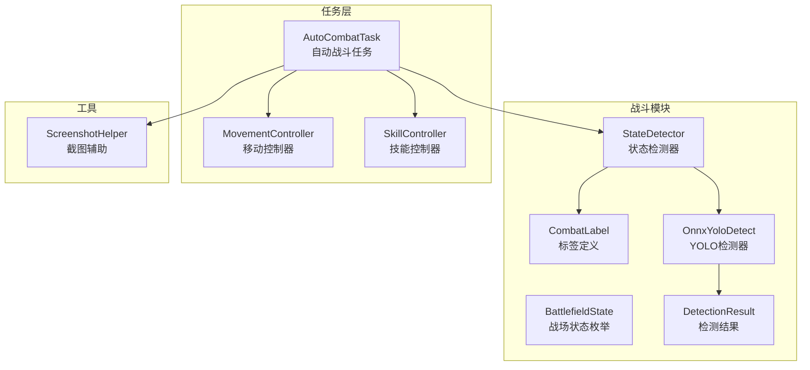
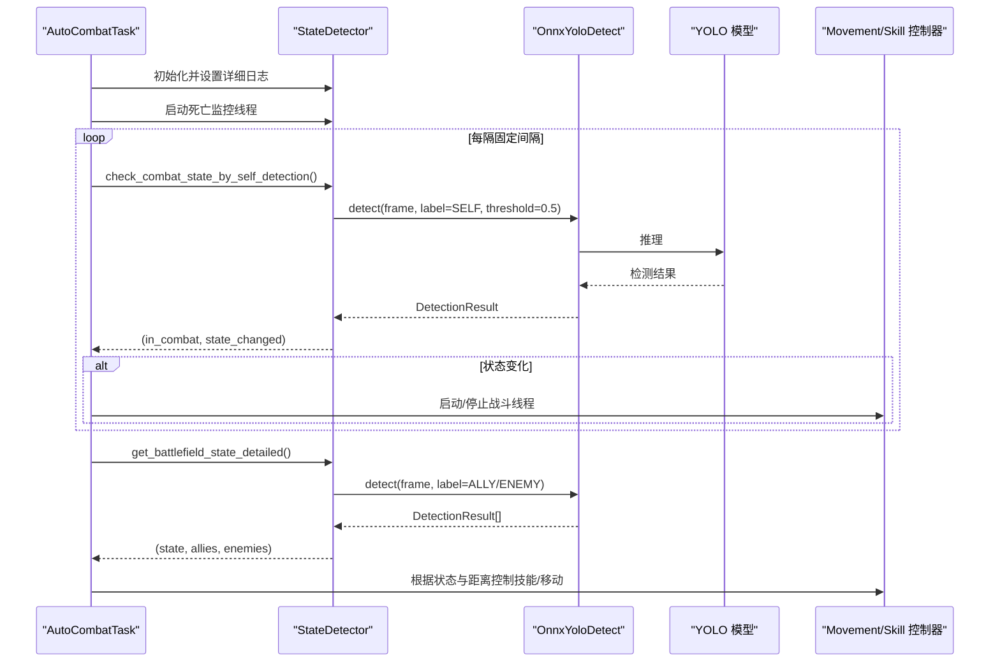
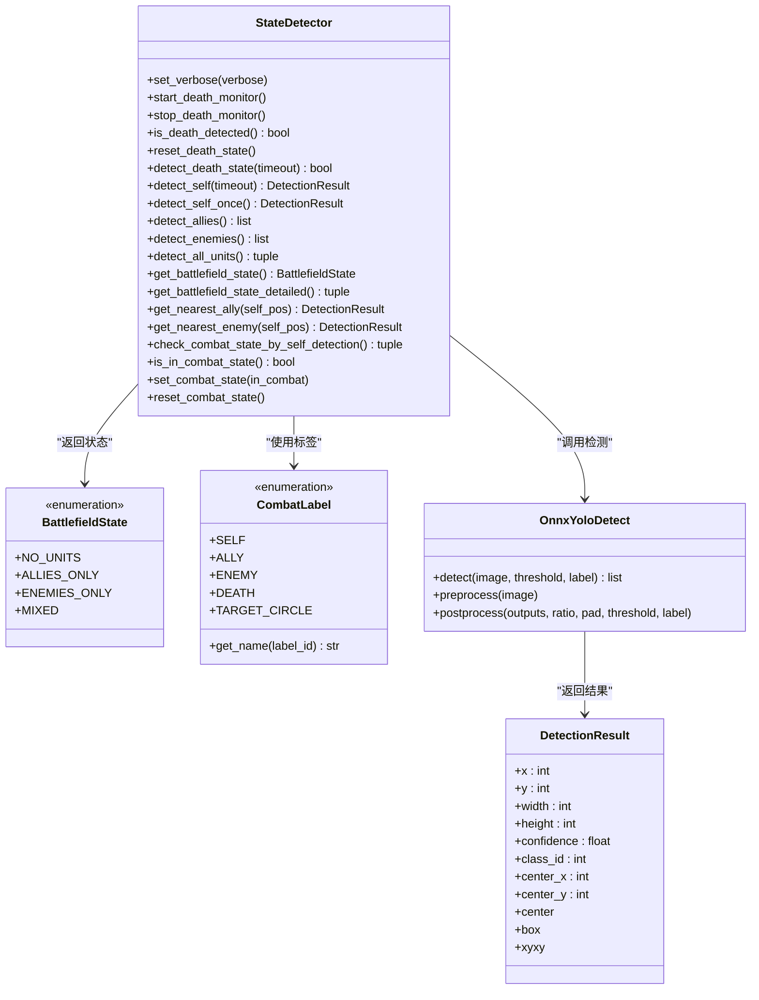
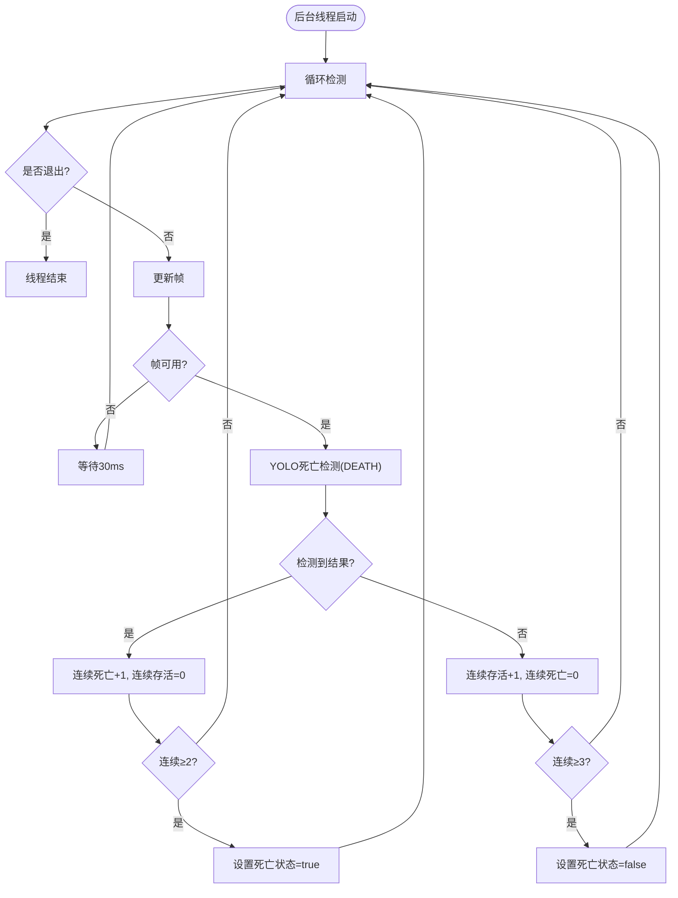
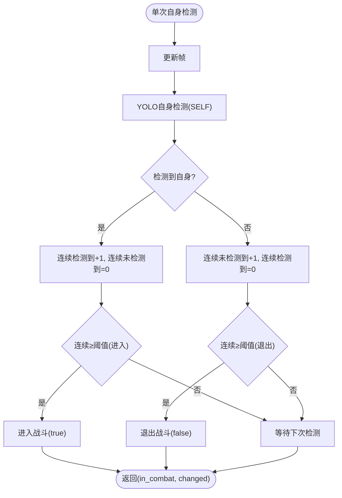
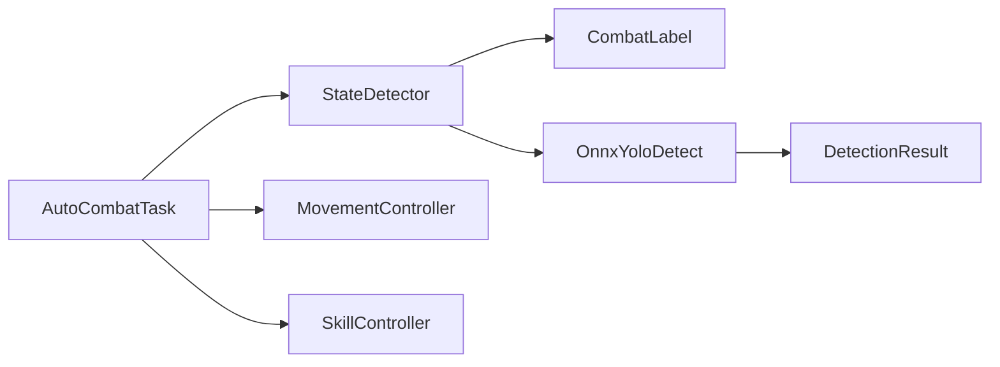

# 战斗状态检测

<cite>
**本文档引用的文件**
- [state_detector.py](file://src/combat/state_detector.py)
- [labels.py](file://src/combat/labels.py)
- [OnnxYoloDetect.py](file://src/OnnxYoloDetect.py)
- [AutoCombatTask.py](file://src/task/AutoCombatTask.py)
- [__init__.py](file://src/combat/__init__.py)
- [movement_controller.py](file://src/combat/movement_controller.py)
- [skill_controller.py](file://src/combat/skill_controller.py)
- [ScreenshotHelper.py](file://src/utils/ScreenshotHelper.py)
</cite>

## 目录
1. [简介](#简介)
2. [项目结构](#项目结构)
3. [核心组件](#核心组件)
4. [架构总览](#架构总览)
5. [详细组件分析](#详细组件分析)
6. [依赖关系分析](#依赖关系分析)
7. [性能考量](#性能考量)
8. [故障排查指南](#故障排查指南)
9. [结论](#结论)
10. [附录](#附录)

## 简介
本文件面向 ok-jump 项目的“战斗状态检测”模块，重点围绕 StateDetector 类展开，系统性阐述其基于 YOLO 模型的实时战场状态检测机制，包括死亡状态检测的后台监控线程、并行检测与防抖动机制、线程安全设计、战斗状态判断逻辑、状态切换阈值与缓存机制，以及 BattlefieldState 枚举的设计理念与使用场景。同时提供具体的方法使用示例路径与最佳实践，帮助开发者快速集成与扩展。

## 项目结构
战斗状态检测模块位于 src/combat 目录，核心文件包括：
- state_detector.py：StateDetector 类与 BattlefieldState 枚举
- labels.py：CombatLabel 标签定义
- OnnxYoloDetect.py：YOLO 检测器与 DetectionResult 数据结构
- AutoCombatTask.py：自动战斗任务，集成 StateDetector 并驱动战斗循环
- movement_controller.py、skill_controller.py：与检测结果联动的移动与技能控制
- ScreenshotHelper.py：截图辅助工具（用于调试与可视化）

图表来源
- [state_detector.py:1-589](file://src/combat/state_detector.py#L1-L589)
- [labels.py:1-51](file://src/combat/labels.py#L1-L51)
- [OnnxYoloDetect.py:1-315](file://src/OnnxYoloDetect.py#L1-L315)
- [AutoCombatTask.py:1-800](file://src/task/AutoCombatTask.py#L1-L800)
- [movement_controller.py:1-200](file://src/combat/movement_controller.py#L1-L200)
- [skill_controller.py:1-200](file://src/combat/skill_controller.py#L1-L200)
- [ScreenshotHelper.py:1-68](file://src/utils/ScreenshotHelper.py#L1-L68)

章节来源
- [state_detector.py:1-589](file://src/combat/state_detector.py#L1-L589)
- [labels.py:1-51](file://src/combat/labels.py#L1-L51)
- [OnnxYoloDetect.py:1-315](file://src/OnnxYoloDetect.py#L1-L315)
- [AutoCombatTask.py:1-800](file://src/task/AutoCombatTask.py#L1-L800)

## 核心组件
- StateDetector：提供死亡状态后台监控、自身检测、友方/敌方检测、全单位检测、战场状态判断、最近目标查找、基于自身检测的战斗状态判断等功能。
- BattlefieldState：枚举定义四种战场状态（无单位、仅友方、仅敌方、混合）。
- CombatLabel：YOLO 检测标签映射（自己、友方、敌军、死亡状态、目标圈）。
- OnnxYoloDetect：YOLOv11 ONNX 检测器，负责预处理、推理与后处理，输出 DetectionResult。
- AutoCombatTask：自动战斗任务，集成 StateDetector，驱动战斗循环与状态切换。
- MovementController、SkillController：与检测结果联动的移动与技能控制。

章节来源
- [state_detector.py:24-589](file://src/combat/state_detector.py#L24-L589)
- [labels.py:8-51](file://src/combat/labels.py#L8-L51)
- [OnnxYoloDetect.py:17-315](file://src/OnnxYoloDetect.py#L17-L315)
- [AutoCombatTask.py:35-800](file://src/task/AutoCombatTask.py#L35-L800)

## 架构总览
StateDetector 通过 OnnxYoloDetect 调用 YOLO 模型，结合 CombatLabel 标签进行单位检测；AutoCombatTask 作为上层调度者，根据检测结果驱动战斗状态切换与执行循环。模块间通过 task 对象共享帧数据与日志，保证检测与控制的解耦。

图表来源
- [AutoCombatTask.py:452-516](file://src/task/AutoCombatTask.py#L452-L516)
- [state_detector.py:510-589](file://src/combat/state_detector.py#L510-L589)
- [OnnxYoloDetect.py:234-258](file://src/OnnxYoloDetect.py#L234-L258)

## 详细组件分析

### StateDetector 类
StateDetector 提供以下能力：
- 死亡状态后台监控：独立线程持续检测死亡状态，主线程通过 is_death_detected() 快速查询，具备防抖动与线程安全设计。
- 自身检测：支持超时检测与单次检测，返回 DetectionResult。
- 友方/敌方检测：返回 DetectionResult 列表。
- 全单位检测：一次性返回自身、友方、敌方的检测结果。
- 战场状态判断：基于同一帧的友方/敌方检测，返回 BattlefieldState 枚举及详细列表。
- 最近目标查找：根据自身位置计算欧氏距离，返回最近单位。
- 基于自身检测的战斗状态判断：通过连续检测阈值实现防抖动，线程安全更新战斗状态。

图表来源
- [state_detector.py:24-589](file://src/combat/state_detector.py#L24-L589)
- [labels.py:8-51](file://src/combat/labels.py#L8-L51)
- [OnnxYoloDetect.py:17-315](file://src/OnnxYoloDetect.py#L17-L315)

章节来源
- [state_detector.py:24-589](file://src/combat/state_detector.py#L24-L589)
- [labels.py:8-51](file://src/combat/labels.py#L8-L51)
- [OnnxYoloDetect.py:261-315](file://src/OnnxYoloDetect.py#L261-L315)

### BattlefieldState 枚举
BattlefieldState 定义四种战场状态：
- NO_UNITS：无友方、无敌军
- ALLIES_ONLY：仅有友方
- ENEMIES_ONLY：仅有敌军
- MIXED：友方+敌军均存在

该枚举用于统一表达战场态势，便于 AutoCombatTask 根据不同状态执行不同的行为分支。

章节来源
- [state_detector.py:16-22](file://src/combat/state_detector.py#L16-L22)

### CombatLabel 标签体系
CombatLabel 定义了 YOLO 检测的标签映射，包括：
- SELF：自己
- ALLY：友方
- ENEMY：敌军
- DEATH：死亡状态
- TARGET_CIRCLE：目标圈

并提供标签名称映射与查询方法，便于日志与调试输出。

章节来源
- [labels.py:8-51](file://src/combat/labels.py#L8-L51)

### OnnxYoloDetect 与 DetectionResult
OnnxYoloDetect 负责：
- 模型加载与推理会话创建（优先 CUDA，回退 CPU）
- 图像预处理（缩放、填充、归一化、通道变换）
- 模型输出后处理（置信度过滤、标签过滤、NMS 非极大值抑制）
- 返回 DetectionResult 列表

DetectionResult 提供边界框、置信度、类别 ID 以及中心点坐标等属性，便于后续距离计算与状态判断。

章节来源
- [OnnxYoloDetect.py:17-315](file://src/OnnxYoloDetect.py#L17-L315)

### AutoCombatTask 集成与使用
AutoCombatTask 作为上层调度者：
- 初始化 StateDetector，并传递详细日志开关
- 启动死亡监控线程
- 在状态感知主循环中调用 check_combat_state_by_self_detection() 实现动态启停战斗
- 在战斗执行循环中调用 detect_self_once()、get_battlefield_state_detailed() 等方法，结合 MovementController 与 SkillController 实现自动战斗

章节来源
- [AutoCombatTask.py:265-289](file://src/task/AutoCombatTask.py#L265-L289)
- [AutoCombatTask.py:452-516](file://src/task/AutoCombatTask.py#L452-L516)
- [AutoCombatTask.py:561-648](file://src/task/AutoCombatTask.py#L561-L648)

### 死亡状态检测后台监控线程
- 线程启动与停止：start_death_monitor()/stop_death_monitor()，守护线程，快速响应。
- 检测循环：每 30ms 检测一次，使用 DEATH 标签，连续两次检测到死亡才确认，连续三次未检测到死亡才确认复活，避免误判。
- 线程安全：使用 Lock 保护共享状态，支持 is_death_detected() 快速查询与 reset_death_state() 复位。

图表来源
- [state_detector.py:83-196](file://src/combat/state_detector.py#L83-L196)

章节来源
- [state_detector.py:83-196](file://src/combat/state_detector.py#L83-L196)

### 基于自身检测的战斗状态判断
- 阈值设计：连续检测到自身达到阈值（如 2 次）确认进入战斗；连续未检测到自身达到阈值（如 3 次）确认退出战斗，有效防抖动。
- 线程安全：使用 Lock 保护状态与计数器，支持 is_in_combat_state() 快速查询与 set_combat_state()/reset_combat_state() 手动控制。
- 防抖动机制：通过连续计数与阈值比较，避免因瞬时遮挡或模型波动导致的状态频繁切换。

图表来源
- [state_detector.py:510-554](file://src/combat/state_detector.py#L510-L554)

章节来源
- [state_detector.py:510-554](file://src/combat/state_detector.py#L510-L554)

### 检测结果的数据结构与处理
- DetectionResult：包含边界框、置信度、类别 ID 与中心点坐标，便于距离计算与状态判断。
- get_nearest_ally/get_nearest_enemy：计算欧氏距离，返回最近目标。
- get_battlefield_state_detailed：在同一帧上同时检测友方与敌方，确保状态判断的一致性。

章节来源
- [OnnxYoloDetect.py:261-315](file://src/OnnxYoloDetect.py#L261-L315)
- [state_detector.py:449-506](file://src/combat/state_detector.py#L449-L506)
- [state_detector.py:404-447](file://src/combat/state_detector.py#L404-L447)

### 使用示例（方法路径）
以下为常用检测方法的使用示例路径（请在实际代码中按需调用）：
- 死亡状态检测（后台监控）：[start_death_monitor:83-102](file://src/combat/state_detector.py#L83-L102)、[is_death_detected:113-121](file://src/combat/state_detector.py#L113-L121)、[reset_death_state:123-127](file://src/combat/state_detector.py#L123-L127)
- 死亡状态检测（同步超时）：[detect_death_state:199-241](file://src/combat/state_detector.py#L199-L241)
- 自身检测（超时/单次）：[detect_self:243-323](file://src/combat/state_detector.py#L243-L323)、[detect_self_once:325-342](file://src/combat/state_detector.py#L325-L342)
- 友方/敌方检测：[detect_allies:344-361](file://src/combat/state_detector.py#L344-L361)、[detect_enemies:363-380](file://src/combat/state_detector.py#L363-L380)
- 全单位检测：[detect_all_units:382-392](file://src/combat/state_detector.py#L382-L392)
- 战场状态判断：[get_battlefield_state:394-402](file://src/combat/state_detector.py#L394-L402)、[get_battlefield_state_detailed:404-447](file://src/combat/state_detector.py#L404-L447)
- 最近目标查找：[get_nearest_ally:449-463](file://src/combat/state_detector.py#L449-L463)、[get_nearest_enemy:465-479](file://src/combat/state_detector.py#L465-L479)
- 基于自身检测的战斗状态判断：[check_combat_state_by_self_detection:510-554](file://src/combat/state_detector.py#L510-L554)、[is_in_combat_state:555-563](file://src/combat/state_detector.py#L555-L563)、[set_combat_state:565-578](file://src/combat/state_detector.py#L565-L578)、[reset_combat_state:580-588](file://src/combat/state_detector.py#L580-L588)

章节来源
- [state_detector.py:199-589](file://src/combat/state_detector.py#L199-L589)

## 依赖关系分析
- StateDetector 依赖 CombatLabel 与 OnnxYoloDetect，通过 YOLO 模型输出 DetectionResult。
- AutoCombatTask 依赖 StateDetector，并与 MovementController、SkillController 协同工作。
- 模块导出：通过 src/combat/__init__.py 导出 StateDetector、BattlefieldState、CombatLabel 等，便于上层任务统一导入。

图表来源
- [AutoCombatTask.py:24-30](file://src/task/AutoCombatTask.py#L24-L30)
- [state_detector.py:13](file://src/combat/state_detector.py#L13)
- [__init__.py:7-21](file://src/combat/__init__.py#L7-L21)

章节来源
- [AutoCombatTask.py:24-30](file://src/task/AutoCombatTask.py#L24-L30)
- [state_detector.py:13](file://src/combat/state_detector.py#L13)
- [__init__.py:7-21](file://src/combat/__init__.py#L7-L21)

## 性能考量
- 检测频率与响应速度：死亡监控线程 30ms 检测一次，自身检测 30ms 一次，同步死亡检测 50ms 一次，满足实时性需求。
- 阈值防抖动：通过连续计数与阈值比较降低误判，避免频繁状态切换带来的额外开销。
- 线程安全：使用 Lock 保护共享状态，避免竞态条件，保证后台监控与主线程查询的正确性。
- 模型推理：OnnxYoloDetect 优先使用 CUDA 执行提供加速，回退 CPU 保证兼容性。
- 一致性检测：get_battlefield_state_detailed 在同一帧上检测友方与敌方，避免跨帧状态不一致问题。

章节来源
- [state_detector.py:52-62](file://src/combat/state_detector.py#L52-L62)
- [state_detector.py:129-196](file://src/combat/state_detector.py#L129-L196)
- [state_detector.py:413-447](file://src/combat/state_detector.py#L413-L447)
- [OnnxYoloDetect.py:50-57](file://src/OnnxYoloDetect.py#L50-L57)

## 故障排查指南
- 帧获取失败：自身检测在帧为 None 时会周期性输出警告日志，检查截图采集与任务帧更新逻辑。
- 检测超时：detect_self(timeout=15)、detect_death_state(timeout=10) 等方法在超时后返回 None/false，检查 YOLO 模型加载与标签映射。
- 死亡监控异常：后台线程捕获异常并记录日志，检查模型推理与标签 DEATH 的有效性。
- 状态抖动：若出现频繁状态切换，适当提高阈值（如 self_found_threshold、self_not_found_threshold）或增加检测间隔。
- 线程安全：确保在多线程环境下通过 is_death_detected() 与 is_in_combat_state() 查询状态，避免直接访问内部变量。

章节来源
- [state_detector.py:263-323](file://src/combat/state_detector.py#L263-L323)
- [state_detector.py:199-241](file://src/combat/state_detector.py#L199-L241)
- [state_detector.py:136-196](file://src/combat/state_detector.py#L136-L196)
- [state_detector.py:510-554](file://src/combat/state_detector.py#L510-L554)

## 结论
StateDetector 通过 YOLO 模型与合理的阈值设计，实现了对战场状态的稳定检测与快速响应。其后台监控线程与防抖动机制有效提升了鲁棒性，配合 AutoCombatTask 的状态感知主循环，形成了完整的自动战斗闭环。开发者可基于现有接口扩展更多检测与控制逻辑，同时注意线程安全与性能优化。

## 附录
- 模块导出入口：[__init__.py:7-21](file://src/combat/__init__.py#L7-L21)
- 截图辅助工具：[ScreenshotHelper.py:1-68](file://src/utils/ScreenshotHelper.py#L1-L68)