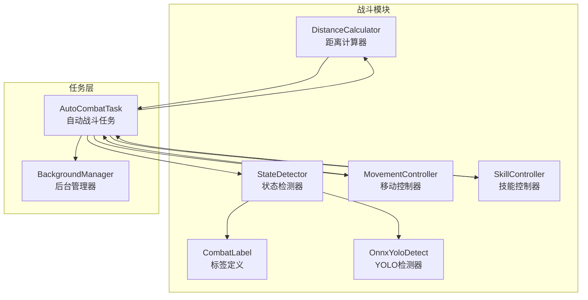
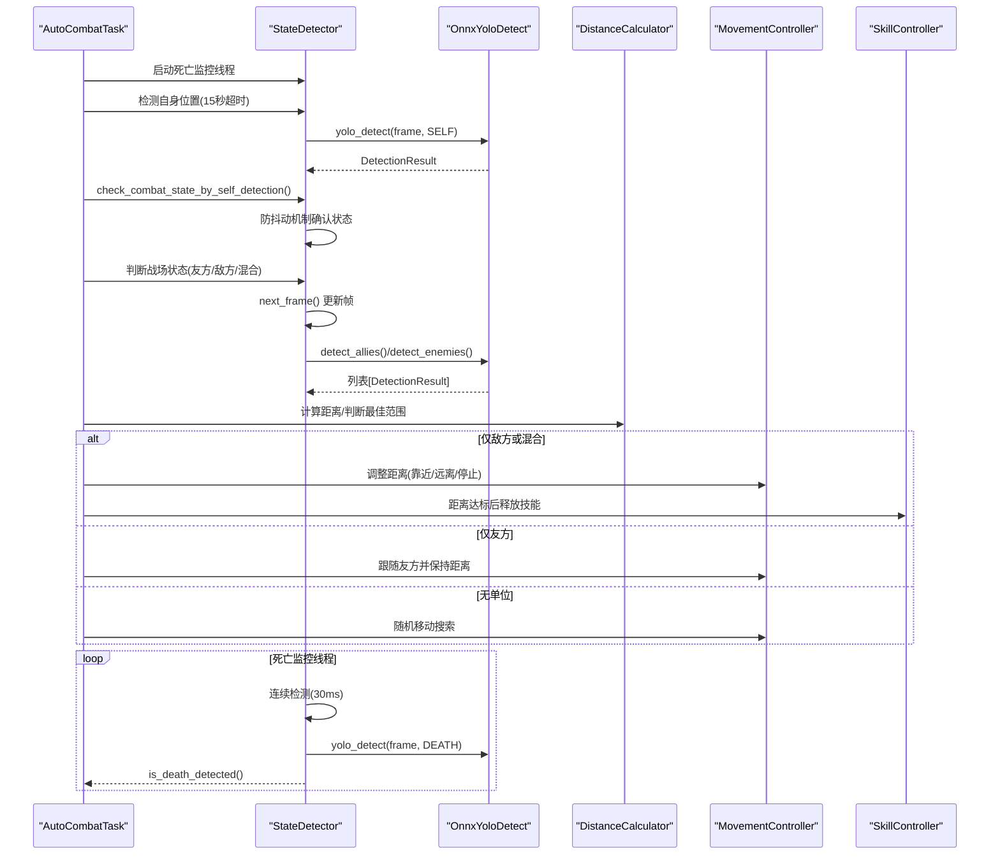
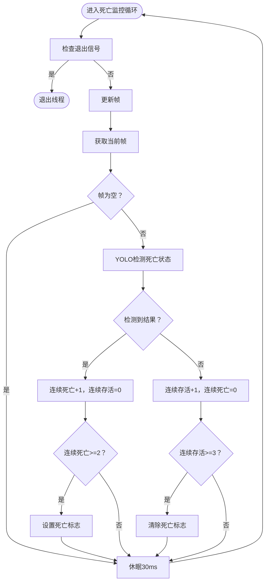
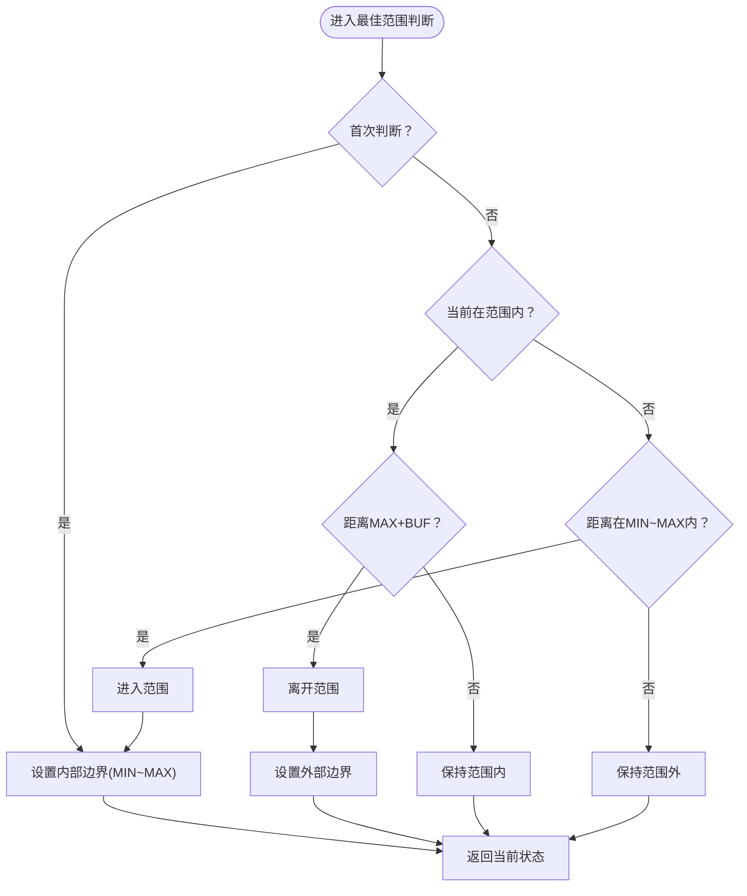
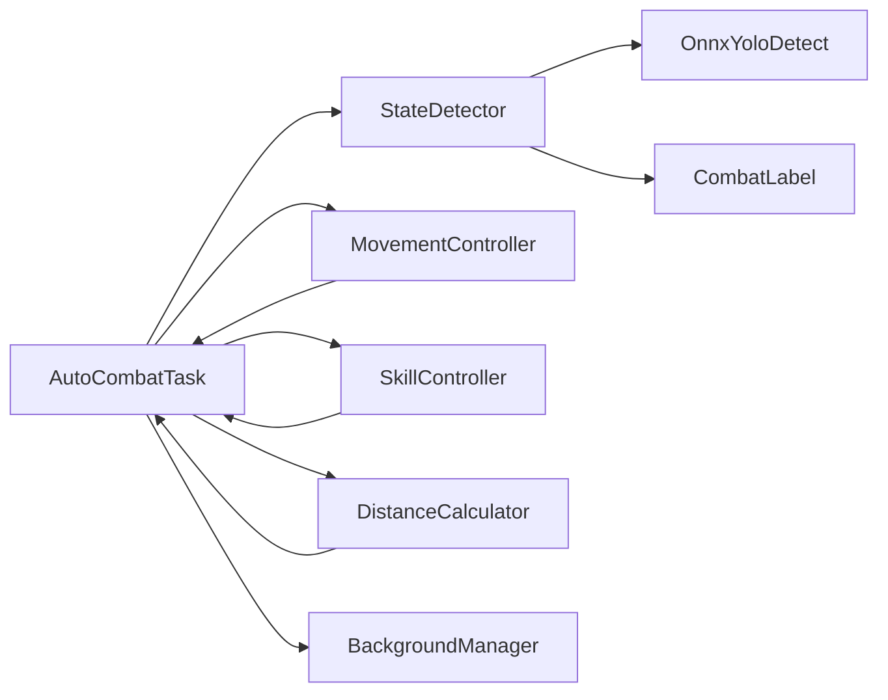

# 战斗状态检测器

<cite>
**本文引用的文件**
- [state_detector.py](file://src/combat/state_detector.py)
- [distance_calculator.py](file://src/combat/distance_calculator.py)
- [labels.py](file://src/combat/labels.py)
- [OnnxYoloDetect.py](file://src/OnnxYoloDetect.py)
- [AutoCombatTask.py](file://src/task/AutoCombatTask.py)
- [skill_controller.py](file://src/combat/skill_controller.py)
- [movement_controller.py](file://src/combat/movement_controller.py)
- [BackgroundManager.py](file://src/utils/BackgroundManager.py)
- [__init__.py](file://src/combat/__init__.py)
- [AutoCombatTask.json](file://configs/AutoCombatTask.json)
- [游戏热键配置.json](file://configs/游戏热键配置.json)
- [自动战斗系统流程图.md](file://docs/自动战斗系统流程图.md)
</cite>

## 更新摘要
**变更内容**
- 新增YOLO自检功能，通过自身检测判断战斗状态
- 实现防抖动机制，避免战斗状态频繁切换
- 优化并行死亡监控线程，检测间隔降至30ms
- 增强智能日志节流机制，减少日志输出频率
- 改进帧一致性检测，确保友方和敌方检测使用同一帧
- 新增战斗状态手动设置和重置功能
- 优化异常处理和状态管理机制

## 目录
1. [简介](#简介)
2. [项目结构](#项目结构)
3. [核心组件](#核心组件)
4. [架构总览](#架构总览)
5. [详细组件分析](#详细组件分析)
6. [依赖关系分析](#依赖关系分析)
7. [性能考量](#性能考量)
8. [故障排除指南](#故障排除指南)
9. [结论](#结论)
10. [附录](#附录)

## 简介
本文件面向"战斗状态检测器"的技术实现，围绕YOLO模型在游戏中的集成，系统性阐述以下能力：
- 死亡状态检测（并行后台线程，30ms检测间隔）
- 自身位置检测（智能日志节流，15秒超时）
- 友方与敌方单位检测（帧一致性保证）
- YOLO自检功能（通过自身检测判断战斗状态）
- 防抖动机制（避免状态频繁切换）
- 战场状态判断逻辑（无单位、仅友方、仅敌方、混合）
- 最近目标查找算法
- 完整API参考（方法签名、参数说明、返回值类型、使用示例）
- 性能优化建议与故障排除指南

该系统以自动战斗任务为主线，通过检测器、距离计算器、移动与技能控制器协同工作，实现对战场态势的实时感知与智能决策。

## 项目结构
战斗状态检测器位于src/combat目录，核心文件如下：
- state_detector.py：战斗状态检测器主体，封装YOLO检测、并行死亡监控、状态判断与最近目标查找
- distance_calculator.py：距离计算与最佳攻击范围判断，含滞后效应与缓冲区机制
- labels.py：YOLO标签常量定义（自己、友方、敌方、死亡状态、目标圈）
- OnnxYoloDetect.py：通用ONNX YOLOv11检测器，提供预处理、推理与后处理
- AutoCombatTask.py：自动战斗任务，调度检测器、移动与技能控制器
- movement_controller.py：移动控制（WASD键盘/虚拟摇杆），支持后台模式
- skill_controller.py：技能控制（键盘按键/ADB点击），支持后台模式
- BackgroundManager.py：后台模式与伪最小化管理
- __init__.py：导出战斗模块组件

**图表来源**
- [state_detector.py:24-589](file://src/combat/state_detector.py#L24-L589)
- [distance_calculator.py:14-197](file://src/combat/distance_calculator.py#L14-L197)
- [labels.py:8-51](file://src/combat/labels.py#L8-L51)
- [OnnxYoloDetect.py:17-315](file://src/OnnxYoloDetect.py#L17-L315)
- [AutoCombatTask.py:32-1078](file://src/task/AutoCombatTask.py#L32-L1078)
- [movement_controller.py:24-687](file://src/combat/movement_controller.py#L24-L687)
- [skill_controller.py:24-593](file://src/combat/skill_controller.py#L24-L593)
- [BackgroundManager.py:7-155](file://src/utils/BackgroundManager.py#L7-L155)

**章节来源**
- [state_detector.py:1-589](file://src/combat/state_detector.py#L1-L589)
- [AutoCombatTask.py:1-1078](file://src/task/AutoCombatTask.py#L1-L1078)

## 核心组件
- 战斗状态检测器（StateDetector）
  - 提供死亡状态并行监控、自身位置检测、友方/敌方检测、战场状态判断、最近目标查找
  - 使用YOLO模型进行目标识别，支持后台线程持续检测
  - **YOLO自检功能**：通过自身检测判断战斗状态，避免场景检测依赖
  - **防抖动机制**：连续N次检测确认状态变化，避免频繁切换
  - **智能日志节流**：通过last_log_time控制日志输出频率
  - **帧一致性保证**：战场状态检测使用同一帧进行友方和敌方检测
  - **手动状态控制**：支持手动设置和重置战斗状态
- 距离计算器（DistanceCalculator）
  - 计算单位间距离，提供最佳攻击范围判断与移动方向建议
  - 采用滞后效应与缓冲区，避免边界抖动
- 标签定义（CombatLabel）
  - 定义YOLO模型输出类别：自己、友方、敌方、死亡状态、目标圈
- YOLO检测器（OnnxYoloDetect）
  - ONNX YOLOv11通用检测器，支持预处理、推理、NMS后处理
- 自动战斗任务（AutoCombatTask）
  - 调度检测器、移动与技能控制器，实现完整自动战斗流程
- 移动控制器（MovementController）
  - WASD键盘移动（PC端）或虚拟摇杆移动（ADB端），支持后台模式
- 技能控制器（SkillController）
  - 键盘按键释放技能（PC端）或ADB点击（手机端），支持后台模式
- 后台管理器（BackgroundManager）
  - 管理后台模式、伪最小化、静音等

**章节来源**
- [state_detector.py:24-589](file://src/combat/state_detector.py#L24-L589)
- [distance_calculator.py:14-197](file://src/combat/distance_calculator.py#L14-L197)
- [labels.py:8-51](file://src/combat/labels.py#L8-L51)
- [OnnxYoloDetect.py:17-315](file://src/OnnxYoloDetect.py#L17-L315)
- [AutoCombatTask.py:32-1078](file://src/task/AutoCombatTask.py#L32-L1078)
- [movement_controller.py:24-687](file://src/combat/movement_controller.py#L24-L687)
- [skill_controller.py:24-593](file://src/combat/skill_controller.py#L24-L593)
- [BackgroundManager.py:7-155](file://src/utils/BackgroundManager.py#L7-L155)

## 架构总览
自动战斗任务驱动整个流程：启动死亡监控线程、检测自身位置、判断战场状态、根据状态执行移动与技能释放。检测器通过YOLO模型识别战场单位，距离计算器提供最佳攻击范围与移动方向建议，移动与技能控制器在后台模式下稳定工作。

**图表来源**
- [AutoCombatTask.py:197-271](file://src/task/AutoCombatTask.py#L197-L271)
- [state_detector.py:72-184](file://src/combat/state_detector.py#L72-L184)
- [OnnxYoloDetect.py:234-258](file://src/OnnxYoloDetect.py#L234-L258)
- [distance_calculator.py:84-158](file://src/combat/distance_calculator.py#L84-L158)
- [movement_controller.py:102-127](file://src/combat/movement_controller.py#L102-L127)
- [skill_controller.py:211-250](file://src/combat/skill_controller.py#L211-L250)

## 详细组件分析

### 战斗状态检测器（StateDetector）
- 职责
  - 死亡状态并行监控（30ms间隔，连续检测防误判）
  - 自身位置检测（15秒超时，带智能日志节流）
  - 友方/敌方单位检测
  - **YOLO自检功能**：通过自身检测判断战斗状态
  - **防抖动机制**：避免状态频繁切换
  - 战场状态判断（无单位、仅友方、仅敌方、混合）
  - 最近目标查找（友方/敌方）
- 关键算法
  - 死亡监控：连续N次检测到/消失才确认，避免误判
  - **YOLO自检**：连续检测自身确认进入/退出战斗
  - 状态判断：基于友方与敌方数量的布尔组合
  - 最近目标：欧氏距离最小化
  - **帧一致性**：战场状态检测使用同一帧进行友方和敌方检测
  - **智能日志节流**：通过last_log_time控制日志输出频率
- 并行死亡监控线程
  - 启动/停止/查询接口，线程内每30ms检测一次
  - 连续2次检测到死亡才置位，连续3次未检测到才复位
  - 支持退出信号与帧更新
  - **增强的错误处理**：捕获异常并记录详细信息

**更新** 新增了YOLO自检功能和防抖动机制，显著提升了战斗状态检测的准确性和稳定性。并行死亡监控线程的检测间隔优化至30ms，提高了响应速度。

**图表来源**
- [state_detector.py:129-195](file://src/combat/state_detector.py#L129-L195)

**章节来源**
- [state_detector.py:24-589](file://src/combat/state_detector.py#L24-L589)

### YOLO自检功能（check_combat_state_by_self_detection）
- 职责
  - 通过YOLO自身检测判断战斗状态
  - 避免依赖场景检测，提高系统稳定性
  - 实现防抖动机制，避免状态频繁切换
- 防抖动机制
  - 连续检测到自身达到阈值（默认2次）确认进入战斗
  - 连续未检测到自身达到阈值（默认3次）确认退出战斗
  - 使用独立的计数器和锁保护状态
- 状态管理
  - 支持快速查询当前战斗状态
  - 支持手动设置和重置战斗状态
  - 返回状态变化标志，便于上层处理

**章节来源**
- [state_detector.py:510-589](file://src/combat/state_detector.py#L510-L589)

### 距离计算器（DistanceCalculator）
- 职责
  - 计算两单位间距离
  - 判断是否在最佳攻击范围内（MIN_DISTANCE到MAX_DISTANCE）
  - 提供移动方向建议（靠近/远离/停止）
- 滞后效应与缓冲区
  - 进入范围阈值：MIN_DISTANCE ~ MAX_DISTANCE
  - 离开范围阈值：MIN_DISTANCE-BUFFER ~ MAX_DISTANCE+BUFFER
  - 首次判断使用内部边界；后续根据状态使用外部边界
- 移动方向策略
  - 在范围内：停止移动
  - 超出最大距离：靠近目标
  - 低于最小距离：远离目标
  - 无状态时：默认逻辑

**图表来源**
- [distance_calculator.py:84-118](file://src/combat/distance_calculator.py#L84-L118)

**章节来源**
- [distance_calculator.py:14-197](file://src/combat/distance_calculator.py#L14-L197)

### YOLO检测器（OnnxYoloDetect）
- 职责
  - 图像预处理（缩放、填充、归一化、通道转换）
  - ONNX推理（CPU/GPU执行提供者）
  - 后处理（置信度过滤、类别过滤、NMS非极大值抑制）
- 输出
  - DetectionResult对象，包含边界框、置信度、类别ID与中心点
- 使用
  - StateDetector通过og.my_app.yolo_detect调用

**章节来源**
- [OnnxYoloDetect.py:17-315](file://src/OnnxYoloDetect.py#L17-L315)

### 自动战斗任务（AutoCombatTask）
- 职责
  - 初始化控制器与后台管理器
  - 启动死亡监控线程
  - 主循环：死亡状态检测、自身检测、战场状态判断、移动与技能控制
  - **状态感知主循环**：通过YOLO自检动态启停战斗
  - 退出清理：停止死亡监控、移动与技能
- 流程
  - 死亡状态检测（并行线程快速查询）
  - 自身检测（15秒超时）
  - **YOLO自检**：动态判断战斗状态
  - 战场状态判断（4种情况）
  - 根据状态执行移动与技能释放

**更新** 新增了状态感知主循环，通过YOLO自检功能动态启停战斗，避免了对场景检测的依赖。

**章节来源**
- [AutoCombatTask.py:32-1078](file://src/task/AutoCombatTask.py#L32-L1078)

### 移动控制器（MovementController）
- 职责
  - PC端：WASD键盘移动（支持后台SendInput）
  - ADB端：虚拟摇杆滑动
  - 支持停止、左右移动、向上移动等
- 特性
  - 智能按键适配（前台/后台）
  - 方向计算（支持八方向）
  - **ADB模式优化**：全速移动算法，避免速度衰减

**章节来源**
- [movement_controller.py:24-687](file://src/combat/movement_controller.py#L24-L687)

### 技能控制器（SkillController）
- 职责
  - 键盘按键释放技能（PC端）
  - ADB点击释放技能（手机端）
  - 冷却计时与间隔控制
- 特性
  - 配置驱动（从AutoCombatTask.json与游戏热键配置读取）
  - 后台模式支持
  - **独立冷却机制**：四个技能各自独立冷却

**章节来源**
- [skill_controller.py:24-593](file://src/combat/skill_controller.py#L24-L593)

### 后台管理器（BackgroundManager）
- 职责
  - 后台模式开关、静音、伪最小化
  - 自动伪最小化检测与执行
- 与移动/技能控制器协作
  - 通过SendInput在后台发送按键

**章节来源**
- [BackgroundManager.py:7-155](file://src/utils/BackgroundManager.py#L7-L155)

## 依赖关系分析
- StateDetector依赖OnnxYoloDetect与CombatLabel
- AutoCombatTask依赖StateDetector、MovementController、SkillController、DistanceCalculator
- MovementController与SkillController依赖AutoCombatTask提供的后台输入能力
- BackgroundManager为后台模式提供支持

**图表来源**
- [AutoCombatTask.py:32-83](file://src/task/AutoCombatTask.py#L32-L83)
- [state_detector.py:13-13](file://src/combat/state_detector.py#L13-L13)
- [movement_controller.py:17-18](file://src/combat/movement_controller.py#L17-L18)
- [skill_controller.py:17-18](file://src/combat/skill_controller.py#L17-L18)
- [BackgroundManager.py:3-4](file://src/utils/BackgroundManager.py#L3-L4)

**章节来源**
- [AutoCombatTask.py:32-83](file://src/task/AutoCombatTask.py#L32-L83)
- [__init__.py:7-21](file://src/combat/__init__.py#L7-L21)

## 性能考量
- 检测频率与线程
  - 死亡监控线程30ms检测一次，降低延迟并提升响应速度
  - 自身检测与单位检测在主循环中按需进行，避免不必要的重复
- **YOLO自检优化**
  - 通过自身检测判断战斗状态，避免场景检测依赖
  - 防抖动机制减少状态频繁切换
  - 独立的战斗状态线程，不影响主循环性能
- 防误判策略
  - 死亡状态：连续2次检测到才确认，连续3次未检测到才复位
  - **战斗状态**：连续2次检测到自身才确认进入，连续3次未检测到才确认退出
  - 距离判断：滞回机制与缓冲区避免边界抖动
- 后台模式优化
  - 使用SendInput在后台发送按键，减少前台切换开销
  - 后台管理器自动伪最小化，保证捕获与输入稳定性
- 模型推理
  - ONNX推理支持GPU/CPU执行提供者，优先使用GPU以提升速度
  - NMS后处理减少重复框，提高检测精度与性能
- **帧一致性优化**
  - 战场状态检测使用同一帧进行友方和敌方检测
  - 防止竞态条件，确保检测结果的一致性和准确性
  - **智能日志节流优化**
  - 自身检测中通过last_log_time控制日志输出频率
  - 每2秒输出一次帧获取失败日志，避免日志过多
  - 每3秒输出一次未检测到日志，避免日志过多
  - 每10秒输出一次超时日志，确保重要信息不被遗漏
- **手动状态控制**
  - 支持手动设置战斗状态，便于调试和特殊情况处理
  - 状态重置功能，确保系统恢复正常

## 故障排除指南
- 无法检测到自身位置
  - 检查是否正确启动死亡监控线程与自身检测超时设置
  - 确认帧获取正常，必要时手动刷新帧
  - 查看日志节流机制是否影响了进度报告
  - 检查YOLO模型是否正确加载
- **YOLO自检异常**
  - 检查自身检测是否正常工作
  - 确认防抖动阈值设置是否合理
  - 查看战斗状态日志输出
  - 验证状态锁是否正确使用
- 死亡状态误报/漏报
  - 检查死亡监控线程是否在运行，确认连续检测阈值设置
  - 调整YOLO置信度阈值，避免误检
  - 查看死亡监控线程的异常日志
- 距离判断抖动
  - 检查滞回机制与缓冲区设置，确保在边界附近不会频繁切换
- 后台模式按键无效
  - 确认后台模式已启用，窗口句柄正确
  - 检查SendInput权限与前台窗口状态
- 技能释放异常
  - 检查技能配置与热键映射，确认冷却时间与间隔设置
  - ADB模式下检查设备连接与点击坐标
- **帧一致性问题**
  - 检查get_battlefield_state_detailed方法是否正确更新帧
  - 确保友方和敌方检测使用同一帧数据
  - 验证next_frame调用时机是否正确
- **状态感知问题**
  - 检查check_combat_state_by_self_detection方法是否正常工作
  - 确认防抖动机制的计数器是否正确更新
  - 验证状态锁的使用是否正确
- **手动状态控制问题**
  - 检查set_combat_state方法的参数设置
  - 确认状态重置功能是否正常
  - 验证状态查询方法的返回值

**章节来源**
- [state_detector.py:72-184](file://src/combat/state_detector.py#L72-L184)
- [distance_calculator.py:84-158](file://src/combat/distance_calculator.py#L84-L158)
- [AutoCombatTask.py:197-271](file://src/task/AutoCombatTask.py#L197-L271)
- [skill_controller.py:114-138](file://src/combat/skill_controller.py#L114-L138)
- [BackgroundManager.py:46-75](file://src/utils/BackgroundManager.py#L46-L75)

## 结论
战斗状态检测器通过YOLO模型与多组件协同，实现了对战场的实时感知与智能决策。并行死亡监控线程、滞回距离判断、后台模式支持以及智能日志节流机制共同保障了系统的稳定性与响应速度。新增的YOLO自检功能和防抖动机制进一步提升了战斗状态检测的准确性，结合配置化的技能与移动控制，系统可在不同场景下高效运行。

**更新** YOLO自检功能和防抖动机制的引入，显著提升了战斗状态检测的准确性和稳定性。并行死亡监控线程的优化和智能日志节流机制的完善，进一步提高了系统的性能和可维护性。

## 附录

### API参考

#### StateDetector
- 方法
  - start_death_monitor()：启动死亡状态后台监控线程
  - stop_death_monitor()：停止死亡状态后台监控线程
  - is_death_detected() -> bool：快速查询是否检测到死亡状态
  - reset_death_state()：重置死亡状态（复活后调用）
  - detect_death_state(timeout=10) -> bool：10秒内持续监测死亡状态（同步）
  - detect_self(timeout=15) -> DetectionResult | None：15秒内检测自身位置
  - detect_self_once() -> DetectionResult | None：单次检测自身位置
  - detect_allies() -> list[DetectionResult]：检测友方单位
  - detect_enemies() -> list[DetectionResult]：检测敌方单位
  - detect_all_units() -> tuple[self_pos, allies, enemies]：检测所有单位
  - get_battlefield_state() -> BattlefieldState：判断战场状态
  - get_battlefield_state_detailed() -> tuple[state, allies, enemies]：返回详细信息
  - get_nearest_ally(self_pos) -> DetectionResult | None：获取最近友方
  - get_nearest_enemy(self_pos) -> DetectionResult | None：获取最近敌方
  - set_verbose(verbose)：设置是否输出详细日志
  - **check_combat_state_by_self_detection()** -> tuple[bool, bool]：通过YOLO自身检测判断战斗状态
  - **is_in_combat_state()** -> bool：快速查询当前是否在战斗状态
  - **set_combat_state(in_combat)**：手动设置战斗状态
  - **reset_combat_state()**：重置战斗状态
- 参数说明
  - timeout：超时时间（秒），默认10秒或15秒
  - label：YOLO标签（CombatLabel）
  - threshold：置信度阈值，默认0.5
  - in_combat：战斗状态布尔值
- 返回值类型
  - DetectionResult：包含x,y,width,height,confidence,class_id与center属性
  - BattlefieldState：枚举值（no_units/allies_only/enemies_only/mixed）
  - tuple[bool, bool]：（当前战斗状态, 状态是否发生变化）
- 使用示例
  - 启动死亡监控：调用start_death_monitor()
  - 查询死亡状态：调用is_death_detected()
  - 检测自身：调用detect_self(timeout=15)
  - 判断战场状态：调用get_battlefield_state()
  - **YOLO自检**：调用check_combat_state_by_self_detection()

**更新** 新增了YOLO自检功能和战斗状态手动控制方法，显著提升了系统的灵活性和稳定性。防抖动机制的实现避免了状态频繁切换的问题。

**章节来源**
- [state_detector.py:72-589](file://src/combat/state_detector.py#L72-L589)
- [labels.py:8-51](file://src/combat/labels.py#L8-L51)
- [OnnxYoloDetect.py:261-315](file://src/OnnxYoloDetect.py#L261-L315)

#### DistanceCalculator
- 方法
  - calculate(unit1, unit2) -> float：计算两单位间距离
  - calculate_from_coords(x1, y1, x2, y2) -> float：根据坐标计算距离
  - is_in_optimal_range(distance) -> bool：判断是否在最佳攻击范围内（带滞回）
  - get_movement_direction(self_pos, target_pos, distance=None) -> str："towards"/"away"/"stop"
  - reset_state()：重置内部状态
  - get_movement_vector(self_pos, target_pos) -> tuple[float,float]：单位向量
  - get_reverse_vector(self_pos, target_pos) -> tuple[float,float]：反向单位向量
- 参数说明
  - min_distance/max_distance/buffer：距离范围与缓冲区（默认0/225/15）
- 返回值类型
  - float：距离（像素）
  - str：移动方向
  - tuple[float,float]：向量
- 使用示例
  - 计算距离：调用calculate(self_pos, target)
  - 判断范围：调用is_in_optimal_range(distance)
  - 获取方向：调用get_movement_direction(self_pos, target, distance)

**章节来源**
- [distance_calculator.py:14-197](file://src/combat/distance_calculator.py#L14-L197)

#### OnnxYoloDetect
- 方法
  - detect(image, threshold=None, label=-1) -> list[DetectionResult]：执行检测
  - preprocess(image) -> tuple[processed, ratio, pad]：预处理
  - postprocess(outputs, ratio, pad, conf_threshold=None, label=-1) -> list[DetectionResult]：后处理
- 参数说明
  - image：BGR图像（numpy数组）
  - threshold：置信度阈值
  - label：过滤特定标签（-1表示不过滤）
- 返回值类型
  - DetectionResult：包含边界框、置信度、类别ID与中心点
- 使用示例
  - 检测自身：detect(frame, threshold=0.5, label=CombatLabel.SELF)
  - 检测敌方：detect(frame, threshold=0.5, label=CombatLabel.ENEMY)

**章节来源**
- [OnnxYoloDetect.py:17-315](file://src/OnnxYoloDetect.py#L17-L315)

#### AutoCombatTask
- 方法
  - run()：运行自动战斗任务
  - request_exit()：请求退出自动战斗
  - _main_loop()：主循环
  - _state_aware_main_loop()：状态感知主循环
  - _combat_loop()：战斗执行循环
  - _handle_battlefield_state(state, self_pos, allies, enemies)：处理战场状态
  - _get_nearest_target(self_pos, targets)：获取最近目标
  - _verbose_log(message)：输出详细日志
- 参数说明
  - config：任务配置（来自AutoCombatTask.json）
- 返回值类型
  - bool：任务执行结果
- 使用示例
  - 启动任务：调用run()
  - 请求退出：调用request_exit()

**更新** 新增了状态感知主循环和战斗执行循环，通过YOLO自检功能动态启停战斗。

**章节来源**
- [AutoCombatTask.py:32-1078](file://src/task/AutoCombatTask.py#L32-L1078)

#### MovementController
- 方法
  - move_towards(target_x, target_y, self_x=None, self_y=None)：向目标移动
  - move_away(target_x, target_y, self_x=None, self_y=None)：远离目标
  - move_left_right(duration=1)：左右来回移动
  - move_up(duration=1)：向上移动
  - stop()：停止移动
  - set_move_duration(duration)：设置移动持续时间
- 参数说明
  - target_x/target_y：目标坐标
  - self_x/self_y：自身坐标（可选）
  - duration：移动持续时间（秒）
- 返回值类型
  - None
- 使用示例
  - 向目标移动：调用move_towards(target_x, target_y, self_x, self_y)
  - 停止移动：调用stop()

**更新** ADB模式下的移动算法进行了优化，实现了全速移动，避免了速度衰减问题。

**章节来源**
- [movement_controller.py:102-127](file://src/combat/movement_controller.py#L102-L127)

#### SkillController
- 方法
  - start_auto_skills()：启动自动技能
  - stop_auto_skills()：停止自动技能
  - is_auto_skill_enabled() -> bool：检查自动技能是否启用
  - update()：更新技能释放（按配置间隔）
  - do_attack()/do_skill1()/do_skill2()/do_ultimate()：释放对应技能
  - get_skill_status() -> dict：获取技能状态信息
  - update_distance(distance)：更新当前距离
  - get_current_distance() -> float：获取当前距离
  - is_in_skill_range() -> bool：检查是否在技能范围内
- 参数说明
  - 间隔：来自AutoCombatTask.json配置
  - 按键：来自游戏热键配置
  - distance：距离值（像素）
- 返回值类型
  - dict：技能状态字典
  - float：距离（像素）
  - bool：是否在技能范围内
- 使用示例
  - 启动自动技能：调用start_auto_skills()
  - 更新技能：调用update()

**章节来源**
- [skill_controller.py:139-250](file://src/combat/skill_controller.py#L139-L250)

#### BackgroundManager
- 方法
  - update_config()：更新后台配置
  - is_background_mode() -> bool：是否启用后台模式
  - is_game_in_background() -> bool：游戏是否在后台
  - check_and_auto_pseudo_minimize()：自动伪最小化
  - ensure_visible_for_capture()：确保可见以便捕获
- 参数说明
  - 配置：来自基本设置或基础选项
- 返回值类型
  - bool：状态
- 使用示例
  - 自动伪最小化：调用check_and_auto_pseudo_minimize()

**章节来源**
- [BackgroundManager.py:18-121](file://src/utils/BackgroundManager.py#L18-L121)

### 配置参考
- AutoCombatTask.json
  - 测试模式、详细日志、技能开关与间隔、移动持续时间
- 游戏热键配置.json
  - 普通攻击、技能1、技能2、大招的按键映射

**章节来源**
- [AutoCombatTask.json:1-13](file://configs/AutoCombatTask.json#L1-L13)
- [游戏热键配置.json:1-6](file://configs/游戏热键配置.json#L1-L6)

### 版本更新记录
- **1.4.1版本更新**
  - 新增YOLO自检功能，通过自身检测判断战斗状态
  - 实现防抖动机制，避免状态频繁切换
  - 优化并行死亡监控线程，检测间隔降至30ms
  - 增强智能日志节流机制
  - 改进帧一致性检测
  - 新增手动状态控制功能
  - 优化ADB模式移动算法