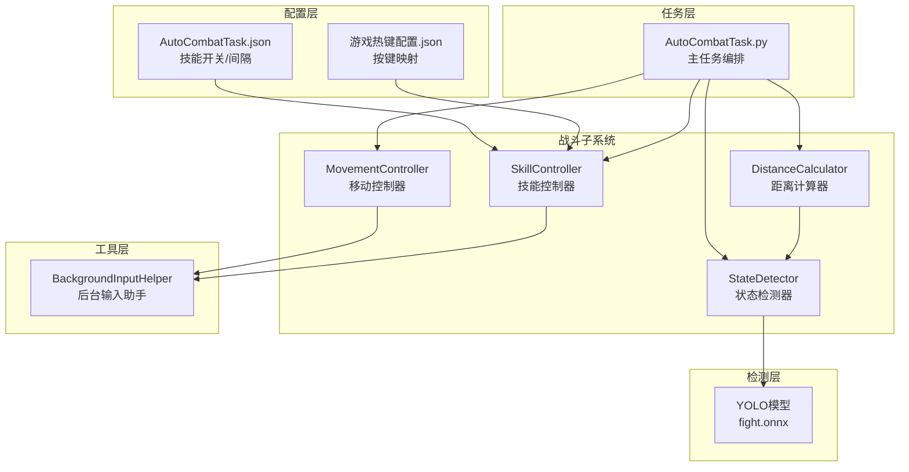
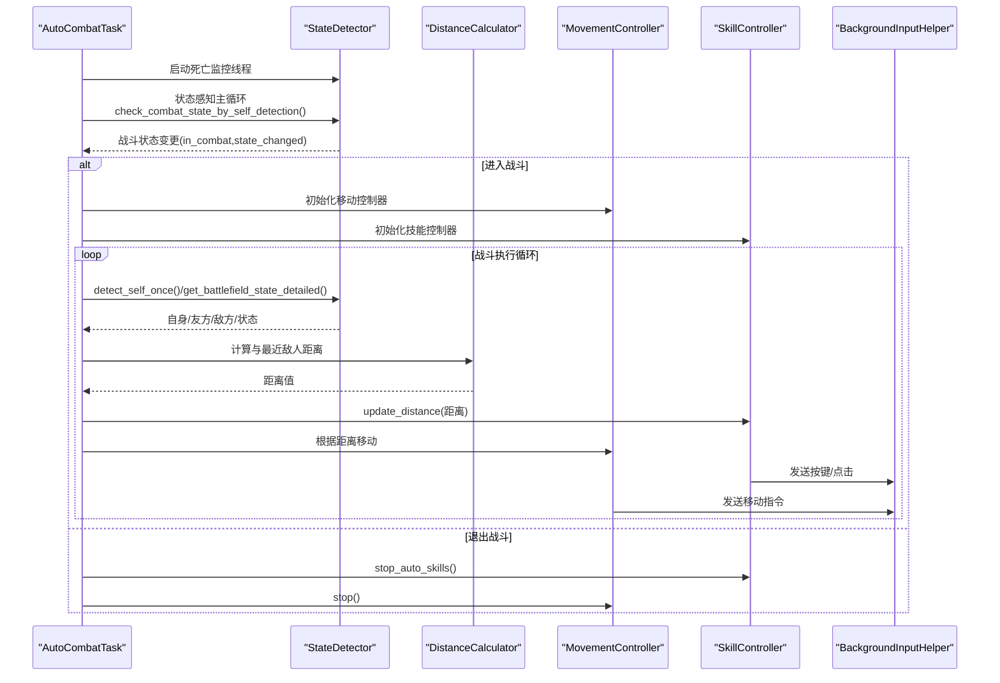
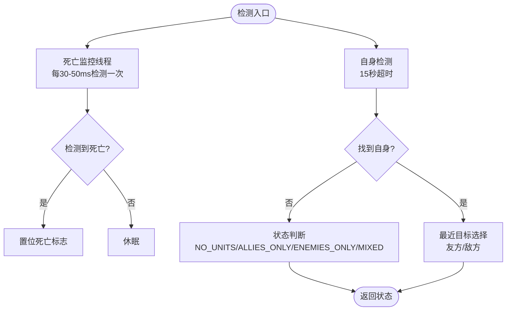
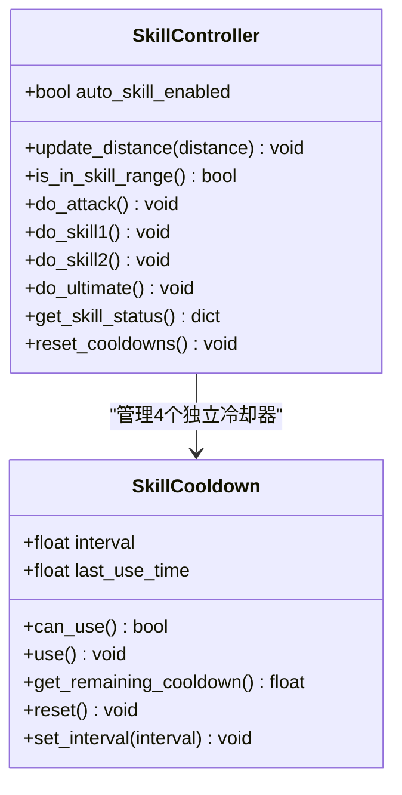
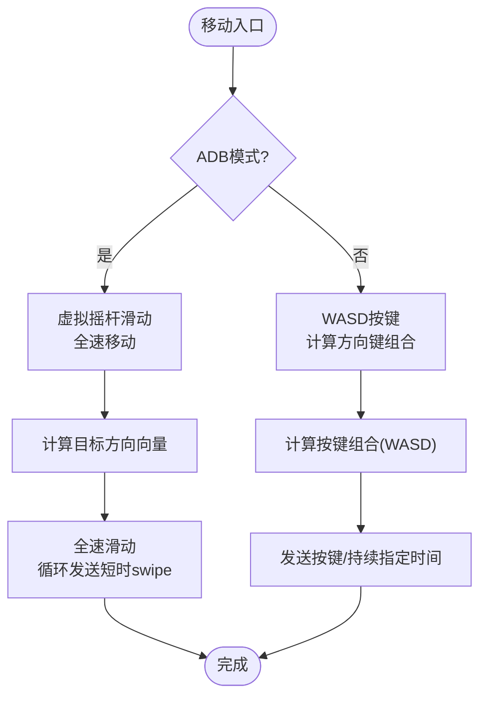
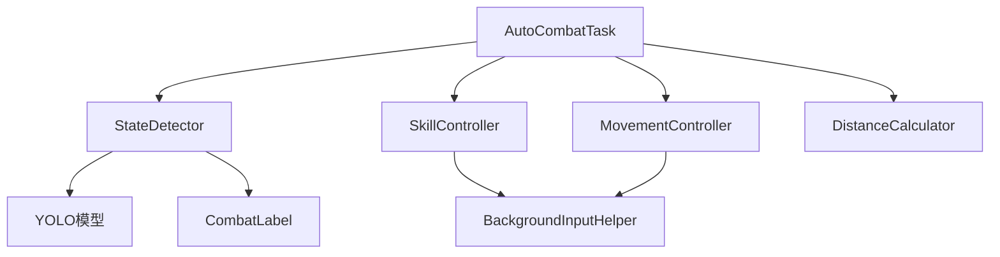

# 战斗系统

<cite>
**本文引用的文件**
- [src/combat/state_detector.py](file://src/combat/state_detector.py)
- [src/combat/skill_controller.py](file://src/combat/skill_controller.py)
- [src/combat/movement_controller.py](file://src/combat/movement_controller.py)
- [src/combat/labels.py](file://src/combat/labels.py)
- [src/combat/distance_calculator.py](file://src/combat/distance_calculator.py)
- [src/task/AutoCombatTask.py](file://src/task/AutoCombatTask.py)
- [src/utils/BackgroundInputHelper.py](file://src/utils/BackgroundInputHelper.py)
- [configs/AutoCombatTask.json](file://configs/AutoCombatTask.json)
- [configs/游戏热键配置.json](file://configs/游戏热键配置.json)
- [docs/自动战斗系统流程图.md](file://docs/自动战斗系统流程图.md)
- [requirements.txt](file://requirements.txt)
</cite>

## 目录
1. [简介](#简介)
2. [项目结构](#项目结构)
3. [核心组件](#核心组件)
4. [架构总览](#架构总览)
5. [详细组件分析](#详细组件分析)
6. [依赖关系分析](#依赖关系分析)
7. [性能考量](#性能考量)
8. [故障排查指南](#故障排查指南)
9. [结论](#结论)
10. [附录](#附录)

## 简介
本文件为 ok-jump 项目的自动战斗系统技术文档，围绕基于 YOLO 模型的实时战场状态检测、智能技能释放控制、移动控制算法三大核心能力展开，系统性阐述以下内容：
- 战斗状态检测：目标识别、距离计算、战斗状态判断与防抖动机制
- 技能控制器：技能优先级、冷却时间管理、最优技能选择与后台按键发送
- 移动控制算法：路径规划、障碍物避让、最佳攻击位置选择
- YOLO 模型集成与性能优化策略
- 开发者扩展与维护指南

## 项目结构
自动战斗系统位于 src/combat 目录，配合 src/task/AutoCombatTask.py 作为编排入口，通过配置文件驱动行为，结合后台输入工具实现伪后台运行。

图表来源
- [docs/自动战斗系统流程图.md](file://docs/自动战斗系统流程图.md)
- [src/task/AutoCombatTask.py](file://src/task/AutoCombatTask.py)
- [src/combat/state_detector.py](file://src/combat/state_detector.py)
- [src/combat/skill_controller.py](file://src/combat/skill_controller.py)
- [src/combat/movement_controller.py](file://src/combat/movement_controller.py)
- [src/combat/distance_calculator.py](file://src/combat/distance_calculator.py)
- [src/utils/BackgroundInputHelper.py](file://src/utils/BackgroundInputHelper.py)

章节来源
- [src/task/AutoCombatTask.py](file://src/task/AutoCombatTask.py)
- [docs/自动战斗系统流程图.md](file://docs/自动战斗系统流程图.md)

## 核心组件
- 战斗状态检测器（StateDetector）：基于 YOLO 模型识别自身、友方、敌方与死亡状态，提供战场状态判断与最近目标选择。
- 技能控制器（SkillController）：依据配置与冷却状态，自动释放普攻、技能1、技能2与大招；支持后台按键发送与手机端点击。
- 移动控制器（MovementController）：根据目标方向与距离，发送 WASD 键盘或虚拟摇杆指令，支持伪后台模式。
- 距离计算器（DistanceCalculator）：提供两点间欧氏距离计算，支撑技能释放与移动决策。
- 后台输入助手（BackgroundInputHelper）：为 Unity 游戏提供可靠的后台输入支持，避免窗口前置。
- AutoCombatTask（主任务）：串联上述组件，实现状态感知主循环、战斗线程管理、卡住/抖动检测与异常处理。

章节来源
- [src/combat/state_detector.py](file://src/combat/state_detector.py)
- [src/combat/skill_controller.py](file://src/combat/skill_controller.py)
- [src/combat/movement_controller.py](file://src/combat/movement_controller.py)
- [src/combat/distance_calculator.py](file://src/combat/distance_calculator.py)
- [src/utils/BackgroundInputHelper.py](file://src/utils/BackgroundInputHelper.py)
- [src/task/AutoCombatTask.py](file://src/task/AutoCombatTask.py)

## 架构总览
自动战斗系统采用“配置驱动 + 状态感知 + 组件协作”的架构：
- 配置驱动：技能开关、冷却间隔、按键映射、移动持续时间等来自 JSON 配置。
- 状态感知：通过 YOLO 自身检测判断是否进入/退出战斗，避免误触与漏检。
- 组件协作：检测器提供状态与目标，控制器据此决策移动与技能释放，后台输入保障在伪后台稳定运行。

图表来源
- [src/task/AutoCombatTask.py](file://src/task/AutoCombatTask.py)
- [src/combat/state_detector.py](file://src/combat/state_detector.py)
- [src/combat/skill_controller.py](file://src/combat/skill_controller.py)
- [src/combat/movement_controller.py](file://src/combat/movement_controller.py)
- [src/combat/distance_calculator.py](file://src/combat/distance_calculator.py)
- [src/utils/BackgroundInputHelper.py](file://src/utils/BackgroundInputHelper.py)

## 详细组件分析

### 战斗状态检测器（StateDetector）
- 功能要点
  - 死亡状态并行监控：独立线程以高频检测死亡标签，快速置位/复位死亡标志，主线程通过 is_death_detected() 快速查询。
  - 自身检测：15 秒超时内检测自身位置，支持单次与持续检测，帧为空时降频等待，避免阻塞。
  - 友方/敌方检测：在同一帧内并行检测，保证状态一致性。
  - 战场状态判断：根据是否存在友方/敌方，返回 NO_UNITS、ALLIES_ONLY、ENEMIES_ONLY、MIXED。
  - 最近目标选择：基于欧氏距离计算最近友方/敌方。
  - 战斗状态判定：通过连续 N 次检测自身/未检测自身实现防抖动，避免状态抖动。
- 性能与稳定性
  - 死亡监控线程间隔约 30-50ms，降低 CPU 占用的同时提升响应速度。
  - 自身检测与状态判断均在获取最新帧后执行，确保视觉一致性。
- 配置与扩展
  - 标签定义集中于 CombatLabel，便于新增标签与模型类别映射。

图表来源
- [src/combat/state_detector.py](file://src/combat/state_detector.py)
- [src/combat/labels.py](file://src/combat/labels.py)

章节来源
- [src/combat/state_detector.py](file://src/combat/state_detector.py)
- [src/combat/labels.py](file://src/combat/labels.py)

### 技能控制器（SkillController）
- 功能要点
  - 独立冷却：每个技能拥有独立冷却器，互不影响，支持动态更新冷却间隔。
  - 配置驱动：从 AutoCombatTask.json 读取技能开关与间隔，从 游戏热键配置.json 读取按键映射。
  - 后台支持：通过后台输入助手发送按键，支持 Unity 游戏后台操作。
  - 线程监控：独立线程持续监控距离并在范围内释放技能，避免主线程阻塞。
  - 手机端适配：预留 ADB 模式下的点击技能按钮逻辑，失败时回退键盘按键。
- 释放策略
  - 按启用开关与冷却状态依次尝试释放普攻、技能1、技能2、大招。
  - 每次释放后重置对应冷却计时。
- 状态查询
  - 提供技能状态字典，包含启用状态、按键、间隔与剩余冷却时间。

图表来源
- [src/combat/skill_controller.py](file://src/combat/skill_controller.py)

章节来源
- [src/combat/skill_controller.py](file://src/combat/skill_controller.py)
- [configs/AutoCombatTask.json](file://configs/AutoCombatTask.json)
- [configs/游戏热键配置.json](file://configs/游戏热键配置.json)

### 移动控制器（MovementController）
- 功能要点
  - PC 端：WASD 键盘控制，支持后台模式；可中断移动，减少停顿。
  - 手机端：虚拟摇杆滑动，全速移动至目标方向，循环发送短时 swipe 以维持连续运动。
  - 后台支持：通过后台输入助手发送按键或滑动，避免窗口前置。
  - 方向计算：基于偏移量 dx/dy 计算八方向组合按键，阈值过滤微小偏移。
- 移动策略
  - 距离过近：远离目标
  - 距离合适：停止移动
  - 距离过远：靠近目标
- 性能优化
  - 移动持续时间可配置，平衡移动距离与稳定性。

图表来源
- [src/combat/movement_controller.py](file://src/combat/movement_controller.py)
- [src/utils/BackgroundInputHelper.py](file://src/utils/BackgroundInputHelper.py)

章节来源
- [src/combat/movement_controller.py](file://src/combat/movement_controller.py)
- [src/utils/BackgroundInputHelper.py](file://src/utils/BackgroundInputHelper.py)

### 距离计算器（DistanceCalculator）
- 功能要点
  - 提供两点间欧氏距离计算，支持从坐标与检测结果两种输入。
  - 用于技能释放距离与移动控制决策（0-225px 技能范围）。
- 使用场景
  - AutoCombatTask 中优先返回在技能范围内的最近敌人距离，否则返回最近敌人距离。

章节来源
- [src/combat/distance_calculator.py](file://src/combat/distance_calculator.py)
- [src/task/AutoCombatTask.py](file://src/task/AutoCombatTask.py)

### 后台输入助手（BackgroundInputHelper）
- 功能要点
  - 为 Unity 游戏提供可靠的后台输入支持，避免使用 PostMessage 导致的检测失败。
  - 支持伪最小化模式与窗口激活模式，自动选择 SendInput 或前台输入。
  - 提供按键、鼠标点击、拖拽等底层输入封装。
- 与控制器协作
  - MovementController 与 SkillController 通过后台输入助手发送输入，确保在伪后台稳定运行。

章节来源
- [src/utils/BackgroundInputHelper.py](file://src/utils/BackgroundInputHelper.py)
- [src/combat/movement_controller.py](file://src/combat/movement_controller.py)
- [src/combat/skill_controller.py](file://src/combat/skill_controller.py)

### 主任务编排（AutoCombatTask）
- 功能要点
  - 状态感知主循环：通过 YOLO 自身检测动态启停战斗，避免误判。
  - 测试模式：跳过场景检测，直接进入战斗循环，便于调试。
  - 战斗线程管理：独立线程执行战斗循环，支持平滑启动/停止。
  - 异常处理：记录帧信息与异常堆栈，清理资源并抛出异常。
  - 卡住/抖动检测：在无敌人在技能范围内时，检测自身位置历史与敌人最后位置，必要时执行摆脱动作。
- 配置驱动
  - 技能开关、间隔、移动持续时间等来自 AutoCombatTask.json。
  - 按键映射来自 游戏热键配置.json。

章节来源
- [src/task/AutoCombatTask.py](file://src/task/AutoCombatTask.py)
- [configs/AutoCombatTask.json](file://configs/AutoCombatTask.json)
- [configs/游戏热键配置.json](file://configs/游戏热键配置.json)

## 依赖关系分析
- 模块耦合
  - AutoCombatTask 作为编排者，依赖 StateDetector、MovementController、SkillController、DistanceCalculator。
  - SkillController 与 MovementController 依赖 BackgroundInputHelper 实现后台输入。
  - StateDetector 依赖 YOLO 模型（fight.onnx）与 CombatLabel 标签定义。
- 外部依赖
  - onnxruntime、opencv-python、pydirectinput 等用于推理与输入模拟。

图表来源
- [src/task/AutoCombatTask.py](file://src/task/AutoCombatTask.py)
- [src/combat/state_detector.py](file://src/combat/state_detector.py)
- [src/combat/skill_controller.py](file://src/combat/skill_controller.py)
- [src/combat/movement_controller.py](file://src/combat/movement_controller.py)
- [src/combat/distance_calculator.py](file://src/combat/distance_calculator.py)
- [src/combat/labels.py](file://src/combat/labels.py)
- [src/utils/BackgroundInputHelper.py](file://src/utils/BackgroundInputHelper.py)

章节来源
- [requirements.txt](file://requirements.txt)
- [src/task/AutoCombatTask.py](file://src/task/AutoCombatTask.py)

## 性能考量
- 死亡检测优化
  - 并行线程以 30-50ms 间隔检测，显著提升响应速度，降低主线程阻塞。
- 主循环节拍
  - 非测试模式下约 500ms 检测一次战斗状态，测试模式下约 50ms 循环，兼顾实时性与稳定性。
- 后台输入
  - 使用 SendInput 避免窗口前置，减少切换开销；伪最小化模式进一步降低系统交互成本。
- YOLO 推理
  - 建议在高刷新率显示器与合适分辨率下运行，减少帧尺寸带来的推理负担；必要时启用 DirectML 加速（见 requirements）。

[本节为通用性能建议，不直接分析具体文件]

## 故障排查指南
- 自身检测失败
  - 现象：15 秒内未检测到自身，主循环记录帧信息并抛出异常。
  - 排查：确认 YOLO 模型加载、标签映射正确；检查分辨率与缩放；查看后台模式是否启用。
- 死亡状态误判
  - 现象：死亡监控线程频繁置位/复位。
  - 排查：检查死亡标签置信度阈值与连续检测阈值；确认背景稳定。
- 技能不释放
  - 现象：技能冷却未更新或按键未发送。
  - 排查：核对 AutoCombatTask.json 与 游戏热键配置.json；确认后台输入助手已初始化；检查 ADB 模式下点击失败回退逻辑。
- 移动无效
  - 现象：PC 端按键无响应，手机端滑动无效。
  - 排查：确认后台模式与伪最小化状态；检查窗口句柄获取；验证 SendInput 路径。

章节来源
- [src/task/AutoCombatTask.py](file://src/task/AutoCombatTask.py)
- [src/combat/state_detector.py](file://src/combat/state_detector.py)
- [src/combat/skill_controller.py](file://src/combat/skill_controller.py)
- [src/combat/movement_controller.py](file://src/combat/movement_controller.py)
- [src/utils/BackgroundInputHelper.py](file://src/utils/BackgroundInputHelper.py)

## 结论
ok-jump 的自动战斗系统通过“配置驱动 + 状态感知 + 组件协作”的设计，实现了高鲁棒性的实时战斗辅助。YOLO 模型提供稳定的战场状态感知，技能与移动控制器在后台模式下可靠运行，配合完善的异常处理与性能优化策略，满足复杂战斗场景的需求。开发者可在现有架构上扩展标签体系、优化推理性能与增强策略灵活性。

[本节为总结性内容，不直接分析具体文件]

## 附录
- 配置项说明
  - AutoCombatTask.json：技能开关、冷却间隔、移动持续时间等
  - 游戏热键配置.json：普通攻击、技能1、技能2、大招的按键映射
- 相关文件
  - [docs/自动战斗系统流程图.md](file://docs/自动战斗系统流程图.md)
  - [requirements.txt](file://requirements.txt)