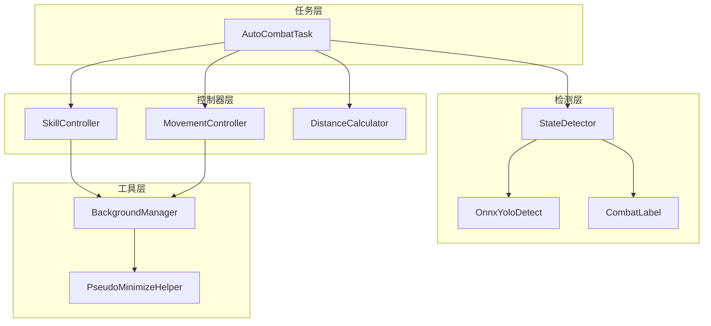
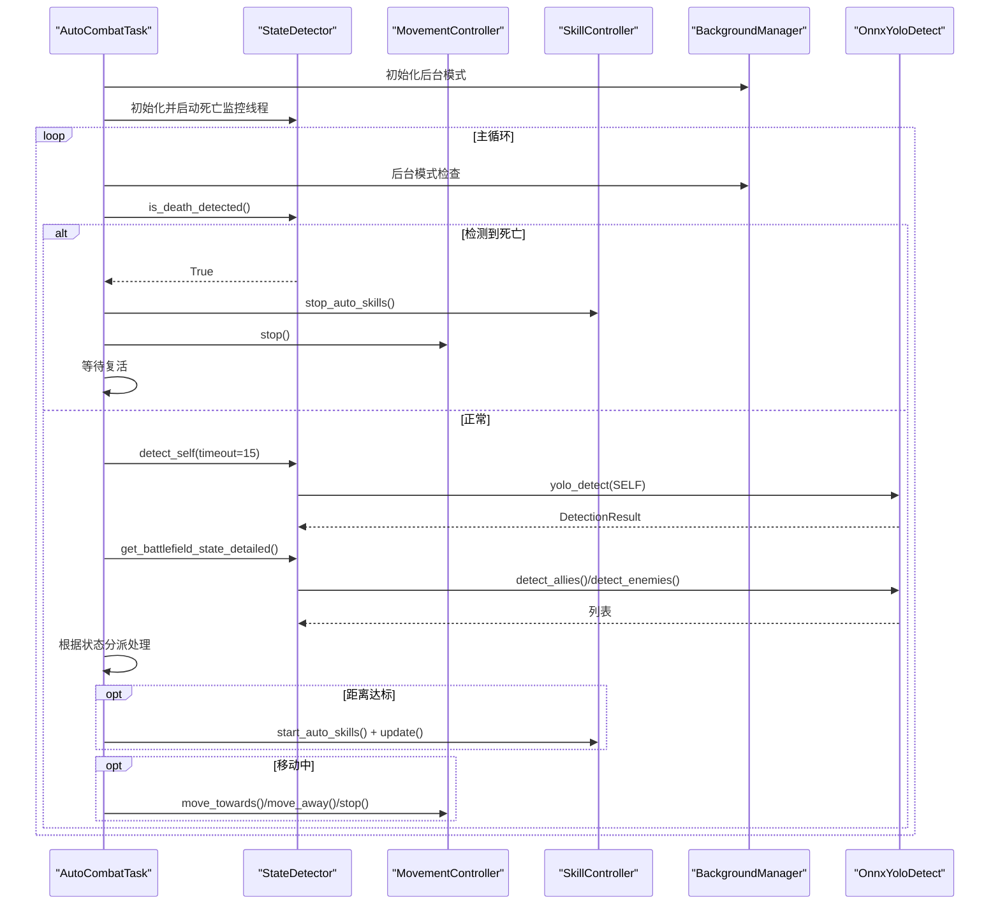
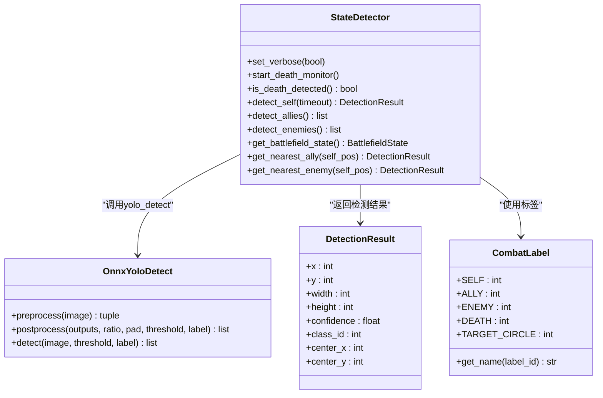
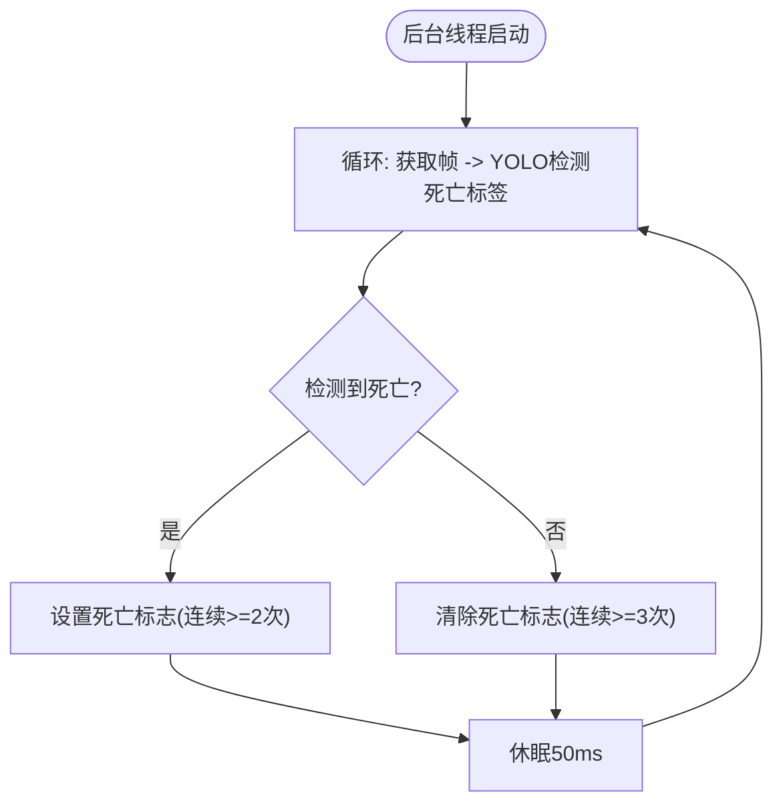
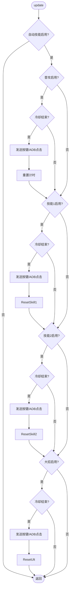
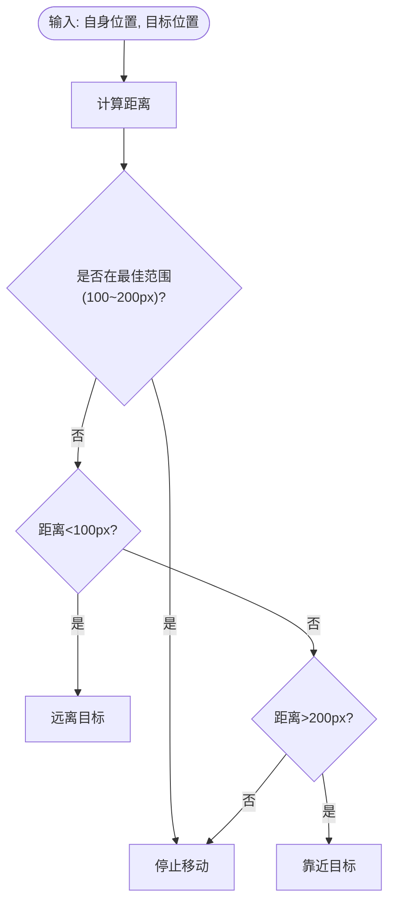
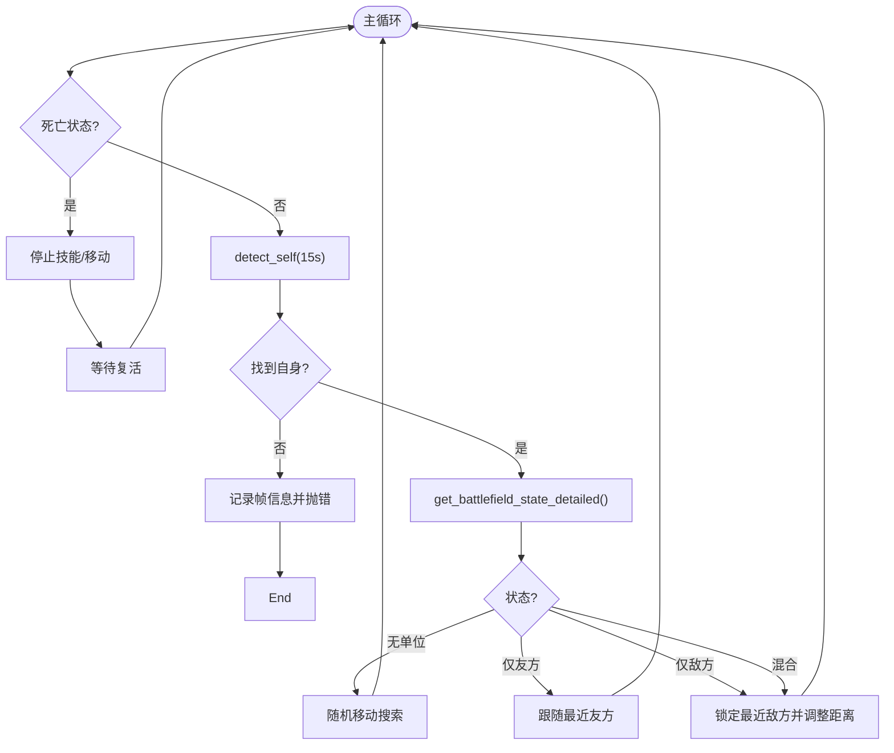
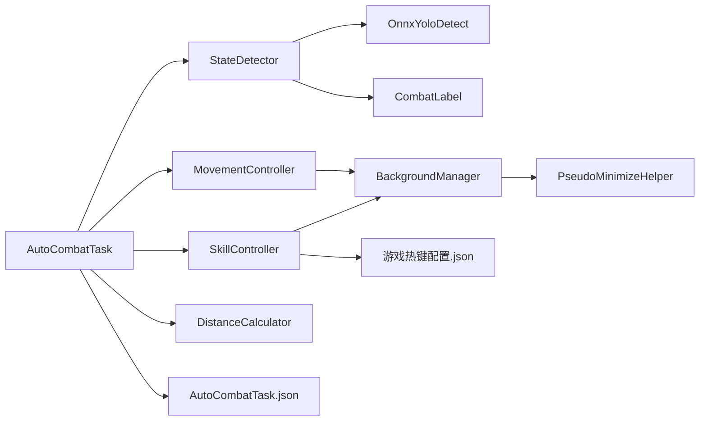

# 战斗系统

<cite>
**本文引用的文件**
- [AutoCombatTask.py](file://src/task/AutoCombatTask.py)
- [skill_controller.py](file://src/combat/skill_controller.py)
- [state_detector.py](file://src/combat/state_detector.py)
- [distance_calculator.py](file://src/combat/distance_calculator.py)
- [movement_controller.py](file://src/combat/movement_controller.py)
- [labels.py](file://src/combat/labels.py)
- [OnnxYoloDetect.py](file://src/OnnxYoloDetect.py)
- [BackgroundManager.py](file://src/utils/BackgroundManager.py)
- [PseudoMinimizeHelper.py](file://src/utils/PseudoMinimizeHelper.py)
- [AutoCombatTask.json](file://configs/AutoCombatTask.json)
- [游戏热键配置.json](file://configs/游戏热键配置.json)
- [自动战斗系统流程图.md](file://docs/自动战斗系统流程图.md)
</cite>

## 目录
1. [简介](#简介)
2. [项目结构](#项目结构)
3. [核心组件](#核心组件)
4. [架构总览](#架构总览)
5. [详细组件分析](#详细组件分析)
6. [依赖关系分析](#依赖关系分析)
7. [性能考量](#性能考量)
8. [故障排查指南](#故障排查指南)
9. [结论](#结论)
10. [附录](#附录)

## 简介
本文件系统性梳理OK-Jump的自动战斗系统，重点覆盖以下方面：
- 智能战斗逻辑：YOLO模型集成、多标签检测（自己、友方、敌方、死亡）、并行监控机制
- 技能控制器：键盘/鼠标输入控制、后台模式支持、配置驱动的技能释放
- 移动控制与距离计算：基于最佳攻击距离的缓冲区滞回策略与方向决策
- 战斗状态检测：并行死亡检测、实时状态更新与状态机处理
- 实际使用模式与代码示例路径

## 项目结构
自动战斗系统由“任务层”“控制器层”“检测层”“工具层”四层构成，任务层负责编排，控制器层负责具体动作，检测层负责视觉感知，工具层提供后台支持与伪最小化能力。

图表来源
- [AutoCombatTask.py:1-693](file://src/task/AutoCombatTask.py#L1-L693)
- [skill_controller.py:1-347](file://src/combat/skill_controller.py#L1-L347)
- [movement_controller.py:1-508](file://src/combat/movement_controller.py#L1-L508)
- [distance_calculator.py:1-197](file://src/combat/distance_calculator.py#L1-L197)
- [state_detector.py:1-446](file://src/combat/state_detector.py#L1-L446)
- [OnnxYoloDetect.py:1-315](file://src/OnnxYoloDetect.py#L1-L315)
- [labels.py:1-51](file://src/combat/labels.py#L1-L51)
- [BackgroundManager.py:1-155](file://src/utils/BackgroundManager.py#L1-L155)
- [PseudoMinimizeHelper.py:1-238](file://src/utils/PseudoMinimizeHelper.py#L1-L238)

章节来源
- [AutoCombatTask.py:1-693](file://src/task/AutoCombatTask.py#L1-L693)
- [自动战斗系统流程图.md:1-297](file://docs/自动战斗系统流程图.md#L1-L297)

## 核心组件
- AutoCombatTask：自动战斗主任务，负责初始化、主循环、状态机分发与异常清理
- StateDetector：基于YOLO的战场状态检测器，支持并行死亡监控与多标签检测
- SkillController：技能控制器，支持GUI配置驱动与后台模式
- MovementController：移动控制器，支持PC端WASD与手机端虚拟摇杆
- DistanceCalculator：距离计算器，提供最佳攻击距离与滞回缓冲区
- OnnxYoloDetect：通用YOLOv11检测器，封装预处理、推理与后处理
- BackgroundManager/PseudoMinimizeHelper：后台模式与伪最小化支持

章节来源
- [AutoCombatTask.py:32-134](file://src/task/AutoCombatTask.py#L32-L134)
- [state_detector.py:24-51](file://src/combat/state_detector.py#L24-L51)
- [skill_controller.py:24-79](file://src/combat/skill_controller.py#L24-L79)
- [movement_controller.py:24-57](file://src/combat/movement_controller.py#L24-L57)
- [distance_calculator.py:14-51](file://src/combat/distance_calculator.py#L14-L51)
- [OnnxYoloDetect.py:17-67](file://src/OnnxYoloDetect.py#L17-L67)
- [BackgroundManager.py:7-44](file://src/utils/BackgroundManager.py#L7-L44)
- [PseudoMinimizeHelper.py:13-47](file://src/utils/PseudoMinimizeHelper.py#L13-L47)

## 架构总览
自动战斗系统采用“配置驱动 + 并行监控 + 状态机”的设计：
- 配置驱动：技能开关与间隔来自AutoCombatTask.json；按键映射来自游戏热键配置.json
- 并行监控：死亡状态在独立线程高频检测，主线程快速查询
- 状态机：根据战场状态（无单位/仅友方/仅敌方/混合）执行不同策略

图表来源
- [AutoCombatTask.py:84-271](file://src/task/AutoCombatTask.py#L84-L271)
- [state_detector.py:72-184](file://src/combat/state_detector.py#L72-L184)
- [skill_controller.py:139-250](file://src/combat/skill_controller.py#L139-L250)
- [movement_controller.py:102-158](file://src/combat/movement_controller.py#L102-L158)
- [OnnxYoloDetect.py:234-258](file://src/OnnxYoloDetect.py#L234-L258)

## 详细组件分析

### 智能战斗逻辑与YOLO集成
- 多标签检测：通过CombatLabel定义SELF/ALLY/ENEMY/DEATH/TARGET_CIRCLE，StateDetector统一调用YOLO检测
- YOLOv11推理：OnnxYoloDetect封装预处理、推理与NMS后处理，支持CPU/GPU执行提供者
- 检测频率与精度：死亡检测线程以~20Hz（50ms）轮询，同步检测默认~20Hz（50ms）

图表来源
- [state_detector.py:24-446](file://src/combat/state_detector.py#L24-L446)
- [OnnxYoloDetect.py:17-315](file://src/OnnxYoloDetect.py#L17-L315)
- [labels.py:8-51](file://src/combat/labels.py#L8-L51)

章节来源
- [state_detector.py:16-51](file://src/combat/state_detector.py#L16-L51)
- [OnnxYoloDetect.py:33-67](file://src/OnnxYoloDetect.py#L33-L67)
- [labels.py:8-51](file://src/combat/labels.py#L8-L51)

### 并行死亡检测机制
- 独立线程：后台线程以~20Hz轮询，检测到死亡置位，检测不到则复位
- 防抖策略：连续两次检测到死亡才确认，连续三次未检测到才确认复活
- 快速查询：主线程通过is_death_detected()快速获取状态，避免阻塞

图表来源
- [state_detector.py:118-184](file://src/combat/state_detector.py#L118-L184)

章节来源
- [state_detector.py:72-184](file://src/combat/state_detector.py#L72-L184)

### 技能控制器工作原理
- 配置驱动：从AutoCombatTask.json读取开关与间隔；从游戏热键配置.json读取按键映射
- 后台模式支持：自动适配ADB/Windows前台/Windows后台三种模式，分别使用swipe/前台pydirectinput/后台SendInput
- 冷却管理：维护每项技能的上次释放时间，按配置间隔触发

图表来源
- [skill_controller.py:211-250](file://src/combat/skill_controller.py#L211-L250)
- [skill_controller.py:152-184](file://src/combat/skill_controller.py#L152-L184)
- [AutoCombatTask.json:1-13](file://configs/AutoCombatTask.json#L1-L13)
- [游戏热键配置.json:1-6](file://configs/游戏热键配置.json#L1-L6)

章节来源
- [skill_controller.py:24-347](file://src/combat/skill_controller.py#L24-L347)
- [AutoCombatTask.json:46-68](file://configs/AutoCombatTask.json#L46-L68)
- [游戏热键配置.json:1-6](file://configs/游戏热键配置.json#L1-L6)

### 移动控制与距离计算算法
- 距离计算：提供两点间欧氏距离与带滞回的“最佳攻击距离”判断（100~200像素）
- 滞回策略：进入范围与离开范围使用不同阈值，避免边界抖动
- 方向决策：根据当前状态与目标距离决定“靠近/远离/停止”
- 输入适配：PC端WASD，手机端虚拟摇杆，支持后台模式

图表来源
- [distance_calculator.py:84-118](file://src/combat/distance_calculator.py#L84-L118)
- [distance_calculator.py:120-158](file://src/combat/distance_calculator.py#L120-L158)

章节来源
- [distance_calculator.py:14-197](file://src/combat/distance_calculator.py#L14-L197)
- [movement_controller.py:102-158](file://src/combat/movement_controller.py#L102-L158)

### 战斗状态检测与实时更新
- 状态枚举：无单位/仅友方/仅敌方/混合
- 实时更新：主循环每50ms左右轮询，结合YOLO检测与距离计算器输出
- 状态机处理：根据不同状态执行搜索、跟随、攻击与锁定目标

图表来源
- [AutoCombatTask.py:197-271](file://src/task/AutoCombatTask.py#L197-L271)
- [state_detector.py:354-386](file://src/combat/state_detector.py#L354-L386)

章节来源
- [AutoCombatTask.py:197-678](file://src/task/AutoCombatTask.py#L197-L678)
- [state_detector.py:354-446](file://src/combat/state_detector.py#L354-L446)

## 依赖关系分析
- AutoCombatTask依赖StateDetector/MovementController/SkillController/DistanceCalculator
- StateDetector依赖OnnxYoloDetect与CombatLabel
- MovementController/SkillController依赖BackgroundManager与PseudoMinimizeHelper
- 配置来源：AutoCombatTask.json与游戏热键配置.json

图表来源
- [AutoCombatTask.py:22-28](file://src/task/AutoCombatTask.py#L22-L28)
- [state_detector.py:13](file://src/combat/state_detector.py#L13)
- [skill_controller.py:17-18](file://src/combat/skill_controller.py#L17-L18)
- [BackgroundManager.py:3-4](file://src/utils/BackgroundManager.py#L3-L4)
- [PseudoMinimizeHelper.py:1-6](file://src/utils/PseudoMinimizeHelper.py#L1-L6)

章节来源
- [AutoCombatTask.py:22-28](file://src/task/AutoCombatTask.py#L22-L28)
- [skill_controller.py:17-18](file://src/combat/skill_controller.py#L17-L18)
- [state_detector.py:13](file://src/combat/state_detector.py#L13)

## 性能考量
- 死亡检测频率：从~10Hz提升至~20Hz，显著降低响应延迟
- 主循环延迟：从100ms降至50ms，提升交互流畅度
- 后台支持：通过伪最小化与后台输入适配，支持Unity游戏后台操作
- 检测精度：YOLOv11+NMS，结合滞回策略减少误判

章节来源
- [自动战斗系统流程图.md:281-289](file://docs/自动战斗系统流程图.md#L281-L289)

## 故障排查指南
- 自身检测超时：检查摄像头/截图是否可用，确认分辨率与缩放比例
- 死亡状态误判：检查死亡标签置信度阈值与连续检测次数
- 技能释放失败：确认后台模式配置、窗口句柄获取与按键映射
- 移动无效：检查ADB模式与虚拟摇杆参数，或前台/后台输入适配

章节来源
- [AutoCombatTask.py:240-244](file://src/task/AutoCombatTask.py#L240-L244)
- [state_detector.py:151-182](file://src/combat/state_detector.py#L151-L182)
- [skill_controller.py:114-138](file://src/combat/skill_controller.py#L114-L138)
- [movement_controller.py:302-346](file://src/combat/movement_controller.py#L302-L346)

## 结论
OK-Jump战斗系统通过“配置驱动 + 并行监控 + 状态机”的架构实现了稳定高效的自动战斗体验。YOLO模型提供可靠的多标签检测，滞回距离控制与后台适配确保了流畅与鲁棒性。建议在实际使用中：
- 调整AutoCombatTask.json中的技能间隔与移动持续时间
- 根据游戏窗口状态启用后台模式与伪最小化
- 结合实际场景微调YOLO置信度与检测标签

## 附录
- 配置文件路径与用途
  - AutoCombatTask.json：技能开关与间隔、移动持续时间
  - 游戏热键配置.json：按键映射（普通攻击/技能1/技能2/大招）
- 关键流程图参考
  - 自动战斗系统流程图.md：系统架构、主循环、状态处理、并行死亡检测、技能释放逻辑、伪后台模式、异常处理与配置驱动

章节来源
- [AutoCombatTask.json:1-13](file://configs/AutoCombatTask.json#L1-L13)
- [游戏热键配置.json:1-6](file://configs/游戏热键配置.json#L1-L6)
- [自动战斗系统流程图.md:1-297](file://docs/自动战斗系统流程图.md#L1-L297)