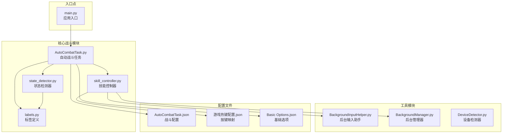
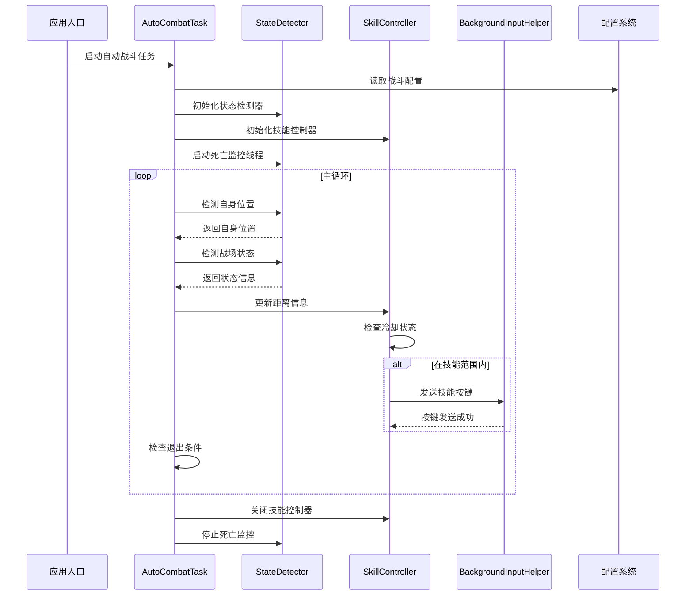
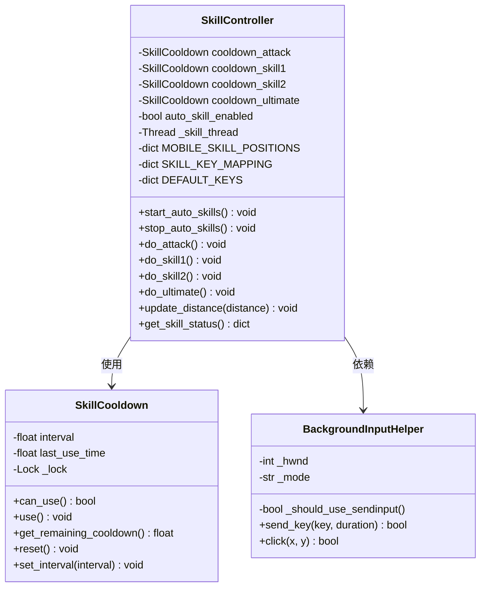
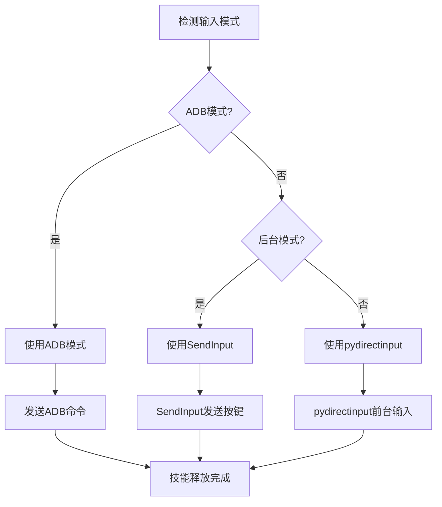
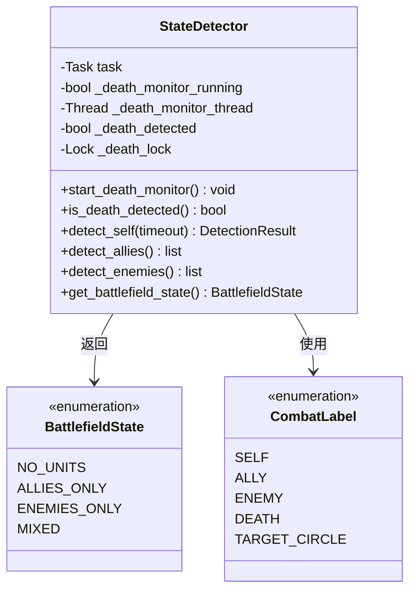
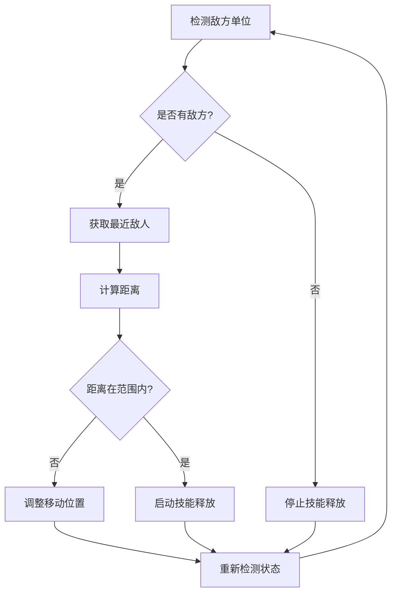
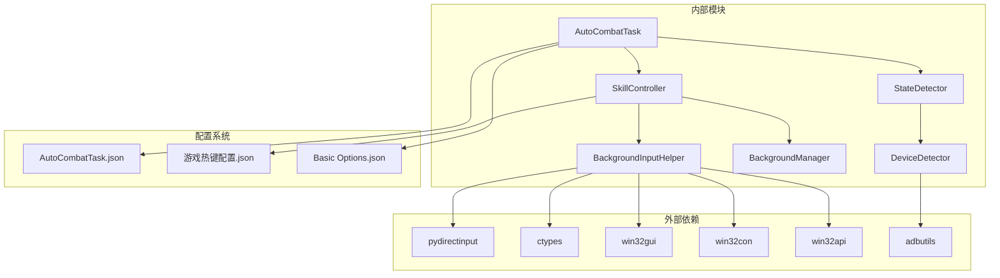

# 战斗配置适配器

<cite>
**本文档引用的文件**
- [skill_controller.py](file://src/combat/skill_controller.py)
- [state_detector.py](file://src/combat/state_detector.py)
- [labels.py](file://src/combat/labels.py)
- [AutoCombatTask.py](file://src/task/AutoCombatTask.py)
- [BackgroundInputHelper.py](file://src/utils/BackgroundInputHelper.py)
- [BackgroundManager.py](file://src/utils/BackgroundManager.py)
- [DeviceDetector.py](file://src/utils/DeviceDetector.py)
- [AutoCombatTask.json](file://configs/AutoCombatTask.json)
- [游戏热键配置.json](file://configs/游戏热键配置.json)
- [Basic Options.json](file://configs/Basic Options.json)
- [main.py](file://main.py)
</cite>

## 目录
1. [简介](#简介)
2. [项目结构](#项目结构)
3. [核心组件](#核心组件)
4. [架构概览](#架构概览)
5. [详细组件分析](#详细组件分析)
6. [依赖关系分析](#依赖关系分析)
7. [性能考虑](#性能考虑)
8. [故障排除指南](#故障排除指南)
9. [结论](#结论)

## 简介

战斗配置适配器是OK-Jump自动化框架中的核心战斗系统组件，负责实现智能的自动战斗逻辑。该系统基于YOLO目标检测技术，结合配置驱动的技能释放机制，能够在不同游戏场景中自动执行战斗操作。

系统的主要特点包括：
- **多平台适配**：支持PC端键盘输入和移动端ADB模式
- **智能配置驱动**：通过JSON配置文件控制技能开关和冷却间隔
- **后台模式支持**：为Unity游戏提供可靠的后台输入支持
- **实时状态检测**：使用YOLO模型进行战场状态实时监控
- **自适应距离控制**：根据检测到的目标距离自动调整战斗策略

## 项目结构

**图表来源**
- [AutoCombatTask.py:1-763](file://src/task/AutoCombatTask.py#L1-L763)
- [skill_controller.py:1-621](file://src/combat/skill_controller.py#L1-L621)
- [state_detector.py:1-467](file://src/combat/state_detector.py#L1-L467)

**章节来源**
- [main.py:1-226](file://main.py#L1-L226)
- [AutoCombatTask.py:1-763](file://src/task/AutoCombatTask.py#L1-L763)

## 核心组件

### 技能控制器（SkillController）

技能控制器是战斗系统的核心组件，负责管理所有技能释放逻辑。它实现了以下关键功能：

- **独立冷却机制**：每个技能拥有独立的冷却计时器，互不影响
- **多平台适配**：支持PC键盘输入和移动端ADB模式
- **智能后台支持**：自动检测后台模式并使用SendInput发送按键
- **实时距离监控**：持续监控与目标的距离并在合适时机释放技能

### 状态检测器（StateDetector）

状态检测器使用YOLO模型进行实时战场状态检测：

- **死亡状态监控**：并行线程持续监控角色死亡状态
- **单位检测**：检测自身、友方、敌方单位位置
- **战场状态判断**：根据检测结果判断当前战场状态
- **目标锁定机制**：智能锁定和跟踪目标单位

### 配置管理系统

系统采用分层配置管理：

- **战斗配置**：控制技能开关和冷却间隔
- **按键映射**：定义每个技能对应的按键
- **基础选项**：控制后台模式和音频设置
- **智能设备选择**：根据环境自动选择最佳设备

**章节来源**
- [skill_controller.py:82-621](file://src/combat/skill_controller.py#L82-L621)
- [state_detector.py:24-467](file://src/combat/state_detector.py#L24-L467)
- [labels.py:8-51](file://src/combat/labels.py#L8-L51)

## 架构概览

**图表来源**
- [AutoCombatTask.py:84-279](file://src/task/AutoCombatTask.py#L84-L279)
- [skill_controller.py:293-354](file://src/combat/skill_controller.py#L293-L354)
- [state_detector.py:118-184](file://src/combat/state_detector.py#L118-L184)

## 详细组件分析

### 技能控制器深度分析

**图表来源**
- [skill_controller.py:29-80](file://src/combat/skill_controller.py#L29-L80)
- [skill_controller.py:82-149](file://src/combat/skill_controller.py#L82-L149)
- [BackgroundInputHelper.py:99-117](file://src/utils/BackgroundInputHelper.py#L99-L117)

#### 技能冷却机制

技能控制器实现了精细的冷却管理机制：

- **独立冷却计时器**：每个技能都有自己的冷却计时器
- **线程安全设计**：使用锁机制确保并发访问安全
- **动态配置更新**：运行时可以从配置文件更新冷却间隔
- **剩余冷却显示**：提供冷却状态查询接口

#### 多平台适配策略

**图表来源**
- [skill_controller.py:150-175](file://src/combat/skill_controller.py#L150-L175)
- [skill_controller.py:206-239](file://src/combat/skill_controller.py#L206-L239)
- [BackgroundInputHelper.py:199-207](file://src/utils/BackgroundInputHelper.py#L199-L207)

**章节来源**
- [skill_controller.py:1-621](file://src/combat/skill_controller.py#L1-L621)

### 状态检测器深度分析

**图表来源**
- [state_detector.py:16-33](file://src/combat/state_detector.py#L16-L33)
- [labels.py:8-29](file://src/combat/labels.py#L8-L29)

#### 死亡状态监控机制

状态检测器实现了高效的死亡状态监控：

- **并行监控线程**：独立线程持续监控死亡状态
- **防抖动机制**：连续检测确认避免误判
- **快速响应**：30ms检测间隔确保及时响应
- **状态缓存**：使用锁机制保证线程安全

#### 智能目标跟踪

**图表来源**
- [AutoCombatTask.py:310-334](file://src/task/AutoCombatTask.py#L310-L334)
- [AutoCombatTask.py:506-663](file://src/task/AutoCombatTask.py#L506-L663)

**章节来源**
- [state_detector.py:1-467](file://src/combat/state_detector.py#L1-L467)
- [labels.py:1-51](file://src/combat/labels.py#L1-L51)

### 配置管理系统分析

系统采用分层配置管理策略：

#### 战斗配置（AutoCombatTask.json）

| 配置项 | 类型 | 默认值 | 描述 |
|--------|------|--------|------|
| 测试模式 | bool | false | 启用后跳过场景检测 |
| 详细日志 | bool | true | 输出详细调试信息 |
| 自动普攻 | bool | true | 启用普通攻击 |
| 自动技能1 | bool | true | 启用技能1 |
| 自动技能2 | bool | true | 启用技能2 |
| 自动大招 | bool | true | 启用终极技能 |
| 普攻间隔(秒) | float | 0.5 | 普通攻击冷却时间 |
| 技能1间隔(秒) | float | 2.0 | 技能1冷却时间 |
| 技能2间隔(秒) | float | 3.0 | 技能2冷却时间 |
| 大招间隔(秒) | float | 5.0 | 终极技能冷却时间 |

#### 按键映射配置（游戏热键配置.json）

| 技能类型 | 默认按键 | 用途 |
|----------|----------|------|
| 普通攻击 | J | 基础攻击技能 |
| 技能1 | K | 第一个主动技能 |
| 技能2 | U | 第二个主动技能 |
| 大招 | L | 终极技能 |

#### 基础选项配置（Basic Options.json）

| 选项 | 类型 | 默认值 | 描述 |
|------|------|--------|------|
| 后台模式 | bool | true | 启用后台运行 |
| 最小化时伪最小化 | bool | true | 窗口最小化时使用伪最小化 |
| 后台时静音游戏 | bool | false | 后台运行时静音游戏 |
| 使用DirectML | string | "Yes" | 启用DirectML加速 |
| Windows捕获 | string | "WGC" | Windows游戏栏捕获 |

**章节来源**
- [AutoCombatTask.json:1-14](file://configs/AutoCombatTask.json#L1-L14)
- [游戏热键配置.json:1-6](file://configs/游戏热键配置.json#L1-L6)
- [Basic Options.json:1-13](file://configs/Basic Options.json#L1-L13)

## 依赖关系分析

**图表来源**
- [skill_controller.py:18-26](file://src/combat/skill_controller.py#L18-L26)
- [BackgroundInputHelper.py:16-24](file://src/utils/BackgroundInputHelper.py#L16-L24)
- [DeviceDetector.py:82-110](file://src/utils/DeviceDetector.py#L82-L110)

### 核心依赖关系

系统的关键依赖关系包括：

- **输入系统依赖**：后台输入助手依赖Windows API进行SendInput操作
- **ADB通信依赖**：设备检测器依赖adbutils包进行Android设备通信
- **配置系统依赖**：所有组件都依赖全局配置系统进行参数管理
- **YOLO检测依赖**：状态检测器依赖OK框架的YOLO检测功能

**章节来源**
- [skill_controller.py:1-621](file://src/combat/skill_controller.py#L1-L621)
- [BackgroundInputHelper.py:1-841](file://src/utils/BackgroundInputHelper.py#L1-L841)
- [DeviceDetector.py:1-149](file://src/utils/DeviceDetector.py#L1-L149)

## 性能考虑

### 冷却优化策略

系统实现了多层冷却优化机制：

- **独立冷却计时器**：避免技能间相互影响
- **线程安全设计**：使用锁机制确保并发安全性
- **动态配置更新**：运行时可调整冷却间隔
- **内存优化**：使用轻量级数据结构存储状态

### 检测性能优化

- **并行死亡监控**：独立线程避免阻塞主循环
- **快速检测间隔**：30ms检测间隔平衡准确性与性能
- **防抖动机制**：连续检测确认避免误判
- **状态缓存**：避免重复计算相同状态

### 内存管理

- **对象池模式**：复用检测结果对象
- **弱引用使用**：避免循环引用导致的内存泄漏
- **及时清理**：任务结束后自动清理资源

## 故障排除指南

### 常见问题及解决方案

#### 技能释放失败

**症状**：技能无法正常释放
**可能原因**：
- 后台模式检测失败
- 窗口句柄获取失败
- ADB连接异常

**解决步骤**：
1. 检查后台模式配置
2. 验证窗口句柄获取
3. 确认ADB设备连接状态

#### 检测精度问题

**症状**：目标检测不准确
**可能原因**：
- YOLO模型版本不匹配
- 图像分辨率不支持
- 光线条件不佳

**解决步骤**：
1. 更新YOLO模型文件
2. 调整游戏分辨率
3. 改善游戏内光线条件

#### 性能问题

**症状**：系统运行缓慢
**可能原因**：
- 检测频率过高
- 冷却时间设置过短
- 后台模式开销过大

**解决步骤**：
1. 降低检测频率
2. 调整冷却时间
3. 关闭不必要的后台功能

**章节来源**
- [skill_controller.py:176-204](file://src/combat/skill_controller.py#L176-L204)
- [state_detector.py:118-184](file://src/combat/state_detector.py#L118-L184)

## 结论

战斗配置适配器是一个高度模块化的自动化战斗系统，具有以下显著特点：

### 技术优势

- **多平台兼容性**：支持PC和移动端的无缝切换
- **智能配置驱动**：通过配置文件实现灵活的功能定制
- **高性能设计**：采用并行处理和优化算法确保流畅运行
- **健壮性保障**：完善的错误处理和异常恢复机制

### 应用价值

- **降低使用门槛**：通过图形界面和配置文件简化操作
- **提高效率**：自动化战斗逻辑大幅提升游戏体验
- **增强稳定性**：多层防护机制确保系统可靠运行
- **扩展性强**：模块化设计便于功能扩展和维护

### 发展前景

该系统为自动化游戏领域提供了优秀的解决方案，其设计理念和技术实现值得在类似项目中借鉴和应用。通过持续优化和功能扩展，有望成为自动化游戏领域的标杆产品。