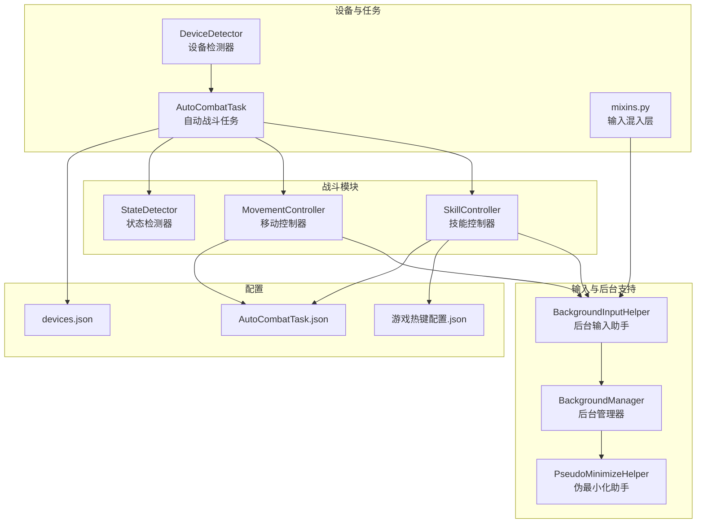
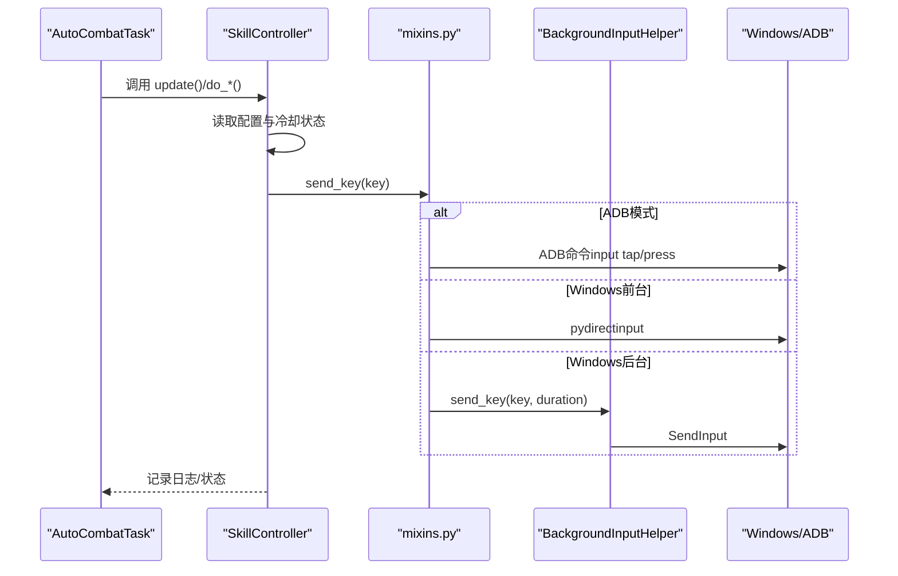
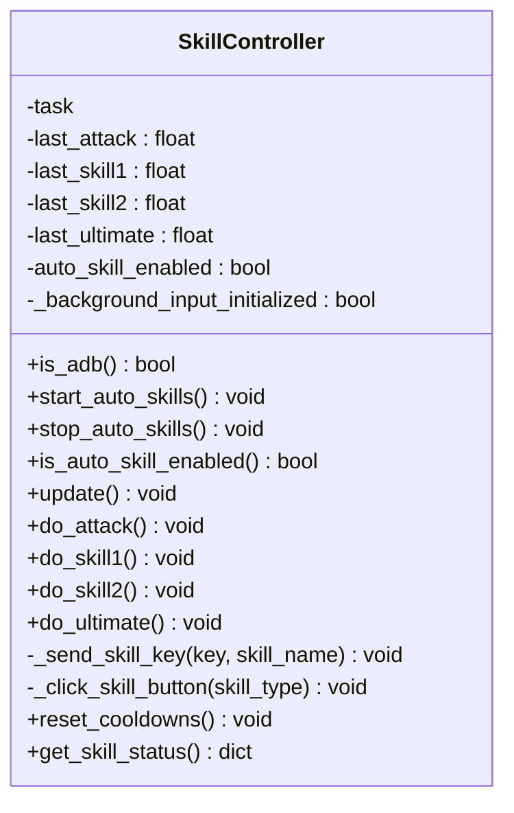
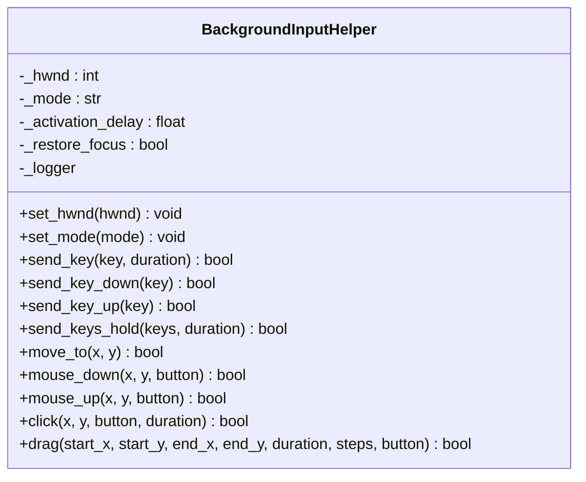
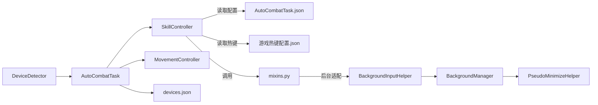

# 技能控制器

<cite>
**本文档引用的文件**
- [skill_controller.py](file://src/combat/skill_controller.py)
- [BackgroundInputHelper.py](file://src/utils/BackgroundInputHelper.py)
- [DeviceDetector.py](file://src/utils/DeviceDetector.py)
- [AutoCombatTask.py](file://src/task/AutoCombatTask.py)
- [BackgroundManager.py](file://src/utils/BackgroundManager.py)
- [PseudoMinimizeHelper.py](file://src/utils/PseudoMinimizeHelper.py)
- [movement_controller.py](file://src/combat/movement_controller.py)
- [mixins.py](file://src/task/mixins.py)
- [游戏热键配置.json](file://configs/游戏热键配置.json)
- [AutoCombatTask.json](file://configs/AutoCombatTask.json)
- [devices.json](file://configs/devices.json)
- [test_input.py](file://test_input.py)
</cite>

## 目录
1. [简介](#简介)
2. [项目结构](#项目结构)
3. [核心组件](#核心组件)
4. [架构总览](#架构总览)
5. [详细组件分析](#详细组件分析)
6. [依赖关系分析](#依赖关系分析)
7. [性能考虑](#性能考虑)
8. [故障排查指南](#故障排查指南)
9. [结论](#结论)
10. [附录](#附录)

## 简介
本文件为技能控制器的综合技术文档，面向希望理解并扩展自动战斗系统中“技能释放”能力的开发者与高级用户。内容涵盖：
- 键盘/鼠标输入控制机制与后台模式支持
- 输入模拟技术（SendInput、pydirectinput、ADB）
- 配置驱动的技能释放逻辑
- 技能冷却检测与优先级管理
- 多技能并发控制策略
- 与设备检测器的集成（PC版与Android模拟器）
- 技能配置格式、热键绑定机制与自定义扩展方法
- 实际使用示例与最佳实践

## 项目结构
技能控制器位于战斗模块，配合后台输入助手、设备检测器与任务调度器协同工作，形成“配置驱动 + 智能输入适配”的完整闭环。

图表来源
- [skill_controller.py:1-347](file://src/combat/skill_controller.py#L1-L347)
- [BackgroundInputHelper.py:1-841](file://src/utils/BackgroundInputHelper.py#L1-L841)
- [DeviceDetector.py:1-149](file://src/utils/DeviceDetector.py#L1-L149)
- [AutoCombatTask.py:1-693](file://src/task/AutoCombatTask.py#L1-L693)
- [BackgroundManager.py:1-155](file://src/utils/BackgroundManager.py#L1-L155)
- [PseudoMinimizeHelper.py:1-238](file://src/utils/PseudoMinimizeHelper.py#L1-L238)
- [movement_controller.py:1-435](file://src/combat/movement_controller.py#L1-L435)
- [mixins.py:381-647](file://src/task/mixins.py#L381-L647)
- [游戏热键配置.json:1-6](file://configs/游戏热键配置.json#L1-L6)
- [AutoCombatTask.json:1-13](file://configs/AutoCombatTask.json#L1-L13)
- [devices.json:1-7](file://configs/devices.json#L1-L7)

章节来源
- [skill_controller.py:1-347](file://src/combat/skill_controller.py#L1-L347)
- [AutoCombatTask.py:1-693](file://src/task/AutoCombatTask.py#L1-L693)

## 核心组件
- 技能控制器（SkillController）：负责根据配置与冷却状态释放技能，支持PC键盘与ADB点击两种模式。
- 后台输入助手（BackgroundInputHelper）：封装SendInput与pydirectinput，提供后台模式下的可靠输入。
- 后台管理器（BackgroundManager）：检测游戏是否在后台，决定是否启用伪最小化与后台输入。
- 设备检测器（DeviceDetector）：检测PC窗口与ADB设备连接状态，提供智能默认设备选择。
- 输入混入层（mixins.py）：统一send_key/send_key_down/up、swipe、input_text等操作的ADB/Windows适配。
- 配置系统：技能开关、间隔、热键映射、设备偏好等。

章节来源
- [skill_controller.py:24-347](file://src/combat/skill_controller.py#L24-L347)
- [BackgroundInputHelper.py:99-841](file://src/utils/BackgroundInputHelper.py#L99-L841)
- [BackgroundManager.py:7-155](file://src/utils/BackgroundManager.py#L7-L155)
- [DeviceDetector.py:11-149](file://src/utils/DeviceDetector.py#L11-L149)
- [mixins.py:381-647](file://src/task/mixins.py#L381-L647)

## 架构总览
技能控制器通过任务对象的统一入口进行按键/点击操作，内部根据设备类型与后台状态选择最优输入路径，并严格遵循配置驱动的开关与冷却策略。

图表来源
- [AutoCombatTask.py:136-160](file://src/task/AutoCombatTask.py#L136-L160)
- [skill_controller.py:114-138](file://src/combat/skill_controller.py#L114-L138)
- [mixins.py:425-446](file://src/task/mixins.py#L425-L446)
- [BackgroundInputHelper.py:310-356](file://src/utils/BackgroundInputHelper.py#L310-L356)

## 详细组件分析

### 技能控制器（SkillController）
职责与特性：
- 支持PC键盘与ADB点击两种模式，自动识别设备类型。
- 配置驱动：技能开关与间隔来自任务配置；按键映射来自全局热键配置。
- 冷却检测：每个技能维护独立的上次释放时间戳。
- 状态查询：提供技能状态字典，便于UI与日志展示。

关键实现要点：
- 模式检测：通过任务对象的ADB交互类型判断。
- 热键映射：GUI开关名称映射到热键配置键名，再回退到默认键。
- 输入适配：统一通过任务的send_key方法，内部由mixins层选择ADB或后台输入。
- 手机端点击：基于帧尺寸的比例定位，调用任务的click方法。

图表来源
- [skill_controller.py:24-347](file://src/combat/skill_controller.py#L24-L347)

章节来源
- [skill_controller.py:61-347](file://src/combat/skill_controller.py#L61-L347)

### 后台输入助手（BackgroundInputHelper）
职责与特性：
- 提供SendInput与pydirectinput两种路径，满足Unity等游戏的后台输入需求。
- 自动判断后台模式（伪最小化或窗口在后台），避免激活窗口带来的视觉干扰。
- 支持键盘与鼠标输入，提供单键、组合键、按住、拖拽等操作。

关键实现要点：
- 虚拟键码映射与INPUT结构体封装，确保SendInput调用正确。
- 前台/后台模式自动切换：后台模式下始终使用SendInput。
- 日志记录与错误处理，便于问题定位。

图表来源
- [BackgroundInputHelper.py:99-841](file://src/utils/BackgroundInputHelper.py#L99-L841)

章节来源
- [BackgroundInputHelper.py:1-841](file://src/utils/BackgroundInputHelper.py#L1-L841)

### 后台管理器（BackgroundManager）
职责与特性：
- 读取基本设置中的后台模式与伪最小化开关。
- 检测游戏窗口是否在后台，结合伪最小化助手决定是否需要后台输入。
- 提供状态查询与自动伪最小化功能。

关键实现要点：
- 缓存前台窗口检查结果，降低频繁查询开销。
- 与伪最小化助手联动，实现最小化时的可见性保障。

章节来源
- [BackgroundManager.py:1-155](file://src/utils/BackgroundManager.py#L1-L155)

### 伪最小化助手（PseudoMinimizeHelper）
职责与特性：
- 将窗口移动到屏幕外（-32000,-32000），保持前台状态，支持后台截图与输入。
- 提供状态查询与恢复原位的能力。

章节来源
- [PseudoMinimizeHelper.py:1-238](file://src/utils/PseudoMinimizeHelper.py#L1-L238)

### 设备检测器（DeviceDetector）
职责与特性：
- 检测PC游戏窗口是否存在，排除模拟器窗口与工具窗口。
- 检测ADB设备连接状态。
- 提供智能默认设备选择：仅PC运行时选PC，仅ADB连接时选ADB。

章节来源
- [DeviceDetector.py:1-149](file://src/utils/DeviceDetector.py#L1-L149)

### 输入混入层（mixins.py）
职责与特性：
- 统一封装send_key、send_key_down、send_key_up、swipe、input_text等操作。
- 根据是否ADB交互自动选择ADB命令或Windows本地输入。
- 在后台模式下自动初始化后台输入助手并使用SendInput。

章节来源
- [mixins.py:381-647](file://src/task/mixins.py#L381-L647)

## 依赖关系分析
技能控制器与各组件的耦合关系如下：

图表来源
- [skill_controller.py:152-184](file://src/combat/skill_controller.py#L152-L184)
- [mixins.py:425-446](file://src/task/mixins.py#L425-L446)
- [BackgroundInputHelper.py:310-356](file://src/utils/BackgroundInputHelper.py#L310-L356)
- [BackgroundManager.py:46-75](file://src/utils/BackgroundManager.py#L46-L75)
- [PseudoMinimizeHelper.py:103-104](file://src/utils/PseudoMinimizeHelper.py#L103-L104)
- [AutoCombatTask.py:136-160](file://src/task/AutoCombatTask.py#L136-L160)
- [DeviceDetector.py:112-134](file://src/utils/DeviceDetector.py#L112-L134)
- [devices.json:1-7](file://configs/devices.json#L1-L7)

章节来源
- [skill_controller.py:1-347](file://src/combat/skill_controller.py#L1-L347)
- [mixins.py:381-647](file://src/task/mixins.py#L381-L647)
- [BackgroundInputHelper.py:1-841](file://src/utils/BackgroundInputHelper.py#L1-L841)
- [BackgroundManager.py:1-155](file://src/utils/BackgroundManager.py#L1-L155)
- [PseudoMinimizeHelper.py:1-238](file://src/utils/PseudoMinimizeHelper.py#L1-L238)
- [AutoCombatTask.py:1-693](file://src/task/AutoCombatTask.py#L1-L693)
- [DeviceDetector.py:1-149](file://src/utils/DeviceDetector.py#L1-L149)
- [devices.json:1-7](file://configs/devices.json#L1-L7)

## 性能考虑
- 冷却检测采用轻量级时间戳比较，O(1)复杂度，适合高频调用。
- 后台输入路径在后台模式下避免窗口激活，减少系统交互开销。
- 配置读取与热键映射缓存于任务对象，避免重复解析。
- 建议：
  - 合理设置技能间隔，避免过高频率导致输入抖动。
  - 在ADB模式下尽量使用框架提供的ADB命令，减少本地模拟的不确定性。
  - 后台模式下避免频繁窗口切换，减少伪最小化/恢复的开销。

## 故障排查指南
常见问题与解决思路：
- 技能按键无效（Windows前台）：确认游戏窗口获得焦点，必要时使用后台输入助手。
- 技能按键无效（Windows后台）：检查后台模式与伪最小化状态，确保使用SendInput路径。
- ADB点击无效：确认ADB设备连接状态与模拟器窗口句柄，避免混用ADB与本地输入。
- 热键不生效：检查游戏热键配置文件与GUI开关映射，确保键名正确。
- 配置未生效：确认任务配置加载顺序与默认值回退逻辑。

章节来源
- [BackgroundInputHelper.py:310-356](file://src/utils/BackgroundInputHelper.py#L310-L356)
- [mixins.py:425-446](file://src/task/mixins.py#L425-L446)
- [DeviceDetector.py:70-111](file://src/utils/DeviceDetector.py#L70-L111)
- [test_input.py:1-58](file://test_input.py#L1-L58)

## 结论
技能控制器通过“配置驱动 + 智能输入适配”的设计，实现了跨平台（PC/ADB）的稳定技能释放。其冷却检测、优先级管理与并发控制策略清晰明确，配合后台输入助手与设备检测器，能够适应复杂的运行环境。建议在实际部署中结合具体游戏的输入机制与反作弊策略，合理调整配置参数与输入路径。

## 附录

### 技能配置格式说明
- 技能开关与间隔：来自任务配置文件，字段包括“自动普攻”、“自动技能1”、“自动技能2”、“自动大招”，以及对应的间隔字段。
- 热键映射：来自全局热键配置文件，键名为“普通攻击”、“技能1”、“技能2”、“大招”。

章节来源
- [AutoCombatTask.json:1-13](file://configs/AutoCombatTask.json#L1-L13)
- [游戏热键配置.json:1-6](file://configs/游戏热键配置.json#L1-L6)

### 热键绑定机制
- GUI开关名称映射到热键配置键名，再从全局配置读取按键字符，若缺失则回退到默认键。
- ADB模式下不使用热键映射，而是通过点击相对位置释放技能。

章节来源
- [skill_controller.py:46-59](file://src/combat/skill_controller.py#L46-L59)
- [skill_controller.py:167-184](file://src/combat/skill_controller.py#L167-L184)

### 多技能并发控制策略
- 并发策略：每个技能独立维护冷却时间戳，update循环按各自间隔触发，互不影响。
- 优先级管理：当前实现为“按配置启用即释放”，未实现技能优先级排序；如需优先级，请在任务层进行状态判断后再调用相应技能方法。

章节来源
- [skill_controller.py:211-250](file://src/combat/skill_controller.py#L211-L250)

### 与设备检测器的集成
- 设备选择：根据PC窗口与ADB设备连接状态，提供智能默认设备选择。
- 任务侧集成：任务在启动时初始化后台管理器与设备检测器，确保输入路径正确。

章节来源
- [DeviceDetector.py:112-134](file://src/utils/DeviceDetector.py#L112-L134)
- [AutoCombatTask.py:94-96](file://src/task/AutoCombatTask.py#L94-L96)

### 实际使用示例与最佳实践
- 示例：在AutoCombatTask中启动技能控制器并调用update，即可按配置自动释放技能。
- 最佳实践：
  - 合理设置技能间隔，避免过高频率。
  - 在ADB模式下优先使用框架的ADB命令，减少本地模拟的不确定性。
  - 后台模式下避免频繁窗口切换，减少伪最小化/恢复的开销。
  - 定期检查热键配置与GUI开关映射，确保一致性。

章节来源
- [AutoCombatTask.py:136-160](file://src/task/AutoCombatTask.py#L136-L160)
- [skill_controller.py:211-250](file://src/combat/skill_controller.py#L211-L250)