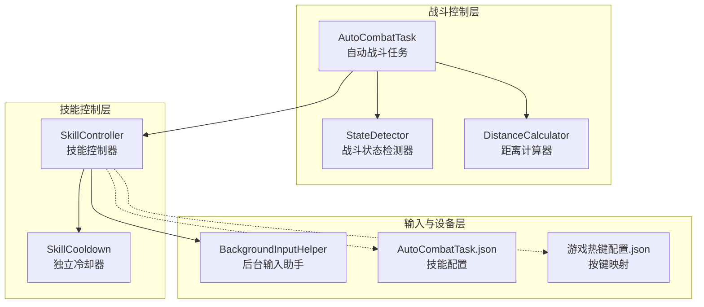
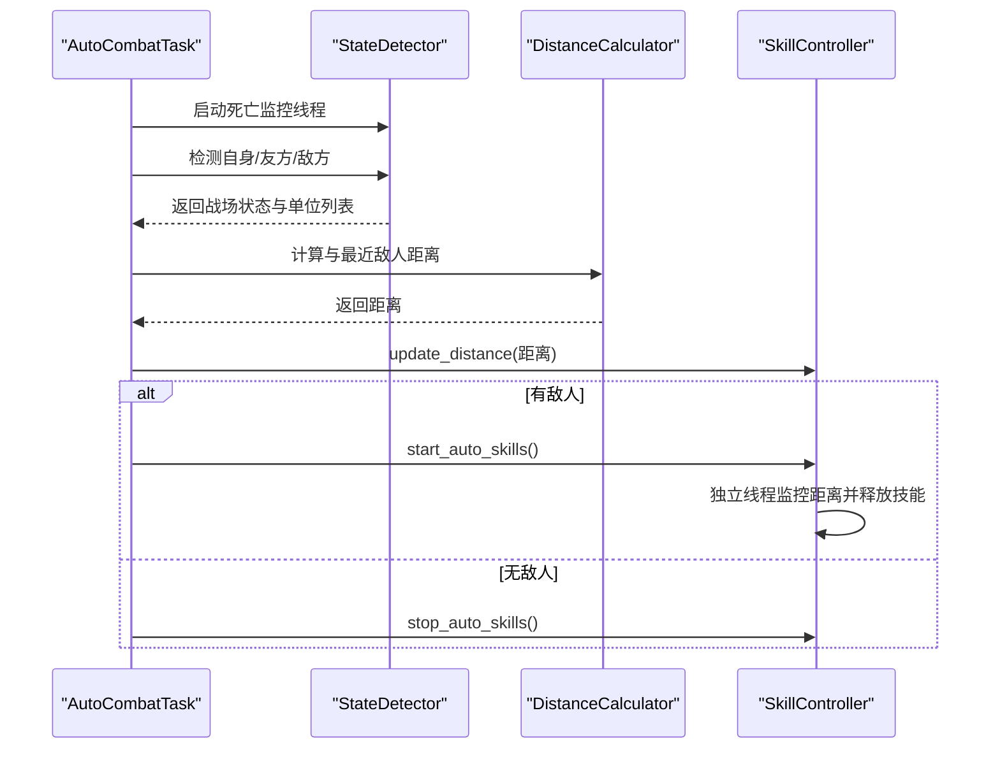
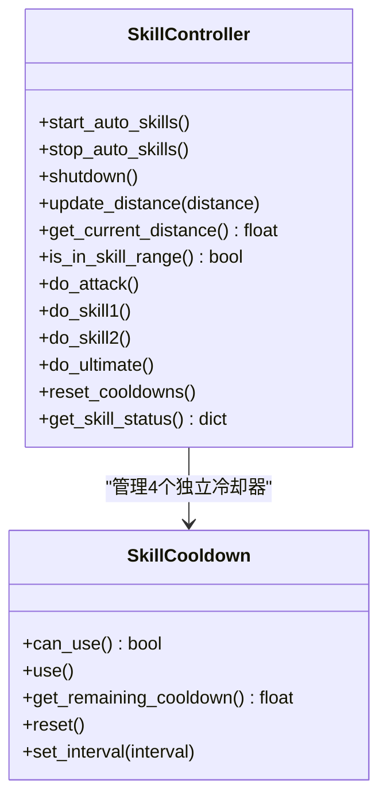
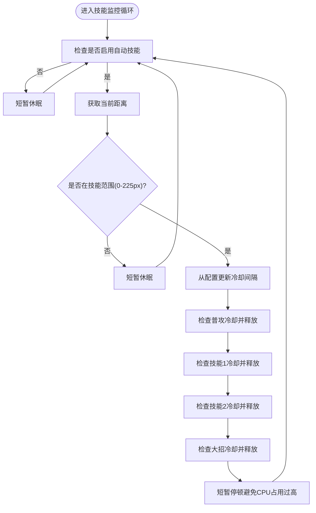
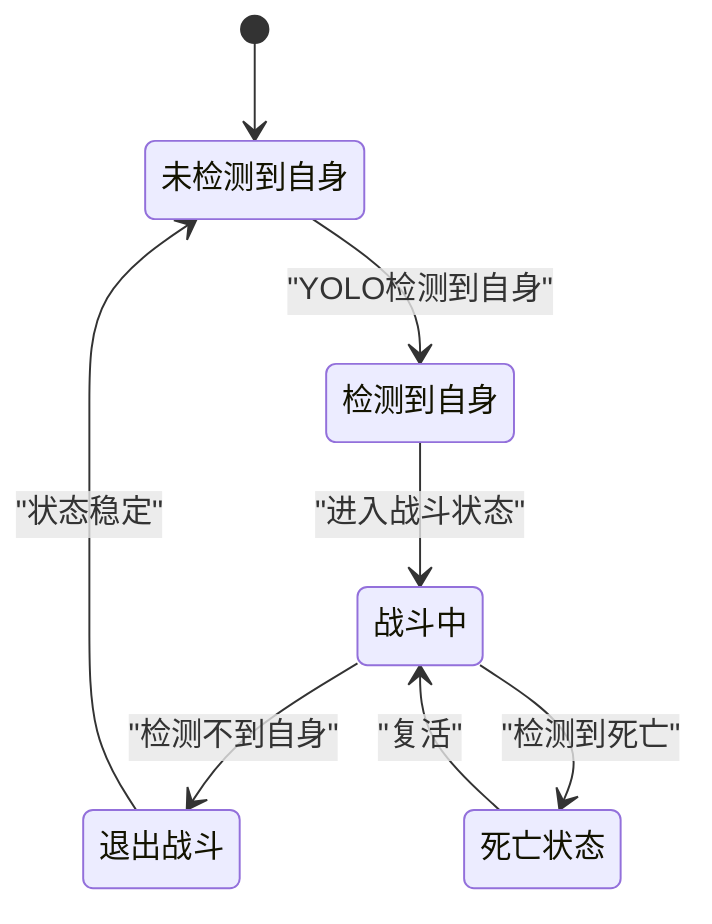
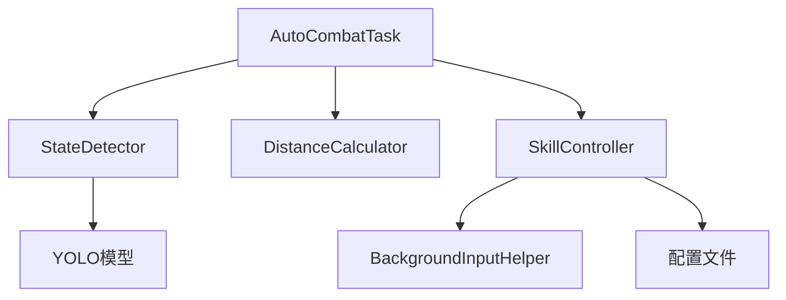

# 技能控制系统

<cite>
**本文档引用的文件**
- [skill_controller.py](file://src/combat/skill_controller.py)
- [state_detector.py](file://src/combat/state_detector.py)
- [AutoCombatTask.py](file://src/task/AutoCombatTask.py)
- [distance_calculator.py](file://src/combat/distance_calculator.py)
- [labels.py](file://src/combat/labels.py)
- [BackgroundInputHelper.py](file://src/utils/BackgroundInputHelper.py)
- [AutoCombatTask.json](file://configs/AutoCombatTask.json)
- [游戏热键配置.json](file://configs/游戏热键配置.json)
- [mixins.py](file://src/task/mixins.py)
</cite>

## 目录
1. [简介](#简介)
2. [项目结构](#项目结构)
3. [核心组件](#核心组件)
4. [架构总览](#架构总览)
5. [详细组件分析](#详细组件分析)
6. [依赖关系分析](#依赖关系分析)
7. [性能考虑](#性能考虑)
8. [故障排除指南](#故障排除指南)
9. [结论](#结论)
10. [附录](#附录)

## 简介
本文件面向 ok-jump 项目的技能控制系统，系统性阐述技能控制器的设计架构与实现原理，涵盖技能优先级管理、冷却时间检测、最优技能选择算法、触发条件与时机控制、连击技能处理、技能组合策略、目标锁定机制、技能控制与战斗状态检测的协同工作机制、技能配置参数说明、常见问题解决方案与性能优化建议。文档旨在帮助开发者与使用者全面理解并高效使用技能控制系统。

## 项目结构
技能控制系统位于 src/combat 目录，核心文件包括：
- 技能控制器：负责技能释放、冷却管理、按键/点击适配、后台输入支持
- 战斗状态检测器：基于 YOLO 的死亡状态、自身、友方、敌方检测与战斗状态判断
- 距离计算器：提供距离计算与最佳攻击范围判断
- AutoCombatTask：编排战斗流程，协调技能控制与状态检测
- 配置文件：技能开关、冷却间隔、按键映射等参数
- 工具类：后台输入助手、任务混入类等

图表来源
- [AutoCombatTask.py](file://src/task/AutoCombatTask.py)
- [state_detector.py](file://src/combat/state_detector.py)
- [distance_calculator.py](file://src/combat/distance_calculator.py)
- [skill_controller.py](file://src/combat/skill_controller.py)
- [BackgroundInputHelper.py](file://src/utils/BackgroundInputHelper.py)
- [AutoCombatTask.json](file://configs/AutoCombatTask.json)
- [游戏热键配置.json](file://configs/游戏热键配置.json)

章节来源
- [AutoCombatTask.py](file://src/task/AutoCombatTask.py)
- [skill_controller.py](file://src/combat/skill_controller.py)
- [state_detector.py](file://src/combat/state_detector.py)
- [distance_calculator.py](file://src/combat/distance_calculator.py)
- [BackgroundInputHelper.py](file://src/utils/BackgroundInputHelper.py)
- [AutoCombatTask.json](file://configs/AutoCombatTask.json)
- [游戏热键配置.json](file://configs/游戏热键配置.json)

## 核心组件
- 技能控制器（SkillController）
  - 支持 PC（键盘）与手机（ADB 点击）两种模式
  - 独立冷却器（SkillCooldown）：每个技能独立冷却，互不影响
  - 技能监控线程：独立线程持续监控距离并在范围内释放技能
  - 后台输入支持：通过后台输入助手实现 Unity 游戏后台按键发送
  - 技能范围：0-225px，按最近敌人或范围内最近敌人更新距离
- 战斗状态检测器（StateDetector）
  - 基于 YOLO 的死亡状态、自身、友方、敌方检测
  - 战斗状态判断：无单位、仅友方、仅敌方、混合
  - 并行死亡监控线程，快速响应死亡状态变化
- 距离计算器（DistanceCalculator）
  - 提供欧氏距离计算
  - 最佳攻击范围判断（含滞后效应与缓冲区）
  - 移动方向建议（靠近/远离/停止）
- AutoCombatTask
  - 编排战斗主循环，协调状态检测与技能控制
  - 根据战场状态与自身检测结果动态启停技能
  - 卡住/抖动检测与规避策略
- 配置系统
  - AutoCombatTask.json：技能开关、冷却间隔、移动持续时间
  - 游戏热键配置.json：按键映射（普通攻击、技能1、技能2、大招）

章节来源
- [skill_controller.py](file://src/combat/skill_controller.py)
- [state_detector.py](file://src/combat/state_detector.py)
- [distance_calculator.py](file://src/combat/distance_calculator.py)
- [AutoCombatTask.py](file://src/task/AutoCombatTask.py)
- [AutoCombatTask.json](file://configs/AutoCombatTask.json)
- [游戏热键配置.json](file://configs/游戏热键配置.json)

## 架构总览
技能控制系统采用“任务编排 + 状态检测 + 技能控制”的分层架构：
- 任务层：AutoCombatTask 负责整体流程控制与状态编排
- 检测层：StateDetector 提供实时战场状态与单位检测
- 控制层：SkillController 负责技能释放与冷却管理
- 工具层：BackgroundInputHelper 提供后台输入支持，配置文件提供参数驱动

图表来源
- [AutoCombatTask.py](file://src/task/AutoCombatTask.py)
- [state_detector.py](file://src/combat/state_detector.py)
- [distance_calculator.py](file://src/combat/distance_calculator.py)
- [skill_controller.py](file://src/combat/skill_controller.py)

## 详细组件分析

### 技能控制器（SkillController）
- 设计要点
  - 独立冷却器：每个技能维护独立冷却计时器，互不影响，提升并发释放能力
  - 技能监控线程：独立线程持续监控距离，满足范围内自动释放需求
  - 模式适配：PC（键盘）、手机（ADB 点击）与后台输入（SendInput）无缝切换
  - 配置驱动：技能开关、冷却间隔、按键映射均来自配置文件
- 关键流程
  - 启动/停止自动技能：start_auto_skills()/stop_auto_skills()
  - 距离更新：update_distance(distance)，用于技能范围判断
  - 技能释放：do_attack()/do_skill1()/do_skill2()/do_ultimate()
  - 冷却管理：SkillCooldown.can_use()/use()/get_remaining_cooldown()

图表来源
- [skill_controller.py](file://src/combat/skill_controller.py)

章节来源
- [skill_controller.py](file://src/combat/skill_controller.py)

### 冷却时间检测与最优技能选择算法
- 冷却时间检测
  - 每个技能独立冷却，通过 SkillCooldown 管理
  - can_use() 基于上次使用时间与冷却间隔判断
  - set_interval() 动态更新冷却间隔（从配置读取）
- 最优技能选择算法
  - 优先释放：在技能范围内时，按配置顺序依次尝试释放（普攻、技能1、技能2、大招）
  - 独立冷却：每个技能独立检查冷却，互不影响释放时机
  - 距离驱动：由 AutoCombatTask 提供距离，技能控制器据此判断是否在范围内

图表来源
- [skill_controller.py](file://src/combat/skill_controller.py)

章节来源
- [skill_controller.py](file://src/combat/skill_controller.py)

### 技能触发条件与时机控制
- 触发条件
  - AutoCombatTask 根据战场状态与自身检测结果决定是否启动技能
  - 有敌人时启动技能，无敌人时停止技能
  - 技能范围：0-225px；优先使用范围内最近敌人距离，否则使用最近敌人距离
- 时机控制
  - 技能监控线程以固定间隔轮询，避免阻塞主线程
  - 后台模式下使用 SendInput 发送按键，确保 Unity 游戏可接收
  - 手机端 ADB 模式下，优先点击技能按钮，失败时回退键盘按键

章节来源
- [AutoCombatTask.py](file://src/task/AutoCombatTask.py)
- [skill_controller.py](file://src/combat/skill_controller.py)
- [BackgroundInputHelper.py](file://src/utils/BackgroundInputHelper.py)

### 连击技能处理与技能组合策略
- 连击处理
  - 通过独立冷却器实现多技能并发释放，提升连击效率
  - 普攻优先级最高，随后依次为技能1、技能2、大招
- 组合策略
  - 由配置文件控制技能开关与冷却间隔，实现灵活的组合策略
  - 建议：将高伤害技能置于较低优先级，配合普攻维持连击节奏

章节来源
- [skill_controller.py](file://src/combat/skill_controller.py)
- [AutoCombatTask.json](file://configs/AutoCombatTask.json)

### 目标锁定机制
- 目标锁定
  - AutoCombatTask 检测所有敌人，计算与最近敌人距离
  - 若有敌人在技能范围内，优先使用范围内最近敌人距离
  - 记录最近敌人的位置，用于卡住/抖动检测与规避
- 距离计算
  - 使用 DistanceCalculator 提供欧氏距离
  - 距离范围：0-225px，超出范围停止技能释放

章节来源
- [AutoCombatTask.py](file://src/task/AutoCombatTask.py)
- [distance_calculator.py](file://src/combat/distance_calculator.py)

### 技能控制与战斗状态检测的协同工作机制
- 状态感知主循环
  - AutoCombatTask 通过 YOLO 自身检测判断战斗状态
  - 进入战斗：启动战斗线程，开始技能与移动控制
  - 退出战斗：停止技能与移动，清理资源
- 死亡状态检测
  - StateDetector 启动后台线程持续监控死亡状态
  - 检测到死亡：停止技能与移动，等待复活
- 战场状态判断
  - 无单位、仅友方、仅敌方、混合四种状态
  - 根据状态决定移动策略与技能释放策略

图表来源
- [state_detector.py](file://src/combat/state_detector.py)
- [AutoCombatTask.py](file://src/task/AutoCombatTask.py)

章节来源
- [state_detector.py](file://src/combat/state_detector.py)
- [AutoCombatTask.py](file://src/task/AutoCombatTask.py)

### 技能配置参数详解
- AutoCombatTask.json
  - 自动普攻/自动技能1/自动技能2/自动大招：技能开关
  - 普攻间隔(秒)/技能1间隔(秒)/技能2间隔(秒)/大招间隔(秒)：冷却间隔
  - 移动持续时间(秒)：每次移动按键持续时间
- 游戏热键配置.json
  - 普通攻击/技能1/技能2/大招：按键映射（默认 J/K/U/L）

章节来源
- [AutoCombatTask.json](file://configs/AutoCombatTask.json)
- [游戏热键配置.json](file://configs/游戏热键配置.json)
- [skill_controller.py](file://src/combat/skill_controller.py)

### 代码示例路径（实现方式与调用方法）
- 启动技能控制
  - [AutoCombatTask._init_controllers](file://src/task/AutoCombatTask.py)
  - [SkillController.start_auto_skills](file://src/combat/skill_controller.py)
- 停止技能控制
  - [SkillController.stop_auto_skills](file://src/combat/skill_controller.py)
- 更新距离
  - [AutoCombatTask._get_skill_distance](file://src/task/AutoCombatTask.py)
  - [SkillController.update_distance](file://src/combat/skill_controller.py)
- 技能释放
  - [SkillController.do_attack/do_skill1/do_skill2/do_ultimate](file://src/combat/skill_controller.py)
- 冷却管理
  - [SkillCooldown.can_use/use/get_remaining_cooldown](file://src/combat/skill_controller.py)
- 后台输入
  - [BackgroundInputHelper.send_key/click](file://src/utils/BackgroundInputHelper.py)

章节来源
- [AutoCombatTask.py](file://src/task/AutoCombatTask.py)
- [skill_controller.py](file://src/combat/skill_controller.py)
- [BackgroundInputHelper.py](file://src/utils/BackgroundInputHelper.py)

## 依赖关系分析
- 组件耦合
  - AutoCombatTask 依赖 StateDetector、DistanceCalculator、SkillController
  - SkillController 依赖 BackgroundInputHelper 与配置文件
  - StateDetector 依赖 YOLO 检测与标签定义
- 外部依赖
  - YOLO 模型：用于自身、友方、敌方、死亡状态检测
  - Windows API：SendInput 用于后台按键发送
  - ADB：手机端滑动与点击

图表来源
- [AutoCombatTask.py](file://src/task/AutoCombatTask.py)
- [state_detector.py](file://src/combat/state_detector.py)
- [skill_controller.py](file://src/combat/skill_controller.py)
- [BackgroundInputHelper.py](file://src/utils/BackgroundInputHelper.py)

章节来源
- [AutoCombatTask.py](file://src/task/AutoCombatTask.py)
- [state_detector.py](file://src/combat/state_detector.py)
- [skill_controller.py](file://src/combat/skill_controller.py)
- [BackgroundInputHelper.py](file://src/utils/BackgroundInputHelper.py)

## 性能考虑
- 线程与轮询
  - 技能监控线程以短周期轮询，避免阻塞主线程
  - 通过短暂休眠平衡 CPU 占用与响应速度
- 后台输入优化
  - 后台模式使用 SendInput，避免窗口激活带来的额外开销
  - 伪最小化与后台模式自动切换，提升稳定性
- 检测频率与阈值
  - StateDetector 的死亡监控线程采用高频检测（30ms），快速响应状态变化
  - 战斗状态判断采用防抖动机制，避免频繁切换
- 距离计算与范围判断
  - 使用滞后效应与缓冲区，减少边界抖动导致的频繁状态切换

[本节为通用性能讨论，不直接分析具体文件]

## 故障排除指南
- 技能未释放
  - 检查技能开关与冷却间隔配置
  - 确认 AutoCombatTask 是否在有敌人时启动技能
  - 查看技能状态日志：[SkillController.get_skill_status](file://src/combat/skill_controller.py)
- 后台按键无效
  - 确认后台输入助手已初始化并设置窗口句柄
  - 检查后台模式与伪最小化状态
  - 参考：[BackgroundInputHelper.set_hwnd](file://src/utils/BackgroundInputHelper.py)
- 手机端点击失败
  - ADB 模式下点击失败会回退到键盘按键
  - 检查帧尺寸与技能按钮相对坐标
  - 参考：[SkillController._click_skill_button](file://src/combat/skill_controller.py)
- 死亡状态未检测
  - 确认死亡监控线程已启动
  - 检查 YOLO 模型与标签定义
  - 参考：[StateDetector.start_death_monitor](file://src/combat/state_detector.py)、[labels.py](file://src/combat/labels.py)
- 战斗状态不稳定
  - 检查防抖动阈值与连续检测次数
  - 参考：[StateDetector.check_combat_state_by_self_detection](file://src/combat/state_detector.py)

章节来源
- [skill_controller.py](file://src/combat/skill_controller.py)
- [BackgroundInputHelper.py](file://src/utils/BackgroundInputHelper.py)
- [state_detector.py](file://src/combat/state_detector.py)
- [labels.py](file://src/combat/labels.py)

## 结论
技能控制系统通过“任务编排 + 状态检测 + 技能控制 + 后台输入”的分层设计，实现了在不同平台与模式下的稳定技能释放。其核心优势在于：
- 独立冷却与并发释放，提升连击效率
- 基于配置的灵活策略与后台输入支持
- 与战斗状态检测的紧密协同，动态调整技能使用策略
- 良好的容错与回退机制（ADB 点击失败回退键盘按键）

建议在实际使用中结合 AutoCombatTask.json 与游戏热键配置.json 进行参数调优，并关注后台模式与分辨率适配，以获得最佳体验。

[本节为总结性内容，不直接分析具体文件]

## 附录

### 技能配置参数对照表
- AutoCombatTask.json
  - 自动普攻：技能开关
  - 自动技能1/技能2/自动大招：技能开关
  - 普攻间隔(秒)/技能1间隔(秒)/技能2间隔(秒)/大招间隔(秒)：冷却间隔
  - 移动持续时间(秒)：每次移动按键持续时间
- 游戏热键配置.json
  - 普通攻击/技能1/技能2/大招：按键映射

章节来源
- [AutoCombatTask.json](file://configs/AutoCombatTask.json)
- [游戏热键配置.json](file://configs/游戏热键配置.json)