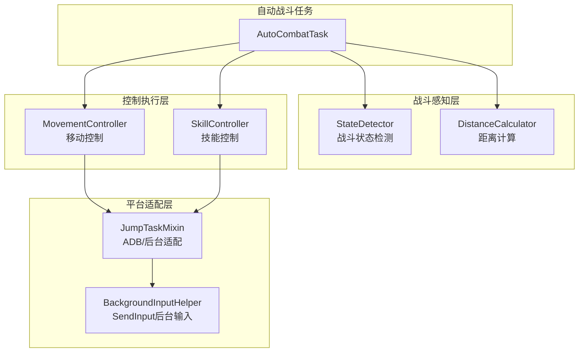
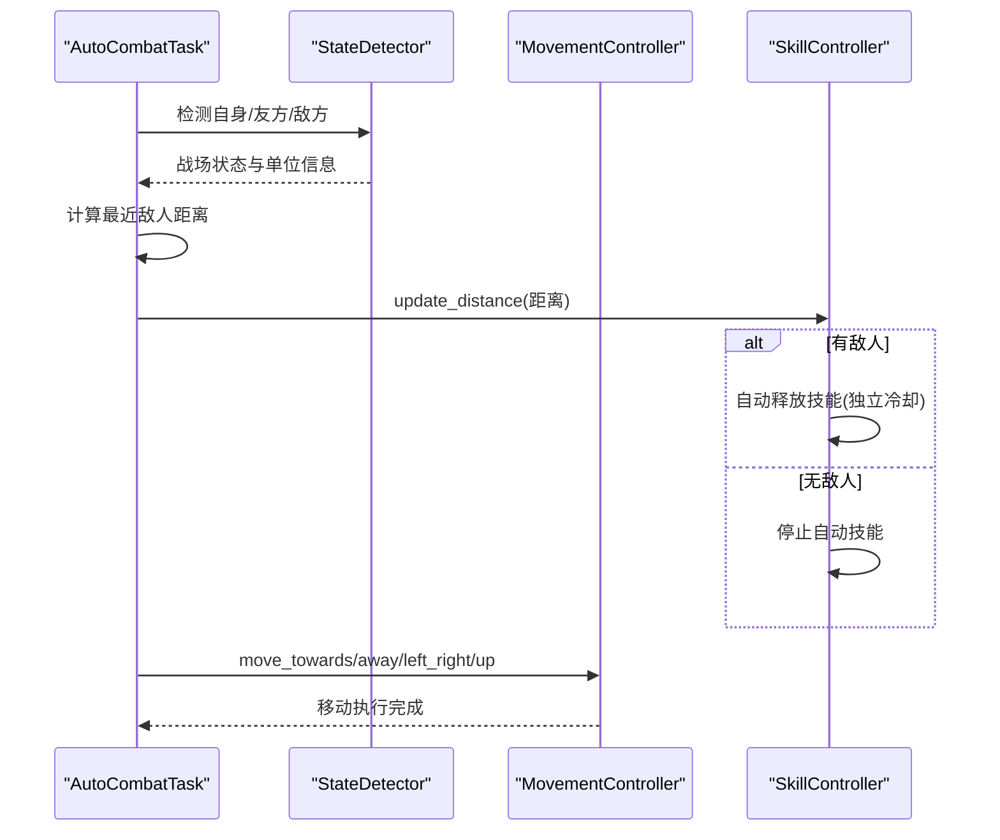
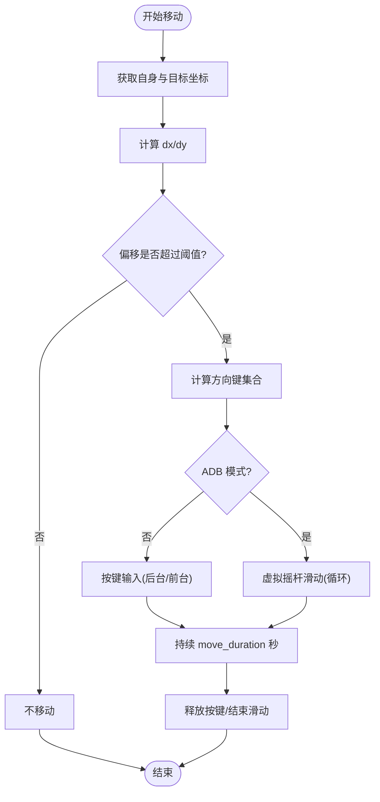
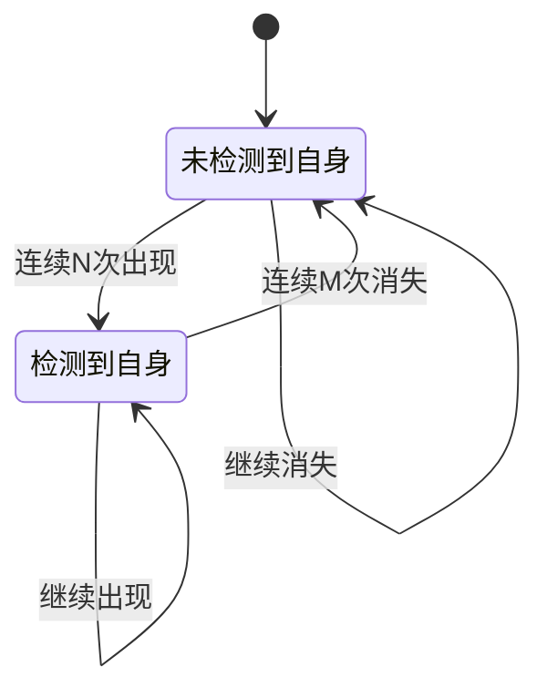
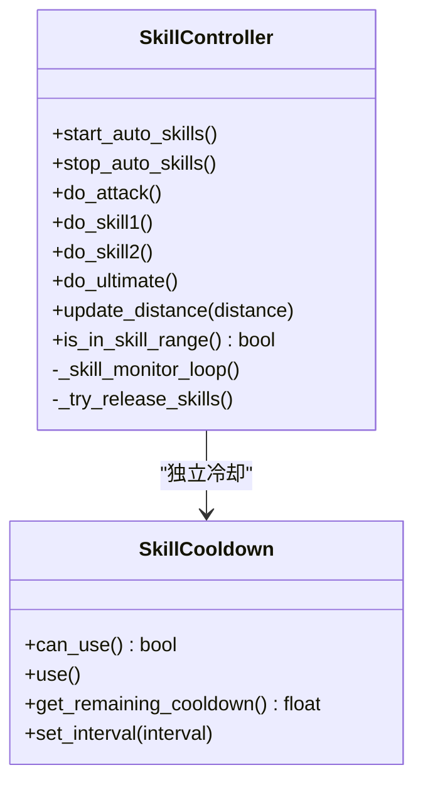
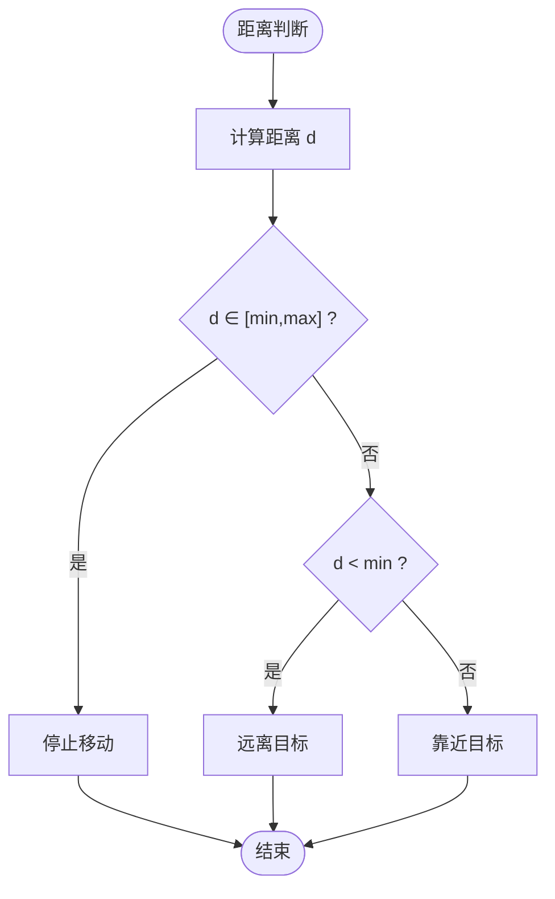
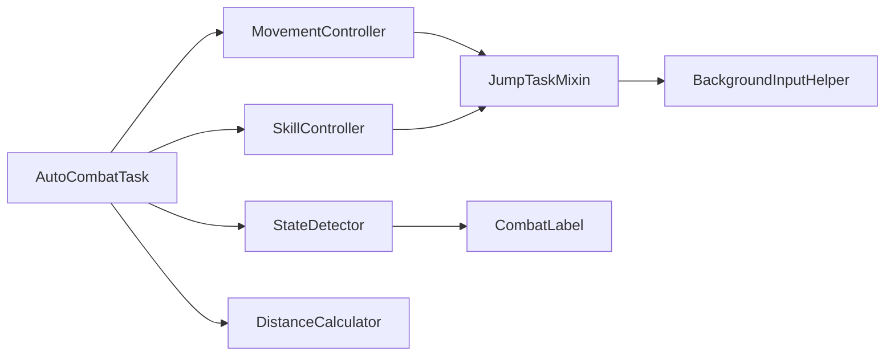

# 移动控制系统

<cite>
**本文档引用的文件**
- [movement_controller.py](file://src/combat/movement_controller.py)
- [state_detector.py](file://src/combat/state_detector.py)
- [skill_controller.py](file://src/combat/skill_controller.py)
- [distance_calculator.py](file://src/combat/distance_calculator.py)
- [AutoCombatTask.py](file://src/task/AutoCombatTask.py)
- [mixins.py](file://src/task/mixins.py)
- [BackgroundInputHelper.py](file://src/utils/BackgroundInputHelper.py)
- [labels.py](file://src/combat/labels.py)
- [AutoCombatTask.json](file://configs/AutoCombatTask.json)
</cite>

## 目录
1. [简介](#简介)
2. [项目结构](#项目结构)
3. [核心组件](#核心组件)
4. [架构总览](#架构总览)
5. [详细组件分析](#详细组件分析)
6. [依赖关系分析](#依赖关系分析)
7. [性能考量](#性能考量)
8. [故障排查指南](#故障排查指南)
9. [结论](#结论)
10. [附录](#附录)

## 简介
本文件面向 ok-jump 项目的移动控制系统，系统性阐述移动控制算法的设计思路与实现机制，覆盖路径规划、障碍物避让、最佳攻击位置选择等能力；解释移动控制与战斗状态检测的集成方式，说明如何基于战场态势动态调整移动策略；梳理坐标转换、距离计算、移动轨迹预测等关键技术点；给出参数配置与调优方法，并提供可定位到源码的示例路径，帮助开发者快速理解与扩展。

## 项目结构
移动控制系统位于 src/combat 目录，围绕 AutoCombatTask 任务调度，结合状态检测、技能控制与距离计算，形成“检测-决策-执行”的闭环。关键文件与职责如下：
- movement_controller.py：移动控制器，负责 WASD 键盘与虚拟摇杆的移动控制，支持后台模式与 ADB 模式
- state_detector.py：战斗状态检测器，基于 YOLO 检测自身、友方、敌方与死亡状态
- skill_controller.py：技能控制器，基于距离阈值自动释放技能，支持后台模式
- distance_calculator.py：距离计算器，提供距离计算与最佳攻击范围判断
- AutoCombatTask.py：自动战斗任务，编排状态检测、移动控制与技能释放
- mixins.py：任务混入类，提供后台模式、ADB 检测、坐标缩放、按键与滑动适配等通用能力
- BackgroundInputHelper.py：后台输入助手，为 Unity 游戏提供可靠的 SendInput 后台按键支持
- labels.py：YOLO 标签定义，统一战场单位识别标签
- AutoCombatTask.json：自动战斗配置，包含移动持续时间、技能间隔等参数

**图表来源**
- [AutoCombatTask.py:143-289](file://src/task/AutoCombatTask.py#L143-L289)
- [movement_controller.py:24-61](file://src/combat/movement_controller.py#L24-L61)
- [state_detector.py:24-63](file://src/combat/state_detector.py#L24-L63)
- [skill_controller.py:82-149](file://src/combat/skill_controller.py#L82-L149)
- [distance_calculator.py:14-51](file://src/combat/distance_calculator.py#L14-L51)
- [mixins.py:445-544](file://src/task/mixins.py#L445-L544)
- [BackgroundInputHelper.py:99-147](file://src/utils/BackgroundInputHelper.py#L99-L147)

**章节来源**
- [AutoCombatTask.py:143-289](file://src/task/AutoCombatTask.py#L143-L289)
- [movement_controller.py:24-61](file://src/combat/movement_controller.py#L24-L61)
- [state_detector.py:24-63](file://src/combat/state_detector.py#L24-L63)
- [skill_controller.py:82-149](file://src/combat/skill_controller.py#L82-L149)
- [distance_calculator.py:14-51](file://src/combat/distance_calculator.py#L14-L51)
- [mixins.py:445-544](file://src/task/mixins.py#L445-L544)
- [BackgroundInputHelper.py:99-147](file://src/utils/BackgroundInputHelper.py#L99-L147)

## 核心组件
- 移动控制器（MovementController）
  - 支持 PC 端 WASD 键盘与手机端虚拟摇杆
  - 后台模式使用 SendInput，前台模式使用 pydirectinput
  - 提供向目标移动、远离目标、左右移动、向上移动与停止等动作
  - 支持可中断移动与按方向键持续时间控制
- 战斗状态检测器（StateDetector）
  - 基于 YOLO 检测自身、友方、敌方与死亡状态
  - 提供并行死亡监控线程与战斗状态（进入/退出）的防抖动机制
- 技能控制器（SkillController）
  - 基于距离阈值自动释放技能，每个技能独立冷却
  - 支持后台模式与 ADB 模式
- 距离计算器（DistanceCalculator）
  - 提供两点间距离计算与最佳攻击范围判断
  - 使用滞后效应避免边界抖动，支持移动方向建议与单位向量

**章节来源**
- [movement_controller.py:24-61](file://src/combat/movement_controller.py#L24-L61)
- [state_detector.py:24-63](file://src/combat/state_detector.py#L24-L63)
- [skill_controller.py:82-149](file://src/combat/skill_controller.py#L82-L149)
- [distance_calculator.py:14-51](file://src/combat/distance_calculator.py#L14-L51)

## 架构总览
移动控制系统与战斗状态检测的集成采用“状态感知 + 任务编排”的方式：
- AutoCombatTask 根据配置选择测试模式或状态感知模式
- 状态感知模式下，通过 StateDetector 的自身检测判断战斗状态，进入战斗后启动独立战斗线程
- 战斗线程周期性检测自身、友方、敌方，计算最近敌人距离，驱动 SkillController 与 MovementController
- MovementController 根据战场态势与距离阈值选择移动方向与持续时间

**图表来源**
- [AutoCombatTask.py:561-648](file://src/task/AutoCombatTask.py#L561-L648)
- [state_detector.py:394-447](file://src/combat/state_detector.py#L394-L447)
- [distance_calculator.py:740-781](file://src/combat/distance_calculator.py#L740-L781)
- [movement_controller.py:106-164](file://src/combat/movement_controller.py#L106-L164)
- [skill_controller.py:254-277](file://src/combat/skill_controller.py#L254-L277)

## 详细组件分析

### 移动控制器（MovementController）
- 功能要点
  - PC 端：根据目标与自身位置计算 dx/dy，映射为 WASD 键，支持八方向移动
  - 手机端：虚拟摇杆全速移动，基于屏幕中心与半径计算滑动方向
  - 后台模式：通过 BackgroundInputHelper 使用 SendInput 发送按键，避免窗口前置
  - 可中断移动：在移动过程中定期回调检测是否应停止
- 关键算法
  - 方向计算：阈值过滤微小偏移，避免无效移动
  - 虚拟摇杆：方向向量归一化后乘以半径，实现全速移动
- 参数与配置
  - move_duration：每次移动按键持续时间，影响移动距离
  - ADB 模式：使用 swipe 循环实现连续移动
  - 分辨率适配：摇杆中心与半径随分辨率缩放

**图表来源**
- [movement_controller.py:168-355](file://src/combat/movement_controller.py#L168-L355)
- [movement_controller.py:461-511](file://src/combat/movement_controller.py#L461-L511)
- [movement_controller.py:561-610](file://src/combat/movement_controller.py#L561-L610)

**章节来源**
- [movement_controller.py:106-164](file://src/combat/movement_controller.py#L106-L164)
- [movement_controller.py:168-355](file://src/combat/movement_controller.py#L168-L355)
- [movement_controller.py:461-511](file://src/combat/movement_controller.py#L461-L511)
- [movement_controller.py:561-610](file://src/combat/movement_controller.py#L561-L610)

### 战斗状态检测器（StateDetector）
- 功能要点
  - 并行死亡监控：独立线程高频检测死亡状态，避免误判
  - 自身检测：YOLO 检测自身位置，支持超时与详细日志
  - 战斗状态：通过自身检测结果的连续性判断进入/退出战斗
  - 单次/批量检测：支持单次检测与同步检测
- 防抖动机制
  - 连续 N 次检测到自身/未检测到自身才确认状态变化
  - 降低误触发概率，提升稳定性

**图表来源**
- [state_detector.py:509-553](file://src/combat/state_detector.py#L509-L553)

**章节来源**
- [state_detector.py:83-195](file://src/combat/state_detector.py#L83-L195)
- [state_detector.py:243-323](file://src/combat/state_detector.py#L243-L323)
- [state_detector.py:509-553](file://src/combat/state_detector.py#L509-L553)

### 技能控制器（SkillController）
- 功能要点
  - 基于距离阈值（0-225px）自动释放技能，每个技能独立冷却
  - 独立监控线程持续检查距离并在范围内释放
  - 支持 ADB 模式下的点击与键盘按键双重方案
- 配置来源
  - AutoCombatTask.json：技能开关与间隔
  - 游戏热键配置：按键映射

**图表来源**
- [skill_controller.py:82-149](file://src/combat/skill_controller.py#L82-L149)
- [skill_controller.py:279-321](file://src/combat/skill_controller.py#L279-L321)

**章节来源**
- [skill_controller.py:226-252](file://src/combat/skill_controller.py#L226-L252)
- [skill_controller.py:279-321](file://src/combat/skill_controller.py#L279-L321)
- [skill_controller.py:463-507](file://src/combat/skill_controller.py#L463-L507)

### 距离计算器（DistanceCalculator）
- 功能要点
  - 两点间欧氏距离计算
  - 最佳攻击范围判断（0-225px），带滞后效应避免边界抖动
  - 移动方向建议：靠近/远离/停止
  - 单位向量：获取从自身到目标的单位向量与反向向量
- 参数
  - MIN_DISTANCE/MAX_DISTANCE：最佳攻击距离范围
  - BUFFER：边界缓冲区，防止频繁切换

**图表来源**
- [distance_calculator.py:84-118](file://src/combat/distance_calculator.py#L84-L118)
- [distance_calculator.py:120-158](file://src/combat/distance_calculator.py#L120-L158)

**章节来源**
- [distance_calculator.py:52-82](file://src/combat/distance_calculator.py#L52-L82)
- [distance_calculator.py:84-118](file://src/combat/distance_calculator.py#L84-L118)
- [distance_calculator.py:120-158](file://src/combat/distance_calculator.py#L120-L158)

### AutoCombatTask 任务编排
- 功能要点
  - 测试模式：跳过场景检测，直接进入战斗循环
  - 状态感知模式：通过自身检测动态启停战斗，独立线程执行
  - 战场状态处理：无单位、仅友方、仅敌方、混合四种情况
  - 距离驱动：检测所有敌人，优先返回在技能范围内的最近距离
- 关键流程
  - 死亡状态检测（并行）→ 自身检测 → 战场状态判断 → 距离更新 → 技能/移动控制

**章节来源**
- [AutoCombatTask.py:199-263](file://src/task/AutoCombatTask.py#L199-L263)
- [AutoCombatTask.py:357-451](file://src/task/AutoCombatTask.py#L357-L451)
- [AutoCombatTask.py:452-516](file://src/task/AutoCombatTask.py#L452-L516)
- [AutoCombatTask.py:561-648](file://src/task/AutoCombatTask.py#L561-L648)
- [AutoCombatTask.py:690-781](file://src/task/AutoCombatTask.py#L690-L781)

### 平台适配与后台输入
- ADB 检测：JumpTaskMixin.is_adb() 统一检测当前交互模式
- 后台输入：BackgroundInputHelper 使用 SendInput 在后台发送按键，避免窗口前置
- 坐标缩放：JumpTaskMixin 提供分辨率适配与缩放工具

**章节来源**
- [mixins.py:445-454](file://src/task/mixins.py#L445-L454)
- [mixins.py:521-544](file://src/task/mixins.py#L521-L544)
- [BackgroundInputHelper.py:199-206](file://src/utils/BackgroundInputHelper.py#L199-L206)
- [BackgroundInputHelper.py:310-356](file://src/utils/BackgroundInputHelper.py#L310-L356)

## 依赖关系分析
- AutoCombatTask 依赖 StateDetector、MovementController、SkillController、DistanceCalculator
- MovementController 与 SkillController 依赖 JumpTaskMixin 与 BackgroundInputHelper
- StateDetector 依赖 YOLO 检测与 CombatLabel 标签定义
- 配置来源：AutoCombatTask.json 与游戏热键配置

**图表来源**
- [AutoCombatTask.py:24-30](file://src/task/AutoCombatTask.py#L24-L30)
- [movement_controller.py:17-18](file://src/combat/movement_controller.py#L17-L18)
- [skill_controller.py:22-23](file://src/combat/skill_controller.py#L22-L23)
- [state_detector.py:13-13](file://src/combat/state_detector.py#L13-L13)
- [labels.py:8-37](file://src/combat/labels.py#L8-L37)

**章节来源**
- [AutoCombatTask.py:24-30](file://src/task/AutoCombatTask.py#L24-L30)
- [movement_controller.py:17-18](file://src/combat/movement_controller.py#L17-L18)
- [skill_controller.py:22-23](file://src/combat/skill_controller.py#L22-L23)
- [state_detector.py:13-13](file://src/combat/state_detector.py#L13-L13)
- [labels.py:8-37](file://src/combat/labels.py#L8-L37)

## 性能考量
- 检测频率与线程
  - StateDetector 的死亡监控线程以高频（~30ms）检测，避免误判
  - AutoCombatTask 的战斗线程以短间隔（~0.05s）轮询，兼顾实时性与性能
- 距离计算与阈值
  - 使用滞后效应减少边界抖动，降低不必要的移动与技能切换
  - 技能范围扩大至 225px，提升命中率与连招效率
- 后台输入优化
  - 后台模式使用 SendInput，避免窗口激活带来的额外开销
  - ADB 模式使用 swipe 循环，模拟连续移动，减少按键抖动
- 分辨率适配
  - 虚拟摇杆中心与半径按分辨率缩放，保证不同设备一致性

[本节为通用指导，无需特定文件引用]

## 故障排查指南
- 自身检测失败
  - 现象：15 秒内未检测到自身，可能误判为战斗结束
  - 排查：检查 YOLO 模型加载、帧获取与分辨率适配
  - 参考路径：[自身检测方法:243-323](file://src/combat/state_detector.py#L243-L323)
- 死亡状态误判
  - 现象：频繁进入/退出战斗
  - 排查：检查死亡监控线程与连续阈值配置
  - 参考路径：[死亡监控线程:129-195](file://src/combat/state_detector.py#L129-L195)
- 移动无效或抖动
  - 现象：移动按键无效或频繁切换方向
  - 排查：检查 move_duration、阈值与后台输入模式
  - 参考路径：[方向计算与按键发送:255-355](file://src/combat/movement_controller.py#L255-L355)
- 技能不释放或释放过快
  - 现象：技能冷却异常或释放过于频繁
  - 排查：检查技能间隔配置与独立冷却器状态
  - 参考路径：[技能冷却与监控:279-370](file://src/combat/skill_controller.py#L279-L370)
- ADB 模式滑动异常
  - 现象：虚拟摇杆滑动无效
  - 排查：检查分辨率缩放与 swipe 循环参数
  - 参考路径：[ADB 滑动实现:461-511](file://src/combat/movement_controller.py#L461-L511)

**章节来源**
- [state_detector.py:129-195](file://src/combat/state_detector.py#L129-L195)
- [state_detector.py:243-323](file://src/combat/state_detector.py#L243-L323)
- [movement_controller.py:255-355](file://src/combat/movement_controller.py#L255-L355)
- [skill_controller.py:279-370](file://src/combat/skill_controller.py#L279-L370)
- [movement_controller.py:461-511](file://src/combat/movement_controller.py#L461-L511)

## 结论
ok-jump 的移动控制系统通过“状态感知 + 任务编排 + 距离驱动”的架构，实现了在复杂战场态势下的智能移动与技能释放。系统在后台模式与 ADB 模式下均具备稳定表现，配合滞后效应与防抖动机制，显著提升了移动与战斗的可靠性。通过合理的参数配置与调优，可在不同分辨率与设备环境下获得一致的体验。

[本节为总结性内容，无需特定文件引用]

## 附录

### 参数配置与调优
- AutoCombatTask.json 关键项
  - 移动持续时间(秒)：控制每次移动按键持续时间，值越大移动距离越长
  - 技能间隔(秒)：各技能独立冷却间隔，影响连招节奏
  - 详细日志：输出 YOLO 检测、位置与距离等信息，便于调试
- 距离与移动参数
  - 最佳攻击距离范围：0-225px，建议根据角色与技能特性调整
  - 边界缓冲区：15px，避免边界抖动
  - 移动阈值：30px，过滤微小偏移
- 示例路径（不展示代码，仅提供定位）
  - [移动持续时间配置](file://configs/AutoCombatTask.json#L13)
  - [技能间隔配置:9-12](file://configs/AutoCombatTask.json#L9-L12)
  - [移动阈值与方向计算:275-304](file://src/combat/movement_controller.py#L275-L304)
  - [最佳攻击范围与缓冲区:29-34](file://src/combat/distance_calculator.py#L29-L34)

**章节来源**
- [AutoCombatTask.json:1-14](file://configs/AutoCombatTask.json#L1-L14)
- [distance_calculator.py:29-34](file://src/combat/distance_calculator.py#L29-L34)
- [movement_controller.py:275-304](file://src/combat/movement_controller.py#L275-L304)