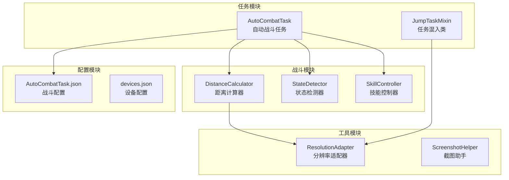
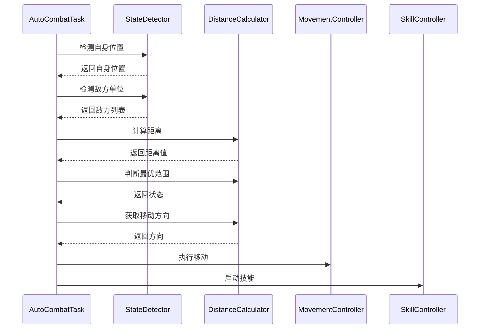
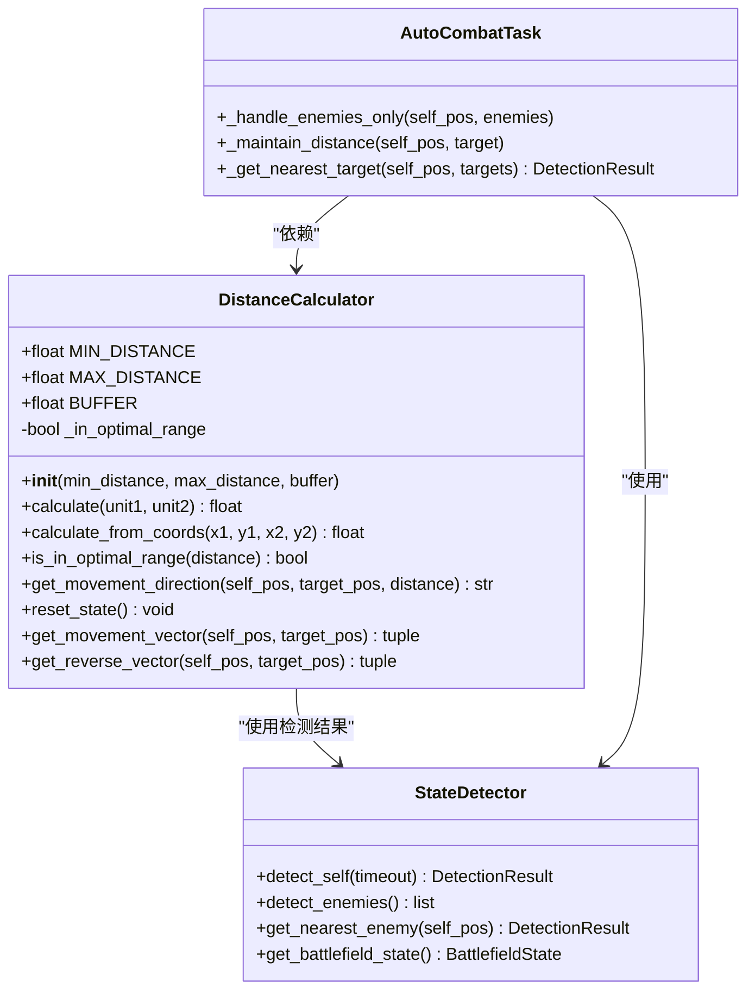
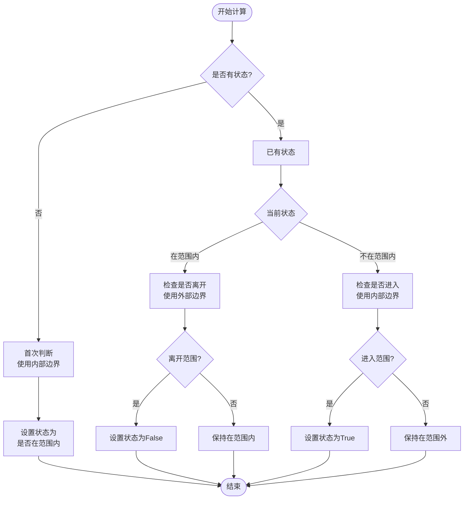
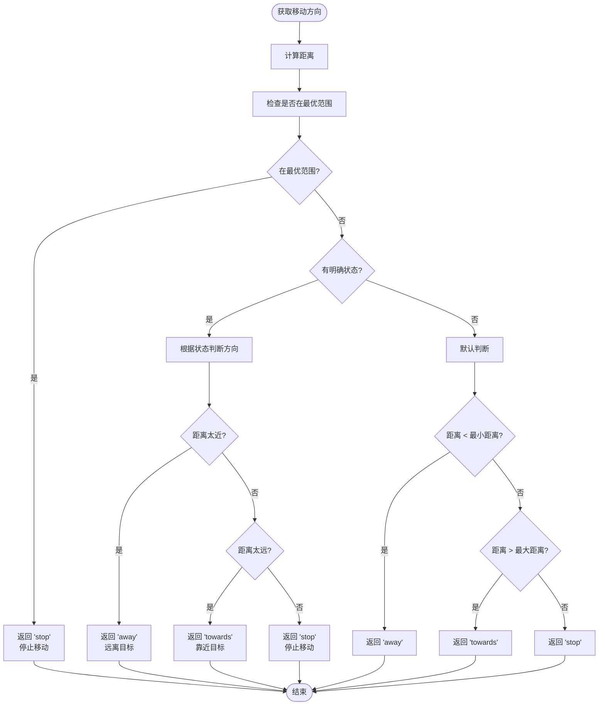
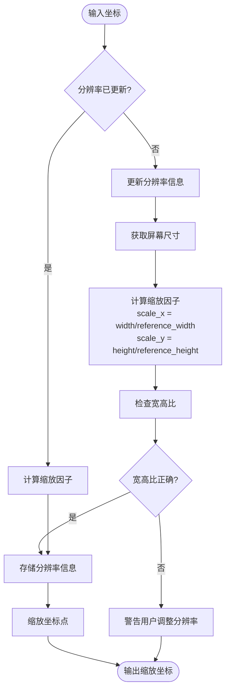
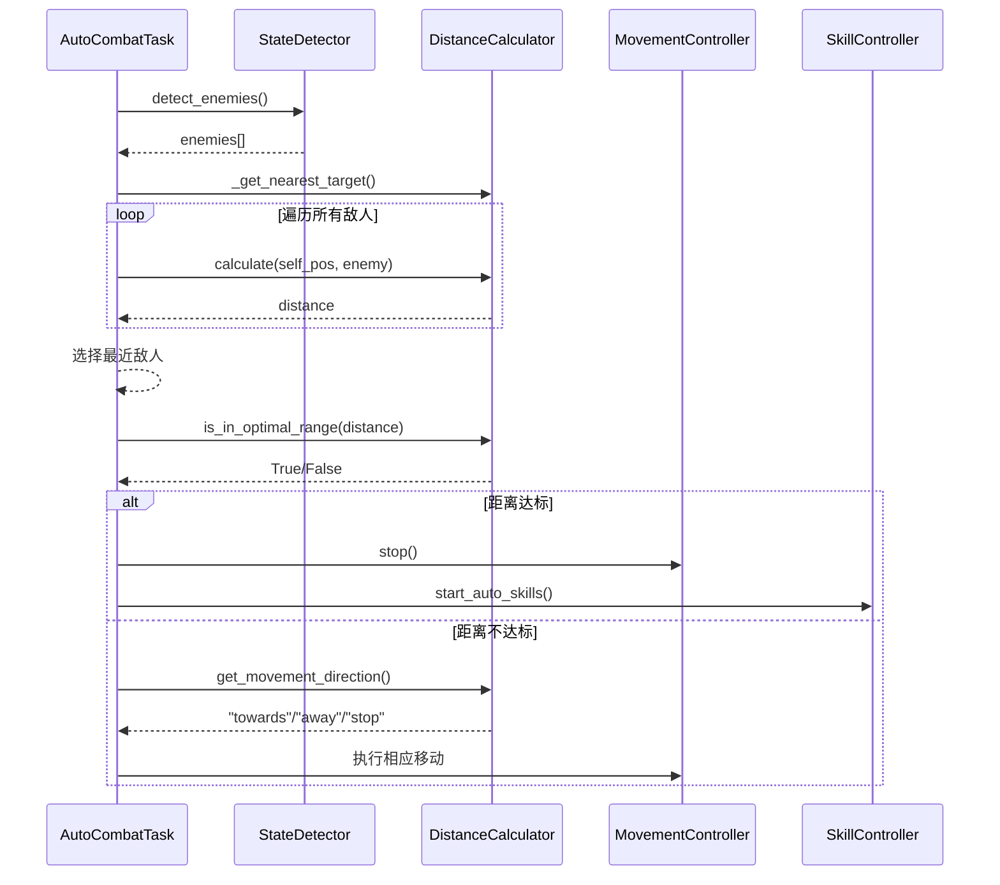
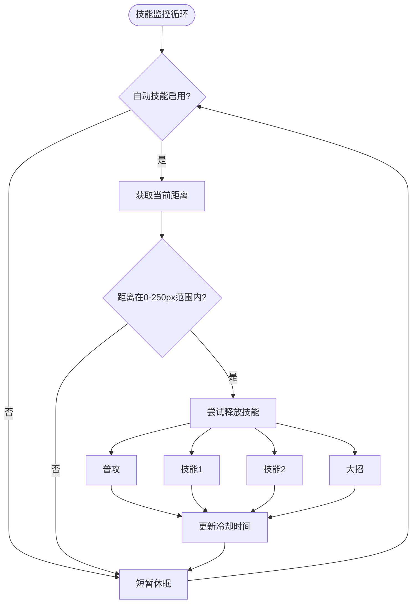
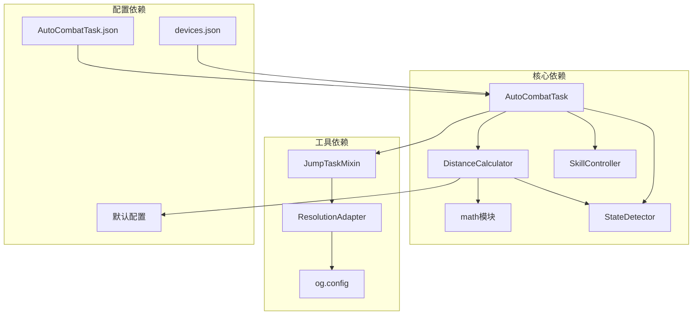

# 距离计算器

<cite>
**本文档引用的文件**
- [distance_calculator.py](file://src/combat/distance_calculator.py)
- [ResolutionAdapter.py](file://src/utils/ResolutionAdapter.py)
- [AutoCombatTask.py](file://src/task/AutoCombatTask.py)
- [state_detector.py](file://src/combat/state_detector.py)
- [labels.py](file://src/combat/labels.py)
- [mixins.py](file://src/task/mixins.py)
- [AutoCombatTask.json](file://configs/AutoCombatTask.json)
- [skill_controller.py](file://src/combat/skill_controller.py)
- [phase1_handler.py](file://src/tutorial/phase1_handler.py)
</cite>

## 更新摘要
**变更内容**
- 距离计算器最大最优距离阈值从200像素扩展到250像素
- 支持更灵活的战斗定位策略，扩大技能释放范围
- 相关组件同步更新以保持一致性

## 目录
1. [简介](#简介)
2. [项目结构](#项目结构)
3. [核心组件](#核心组件)
4. [架构概览](#架构概览)
5. [详细组件分析](#详细组件分析)
6. [依赖分析](#依赖分析)
7. [性能考虑](#性能考虑)
8. [故障排除指南](#故障排除指南)
9. [结论](#结论)
10. [附录](#附录)

## 简介
本文件详细介绍距离计算器的技术实现，包括欧几里得距离公式、坐标系转换和分辨率适配处理。文档涵盖不同游戏分辨率下的坐标映射机制、距离阈值设定、最近目标选择逻辑以及动态距离调整策略，并提供性能优化方案和精度保证措施。

**更新** 最大最优距离阈值已从200像素扩展到250像素，为自动战斗系统提供更灵活的战斗定位策略。

## 项目结构
该项目采用模块化设计，距离计算功能位于战斗模块中，配合分辨率适配器和自动战斗任务实现完整的自动化战斗系统。



**图表来源**
- [distance_calculator.py:1-197](file://src/combat/distance_calculator.py#L1-L197)
- [ResolutionAdapter.py:1-163](file://src/utils/ResolutionAdapter.py#L1-L163)
- [AutoCombatTask.py:1-693](file://src/task/AutoCombatTask.py#L1-L693)

**章节来源**
- [distance_calculator.py:1-197](file://src/combat/distance_calculator.py#L1-L197)
- [ResolutionAdapter.py:1-163](file://src/utils/ResolutionAdapter.py#L1-L163)
- [AutoCombatTask.py:1-693](file://src/task/AutoCombatTask.py#L1-L693)

## 核心组件
距离计算器是自动战斗系统的核心组件，负责计算战场单位间的距离并提供移动方向建议。

### 主要特性
- **带缓冲区的边界检测**：避免在边界值附近频繁切换状态
- **滞后效应**：进入范围和离开范围使用不同的阈值
- **动态距离调整**：根据距离状态自动调整移动方向
- **向量计算**：提供单位向量用于精确移动控制

**更新** 最大距离阈值从200像素提升至250像素，扩大了技能释放的有效范围。

**章节来源**
- [distance_calculator.py:14-27](file://src/combat/distance_calculator.py#L14-L27)

## 架构概览
距离计算器在整个自动战斗系统中的作用和交互关系如下：



**图表来源**
- [AutoCombatTask.py:288-344](file://src/task/AutoCombatTask.py#L288-L344)
- [distance_calculator.py:84-158](file://src/combat/distance_calculator.py#L84-L158)

## 详细组件分析

### 距离计算器类分析

#### 类结构图


**图表来源**
- [distance_calculator.py:14-197](file://src/combat/distance_calculator.py#L14-L197)
- [state_detector.py:24-446](file://src/combat/state_detector.py#L24-L446)
- [AutoCombatTask.py:321-647](file://src/task/AutoCombatTask.py#L321-L647)

#### 数学原理分析

**欧几里得距离公式实现**
距离计算器使用标准的欧几里得距离公式：
```
距离 = √[(x₂-x₁)² + (y₂-y₁)²]
```

该实现提供了两种计算方式：
1. **对象计算**：基于具有 `center_x` 和 `center_y` 属性的对象
2. **坐标计算**：基于直接的坐标参数

**滞后效应机制**
为了防止在边界值附近频繁切换状态，实现了滞回机制：



**图表来源**
- [distance_calculator.py:84-118](file://src/combat/distance_calculator.py#L84-L118)

#### 移动方向决策逻辑



**图表来源**
- [distance_calculator.py:120-158](file://src/combat/distance_calculator.py#L120-L158)

**章节来源**
- [distance_calculator.py:52-158](file://src/combat/distance_calculator.py#L52-L158)

### 分辨率适配器分析

#### 分辨率适配机制
分辨率适配器负责处理不同游戏分辨率下的坐标映射：



**图表来源**
- [ResolutionAdapter.py:34-44](file://src/utils/ResolutionAdapter.py#L34-L44)
- [ResolutionAdapter.py:104-146](file://src/utils/ResolutionAdapter.py#L104-L146)

#### 坐标转换算法
分辨率适配器提供了多种坐标转换方法：

1. **点坐标缩放**：`scale_point(x, y)`
2. **矩形框缩放**：`scale_box(x, y, width, height)`
3. **相对坐标转换**：`to_relative()` 和 `from_relative()`

**章节来源**
- [ResolutionAdapter.py:46-93](file://src/utils/ResolutionAdapter.py#L46-L93)

### 自动战斗任务集成

#### 距离计算在战斗中的应用
自动战斗任务中距离计算器的具体应用：



**图表来源**
- [AutoCombatTask.py:508-630](file://src/task/AutoCombatTask.py#L508-L630)
- [AutoCombatTask.py:321-344](file://src/task/AutoCombatTask.py#L321-L344)

**章节来源**
- [AutoCombatTask.py:508-630](file://src/task/AutoCombatTask.py#L508-L630)

### 技能控制器集成

#### 技能释放范围扩展
技能控制器现在支持更大的技能释放范围：



**图表来源**
- [skill_controller.py:244-292](file://src/combat/skill_controller.py#L244-L292)

**章节来源**
- [skill_controller.py:135-334](file://src/combat/skill_controller.py#L135-L334)

## 依赖分析

### 组件间依赖关系


**图表来源**
- [distance_calculator.py:11](file://src/combat/distance_calculator.py#L11)
- [AutoCombatTask.py:22-28](file://src/task/AutoCombatTask.py#L22-L28)
- [mixins.py:8](file://src/task/mixins.py#L8)

### 循环依赖检查
经过分析，项目中不存在循环依赖：
- 距离计算器不依赖其他战斗组件
- 状态检测器不依赖距离计算器
- 自动战斗任务同时依赖两者但形成单向依赖
- 分辨率适配器独立于战斗逻辑

**章节来源**
- [distance_calculator.py:1-197](file://src/combat/distance_calculator.py#L1-L197)
- [AutoCombatTask.py:1-693](file://src/task/AutoCombatTask.py#L1-L693)

## 性能考虑

### 算法复杂度分析
1. **距离计算复杂度**：O(1) - 欧几里得距离计算
2. **最近目标选择**：O(n) - 需要遍历所有目标
3. **状态判断**：O(1) - 基于滞回机制的状态检查

### 性能优化策略

#### 1. 距离计算优化
- 使用 `math.sqrt()` 替代 `pow()` 提升性能
- 避免重复计算：当距离已知时直接传入

#### 2. 状态缓存机制
- 滞回状态缓存避免重复计算
- 目标切换时重置状态

#### 3. 批量处理优化
- 在自动战斗中复用检测结果
- 避免重复的YOLO检测调用

#### 4. 内存管理
- 及时清理临时变量
- 合理使用对象属性

**更新** 更大的距离阈值可能略微增加计算负载，但影响微乎其微，主要收益是提升了战斗灵活性。

**章节来源**
- [distance_calculator.py:52-82](file://src/combat/distance_calculator.py#L52-L82)
- [AutoCombatTask.py:321-344](file://src/task/AutoCombatTask.py#L321-L344)

## 故障排除指南

### 常见问题及解决方案

#### 1. 距离计算异常
**问题**：距离计算结果异常或为负值
**原因**：坐标数据损坏或检测失败
**解决**：检查YOLO检测结果的置信度和坐标有效性

#### 2. 移动方向错误
**问题**：角色移动方向与预期相反
**原因**：滞回状态未正确初始化
**解决**：在切换目标时调用 `reset_state()`

#### 3. 分辨率适配问题
**问题**：点击位置与期望位置不符
**原因**：分辨率信息未正确更新
**解决**：确保在任务开始时调用 `update_resolution()`

#### 4. 性能问题
**问题**：自动战斗响应缓慢
**原因**：频繁的YOLO检测或不必要的计算
**解决**：优化检测频率，复用检测结果

#### 5. 技能释放范围问题
**问题**：技能释放范围过小或过大
**原因**：距离阈值配置不正确
**解决**：检查技能控制器的 `skill_range_max` 设置

**章节来源**
- [AutoCombatTask.py:679-692](file://src/task/AutoCombatTask.py#L679-L692)
- [mixins.py:104-121](file://src/task/mixins.py#L104-L121)

## 结论
距离计算器通过欧几里得距离公式和滞回机制实现了精确的距离计算和智能的移动控制。最新的250像素最大距离阈值扩展显著提升了系统的战斗灵活性，为玩家提供了更宽泛的技能释放策略空间。结合分辨率适配器，系统能够在不同游戏分辨率下保持稳定的性能表现。通过合理的配置管理和性能优化策略，该组件为自动战斗系统提供了可靠的基础支撑。

## 附录

### 配置参数说明

#### 距离计算参数
- `MIN_DISTANCE`：最小距离阈值（像素）- **保持不变：0像素**
- `MAX_DISTANCE`：最大距离阈值（像素）- **更新：从200像素扩展到250像素**
- `BUFFER`：边界缓冲区（像素）- **保持不变：15像素**

#### 自动战斗配置
- `移动持续时间(秒)`：每次移动按键持续时间
- `普攻间隔(秒)`：普通攻击冷却时间
- `技能1间隔(秒)`：技能1冷却时间
- `技能2间隔(秒)`：技能2冷却时间
- `大招间隔(秒)`：大招冷却时间

#### 技能控制器配置
- `skill_range_min`：技能释放范围最小值（像素）- **保持不变：0像素**
- `skill_range_max`：技能释放范围最大值（像素）- **更新：从200像素扩展到250像素**

**章节来源**
- [AutoCombatTask.json:1-13](file://configs/AutoCombatTask.json#L1-L13)
- [distance_calculator.py:29-34](file://src/combat/distance_calculator.py#L29-L34)
- [skill_controller.py:135-140](file://src/combat/skill_controller.py#L135-L140)