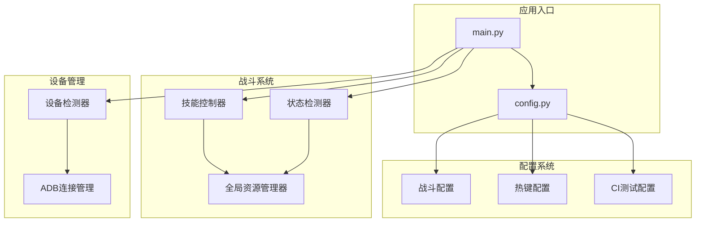
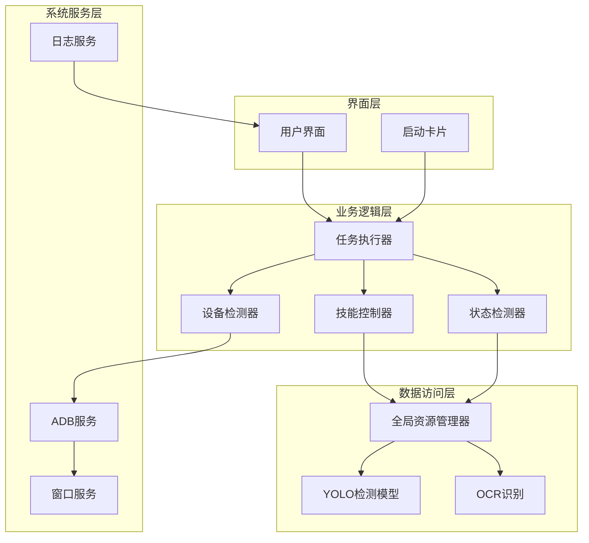
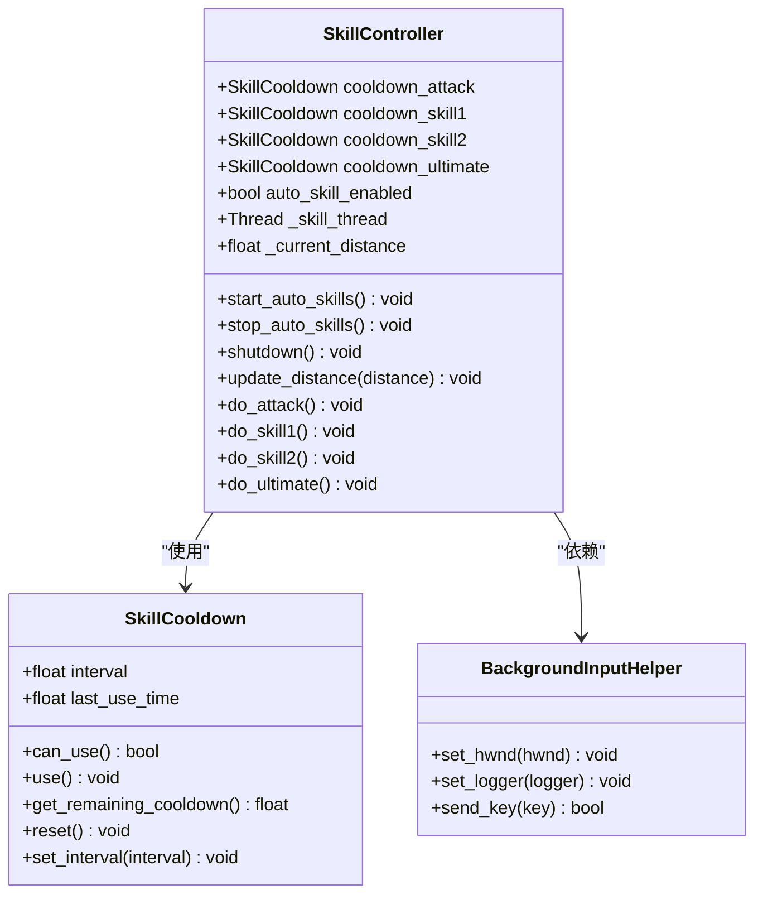
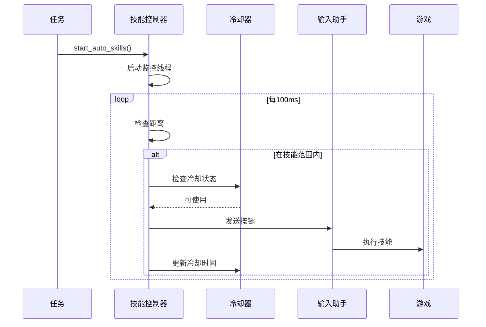
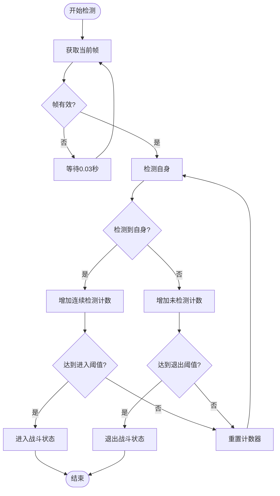
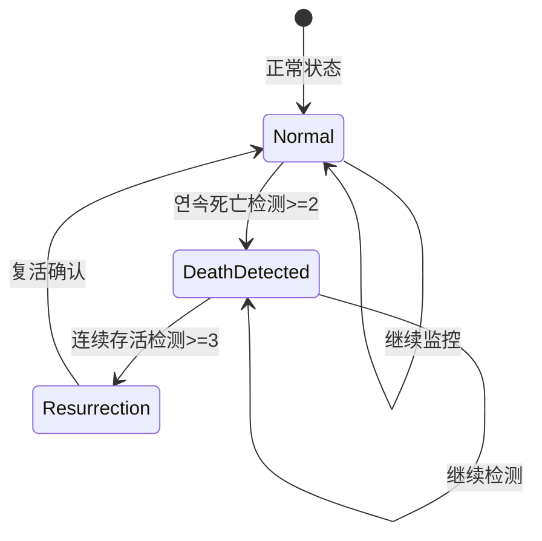
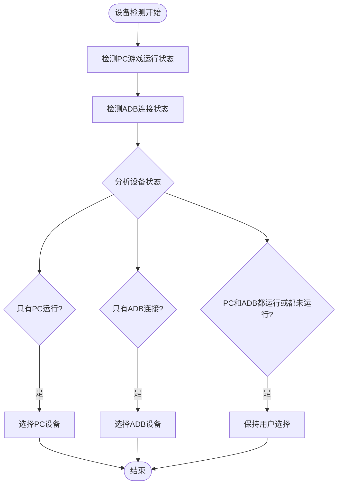
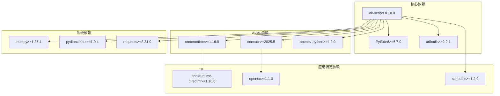

# 技能编写指南

<cite>
**本文档引用的文件**
- [main.py](file://main.py)
- [config.py](file://config.py)
- [requirements.txt](file://requirements.txt)
- [src/combat/skill_controller.py](file://src/combat/skill_controller.py)
- [src/combat/state_detector.py](file://src/combat/state_detector.py)
- [src/globals.py](file://src/globals.py)
- [src/utils/DeviceDetector.py](file://src/utils/DeviceDetector.py)
- [configs/AutoCombatTask.json](file://configs/AutoCombatTask.json)
- [configs/游戏热键配置.json](file://configs/游戏热键配置.json)
- [configs/CITestTask.json](file://configs/CITestTask.json)
</cite>

## 目录
1. [简介](#简介)
2. [项目结构](#项目结构)
3. [核心组件](#核心组件)
4. [架构概览](#架构概览)
5. [详细组件分析](#详细组件分析)
6. [依赖关系分析](#依赖关系分析)
7. [性能考虑](#性能考虑)
8. [故障排除指南](#故障排除指南)
9. [结论](#结论)

## 简介

这是一个基于 ok-script 框架开发的自动化测试工具，专门用于游戏《漫画群星：大集结》的自动化操作。该工具提供了完整的技能控制系统、战斗状态检测、设备管理等核心功能，支持 PC 端和移动端（ADB）两种运行模式。

## 项目结构

该项目采用模块化设计，主要分为以下几个核心部分：

**图表来源**
- [main.py:1-693](file://main.py#L1-L693)
- [config.py:1-146](file://config.py#L1-L146)

**章节来源**
- [main.py:1-693](file://main.py#L1-L693)
- [config.py:1-146](file://config.py#L1-L146)

## 核心组件

### 技能控制器 (SkillController)

技能控制器是战斗系统的核心组件，负责管理游戏技能的自动释放。它支持以下特性：

- **多技能独立冷却**：每个技能都有独立的冷却计时器
- **后台模式支持**：支持 Unity 游戏的后台操作
- **智能按键适配**：自动适配 PC 端键盘和移动端点击
- **实时距离监控**：基于距离判断技能释放时机

### 战斗状态检测器 (StateDetector)

负责实时监控战斗状态，包括：

- **死亡状态检测**：使用 YOLO 模型检测死亡状态
- **自身位置检测**：实时跟踪玩家角色位置
- **友方/敌方检测**：识别战场上的友方和敌方单位
- **战斗状态判断**：通过自身检测判断是否处于战斗状态

### 全局资源管理器 (Globals)

提供全局状态管理和资源共享：

- **登录状态管理**：跟踪用户的登录状态
- **OCR 缓存管理**：缓存 OCR 识别结果
- **YOLO 模型管理**：管理战斗检测模型
- **CI 测试状态管理**：跟踪 CI 自动化测试状态

**章节来源**
- [src/combat/skill_controller.py:1-589](file://src/combat/skill_controller.py#L1-L589)
- [src/combat/state_detector.py:1-589](file://src/combat/state_detector.py#L1-L589)
- [src/globals.py:1-406](file://src/globals.py#L1-L406)

## 架构概览

系统采用分层架构设计，各组件职责明确：

**图表来源**
- [main.py:673-693](file://main.py#L673-L693)
- [config.py:126-145](file://config.py#L126-L145)

## 详细组件分析

### 技能控制器详细分析

技能控制器实现了复杂的技能管理系统：

**图表来源**
- [src/combat/skill_controller.py:29-589](file://src/combat/skill_controller.py#L29-L589)

#### 技能释放流程

**图表来源**
- [src/combat/skill_controller.py:279-322](file://src/combat/skill_controller.py#L279-L322)

**章节来源**
- [src/combat/skill_controller.py:1-589](file://src/combat/skill_controller.py#L1-L589)

### 战斗状态检测器详细分析

状态检测器提供了全面的战场监控能力：

**图表来源**
- [src/combat/state_detector.py:510-554](file://src/combat/state_detector.py#L510-L554)

#### 死亡状态监控机制

**图表来源**
- [src/combat/state_detector.py:129-196](file://src/combat/state_detector.py#L129-L196)

**章节来源**
- [src/combat/state_detector.py:1-589](file://src/combat/state_detector.py#L1-L589)

### 设备检测器详细分析

设备检测器实现了智能设备选择功能：

**图表来源**
- [src/utils/DeviceDetector.py:113-134](file://src/utils/DeviceDetector.py#L113-L134)

**章节来源**
- [src/utils/DeviceDetector.py:1-149](file://src/utils/DeviceDetector.py#L1-149)

## 依赖关系分析

系统依赖关系复杂但层次清晰：

**图表来源**
- [requirements.txt:1-17](file://requirements.txt#L1-L17)

**章节来源**
- [requirements.txt:1-17](file://requirements.txt#L1-L17)

## 性能考虑

### 冷却系统优化

技能控制器采用了多线程和锁机制来确保冷却系统的准确性：

- **独立冷却线程**：每个技能都有独立的监控线程
- **线程安全锁**：使用 threading.Lock() 确保并发安全
- **智能休眠**：根据需求动态调整检查频率

### 检测性能优化

状态检测器实现了高效的检测算法：

- **快速检测间隔**：30ms 检测周期，保证响应速度
- **防抖动机制**：通过连续检测次数避免误判
- **异步监控**：死亡状态检测使用独立线程

### 内存管理

全局资源管理器提供了完善的资源管理：

- **延迟加载**：YOLO 模型按需加载
- **缓存机制**：OCR 结果缓存减少重复计算
- **资源清理**：提供资源重置和清理功能

## 故障排除指南

### 常见问题及解决方案

#### 技能释放问题

**问题**：技能无法正常释放
**原因**：窗口焦点或后台模式问题
**解决方案**：
1. 检查 `skip_pos_check` 配置
2. 验证后台输入助手初始化
3. 确认窗口句柄获取成功

#### 检测精度问题

**问题**：战斗状态检测不准确
**原因**：检测阈值或模型问题
**解决方案**：
1. 调整 YOLO 检测阈值
2. 检查模型文件完整性
3. 验证图像预处理

#### 设备连接问题

**问题**：ADB 连接失败
**原因**：模拟器未启动或端口冲突
**解决方案**：
1. 检查模拟器启动状态
2. 验证 ADB 端口配置
3. 确认防火墙设置

**章节来源**
- [main.py:22-47](file://main.py#L22-L47)
- [main.py:258-301](file://main.py#L258-L301)
- [src/combat/skill_controller.py:172-201](file://src/combat/skill_controller.py#L172-L201)

## 结论

本技能编写指南详细介绍了基于 ok-script 框架的游戏自动化工具的设计理念和实现细节。系统通过模块化设计实现了高度的可维护性和扩展性，为游戏自动化提供了完整的技术解决方案。

关键特性包括：
- **灵活的技能控制系统**：支持多种技能和冷却机制
- **智能的设备管理**：自动选择最优的运行设备
- **高效的战斗检测**：实时监控战场状态
- **完善的错误处理**：提供健壮的异常处理机制

该系统为类似的游戏自动化项目提供了优秀的参考模板，其模块化架构和设计模式值得其他开发者借鉴学习。